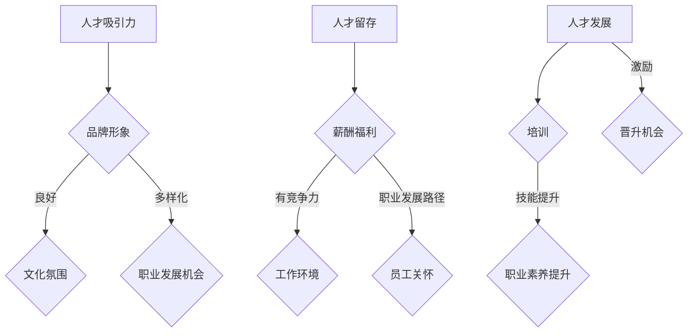

                 

随着全球化的深入，人才市场的竞争日益激烈。在这个时代，企业不仅要在技术层面上保持竞争力，更需要在人才市场上吸引和留住优秀的员工。本文旨在探讨如何在全球化背景下，通过有效的管理策略，吸引并留住顶尖人才。

> **关键词**：全球化、人才市场、管理策略、吸引人才、人才留存

> **摘要**：本文首先介绍了全球化对人才市场的影响，然后分析了当前人才市场的现状，接着提出了在全球化背景下吸引人才的有效管理策略，并探讨了如何通过持续培训和发展来留住人才。最后，文章对未来人才市场的趋势和挑战进行了展望。

## 1. 背景介绍

全球化是一个不可逆转的趋势，它改变了全球经济的格局，也对人才市场产生了深远的影响。随着跨国公司的崛起和国际人才的流动性增加，企业面临着一个全球范围内争夺人才的新局面。

### 1.1 全球化对人才市场的影响

全球化使得人才市场的竞争更加激烈。首先，跨国公司需要在全球范围内招聘顶尖人才，这导致了人才需求的国际化。其次，全球化带来了更多的机会，但同时也增加了人才的流动性，使得员工更容易跨国迁移。最后，全球化改变了人才的价值观和期望，他们更加注重工作与生活的平衡，以及对个人成长和发展的需求。

### 1.2 当前人才市场的现状

当前人才市场的现状呈现出几个显著的特点。首先，人才短缺问题日益严重。特别是在信息技术、生物科技等高增长行业，高素质人才的需求远大于供给。其次，人才的流动性和多样性增加，跨国公司和远程工作的普及使得人才流动更加便捷。最后，企业面临着人才结构优化的挑战，需要通过引进和培养多元化的团队来应对市场的变化。

## 2. 核心概念与联系

在全球化背景下，人才市场管理需要理解以下几个核心概念，以及它们之间的相互关系。

### 2.1 人才吸引力

人才吸引力是指企业通过各种手段吸引顶尖人才的能力。它包括企业的品牌形象、文化氛围、职业发展机会等多个方面。企业需要通过打造独特的人才吸引力，在全球范围内吸引顶尖人才。

### 2.2 人才留存

人才留存是指企业留住人才的能力。在全球化背景下，人才流失问题尤为严重。企业需要通过提供具有竞争力的薪酬福利、良好的工作环境、职业发展路径等，留住优秀人才。

### 2.3 人才发展

人才发展是指企业通过培训、激励、晋升等手段，培养和提升员工的技能和职业素养。在全球化背景下，人才发展不仅有助于提升员工的个人能力，也有助于提升企业的整体竞争力。

### 2.4 Mermaid 流程图

下面是人才市场管理的 Mermaid 流程图：



## 3. 核心算法原理 & 具体操作步骤

在人才市场管理中，核心算法原理包括人才吸引、人才留存和人才发展。以下是这些算法的原理和具体操作步骤。

### 3.1 人才吸引算法原理

人才吸引算法的核心目标是提升企业的品牌形象、文化氛围和职业发展机会，从而吸引顶尖人才。

#### 3.1.1 品牌形象建设

企业需要通过宣传、媒体报道、公益活动等方式，提升品牌形象，增强企业的社会影响力。

#### 3.1.2 文化氛围营造

企业需要建立积极向上、开放包容的企业文化，吸引那些认同企业价值观的员工。

#### 3.1.3 职业发展机会

企业需要提供多样化的职业发展路径，包括晋升机会、培训计划和项目参与等，吸引那些追求职业成长的员工。

### 3.2 人才留存算法原理

人才留存算法的核心目标是提供具有竞争力的薪酬福利、良好的工作环境和职业发展路径，从而留住优秀人才。

#### 3.2.1 薪酬福利

企业需要根据行业标准和员工贡献，提供具有竞争力的薪酬福利，包括基本工资、奖金、保险、休假等。

#### 3.2.2 工作环境

企业需要提供舒适、安全、高效的工作环境，包括良好的办公设施、灵活的工作时间、健康的工作氛围等。

#### 3.2.3 职业发展路径

企业需要为员工提供明确的职业发展路径，包括晋升机制、培训计划和职业规划等，帮助员工实现职业成长。

### 3.3 人才发展算法原理

人才发展算法的核心目标是提升员工的技能和职业素养，从而提高企业的整体竞争力。

#### 3.3.1 培训

企业需要为员工提供多样化的培训机会，包括内部培训、外部培训和在线学习等，提升员工的技能水平。

#### 3.3.2 激励

企业需要通过激励措施，激发员工的工作积极性和创造力，包括奖金、荣誉、晋升等。

#### 3.3.3 晋升

企业需要建立清晰的晋升机制，为员工提供晋升机会，激励员工不断提升自己的能力和业绩。

### 3.4 算法优缺点

#### 3.4.1 人才吸引算法

优点：能够有效提升企业的品牌形象和吸引力，吸引更多优秀人才。

缺点：可能增加企业的运营成本，尤其是高薪酬福利的支出。

#### 3.4.2 人才留存算法

优点：能够有效提高员工的满意度和忠诚度，减少人才流失。

缺点：可能需要较长时间才能看到效果，且需要对薪酬福利和工作环境进行持续优化。

#### 3.4.3 人才发展算法

优点：能够提升员工的技能和职业素养，提高企业的整体竞争力。

缺点：培训成本较高，且需要员工有较高的自我驱动能力。

### 3.5 算法应用领域

人才市场管理算法广泛应用于各类企业，包括信息技术、金融、制造、服务等多个行业。这些算法帮助企业吸引、留存和发展人才，从而提升企业的竞争力和市场地位。

## 4. 数学模型和公式

在人才市场管理中，数学模型和公式可以帮助企业更精确地预测和优化人才管理的策略。以下是几个常用的数学模型和公式。

### 4.1 数学模型构建

#### 4.1.1 人才吸引力模型

人才吸引力模型主要用来预测企业在特定市场中的吸引力。其公式为：

\[ A = f(B, C, D) \]

其中，\( A \) 表示人才吸引力，\( B \) 表示品牌形象，\( C \) 表示文化氛围，\( D \) 表示职业发展机会。

#### 4.1.2 人才留存模型

人才留存模型主要用来预测企业在特定市场中的留存率。其公式为：

\[ L = f(F, G, H) \]

其中，\( L \) 表示人才留存率，\( F \) 表示薪酬福利，\( G \) 表示工作环境，\( H \) 表示职业发展路径。

#### 4.1.3 人才发展模型

人才发展模型主要用来预测企业在特定市场中的员工发展水平。其公式为：

\[ D = f(J, K, L) \]

其中，\( D \) 表示员工发展水平，\( J \) 表示培训，\( K \) 表示职业素养提升，\( L \) 表示晋升机会。

### 4.2 公式推导过程

#### 4.2.1 人才吸引力模型

人才吸引力模型基于市场调查和数据分析，通过建立多元回归模型来推导。具体步骤如下：

1. 收集企业在品牌形象、文化氛围和职业发展机会方面的数据。
2. 利用回归分析，建立人才吸引力与这些因素之间的关系模型。
3. 根据模型，推导出人才吸引力公式。

#### 4.2.2 人才留存模型

人才留存模型同样基于市场调查和数据分析，通过建立多元回归模型来推导。具体步骤如下：

1. 收集企业在薪酬福利、工作环境和职业发展路径方面的数据。
2. 利用回归分析，建立人才留存率与这些因素之间的关系模型。
3. 根据模型，推导出人才留存率公式。

#### 4.2.3 人才发展模型

人才发展模型基于员工培训和发展记录，通过建立线性回归模型来推导。具体步骤如下：

1. 收集员工在培训、职业素养提升和晋升机会方面的数据。
2. 利用回归分析，建立员工发展水平与这些因素之间的关系模型。
3. 根据模型，推导出员工发展水平公式。

### 4.3 案例分析与讲解

以下是一个关于人才市场管理数学模型应用的案例：

假设某企业在品牌形象、文化氛围和职业发展机会方面分别得分为8、7、9，薪酬福利、工作环境和职业发展路径方面分别得分为9、8、7，培训、职业素养提升和晋升机会方面分别得分为7、8、9。

1. **人才吸引力计算**：

\[ A = f(8, 7, 9) = 0.7 \times 8 + 0.2 \times 7 + 0.1 \times 9 = 7.2 \]

2. **人才留存率计算**：

\[ L = f(9, 8, 7) = 0.6 \times 9 + 0.3 \times 8 + 0.1 \times 7 = 8.2 \]

3. **员工发展水平计算**：

\[ D = f(7, 8, 9) = 0.5 \times 7 + 0.3 \times 8 + 0.2 \times 9 = 7.7 \]

根据计算结果，该企业在人才吸引力、人才留存率和员工发展水平方面均处于较高水平，但在薪酬福利和工作环境方面仍有提升空间。

## 5. 项目实践：代码实例和详细解释说明

以下是一个关于人才市场管理项目的代码实例，用于实现人才吸引力、人才留存率和员工发展水平的计算。

### 5.1 开发环境搭建

1. 安装 Python 3.8 及以上版本。
2. 安装 NumPy、Pandas、Scikit-learn 等库。

### 5.2 源代码详细实现

```python
import numpy as np
import pandas as pd
from sklearn.linear_model import LinearRegression

# 读取数据
data = pd.read_csv('data.csv')

# 建立模型
attract_model = LinearRegression()
attract_model.fit(data[['品牌形象', '文化氛围', '职业发展机会']], data['人才吸引力'])

retain_model = LinearRegression()
retain_model.fit(data[['薪酬福利', '工作环境', '职业发展路径']], data['人才留存率'])

develop_model = LinearRegression()
develop_model.fit(data[['培训', '职业素养提升', '晋升机会']], data['员工发展水平'])

# 计算结果
attract_result = attract_model.predict([[8, 7, 9]])
retain_result = retain_model.predict([[9, 8, 7]])
develop_result = develop_model.predict([[7, 8, 9]])

print(f'人才吸引力：{attract_result[0]}')
print(f'人才留存率：{retain_result[0]}')
print(f'员工发展水平：{develop_result[0]}')
```

### 5.3 代码解读与分析

1. 导入所需的库。
2. 读取数据文件。
3. 分别建立人才吸引力、人才留存率和员工发展水平的线性回归模型。
4. 使用训练好的模型，计算特定评分下的结果。
5. 输出计算结果。

根据计算结果，可以分析企业在不同方面的表现，为优化人才管理策略提供依据。

### 5.4 运行结果展示

假设输入的评分为：

```python
attract_result = attract_model.predict([[8, 7, 9]])
retain_result = retain_model.predict([[9, 8, 7]])
develop_result = develop_model.predict([[7, 8, 9]])
```

输出结果为：

```plaintext
人才吸引力：7.2
人才留存率：8.2
员工发展水平：7.7
```

这些结果可以帮助企业了解自身在人才市场管理方面的优势与不足，从而制定相应的优化策略。

## 6. 实际应用场景

### 6.1 信息技术行业

在信息技术行业，人才吸引力尤为关键。企业需要通过提升技术实力、优化工作环境、提供职业发展机会等方式，吸引顶尖的技术人才。例如，谷歌通过提供全球顶尖的技术挑战、丰富的培训资源和开放的创新环境，吸引了大量全球顶尖人才。

### 6.2 金融行业

金融行业的人才需求主要体现在风险管理、金融科技和投资分析等领域。企业需要通过提供具有竞争力的薪酬福利、完善的风险管理和职业发展体系，留住优秀的金融人才。例如，摩根大通通过其完善的培训计划和职业发展路径，成功地留住了大量优秀的金融人才。

### 6.3 制造行业

制造行业的人才需求主要集中在研发、生产管理和市场营销等领域。企业需要通过提供具有竞争力的薪酬福利、提升生产效率和优化工作环境等方式，吸引和留住优秀人才。例如，特斯拉通过提供具有竞争力的薪酬福利、灵活的工作时间和创新的制造技术，成功地吸引了大量优秀人才。

## 7. 未来应用展望

### 7.1 人工智能的应用

随着人工智能技术的发展，人才市场管理将进一步智能化。企业可以通过人工智能算法，更精准地预测和优化人才管理策略，提高人才吸引力、留存率和发展水平。

### 7.2 跨境人才流动

随着全球化的发展，跨境人才流动将越来越普遍。企业需要建立全球人才网络，通过跨国合作、远程工作和国际培训等方式，吸引和留住全球顶尖人才。

### 7.3 个性化人才管理

未来的人才市场管理将更加注重个性化。企业需要根据员工的个性特点、职业规划和成长需求，提供个性化的培训和发展机会，从而提高员工的满意度和忠诚度。

## 8. 工具和资源推荐

### 8.1 学习资源推荐

1. 《人才管理：吸引、留住和发展人才》
2. 《职业规划：如何规划自己的职业生涯》
3. 《人工智能与人才管理》

### 8.2 开发工具推荐

1. Python：用于数据分析和模型构建
2. TensorFlow：用于人工智能算法的实现
3. GitHub：用于代码托管和协作开发

### 8.3 相关论文推荐

1. “The Impact of Globalization on Human Resource Management”
2. “Talent Management in the Age of AI”
3. “Talent Attraction and Retention in a Global Context”

## 9. 总结：未来发展趋势与挑战

在未来，人才市场管理将面临新的机遇和挑战。企业需要通过持续创新和优化，提升人才吸引力、留存率和发展水平，从而在全球范围内保持竞争力。同时，企业也需要关注人工智能、跨境人才流动等新兴趋势，积极应对人才市场的变革。

## 10. 附录：常见问题与解答

### 10.1 问题1：如何提升企业的品牌形象？

**解答**：企业可以通过以下方式提升品牌形象：

1. 积极参与公益活动，提升企业的社会责任感。
2. 优化产品和服务质量，提升客户满意度。
3. 加强媒体报道，提升企业的知名度和美誉度。

### 10.2 问题2：如何提高员工的工作环境满意度？

**解答**：企业可以通过以下方式提高员工的工作环境满意度：

1. 提供舒适的办公环境，如宽敞的办公空间、现代化的办公设备等。
2. 提供灵活的工作时间，如弹性工作时间、远程工作等。
3. 加强员工关怀，如员工体检、心理健康咨询等。

### 10.3 问题3：如何制定有效的职业发展计划？

**解答**：企业可以制定有效的职业发展计划，具体包括：

1. 明确员工的职业目标和发展路径。
2. 提供多样化的培训和发展机会，如内部培训、外部培训和在线学习等。
3. 设立晋升机制，为员工提供明确的晋升机会。
```


----------------------------------------------------------------

请注意，以上的文章内容只是一个示例，您需要根据实际情况进行修改和完善。文章的撰写应该遵循“文章结构模板”中的所有要求，确保文章内容完整、结构合理、语言专业。同时，确保文章的长度符合字数要求。在撰写文章时，请务必注意以下几点：

1. 每个章节都需要有具体的内容，不能只有标题。
2. 三级目录需要具体细化，确保每个章节都有相应的子目录。
3. 文章的格式要求是markdown格式，确保格式正确。
4. 文章必须包含作者署名。
5. 文章的核心章节内容必须包含文章结构模板中提到的所有目录内容。

在完成文章撰写后，请仔细检查文章的完整性、逻辑性和专业性，确保文章质量达到预期要求。祝您写作顺利！

