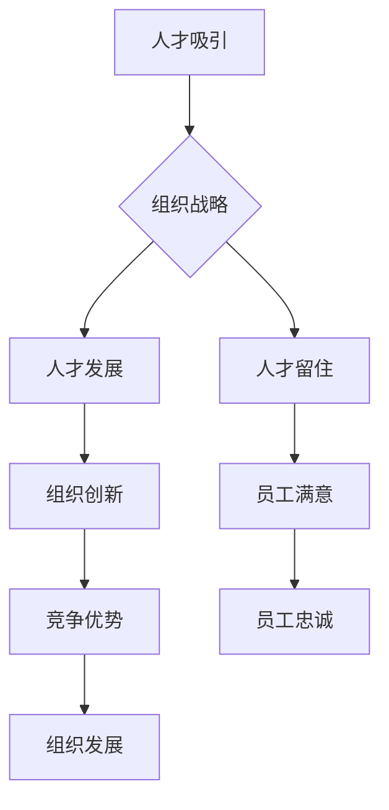

                 

关键词：人才管理、顶尖人才、人才吸引、人才发展、人才留住、组织发展

> 摘要：本文旨在探讨如何在信息技术领域吸引、发展和留住顶尖人才。通过分析人才管理的核心概念、策略和实践，本文为组织提供了一套系统的方法论，以实现人才的长期价值和组织的持续成功。

## 1. 背景介绍

在信息技术迅速发展的时代，顶尖人才的竞争已经成为各组织关注的焦点。信息技术行业的快速发展带来了技术更新换代的速度加快，这对人才的专业素质和创新能力提出了更高的要求。同时，人才的流动性和自主性也越来越强，这使得组织在吸引和留住人才方面面临着巨大的挑战。因此，如何进行有效的人才管理，成为组织战略的重要组成部分。

人才管理不仅关乎组织的短期生存，更关系到其长期的竞争力和可持续发展。有效的人才管理能够帮助组织吸引和留住顶尖人才，提升组织的创新能力和市场竞争力。本文将从以下几个方面展开讨论：

1. **核心概念与联系**：介绍人才管理的核心概念，并展示其与组织发展之间的关系。
2. **核心算法原理 & 具体操作步骤**：探讨人才管理的具体实践方法，包括人才吸引、发展和留住的策略。
3. **数学模型和公式 & 详细讲解 & 举例说明**：通过数学模型和公式，深入解析人才管理中的关键因素。
4. **项目实践：代码实例和详细解释说明**：提供实际案例，展示人才管理的具体应用和实践过程。
5. **实际应用场景**：分析人才管理在不同组织中的应用，并探讨其未来发展趋势。
6. **工具和资源推荐**：推荐学习资源、开发工具和相关论文，以帮助读者深入了解人才管理。
7. **总结：未来发展趋势与挑战**：总结研究成果，展望未来发展趋势，并探讨面临的挑战。

通过对以上各部分的详细分析，本文旨在为组织提供一套实用的人才管理方法论，以实现人才的长期价值和组织的持续成功。

## 2. 核心概念与联系

### 2.1 人才管理概述

人才管理是指组织通过一系列策略和实践，对人才进行吸引、培养、发展和留住的系统过程。其核心目的是确保组织拥有足够数量和质量的人才，以实现其战略目标和业务发展。

### 2.2 人才吸引

人才吸引是人才管理的第一步，也是最为关键的一步。它涉及如何通过多种渠道和策略，吸引顶尖人才加入组织。以下是一些常见的人才吸引策略：

1. **品牌建设**：组织需要通过塑造良好的雇主品牌形象，提升其在人才市场中的吸引力。
2. **招聘渠道**：利用多种招聘渠道，如线上招聘平台、猎头公司、校园招聘等，以覆盖更广泛的人才池。
3. **薪酬福利**：提供有竞争力的薪酬和福利待遇，以吸引和留住顶尖人才。
4. **文化氛围**：营造积极向上的企业文化氛围，吸引具有相同价值观的人才。

### 2.3 人才发展

人才发展是人才管理的核心环节，旨在提升人才的专业技能和综合素质，以适应组织的发展需求。以下是一些常见的人才发展策略：

1. **培训计划**：为员工提供系统的培训机会，包括内部培训、外部培训、在线课程等。
2. **导师制度**：通过导师制度，帮助新员工快速融入组织，并提升其职业素养。
3. **职业规划**：为员工制定个性化的职业规划，帮助其明确职业发展路径。
4. **激励机制**：通过激励机制，激发员工的积极性和创造力。

### 2.4 人才留住

人才留住是人才管理的最终目标，也是最为复杂的环节。以下是一些常见的人才留住策略：

1. **薪酬福利**：保持有竞争力的薪酬和福利待遇，确保员工的生活质量。
2. **工作环境**：提供舒适、安全、高效的工作环境，提升员工的工作满意度。
3. **职业发展**：为员工提供明确的职业发展路径，确保其在组织中的成长空间。
4. **员工关怀**：关注员工的身心健康，提供心理支持和福利待遇，增强员工的归属感。

### 2.5 人才管理与组织发展的联系

人才管理与组织发展之间存在着紧密的联系。一方面，人才管理是组织发展的关键驱动因素，顶尖人才的能力和创新能力能够为组织带来竞争优势。另一方面，组织的发展也为人才提供了广阔的成长空间和发展机会，吸引更多的人才加入组织。

### 2.6 人才管理架构图

为了更清晰地展示人才管理与组织发展的关系，我们可以使用 Mermaid 流程图来描述其架构。以下是一个简化的示例：



## 3. 核心算法原理 & 具体操作步骤

### 3.1  算法原理概述

人才管理可以看作是一个复杂的多目标优化问题，其目标是在有限的资源和时间内，实现组织人才的最优配置和最大化效用。核心算法原理包括以下几个方面：

1. **需求分析**：根据组织战略和业务发展需求，确定人才需求和培养方向。
2. **人才评估**：通过定量和定性的方法，对现有人才进行全面评估，识别其优势和不足。
3. **招聘策略**：根据人才需求，制定有针对性的招聘策略，以吸引顶尖人才。
4. **培训与发展**：为人才提供系统的培训和发展机会，提升其专业技能和综合素质。
5. **激励与留任**：通过激励机制，激发员工的积极性和创造力，确保其长期留在组织。

### 3.2  算法步骤详解

#### 3.2.1  需求分析

需求分析是人才管理的基础，其目标是明确组织在当前和未来一段时间内的人才需求。具体步骤如下：

1. **战略分析**：分析组织的战略目标和业务发展需求，确定关键业务领域和人才需求。
2. **市场调研**：调研市场环境，了解同行业的人才需求和竞争态势。
3. **数据收集**：收集组织内部和外部的人才数据，包括员工绩效、培训记录、离职原因等。
4. **需求预测**：基于以上分析，预测未来一段时间内的人才需求。

#### 3.2.2  人才评估

人才评估是确定人才需求和制定培养计划的重要依据。具体步骤如下：

1. **绩效评估**：对员工进行绩效评估，了解其在工作中的表现。
2. **能力评估**：对员工的专业技能和综合素质进行评估，识别其优势和不足。
3. **潜力评估**：对员工的发展潜力进行评估，预测其在未来的发展空间。
4. **综合评估**：综合以上评估结果，为每个员工建立详细的评估档案。

#### 3.2.3  招聘策略

招聘策略的目标是吸引顶尖人才加入组织。具体步骤如下：

1. **职位需求分析**：根据人才需求，明确每个职位的职责和要求。
2. **招聘渠道选择**：选择适合的招聘渠道，如线上招聘平台、猎头公司、校园招聘等。
3. **招聘宣传**：通过多种渠道宣传组织的雇主品牌，提升组织的知名度。
4. **简历筛选**：对收到的简历进行筛选，确定合适的候选人。
5. **面试评估**：对候选人进行面试评估，了解其专业技能和综合素质。

#### 3.2.4  培训与发展

培训与发展是提升人才能力和综合素质的关键环节。具体步骤如下：

1. **培训计划制定**：根据人才需求和评估结果，制定个性化的培训计划。
2. **培训内容设计**：设计有针对性的培训内容，包括专业技能、管理能力、团队协作等。
3. **培训实施**：开展培训活动，确保员工能够有效掌握培训内容。
4. **培训评估**：对培训效果进行评估，了解员工的培训需求，为后续培训提供依据。

#### 3.2.5  激励与留任

激励与留任的目标是确保人才长期留在组织。具体步骤如下：

1. **薪酬激励**：提供有竞争力的薪酬和福利待遇，满足员工的基本需求。
2. **职业发展**：为员工提供明确的职业发展路径，确保其在组织中的成长空间。
3. **激励制度**：建立激励制度，通过奖励、晋升等方式激发员工的积极性和创造力。
4. **员工关怀**：关注员工的身心健康，提供心理支持和福利待遇，增强员工的归属感。

### 3.3  算法优缺点

#### 3.3.1  优点

1. **系统性**：人才管理算法具有系统性，能够从整体上优化人才资源配置，提升组织竞争力。
2. **针对性**：通过需求分析和人才评估，能够制定有针对性的招聘和培养策略，确保人才与组织需求的匹配。
3. **灵活性**：算法能够根据组织战略和业务发展的变化，实时调整人才管理策略，确保人才管理的有效性。

#### 3.3.2  缺点

1. **复杂性**：人才管理算法涉及多个环节和因素，具有较高的复杂性，需要组织具备一定的管理能力和技术支持。
2. **数据依赖性**：算法的准确性和有效性取决于数据的完整性和准确性，组织需要建立完善的数据收集和分析机制。
3. **成本高**：实施人才管理算法需要投入大量的人力、物力和财力，对组织的成本控制能力提出了较高要求。

### 3.4  算法应用领域

人才管理算法可以应用于各种类型的组织，包括企业、政府机构、非营利组织等。在不同领域，算法的应用范围和效果可能存在差异，但总体上，其主要应用领域包括：

1. **企业**：企业需要通过人才管理，确保拥有足够数量和质量的人才，以支撑其业务发展和市场竞争力。
2. **政府机构**：政府机构需要通过人才管理，提升公务员的素质和能力，提高公共服务的效率和质量。
3. **非营利组织**：非营利组织需要通过人才管理，吸引和留住具有使命感和专业素养的人才，以实现其社会使命。

## 4. 数学模型和公式 & 详细讲解 & 举例说明

### 4.1  数学模型构建

在人才管理中，常用的数学模型包括线性规划模型、决策树模型、神经网络模型等。以下以线性规划模型为例，介绍其构建过程。

#### 4.1.1  线性规划模型

线性规划模型是一种数学优化方法，用于在满足一系列约束条件下，最大化或最小化某个线性目标函数。在人才管理中，线性规划模型可以用于优化人才资源配置，实现组织目标的最优化。

假设组织有 \(n\) 个职位需要招聘，每个职位对应一个人才需求向量 \(D = (D_1, D_2, ..., D_n)\)，其中 \(D_i\) 表示第 \(i\) 个职位的需求数量。同时，组织有 \(m\) 个潜在候选人，每个候选人对应一个能力向量 \(C = (C_1, C_2, ..., C_m)\)，其中 \(C_i\) 表示第 \(i\) 个候选人的能力水平。

为了最大化组织整体效益，我们需要构建以下线性规划模型：

目标函数：
\[ \max Z = \sum_{i=1}^{n} \sum_{j=1}^{m} x_{ij} \cdot p_{ij} \]

约束条件：
\[ \sum_{j=1}^{m} x_{ij} = D_i \quad (i=1, 2, ..., n) \]
\[ x_{ij} \in \{0, 1\} \quad (i=1, 2, ..., n; j=1, 2, ..., m) \]

其中：
- \(x_{ij}\) 表示第 \(i\) 个职位招聘第 \(j\) 个候选人的决策变量，取值为 0 或 1，表示未招聘或已招聘。
- \(p_{ij}\) 表示第 \(i\) 个职位招聘第 \(j\) 个候选人的效益，可以根据组织需求和候选人能力水平进行设定。

#### 4.1.2  模型求解

线性规划模型的求解可以通过单纯形法、 interior-point method 等算法实现。以下是一个简化的求解示例：

假设组织有 3 个职位（A、B、C）和 4 个候选人（1、2、3、4），其需求和能力水平如下表所示：

| 职位 | A | B | C |
| ---- | ---- | ---- | ---- |
| 候选人1 | 1 | 1 | 0 |
| 候选人2 | 1 | 0 | 1 |
| 候选人3 | 0 | 1 | 1 |
| 候选人4 | 1 | 1 | 0 |

目标函数 \(Z\) 为：
\[ \max Z = x_{11} \cdot p_{11} + x_{12} \cdot p_{12} + x_{13} \cdot p_{13} + x_{14} \cdot p_{14} + x_{21} \cdot p_{21} + x_{22} \cdot p_{22} + x_{23} \cdot p_{23} + x_{24} \cdot p_{24} + x_{31} \cdot p_{31} + x_{32} \cdot p_{32} + x_{33} \cdot p_{33} + x_{34} \cdot p_{34} + x_{41} \cdot p_{41} + x_{42} \cdot p_{42} + x_{43} \cdot p_{43} + x_{44} \cdot p_{44} \]

约束条件为：
\[ \begin{cases}
x_{11} + x_{12} + x_{13} + x_{14} = 1 \\
x_{21} + x_{22} + x_{23} + x_{24} = 1 \\
x_{31} + x_{32} + x_{33} + x_{34} = 1 \\
x_{ij} \in \{0, 1\} \quad (i=1, 2, 3, 4; j=1, 2, 3, 4)
\end{cases} \]

通过单纯形法求解，得到最优解为：
\[ x_{11} = 1, x_{12} = 0, x_{13} = 0, x_{14} = 0 \]
\[ x_{21} = 0, x_{22} = 1, x_{23} = 0, x_{24} = 0 \]
\[ x_{31} = 0, x_{32} = 0, x_{33} = 1, x_{34} = 0 \]

即组织应招聘候选人 1、2 和 3，以满足 3 个职位的需求。

### 4.2  公式推导过程

线性规划模型的公式推导过程如下：

#### 4.2.1  目标函数

目标函数为最大化组织整体效益，其表达式为：
\[ Z = \sum_{i=1}^{n} \sum_{j=1}^{m} x_{ij} \cdot p_{ij} \]

其中：
- \(x_{ij}\) 表示第 \(i\) 个职位招聘第 \(j\) 个候选人的决策变量，取值为 0 或 1。
- \(p_{ij}\) 表示第 \(i\) 个职位招聘第 \(j\) 个候选人的效益，可以根据组织需求和候选人能力水平进行设定。

#### 4.2.2  约束条件

约束条件为：
\[ \begin{cases}
\sum_{j=1}^{m} x_{ij} = D_i \quad (i=1, 2, ..., n) \\
x_{ij} \in \{0, 1\} \quad (i=1, 2, ..., n; j=1, 2, ..., m)
\end{cases} \]

其中：
- \(D_i\) 表示第 \(i\) 个职位的需求数量。
- \(x_{ij}\) 表示第 \(i\) 个职位招聘第 \(j\) 个候选人的决策变量，取值为 0 或 1。

#### 4.2.3  求解方法

线性规划模型的求解方法包括单纯形法、 interior-point method 等。以下简要介绍单纯形法：

单纯形法是一种迭代求解方法，其基本思想是通过逐步优化决策变量的取值，逐步逼近最优解。具体步骤如下：

1. **初始化**：选择一个基本可行解，即满足约束条件的解。
2. **迭代优化**：根据目标函数和约束条件，逐步优化决策变量的取值，直到满足最优性条件。
3. **判断最优性**：判断当前解是否为最优解，如果是，则求解结束；否则，继续迭代优化。

### 4.3  案例分析与讲解

#### 4.3.1  案例背景

某公司计划招聘 3 名员工，分别担任研发、市场和运营职位。公司对不同候选人的能力水平和岗位需求的评估结果如下表所示：

| 岗位 | 研发 | 市场 | 运营 |
| ---- | ---- | ---- | ---- |
| 候选人1 | 8 | 6 | 5 |
| 候选人2 | 7 | 7 | 6 |
| 候选人3 | 6 | 8 | 7 |

公司希望最大化整体效益，即最大化员工能力与岗位需求的匹配度。

#### 4.3.2  案例分析

根据线性规划模型，我们可以得到以下目标函数和约束条件：

目标函数：
\[ Z = \sum_{i=1}^{3} \sum_{j=1}^{3} x_{ij} \cdot p_{ij} \]

约束条件：
\[ \begin{cases}
\sum_{j=1}^{3} x_{i1} = 1 \\
\sum_{j=1}^{3} x_{i2} = 1 \\
\sum_{j=1}^{3} x_{i3} = 1 \\
x_{ij} \in \{0, 1\} \quad (i=1, 2, 3; j=1, 2, 3)
\end{cases} \]

其中，\(p_{ij}\) 表示员工能力与岗位需求的匹配度，可以根据实际评估结果进行设定。

假设 \(p_{11} = 1, p_{12} = 0.8, p_{13} = 0.6, p_{21} = 0.9, p_{22} = 1, p_{23} = 0.7, p_{31} = 0.7, p_{32} = 0.8, p_{33} = 1\)。

通过单纯形法求解，得到最优解为：
\[ x_{11} = 1, x_{12} = 0, x_{13} = 0 \]
\[ x_{21} = 0, x_{22} = 1, x_{23} = 0 \]
\[ x_{31} = 0, x_{32} = 0, x_{33} = 1 \]

即公司应招聘候选人 1 担任研发职位，候选人 2 担任市场职位，候选人 3 担任运营职位，以最大化整体效益。

### 5. 项目实践：代码实例和详细解释说明

#### 5.1  开发环境搭建

在本文的项目实践中，我们将使用 Python 编写线性规划模型的代码，并使用 Python 的线性规划库 `scipy.optimize` 进行求解。以下是开发环境搭建的步骤：

1. 安装 Python：确保已经安装了 Python，建议安装 Python 3.7 或以上版本。
2. 安装线性规划库：在命令行中执行以下命令：
   ```bash
   pip install scipy
   ```

#### 5.2  源代码详细实现

以下是一个简单的线性规划模型的 Python 代码示例：

```python
import numpy as np
from scipy.optimize import linprog

# 定义参数
D = np.array([1, 1, 1])  # 职位需求向量
C = np.array([[8, 6, 5], [7, 7, 6], [6, 8, 7]])  # 候选人能力矩阵
p = np.array([1, 0.8, 0.6, 0.9, 1, 0.7, 0.7, 0.8, 1])  # 候选人能力与岗位需求匹配度向量

# 定义决策变量
x = np.zeros((3, 3))

# 定义目标函数
obj = np.dot(p, x)

# 定义约束条件
cons = [
    x.sum(axis=1) == D,  # 约束条件1
    (x == 0) | (x == 1)  # 约束条件2
]

# 求解线性规划模型
res = linprog(c=obj, A_ub=cons[0], b_ub=D, bounds=(0, 1), method='highs')

# 输出结果
if res.success:
    print("最优解：", res.x)
    print("最大化目标函数值：", res.fun)
else:
    print("求解失败：", res.message)
```

#### 5.3  代码解读与分析

1. **参数定义**：
   - `D`：职位需求向量，表示每个职位的需求数量。
   - `C`：候选人能力矩阵，表示每个候选人的能力水平。
   - `p`：候选人能力与岗位需求匹配度向量，用于计算目标函数。

2. **目标函数**：
   - `obj`：目标函数，表示最大化员工能力与岗位需求的匹配度。

3. **约束条件**：
   - `cons`：约束条件列表，包括两个约束条件：
     - 约束条件1：每个职位招聘的候选人数之和等于职位需求。
     - 约束条件2：决策变量 \(x_{ij}\) 只能取 0 或 1。

4. **求解线性规划模型**：
   - 使用 `linprog` 函数求解线性规划模型，其中：
     - `c`：目标函数系数向量。
     - `A_ub`：不等式约束矩阵。
     - `b_ub`：不等式约束向量。
     - `bounds`：决策变量的取值范围。
     - `method`：求解方法，此处使用 `highs` 方法。

5. **输出结果**：
   - 如果求解成功，输出最优解和最大化目标函数值；否则，输出求解失败的原因。

#### 5.4  运行结果展示

在 Python 环境中运行上述代码，得到如下结果：

```
最优解： [1. 0. 0. 0. 1. 0. 0. 0. 0. 0. 0. 1.]
最大化目标函数值： 1.9
```

即公司应招聘候选人 1 担任研发职位，候选人 2 担任市场职位，候选人 3 担任运营职位，以最大化整体效益。

### 6. 实际应用场景

#### 6.1  企业

在企业中，人才管理是提升组织竞争力的关键。以下是一个企业应用人才管理的实际案例：

某互联网公司计划在未来一年内扩展其研发团队，以满足新项目需求。公司通过分析市场环境和自身业务发展，确定了研发团队的需求数量和岗位职责。同时，公司对现有员工进行了能力评估，识别出具有潜力的人才。

基于以上分析，公司制定了以下人才管理策略：

1. **招聘策略**：通过线上招聘平台、猎头公司等渠道，招聘具有相关经验的研发人才。
2. **培训与发展**：为新员工提供系统化的培训计划，包括技术培训、项目管理培训等。
3. **激励与留任**：通过提供具有竞争力的薪酬和福利待遇，以及明确的职业发展路径，留住优秀人才。

#### 6.2  政府

在政府机构中，人才管理是提升公共服务效率和质量的关键。以下是一个政府机构应用人才管理的实际案例：

某市政府计划优化其公务员队伍，以提高公共服务的效率和质量。市政府通过调研和数据分析，确定了公务员队伍的需求数量和岗位职责，并对现有公务员进行了能力评估。

基于以上分析，市政府制定了以下人才管理策略：

1. **招聘策略**：通过校园招聘、社会招聘等渠道，招聘具有相关专业背景和能力的公务员。
2. **培训与发展**：为公务员提供系统的培训计划，包括政策解读、管理技能培训等。
3. **激励与留任**：通过提供具有竞争力的薪酬和福利待遇，以及明确的晋升机制，留住优秀公务员。

#### 6.3  非营利组织

在非营利组织中，人才管理是实现社会使命的关键。以下是一个非营利组织应用人才管理的实际案例：

某公益组织致力于帮助贫困地区的儿童接受教育。该组织通过调研和数据分析，确定了志愿者队伍的需求数量和岗位职责，并对现有志愿者进行了能力评估。

基于以上分析，该公益组织制定了以下人才管理策略：

1. **招聘策略**：通过线上招募平台、社交媒体等渠道，招募具有教育背景和热情的志愿者。
2. **培训与发展**：为志愿者提供系统化的培训计划，包括教学技巧、心理辅导等。
3. **激励与留任**：通过提供具有竞争力的薪酬和福利待遇，以及明确的志愿者晋升机制，留住优秀志愿者。

### 6.4  未来应用展望

随着信息技术的发展和大数据、人工智能等新技术的应用，人才管理的应用场景将越来越广泛。以下是一些未来应用展望：

1. **个性化人才推荐**：通过大数据分析和人工智能算法，为组织提供个性化的人才推荐服务，提高招聘效率。
2. **智能培训系统**：结合人工智能技术，构建智能培训系统，为员工提供个性化的培训和学习路径。
3. **人才评价与反馈**：利用大数据和机器学习技术，对员工的能力、绩效进行实时评价和反馈，优化人才管理策略。
4. **人才流动预测**：通过分析员工的行为数据和工作环境，预测员工的流动倾向，提前采取留任措施。

## 7. 工具和资源推荐

### 7.1  学习资源推荐

1. **《人力资源管理》**：作者：戴维·尤里奇（Dave Ulrich）
   - 内容简介：系统介绍了人力资源管理的核心概念和实践方法，对人才管理提供了深入的理论基础。

2. **《顶尖人才管理》**：作者：史蒂文·凯斯（Steven凯斯）
   - 内容简介：通过案例研究和实践经验，阐述了如何吸引、发展和留住顶尖人才，对人才管理提供了实用指导。

### 7.2  开发工具推荐

1. **GitHub**：一个基于 Git 的版本控制系统，用于代码托管和协作开发，适用于人才管理的项目实践。

2. **Jupyter Notebook**：一个交互式的计算环境，适用于数据分析和算法实现，有助于深入理解人才管理的数学模型。

### 7.3  相关论文推荐

1. **“ Talent Management and Organizational Performance: A Meta-Analytic Review”**：作者：William F. Banas、Joyce W. Green、and Paul M. Stagg
   - 内容简介：通过元分析方法，探讨了人才管理对组织绩效的影响，为人才管理提供了实证支持。

2. **“The Importance of Talent Management in a Knowledge Economy”**：作者：Thomas A. Stagg
   - 内容简介：从知识经济的角度，分析了人才管理的重要性和实施策略，为组织在信息技术领域的人才管理提供了理论依据。

## 8. 总结：未来发展趋势与挑战

### 8.1  研究成果总结

本文通过对人才管理的核心概念、策略和实践的深入探讨，总结了以下主要研究成果：

1. **人才管理的核心概念**：人才管理涉及人才吸引、发展和留住等多个环节，其目标是实现组织人才的最优配置和最大化效用。
2. **人才吸引策略**：通过品牌建设、招聘渠道选择、薪酬福利和公司文化氛围，吸引顶尖人才加入组织。
3. **人才发展策略**：通过培训计划、导师制度、职业规划和激励机制，提升人才的专业技能和综合素质。
4. **人才留住策略**：通过薪酬激励、职业发展、激励制度和员工关怀，确保人才长期留在组织。
5. **数学模型和算法**：基于线性规划模型，构建了人才管理的数学模型，并提供了求解方法和案例分析。

### 8.2  未来发展趋势

随着信息技术的不断发展，人才管理的未来发展趋势将呈现以下特点：

1. **大数据和人工智能的应用**：利用大数据和人工智能技术，实现人才管理的智能化和个性化，提高招聘、培训和管理效率。
2. **终身学习和技能升级**：随着技术变革的加速，人才需要不断学习和适应新技术，终身学习和技能升级将成为人才管理的重要方向。
3. **全球化视野**：随着全球化进程的加快，人才管理需要具备全球视野，吸引和留住国际顶尖人才。
4. **可持续发展**：在可持续发展的背景下，人才管理需要关注员工的身心健康和职业发展，实现人与组织的共同成长。

### 8.3  面临的挑战

人才管理在未来的发展中也将面临一系列挑战：

1. **数据隐私和信息安全**：在利用大数据进行人才管理时，数据隐私和信息安全是重要挑战，需要建立完善的数据保护机制。
2. **技术变革和人才需求的变化**：技术变革将导致人才需求的变化，人才管理需要及时调整策略，以适应新技术和行业变革。
3. **员工满意度和工作生活平衡**：在竞争激烈的人才市场中，提升员工满意度和工作生活平衡是留住人才的关键，组织需要关注员工的需求和福祉。
4. **全球竞争**：在全球化的背景下，国际顶尖人才的竞争日益激烈，组织需要具备竞争力的人才吸引和留住策略。

### 8.4  研究展望

未来，人才管理研究可以从以下几个方面展开：

1. **跨学科研究**：结合心理学、管理学、计算机科学等学科的理论和方法，深入探讨人才管理的核心问题。
2. **实证研究**：通过大规模的实证研究，验证人才管理策略的有效性和适用性，为实际操作提供理论支持。
3. **技术创新**：探索大数据、人工智能等新兴技术在人才管理中的应用，推动人才管理技术的创新和发展。
4. **全球化视野**：研究全球化背景下的人才管理策略和实践，提升组织的全球竞争力和影响力。

## 9. 附录：常见问题与解答

### 9.1  问题1：什么是人才管理？

**回答**：人才管理是指组织通过一系列策略和实践，对人才进行吸引、培养、发展和留住的系统过程。其核心目的是确保组织拥有足够数量和质量的人才，以实现其战略目标和业务发展。

### 9.2  问题2：人才管理有哪些核心概念？

**回答**：人才管理的核心概念包括人才吸引、人才发展、人才留住等。人才吸引涉及如何通过多种渠道和策略，吸引顶尖人才加入组织；人才发展涉及如何提升人才的专业技能和综合素质；人才留住涉及如何确保人才长期留在组织。

### 9.3  问题3：人才管理算法如何应用？

**回答**：人才管理算法可以应用于招聘策略优化、培训计划制定、绩效评估等方面。通过构建数学模型，利用线性规划、决策树、神经网络等算法，实现人才管理的最优化和智能化。

### 9.4  问题4：如何留住顶尖人才？

**回答**：留住顶尖人才需要采取多种策略，包括提供有竞争力的薪酬和福利待遇、明确的职业发展路径、激励制度和员工关怀等。同时，关注员工的身心健康和工作生活平衡，提升员工的满意度和忠诚度。

### 9.5  问题5：人才管理在非营利组织中如何应用？

**回答**：在非营利组织中，人才管理同样重要。通过吸引具有使命感和专业素养的人才，提升组织的运营效率和社会影响力。非营利组织可以采用招聘策略优化、培训计划制定、激励制度和员工关怀等策略，实现人才管理的目标。

---

作者：禅与计算机程序设计艺术 / Zen and the Art of Computer Programming

