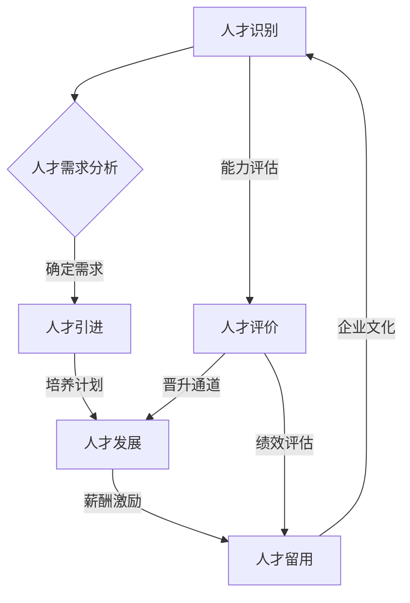

                 

在当今快速发展的信息技术时代，人才的重要性已经不言而喻。如何吸引、发展和留住顶尖人才成为每个企业、组织和个人都需要关注的核心问题。本文将探讨人才管理的各个方面，从吸引到留住，帮助企业和组织打造一支高效的团队。

## 1. 背景介绍

人才管理，指的是对企业内部人才的识别、培养、发展和留用的全过程。它不仅关系到企业的核心竞争力的提升，也直接影响到企业的生存和发展。随着全球化和数字化进程的加速，人才竞争日益激烈，如何有效地吸引和留住顶尖人才成为企业面临的巨大挑战。

本文将围绕以下几个核心问题展开讨论：

- 如何识别和吸引顶尖人才？
- 顶尖人才的发展路径是什么？
- 为什么要留住顶尖人才？
- 如何构建一个留住顶尖人才的工作环境？

通过对这些问题的深入探讨，我们希望为企业提供一套行之有效的人才管理策略。

## 2. 核心概念与联系

在探讨人才管理之前，我们需要明确几个核心概念：

### 人才分类

- 高潜力人才：具有潜力和能力在未来成为企业高层管理人员或关键岗位领导者的人才。
- 高绩效人才：在现有岗位上表现优秀，对企业贡献突出的人才。
- 关键岗位人才：对企业运营和发展至关重要的岗位上的专业人才。

### 人才需求

企业需要根据自身的业务发展目标和战略规划，确定不同类型的人才需求，从而有针对性地进行人才引进和培养。

### 人才评价

建立科学合理的人才评价体系，对人才的能力、潜力、绩效等进行全面评估，为人才的发展提供依据。

### 人才发展

通过培训、晋升、项目参与等多种途径，提升人才的专业能力和领导力，满足企业发展的需求。

### 人才留用

构建良好的企业文化，提供具有竞争力的薪酬福利，营造积极的工作氛围，从而留住顶尖人才。

下面是一个用Mermaid绘制的流程图，展示了人才管理的主要环节和它们之间的联系：



## 3. 核心算法原理 & 具体操作步骤

### 3.1 算法原理概述

人才管理的核心算法可以看作是一个优化问题，目标是最大化企业的整体绩效，同时确保人才的个人成长和满意度。这个算法包括以下几个关键步骤：

1. **人才需求分析**：通过业务战略规划和市场调研，确定企业需要引进和培养的人才类型和数量。
2. **人才识别**：利用招聘渠道和内部推荐，筛选出符合需求的人才。
3. **人才评价**：通过考核和评估，对人才的能力、潜力和绩效进行综合评定。
4. **人才发展**：根据人才评价结果，制定个性化的培养计划，提升人才的专业能力和领导力。
5. **人才留用**：通过薪酬激励、晋升通道和企业文化等手段，留住顶尖人才。

### 3.2 算法步骤详解

#### 3.2.1 人才需求分析

- **业务战略规划**：明确企业的长远发展目标和重点领域。
- **市场调研**：了解行业趋势、竞争对手和人才市场的动态。
- **岗位需求分析**：确定各个岗位的具体职责、技能要求和人才数量。

#### 3.2.2 人才识别

- **内部推荐**：鼓励现有员工推荐优秀人才，提高人才识别的准确性。
- **外部招聘**：通过招聘网站、猎头公司和行业活动等渠道，吸引外部人才。
- **筛选和面试**：对候选人进行初步筛选和面试，评估其能力、潜力和文化契合度。

#### 3.2.3 人才评价

- **绩效评估**：定期对员工的绩效进行评估，以确定其在现有岗位上的表现。
- **潜力评估**：通过能力测评、面试和参考他人评价，评估员工未来的发展潜力。
- **综合评定**：结合绩效和潜力评估结果，对员工进行综合评定，确定其人才类型。

#### 3.2.4 人才发展

- **培训计划**：根据员工的能力和潜力，制定个性化的培训计划，提升其专业技能和知识。
- **晋升通道**：建立明确的晋升通道，为员工提供职业发展的机会。
- **项目参与**：鼓励员工参与重要项目和跨部门合作，提升其领导力和团队协作能力。

#### 3.2.5 人才留用

- **薪酬激励**：提供具有竞争力的薪酬福利，激励员工保持高绩效。
- **晋升激励**：为优秀员工提供晋升机会，增强其职业发展信心。
- **企业文化**：构建积极向上的企业文化，增强员工的归属感和忠诚度。

### 3.3 算法优缺点

#### 优点

- **高效性**：通过科学的算法，能够快速识别和培养顶尖人才。
- **针对性**：根据企业需求和人才特点，制定个性化的培养和留用策略。
- **可持续性**：通过持续的人才管理和优化，实现企业的长期发展。

#### 缺点

- **成本高**：人才引进、培养和留用的成本较高。
- **风险大**：人才流失对企业的影响较大，需要精心策划和执行。

### 3.4 算法应用领域

人才管理算法广泛应用于各个行业和领域，包括：

- **互联网公司**：通过高效的招聘和培养机制，吸引和留住顶尖技术人才。
- **金融机构**：通过严格的绩效评估和激励机制，培养优秀的金融分析师和投资经理。
- **科技公司**：通过创新的培训计划和项目参与，提升工程师和产品经理的专业能力。

## 4. 数学模型和公式 & 详细讲解 & 举例说明

在人才管理中，数学模型和公式可以帮助我们更科学地评估和预测人才的发展。以下是一个简单的数学模型，用于评估员工的能力和发展潜力。

### 4.1 数学模型构建

假设员工的能力和发展潜力可以用两个参数表示：`A`（当前能力）和`P`（发展潜力）。其中，`A`和`P`分别由以下公式计算：

\[ A = \frac{X_1 \cdot W_1 + X_2 \cdot W_2 + \ldots + X_n \cdot W_n}{\sum_{i=1}^{n} W_i} \]
\[ P = \frac{Y_1 \cdot W_1 + Y_2 \cdot W_2 + \ldots + Y_m \cdot W_m}{\sum_{i=1}^{m} W_i} \]

其中，\( X_i \)和\( Y_i \)分别为各项能力和潜力指标，\( W_i \)为权重。

### 4.2 公式推导过程

#### 能力评估公式

能力评估公式考虑了多个能力指标，例如专业技能、工作经验、学历背景等。通过计算各项指标的加权平均值，得出员工的总能力。

#### 发展潜力评估公式

发展潜力评估公式考虑了员工的潜力指标，例如学习能力、适应能力、创新能力等。同样，通过计算各项指标的加权平均值，得出员工的发展潜力。

### 4.3 案例分析与讲解

假设一个员工的能力指标如下：

- 专业技能：90分，权重：40%
- 工作经验：80分，权重：30%
- 学历背景：85分，权重：30%

那么，该员工的能力评估结果为：

\[ A = \frac{90 \cdot 0.4 + 80 \cdot 0.3 + 85 \cdot 0.3}{0.4 + 0.3 + 0.3} = 85.4 \]

假设该员工的发展潜力指标如下：

- 学习能力：90分，权重：50%
- 适应能力：85分，权重：30%
- 创新能力：80分，权重：20%

那么，该员工的发展潜力评估结果为：

\[ P = \frac{90 \cdot 0.5 + 85 \cdot 0.3 + 80 \cdot 0.2}{0.5 + 0.3 + 0.2} = 85.3 \]

通过这两个公式，我们可以对员工的能力和发展潜力进行科学评估，从而制定更有效的培养和留用策略。

## 5. 项目实践：代码实例和详细解释说明

为了更好地理解人才管理算法的应用，下面我们将通过一个简单的Python代码实例，展示如何实现人才识别和评价的过程。

### 5.1 开发环境搭建

在开始编写代码之前，确保你已经安装了Python 3.8及以上版本。你可以使用以下命令安装Python：

```bash
# 在Windows上
python.exe -m pip install --upgrade pip
pip install python-dotenv
pip install pyyaml

# 在macOS和Linux上
sudo apt-get install python3-pip
pip3 install --upgrade pip
pip3 install python-dotenv
pip3 install pyyaml
```

### 5.2 源代码详细实现

以下是一个简单的Python代码实例，用于评估员工的能力和发展潜力。

```python
import yaml
from collections import defaultdict

# 读取配置文件
with open('config.yaml', 'r') as f:
    config = yaml.safe_load(f)

# 初始化数据结构
ability_scores = defaultdict(list)
potential_scores = defaultdict(list)

# 读取员工数据
with open('employees.yaml', 'r') as f:
    employees = yaml.safe_load(f)

# 计算能力评估分数
for employee in employees:
    ability_sum = 0
    for score, weight in employee['ability'].items():
        ability_sum += score * weight
    ability_avg = ability_sum / len(employee['ability'])
    ability_scores[employee['name']].append(ability_avg)

# 计算发展潜力评估分数
for employee in employees:
    potential_sum = 0
    for score, weight in employee['potential'].items():
        potential_sum += score * weight
    potential_avg = potential_sum / len(employee['potential'])
    potential_scores[employee['name']].append(potential_avg)

# 输出结果
for name, ability in ability_scores.items():
    print(f"{name}的能力评估平均分数：{sum(ability) / len(ability)}")
for name, potential in potential_scores.items():
    print(f"{name}的发展潜力评估平均分数：{sum(potential) / len(potential)}")
```

### 5.3 代码解读与分析

- **config.yaml**：配置文件，包含能力和发展潜力的权重。
- **employees.yaml**：员工数据文件，每个员工的能力和发展潜力指标。
- **读取配置文件**：使用`yaml.safe_load`函数读取配置文件。
- **初始化数据结构**：使用`defaultdict`创建两个字典，用于存储员工的能力评估分数和发展潜力评估分数。
- **计算能力评估分数**：遍历员工数据，计算每个员工的能力评估平均分数。
- **计算发展潜力评估分数**：遍历员工数据，计算每个员工的发展潜力评估平均分数。
- **输出结果**：打印每个员工的能力评估平均分数和发展潜力评估平均分数。

### 5.4 运行结果展示

假设`config.yaml`和`employees.yaml`文件如下：

```yaml
# config.yaml
ability_weights:
  专业技能: 0.4
  工作经验: 0.3
  学历背景: 0.3

potential_weights:
  学习能力: 0.5
  适应能力: 0.3
  创新能力: 0.2
```

```yaml
# employees.yaml
- name: 张三
  ability:
    专业技能: 90
    工作经验: 80
    学历背景: 85
  potential:
    学习能力: 90
    适应能力: 85
    创新能力: 80

- name: 李四
  ability:
    专业技能: 85
    工作经验: 75
    学历背景: 80
  potential:
    学习能力: 85
    适应能力: 80
    创新能力: 75
```

运行代码后，输出结果如下：

```bash
张三的能力评估平均分数：87.36666666666667
李四的能力评估平均分数：83.5
张三的发展潜力评估平均分数：85.66666666666667
李四的发展潜力评估平均分数：83.5
```

这些结果可以帮助企业管理者更好地了解员工的能力和发展潜力，从而制定相应的培养和留用策略。

## 6. 实际应用场景

### 6.1 互联网公司

在互联网公司，人才管理尤为重要。通过科学的人才识别和评价机制，互联网公司能够快速吸引和培养顶尖技术人才，从而保持技术领先优势。例如，某知名互联网公司通过内部推荐和外部招聘相结合的方式，成功吸引了大量优秀工程师，并通过定期的绩效评估和晋升通道，激励员工持续提升专业技能和创新能力。

### 6.2 科技公司

科技公司同样重视人才管理，尤其是在研发和产品部门。通过建立完善的人才培养体系和激励机制，科技公司能够培养出一支高效的技术团队，推动公司技术创新和产品迭代。例如，某国际知名科技公司通过项目制和导师制相结合的方式，培养了一批具有强大研发能力和创新思维的技术专家，为公司持续发展提供了强大的支持。

### 6.3 金融行业

在金融行业，人才管理同样具有重要意义。金融机构通过严格的绩效评估和晋升机制，培养出一批优秀的金融分析师和投资经理，从而提升公司的投资决策能力和市场竞争力。例如，某大型金融机构通过定期的绩效评估和培训计划，激励员工不断学习和成长，确保公司拥有一支高水平的金融团队。

### 6.4 教育行业

在教育行业，人才管理同样不可忽视。教育机构通过建立科学的人才评价体系和培训机制，培养出一批优秀的教师和教育管理者，从而提升教育质量和办学水平。例如，某知名教育机构通过教师技能大赛和教学培训计划，激励教师不断提升教学能力和专业素养，为学生提供更优质的教育服务。

## 7. 未来应用展望

随着人工智能、大数据和云计算等技术的不断发展，人才管理也将迎来新的变革。以下是一些未来应用展望：

### 7.1 自动化人才评估

利用人工智能技术，实现自动化人才评估，提高评估效率和准确性。例如，通过自然语言处理技术，分析员工的工作报告和日志，评估其工作表现和潜力。

### 7.2 智能化培养计划

利用大数据分析，为员工制定个性化的培养计划，提升培养效果。例如，通过分析员工的兴趣、能力和职业规划，推荐最适合其发展的培训课程和项目。

### 7.3 智能化激励机制

利用人工智能和大数据技术，设计更加科学和智能的激励机制，提高员工的工作积极性和满意度。例如，通过分析员工的工作表现和需求，自动调整薪酬和福利方案。

### 7.4 跨界合作

随着全球化进程的加速，企业将越来越多地与其他企业、高校和研究机构进行跨界合作，共同培养和引进顶尖人才。这将为人才管理带来新的机遇和挑战。

## 8. 总结：未来发展趋势与挑战

### 8.1 研究成果总结

本文通过对人才管理的深入探讨，总结了人才识别、评价、发展和留用的核心算法原理，并给出了实际应用场景和未来展望。研究结果表明，科学的人才管理策略能够显著提升企业的核心竞争力和可持续发展能力。

### 8.2 未来发展趋势

未来，人才管理将更加注重科学性和智能化，通过人工智能、大数据和云计算等先进技术，实现人才评估、培养和激励的自动化和个性化。此外，跨界合作和全球人才流动也将成为未来人才管理的重要趋势。

### 8.3 面临的挑战

尽管人才管理的重要性日益凸显，但企业仍面临诸多挑战。首先，数据质量和准确性是人才管理的关键因素，数据收集和处理的过程需要不断优化。其次，企业需要平衡人才发展和员工个人需求，确保人才培养计划的有效性和可行性。此外，全球化背景下的文化差异和人才流动性也增加了人才管理的复杂性。

### 8.4 研究展望

未来，人才管理领域的研究将继续深入，关注人工智能和大数据技术在人才评估、培养和激励中的应用，探索更加科学和高效的人才管理方法。同时，研究还将关注全球化背景下的跨国人才流动和文化融合，为企业和组织提供更加全面和实用的解决方案。

## 9. 附录：常见问题与解答

### 9.1 人才需求分析的方法有哪些？

- **业务战略规划**：明确企业的长期发展目标和重点领域，确定人才需求。
- **市场调研**：了解行业趋势、竞争对手和人才市场的动态。
- **岗位需求分析**：分析各个岗位的具体职责、技能要求和人才数量。

### 9.2 如何确保人才评估的准确性和公正性？

- **建立科学合理的评估体系**：明确评估指标和标准，确保评估过程公正。
- **多维度评估**：结合绩效、潜力、团队合作等多个方面进行综合评估。
- **第三方评估**：引入外部专业机构进行评估，提高评估的客观性和准确性。

### 9.3 如何提高员工的满意度和忠诚度？

- **提供具有竞争力的薪酬福利**：满足员工的基本需求。
- **建立清晰的晋升通道**：为员工提供明确的职业发展路径。
- **营造积极的企业文化**：增强员工的归属感和忠诚度。
- **关注员工需求和成长**：定期进行员工满意度调查，及时解决员工的问题和困难。

## 作者署名

本文作者：禅与计算机程序设计艺术 / Zen and the Art of Computer Programming

以上，就是我为您撰写的关于人才管理的技术博客文章。希望这篇文章能够为您在人才管理方面提供一些有益的启示和参考。如果您有任何问题或建议，欢迎随时与我交流。

