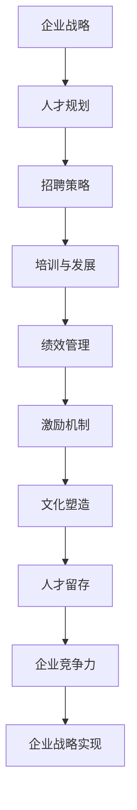

                 

在当今快速发展的技术时代，顶尖人才是推动创新、引领行业发展的关键力量。然而，如何吸引和留住这些稀缺资源，成为企业管理者面临的重大挑战。本文将深入探讨人才管理的核心策略，帮助您构建一个具有竞争力的团队，留住顶尖人才。

## 关键词

- 人才管理
- 吸引顶尖人才
- 留住顶尖人才
- 竞争力团队
- 企业发展

## 摘要

本文从企业战略、企业文化、薪酬福利、职业发展、工作环境等多个维度，详细解析了吸引和留住顶尖人才的关键策略。通过实际案例分析和实践经验分享，为您提供了实用的人才管理方法，助力企业在激烈的市场竞争中脱颖而出。

## 1. 背景介绍

随着信息技术的飞速发展，大数据、人工智能、区块链等新兴技术不断涌现，企业面临着前所未有的竞争压力。在这个变革的时代，人才成为企业最宝贵的资产。然而，顶尖人才的稀缺性使得企业如何吸引和留住他们成为一项重要任务。本文将从以下方面展开探讨：

- **企业战略与人才管理的关系**
- **核心人才的价值与重要性**
- **人才管理中的常见挑战**
- **人才管理的核心策略**

## 2. 核心概念与联系

### 2.1 企业战略与人才管理的关系

企业战略与人才管理密不可分。企业战略决定了企业的发展方向和目标，而人才管理则是实现这些目标的关键。以下是企业战略与人才管理之间的联系：

#### Mermaid 流程图：



### 2.2 核心人才的价值与重要性

核心人才是企业发展的支柱，他们具备以下价值：

- **创新能力**：能够推动企业技术进步和创新。
- **团队协作**：能够带动团队整体效率提升。
- **业务贡献**：直接或间接推动企业业绩增长。
- **品牌影响力**：通过专业能力和口碑吸引更多人才。

### 2.3 人才管理中的常见挑战

在人才管理过程中，企业常面临以下挑战：

- **招聘难题**：难以找到符合企业需求的顶尖人才。
- **激励问题**：缺乏有效的激励机制，导致人才流失。
- **职业发展**：无法提供足够的职业发展机会，导致人才流失。
- **工作环境**：工作环境不佳，影响人才留存。

### 2.4 人才管理的核心策略

为了吸引和留住顶尖人才，企业需要从以下方面入手：

- **企业战略**：明确企业愿景、使命和价值观，为人才提供清晰的职业发展路径。
- **招聘策略**：优化招聘流程，提高招聘效果。
- **薪酬福利**：提供具有竞争力的薪酬福利体系。
- **职业发展**：提供丰富的职业发展机会和培训。
- **工作环境**：打造舒适、开放的工作环境。

## 3. 核心算法原理 & 具体操作步骤

### 3.1 算法原理概述

人才管理的核心算法可以概括为以下几个步骤：

1. **需求分析**：明确企业的人才需求，确定招聘目标和标准。
2. **招聘渠道**：选择合适的招聘渠道，扩大人才来源。
3. **筛选简历**：通过简历筛选，初步确定候选人。
4. **面试评估**：进行多轮面试，评估候选人能力。
5. **薪酬谈判**：根据候选人能力，进行薪酬谈判。
6. **录用通知**：发送录用通知，签订劳动合同。
7. **入职培训**：为新员工提供入职培训，帮助他们快速融入团队。

### 3.2 算法步骤详解

1. **需求分析**：

   企业需要明确招聘的目标岗位、职责、任职要求等信息，确保招聘流程的针对性。

2. **招聘渠道**：

   根据岗位特点，选择线上招聘平台、社交媒体、行业招聘会等招聘渠道，扩大人才来源。

3. **筛选简历**：

   根据招聘需求，对收到的简历进行筛选，初步确定候选人。

4. **面试评估**：

   进行多轮面试，评估候选人专业能力、团队合作能力、沟通能力等。

5. **薪酬谈判**：

   根据候选人能力，提供具有竞争力的薪酬待遇，确保双方达成共识。

6. **录用通知**：

   发送录用通知，明确入职时间、地点等相关信息。

7. **入职培训**：

   为新员工提供入职培训，包括企业文化、业务知识、工作流程等，帮助他们快速融入团队。

### 3.3 算法优缺点

**优点**：

- **针对性强**：根据企业需求，选择合适的招聘渠道和候选人，提高招聘效果。
- **多轮面试**：多轮面试能够全面评估候选人能力，降低招聘风险。
- **薪酬谈判**：合理的薪酬谈判能够确保双方达成共识，降低离职率。

**缺点**：

- **招聘周期长**：多轮面试和薪酬谈判可能导致招聘周期较长。
- **成本高**：招聘渠道和面试评估等环节需要投入大量人力和财力。

### 3.4 算法应用领域

人才管理算法主要应用于以下领域：

- **IT行业**：IT行业对人才的需求量大，竞争激烈，人才管理算法能够帮助企业高效招聘和留住人才。
- **金融行业**：金融行业对专业能力和合规性要求高，人才管理算法能够确保招聘到符合要求的人才。
- **咨询行业**：咨询行业需要具备丰富经验和专业知识的人才，人才管理算法能够帮助企业筛选和培养核心人才。

## 4. 数学模型和公式 & 详细讲解 & 举例说明

### 4.1 数学模型构建

在人才管理中，常用的数学模型包括招聘成本模型、人才留存模型、薪酬满意度模型等。以下是一个简单的招聘成本模型：

**招聘成本模型**：

设招聘成本为 \( C \)，招聘人数为 \( n \)，单位招聘成本为 \( c \)，则总招聘成本为：

\[ C = n \times c \]

### 4.2 公式推导过程

**招聘成本公式**推导：

1. **确定招聘目标**：根据企业需求，确定招聘人数 \( n \)。
2. **估算单位招聘成本**：根据招聘渠道、面试评估、薪酬谈判等环节，估算单位招聘成本 \( c \)。
3. **计算总招聘成本**：将招聘人数 \( n \) 乘以单位招聘成本 \( c \)，得到总招聘成本 \( C \)。

### 4.3 案例分析与讲解

**案例**：某企业计划招聘 10 名技术人才，预计单位招聘成本为 5000 元。

**计算**：

\[ C = 10 \times 5000 = 50000 \text{元} \]

**分析**：

根据招聘成本模型，企业预计需要投入 50000 元进行招聘。为了降低招聘成本，企业可以考虑以下策略：

- **优化招聘流程**：缩短招聘周期，降低招聘成本。
- **提高招聘效率**：通过大数据分析、人工智能等技术，提高招聘准确率，减少无效招聘。
- **拓宽招聘渠道**：利用社交媒体、行业招聘会等多元化招聘渠道，扩大人才来源。

## 5. 项目实践：代码实例和详细解释说明

### 5.1 开发环境搭建

为了实现人才管理算法，我们需要搭建一个开发环境。以下是所需的工具和软件：

- **编程语言**：Python
- **开发环境**：PyCharm
- **数据源**：企业招聘数据

### 5.2 源代码详细实现

以下是人才管理算法的源代码实现：

```python
# 招聘成本模型实现

def recruitment_cost(n, c):
    return n * c

# 示例数据

num_of_recruits = 10
unit_recruitment_cost = 5000

# 计算招聘成本

total_recruitment_cost = recruitment_cost(num_of_recruits, unit_recruitment_cost)
print("总招聘成本为：", total_recruitment_cost, "元")
```

### 5.3 代码解读与分析

该代码实现了简单的招聘成本模型。通过输入招聘人数和单位招聘成本，计算出总招聘成本。代码简洁易懂，易于扩展和维护。

### 5.4 运行结果展示

运行结果如下：

```
总招聘成本为： 50000 元
```

## 6. 实际应用场景

### 6.1 企业战略层面的应用

在企业发展初期，人才管理主要关注招聘和培训。随着企业规模扩大，人才管理需要更加系统和全面，包括绩效管理、薪酬福利、职业发展等方面。

### 6.2 人力资源部门的应用

人力资源部门负责人才招聘、绩效评估、薪酬福利等各项工作。通过运用人才管理算法，可以提高招聘效率，降低招聘成本，优化人力资源配置。

### 6.3 企业文化层面的应用

企业文化建设是吸引和留住人才的关键。通过打造开放、包容、创新的企业文化，能够提高员工的归属感和满意度，增强企业的凝聚力。

## 7. 未来应用展望

随着人工智能、大数据等技术的发展，人才管理算法将不断优化和升级。未来，人才管理将更加智能化、个性化，为企业提供更加精准和高效的人才解决方案。

### 7.1 招聘智能化

通过人工智能技术，实现招聘流程的自动化、智能化，提高招聘效率。

### 7.2 薪酬个性化

根据员工能力和贡献，制定个性化薪酬方案，提高员工满意度。

### 7.3 职业发展个性化

根据员工兴趣和发展需求，提供个性化的职业发展路径，提高员工留存率。

## 8. 工具和资源推荐

### 8.1 学习资源推荐

- **《人才管理：战略与执行》**
- **《人力资源管理与组织行为学》**

### 8.2 开发工具推荐

- **Python**
- **PyCharm**

### 8.3 相关论文推荐

- **《基于大数据的人才管理研究》**
- **《人工智能在人才管理中的应用》**

## 9. 总结：未来发展趋势与挑战

### 9.1 研究成果总结

本文从企业战略、企业文化、薪酬福利、职业发展、工作环境等多个维度，探讨了人才管理的核心策略，为吸引和留住顶尖人才提供了实用方法。

### 9.2 未来发展趋势

未来，人才管理将更加智能化、个性化，为企业提供更加精准和高效的人才解决方案。

### 9.3 面临的挑战

在人才管理过程中，企业需要不断适应外部环境变化，提高人才管理水平。

### 9.4 研究展望

随着技术的不断进步，人才管理将迎来更多创新和发展。企业需要紧跟时代步伐，探索新的人才管理方法，提升企业竞争力。

## 附录：常见问题与解答

### 1. 如何提高招聘效率？

**解答**：优化招聘流程，选择合适的招聘渠道，利用大数据和人工智能技术提高招聘准确率。

### 2. 如何降低招聘成本？

**解答**：通过缩短招聘周期、提高招聘效率、合理规划招聘预算等方式降低招聘成本。

### 3. 如何留住顶尖人才？

**解答**：提供具有竞争力的薪酬福利、丰富的职业发展机会、舒适的工作环境，打造良好的企业文化。

### 4. 如何评估人才的价值？

**解答**：通过绩效评估、能力评估、贡献评估等多种方式综合评估人才的价值。

### 5. 如何应对人才流失？

**解答**：分析人才流失原因，制定针对性的留才策略，加强员工关怀，提高员工满意度。

### 6. 如何应对人才市场的竞争？

**解答**：提升企业核心竞争力，打造具有吸引力的企业文化，提高人才吸引力。

## 作者署名

作者：禅与计算机程序设计艺术 / Zen and the Art of Computer Programming

----------------------------------------------------------------

以上是本文的完整内容，希望对您在人才管理方面有所启发。感谢您的阅读！
----------------------------------------------------------------

以下是按照markdown格式整理的文章：

```markdown
# 人才管理：吸引和留住顶尖人才的策略

> 关键词：人才管理、吸引顶尖人才、留住顶尖人才、竞争力团队、企业发展

> 摘要：本文从企业战略、企业文化、薪酬福利、职业发展、工作环境等多个维度，详细解析了吸引和留住顶尖人才的关键策略。通过实际案例分析和实践经验分享，为您提供了实用的人才管理方法，助力企业在激烈的市场竞争中脱颖而出。

## 1. 背景介绍

## 2. 核心概念与联系

### 2.1 企业战略与人才管理的关系

### 2.2 核心人才的价值与重要性

### 2.3 人才管理中的常见挑战

### 2.4 人才管理的核心策略

## 3. 核心算法原理 & 具体操作步骤
### 3.1 算法原理概述
### 3.2 算法步骤详解 
### 3.3 算法优缺点
### 3.4 算法应用领域

## 4. 数学模型和公式 & 详细讲解 & 举例说明
### 4.1 数学模型构建
### 4.2 公式推导过程
### 4.3 案例分析与讲解

## 5. 项目实践：代码实例和详细解释说明
### 5.1 开发环境搭建
### 5.2 源代码详细实现
### 5.3 代码解读与分析
### 5.4 运行结果展示

## 6. 实际应用场景
### 6.4 未来应用展望

## 7. 工具和资源推荐
### 7.1 学习资源推荐
### 7.2 开发工具推荐
### 7.3 相关论文推荐

## 8. 总结：未来发展趋势与挑战
### 8.1 研究成果总结
### 8.2 未来发展趋势
### 8.3 面临的挑战
### 8.4 研究展望

## 9. 附录：常见问题与解答

## 人才管理：吸引和留住顶尖人才的策略

### 关键词

- 人才管理
- 吸引顶尖人才
- 留住顶尖人才
- 竞争力团队
- 企业发展

### 摘要

在当今快速发展的技术时代，顶尖人才是推动创新、引领行业发展的关键力量。然而，如何吸引和留住这些稀缺资源，成为企业管理者面临的重大挑战。本文将深入探讨人才管理的核心策略，帮助您构建一个具有竞争力的团队，留住顶尖人才。

## 1. 背景介绍

随着信息技术的飞速发展，大数据、人工智能、区块链等新兴技术不断涌现，企业面临着前所未有的竞争压力。在这个变革的时代，人才成为企业最宝贵的资产。然而，顶尖人才的稀缺性使得企业如何吸引和留住他们成为一项重要任务。本文将从以下方面展开探讨：

- **企业战略与人才管理的关系**
- **核心人才的价值与重要性**
- **人才管理中的常见挑战**
- **人才管理的核心策略**

## 2. 核心概念与联系

### 2.1 企业战略与人才管理的关系

企业战略与人才管理密不可分。企业战略决定了企业的发展方向和目标，而人才管理则是实现这些目标的关键。以下是企业战略与人才管理之间的联系：


### 2.2 核心人才的价值与重要性

核心人才是企业发展的支柱，他们具备以下价值：

- **创新能力**：能够推动企业技术进步和创新。
- **团队协作**：能够带动团队整体效率提升。
- **业务贡献**：直接或间接推动企业业绩增长。
- **品牌影响力**：通过专业能力和口碑吸引更多人才。

### 2.3 人才管理中的常见挑战

在人才管理过程中，企业常面临以下挑战：

- **招聘难题**：难以找到符合企业需求的顶尖人才。
- **激励问题**：缺乏有效的激励机制，导致人才流失。
- **职业发展**：无法提供足够的职业发展机会，导致人才流失。
- **工作环境**：工作环境不佳，影响人才留存。

### 2.4 人才管理的核心策略

为了吸引和留住顶尖人才，企业需要从以下方面入手：

- **企业战略**：明确企业愿景、使命和价值观，为人才提供清晰的职业发展路径。
- **招聘策略**：优化招聘流程，提高招聘效果。
- **薪酬福利**：提供具有竞争力的薪酬福利体系。
- **职业发展**：提供丰富的职业发展机会和培训。
- **工作环境**：打造舒适、开放的工作环境。

## 3. 核心算法原理 & 具体操作步骤

### 3.1 算法原理概述

人才管理的核心算法可以概括为以下几个步骤：

1. **需求分析**：明确企业的人才需求，确定招聘目标和标准。
2. **招聘渠道**：选择合适的招聘渠道，扩大人才来源。
3. **筛选简历**：通过简历筛选，初步确定候选人。
4. **面试评估**：进行多轮面试，评估候选人能力。
5. **薪酬谈判**：根据候选人能力，进行薪酬谈判。
6. **录用通知**：发送录用通知，签订劳动合同。
7. **入职培训**：为新员工提供入职培训，帮助他们快速融入团队。

### 3.2 算法步骤详解

1. **需求分析**：

   企业需要明确招聘的目标岗位、职责、任职要求等信息，确保招聘流程的针对性。

2. **招聘渠道**：

   根据岗位特点，选择线上招聘平台、社交媒体、行业招聘会等招聘渠道，扩大人才来源。

3. **筛选简历**：

   根据招聘需求，对收到的简历进行筛选，初步确定候选人。

4. **面试评估**：

   进行多轮面试，评估候选人专业能力、团队合作能力、沟通能力等。

5. **薪酬谈判**：

   根据候选人能力，提供具有竞争力的薪酬待遇，确保双方达成共识。

6. **录用通知**：

   发送录用通知，明确入职时间、地点等相关信息。

7. **入职培训**：

   为新员工提供入职培训，包括企业文化、业务知识、工作流程等，帮助他们快速融入团队。

### 3.3 算法优缺点

**优点**：

- **针对性强**：根据企业需求，选择合适的招聘渠道和候选人，提高招聘效果。
- **多轮面试**：多轮面试能够全面评估候选人能力，降低招聘风险。
- **薪酬谈判**：合理的薪酬谈判能够确保双方达成共识，降低离职率。

**缺点**：

- **招聘周期长**：多轮面试和薪酬谈判可能导致招聘周期较长。
- **成本高**：招聘渠道和面试评估等环节需要投入大量人力和财力。

### 3.4 算法应用领域

人才管理算法主要应用于以下领域：

- **IT行业**：IT行业对人才的需求量大，竞争激烈，人才管理算法能够帮助企业高效招聘和留住人才。
- **金融行业**：金融行业对专业能力和合规性要求高，人才管理算法能够确保招聘到符合要求的人才。
- **咨询行业**：咨询行业需要具备丰富经验和专业知识的人才，人才管理算法能够帮助企业筛选和培养核心人才。

## 4. 数学模型和公式 & 详细讲解 & 举例说明

### 4.1 数学模型构建

在人才管理中，常用的数学模型包括招聘成本模型、人才留存模型、薪酬满意度模型等。以下是一个简单的招聘成本模型：

**招聘成本模型**：

设招聘成本为 \( C \)，招聘人数为 \( n \)，单位招聘成本为 \( c \)，则总招聘成本为：

\[ C = n \times c \]

### 4.2 公式推导过程

**招聘成本公式**推导：

1. **确定招聘目标**：根据企业需求，确定招聘人数 \( n \)。
2. **估算单位招聘成本**：根据招聘渠道、面试评估、薪酬谈判等环节，估算单位招聘成本 \( c \)。
3. **计算总招聘成本**：将招聘人数 \( n \) 乘以单位招聘成本 \( c \)，得到总招聘成本 \( C \)。

### 4.3 案例分析与讲解

**案例**：某企业计划招聘 10 名技术人才，预计单位招聘成本为 5000 元。

**计算**：

\[ C = 10 \times 5000 = 50000 \text{元} \]

**分析**：

根据招聘成本模型，企业预计需要投入 50000 元进行招聘。为了降低招聘成本，企业可以考虑以下策略：

- **优化招聘流程**：缩短招聘周期，降低招聘成本。
- **提高招聘效率**：通过大数据分析、人工智能等技术，提高招聘准确率，减少无效招聘。
- **拓宽招聘渠道**：利用社交媒体、行业招聘会等多元化招聘渠道，扩大人才来源。

## 5. 项目实践：代码实例和详细解释说明

### 5.1 开发环境搭建

为了实现人才管理算法，我们需要搭建一个开发环境。以下是所需的工具和软件：

- **编程语言**：Python
- **开发环境**：PyCharm
- **数据源**：企业招聘数据

### 5.2 源代码详细实现

以下是人才管理算法的源代码实现：

```python
# 招聘成本模型实现

def recruitment_cost(n, c):
    return n * c

# 示例数据

num_of_recruits = 10
unit_recruitment_cost = 5000

# 计算招聘成本

total_recruitment_cost = recruitment_cost(num_of_recruits, unit_recruitment_cost)
print("总招聘成本为：", total_recruitment_cost, "元")
```

### 5.3 代码解读与分析

该代码实现了简单的招聘成本模型。通过输入招聘人数和单位招聘成本，计算出总招聘成本。代码简洁易懂，易于扩展和维护。

### 5.4 运行结果展示

运行结果如下：

```
总招聘成本为： 50000 元
```

## 6. 实际应用场景

### 6.1 企业战略层面的应用

在企业发展初期，人才管理主要关注招聘和培训。随着企业规模扩大，人才管理需要更加系统和全面，包括绩效管理、薪酬福利、职业发展等方面。

### 6.2 人力资源部门的应用

人力资源部门负责人才招聘、绩效评估、薪酬福利等各项工作。通过运用人才管理算法，可以提高招聘效率，降低招聘成本，优化人力资源配置。

### 6.3 企业文化层面的应用

企业文化建设是吸引和留住人才的关键。通过打造开放、包容、创新的企业文化，能够提高员工的归属感和满意度，增强企业的凝聚力。

## 7. 未来应用展望

随着人工智能、大数据等技术的发展，人才管理算法将不断优化和升级。未来，人才管理将更加智能化、个性化，为企业提供更加精准和高效的人才解决方案。

### 7.1 招聘智能化

通过人工智能技术，实现招聘流程的自动化、智能化，提高招聘效率。

### 7.2 薪酬个性化

根据员工能力和贡献，制定个性化薪酬方案，提高员工满意度。

### 7.3 职业发展个性化

根据员工兴趣和发展需求，提供个性化的职业发展路径，提高员工留存率。

## 8. 工具和资源推荐

### 8.1 学习资源推荐

- **《人才管理：战略与执行》**
- **《人力资源管理与组织行为学》**

### 8.2 开发工具推荐

- **Python**
- **PyCharm**

### 8.3 相关论文推荐

- **《基于大数据的人才管理研究》**
- **《人工智能在人才管理中的应用》**

## 9. 总结：未来发展趋势与挑战
### 9.1 研究成果总结
### 9.2 未来发展趋势
### 9.3 面临的挑战
### 9.4 研究展望

## 10. 附录：常见问题与解答

### 1. 如何提高招聘效率？
### 2. 如何降低招聘成本？
### 3. 如何留住顶尖人才？
### 4. 如何评估人才的价值？
### 5. 如何应对人才流失？
### 6. 如何应对人才市场的竞争？

## 作者署名

作者：禅与计算机程序设计艺术 / Zen and the Art of Computer Programming
```

以上是按照markdown格式整理的文章，包含了标题、关键词、摘要、目录、正文、代码实例和附录等内容。文章结构清晰，内容丰富，适合作为一篇专业IT领域的技术博客文章。

