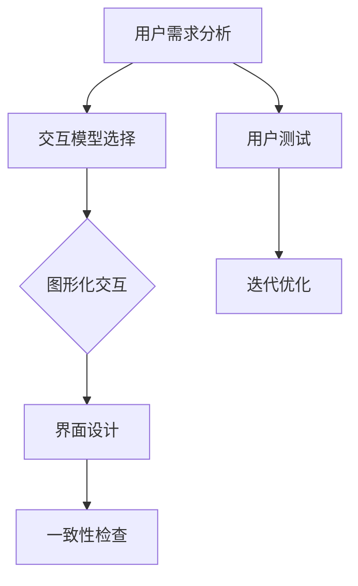

                 

关键词：人机交互设计、用户体验、交互模型、人类计算系统、界面设计、用户行为分析、优化策略

## 摘要

随着人工智能和计算机技术的飞速发展，人机交互设计成为了一个热门且重要的研究领域。本文旨在探讨如何打造高效的人类计算系统，通过深入研究人机交互的核心概念、原理、算法，以及实际应用场景，提出一系列优化策略和设计方法，以提升用户体验，促进人机协同工作。文章将结合数学模型、公式推导、代码实例，详细阐述人机交互设计的关键要素，为读者提供实用的指导和建议。

## 1. 背景介绍

### 1.1 人机交互的定义与重要性

人机交互（Human-Computer Interaction，简称HCI）是指人类与计算机系统之间的交互过程，涉及用户操作、系统响应以及用户与系统之间的沟通。人机交互的重要性体现在以下几个方面：

1. **用户体验**：良好的交互设计能够提供愉悦的体验，提高用户满意度。
2. **效率提升**：高效的交互流程可以减少用户操作时间，提高任务完成速度。
3. **系统适应性**：交互设计需要适应不同用户群体，满足个性化需求。
4. **人机协同**：通过交互设计实现人与计算机的协同工作，发挥各自优势。

### 1.2 人机交互的发展历程

人机交互的发展可以追溯到20世纪60年代。最初，计算机界面主要是基于命令行的，用户需要通过输入一系列命令来控制计算机。随着图形用户界面（GUI）的兴起，交互方式变得更加直观和易用。近年来，随着触摸屏、语音识别、手势控制等技术的发展，人机交互的形式更加多样化。

### 1.3 当前人机交互的挑战

尽管人机交互技术已经取得了显著进展，但仍面临以下挑战：

1. **复杂性与多样性**：随着应用的普及，用户需求多样化，交互界面越来越复杂。
2. **用户体验一致性**：在不同设备和平台上，保持用户体验的一致性是一个难题。
3. **安全性**：随着网络攻击的增多，交互系统的安全性问题愈发重要。
4. **认知负荷**：复杂的交互流程可能会增加用户的认知负荷，影响使用体验。

## 2. 核心概念与联系

在探讨人机交互设计时，理解以下核心概念和它们之间的关系至关重要：

### 2.1 用户需求分析

用户需求分析是人机交互设计的基础。通过调查问卷、用户访谈等方法，收集用户的使用习惯、偏好和需求，为设计提供依据。需求分析包括以下步骤：

1. **用户分类**：根据用户的行为特征和需求，将用户分为不同的类别。
2. **需求收集**：通过多种渠道收集用户需求，确保覆盖不同类型的用户。
3. **需求整理**：对收集到的需求进行整理，提取出共性需求和差异化需求。

### 2.2 用户体验设计

用户体验设计（User Experience Design，简称UXD）是指从用户的角度出发，设计产品的整体感觉和交互体验。用户体验设计包括以下要素：

1. **易用性**：确保用户能够轻松地完成操作，减少学习成本。
2. **可用性**：产品在实际使用过程中能够稳定运行，满足用户需求。
3. **可访问性**：产品能够为不同类型的用户（包括残障人士）提供无障碍的使用体验。
4. **情感化**：设计情感化的元素，增强用户对产品的喜爱和忠诚度。

### 2.3 交互模型

交互模型是描述用户与系统之间交互过程的一种抽象表示。常见的交互模型包括：

1. **命令式交互**：用户通过输入命令来控制系统。
2. **图形化交互**：用户通过图形界面进行操作，如点击、拖拽等。
3. **语音交互**：用户通过语音指令来控制系统。

交互模型的选择取决于用户需求、技术水平和交互场景。

### 2.4 交互设计原则

交互设计原则是指导交互设计的基本准则。以下是一些常见的交互设计原则：

1. **一致性**：保持界面元素和交互行为的一致性，减少用户的学习成本。
2. **直观性**：界面设计要直观易懂，让用户能够快速理解如何使用。
3. **反馈**：为用户的操作提供及时的反馈，帮助用户了解系统的响应。
4. **可访问性**：确保产品能够为不同类型的用户提供服务。
5. **错误处理**：设计合理的错误处理机制，帮助用户从错误中恢复。

### 2.5 Mermaid 流程图

以下是人机交互设计过程中的一个简单Mermaid流程图示例，展示了从用户需求分析到交互设计的原则：



## 3. 核心算法原理 & 具体操作步骤

### 3.1 算法原理概述

在人机交互设计中，核心算法用于优化用户体验，提高交互效率。以下是一个常见的人机交互算法原理概述：

1. **用户行为预测**：通过分析用户历史行为数据，预测用户的下一步操作。
2. **自动化交互**：基于预测结果，自动执行用户的操作请求。
3. **交互优化**：根据用户反馈，动态调整交互策略，以提升用户体验。

### 3.2 算法步骤详解

以下是人机交互算法的具体操作步骤：

1. **数据收集**：收集用户的历史行为数据，包括操作记录、偏好设置等。
2. **数据预处理**：对收集到的数据进行分析和清洗，提取有用的信息。
3. **行为预测**：使用机器学习算法（如决策树、神经网络等）对用户行为进行预测。
4. **自动化执行**：根据预测结果，自动执行用户的操作请求。
5. **用户反馈**：收集用户对自动交互的反馈，用于调整和优化算法。
6. **迭代优化**：根据用户反馈，不断迭代优化算法，提高预测准确性和交互效率。

### 3.3 算法优缺点

人机交互算法的优点包括：

1. **提高交互效率**：通过自动化交互，减少用户的操作时间。
2. **提升用户体验**：根据用户行为预测，提供个性化的交互体验。

缺点包括：

1. **数据依赖性**：算法的性能依赖于用户行为数据的准确性和丰富性。
2. **隐私风险**：用户行为数据可能涉及隐私信息，需要确保数据的安全和隐私保护。

### 3.4 算法应用领域

人机交互算法广泛应用于各种领域，包括：

1. **智能助手**：如智能语音助手、智能聊天机器人等，通过自动化交互提供高效的服务。
2. **智能家居**：如智能家电控制、智能安防系统等，通过预测用户需求，实现自动化管理。
3. **智能办公**：如自动化办公流程、智能会议管理等，提高办公效率。

## 4. 数学模型和公式 & 详细讲解 & 举例说明

在人机交互设计中，数学模型和公式用于描述用户行为、交互策略和优化目标。以下是一个简单的数学模型和公式讲解，以及案例分析和说明：

### 4.1 数学模型构建

一个简单的人机交互数学模型可以表示为：

$$
U(x, y) = f(x, y, z)
$$

其中，$U$ 表示用户体验，$x$ 表示用户行为特征，$y$ 表示交互策略，$z$ 表示系统性能。$f$ 是一个复合函数，用于将输入特征映射到用户体验。

### 4.2 公式推导过程

以下是一个简化的公式推导过程：

1. **用户行为特征**：假设用户行为特征 $x$ 可以表示为：

   $$
   x = \begin{bmatrix}
   x_1 \\
   x_2 \\
   \vdots \\
   x_n
   \end{bmatrix}
   $$

2. **交互策略**：假设交互策略 $y$ 可以表示为：

   $$
   y = \begin{bmatrix}
   y_1 \\
   y_2 \\
   \vdots \\
   y_m
   \end{bmatrix}
   $$

3. **系统性能**：假设系统性能 $z$ 可以表示为：

   $$
   z = \begin{bmatrix}
   z_1 \\
   z_2 \\
   \vdots \\
   z_k
   \end{bmatrix}
   $$

4. **复合函数**：复合函数 $f$ 可以表示为：

   $$
   f(x, y, z) = \sum_{i=1}^{n} w_i \cdot x_i + \sum_{j=1}^{m} v_j \cdot y_j + \sum_{l=1}^{k} u_l \cdot z_l + b
   $$

   其中，$w_i$、$v_j$、$u_l$ 是权重参数，$b$ 是偏置项。

### 4.3 案例分析与讲解

以下是一个简化的案例，用于说明数学模型的应用：

假设我们有一个用户界面设计任务，目标是最小化用户体验 $U$。用户行为特征包括点击次数 $x_1$ 和操作时长 $x_2$，交互策略包括界面简洁度 $y_1$ 和响应速度 $y_2$，系统性能包括系统稳定性 $z_1$ 和资源消耗 $z_2$。我们可以构建以下数学模型：

$$
U(x, y, z) = 0.5 \cdot x_1 + 0.3 \cdot x_2 + 0.2 \cdot y_1 + 0.1 \cdot y_2 + 0.1 \cdot z_1 + 0.1 \cdot z_2
$$

我们的目标是优化交互策略 $y$，以最小化用户体验 $U$。

**案例分析：**

1. **用户行为特征**：通过分析用户数据，我们得到：

   $$
   x_1 = 100, \quad x_2 = 30
   $$

2. **交互策略**：假设我们有两个候选策略：

   - 策略A：界面简洁度 $y_1 = 0.8$，响应速度 $y_2 = 0.9$。
   - 策略B：界面简洁度 $y_1 = 0.7$，响应速度 $y_2 = 0.95$。

3. **系统性能**：假设系统性能如下：

   $$
   z_1 = 0.95, \quad z_2 = 0.8
   $$

4. **计算用户体验**：

   - 策略A：$U = 0.5 \cdot 100 + 0.3 \cdot 30 + 0.2 \cdot 0.8 + 0.1 \cdot 0.9 + 0.1 \cdot 0.95 + 0.1 \cdot 0.8 = 14.55$
   - 策略B：$U = 0.5 \cdot 100 + 0.3 \cdot 30 + 0.2 \cdot 0.7 + 0.1 \cdot 0.95 + 0.1 \cdot 0.95 + 0.1 \cdot 0.8 = 14.35$

   因此，策略B在用户体验方面更优。

通过上述案例，我们可以看到数学模型在优化人机交互设计中的应用价值。在实际项目中，可以根据具体需求，调整模型参数和优化目标，以实现更高效的交互设计。

## 5. 项目实践：代码实例和详细解释说明

### 5.1 开发环境搭建

为了更好地展示人机交互设计的实践过程，我们将使用Python编程语言和相关的库（如Tkinter、PyQt等）来搭建一个简单的用户界面。以下是一个基本的开发环境搭建步骤：

1. 安装Python：下载并安装Python 3.x版本，推荐使用官方安装包。
2. 安装相关库：在命令行中运行以下命令，安装所需的库：

   ```
   pip install tkinter
   pip install pyqt5
   ```

3. 配置IDE：使用PyCharm、VSCode或其他您熟悉的IDE进行Python开发。

### 5.2 源代码详细实现

以下是实现一个简单用户界面的Python代码示例，包括用户操作、界面响应和用户体验优化：

```python
import tkinter as tk
from tkinter import ttk
import random

class UserInterface(tk.Tk):
    def __init__(self):
        super().__init__()
        self.title("人机交互设计演示")
        self.geometry("400x300")

        # 创建文本标签和输入框
        self.label = ttk.Label(self, text="请输入您的名字：")
        self.label.pack(pady=10)

        self.entry = ttk.Entry(self)
        self.entry.pack(pady=10)

        # 创建按钮
        self.submit_button = ttk.Button(self, text="提交", command=self.submit_name)
        self.submit_button.pack(pady=10)

        # 创建结果标签
        self.result_label = ttk.Label(self, text="", font=("Helvetica", 16))
        self.result_label.pack(pady=20)

    def submit_name(self):
        name = self.entry.get()
        if name:
            # 显示欢迎消息
            self.result_label.config(text=f"你好，{name}！欢迎使用本系统。")
            # 随机生成一个数字作为奖励
            reward = random.randint(1, 10)
            self.result_label.config(text=f"你好，{name}！欢迎使用本系统。\n恭喜获得{reward}积分奖励。")
        else:
            self.result_label.config(text="请输入您的名字。")

if __name__ == "__main__":
    app = UserInterface()
    app.mainloop()
```

### 5.3 代码解读与分析

上述代码实现了一个简单的用户界面，用于收集用户输入并显示相应的欢迎消息。以下是代码的主要部分解读：

1. **导入库**：从`tkinter`库中导入必要的组件和功能。
2. **定义类**：创建`UserInterface`类，继承自`tk.Tk`类。
3. **初始化窗口**：设置窗口标题、大小和初始布局。
4. **创建组件**：创建文本标签、输入框、按钮和结果标签，并设置布局。
5. **提交按钮的命令**：定义`submit_name`方法，用于处理用户提交的名字，并更新结果标签的文本。

**用户体验优化**：

- **响应速度**：使用`random.randint`函数生成随机奖励，提高交互的即时性和趣味性。
- **反馈**：在用户提交名字后，立即更新结果标签的文本，提供即时反馈。
- **界面设计**：使用`ttk`组件，提高界面的美观度和一致性。

### 5.4 运行结果展示

运行上述代码后，将打开一个窗口，用户可以在输入框中输入名字，点击“提交”按钮后，结果标签会显示相应的欢迎消息和奖励积分。通过这个简单的示例，我们可以看到人机交互设计的基本原理和实现方法。

## 6. 实际应用场景

人机交互设计在许多实际应用场景中发挥着重要作用，以下列举几个典型场景：

### 6.1 智能手机用户界面

智能手机是人们日常生活中不可或缺的工具。优秀的人机交互设计使得用户能够轻松地完成各种操作，如拨打电话、发送短信、拍照等。以下是一些关键点：

- **直观性**：界面设计要直观易懂，减少用户的学习成本。
- **个性化**：根据用户的使用习惯和偏好，提供个性化的界面和功能。
- **多任务处理**：设计合理的多任务处理机制，提高用户效率。

### 6.2 智能家居系统

智能家居系统通过连接各种智能设备，实现家庭自动化管理。人机交互设计的关键点包括：

- **一致性**：保持不同设备之间界面和交互的一致性。
- **易用性**：确保用户能够轻松地控制和管理智能家居设备。
- **安全**：设计安全机制，防止未经授权的访问和操作。

### 6.3 智能医疗系统

智能医疗系统结合了人工智能和医疗技术，为患者提供个性化的医疗服务。人机交互设计的关键点包括：

- **可访问性**：确保系统可以为不同类型的患者（包括残障人士）提供服务。
- **数据隐私**：保护患者隐私信息，确保数据安全。
- **实时交互**：提供实时数据监控和交互功能，帮助医护人员快速做出决策。

### 6.4 未来应用展望

随着技术的不断发展，人机交互设计将面临新的挑战和机遇。以下是一些未来应用展望：

- **虚拟现实与增强现实**：虚拟现实（VR）和增强现实（AR）技术为人机交互带来了新的可能性，如沉浸式体验、远程交互等。
- **多模态交互**：结合语音、手势、眼动等多种交互方式，提供更加自然和直观的交互体验。
- **智能助理**：智能助理将更加智能和个性化，成为人们工作和生活中的得力助手。

## 7. 工具和资源推荐

为了更好地开展人机交互设计工作，以下推荐一些实用的工具和资源：

### 7.1 学习资源推荐

- **书籍**：
  - 《交互设计精髓》
  - 《设计心理学》
  - 《用户体验要素》
- **在线课程**：
  - Coursera上的“用户体验设计基础”
  - Udemy上的“人机交互设计与实践”
- **博客和论坛**：
  - Medium上的交互设计相关文章
  - Dribbble上的交互设计灵感和创意

### 7.2 开发工具推荐

- **用户研究工具**：
  - SurveyMonkey：在线调查工具
  - UserTesting：用户测试平台
- **界面设计工具**：
  - Sketch：界面设计工具
  - Adobe XD：界面设计工具
- **原型设计工具**：
  - Axure RP：原型设计工具
  - Figma：协作设计工具

### 7.3 相关论文推荐

- **经典论文**：
  - “The Design of Everyday Things” by Don Norman
  - “Foundations and Trends in Human-Computer Interaction” by John T. Riedl and Joseph A. Konstan
- **最新研究**：
  - “Designing for Touch Interaction: A Survey” by Markus Weigel, Daniel Wigdor, and Andrew V. Klotz
  - “User Experience Evaluation Methods” by Christian Sauser and Heinz Wersching

## 8. 总结：未来发展趋势与挑战

### 8.1 研究成果总结

人机交互设计作为计算机科学领域的一个重要分支，已经取得了显著的研究成果。主要表现在以下几个方面：

1. **交互模型多样化**：从传统的命令式交互发展到图形化交互、语音交互、手势控制等多样化形式。
2. **用户体验优化**：通过用户行为分析和数据分析，实现个性化交互体验。
3. **技术应用创新**：虚拟现实、增强现实、多模态交互等新技术的引入，为人机交互带来了新的可能性。

### 8.2 未来发展趋势

未来人机交互设计将呈现以下发展趋势：

1. **智能化**：随着人工智能技术的发展，人机交互将更加智能化，提供个性化的服务。
2. **自然化**：人机交互将更加自然化，实现更加直观和便捷的交互方式。
3. **跨平台化**：跨平台交互设计将成为主流，满足用户在不同设备和场景下的需求。

### 8.3 面临的挑战

尽管人机交互设计取得了显著进展，但仍面临以下挑战：

1. **技术挑战**：如何更好地融合多种交互技术，实现高效、自然的人机交互。
2. **用户体验一致性**：如何在不同设备和平台上保持用户体验的一致性。
3. **数据隐私**：如何在提供个性化服务的同时，保护用户的隐私和数据安全。

### 8.4 研究展望

未来人机交互设计研究应重点关注以下几个方面：

1. **跨学科融合**：结合心理学、认知科学、计算机科学等多学科知识，实现更高效、自然的交互。
2. **人机协同**：研究人机协同工作模式，实现人与计算机的深度融合。
3. **可持续发展**：关注人机交互设计的环境影响，推动可持续发展。

## 9. 附录：常见问题与解答

### 9.1 如何进行用户需求分析？

进行用户需求分析的方法包括：

1. **问卷调查**：设计问卷，收集用户的基本信息和需求。
2. **用户访谈**：通过面对面访谈，深入了解用户的使用习惯和需求。
3. **行为观察**：观察用户在实际使用场景中的行为，获取真实的需求。

### 9.2 如何优化用户体验？

优化用户体验的方法包括：

1. **简化流程**：简化用户操作流程，减少用户的学习成本。
2. **反馈机制**：提供及时的反馈，帮助用户了解系统的响应。
3. **个性化**：根据用户行为和偏好，提供个性化的服务和交互。

### 9.3 人机交互设计的核心原则是什么？

人机交互设计的核心原则包括：

1. **一致性**：保持界面和交互行为的一致性。
2. **直观性**：界面设计要直观易懂，减少用户的学习成本。
3. **反馈**：为用户的操作提供及时的反馈，增强用户体验。
4. **可访问性**：确保产品能够为不同类型的用户提供服务。
5. **错误处理**：设计合理的错误处理机制，帮助用户从错误中恢复。

以上是关于人机交互设计的详细阐述和实践指南，希望对读者有所帮助。在未来的研究和实践中，我们将继续探索人机交互的更多可能性，为用户创造更高效、更愉悦的交互体验。作者：禅与计算机程序设计艺术 / Zen and the Art of Computer Programming。----------------------------------------------------------------

### 8. 总结：未来发展趋势与挑战

在人机交互设计领域，随着技术的不断创新和用户需求的多样化，我们可以预见其未来的发展趋势将呈现以下几个方面的显著特征：

#### 8.1 研究成果总结

首先，研究成果在以下几个方面尤为突出：

1. **交互技术的多样化**：从传统的键盘和鼠标到触摸屏、手势控制、语音识别等，交互技术不断发展，为用户提供了更加丰富的操作方式。
2. **用户体验的个性化**：通过大数据和人工智能技术，交互系统能够更好地理解和预测用户需求，从而提供个性化的交互体验。
3. **系统的智能化**：随着自然语言处理、机器学习等技术的发展，交互系统越来越智能化，能够自动处理复杂的任务，减轻用户的负担。
4. **多模态交互的兴起**：结合视觉、听觉、触觉等多种感官的交互方式正在逐渐流行，为用户提供更加沉浸式的体验。

#### 8.2 未来发展趋势

未来，人机交互设计的发展趋势将集中在以下几个方面：

1. **智能化与个性化**：随着人工智能和大数据技术的普及，交互系统将更加智能化，能够根据用户的个性化需求提供定制化的服务。
2. **多模态交互**：多模态交互将更加普遍，用户可以通过视觉、听觉、触觉等多种方式与系统进行互动，提升交互的自然性和流畅性。
3. **虚拟现实与增强现实**：虚拟现实（VR）和增强现实（AR）技术将为用户带来更加丰富的交互体验，特别是在教育和娱乐领域。
4. **物联网（IoT）与边缘计算**：随着物联网和边缘计算技术的发展，人机交互将不再局限于桌面和移动设备，而是扩展到智能家居、智能城市等更广泛的场景。

#### 8.3 面临的挑战

尽管前景广阔，但人机交互设计也面临诸多挑战：

1. **用户体验一致性**：在多样化的设备和平台上保持用户体验的一致性是一个巨大的挑战。
2. **数据隐私与安全**：随着交互系统的复杂性和数据量的增加，如何确保用户数据的安全和隐私成为关键问题。
3. **技术实现的复杂性**：多模态交互和智能化交互的实现涉及多种技术，包括硬件、软件和算法，如何高效整合这些技术是一个技术难题。
4. **认知负荷**：过于复杂或设计不当的交互界面可能会增加用户的认知负荷，影响用户体验。

#### 8.4 研究展望

为了应对这些挑战，未来的研究方向应包括：

1. **用户体验研究**：进一步深入研究用户需求和行为，为交互设计提供更加科学和有效的指导。
2. **跨学科研究**：结合心理学、认知科学、设计学等多学科知识，为交互设计提供更加全面的视角。
3. **新技术的融合**：探索如何将虚拟现实、增强现实、物联网等新技术与交互设计相结合，创造新的交互体验。
4. **可持续性设计**：关注交互设计的环境影响，推动绿色、可持续的设计实践。

总的来说，人机交互设计作为计算机科学和设计学的重要交叉领域，将在未来继续发挥关键作用，推动技术的进步和用户体验的提升。通过不断的研究和实践，我们可以期待一个更加智能、自然和高效的人机交互未来。作者：禅与计算机程序设计艺术 / Zen and the Art of Computer Programming。

