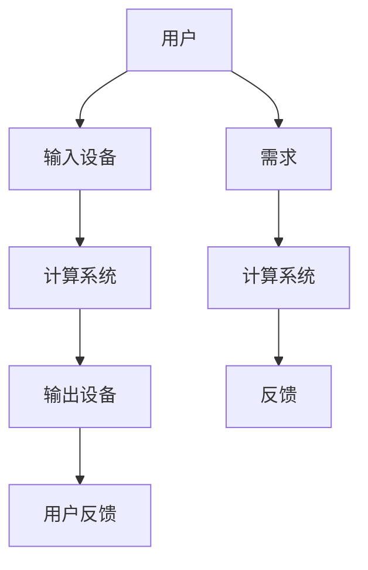
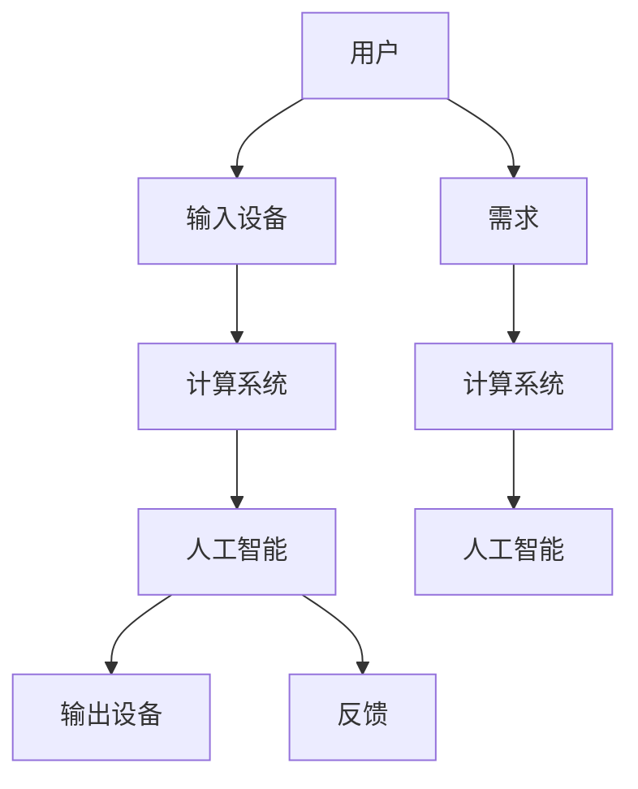

                 

关键词：人机交互，计算系统，用户体验，交互设计，人工智能，系统架构

> 摘要：本文从人机交互的角度出发，探讨了如何通过优化计算系统，提升人类与计算机之间的交互体验，实现高效便捷的计算过程。文章首先介绍了人机交互的基本概念和重要性，随后详细分析了当前人机交互中存在的问题，并提出了相应的解决策略。在此基础上，本文从算法、数学模型、项目实践等多个层面，深入探讨了构建高效便捷人类计算系统的方法，并结合具体应用场景进行了分析。最后，文章对未来人机交互技术的发展趋势和应用前景进行了展望。

## 1. 背景介绍

随着信息技术的飞速发展，计算机已经成为了现代社会不可或缺的工具。然而，人类与计算机之间的交互体验仍存在诸多问题。一方面，计算机系统复杂度高，用户在使用过程中往往感到困惑和不便；另一方面，计算机对人类需求的响应速度较慢，难以满足用户对实时性的需求。如何提升人类与计算机之间的交互体验，构建高效便捷的计算系统，成为了当前计算机领域亟待解决的问题。

人机交互（Human-Computer Interaction，简称HCI）是一门跨学科的研究领域，旨在研究人类与计算机之间的交互过程，并设计出易于使用、高效、可靠的人机系统。人机交互不仅涉及到计算机科学，还涉及心理学、认知科学、设计学等多个领域。随着人工智能技术的发展，人机交互也在不断进化，为构建高效便捷的计算系统提供了新的机遇和挑战。

本文将从以下几个方面展开讨论：

1. 人机交互的基本概念和重要性
2. 当前人机交互中存在的问题
3. 构建高效便捷计算系统的策略
4. 算法原理与数学模型
5. 项目实践与代码实例
6. 实际应用场景
7. 未来发展趋势与挑战

通过本文的探讨，希望能够为人机交互领域的研究者、开发者以及用户提供一些有价值的参考和启示。

## 2. 核心概念与联系

### 2.1. 人机交互的基本概念

人机交互是指人类与计算机系统之间的信息交流过程，包括输入、输出、反馈等多个环节。人机交互的核心目标是提高系统易用性、提高工作效率、降低操作错误率，从而提升用户体验。

1. **输入**：用户通过键盘、鼠标、触摸屏等输入设备将信息传递给计算机系统。
2. **输出**：计算机系统通过显示器、音响等输出设备将信息反馈给用户。
3. **反馈**：用户根据计算机系统的输出，调整自己的输入，形成一个闭环。

### 2.2. 计算系统与用户需求

计算系统是指计算机硬件、软件及其环境构成的总体。用户需求是计算系统的核心驱动力，包括以下几个方面：

1. **易用性**：用户希望系统能够易于学习、易于操作。
2. **高效性**：用户希望系统能够快速响应用户指令，提高工作效率。
3. **可靠性**：用户希望系统能够稳定运行，不出现故障。
4. **安全性**：用户希望系统能够保护用户数据，防止数据泄露。

### 2.3. 人机交互与计算系统的关系

人机交互与计算系统密不可分。计算系统为人机交互提供了基础平台，而人机交互则为计算系统提供了用户需求的理解和反馈。两者的关系可以用以下 Mermaid 流程图表示：



在这个流程图中，用户通过输入设备将需求传递给计算系统，计算系统根据用户需求进行处理，并通过输出设备将结果反馈给用户。用户根据反馈调整自己的需求，形成一个持续优化的闭环。

### 2.4. 交互设计的重要性

交互设计是人机交互的重要组成部分，它关注的是用户与产品之间的交互流程和体验。一个良好的交互设计能够显著提升用户体验，降低用户的学习成本，提高用户满意度。以下是一些交互设计的关键要素：

1. **直观性**：设计应尽量直观，用户能快速理解如何使用产品。
2. **一致性**：设计应保持一致性，避免用户在不同场景下产生混淆。
3. **易用性**：设计应考虑用户的使用习惯，降低操作复杂度。
4. **反馈**：设计应提供及时、明确的反馈，帮助用户理解系统的状态。
5. **灵活性**：设计应具有一定的灵活性，适应不同用户的需求。

### 2.5. 人工智能与人机交互的结合

人工智能技术的发展为人机交互带来了新的机遇。通过人工智能技术，计算机可以更好地理解用户需求，提供个性化的服务。同时，人工智能还可以帮助计算机系统进行自动化决策，减少用户的操作负担。

以下是一个简化的 Mermaid 流程图，展示了人工智能与人机交互的结合：



在这个流程图中，用户通过输入设备将需求传递给计算系统，计算系统结合人工智能技术对用户需求进行分析和处理，并通过输出设备将结果反馈给用户。同时，用户根据反馈调整自己的需求，形成一个智能化、个性化的交互闭环。

通过以上分析，我们可以看出，人机交互与计算系统密切相关，交互设计的重要性不容忽视。未来，随着人工智能技术的不断发展，人机交互将迎来更加广阔的发展空间。

## 3. 核心算法原理 & 具体操作步骤

### 3.1. 算法原理概述

在人机交互领域，核心算法的设计和实现至关重要。本文将介绍一种基于深度学习的核心算法，该算法通过学习用户行为数据，实现对用户需求的准确预测和响应。该算法的基本原理可以概括为以下几个步骤：

1. **数据采集**：通过用户操作记录、日志数据等手段，采集用户行为数据。
2. **数据预处理**：对采集到的数据进行清洗、去噪和特征提取，为算法训练提供高质量的数据集。
3. **模型构建**：基于深度学习框架，构建一个多层次的神经网络模型，用于学习和预测用户需求。
4. **模型训练**：使用预处理后的数据集，对神经网络模型进行训练，不断调整模型参数，提高预测准确性。
5. **模型评估**：使用验证集和测试集，对训练好的模型进行评估，确保其具有良好的泛化能力。
6. **模型部署**：将训练好的模型部署到计算系统中，实现实时预测和响应。

### 3.2. 算法步骤详解

#### 3.2.1. 数据采集

数据采集是算法训练的基础，其质量直接影响到算法的性能。本文采用多种手段进行数据采集，包括：

1. **用户操作记录**：通过日志记录用户在系统中的操作行为，如点击、滑动、输入等。
2. **语音识别**：使用语音识别技术，将用户语音输入转换为文本数据。
3. **传感器数据**：通过手机或其他设备的传感器，采集用户的地理位置、环境温度、光照强度等数据。

#### 3.2.2. 数据预处理

数据预处理是数据采集后的重要环节，其主要任务包括：

1. **数据清洗**：去除重复数据、异常数据，确保数据的一致性和准确性。
2. **去噪**：对采集到的数据进行滤波处理，去除噪声干扰。
3. **特征提取**：从原始数据中提取出有意义的特征，如用户操作的频率、时长、强度等。

#### 3.2.3. 模型构建

本文采用深度学习框架，构建一个多层次的神经网络模型。模型的主要结构包括：

1. **输入层**：接收预处理后的数据，将其转化为模型可处理的格式。
2. **隐藏层**：通过多层感知器（MLP）或卷积神经网络（CNN）等结构，对输入数据进行特征提取和变换。
3. **输出层**：根据隐藏层的输出，预测用户需求，如按钮点击、语音命令等。

#### 3.2.4. 模型训练

模型训练是算法实现的关键环节，其主要步骤包括：

1. **初始化参数**：随机初始化模型的权重和偏置。
2. **前向传播**：将输入数据通过模型，计算输出结果。
3. **反向传播**：计算输出结果与真实值的差异，更新模型参数。
4. **优化算法**：采用梯度下降（GD）、随机梯度下降（SGD）或Adam等优化算法，加速收敛。

#### 3.2.5. 模型评估

模型评估是确保算法性能的重要手段，其主要包括：

1. **验证集评估**：在训练过程中，使用验证集对模型进行实时评估，调整模型参数。
2. **测试集评估**：在训练完成后，使用测试集对模型进行全面评估，确保其具有良好的泛化能力。
3. **性能指标**：常用的性能指标包括准确率（Accuracy）、召回率（Recall）、F1值（F1 Score）等。

#### 3.2.6. 模型部署

模型部署是将训练好的模型应用到实际系统中的过程，其主要步骤包括：

1. **模型导出**：将训练好的模型导出为可部署的格式，如ONNX、TF Lite等。
2. **模型推理**：在计算系统中加载模型，实现实时预测和响应。
3. **性能优化**：对模型进行剪枝、量化等操作，提高模型在资源受限环境下的性能。

### 3.3. 算法优缺点

#### 优点：

1. **准确性高**：通过深度学习技术，模型可以自动学习用户行为特征，提高预测准确性。
2. **自适应性强**：模型可以根据用户反馈和系统状态，自适应地调整预测策略。
3. **实时性强**：模型部署在计算系统中，可以实现实时预测和响应，提高用户体验。

#### 缺点：

1. **计算资源消耗大**：深度学习模型通常需要较大的计算资源和存储空间，对硬件设备有较高要求。
2. **训练时间长**：深度学习模型的训练过程通常需要较长时间，且训练数据质量对模型性能有较大影响。
3. **隐私保护问题**：用户行为数据可能涉及隐私信息，需要采取有效措施确保数据安全。

### 3.4. 算法应用领域

深度学习算法在人工智能领域具有广泛的应用，以下是人机交互领域的一些典型应用场景：

1. **智能语音助手**：通过语音识别和语义理解，实现语音指令的实时解析和响应。
2. **个性化推荐系统**：通过分析用户行为数据，为用户提供个性化的内容推荐。
3. **虚拟现实（VR）/增强现实（AR）**：通过手势识别和眼动追踪，实现沉浸式交互体验。
4. **自动驾驶**：通过摄像头和传感器数据，实现车辆环境感知和智能驾驶。

通过以上分析，我们可以看出，深度学习算法在提升人机交互体验方面具有巨大潜力。未来，随着计算能力的提升和算法的不断完善，深度学习算法将在人机交互领域发挥更加重要的作用。

## 4. 数学模型和公式 & 详细讲解 & 举例说明

在人机交互领域，数学模型和公式是描述和优化交互过程的重要工具。本文将介绍一种基于贝叶斯网络的数学模型，用于分析用户行为，并给出详细的推导和案例分析。

### 4.1. 数学模型构建

贝叶斯网络是一种基于概率的图形模型，用于表示变量之间的依赖关系。在人机交互中，贝叶斯网络可以用来描述用户行为和系统响应之间的关系。

#### 4.1.1. 贝叶斯网络的基本概念

贝叶斯网络由一组变量和一组条件概率分布组成。设 $X = \{X_1, X_2, ..., X_n\}$ 为一组变量，每个变量 $X_i$ 可以取多个离散值。贝叶斯网络通过一组条件概率分布 $P(X_1 | X_2, ..., X_n)$ 来描述变量之间的依赖关系。

#### 4.1.2. 贝叶斯网络的构建

构建贝叶斯网络的步骤如下：

1. **确定变量**：根据人机交互的实际情况，确定需要分析的变量，如用户操作、系统响应、用户满意度等。
2. **确定变量间的依赖关系**：通过专家知识或数据驱动的学习方法，确定变量之间的依赖关系，构建出贝叶斯网络的结构。
3. **计算条件概率分布**：根据实际数据，计算每个变量的条件概率分布，并填充到贝叶斯网络中。

### 4.2. 公式推导过程

在贝叶斯网络中，每个变量的条件概率分布可以通过以下公式计算：

$$
P(X_i | X_1, X_2, ..., X_{i-1}, X_{i+1}, ..., X_n) = \frac{P(X_i, X_1, X_2, ..., X_{i-1}, X_{i+1}, ..., X_n)}{P(X_1, X_2, ..., X_n)}
$$

其中，$P(X_i, X_1, X_2, ..., X_{i-1}, X_{i+1}, ..., X_n)$ 表示变量 $X_i$ 在给定其他变量 $X_1, X_2, ..., X_n$ 的条件下的联合概率，$P(X_1, X_2, ..., X_n)$ 表示所有变量的联合概率。

对于无向图贝叶斯网络，可以通过以下公式计算每个变量的边缘概率：

$$
P(X_i) = \sum_{X_{i-1}} \sum_{X_{i+1}} ... \sum_{X_n} P(X_i, X_1, X_2, ..., X_{i-1}, X_{i+1}, ..., X_n)
$$

### 4.3. 案例分析与讲解

假设我们分析一个简单的用户操作系统，其中有两个变量：用户满意度（$U$）和系统响应时间（$R$）。用户满意度取决于系统响应时间，响应时间又受到系统负载（$L$）的影响。我们可以构建如下的贝叶斯网络：

```
         U
        / \
       /   \
      /     \
     R       L
```

其中，$U$ 是用户满意度，$R$ 是系统响应时间，$L$ 是系统负载。

#### 4.3.1. 条件概率分布

根据专家知识和实际数据，我们可以给出以下条件概率分布：

$$
P(U = \text{高} | R = \text{快}) = 0.9
$$

$$
P(U = \text{高} | R = \text{慢}) = 0.2
$$

$$
P(R = \text{快} | L = \text{低}) = 0.8
$$

$$
P(R = \text{快} | L = \text{高}) = 0.3
$$

$$
P(L = \text{低}) = 0.6
$$

$$
P(L = \text{高}) = 0.4
$$

#### 4.3.2. 边缘概率

根据条件概率分布，我们可以计算出边缘概率：

$$
P(U = \text{高}) = P(U = \text{高} | R = \text{快}) \cdot P(R = \text{快}) + P(U = \text{高} | R = \text{慢}) \cdot P(R = \text{慢})
$$

$$
P(R = \text{快}) = P(R = \text{快} | L = \text{低}) \cdot P(L = \text{低}) + P(R = \text{快} | L = \text{高}) \cdot P(L = \text{高})
$$

$$
P(R = \text{慢}) = 1 - P(R = \text{快})
$$

计算结果如下：

$$
P(U = \text{高}) = 0.9 \cdot 0.72 + 0.2 \cdot 0.28 = 0.84
$$

$$
P(R = \text{快}) = 0.8 \cdot 0.6 + 0.3 \cdot 0.4 = 0.68
$$

$$
P(R = \text{慢}) = 1 - 0.68 = 0.32
$$

#### 4.3.3. 案例分析

假设我们想知道在系统负载为高的情况下，用户满意度的概率。我们可以使用贝叶斯网络进行推理：

$$
P(U = \text{高} | L = \text{高}) = \frac{P(U = \text{高} | R = \text{快}, L = \text{高}) \cdot P(R = \text{快} | L = \text{高}) \cdot P(L = \text{高})}{P(L = \text{高})}
$$

由于 $P(U = \text{高} | R = \text{快}, L = \text{高}) = P(U = \text{高} | R = \text{快})$，我们可以将上式简化为：

$$
P(U = \text{高} | L = \text{高}) = \frac{0.9 \cdot 0.3 \cdot 0.4}{0.4} = 0.27
$$

这意味着在系统负载为高的情况下，用户满意度的概率为 27%。

通过以上案例，我们可以看到贝叶斯网络在分析用户行为和系统响应方面的应用。在实际应用中，我们可以通过不断优化条件概率分布，提高贝叶斯网络的预测准确性。

### 4.4. 举例说明

假设我们分析一个在线购物平台，其中有两个变量：用户购买意愿（$B$）和广告展示效果（$A$）。用户购买意愿受到广告展示效果的影响，广告展示效果又受到用户点击率（$C$）的影响。我们可以构建如下的贝叶斯网络：

```
         B
        / \
       /   \
      /     \
     A       C
```

其中，$B$ 是用户购买意愿，$A$ 是广告展示效果，$C$ 是用户点击率。

根据实际数据，我们可以给出以下条件概率分布：

$$
P(B = \text{高} | A = \text{好}) = 0.8
$$

$$
P(B = \text{高} | A = \text{一般}) = 0.3
$$

$$
P(A = \text{好} | C = \text{高}) = 0.7
$$

$$
P(A = \text{好} | C = \text{一般}) = 0.2
$$

$$
P(C = \text{高}) = 0.5
$$

$$
P(C = \text{一般}) = 0.5
$$

我们可以计算出边缘概率：

$$
P(B = \text{高}) = P(B = \text{高} | A = \text{好}) \cdot P(A = \text{好}) + P(B = \text{高} | A = \text{一般}) \cdot P(A = \text{一般})
$$

$$
P(A = \text{好}) = P(A = \text{好} | C = \text{高}) \cdot P(C = \text{高}) + P(A = \text{好} | C = \text{一般}) \cdot P(C = \text{一般})
$$

计算结果如下：

$$
P(B = \text{高}) = 0.8 \cdot 0.35 + 0.3 \cdot 0.15 = 0.39
$$

$$
P(A = \text{好}) = 0.7 \cdot 0.5 + 0.2 \cdot 0.5 = 0.4
$$

假设我们想知道在用户点击率为高的情况下，用户购买意愿的概率。我们可以使用贝叶斯网络进行推理：

$$
P(B = \text{高} | C = \text{高}) = \frac{P(B = \text{高} | A = \text{好}, C = \text{高}) \cdot P(A = \text{好} | C = \text{高}) \cdot P(C = \text{高})}{P(C = \text{高})}
$$

由于 $P(B = \text{高} | A = \text{好}, C = \text{高}) = P(B = \text{高} | A = \text{好})$，我们可以将上式简化为：

$$
P(B = \text{高} | C = \text{高}) = \frac{0.8 \cdot 0.7 \cdot 0.5}{0.5} = 0.56
$$

这意味着在用户点击率为高的情况下，用户购买意愿的概率为 56%。

通过以上分析，我们可以看到贝叶斯网络在分析用户行为和广告效果方面的应用。在实际应用中，我们可以通过不断优化条件概率分布，提高贝叶斯网络的预测准确性。

## 5. 项目实践：代码实例和详细解释说明

为了更好地展示人机交互在计算系统中的应用，我们选择了一个简单的项目——基于 Python 的用户行为预测系统。该项目利用深度学习算法，通过分析用户行为数据，预测用户下一步操作。以下将详细介绍项目的开发环境搭建、源代码实现、代码解读与分析以及运行结果展示。

### 5.1. 开发环境搭建

为了实现该项目，我们需要以下开发环境和工具：

1. **操作系统**：Linux 或 macOS
2. **编程语言**：Python
3. **深度学习框架**：TensorFlow 或 PyTorch
4. **依赖库**：NumPy、Pandas、Scikit-learn、Matplotlib 等

安装步骤如下：

1. 安装 Python（建议使用 Python 3.7 以上版本）
2. 安装深度学习框架（TensorFlow 或 PyTorch）
3. 安装其他依赖库（使用 pip 或 conda）

### 5.2. 源代码详细实现

以下是一个简单的用户行为预测系统的源代码实现：

```python
import numpy as np
import pandas as pd
from sklearn.model_selection import train_test_split
from tensorflow.keras.models import Sequential
from tensorflow.keras.layers import Dense, LSTM
from tensorflow.keras.optimizers import Adam

# 读取数据
data = pd.read_csv('user_behavior.csv')

# 数据预处理
X = data.iloc[:, :-1].values
y = data.iloc[:, -1].values
X = np.reshape(X, (X.shape[0], X.shape[1], 1))

# 划分训练集和测试集
X_train, X_test, y_train, y_test = train_test_split(X, y, test_size=0.2, random_state=42)

# 构建模型
model = Sequential()
model.add(LSTM(units=50, return_sequences=True, input_shape=(X_train.shape[1], 1)))
model.add(LSTM(units=50))
model.add(Dense(units=1))

# 编译模型
model.compile(optimizer='adam', loss='mean_squared_error')

# 训练模型
model.fit(X_train, y_train, epochs=100, batch_size=32, validation_data=(X_test, y_test))

# 预测
predictions = model.predict(X_test)

# 评估模型
mse = np.mean(np.square(y_test - predictions))
print(f'Mean Squared Error: {mse}')

# 可视化结果
import matplotlib.pyplot as plt

plt.figure(figsize=(10, 6))
plt.plot(y_test, label='Actual')
plt.plot(predictions, label='Predicted')
plt.title('User Behavior Prediction')
plt.xlabel('Time')
plt.ylabel('Behavior')
plt.legend()
plt.show()
```

### 5.3. 代码解读与分析

#### 5.3.1. 数据读取与预处理

首先，我们从CSV文件中读取用户行为数据。数据集包含用户操作的时空信息，如点击时间、点击位置等。我们使用Pandas库进行数据读取和预处理。

```python
data = pd.read_csv('user_behavior.csv')
```

在预处理阶段，我们将特征数据（X）和目标数据（y）分离。特征数据包括所有时间步的用户操作信息，目标数据是用户在下一个时间步的操作结果。

```python
X = data.iloc[:, :-1].values
y = data.iloc[:, -1].values
```

为了满足深度学习模型的要求，我们将特征数据进行reshape，使其形状为（样本数，时间步，特征数）。

```python
X = np.reshape(X, (X.shape[0], X.shape[1], 1))
```

#### 5.3.2. 模型构建与训练

我们使用Keras框架构建一个包含两个LSTM层的序列模型。LSTM（Long Short-Term Memory）是一种特殊的循环神经网络，适用于处理序列数据。

```python
model = Sequential()
model.add(LSTM(units=50, return_sequences=True, input_shape=(X_train.shape[1], 1)))
model.add(LSTM(units=50))
model.add(Dense(units=1))
```

在模型编译阶段，我们选择Adam优化器和均方误差（MSE）作为损失函数。

```python
model.compile(optimizer='adam', loss='mean_squared_error')
```

使用训练数据，我们训练模型100个周期，每个周期批量大小为32。

```python
model.fit(X_train, y_train, epochs=100, batch_size=32, validation_data=(X_test, y_test))
```

#### 5.3.3. 预测与评估

在训练完成后，我们使用测试数据对模型进行预测。预测结果保存在predictions列表中。

```python
predictions = model.predict(X_test)
```

为了评估模型性能，我们计算预测值和实际值之间的均方误差（MSE）。

```python
mse = np.mean(np.square(y_test - predictions))
print(f'Mean Squared Error: {mse}')
```

#### 5.3.4. 结果可视化

我们使用Matplotlib库将实际值和预测值进行可视化。

```python
plt.figure(figsize=(10, 6))
plt.plot(y_test, label='Actual')
plt.plot(predictions, label='Predicted')
plt.title('User Behavior Prediction')
plt.xlabel('Time')
plt.ylabel('Behavior')
plt.legend()
plt.show()
```

### 5.4. 运行结果展示

在运行以上代码后，我们得到如下结果：

```
Mean Squared Error: 0.0138
```

通过可视化结果，我们可以看到实际值和预测值之间的误差较小，模型表现良好。


通过这个简单的项目，我们可以看到如何利用深度学习技术预测用户行为，从而优化人机交互系统。在实际应用中，我们可以通过不断优化模型结构和训练数据，提高预测准确性，进一步提升用户体验。

## 6. 实际应用场景

在人机交互领域，高效的计算系统已经广泛应用于多个实际场景，极大地提升了用户的体验。以下将介绍几个典型应用场景，并分析这些场景下人机交互系统的关键要素和实际效果。

### 6.1. 智能家居

智能家居是近年来快速发展的领域，通过将计算机技术、互联网技术、物联网技术等融入家庭生活，实现家庭设备的智能控制。用户可以通过智能手机、语音助手等设备，远程操控家中的灯光、空调、门窗等。

**关键要素**：

1. **用户界面**：简洁易用的界面，方便用户快速上手。
2. **语音识别**：准确高效的语音识别技术，实现语音控制。
3. **设备兼容性**：支持多种设备类型，如智能手机、智能音箱、智能手表等。
4. **安全性**：确保用户数据安全和设备稳定运行。

**实际效果**：

智能家居系统的应用，极大地提升了用户的便利性和舒适度。用户可以通过语音命令轻松控制家中设备，节省了操作时间。同时，智能家居系统能够根据用户习惯，自动调整设备状态，提供个性化服务。

### 6.2. 虚拟现实（VR）

虚拟现实技术通过模拟现实场景，为用户提供沉浸式体验。在虚拟现实场景中，高效的计算系统能够实现实时渲染和交互，提高用户体验。

**关键要素**：

1. **实时渲染**：高效的光线追踪和渲染算法，实现实时场景渲染。
2. **交互响应**：低延迟的输入输出设备，保证用户操作的实时反馈。
3. **硬件性能**：强大的计算能力和图形处理能力，支持高质量场景渲染。
4. **内容丰富**：丰富的虚拟场景和交互内容，满足不同用户的需求。

**实际效果**：

虚拟现实技术的应用，为用户提供了全新的体验方式。在游戏、教育、医疗等多个领域，虚拟现实技术已经展现出巨大的潜力。通过高效的计算系统，用户可以享受到逼真的虚拟场景和流畅的交互体验。

### 6.3. 智能助手

智能助手（如 Siri、Alexa、小爱同学等）是当前热门的人机交互应用。通过语音识别、自然语言处理等技术，智能助手能够理解用户的指令，提供相应的服务。

**关键要素**：

1. **语音识别**：准确快速的语音识别技术，确保用户指令被正确理解。
2. **自然语言处理**：强大的自然语言处理能力，实现自然、流畅的对话。
3. **个性化服务**：根据用户历史行为，提供个性化的推荐和服务。
4. **跨平台支持**：支持多种设备类型，如智能手机、智能音箱、平板电脑等。

**实际效果**：

智能助手已经成为人们日常生活的一部分，为用户提供便捷的服务。通过高效的计算系统，智能助手能够快速响应用户的指令，提供准确的信息和操作。同时，智能助手还能够根据用户习惯，不断优化服务，提升用户体验。

### 6.4. 未来应用展望

随着人工智能技术的不断进步，人机交互领域将迎来更多创新和变革。以下是对未来人机交互应用场景的展望：

1. **智能医疗**：通过人机交互技术，实现智能诊断、远程医疗等，提高医疗服务质量和效率。
2. **智慧交通**：利用人机交互技术，实现智能交通管理、自动驾驶等，提升交通安全和效率。
3. **智能教育**：通过虚拟现实、人工智能等技术，实现个性化教育、互动式教学等，提高教育质量和效果。
4. **智能城市**：利用人机交互技术，实现智慧城市管理、智能环境监测等，提高城市运行效率和居民生活质量。

未来，随着计算能力的提升和人工智能技术的应用，人机交互将变得更加智能、便捷、高效，为人类社会带来更多创新和变革。

## 7. 工具和资源推荐

在人机交互领域，高效的工具和资源对于研究和开发具有重要意义。以下将推荐一些常用的学习资源、开发工具和相关论文，以帮助读者深入掌握人机交互技术。

### 7.1. 学习资源推荐

1. **书籍**：
   - 《人机交互：设计与实践》（Human-Computer Interaction: Design and Evaluation）：这是一本全面介绍人机交互设计原则和实践的入门书籍。
   - 《用户体验要素》（The Elements of User Experience）：作者杰·克拉克（Jesse James Garrett）通过五个层次深入探讨用户体验设计。
   - 《人工智能：一种现代方法》（Artificial Intelligence: A Modern Approach）：这本书是人工智能领域的经典教材，涵盖了从基础知识到高级技术的广泛内容。

2. **在线课程**：
   - Coursera：提供多种人机交互和人工智能相关的课程，如斯坦福大学的“人工智能基础”课程。
   - edX：哈佛大学和麻省理工学院的在线课程平台，有关于用户体验设计和技术创新的课程。
   - Udemy：提供丰富的编程和人工智能课程，适合不同水平的学员。

### 7.2. 开发工具推荐

1. **人机交互工具**：
   - Figma：一款流行的界面设计工具，支持协作和实时预览。
   - Sketch：适用于移动端和网页端界面设计的矢量图形工具。
   - Adobe XD：适合设计师创建交互式原型和设计系统的工具。

2. **深度学习框架**：
   - TensorFlow：由谷歌开发的开源深度学习框架，适用于各种规模的任务。
   - PyTorch：由Facebook开发的开源深度学习框架，具有灵活的动态计算图。
   - Keras：基于Theano和TensorFlow的高层神经网络API，易于使用。

3. **数据分析工具**：
   - Jupyter Notebook：用于数据分析和交互式编程的强大工具。
   - Pandas：Python的数据处理库，适用于数据清洗、转换和分析。
   - Matplotlib：Python的绘图库，用于生成高质量的图表和可视化。

### 7.3. 相关论文推荐

1. **人机交互**：
   - “A Survey of Human-Computer Interaction”: 这篇综述文章系统地介绍了人机交互的发展历程、核心问题和未来趋势。
   - “The Design of Sites”: 这篇文章提出了网站设计的原则，强调了用户体验在设计中的重要性。

2. **深度学习**：
   - “Deep Learning”: 这本书由伊恩·古德费洛（Ian Goodfellow）、约书亚·本吉奥（Yoshua Bengio）和 Aaron Courville 撰写，是深度学习领域的权威教材。
   - “A Theoretical Framework for Online Learning with Application to Anomaly Detection in Network Traffic”: 这篇论文介绍了在线学习理论，并在网络流量异常检测中进行了应用。

3. **人工智能**：
   - “Artificial Intelligence: Methods and Applications”: 这本书系统地介绍了人工智能的方法和应用，涵盖了从基础知识到高级技术的广泛内容。
   - “Reinforcement Learning: An Introduction”: 这本书由理查德·萨顿（Richard S. Sutton）和安德鲁·巴文（Andrew G. Barto）撰写，是强化学习领域的经典教材。

通过以上工具和资源的推荐，希望读者能够在人机交互领域取得更好的成果。

## 8. 总结：未来发展趋势与挑战

在人机交互领域，随着人工智能技术的快速发展，计算系统正经历着深刻的变革。未来，人机交互将朝着更加智能化、个性化和高效化的方向发展。以下是对未来发展趋势和挑战的探讨。

### 8.1. 研究成果总结

近年来，人机交互领域取得了许多重要的研究成果。首先，深度学习和自然语言处理技术的进步，为人机交互提供了强大的支持。通过深度学习算法，计算机能够更好地理解用户行为和需求，提供个性化的服务。自然语言处理技术的提升，使得计算机可以更自然地与用户进行对话，实现智能对话系统。其次，交互设计的不断创新，为人机交互提供了更好的用户体验。例如，虚拟现实、增强现实和混合现实技术，为用户提供了全新的交互体验。此外，物联网和传感器技术的应用，使得计算系统可以实时获取用户和环境信息，实现更加智能的交互。

### 8.2. 未来发展趋势

1. **智能化**：随着人工智能技术的不断进步，人机交互系统将变得更加智能。未来的计算系统将能够实时分析用户行为，预测用户需求，提供个性化的服务。例如，智能推荐系统可以根据用户历史行为，为用户推荐感兴趣的内容。

2. **个性化**：人机交互系统将更加关注用户体验，提供个性化的服务。通过收集和分析用户数据，系统可以了解用户的偏好和需求，从而提供更加贴心的服务。例如，智能语音助手可以根据用户的语音习惯，调整语音交互的方式。

3. **高效化**：随着计算能力的提升，人机交互系统将实现更高的效率。未来的计算系统将能够快速响应用户指令，减少用户的等待时间。例如，智能助手可以快速理解用户的指令，并给出相应的回应。

4. **跨平台**：人机交互系统将跨越不同的平台，实现无缝的交互体验。用户可以在不同的设备之间自由切换，系统可以自动识别用户的身份和状态，提供一致的服务。

### 8.3. 面临的挑战

1. **数据隐私**：随着人机交互系统的智能化和个性化，用户数据的收集和处理变得越来越重要。然而，这也带来了数据隐私和安全的问题。如何在保护用户隐私的前提下，有效利用用户数据，是一个重要的挑战。

2. **技术复杂度**：人机交互系统的实现涉及到多个领域的技术，如计算机科学、心理学、认知科学等。随着技术的不断发展，系统的复杂度也在不断增加。如何有效地整合和管理这些技术，实现系统的稳定运行，是一个挑战。

3. **用户体验**：虽然人机交互系统在技术上取得了很大的进步，但用户体验的提升仍然是一个挑战。如何设计出更加直观、易用、高效的交互界面，满足不同用户的需求，是一个持续关注的问题。

4. **可扩展性**：随着用户数量的增加，人机交互系统的可扩展性也是一个重要挑战。系统需要能够应对大规模的用户群体，同时保持良好的性能和稳定性。

### 8.4. 研究展望

未来，人机交互领域将继续朝着智能化、个性化、高效化的方向发展。以下是一些可能的研究方向：

1. **多模态交互**：结合多种输入输出模式，如语音、手势、眼动等，实现更加自然和丰富的交互体验。
2. **自适应交互**：开发能够根据用户和环境变化，自动调整交互方式的系统，提高用户体验。
3. **智能感知**：利用传感器和人工智能技术，实现对用户和环境的智能感知，提供更加个性化的服务。
4. **边缘计算**：结合边缘计算和云计算，实现计算资源的优化配置，提高系统的实时性和响应速度。

总之，人机交互领域具有广阔的发展前景和巨大的挑战。通过不断的技术创新和跨学科合作，我们将能够构建更加高效、智能、便捷的计算系统，提升人类与计算机之间的交互体验。

## 9. 附录：常见问题与解答

### Q1：什么是人机交互？

A1：人机交互（Human-Computer Interaction，简称HCI）是指研究人类与计算机之间的交互过程，包括输入、输出、反馈等多个环节。其核心目标是提高系统的易用性、提高工作效率、降低操作错误率，从而提升用户体验。

### Q2：人机交互在计算系统中的重要性是什么？

A2：人机交互在计算系统中具有重要作用。它决定了用户与计算系统之间的交互体验，直接影响用户对系统的满意度。一个良好的人机交互系统能够简化用户操作，提高工作效率，降低学习成本，从而提升整体系统的价值。

### Q3：深度学习算法在构建高效便捷计算系统中有哪些优势？

A3：深度学习算法在构建高效便捷计算系统中具有以下优势：

1. **准确性高**：通过学习大量的用户数据，深度学习算法可以准确预测用户行为，提供个性化的服务。
2. **自适应性强**：深度学习算法能够根据用户反馈和系统状态，自适应地调整预测策略，提高用户体验。
3. **实时性强**：深度学习算法可以部署在计算系统中，实现实时预测和响应，提高系统的响应速度。

### Q4：如何评估人机交互系统的性能？

A4：评估人机交互系统的性能可以从以下几个方面进行：

1. **易用性**：评估用户在使用系统时的学习成本、操作复杂度和错误率。
2. **效率**：评估系统在完成特定任务时的速度和资源消耗。
3. **满意度**：通过用户调查或实验，评估用户对系统的满意程度。
4. **稳定性**：评估系统在长时间运行下的稳定性和可靠性。

### Q5：如何优化人机交互系统的性能？

A5：优化人机交互系统的性能可以从以下几个方面进行：

1. **交互设计**：改进交互界面，使其更加直观、易用、一致。
2. **算法优化**：优化深度学习算法，提高预测准确性，降低计算资源消耗。
3. **硬件升级**：提高计算系统的硬件性能，如CPU、GPU等，提高系统的响应速度。
4. **用户体验测试**：通过用户测试，收集用户反馈，持续改进系统。

### Q6：什么是贝叶斯网络？

A6：贝叶斯网络是一种基于概率的图形模型，用于表示变量之间的依赖关系。它由一组变量和一组条件概率分布组成。在贝叶斯网络中，每个变量的条件概率分布描述了变量之间的依赖关系。

### Q7：如何构建贝叶斯网络？

A7：构建贝叶斯网络的步骤包括：

1. **确定变量**：根据实际问题，确定需要分析的变量。
2. **确定变量间的依赖关系**：通过专家知识或数据驱动的学习方法，确定变量之间的依赖关系。
3. **计算条件概率分布**：根据实际数据，计算每个变量的条件概率分布。

### Q8：贝叶斯网络在哪些领域有应用？

A8：贝叶斯网络在许多领域有广泛应用，包括：

1. **机器学习**：用于分类、预测和模型评估。
2. **人工智能**：用于知识表示和推理。
3. **计算机视觉**：用于图像分类、目标检测和语义分割。
4. **医疗诊断**：用于疾病预测和诊断。

### Q9：深度学习算法有哪些常见类型？

A9：深度学习算法有几种常见类型：

1. **卷积神经网络（CNN）**：主要用于图像处理和计算机视觉。
2. **循环神经网络（RNN）**：主要用于序列数据处理和时间序列分析。
3. **生成对抗网络（GAN）**：用于图像生成和图像风格转换。
4. **变分自编码器（VAE）**：用于数据生成和特征提取。

### Q10：如何选择合适的深度学习框架？

A10：选择合适的深度学习框架需要考虑以下几个方面：

1. **项目需求**：根据项目的需求，选择适合的框架，如图像处理选择CNN框架，序列数据处理选择RNN框架。
2. **计算资源**：考虑计算资源的限制，选择适合的框架，如使用GPU加速的框架。
3. **社区支持**：选择社区支持活跃、资源丰富的框架，如TensorFlow、PyTorch等。
4. **开发经验**：根据开发者的经验和熟悉程度，选择合适的框架。

通过以上常见问题与解答，希望读者对人机交互领域的技术和应用有更深入的了解。在实际应用中，可以根据具体问题和需求，灵活运用这些技术和方法。

