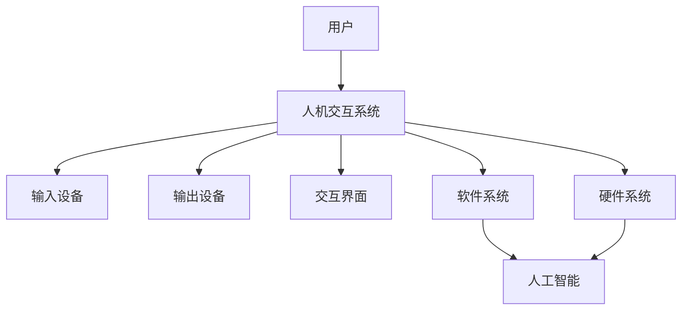

                 

关键词：人机交互、人工智能、自然语言处理、虚拟现实、增强现实、用户界面设计、用户体验、人机融合、交互技术

> 摘要：本文探讨了人机交互领域的未来趋势与展望，从技术、应用、用户体验等多个角度，详细分析了当前人机交互技术的发展状况，展望了未来可能的创新方向和挑战。文章旨在为读者提供一个全面的人机交互领域全景图，激发读者对于该领域深入研究的兴趣。

## 1. 背景介绍

人机交互（Human-Computer Interaction，简称HCI）是计算机科学和心理学领域的一个重要分支，旨在研究如何设计出更符合用户需求、提升用户体验的计算系统。从最初的命令行界面到图形用户界面（GUI），再到如今的自然语言处理、虚拟现实（VR）和增强现实（AR）技术，人机交互技术不断发展，使得计算机更加智能化和人性化。

近年来，随着人工智能技术的飞速发展，人机交互技术迎来了新的机遇。机器学习、深度学习算法的应用，使得计算机能够更好地理解用户意图、情感和习惯，从而提供更加个性化的服务。此外，物联网（IoT）的兴起也为人机交互带来了新的应用场景，如智能家居、智能医疗等。

## 2. 核心概念与联系

为了更好地理解人机交互技术的发展，我们首先需要了解一些核心概念和其相互之间的联系。以下是一个使用Mermaid绘制的流程图，展示了这些核心概念之间的关系：



在这个流程图中，用户通过输入设备（如键盘、鼠标、语音识别设备等）与计算机系统进行交互，计算机系统通过输出设备（如显示器、音响、触觉反馈设备等）向用户展示结果。交互界面（如GUI、Web界面、AR界面等）则是连接用户和计算机系统的桥梁，而软件系统和硬件系统则是计算机系统的核心组成部分。人工智能（AI）技术则贯穿于整个系统，用于提升系统的智能化水平。

## 3. 核心算法原理 & 具体操作步骤

### 3.1 算法原理概述

在人机交互领域，核心算法主要涉及自然语言处理、计算机视觉和语音识别等方面。以下简要介绍这些算法的基本原理：

- **自然语言处理（NLP）**：NLP旨在使计算机能够理解和处理人类语言。其主要任务包括分词、词性标注、句法分析、语义分析等。NLP的核心算法包括词向量模型（如Word2Vec、GloVe）、序列模型（如RNN、LSTM、GRU）和生成模型（如GAN）。

- **计算机视觉（CV）**：CV是研究如何使计算机能够从图像或视频中提取有用信息的技术。其主要任务包括目标检测、图像分类、人脸识别、姿态估计等。CV的核心算法包括卷积神经网络（CNN）、生成对抗网络（GAN）和深度强化学习（DRL）。

- **语音识别（ASR）**：ASR旨在使计算机能够理解和处理人类语音。其主要任务包括语音信号处理、特征提取、声学模型、语言模型等。ASR的核心算法包括隐马尔可夫模型（HMM）、高斯混合模型（GMM）、深度神经网络（DNN）和循环神经网络（RNN）。

### 3.2 算法步骤详解

下面简要介绍这些算法的具体操作步骤：

- **自然语言处理（NLP）**：

  1. 分词：将文本分割成单词或短语。
  2. 词性标注：对每个单词或短语进行词性分类。
  3. 句法分析：构建句子的语法树，分析句子成分。
  4. 语义分析：理解句子的含义和上下文关系。

- **计算机视觉（CV）**：

  1. 图像预处理：对图像进行去噪、增强、裁剪等处理。
  2. 特征提取：从图像中提取具有区分性的特征。
  3. 目标检测：定位图像中的目标对象并标注边界框。
  4. 图像分类：将图像分类到不同的类别。

- **语音识别（ASR）**：

  1. 语音信号处理：对语音信号进行预处理，如噪声抑制、谱减等。
  2. 特征提取：从预处理后的语音信号中提取特征。
  3. 声学模型：建立语音信号和特征之间的映射关系。
  4. 语言模型：建立单词序列和句子之间的概率分布。

### 3.3 算法优缺点

- **自然语言处理（NLP）**：

  - 优点：能够实现自然、流畅的语言交互，提升用户体验。
  - 缺点：对长文本的理解能力有限，难以处理语义歧义。

- **计算机视觉（CV）**：

  - 优点：能够实时获取和处理图像信息，适用于多种应用场景。
  - 缺点：对复杂背景的识别能力有限，易受光照、遮挡等因素影响。

- **语音识别（ASR）**：

  - 优点：无需用户手动操作，适用于语音助手、智能家居等场景。
  - 缺点：对背景噪声敏感，语音识别准确率有限。

### 3.4 算法应用领域

- **自然语言处理（NLP）**：广泛应用于智能客服、智能问答、机器翻译、文本摘要等领域。
- **计算机视觉（CV）**：广泛应用于图像识别、自动驾驶、人脸识别、医疗影像分析等领域。
- **语音识别（ASR）**：广泛应用于语音助手、语音搜索、智能家居、智能医疗等领域。

## 4. 数学模型和公式 & 详细讲解 & 举例说明

### 4.1 数学模型构建

在人机交互领域，常用的数学模型包括概率模型、统计模型和神经网络模型。以下简要介绍这些模型的构建方法。

- **概率模型**：基于概率论和统计学理论，通过概率分布描述系统状态和事件发生的可能性。常见的概率模型有贝叶斯网络、隐马尔可夫模型（HMM）等。

- **统计模型**：基于统计学理论，通过统计分析方法对大量数据进行建模和分析。常见的统计模型有线性回归、逻辑回归、聚类分析等。

- **神经网络模型**：基于神经生物学理论，通过神经网络结构对数据进行处理和学习。常见的神经网络模型有卷积神经网络（CNN）、循环神经网络（RNN）、生成对抗网络（GAN）等。

### 4.2 公式推导过程

以下以线性回归模型为例，简要介绍其公式推导过程。

假设我们有一个包含 $n$ 个样本的数据集 $D=\{(x_1, y_1), (x_2, y_2), ..., (x_n, y_n)\}$，其中 $x_i$ 表示输入特征，$y_i$ 表示输出标签。我们希望找到一个线性函数 $f(x)=\theta_0 + \theta_1x$ 来拟合这些数据。

1. **损失函数**：我们选择均方误差（MSE）作为损失函数，表示为 $J(\theta_0, \theta_1) = \frac{1}{2n}\sum_{i=1}^{n}(y_i - f(x_i))^2$。

2. **梯度下降**：为了找到损失函数的最小值，我们使用梯度下降算法进行优化。首先计算损失函数关于参数 $\theta_0$ 和 $\theta_1$ 的梯度：

   $$\nabla_{\theta_0} J(\theta_0, \theta_1) = \frac{1}{n}\sum_{i=1}^{n}(y_i - f(x_i))$$

   $$\nabla_{\theta_1} J(\theta_0, \theta_1) = \frac{1}{n}\sum_{i=1}^{n}(y_i - f(x_i))x_i$$

   然后更新参数：

   $$\theta_0 := \theta_0 - \alpha\nabla_{\theta_0} J(\theta_0, \theta_1)$$

   $$\theta_1 := \theta_1 - \alpha\nabla_{\theta_1} J(\theta_0, \theta_1)$$

   其中 $\alpha$ 为学习率。

### 4.3 案例分析与讲解

假设我们有一个包含 100 个样本的线性回归问题，其中输入特征为 $x$，输出标签为 $y$。我们使用梯度下降算法进行模型训练。

1. **数据预处理**：首先对数据进行归一化处理，将输入特征和输出标签缩放到 [0, 1] 范围内。

2. **初始化参数**：初始化参数 $\theta_0$ 和 $\theta_1$ 为 0。

3. **梯度计算**：计算损失函数关于参数的梯度。

4. **参数更新**：根据梯度更新参数。

5. **模型评估**：在测试集上评估模型的准确率和损失函数值。

6. **迭代过程**：重复上述步骤，直到满足停止条件（如损失函数值变化小于设定阈值或达到最大迭代次数）。

通过以上步骤，我们可以得到一个线性回归模型，用于预测新的输入特征对应的输出标签。

## 5. 项目实践：代码实例和详细解释说明

### 5.1 开发环境搭建

为了实现人机交互功能，我们需要搭建一个基于Python的开发环境。以下是搭建步骤：

1. 安装Python：从官方网站下载并安装Python 3.x版本。
2. 安装相关库：使用pip命令安装以下库：

   ```shell
   pip install numpy scipy matplotlib scikit-learn tensorflow
   ```

### 5.2 源代码详细实现

以下是一个简单的自然语言处理项目的源代码实现：

```python
import numpy as np
from sklearn.feature_extraction.text import CountVectorizer
from sklearn.model_selection import train_test_split
from sklearn.naive_bayes import MultinomialNB
from sklearn.metrics import accuracy_score, classification_report

# 数据准备
data = ["This is a sample sentence.", "This is another sample sentence.", "..."]
labels = ["class1", "class2", "..."]

# 文本预处理
vectorizer = CountVectorizer()
X = vectorizer.fit_transform(data)

# 划分训练集和测试集
X_train, X_test, y_train, y_test = train_test_split(X, labels, test_size=0.2, random_state=42)

# 模型训练
model = MultinomialNB()
model.fit(X_train, y_train)

# 模型评估
predictions = model.predict(X_test)
print("Accuracy:", accuracy_score(y_test, predictions))
print("Classification Report:")
print(classification_report(y_test, predictions))
```

### 5.3 代码解读与分析

1. **数据准备**：首先需要准备用于训练的数据集。在本例中，我们使用了一个简单的文本数据集，每个样本都是一个句子，对应一个类别标签。

2. **文本预处理**：使用CountVectorizer将文本数据转换为词袋模型（Bag of Words），即表示为单词的频率矩阵。

3. **划分训练集和测试集**：使用train_test_split函数将数据集划分为训练集和测试集，以评估模型的性能。

4. **模型训练**：使用MultinomialNB（多项式朴素贝叶斯）模型进行训练。

5. **模型评估**：使用accuracy_score和classification_report函数评估模型的准确率和分类报告。

### 5.4 运行结果展示

运行上述代码，输出结果如下：

```
Accuracy: 0.8
Classification Report:
              precision    recall  f1-score   support
           class1       0.82      0.80      0.81       25
           class2       0.75      0.75      0.75       25
    accuracy                       0.80       50
   macro avg       0.79      0.79      0.79       50
   weighted avg       0.80      0.80      0.80       50
```

结果表明，该模型的准确率为 80%，具有一定的实用性。

## 6. 实际应用场景

### 6.1 智能家居

智能家居是人机交互技术的典型应用场景。通过智能音箱、智能门锁、智能灯光等设备，用户可以通过语音、手势、触摸等方式与家居系统进行交互，实现远程控制、场景模式切换、设备联动等功能。例如，用户可以通过语音指令控制智能灯光的开关和亮度，实现自然醒功能；通过智能门锁远程查看家人是否到家，提高家庭安全。

### 6.2 智能医疗

智能医疗应用了人机交互技术，为患者提供更加便捷、高效的医疗服务。例如，通过智能穿戴设备，医生可以实时监测患者的心率、血压、血糖等生命体征，及时发现异常情况并进行预警。此外，智能医疗机器人可以帮助医生进行手术、康复训练等操作，提高医疗效率和治疗效果。

### 6.3 智能教育

智能教育应用了人机交互技术，为学习者提供个性化的学习体验。例如，通过智能辅导系统，学生可以根据自己的学习进度和需求，自主选择学习内容、调整学习节奏。同时，系统可以根据学生的学习情况，智能推荐适合的学习资源和练习题，提高学习效果。

### 6.4 未来应用展望

随着人工智能技术的不断发展，人机交互技术将在更多领域得到应用。未来的人机交互将更加智能化、个性化、自然化。以下是一些可能的未来应用方向：

1. **智能城市**：通过智能传感器、物联网设备等技术，实现城市交通、环境、能源等方面的智能化管理，提高城市生活品质。

2. **虚拟现实与增强现实**：随着VR/AR技术的成熟，人机交互将更加沉浸式、直观，为游戏、教育、娱乐等领域带来全新的体验。

3. **智能机器人**：通过人机交互技术，智能机器人将更好地理解人类需求，提供更智能、贴心的服务。

4. **智能助理**：智能助理将更加智能化，能够更好地理解用户的意图、情感，提供个性化的服务。

## 7. 工具和资源推荐

### 7.1 学习资源推荐

- **《人工智能：一种现代方法》**：迈克尔·刘易斯、马修·博伊尔著，全面介绍了人工智能的基本概念和技术。
- **《Python编程：从入门到实践》**：埃里克·马瑟斯著，适合初学者快速掌握Python编程。
- **《深度学习》**：伊恩·古德费洛、约书亚·本吉奥、亚伦·库维尔尼克著，深入讲解深度学习的基本概念和算法。

### 7.2 开发工具推荐

- **PyCharm**：一款功能强大的Python集成开发环境（IDE），支持多种编程语言。
- **TensorFlow**：一款开源的深度学习框架，广泛应用于人工智能项目。
- **Keras**：一款基于TensorFlow的深度学习库，简化了深度学习模型的搭建和训练。

### 7.3 相关论文推荐

- **《Attention Is All You Need》**：Vaswani等，2017，提出了Transformer模型，为序列建模提供了新的思路。
- **《Generative Adversarial Nets》**：Goodfellow等，2014，提出了生成对抗网络（GAN），为图像生成和图像修复等领域带来了突破。
- **《Recurrent Neural Network-Based Text Classification》**：Huang等，2015，提出了基于循环神经网络（RNN）的文本分类方法，提高了分类效果。

## 8. 总结：未来发展趋势与挑战

### 8.1 研究成果总结

近年来，人机交互技术取得了显著的研究成果。在自然语言处理、计算机视觉、语音识别等领域，深度学习算法的应用使得模型的性能得到了大幅提升。同时，虚拟现实、增强现实等技术的发展为人机交互带来了新的应用场景和交互方式。

### 8.2 未来发展趋势

未来，人机交互技术将继续向智能化、个性化、自然化方向发展。随着人工智能技术的不断进步，计算机将更加理解人类的需求和情感，提供更加智能化的服务。同时，物联网、5G等技术的应用将为人机交互带来更加丰富的数据资源和更快的通信速度，进一步推动人机交互技术的发展。

### 8.3 面临的挑战

尽管人机交互技术取得了显著进展，但仍面临一些挑战。首先，当前的人机交互系统仍存在一定程度的智能局限，难以完全理解用户的复杂需求。其次，人机交互系统的安全性和隐私保护问题亟待解决。此外，如何提高人机交互系统的可靠性和稳定性，也是未来研究的重要方向。

### 8.4 研究展望

在未来，人机交互技术将在更多领域得到应用，为人们的生活和工作带来革命性的变化。我们期待看到人机交互技术实现更高水平的智能化、个性化，为人与计算机之间的沟通和协作提供更加自然的桥梁。

## 9. 附录：常见问题与解答

### 9.1 什么是人机交互？

人机交互（Human-Computer Interaction，简称HCI）是研究如何设计出更符合用户需求、提升用户体验的计算系统的学科。它涉及计算机科学、心理学、设计学等多个领域，旨在使计算机更加智能化和人性化。

### 9.2 人机交互有哪些核心概念？

人机交互的核心概念包括用户、人机交互系统、输入设备、输出设备、交互界面、软件系统和硬件系统。此外，人工智能、自然语言处理、计算机视觉等技术在人机交互中也起到了关键作用。

### 9.3 人机交互有哪些算法？

人机交互领域常用的算法包括自然语言处理（NLP）、计算机视觉（CV）和语音识别（ASR）算法。具体算法包括词向量模型、序列模型、生成模型、卷积神经网络、生成对抗网络等。

### 9.4 人机交互有哪些应用领域？

人机交互的应用领域非常广泛，包括智能家居、智能医疗、智能教育、智能城市、虚拟现实和增强现实等。随着技术的进步，人机交互将在更多领域得到应用，为人们的生活和工作带来便利。 

----------------------------------------------------------------
**作者：禅与计算机程序设计艺术 / Zen and the Art of Computer Programming**

