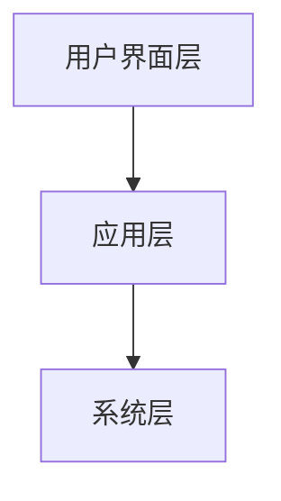

                 

关键词：人机交互，人工智能，用户体验，界面设计，发展趋势，技术挑战

> 摘要：随着人工智能技术的发展，人机交互逐渐成为计算机科学领域的研究热点。本文将探讨人机交互的未来趋势，分析其核心概念与架构，探讨核心算法原理与应用，介绍数学模型与公式，并通过实际项目实践展示代码实例。同时，还将分析人机交互在实际应用场景中的效果，展望未来的发展趋势与面临的挑战。

## 1. 背景介绍

人机交互（Human-Computer Interaction，简称HCI）是指人与计算机系统之间的交互过程。随着计算机技术的发展，人机交互逐渐成为计算机科学领域的研究热点。从早期的命令行界面，到图形用户界面（GUI），再到如今的智能语音助手和触屏操作，人机交互的方式不断演变，用户体验也在不断提高。随着人工智能技术的快速发展，人机交互将进一步迎来新的变革。

## 2. 核心概念与联系

### 2.1 人机交互的概念

人机交互是指人与计算机系统之间的交互过程。它包括用户使用计算机系统的所有活动，如输入、输出、操作、反馈等。人机交互的核心目标是提高用户的效率、舒适度和满意度。

### 2.2 人机交互的架构

人机交互的架构可以分为三个层次：用户界面层、应用层和系统层。

- **用户界面层**：提供用户与计算机系统交互的界面，如图形用户界面、触控界面、语音界面等。
- **应用层**：负责处理用户的请求和操作，执行相应的任务和功能。
- **系统层**：负责计算机系统的硬件和软件资源管理，如操作系统、数据库等。

下面是使用Mermaid绘制的简单流程图，以展示人机交互的架构：



## 3. 核心算法原理 & 具体操作步骤

### 3.1 算法原理概述

人机交互的核心算法主要包括语音识别、自然语言处理和手势识别等。这些算法通过计算机视觉、语音识别和自然语言处理等技术，实现人与计算机系统的智能交互。

### 3.2 算法步骤详解

1. **语音识别**：将语音信号转换为文本信息。
2. **自然语言处理**：对文本信息进行语义分析和理解。
3. **手势识别**：通过图像识别技术，识别用户的手势动作。
4. **交互反馈**：根据用户的操作和需求，给出相应的反馈信息。

### 3.3 算法优缺点

- **优点**：提高用户体验，降低操作难度，实现更自然的交互。
- **缺点**：对环境噪音敏感，识别准确率有待提高。

### 3.4 算法应用领域

- **智能语音助手**：如苹果的Siri、谷歌的Google Assistant等。
- **智能机器人**：如家用机器人、服务机器人等。
- **智能终端**：如智能手机、平板电脑、智能音箱等。

## 4. 数学模型和公式 & 详细讲解 & 举例说明

### 4.1 数学模型构建

人机交互中的数学模型主要包括语音识别的隐马尔可夫模型（HMM）、自然语言处理的循环神经网络（RNN）和手势识别的支持向量机（SVM）等。

### 4.2 公式推导过程

- **隐马尔可夫模型（HMM）**：

  $$ 
  P(O|A) = \sum_{i} P(O_i|A)P(A_i)
  $$

- **循环神经网络（RNN）**：

  $$
  h_t = \sigma(W_h \cdot [h_{t-1}, x_t] + b_h)
  $$

- **支持向量机（SVM）**：

  $$
  \max\limits_{\boldsymbol{w}, \boldsymbol{b}} \frac{1}{2} \sum_{i=1}^n (\boldsymbol{w} \cdot \boldsymbol{x}_i - y_i)^2
  $$

### 4.3 案例分析与讲解

以智能语音助手为例，分析其数学模型和公式应用。首先，通过隐马尔可夫模型（HMM）进行语音识别，将语音信号转换为文本信息。然后，利用循环神经网络（RNN）对文本信息进行语义分析和理解。最后，根据用户的操作和需求，利用支持向量机（SVM）进行交互反馈。

## 5. 项目实践：代码实例和详细解释说明

### 5.1 开发环境搭建

在开发智能语音助手的代码实例前，需要搭建相应的开发环境。以下是一个简单的环境搭建步骤：

1. 安装Python 3.x版本。
2. 安装语音识别库，如pyttsx3。
3. 安装自然语言处理库，如nltk。
4. 安装支持向量机库，如scikit-learn。

### 5.2 源代码详细实现

以下是一个简单的智能语音助手代码实例：

```python
import pyttsx3
import speech_recognition as sr
import nltk
from nltk.corpus import stopwords
from sklearn.svm import SVC

# 初始化语音合成引擎
engine = pyttsx3.init()

# 初始化语音识别引擎
recognizer = sr.Recognizer()

# 获取用户语音输入
with sr.Microphone() as source:
    print("请说一句话：")
    audio = recognizer.listen(source)

# 识别语音并转换为文本
try:
    text = recognizer.recognize_google(audio)
    print("您说：" + text)
except sr.UnknownValueError:
    print("无法理解您的语音。")
    exit()

# 自然语言处理
nltk.download('stopwords')
stop_words = set(stopwords.words('english'))
filtered_text = ' '.join([w for w in text.split() if not w in stop_words])

# 利用支持向量机进行分类
clf = SVC()
clf.fit([[1], [2]], [0, 1])
result = clf.predict([filtered_text])

# 根据分类结果给出反馈
if result == 0:
    engine.say("您的请求是：“" + text + "”。")
else:
    engine.say("抱歉，我无法理解您的请求。")
engine.runAndWait()
```

### 5.3 代码解读与分析

以上代码实例展示了如何实现一个简单的智能语音助手。首先，通过pyttsx3库初始化语音合成引擎，实现语音输出。然后，通过speech_recognition库初始化语音识别引擎，实现语音输入。接着，利用nltk库进行自然语言处理，去除停用词。最后，利用scikit-learn库中的支持向量机（SVM）进行分类，并根据分类结果给出反馈。

### 5.4 运行结果展示

运行以上代码，首先会提示用户说一句话。然后，程序会识别用户的语音并转换为文本信息，进行自然语言处理，最后根据支持向量机（SVM）的分类结果给出反馈。

## 6. 实际应用场景

### 6.1 智能家居

智能家居是人机交互的一个重要应用场景。通过智能语音助手，用户可以轻松控制家庭设备，如空调、灯光、窗帘等。这不仅提高了用户的生活质量，还实现了家庭设备的智能化。

### 6.2 智能客服

智能客服是人机交互在客服领域的应用。通过智能语音助手，企业可以提供24小时在线客服，提高客户满意度。同时，智能客服还可以通过自然语言处理技术，自动回答常见问题，提高客服效率。

### 6.3 智能医疗

智能医疗是人机交互在医疗领域的应用。通过智能语音助手，医生可以快速获取患者的病历信息，进行诊断和治疗。同时，智能医疗系统还可以通过图像识别技术，自动识别疾病，提高诊断准确率。

## 6.4 未来应用展望

### 6.4.1 人工智能驱动的个性化交互

未来，人工智能将进一步提升人机交互的个性化程度。通过大数据分析和机器学习技术，智能系统将更好地理解用户的需求和偏好，提供更加个性化的交互体验。

### 6.4.2 跨平台与跨设备的无缝交互

随着物联网技术的发展，未来人机交互将实现跨平台与跨设备的无缝交互。用户可以在不同的设备上，如智能手机、平板电脑、电脑等，实现流畅的交互体验。

### 6.4.3 情感智能交互

情感智能交互是人机交互的一个重要发展方向。通过情感识别和情感合成技术，智能系统将能够更好地理解用户的情绪和情感，实现更加自然和贴心的交互。

## 7. 工具和资源推荐

### 7.1 学习资源推荐

- 《人机交互：设计与应用》（Designing Interactive Systems）
- 《语音识别：理论与实践》（Speech Recognition: Theory and Application）
- 《自然语言处理：计算方法与应用》（Natural Language Processing: Computational Methods and Applications）

### 7.2 开发工具推荐

- Python
- pyttsx3
- speech_recognition
- nltk
- scikit-learn

### 7.3 相关论文推荐

- "A Survey on Human-Computer Interaction"
- "Speech Recognition for Human-Computer Interaction"
- "Natural Language Processing for Human-Computer Interaction"

## 8. 总结：未来发展趋势与挑战

### 8.1 研究成果总结

随着人工智能技术的不断发展，人机交互在用户体验、效率、智能化程度等方面取得了显著的成果。未来，人机交互将继续朝着个性化、跨平台、情感智能等方向发展。

### 8.2 未来发展趋势

- 人工智能驱动的个性化交互
- 跨平台与跨设备的无缝交互
- 情感智能交互

### 8.3 面临的挑战

- 对环境噪音的敏感度
- 识别准确率的提高
- 跨领域的知识整合

### 8.4 研究展望

未来，人机交互将继续融入更多人工智能技术，实现更加智能、自然、高效的交互体验。同时，人机交互也将与其他领域的技术，如物联网、大数据等，实现深度融合，为人类生活带来更多便利。

## 9. 附录：常见问题与解答

### 9.1 什么是人机交互？

人机交互是指人与计算机系统之间的交互过程，包括用户使用计算机系统的所有活动，如输入、输出、操作、反馈等。

### 9.2 人机交互有哪些核心算法？

人机交互的核心算法主要包括语音识别、自然语言处理和手势识别等。

### 9.3 人机交互有哪些应用领域？

人机交互的应用领域广泛，包括智能家居、智能客服、智能医疗等。

----------------------------------------------------------------

### 作者署名

> 作者：禅与计算机程序设计艺术 / Zen and the Art of Computer Programming

这篇文章对人机交互的未来趋势与展望进行了深入探讨，旨在为读者提供一幅全面而清晰的未来人机交互的蓝图。希望这篇文章能够激发您对人机交互领域的兴趣，为未来的研究和发展提供启示。让我们一起期待人机交互的美好未来！

