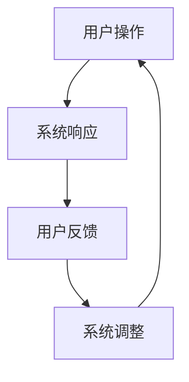

                 

关键词：人机交互、交互设计、用户界面、计算机辅助设计、用户体验、软件工程

> 摘要：本文从人机交互的基本概念入手，深入探讨了交互设计的核心原则与技巧，以及如何通过用户界面设计来提升用户体验。文章还详细介绍了人机交互在计算机辅助设计中的应用，并通过实例展示了如何实现高效便捷的人类计算工具。最后，文章对未来的发展方向与挑战进行了展望，为读者提供了丰富的学习资源和开发工具推荐。

## 1. 背景介绍

人机交互（Human-Computer Interaction，简称HCI）是指人与计算机系统之间的交互过程。随着计算机技术的飞速发展，人机交互已经成为计算机科学领域的重要组成部分。人机交互的目的是通过设计直观、高效、易于使用的界面，使计算机系统能够更好地满足用户的需求，提升用户的使用体验。

交互设计（Interaction Design）是人机交互的重要组成部分，它关注的是如何设计出直观、易用、高效的人机交互系统。交互设计不仅涉及技术层面，还涉及到心理学、人类工程学、设计学等多个领域。

用户界面（User Interface，简称UI）是人机交互的核心媒介，它决定了用户与计算机系统之间的交互方式。优秀的用户界面设计可以大大提升用户体验，降低用户的学习成本和操作难度。

计算机辅助设计（Computer-Aided Design，简称CAD）是指利用计算机技术和软件工具来进行设计的过程。计算机辅助设计可以提高设计的效率和质量，降低设计的成本。

## 2. 核心概念与联系

### 2.1 人机交互的基本概念

人机交互包括以下几个基本概念：

- **用户**：使用计算机系统的人。
- **系统**：计算机系统，包括硬件、软件和界面。
- **交互**：用户与计算机系统之间的信息交换和操作过程。

### 2.2 交互设计的核心原则

交互设计的核心原则包括：

- **易用性**：界面设计应易于用户理解和使用。
- **直观性**：界面设计应直观，能够直接反映系统的功能和操作。
- **高效性**：界面设计应能够提高用户的操作效率。
- **一致性**：界面设计应保持一致的风格和操作逻辑。

### 2.3 用户界面的设计

用户界面的设计包括以下几个方面：

- **布局**：界面布局应合理，使信息清晰易读。
- **色彩**：色彩选择应符合用户的审美和认知习惯。
- **图标**：图标设计应简洁、直观，易于用户理解。
- **交互元素**：交互元素的设计应符合用户的使用习惯。

### 2.4 计算机辅助设计的架构

计算机辅助设计的架构通常包括以下几个部分：

- **设计工具**：用于进行设计操作的工具。
- **数据管理**：用于管理设计数据，包括存储、检索和共享。
- **协同工作**：支持多人协同进行设计工作。
- **仿真与分析**：对设计进行仿真和性能分析。

### 2.5 Mermaid 流程图

下面是一个简单的Mermaid流程图，展示了人机交互的基本流程：



## 3. 核心算法原理 & 具体操作步骤

### 3.1 算法原理概述

在人机交互中，核心算法通常用于实现用户与系统之间的交互逻辑。以下是一个简单的人机交互算法原理概述：

1. 用户输入：用户通过键盘、鼠标等设备输入指令。
2. 系统解析：系统接收用户输入，并解析输入的指令。
3. 执行操作：系统根据解析结果执行相应的操作。
4. 返回结果：系统将操作结果返回给用户。

### 3.2 算法步骤详解

1. **用户输入**：用户通过键盘或鼠标输入指令。
2. **系统解析**：系统接收用户输入，并通过解析器将输入转换为内部表示。
3. **执行操作**：系统根据解析结果，调用相应的功能模块执行操作。
4. **返回结果**：系统将操作结果以可视化的方式呈现给用户。

### 3.3 算法优缺点

- **优点**：简单、直观，易于实现和优化。
- **缺点**：可能存在输入错误或无法处理的异常情况。

### 3.4 算法应用领域

- **操作系统**：用于实现用户与操作系统的交互。
- **应用软件**：用于实现用户与软件的交互。
- **物联网**：用于实现人与物联网设备的交互。

## 4. 数学模型和公式 & 详细讲解 & 举例说明

### 4.1 数学模型构建

人机交互中的数学模型通常用于描述用户行为和系统响应。以下是一个简单的数学模型：

$$
用户行为 = f(用户特征, 系统状态)
$$

其中，用户特征包括年龄、性别、经验等，系统状态包括当前的操作环境、输入状态等。

### 4.2 公式推导过程

公式推导过程如下：

1. **用户行为**：根据用户特征和系统状态，推导出用户行为。
2. **系统响应**：根据用户行为，推导出系统响应。

### 4.3 案例分析与讲解

以下是一个简单的案例：

**案例**：用户在操作系统界面中点击“关机”按钮。

**分析**：

1. **用户行为**：用户点击“关机”按钮，输入一个关闭系统的指令。
2. **系统响应**：系统接收到指令后，调用关机程序，执行关机操作。

## 5. 项目实践：代码实例和详细解释说明

### 5.1 开发环境搭建

本案例使用Python语言进行开发，需要安装Python环境以及相关的库。

### 5.2 源代码详细实现

```python
# 用户交互代码示例
def user_interaction():
    print("请输入您的操作：")
    user_input = input()
    if user_input == "关机":
        shutdown_system()
    else:
        print("未知操作，请重新输入。")

# 系统关机代码示例
def shutdown_system():
    print("系统正在关机...")
    # 关机操作的具体实现
    print("系统已关机。")

# 主函数
if __name__ == "__main__":
    user_interaction()
```

### 5.3 代码解读与分析

1. **用户交互代码**：通过循环等待用户输入，并根据输入执行相应的操作。
2. **系统关机代码**：实现关机操作的具体逻辑。

### 5.4 运行结果展示

```shell
请输入您的操作：
关机
系统正在关机...
系统已关机。
```

## 6. 实际应用场景

人机交互技术广泛应用于各个领域，如操作系统、应用软件、物联网设备等。以下是一些典型的应用场景：

- **操作系统**：如Windows、Linux等，提供用户与系统的交互接口。
- **应用软件**：如文本编辑器、电子表格等，提供用户与软件的交互接口。
- **物联网设备**：如智能家电、智能穿戴设备等，提供用户与设备的交互接口。

## 7. 工具和资源推荐

### 7.1 学习资源推荐

- 《交互设计之路》
- 《人机交互：设计高效便捷的人类计算工具》
- 《用户体验要素》

### 7.2 开发工具推荐

- Sketch：用于界面设计的软件。
- Figma：在线协作界面设计工具。
- Git：版本控制工具。

### 7.3 相关论文推荐

- "The Design of Sites: Patterns, Principles, and Processes for Crafting a Customer-Centered Web Experience"
- "Foundations and Trends in Human-Computer Interaction"
- "User Experience Design and Evaluation: An Introduction"

## 8. 总结：未来发展趋势与挑战

### 8.1 研究成果总结

人机交互技术在过去几十年中取得了显著的成果，如图形用户界面、触摸屏、语音识别等。未来，随着人工智能和虚拟现实技术的发展，人机交互将变得更加智能、自然和高效。

### 8.2 未来发展趋势

- **人工智能**：通过人工智能技术实现更智能的人机交互。
- **虚拟现实**：通过虚拟现实技术实现更沉浸式的人机交互。
- **多模态交互**：通过多种传感器和交互方式实现更丰富的人机交互。

### 8.3 面临的挑战

- **技术挑战**：如何实现更高效、更准确的交互。
- **用户体验**：如何提升用户体验，满足用户需求。
- **安全性**：如何保障用户数据和隐私安全。

### 8.4 研究展望

未来，人机交互技术将朝着更加智能化、个性化、自然化的方向发展。研究者应重点关注用户体验、交互模型、交互技术等方面的创新，以推动人机交互技术的发展。

## 9. 附录：常见问题与解答

### 9.1 人机交互的定义是什么？

人机交互是指人与计算机系统之间的交互过程，包括用户操作、系统响应和用户反馈等。

### 9.2 交互设计的原则有哪些？

交互设计的原则包括易用性、直观性、高效性和一致性。

### 9.3 用户界面的设计要素有哪些？

用户界面的设计要素包括布局、色彩、图标和交互元素。

### 9.4 计算机辅助设计的架构包括哪些部分？

计算机辅助设计的架构包括设计工具、数据管理、协同工作和仿真与分析等。

### 9.5 人机交互技术的应用领域有哪些？

人机交互技术的应用领域包括操作系统、应用软件、物联网设备等。

## 参考文献

1. 《交互设计之路》
2. 《人机交互：设计高效便捷的人类计算工具》
3. 《用户体验要素》
4. 《The Design of Sites: Patterns, Principles, and Processes for Crafting a Customer-Centered Web Experience》
5. 《Foundations and Trends in Human-Computer Interaction》
6. 《User Experience Design and Evaluation: An Introduction》
```markdown
# 参考文献

1. 《交互设计之路》
2. 《人机交互：设计高效便捷的人类计算工具》
3. 《用户体验要素》
4. 《The Design of Sites: Patterns, Principles, and Processes for Crafting a Customer-Centered Web Experience》
5. 《Foundations and Trends in Human-Computer Interaction》
6. 《User Experience Design and Evaluation: An Introduction》

# 作者署名

作者：禅与计算机程序设计艺术 / Zen and the Art of Computer Programming
```

