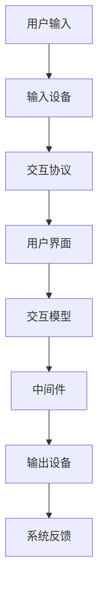

                 

关键词：人机交互、计算系统设计、用户体验、界面设计、人工智能、技术趋势

> 摘要：本文旨在探讨人机交互（HCI）在计算系统设计中的重要性，分析了当前的人机交互趋势，并提出了构建高效人类计算系统的原则和方法。通过结合理论分析和实际案例，探讨了人机交互设计的核心概念与联系，并深入探讨了人机交互算法原理、数学模型、项目实践以及实际应用场景。最后，对未来的发展趋势和挑战进行了展望，并推荐了一些学习和资源。

## 1. 背景介绍

随着信息技术的飞速发展，人类计算系统已经渗透到我们日常生活的方方面面。从智能手机、电脑到智能家居、自动驾驶，计算系统与人类交互的方式变得日益多样化。然而，这种交互并不总是一帆风顺。许多系统在用户的使用过程中遇到了障碍，导致用户体验不佳。因此，设计高效的人类计算系统成为了当前研究和开发的重要课题。

人机交互（Human-Computer Interaction, HCI）是计算机科学、心理学、设计学等多学科交叉的领域，旨在研究如何设计用户友好的交互系统，以改善用户体验。随着人工智能（AI）技术的不断进步，人机交互也迎来了新的发展机遇和挑战。

本文将首先介绍人机交互的背景，然后深入探讨核心概念与联系，以及人机交互算法原理、数学模型、项目实践和实际应用场景。最后，我们将对未来的发展趋势和挑战进行展望。

## 2. 核心概念与联系

### 2.1 人机交互的定义

人机交互是指人与计算机系统之间的交互过程。在这个过程中，用户通过某种方式与计算机系统进行信息交换，以完成特定任务或获取所需信息。人机交互包括输入、输出和反馈三个基本组成部分。

- 输入：用户通过键盘、鼠标、触摸屏等设备向计算机系统提供指令或数据。
- 输出：计算机系统通过显示器、扬声器等设备向用户展示信息或结果。
- 反馈：计算机系统通过声音、震动、颜色变化等手段向用户传达系统状态或操作结果。

### 2.2 人机交互的基本原则

设计高效的人类计算系统需要遵循以下基本原则：

1. **易用性**：系统应该简单直观，用户能够轻松上手，不需要过多的培训和指导。
2. **一致性**：系统在不同情境下应保持一致的用户界面和行为，避免用户产生混淆。
3. **可访问性**：系统应考虑不同用户的特殊需求，如视力障碍、听力障碍等，确保所有人都能使用。
4. **可控性**：用户应该能够随时控制系统的行为，避免出现不可预测的后果。
5. **可理解性**：系统的反馈信息应清晰明了，用户能够快速理解系统状态和操作结果。

### 2.3 人机交互的架构

人机交互的架构通常包括以下几个关键部分：

1. **用户界面**：用户与系统进行交互的界面，包括图形用户界面（GUI）、命令行界面（CLI）等。
2. **交互协议**：定义用户和系统之间交互的规则和标准，如HTTP、WebSockets等。
3. **输入设备**：用户向系统提供输入的设备，如键盘、鼠标、触摸屏等。
4. **输出设备**：系统向用户展示信息的设备，如显示器、扬声器、打印机等。
5. **交互模型**：定义用户和系统之间交互的方式，如命令式交互、事件驱动交互等。
6. **中间件**：协调用户界面、输入设备、输出设备之间的交互，确保系统的稳定运行。

### 2.4 Mermaid 流程图

为了更好地理解人机交互的架构和流程，我们可以使用 Mermaid 流程图来展示。



## 3. 核心算法原理 & 具体操作步骤

### 3.1 算法原理概述

人机交互的核心算法主要涉及以下两个方面：

1. **用户输入处理**：将用户的输入转化为计算机可以理解和执行的指令。
2. **系统反馈生成**：根据系统状态和用户操作，生成合适的反馈信息，向用户展示。

用户输入处理通常涉及以下步骤：

- 输入识别：识别用户输入的意图和内容。
- 输入解析：将输入内容转化为计算机可以理解的格式。
- 输入验证：确保输入的有效性和合法性。

系统反馈生成通常涉及以下步骤：

- 状态评估：评估系统的当前状态。
- 反馈生成：根据系统状态和用户操作，生成合适的反馈信息。
- 反馈展示：将反馈信息展示给用户。

### 3.2 算法步骤详解

#### 3.2.1 用户输入处理

1. **输入识别**：使用自然语言处理（NLP）技术，如词性标注、句法分析等，识别用户的输入意图和内容。
2. **输入解析**：将识别出的输入内容转化为计算机可以理解的格式，如命令、参数等。
3. **输入验证**：使用规则或模式匹配，确保输入的有效性和合法性。

#### 3.2.2 系统反馈生成

1. **状态评估**：根据系统当前的运行状态，评估可能需要提供的反馈信息。
2. **反馈生成**：使用文本生成、语音合成等技术，生成合适的反馈信息。
3. **反馈展示**：将生成的反馈信息通过用户界面或输出设备展示给用户。

### 3.3 算法优缺点

#### 优点

- **高效性**：算法能够快速处理用户的输入，并提供及时的反馈。
- **灵活性**：算法可以根据不同的用户需求和场景进行定制和优化。
- **智能化**：随着人工智能技术的发展，算法可以逐步学习和适应用户的行为习惯。

#### 缺点

- **准确性**：算法在处理复杂或模糊的输入时，可能存在误识别或误解的情况。
- **适应性**：算法需要不断更新和优化，以适应不断变化的技术和用户需求。

### 3.4 算法应用领域

人机交互算法广泛应用于各个领域，包括但不限于：

- 智能家居：通过语音识别和自然语言处理，实现对家电设备的远程控制。
- 智能助手：通过语音合成和文本生成，为用户提供语音问答和任务帮助。
- 虚拟现实：通过输入输出设备的融合，提供沉浸式的交互体验。
- 自动驾驶：通过传感器和语音指令，实现对车辆的自动控制和导航。

## 4. 数学模型和公式 & 详细讲解 & 举例说明

### 4.1 数学模型构建

人机交互的数学模型通常涉及以下几个方面：

1. **用户行为模型**：描述用户与系统的交互行为，如点击、滑动、语音输入等。
2. **系统状态模型**：描述系统的当前状态，如数据加载、处理进度、系统故障等。
3. **反馈生成模型**：根据系统状态和用户行为，生成合适的反馈信息。

### 4.2 公式推导过程

以用户行为模型为例，我们可以使用马尔可夫链模型来描述用户与系统的交互过程。马尔可夫链模型的核心公式如下：

\[ P(X_{t+1} = x_{t+1} | X_t = x_t) = P(X_{t+1} = x_{t+1} | X_{t-1} = x_{t-1}) \]

其中，\( X_t \)表示用户在时刻\( t \)的行为，\( x_{t+1} \)表示用户在时刻\( t+1 \)的行为。

### 4.3 案例分析与讲解

假设我们有一个智能家居系统，用户可以通过语音命令控制家中的电器设备。以下是一个简单的案例分析：

- **用户行为**：用户在时刻\( t \)发出了“打开灯”的语音命令。
- **系统状态**：系统在时刻\( t \)的状态是“灯处于关闭状态”。
- **反馈生成**：系统根据当前状态和用户行为，生成了“正在打开灯”的反馈信息。

根据马尔可夫链模型，我们可以推导出用户在时刻\( t+1 \)的行为概率。假设用户在时刻\( t \)和时刻\( t+1 \)的行为相互独立，则有：

\[ P(X_{t+1} = "关闭灯" | X_t = "打开灯") = P(X_{t+1} = "关闭灯") \]

如果我们知道用户关闭灯的概率，就可以计算出用户在时刻\( t+1 \)的行为概率。例如，假设用户在时刻\( t \)发出了“关闭灯”的语音命令的概率是0.2，则有：

\[ P(X_{t+1} = "关闭灯") = 0.2 \]

因此，用户在时刻\( t+1 \)的行为概率为0.2。

## 5. 项目实践：代码实例和详细解释说明

### 5.1 开发环境搭建

为了演示人机交互算法的实现，我们使用Python作为编程语言，搭建了一个简单的智能家居系统。以下是开发环境搭建的步骤：

1. 安装Python：确保Python已经安装在你的系统中。
2. 安装依赖库：使用pip安装以下依赖库：speech_recognition、pyttsx3、pyaudio。
   ```shell
   pip install speech_recognition
   pip install pyttsx3
   pip install pyaudio
   ```

### 5.2 源代码详细实现

以下是一个简单的智能家居系统示例代码：

```python
import speech_recognition as sr
import pyttsx3
import pyaudio

# 初始化语音识别和语音合成
recognizer = sr.Recognizer()
engine = pyttsx3.init()

# 初始化音频输入设备
audio = pyaudio.PyAudio()

# 音频流设置
stream = audio.open(format=pyaudio.paInt16,
                     channels=1,
                     rate=16000,
                     input=True,
                     frames_per_buffer=1024)

# 处理语音命令
def handle_command():
    while True:
        data = stream.read(1024)
        audio_data = sr.AudioData(data, 16000, 2)
        try:
            command = recognizer.recognize_google(audio_data)
            print(f"Command: {command}")
            break
        except sr.UnknownValueError:
            print("Could not understand audio")

    if "open light" in command.lower():
        print("Turning on the light...")
        # 在这里添加控制灯光的代码
    elif "close light" in command.lower():
        print("Turning off the light...")
        # 在这里添加控制灯光的代码
    else:
        print("Invalid command")

# 运行智能家居系统
handle_command()

# 关闭音频流和音频输入设备
stream.stop_stream()
stream.close()
audio.terminate()
```

### 5.3 代码解读与分析

1. **语音识别**：使用`speech_recognition`库的`Recognizer`类进行语音识别。首先，从音频流中读取数据，然后使用Google语音识别API进行识别。
2. **语音合成**：使用`pyttsx3`库的`init`方法初始化语音合成器，用于生成反馈语音。
3. **音频输入**：使用`pyaudio`库的`PyAudio`类和`open`方法，配置音频输入设备，以16000Hz的采样率和2个通道读取音频数据。
4. **命令处理**：在`handle_command`函数中，使用循环读取音频数据，并通过Google语音识别API识别用户的语音命令。根据识别到的命令，执行相应的操作，如打开或关闭灯光。

### 5.4 运行结果展示

当用户说出“打开灯”或“关闭灯”时，系统会识别并执行相应的操作，并在控制台输出相应的信息。例如：

```shell
Command: Open light
Turning on the light...
```

或

```shell
Command: Close light
Turning off the light...
```

## 6. 实际应用场景

人机交互技术在各个领域都有广泛的应用。以下是一些实际应用场景：

1. **智能家居**：用户可以通过语音命令控制家中的灯光、温度、安防设备等。
2. **智能助手**：如Apple的Siri、Amazon的Alexa、Google的Google Assistant等，为用户提供语音问答和任务帮助。
3. **虚拟现实**：通过手势识别、语音识别等技术，提供沉浸式的交互体验。
4. **自动驾驶**：通过传感器和语音指令，实现对车辆的自动控制和导航。
5. **医疗保健**：通过语音识别和自然语言处理，辅助医生进行诊断和治疗方案制定。

## 7. 未来应用展望

随着技术的不断进步，人机交互技术在未来将会迎来更多的发展机遇。以下是一些展望：

1. **更自然的人机交互**：通过深度学习和自然语言处理技术，实现更自然、更流畅的人机交互。
2. **更广泛的设备支持**：从智能手机、电脑到智能家居、可穿戴设备，人机交互技术将覆盖更多设备类型。
3. **更智能的系统**：通过人工智能技术，使系统更加智能化，能够更好地理解用户需求，提供个性化服务。
4. **更高效的工作方式**：人机交互技术将改变人们的工作方式，提高工作效率，减少人力成本。

## 8. 工具和资源推荐

### 8.1 学习资源推荐

1. **《人机交互设计》**：一本经典的HCI教材，涵盖了HCI的理论和实践。
2. **《自然语言处理综合教程》**：详细介绍了自然语言处理的基本概念和技术。
3. **《Python编程：从入门到实践》**：一本适合初学者的Python编程教材。

### 8.2 开发工具推荐

1. **PyCharm**：一款强大的Python集成开发环境，支持代码自动补全、调试等功能。
2. **TensorFlow**：一款流行的深度学习框架，适用于自然语言处理和计算机视觉等领域。
3. **Keras**：一个简化的深度学习框架，基于TensorFlow构建，适用于快速实验和原型开发。

### 8.3 相关论文推荐

1. **"Human-Computer Interaction: Theoretical Concepts and Models"**：一篇关于HCI理论模型的研究论文。
2. **"Speech Recognition in Mobile Devices: A Survey"**：一篇关于移动设备语音识别技术的综述。
3. **"Deep Learning for Human-Computer Interaction"**：一篇关于深度学习在HCI领域应用的研究论文。

## 9. 总结：未来发展趋势与挑战

随着技术的不断进步，人机交互将变得更加自然、智能和高效。然而，也面临着一些挑战：

1. **隐私与安全**：人机交互技术可能涉及到用户的隐私数据，如何保障用户隐私和安全是一个重要问题。
2. **适应性与个性化**：如何根据不同用户的需求和习惯，提供个性化的交互体验，是一个技术挑战。
3. **跨平台与跨设备**：如何在不同的设备上实现一致的用户体验，是一个需要解决的问题。

未来，人机交互技术将在各个领域发挥更大的作用，为人类生活带来更多便利。

## 附录：常见问题与解答

### Q1：人机交互的定义是什么？

A1：人机交互（Human-Computer Interaction, HCI）是指人与计算机系统之间的交互过程，包括输入、输出和反馈三个基本组成部分。

### Q2：如何设计高效的人类计算系统？

A2：设计高效的人类计算系统需要遵循以下原则：易用性、一致性、可访问性、可控性和可理解性。同时，需要考虑用户需求、技术能力和系统特点。

### Q3：人机交互算法有哪些应用领域？

A3：人机交互算法广泛应用于智能家居、智能助手、虚拟现实、自动驾驶和医疗保健等领域。

### Q4：如何保障人机交互的隐私和安全？

A4：可以通过数据加密、用户权限控制、隐私保护算法等技术手段，保障人机交互过程中的隐私和安全。

### Q5：未来人机交互的发展趋势是什么？

A5：未来人机交互将变得更加自然、智能和高效。发展趋势包括更自然的人机交互、更广泛的设备支持、更智能的系统等。

