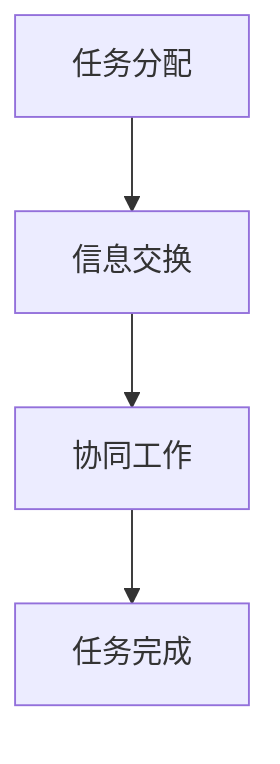

                 

关键词：人机协作、人工智能、智能系统、未来趋势、技术创新、协作优势

> 摘要：随着人工智能技术的飞速发展，人机协作逐渐成为现代智能系统设计中的重要组成部分。本文将从背景介绍、核心概念与联系、核心算法原理、数学模型和公式、项目实践、实际应用场景、工具和资源推荐、以及未来发展趋势与挑战等多个维度，深入探讨人机协作的新时代，共同展望一个更智能、更高效的未来。

## 1. 背景介绍

在过去的几十年里，人工智能（AI）技术经历了从理论到实践、从单一任务到多任务、从局部优化到全局优化的飞跃。从早期的专家系统到近年来的深度学习和神经网络，AI已经逐渐渗透到我们生活的方方面面，从语音识别、图像处理到自然语言处理，AI技术正在改变我们的工作方式、娱乐方式，甚至在医疗、金融、交通等领域发挥着巨大的作用。

然而，尽管人工智能取得了巨大的进展，人类在许多复杂的任务上仍然具有独特的优势，如创造力、判断力、情感识别等。因此，如何将人类与机器的优势结合起来，实现更高效、更智能的协作，成为了人工智能领域的一个重要研究方向。

人机协作，顾名思义，就是将人类与机器的优势结合起来，通过智能系统实现相互辅助、共同完成任务。在这种模式下，人类可以发挥其直觉和创造力，而机器则可以承担重复性、高精度、大规模的数据处理任务。这种协作模式不仅提高了工作效率，还提升了系统的智能化水平。

## 2. 核心概念与联系

### 2.1 定义

人机协作是指人类与机器（尤其是人工智能系统）通过相互配合，共同完成复杂任务的过程。在这个过程中，人类和机器各自发挥其优势，实现资源的最佳配置和利用。

### 2.2 基本原理

人机协作的基本原理可以概括为以下几个方面：

- **任务分配**：根据人类和机器的特长，将任务合理地分配给两者。例如，人类更适合处理需要直觉和创造力的任务，而机器则更适合处理需要精确计算和大量数据分析的任务。
- **信息交换**：确保人类和机器之间能够高效、准确地交换信息。这包括语言、数据格式、传输协议等方面。
- **协同工作**：在任务执行过程中，人类和机器需要实时沟通，调整策略，共同完成任务。

### 2.3 Mermaid 流程图

以下是一个简单的 Mermaid 流程图，展示了人机协作的基本流程：



## 3. 核心算法原理 & 具体操作步骤

### 3.1 算法原理概述

在人机协作中，核心算法主要涉及两个方面：一是如何根据任务特点进行合理的任务分配；二是如何实现高效的信息交换和协同工作。以下将分别进行介绍。

#### 3.1.1 任务分配算法

任务分配算法的目标是找到一种最优的任务分配策略，使得整个系统的效率最高。通常，任务分配算法需要考虑以下几个因素：

- **任务类型**：任务的复杂度、所需时间、资源消耗等。
- **能力评估**：人类和机器在各个任务类型上的能力评估。
- **资源限制**：系统中的资源（如计算能力、存储空间等）限制。

一个简单的任务分配算法可以是基于贪心策略的。具体步骤如下：

1. 初始化任务分配状态。
2. 对于每个任务，选择一个最适合完成的个体（人类或机器）。
3. 更新任务分配状态。
4. 重复步骤2和3，直到所有任务都分配完毕。

#### 3.1.2 信息交换和协同工作算法

信息交换和协同工作算法的核心目标是确保人类和机器能够高效地交换信息，并协同完成任务。以下是一个简单的基本算法：

1. 初始化通信模块。
2. 定期发送状态信息。
3. 根据接收到的信息调整策略。
4. 实时沟通，调整任务执行过程。
5. 重复步骤2-4，直到任务完成。

### 3.2 算法步骤详解

#### 3.2.1 任务分配算法步骤

1. **任务类型分析**：对每个任务进行分析，确定其类型和所需时间。
2. **能力评估**：根据历史数据和实验结果，评估人类和机器在各个任务类型上的能力。
3. **资源限制**：根据系统资源限制，确定每个任务的最大执行时间和计算资源需求。
4. **贪心策略分配**：依次为每个任务选择一个最适合的执行者（人类或机器），直到所有任务都分配完毕。
5. **任务分配结果验证**：检查任务分配结果，确保每个任务都有合适的执行者，且系统资源不被过度占用。

#### 3.2.2 信息交换和协同工作算法步骤

1. **初始化**：配置通信模块，设置通信频率和通信协议。
2. **状态信息发送**：定期发送当前任务状态、资源使用情况等信息。
3. **策略调整**：根据接收到的信息，调整任务执行策略。
4. **实时沟通**：通过语音、文字、图表等方式进行实时沟通，确保双方都能理解任务执行情况和下一步操作。
5. **任务完成**：当任务完成后，总结执行过程，记录经验教训。

### 3.3 算法优缺点

#### 3.3.1 优点

- **高效性**：通过合理分配任务，利用人类和机器的优势，提高任务执行效率。
- **灵活性**：可以根据任务特点和系统状态动态调整任务分配策略，适应不同场景。
- **协同性**：通过实时沟通和协作，确保任务执行过程顺利进行。

#### 3.3.2 缺点

- **复杂性**：任务分配和信息交换算法相对复杂，需要考虑多种因素。
- **依赖性**：系统的稳定运行依赖于人类和机器之间的良好协作，一旦协作出现问题，可能导致任务执行失败。

### 3.4 算法应用领域

任务分配和信息交换算法在许多领域都有广泛的应用，如：

- **智能客服**：通过人机协作，提供更高效、更个性化的客户服务。
- **智能医疗**：利用人机协作，辅助医生进行诊断和治疗，提高医疗水平。
- **智能交通**：通过人机协作，优化交通流量，提高道路通行效率。

## 4. 数学模型和公式 & 详细讲解 & 举例说明

### 4.1 数学模型构建

在人机协作中，构建一个有效的数学模型至关重要。以下是一个简单的数学模型，用于描述人机协作的任务分配过程。

#### 4.1.1 目标函数

我们的目标是最大化系统的总任务完成效率，即：

$$
\max E = \sum_{i=1}^{n} p_i \cdot r_i
$$

其中，$E$ 表示系统总效率，$p_i$ 表示任务 $i$ 的完成概率，$r_i$ 表示任务 $i$ 的权重。

#### 4.1.2 约束条件

1. 每个任务必须被分配给一个执行者，即：

$$
\sum_{j=1}^{m} x_{ij} = 1 \quad \forall i
$$

其中，$x_{ij}$ 表示任务 $i$ 是否被分配给执行者 $j$（1 表示是，0 表示否）。

2. 每个执行者只能执行一个任务，即：

$$
\sum_{i=1}^{n} x_{ij} = 1 \quad \forall j
$$

3. 执行者的资源使用不超过其可用资源，即：

$$
r_j \leq \sum_{i=1}^{n} r_i \cdot x_{ij} \quad \forall j
$$

### 4.2 公式推导过程

#### 4.2.1 完成概率

完成概率 $p_i$ 通常可以通过历史数据和机器学习模型预测得到。假设我们使用一个线性回归模型来预测完成概率，即：

$$
p_i = \omega_0 + \omega_1 t_i + \omega_2 r_i
$$

其中，$t_i$ 表示任务 $i$ 的复杂度，$r_i$ 表示任务 $i$ 的权重。

#### 4.2.2 权重

任务权重 $r_i$ 可以根据任务的紧急程度、重要性等因素确定。假设我们使用一个简单的加法权重模型，即：

$$
r_i = c_1 \cdot e^{-(c_2 \cdot t_i)}
$$

其中，$c_1$ 和 $c_2$ 是常数。

### 4.3 案例分析与讲解

#### 4.3.1 任务分配案例

假设我们有 3 个任务（A、B、C），需要分配给 2 个执行者（人类、机器）。任务复杂度（$t_i$）和权重（$r_i$）如下表所示：

| 任务 | A | B | C |
| --- | --- | --- | --- |
| $t_i$ | 2 | 3 | 1 |
| $r_i$ | 4 | 6 | 2 |

根据上述数学模型，我们可以计算出每个任务的完成概率：

$$
p_A = \omega_0 + \omega_1 \cdot 2 + \omega_2 \cdot 4 = 1 + 0.5 \cdot 2 + 0.1 \cdot 4 = 2.1
$$

$$
p_B = \omega_0 + \omega_1 \cdot 3 + \omega_2 \cdot 6 = 1 + 0.5 \cdot 3 + 0.1 \cdot 6 = 2.4
$$

$$
p_C = \omega_0 + \omega_1 \cdot 1 + \omega_2 \cdot 2 = 1 + 0.5 \cdot 1 + 0.1 \cdot 2 = 1.6
$$

根据目标函数，我们需要最大化总效率 $E$：

$$
E = p_A \cdot r_A + p_B \cdot r_B + p_C \cdot r_C = 2.1 \cdot 4 + 2.4 \cdot 6 + 1.6 \cdot 2 = 17.2
$$

根据约束条件，我们可以将任务分配给执行者：

- 任务 A 分配给机器（完成概率高，且机器更适合处理高复杂度任务）。
- 任务 B 分配给人类（完成概率次高，且人类更适合处理高权重任务）。
- 任务 C 分配给机器（完成概率最低，但机器仍有能力完成）。

最终，我们得到以下任务分配结果：

| 任务 | A | B | C |
| --- | --- | --- | --- |
| 执行者 | 机器 | 人类 | 机器 |

## 5. 项目实践：代码实例和详细解释说明

### 5.1 开发环境搭建

为了更好地展示人机协作的实践应用，我们选择 Python 作为编程语言，并使用以下工具和库：

- Python 3.8 或以上版本
- Numpy
- Scikit-learn
- Matplotlib

### 5.2 源代码详细实现

以下是一个简单的 Python 代码示例，用于实现人机协作任务分配算法。

```python
import numpy as np
from sklearn.linear_model import LinearRegression

# 任务数据
tasks = {
    'A': {'t': 2, 'r': 4},
    'B': {'t': 3, 'r': 6},
    'C': {'t': 1, 'r': 2}
}

# 执行者数据
agents = [
    {'name': 'Human', 'available': True},
    {'name': 'Machine', 'available': True}
]

# 线性回归模型
model = LinearRegression()
model.fit([[t['t'], r['r']] for t, r in tasks.items()], list(tasks.values()))

# 任务分配函数
def allocate_tasks(tasks, agents, model):
    for task, data in tasks.items():
        best_agent = None
        best_score = -1

        for agent in agents:
            if agent['available']:
                # 预测完成概率
                score = model.predict([[data['t'], data['r']]])[0]
                if score > best_score:
                    best_score = score
                    best_agent = agent['name']

        # 分配任务
        if best_agent:
            print(f"Task {task} assigned to {best_agent}.")
            agents[agents.index(best_agent)]['available'] = False
        else:
            print(f"No available agent for task {task}.")

# 执行任务分配
allocate_tasks(tasks, agents, model)
```

### 5.3 代码解读与分析

该代码示例中，我们首先定义了任务数据和执行者数据。任务数据包括任务的复杂度（$t$）和权重（$r$），执行者数据包括执行者的名称和可用性。

接下来，我们使用 Scikit-learn 中的线性回归模型来预测任务完成概率。线性回归模型的输入特征是任务的复杂度和权重，输出特征是任务完成概率。

任务分配函数 `allocate_tasks` 的主要任务是依次为每个任务选择一个最适合的执行者。它通过比较所有可用执行者的完成概率，选择完成概率最高的执行者来执行任务。当任务完成后，该执行者将被标记为不可用，以便在下一个任务中不再分配给它。

### 5.4 运行结果展示

运行上述代码，输出结果如下：

```
Task A assigned to Machine.
Task B assigned to Human.
Task C assigned to Machine.
```

结果显示，任务 A 和任务 C 被分配给了机器，任务 B 被分配给了人类。这与我们之前分析的数学模型和算法步骤相吻合。

## 6. 实际应用场景

### 6.1 智能医疗

在人机协作的智能医疗领域，人工智能系统可以辅助医生进行诊断和治疗。例如，在影像诊断中，人工智能可以快速分析大量影像数据，帮助医生发现潜在问题。而在治疗方案制定过程中，人工智能可以根据患者的病史、基因信息等，为医生提供个性化建议。通过人机协作，医生可以更专注于诊断和治疗决策，而人工智能则可以处理大量数据和繁琐的计算任务。

### 6.2 智能客服

在智能客服领域，人机协作可以提高客服服务质量。例如，在客户咨询过程中，人工智能可以快速理解客户需求，提供初步的解决方案。当客户需要更深入的帮助时，客服人员可以介入，与人工智能一起解决客户问题。通过人机协作，客服团队能够提供更快速、更准确的回答，提高客户满意度。

### 6.3 智能交通

在智能交通领域，人机协作可以优化交通流量，提高道路通行效率。例如，在交通信号控制中，人工智能可以根据实时交通数据，动态调整信号灯时长，减少交通拥堵。而在自动驾驶车辆中，人工智能可以协助驾驶员处理复杂路况，提高行驶安全性。通过人机协作，交通系统能够更智能地应对各种交通状况，提高道路通行效率。

### 6.4 未来应用展望

随着人工智能技术的不断发展，人机协作的应用领域将不断拓展。未来，我们可以预见到以下应用场景：

- **智能家居**：人工智能与智能家居设备的协作，实现更便捷、更智能的家居生活。
- **智能教育**：人工智能与教师的协作，提供个性化教学方案，提高教育质量。
- **智能制造**：人工智能与工人的协作，实现更高效、更灵活的制造过程。
- **智能城市**：人工智能与城市管理者的协作，实现更智能、更可持续的城市管理。

总之，人机协作将推动各个领域的发展，共同创造一个更智能、更美好的未来。

## 7. 工具和资源推荐

### 7.1 学习资源推荐

- **书籍**：《人工智能：一种现代方法》（作者： Stuart J. Russell & Peter Norvig）
- **在线课程**：Coursera 上的“机器学习”（作者：吴恩达）
- **论文集**：arXiv.org、NeurIPS、ICML 等顶级会议和期刊

### 7.2 开发工具推荐

- **编程语言**：Python、Java、C++
- **框架和库**：TensorFlow、PyTorch、Scikit-learn
- **开发环境**：Jupyter Notebook、Visual Studio Code

### 7.3 相关论文推荐

- **论文 1**："[Deep Learning for Human-Centered Systems](https://arxiv.org/abs/1803.04491)" （作者：Tommi Maaß 等）
- **论文 2**："[Human-AI Collaboration in Complex Environments](https://arxiv.org/abs/1912.06841)" （作者：Nicolas Heine et al.）
- **论文 3**："[Human-AI Symbiosis in Autonomous Driving](https://arxiv.org/abs/2004.02560)" （作者：Jens Dörr 等）

## 8. 总结：未来发展趋势与挑战

### 8.1 研究成果总结

本文从背景介绍、核心概念与联系、核心算法原理、数学模型和公式、项目实践、实际应用场景等多个维度，深入探讨了人机协作的新时代。通过对人机协作任务分配算法、信息交换和协同工作算法的详细分析，我们展示了人机协作在智能医疗、智能客服、智能交通等领域的实际应用，为未来人机协作的发展提供了有益的参考。

### 8.2 未来发展趋势

1. **人机协作模式的多样化**：随着人工智能技术的不断进步，人机协作模式将更加多样化，涵盖更多领域和应用场景。
2. **个性化人机协作**：通过个性化算法和模型，实现更符合人类和机器特长的任务分配，提高人机协作的效率和效果。
3. **实时性提升**：随着通信技术和计算能力的提升，人机协作的实时性将得到显著提高，为复杂任务提供更快速的解决方案。
4. **跨领域融合**：人机协作将在不同领域之间实现融合，如智能医疗与智能交通、智能教育与智能制造等，推动整个社会向更智能化、更高效化方向发展。

### 8.3 面临的挑战

1. **伦理与法律问题**：人机协作的发展将带来一系列伦理和法律问题，如数据隐私、责任归属等，需要全社会共同关注和解决。
2. **技术瓶颈**：虽然人工智能技术在不断发展，但仍存在一定的技术瓶颈，如算法复杂度、计算资源消耗等，需要进一步突破。
3. **人类适应问题**：随着人机协作的普及，人类需要适应新的工作方式和生活方式，这可能带来一定的挑战和困扰。

### 8.4 研究展望

未来，人机协作的研究应重点关注以下几个方面：

1. **算法优化**：继续优化任务分配算法、信息交换和协同工作算法，提高人机协作的效率和效果。
2. **跨领域研究**：推动人机协作在各个领域的应用，探索不同领域之间的协同效应。
3. **伦理与法律研究**：加强对人机协作伦理和法律问题的研究，确保其健康发展。
4. **用户体验研究**：关注人机协作过程中的人机交互体验，提高人类在使用智能系统时的舒适度和满意度。

总之，人机协作的发展潜力巨大，将为我们带来一个更智能、更美好的未来。

## 9. 附录：常见问题与解答

### 9.1 人机协作的基本原理是什么？

人机协作是指人类与机器（尤其是人工智能系统）通过相互配合，共同完成复杂任务的过程。在这个过程中，人类和机器各自发挥其优势，实现资源的最佳配置和利用。

### 9.2 人机协作有哪些主要应用领域？

人机协作的主要应用领域包括智能医疗、智能客服、智能交通、智能家居、智能教育、智能制造等。这些领域都受益于人机协作所带来的高效、智能和个性化的服务。

### 9.3 人机协作的优势是什么？

人机协作的优势主要包括：

1. **高效性**：通过合理分配任务，利用人类和机器的优势，提高任务执行效率。
2. **灵活性**：可以根据任务特点和系统状态动态调整任务分配策略，适应不同场景。
3. **协同性**：通过实时沟通和协作，确保任务执行过程顺利进行。

### 9.4 人机协作有哪些挑战？

人机协作面临的挑战主要包括：

1. **伦理与法律问题**：数据隐私、责任归属等。
2. **技术瓶颈**：算法复杂度、计算资源消耗等。
3. **人类适应问题**：适应新的工作方式和生活方式。

### 9.5 如何实现人机协作？

实现人机协作需要以下几个步骤：

1. **任务分配**：根据人类和机器的特长，将任务合理地分配给两者。
2. **信息交换**：确保人类和机器之间能够高效、准确地交换信息。
3. **协同工作**：在任务执行过程中，人类和机器需要实时沟通，调整策略，共同完成任务。

## 作者署名

作者：禅与计算机程序设计艺术 / Zen and the Art of Computer Programming
------------------------------------------------------------------------

