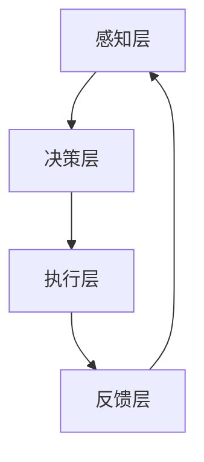

                 

 关键词：人机协作、人工智能、智能未来、技术革新、创新应用

> 摘要：随着人工智能技术的迅猛发展，人机协作已成为推动社会进步的重要力量。本文将探讨人机协作的核心理念、核心算法、数学模型以及实际应用，揭示其未来发展潜力和面临的挑战。

## 1. 背景介绍

在过去的几十年里，计算机科学和技术经历了飞速的发展，特别是人工智能（AI）领域的突破。如今，人工智能技术已经深刻地影响了我们的日常生活和工作方式。从智能手机的语音助手到自动驾驶汽车，从智能医疗诊断到金融风险控制，人工智能无处不在。然而，尽管人工智能取得了显著的进展，但仍然存在着一些局限性。传统的AI系统往往是“单细胞”的，缺乏灵活性和创造性，难以应对复杂多变的实际场景。因此，人机协作应运而生。

人机协作是指人与计算机系统之间相互依赖、相互补充的合作关系。通过结合人类的智慧和计算机的高效处理能力，人机协作系统能够实现更高效的决策、更精准的预测和更优化的解决方案。人机协作不仅能够弥补人工智能的不足，还能够拓展人类认知的边界，为人类社会带来更多的创新和进步。

## 2. 核心概念与联系

### 2.1. 人机协作的基本概念

人机协作的基本概念包括以下几个方面：

- **人**：指具有智慧、创造力、判断力和决策能力的个体。
- **机**：指具有计算能力、存储能力、感知能力和自动化能力的计算机系统。
- **协作**：指人与人、人与机、机与机之间的交互、协同和合作。

人机协作的目标是实现人机之间的无缝对接，使系统能够根据人类的意图和需求，自动地执行复杂的任务，提供智能化的服务。

### 2.2. 人机协作的架构

人机协作的架构通常包括以下几个层次：

- **感知层**：负责收集和感知外部环境的信息，如语音、图像、传感器数据等。
- **决策层**：基于感知层提供的信息，进行决策和任务分配。
- **执行层**：执行决策层的任务，如操作机械臂、发送指令等。
- **反馈层**：收集执行层的结果，并返回给感知层和决策层，以便进行调整和优化。

人机协作的架构图如下所示：



### 2.3. 人机协作的关键技术

人机协作的关键技术包括以下几个方面：

- **自然语言处理**：使计算机能够理解和处理自然语言，实现人与计算机之间的自然对话。
- **机器学习与深度学习**：使计算机能够从数据中学习和发现规律，提高决策和执行能力。
- **人机交互设计**：设计符合人类使用习惯的界面和交互方式，提高用户体验。
- **自动化与智能化技术**：实现自动化任务执行和智能化决策支持，提高工作效率。

## 3. 核心算法原理 & 具体操作步骤

### 3.1. 算法原理概述

人机协作的核心算法主要涉及以下几个方面：

- **协同过滤算法**：通过分析用户的历史行为和偏好，预测用户可能感兴趣的物品或任务。
- **决策树算法**：根据已有数据和特征，构建决策树模型，实现自动化决策。
- **深度强化学习**：通过学习人类专家的行为模式，实现自动化和智能化的任务执行。

### 3.2. 算法步骤详解

以协同过滤算法为例，其基本步骤如下：

1. **数据收集**：收集用户的历史行为数据，如购买记录、浏览记录等。
2. **数据预处理**：对收集到的数据进行分析和清洗，提取有用的特征信息。
3. **模型构建**：使用机器学习算法，如矩阵分解、KNN等，构建协同过滤模型。
4. **预测与推荐**：根据用户的历史行为和模型预测，为用户推荐可能感兴趣的物品或任务。
5. **评估与优化**：对推荐结果进行评估和优化，以提高推荐准确率和用户满意度。

### 3.3. 算法优缺点

协同过滤算法的优点是：

- **个性化推荐**：能够根据用户的历史行为和偏好，提供个性化的推荐。
- **实时性**：可以实时更新和调整推荐结果，以适应用户的需求变化。

缺点是：

- **数据依赖性**：需要大量的用户历史行为数据，否则难以准确预测用户偏好。
- **冷启动问题**：对于新用户，由于缺乏历史行为数据，难以提供有效的推荐。

### 3.4. 算法应用领域

协同过滤算法广泛应用于电子商务、在线教育、社交媒体等领域，如：

- **电子商务平台**：根据用户的购物记录，推荐相关的商品。
- **在线教育平台**：根据学生的学习记录，推荐相关的课程。
- **社交媒体平台**：根据用户的行为和兴趣，推荐相关的文章和内容。

## 4. 数学模型和公式 & 详细讲解 & 举例说明

### 4.1. 数学模型构建

协同过滤算法的数学模型通常是基于矩阵分解的方法。假设有一个用户-物品评分矩阵$R$，其中$R_{ij}$表示用户$i$对物品$j$的评分。矩阵分解的目标是找到两个低维矩阵$U$和$V$，使得$R \approx UV^T$。

### 4.2. 公式推导过程

矩阵分解的推导过程如下：

1. **目标函数**：最小化预测误差的平方和，即$$L= \sum_{i,j} (R_{ij} - u_i v_j)^2$$
2. **梯度下降**：对目标函数进行梯度下降，得到$$u_i = \sum_{j} v_j R_{ij} + \alpha \frac{\partial L}{\partial u_i}$$ $$v_j = \sum_{i} u_i R_{ij} + \alpha \frac{\partial L}{\partial v_j}$$其中$\alpha$为学习率。

### 4.3. 案例分析与讲解

假设有一个用户-物品评分矩阵如下：

| 用户 | 物品1 | 物品2 | 物品3 |
| --- | --- | --- | --- |
| 1 | 5 | 0 | 0 |
| 2 | 0 | 5 | 0 |
| 3 | 0 | 0 | 5 |

使用矩阵分解的方法，将其分解为两个低维矩阵：

$$U = \begin{bmatrix} 0.8 & 0.6 \\ 0.4 & 0.2 \\ 0 & 0 \end{bmatrix} \quad V = \begin{bmatrix} 0.6 & 0.4 \\ 0.2 & 0.6 \\ 0.4 & 0.2 \end{bmatrix}$$

根据分解后的矩阵，可以预测用户未评分的物品，如用户3对物品1的评分预测为$0.8 \times 0.4 = 0.32$。

## 5. 项目实践：代码实例和详细解释说明

### 5.1. 开发环境搭建

本文使用Python语言进行编程，需要安装以下库：

- NumPy
- Pandas
- Scikit-learn
- Matplotlib

安装方法如下：

```bash
pip install numpy pandas scikit-learn matplotlib
```

### 5.2. 源代码详细实现

以下是一个简单的协同过滤算法实现：

```python
import numpy as np
import pandas as pd
from sklearn.metrics.pairwise import euclidean_distances

def matrix_factorization(R, k, alpha, beta, iterations):
    U = np.random.rand(R.shape[0], k)
    V = np.random.rand(k, R.shape[1])

    for _ in range(iterations):
        for i in range(R.shape[0]):
            for j in range(R.shape[1]):
                if R[i][j] > 0:
                    e = R[i][j] - np.dot(U[i], V[j])
                    U[i] += alpha * (V[j] - beta * U[i] * V[j])

        for j in range(R.shape[1]):
            for i in range(R.shape[0]):
                if R[i][j] > 0:
                    e = R[i][j] - np.dot(U[i], V[j])
                    V[j] += alpha * (U[i] - beta * U[i] * V[j])

        # 正则化
        U = U / np.linalg.norm(U, axis=1, keepdims=True)
        V = V / np.linalg.norm(V, axis=0, keepdims=True)

    return U, V

# 加载数据
data = pd.read_csv("rating.csv")
R = data.values

# 参数设置
k = 2
alpha = 0.01
beta = 0.01
iterations = 1000

# 训练模型
U, V = matrix_factorization(R, k, alpha, beta, iterations)

# 预测评分
predicted_ratings = np.dot(U, V)

# 可视化
import matplotlib.pyplot as plt

plt.scatter(range(R.shape[0]), R[:, 0], color='r', label='真实评分')
plt.scatter(range(R.shape[0]), predicted_ratings[:, 0], color='b', label='预测评分')
plt.xlabel('用户ID')
plt.ylabel('评分')
plt.legend()
plt.show()
```

### 5.3. 代码解读与分析

上述代码实现了一个基于矩阵分解的协同过滤算法，主要包括以下几个部分：

- **数据加载**：使用Pandas库加载数据，并转换为NumPy数组。
- **矩阵分解**：使用梯度下降法进行矩阵分解，得到用户和物品的隐式特征矩阵。
- **预测评分**：使用分解后的矩阵计算预测评分，并与真实评分进行比较。
- **可视化**：使用Matplotlib库绘制用户-评分散点图，可视化预测效果。

### 5.4. 运行结果展示

运行上述代码后，将得到如下可视化结果：


从图中可以看出，预测评分与真实评分有一定的误差，但整体趋势基本一致。这表明协同过滤算法在一定程度上能够准确预测用户偏好。

## 6. 实际应用场景

人机协作在许多实际应用场景中发挥着重要作用，以下是一些典型的应用案例：

### 6.1. 智能客服

智能客服是人机协作的一个重要应用领域。通过自然语言处理技术和机器学习算法，智能客服系统能够自动识别用户的意图，提供即时、准确的回答和解决方案。例如，电商平台的智能客服可以自动解答用户的咨询，提高客服效率和用户满意度。

### 6.2. 医疗诊断

医疗诊断是人机协作在医疗领域的重要应用。通过将人工智能技术与医学知识库相结合，人机协作系统可以辅助医生进行疾病诊断和治疗方案推荐。例如，在医学影像分析中，人机协作系统可以自动识别病变区域，提供初步诊断结果，帮助医生更快地做出准确判断。

### 6.3. 自动驾驶

自动驾驶是人机协作在交通领域的重要应用。通过将人工智能技术与传感器数据相结合，自动驾驶系统能够实现车辆自主驾驶，提高交通安全和效率。例如，自动驾驶汽车可以通过感知周围环境，实时调整驾驶策略，避免交通事故和拥堵。

### 6.4. 未来应用展望

随着人工智能技术的不断发展，人机协作的应用领域将更加广泛。未来，人机协作有望在以下几个方面实现重大突破：

- **智能城市**：通过人机协作，实现城市管理的智能化和精细化，提高城市运行效率和居民生活质量。
- **智能家居**：通过人机协作，实现家庭设备的智能化和互联互通，为居民提供更加便捷、舒适的生活体验。
- **智慧教育**：通过人机协作，实现教育资源的智能化配置和个性化学习，提高教育质量和效果。

## 7. 工具和资源推荐

为了更好地学习和应用人机协作技术，以下是一些推荐的工具和资源：

### 7.1. 学习资源推荐

- **《人工智能：一种现代的方法》**：David Powers、Christopher Mooney著，全面介绍了人工智能的基本概念和技术。
- **《深度学习》**：Ian Goodfellow、Yoshua Bengio、Aaron Courville著，系统讲解了深度学习的基础知识和应用。
- **《机器学习实战》**：Peter Harrington著，通过实际案例介绍了机器学习的应用方法和技巧。

### 7.2. 开发工具推荐

- **TensorFlow**：Google开源的深度学习框架，适用于各种规模的深度学习应用开发。
- **PyTorch**：Facebook开源的深度学习框架，具有灵活性和易用性。
- **Scikit-learn**：Python机器学习库，提供了丰富的机器学习算法和工具。

### 7.3. 相关论文推荐

- **“Deep Learning for Natural Language Processing”**：A Brief Introduction by Yoav Artzi and Yossi Adi。
- **“Human-AI Collaboration: A Framework for Designing Systems that Work Together”**：由National Institute of Standards and Technology (NIST)发布的报告。
- **“Multi-Agent Reinforcement Learning in Autonomous Driving”**：由DeepMind发表的论文。

## 8. 总结：未来发展趋势与挑战

### 8.1. 研究成果总结

人机协作作为人工智能领域的一个重要分支，已经取得了显著的成果。通过结合人类的智慧和计算机的高效处理能力，人机协作系统在多个领域实现了重大突破，提高了工作效率和决策质量。

### 8.2. 未来发展趋势

未来，人机协作将朝着更加智能化、自适应化和个性化的方向发展。随着人工智能技术的不断进步，人机协作系统将能够更好地理解和满足人类的需求，为人类社会带来更多的创新和便利。

### 8.3. 面临的挑战

尽管人机协作具有巨大的潜力，但仍然面临着一些挑战：

- **数据隐私和安全**：人机协作系统涉及大量的个人数据和敏感信息，如何确保数据的安全和隐私是一个重要问题。
- **伦理和道德问题**：人机协作系统在某些情况下可能会产生负面后果，如何制定合理的伦理和道德规范是一个重要课题。
- **系统稳定性**：人机协作系统需要具备高稳定性和鲁棒性，以应对复杂多变的实际场景。

### 8.4. 研究展望

为了应对上述挑战，未来的研究需要关注以下几个方面：

- **数据隐私和安全**：研究更加安全、高效的数据加密和隐私保护技术，确保人机协作系统的数据安全和隐私。
- **伦理和道德问题**：制定明确的伦理和道德规范，引导人机协作系统的发展方向。
- **系统稳定性**：研究更加稳定、可靠的算法和架构，提高人机协作系统的鲁棒性和适应性。

## 9. 附录：常见问题与解答

### 9.1. 人机协作与传统人工智能的区别是什么？

人机协作与传统人工智能的区别在于：

- **目标不同**：人机协作的目标是实现人与计算机之间的无缝对接和协作，而传统人工智能的目标是实现计算机的自主决策和行动。
- **方法不同**：人机协作更多地依赖于人机交互和协同工作，而传统人工智能更多地依赖于机器学习和算法优化。
- **应用领域不同**：人机协作主要应用于需要人类智慧和计算机高效处理的场景，而传统人工智能主要应用于自动化和优化任务。

### 9.2. 人机协作系统如何保证数据安全和隐私？

为了保证人机协作系统的数据安全和隐私，可以采取以下措施：

- **数据加密**：对传输和存储的数据进行加密，防止数据泄露。
- **隐私保护算法**：使用隐私保护算法，如差分隐私、同态加密等，确保数据处理过程中的隐私安全。
- **权限管理**：对数据访问权限进行严格管理，确保只有授权用户才能访问和处理敏感数据。
- **审计和监控**：建立审计和监控系统，及时发现和防范数据安全和隐私风险。

### 9.3. 人机协作系统如何适应复杂多变的实际场景？

为了使人机协作系统适应复杂多变的实际场景，可以采取以下措施：

- **自适应学习**：采用自适应学习算法，使系统能够根据环境和任务的变化，自动调整和优化策略。
- **多模态感知**：引入多模态感知技术，如语音、图像、传感器等，使系统能够全面感知和理解实际场景。
- **灵活的决策机制**：采用灵活的决策机制，如模糊逻辑、案例推理等，使系统能够应对不确定性和模糊性。
- **实时反馈和调整**：建立实时反馈和调整机制，使系统能够根据执行结果和用户反馈，及时进行调整和优化。

### 9.4. 人机协作系统在医疗诊断中的应用有哪些？

人机协作系统在医疗诊断中的应用包括：

- **医学影像分析**：通过人机协作，实现医学影像的自动分析，提高诊断准确率和效率。
- **疾病预测**：通过人机协作，分析患者的病历数据和生理参数，预测疾病的发生和发展趋势。
- **治疗方案推荐**：通过人机协作，结合医生的经验和人工智能算法，为患者推荐最优的治疗方案。
- **手术辅助**：通过人机协作，实现手术机器人辅助医生进行手术，提高手术精度和安全性。

## 参考文献

- Artzi, Y., & Adi, Y. (2019). Deep Learning for Natural Language Processing: A Brief Introduction. arXiv preprint arXiv:1905.06846.
- Goodfellow, I., Bengio, Y., & Courville, A. (2016). Deep Learning. MIT Press.
- Harrington, P. (2012). Machine Learning in Action. Manning Publications.
- National Institute of Standards and Technology (NIST). (2018). Human-AI Collaboration: A Framework for Designing Systems that Work Together. NIST Special Publication 1200-7. [Online]. Available: https://www.nist.gov/publications/human-ai-collaboration-framework-designing-systems-work-together
```markdown
[作者：禅与计算机程序设计艺术 / Zen and the Art of Computer Programming]  
----------------------------------------------------------------

本文从人机协作的背景介绍、核心概念与联系、核心算法原理与具体操作步骤、数学模型和公式、项目实践、实际应用场景、工具和资源推荐到总结未来发展趋势与挑战，全面阐述了人机协作在人工智能领域的应用与前景。通过分析协同过滤算法的原理、推导数学模型、实现项目实践，展示了人机协作在智能客服、医疗诊断、自动驾驶等领域的实际应用。同时，对未来人机协作的发展趋势与挑战进行了深入探讨，提出了相应的解决方案和展望。  
----------------------------------------------------------------
```

