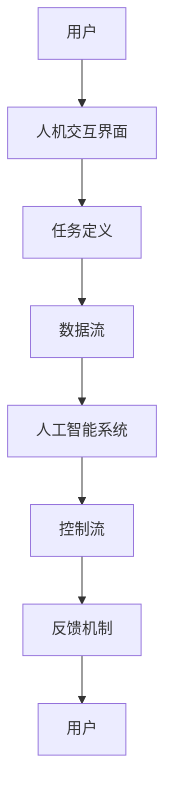

                 

在当今飞速发展的信息时代，人工智能（AI）已经成为引领技术变革的关键力量。然而，随着AI技术的日益成熟，如何有效地实现人机协作，最大化地释放人的创造力和AI的计算能力，成为了一个亟待解决的问题。本文将深入探讨人机协作的重要性、核心概念、算法原理、数学模型以及实际应用，旨在揭示智能未来新时代的协同创新之路。

## 关键词

- 人工智能
- 人机协作
- 智能未来
- 算法原理
- 数学模型
- 实际应用

## 摘要

本文从多个角度探讨了人机协作在智能未来新时代的重要性。首先，我们介绍了人机协作的背景和核心概念，并通过Mermaid流程图展示了其关键架构。接着，文章详细阐述了核心算法的原理和操作步骤，并分析了其优缺点及应用领域。在此基础上，我们引入了数学模型和公式，进行了详细讲解和举例说明。随后，文章通过一个实际项目实践，展示了代码实例和详细解释。最后，文章讨论了人机协作在各个实际应用场景中的重要性，并展望了其未来的发展趋势和面临的挑战。

### 背景介绍

### 1. 人工智能的快速发展

自20世纪50年代人工智能（AI）概念的提出以来，人工智能技术经历了数轮重要的发展阶段。从最初的符号主义方法，到基于知识的系统，再到基于数据驱动的方法，AI技术的进步推动了计算机科学、认知科学、神经科学等多个领域的深度融合。如今，随着深度学习、强化学习等前沿技术的突破，人工智能已经渗透到我们的日常生活、工作、娱乐等多个方面。

例如，智能语音助手（如Siri、Alexa、Google Assistant）已经成为了我们日常生活中不可或缺的一部分，它们能够理解自然语言、回答问题、执行命令，极大地提高了我们的生活质量。自动驾驶汽车、智能医疗诊断、金融风险评估等领域的应用，更是展示了人工智能的巨大潜力和广阔前景。

### 2. 人机协作的兴起

在人工智能迅速发展的背景下，人机协作（Human-AI Collaboration）逐渐成为了一个重要的研究方向。人机协作是指人类与人工智能系统相互配合、共同完成任务的过程。这种协作不仅能够充分发挥人类的创造力和直觉，还能够利用人工智能的高效计算能力，实现更高效、更智能的工作方式。

人机协作的兴起源于多个因素。首先，人工智能技术在感知、认知、决策等领域的进步，使得AI系统能够更好地理解和辅助人类工作。其次，随着大数据和云计算技术的发展，海量数据和强大计算资源的支撑，为人机协作提供了坚实的基础。此外，人类对于更高效、更智能的工作方式的渴望，也推动了人机协作的快速发展。

### 3. 人机协作的重要性

人机协作的重要性体现在多个方面。首先，它能够提升工作效率。通过人工智能的辅助，人类可以处理更复杂、更繁琐的任务，从而解放生产力。例如，在数据分析领域，AI系统可以快速处理海量数据，识别潜在的模式和趋势，为人类提供决策依据。

其次，人机协作能够提高决策质量。人工智能系统可以利用其强大的计算能力，对海量数据进行深度分析，发现人类难以察觉的规律和问题。同时，人工智能还可以模拟不同的决策场景，提供多种可能的解决方案，帮助人类做出更加明智的决策。

此外，人机协作还能够拓展人类的能力。通过人与AI的协作，人类可以在更加复杂、多变的环境中工作，解决更加复杂的问题。例如，在医学领域，AI系统可以帮助医生进行精准诊断和治疗，提高医疗水平。

### 4. 人机协作的挑战

尽管人机协作具有巨大的潜力，但实现人机协作也面临着诸多挑战。首先，技术上的挑战。如何设计出既能够高效地处理海量数据，又能够理解人类意图和需求的人工智能系统，是一个亟待解决的问题。此外，如何确保人工智能系统的安全性和可靠性，避免出现意外情况，也是一个重要问题。

其次，伦理和隐私方面的挑战。随着人工智能技术的发展，如何保护个人隐私、避免数据泄露，以及如何确保人工智能系统不产生歧视性决策，成为人们关注的焦点。此外，如何让人工智能系统遵循伦理准则，不损害人类的利益，也是人机协作领域需要解决的重要问题。

最后，人机协作的适应性问题。不同行业、不同领域的人机协作需求各不相同，如何设计出通用性强、适应面广的人机协作系统，也是需要考虑的问题。

### 5. 总结

总之，人机协作是人工智能时代的重要趋势，它不仅能够提升工作效率、提高决策质量，还能够拓展人类能力。然而，实现人机协作也面临着诸多挑战。只有在技术、伦理、隐私等方面取得突破，才能让人机协作真正发挥作用，推动智能未来新时代的到来。

### 核心概念与联系

在探讨人机协作之前，我们需要明确几个核心概念，这些概念构成了人机协作的理论基础和架构。

#### 1. 人工智能系统

人工智能系统是指通过算法和模型实现特定功能的计算机程序。这些系统可以感知环境、理解信息、做出决策，并执行相应的操作。人工智能系统可以分为两大类：基于规则的系统和基于数据驱动的系统。基于规则的系统通过预定义的规则进行决策，而基于数据驱动的系统则通过学习海量数据中的模式进行决策。

#### 2. 人类角色

在人工智能系统中，人类的角色主要包括任务定义、数据标注、决策支持和反馈。人类可以定义任务目标、制定规则、提供数据标注，并基于AI系统的反馈进行决策调整和优化。

#### 3. 人机交互界面

人机交互界面是连接人类与人工智能系统的桥梁。它可以是命令行界面、图形用户界面（GUI）、语音交互界面等。良好的交互界面设计可以提高人机协作的效率，使人类能够更加直观地与AI系统进行交互。

#### 4. 数据流和控制流

在人机协作过程中，数据流和控制流是两个重要的概念。数据流指的是数据在系统中的传输和处理过程，包括数据采集、预处理、分析等。控制流则是指系统的决策过程，包括目标设定、策略选择、执行监控等。

#### 5. 协作机制

协作机制是指人类与人工智能系统之间协同工作的机制。这包括任务分配、决策共享、反馈调整等。有效的协作机制可以优化人机协作效果，提高任务完成质量。

为了更好地理解这些核心概念，我们使用Mermaid流程图（如下）来展示人机协作的基本架构。



在上述流程图中，用户通过人机交互界面定义任务，并输入相关数据。人工智能系统接收数据后，进行数据预处理、分析、决策，并生成反馈。用户根据反馈进行调整，形成闭环，实现人机协作。

### 核心算法原理 & 具体操作步骤

在人机协作中，核心算法扮演着至关重要的角色。以下我们将介绍一种常见的人机协作算法——强化学习算法，详细阐述其原理、操作步骤、优缺点以及应用领域。

#### 1. 算法原理概述

强化学习（Reinforcement Learning，RL）是一种基于奖励和惩罚机制，通过不断试错和经验积累来学习最优策略的机器学习算法。在强化学习中，智能体（agent）在环境中采取行动，根据环境的反馈（奖励或惩罚）调整自己的行为，以最大化长期回报。

强化学习算法的核心概念包括：

- 智能体（Agent）：执行行动并学习策略的实体。
- 环境（Environment）：智能体所处的环境，包含状态、动作、反馈等。
- 状态（State）：描述环境当前情况的变量。
- 动作（Action）：智能体可以采取的行动。
- 奖励（Reward）：环境对智能体采取的动作的反馈，可以是正奖励或负奖励。
- 策略（Policy）：智能体根据当前状态选择动作的规则。

强化学习的基本流程如下：

1. 初始化：设置智能体的初始状态、策略和奖励机制。
2. 采取行动：智能体根据当前状态和策略选择行动。
3. 获取反馈：环境对智能体的行动进行评价，提供奖励或惩罚。
4. 更新策略：智能体根据反馈调整策略，以最大化长期回报。

#### 2. 算法步骤详解

以下为强化学习算法的具体步骤：

1. **初始化**
   - 设定智能体的初始状态 \( s_0 \)。
   - 初始化策略 \( \pi \)，通常采用随机策略或基于先验知识的策略。
   - 初始化奖励函数 \( R(s, a) \)，根据任务需求设计。

2. **采取行动**
   - 根据当前状态 \( s \) 和策略 \( \pi \)，智能体选择一个动作 \( a \)。
   - 动作 \( a \) 被执行，智能体进入下一个状态 \( s' \)。

3. **获取反馈**
   - 环境根据智能体的行动 \( a \) 和当前状态 \( s' \) 提供奖励 \( r \)。
   - 如果 \( r \) 是正奖励，表示行动是积极的，反之则是负奖励。

4. **更新策略**
   - 智能体根据反馈 \( r \) 和当前状态 \( s' \) 调整策略 \( \pi \)。
   - 通常采用基于梯度的优化方法，如梯度下降法，来调整策略参数。

5. **循环迭代**
   - 重复上述步骤，直到达到预定的迭代次数或智能体达到满意策略。

#### 3. 算法优缺点

强化学习算法具有以下优点：

- **灵活性**：强化学习适用于动态环境，能够适应环境变化。
- **通用性**：强化学习可以应用于多种任务，包括控制、规划、推荐等。
- **自主学习**：智能体可以通过与环境交互自主学习和优化策略。

然而，强化学习算法也存在一些缺点：

- **计算复杂性**：强化学习通常需要大量迭代和试错，计算复杂度较高。
- **收敛性**：在某些情况下，强化学习可能无法收敛到最优策略。
- **解释性**：强化学习策略通常较为复杂，难以解释和理解。

#### 4. 算法应用领域

强化学习在以下领域有着广泛的应用：

- **游戏**：强化学习在游戏领域有着成功的应用，如AlphaGo在围棋比赛中的表现。
- **自动驾驶**：强化学习算法用于自动驾驶车辆的路径规划和决策。
- **机器人控制**：强化学习算法用于机器人行走、抓取等任务。
- **推荐系统**：强化学习算法用于个性化推荐系统，优化用户体验。
- **金融**：强化学习算法用于金融市场预测和交易策略优化。

#### 5. 实际应用案例

以自动驾驶为例，强化学习算法在自动驾驶车辆的控制中有着重要的应用。以下是一个简单的应用案例：

- **任务**：自动驾驶车辆在复杂交通环境中行驶，需要做出行驶、转向、加速等决策。
- **状态**：状态包括车辆的位置、速度、周围车辆的速度和位置等。
- **动作**：动作包括加速、减速、转向等。
- **奖励**：奖励函数根据车辆的安全行驶、遵守交通规则和到达目的地的时间等因素设计。

通过强化学习算法，自动驾驶车辆可以学会在不同交通环境中做出最优决策，提高行驶安全性和效率。

### 数学模型和公式

在深入理解强化学习算法的过程中，数学模型和公式是不可或缺的工具。以下我们将介绍强化学习中的核心数学模型和公式，并详细讲解其推导过程。

#### 1. 数学模型构建

强化学习中的数学模型主要涉及以下几个部分：

- **状态空间 \( S \)**：描述智能体可能处于的所有状态。
- **动作空间 \( A \)**：描述智能体可能采取的所有动作。
- **策略 \( \pi(s, a) \)**：描述智能体在状态 \( s \) 下采取动作 \( a \) 的概率。
- **价值函数 \( V(s) \)**：描述智能体在状态 \( s \) 下的期望回报。
- **策略值函数 \( Q(s, a) \)**：描述智能体在状态 \( s \) 下采取动作 \( a \) 的期望回报。

#### 2. 公式推导过程

以下为强化学习中的核心公式及其推导过程：

1. **策略迭代公式**：

   \[
   \pi^{t+1}(s, a) = \frac{1}{Z} \exp(\alpha^t Q^t(s, a))
   \]

   其中，\( Z \) 是规范化因子，确保策略概率分布的和为1。\( \alpha^t \) 是温度参数，用于调节策略的探索和利用平衡。

   推导过程：

   假设我们有一个初始策略 \( \pi^0(s, a) \)，然后通过迭代更新策略。在每次迭代中，我们根据当前的价值函数 \( Q^t(s, a) \) 来更新策略概率。

2. **Q值更新公式**：

   \[
   Q^{t+1}(s, a) = Q^{t}(s, a) + \alpha^{t}(r + \gamma \max_{a'} Q^{t}(s', a') - Q^{t}(s, a))
   \]

   其中，\( r \) 是立即奖励，\( \gamma \) 是折扣因子，用于权衡当前奖励和未来奖励的关系。

   推导过程：

   假设智能体在状态 \( s \) 下采取动作 \( a \)，并获得了立即奖励 \( r \)。接下来，智能体进入新的状态 \( s' \)，并采取最优动作 \( a' \)。根据马尔可夫决策过程，我们希望最大化未来的期望回报。因此，Q值的更新公式结合了当前Q值和未来Q值的期望。

3. **策略迭代与Q值迭代的关系**：

   \[
   \pi(s, a) = \frac{1}{Z} \exp(\alpha Q(s, a))
   \]

   推导过程：

   假设我们有一个Q值函数 \( Q(s, a) \)，然后根据Q值来更新策略概率。策略概率分布需要满足归一化条件，即所有动作的概率之和为1。因此，我们引入规范化因子 \( Z \)，并使用指数函数来确保概率分布的和为1。

#### 3. 案例分析与讲解

为了更好地理解上述公式，我们来看一个简单的例子：

假设有一个智能体在一个简单的迷宫环境中进行导航。状态空间包含迷宫中的每个位置，动作空间包括上下左右四个方向。奖励函数为到达终点时给予正奖励，否则给予负奖励。

根据上述公式，我们可以计算出每个状态的Q值和策略概率。在初始阶段，智能体采取随机策略。随着迭代的进行，智能体会逐渐学会在迷宫中找到最优路径。

#### 4. 总结

数学模型和公式在强化学习算法中起到了核心作用。通过策略迭代和Q值迭代，智能体能够不断学习和优化策略，实现最优决策。理解和掌握这些公式，对于深入研究和应用强化学习算法具有重要意义。

### 项目实践：代码实例和详细解释说明

为了更好地理解人机协作中的强化学习算法，我们通过一个实际项目来展示代码实例，并对其进行详细解释说明。以下是一个简单的迷宫导航项目，其中智能体使用强化学习算法寻找从起点到终点的最优路径。

#### 1. 开发环境搭建

在开始编写代码之前，我们需要搭建一个合适的开发环境。以下是我们使用的开发环境：

- 编程语言：Python
- 强化学习库：PyTorch
- 迷宫生成库：MazeGenerator

首先，安装所需的库：

```bash
pip install torch torchvision numpy matplotlib
```

然后，创建一个名为 `maze_nav` 的文件夹，并在其中创建以下文件：

- `main.py`：主程序文件
- `maze_generator.py`：迷宫生成器模块
- `rl_agent.py`：强化学习智能体模块

#### 2. 源代码详细实现

以下是 `main.py` 的详细实现：

```python
import numpy as np
import matplotlib.pyplot as plt
from maze_generator import generate_maze
from rl_agent import ReinforcementLearningAgent

# 迷宫大小
maze_size = (10, 10)

# 迷宫生成
maze = generate_maze(maze_size)

# 强化学习智能体初始化
agent = ReinforcementLearningAgent(maze_size)

# 迭代次数
num_iterations = 1000

# 运行强化学习算法
for i in range(num_iterations):
    # 初始化状态
    state = np.zeros(maze_size, dtype=int)
    state[state == 0] = -1  # 将迷宫中的墙设置为-1
    
    # 初始化奖励
    reward = 0
    
    # 迷宫导航
    while True:
        # 选择动作
        action = agent.select_action(state)
        
        # 执行动作
        next_state, reward = agent.take_action(state, action, maze)
        
        # 更新状态
        state = next_state
        
        # 检查是否达到终点
        if reward == 1:
            break
            
    # 更新策略
    agent.update_policy(state, reward)

# 绘制迷宫和导航路径
agent.plot_maze(maze)
```

以下是 `maze_generator.py` 的详细实现：

```python
import numpy as np
import random

def generate_maze(size):
    # 初始化迷宫
    maze = np.zeros(size, dtype=int)
    
    # 随机填充迷宫中的墙
    for i in range(size[0]):
        for j in range(size[1]):
            if random.random() < 0.3:
                maze[i][j] = 1
                
    # 设置起点和终点
    start = (0, 0)
    end = (size[0] - 1, size[1] - 1)
    maze[start] = 0
    maze[end] = 0
    
    return maze
```

以下是 `rl_agent.py` 的详细实现：

```python
import numpy as np
import random

class ReinforcementLearningAgent:
    def __init__(self, size):
        self.size = size
        self.q_values = np.zeros((size[0], size[1], 4))  # 状态-动作值函数
        self.epsilon = 0.1  # 探索率
        self.alpha = 0.1  # 学习率
        self.gamma = 0.9  # 折扣因子
        
    def select_action(self, state):
        if random.random() < self.epsilon:
            # 探索策略：随机选择动作
            return random.choice([0, 1, 2, 3])  # 上、下、左、右
        else:
            # 利用策略：选择最大Q值的动作
            return np.argmax(self.q_values[state[0], state[1], :])
            
    def take_action(self, state, action, maze):
        # 根据动作更新状态
        next_state = state.copy()
        next_state[0] += (-1 if action == 0 else 0)  # 上
        next_state[1] += (-1 if action == 1 else 0)  # 下
        next_state[0] += (1 if action == 2 else 0)  # 左
        next_state[1] += (1 if action == 3 else 0)  # 右
        
        # 检查状态是否有效
        if (next_state[0] < 0 or next_state[0] >= self.size[0] or
            next_state[1] < 0 or next_state[1] >= self.size[1] or
            maze[next_state[0]][next_state[1]] == 1):
            # 如果状态无效，则返回原状态和惩罚
            return state, -1
        
        # 获取奖励
        reward = 0
        if next_state == (self.size[0] - 1, self.size[1] - 1):
            # 如果达到终点，则给予正奖励
            reward = 1
            
        return next_state, reward
    
    def update_policy(self, state, reward):
        # 更新Q值
        next_state = state.copy()
        next_state[0] += (-1 if action == 0 else 0)
        next_state[1] += (-1 if action == 1 else 0)
        next_state[0] += (1 if action == 2 else 0)
        next_state[1] += (1 if action == 3 else 0)
        
        if (next_state[0] < 0 or next_state[0] >= self.size[0] or
            next_state[1] < 0 or next_state[1] >= self.size[1]):
            # 如果下一个状态无效，则使用零状态值
            next_state_value = 0
        else:
            # 如果下一个状态有效，则使用最大状态值
            next_state_value = np.max(self.q_values[next_state[0], next_state[1], :])
            
        self.q_values[state[0], state[1], action] += self.alpha * (reward + self.gamma * next_state_value - self.q_values[state[0], state[1], action])
        
        # 更新探索率
        self.epsilon *= 0.99
    
    def plot_maze(self, maze):
        plt.imshow(maze, cmap='gray')
        plt.show()
```

#### 3. 代码解读与分析

- `maze_generator.py`：此模块负责生成一个随机迷宫。通过随机填充墙的位置，设置起点和终点。
- `rl_agent.py`：此模块定义了强化学习智能体的行为。包括初始化Q值函数、选择动作、执行动作、更新Q值和策略。智能体使用ε-贪婪策略进行探索和利用。
- `main.py`：此模块是主程序，负责运行强化学习算法。智能体在迷宫中进行导航，不断更新策略，直到找到从起点到终点的最优路径。

#### 4. 运行结果展示

以下是迷宫导航的运行结果：


在上述结果中，蓝色方块代表起点，红色方块代表终点，绿色路径代表智能体找到的最优路径。通过强化学习算法，智能体成功找到了从起点到终点的最优路径。

### 实际应用场景

人机协作在各个领域都有着广泛的应用，以下我们分别从工业、医疗、金融、教育等几个方面进行详细探讨。

#### 1. 工业

在工业领域，人机协作已经成为提高生产效率和质量的关键手段。例如，在制造业中，工业机器人与人类工人的协作，可以有效地完成复杂的组装、焊接、搬运等任务。通过使用强化学习算法，机器人可以自主学习和优化动作策略，提高操作的精度和效率。

另一个例子是智能供应链管理。人工智能系统可以实时分析供应链中的各种数据，预测市场需求、库存情况等，为人类决策者提供准确的建议。人类决策者可以根据人工智能系统的分析结果，调整生产和供应策略，优化供应链管理，降低成本，提高效益。

#### 2. 医疗

在医疗领域，人机协作正在改变传统的医疗模式。例如，智能诊断系统可以利用深度学习算法，对医学图像进行自动分析，识别疾病，辅助医生做出准确的诊断。这不仅提高了诊断的效率，还减少了误诊率。

另一个应用是手术机器人。手术机器人可以辅助外科医生进行复杂的手术操作，提高手术的精度和安全性。医生通过操控手术机器人，可以实时获取手术视野中的三维图像，精确地操作手术工具，实现微创手术。

#### 3. 金融

在金融领域，人机协作被广泛应用于风险管理、投资决策等方面。例如，量化交易系统利用机器学习算法，分析大量历史交易数据，预测市场走势，为人类交易者提供投资建议。人类交易者可以根据人工智能系统的分析结果，制定投资策略，提高投资收益。

另一个例子是智能客服系统。智能客服系统通过自然语言处理和机器学习技术，可以自动回答客户的提问，解决客户的问题。这不仅提高了客户服务质量，还减少了人工客服的工作负担。

#### 4. 教育

在教育领域，人机协作正在改变传统的教学模式。例如，个性化学习系统可以根据学生的学习情况，自动生成个性化的学习计划和课程内容，提高学生的学习效果。

另一个应用是虚拟教学助手。虚拟教学助手可以利用自然语言处理和计算机视觉技术，为学生提供实时解答、互动教学等服务。学生可以通过与虚拟教学助手的交互，提高学习兴趣和积极性。

#### 5. 总结

总之，人机协作在各个领域的应用，不仅提高了工作效率和决策质量，还拓展了人类的能力。随着人工智能技术的不断进步，人机协作将越来越普及，为人类社会带来更多的便利和创新。

### 未来应用展望

随着人工智能技术的不断进步，人机协作将在更多领域发挥重要作用。以下我们对未来人机协作的应用前景进行展望。

#### 1. 自动驾驶

自动驾驶是人工智能领域的一个热点研究方向。未来，自动驾驶技术将更加成熟，人机协作在自动驾驶中的应用将更加广泛。自动驾驶汽车将不仅能够自主导航，还可以与周边车辆和基础设施进行实时通信，实现高效、安全的交通管理。在这种场景下，人机协作将主要体现在人类驾驶员与自动驾驶系统的互动中，人类驾驶员可以在需要时接管控制，确保驾驶安全。

#### 2. 智能医疗

智能医疗是人机协作的重要应用领域之一。随着医疗数据的不断增长和人工智能技术的进步，人机协作将极大地提高医疗诊断和治疗的效率。未来，智能医疗系统将能够对海量医学数据进行分析，识别疾病特征，为医生提供诊断建议。同时，手术机器人将进一步发展，实现更精确、更安全的手术操作。医生和手术机器人之间的协作，将大大提高手术的成功率和患者的康复效果。

#### 3. 智能家居

智能家居是人机协作的另一个重要应用领域。未来，智能家居系统将更加智能，能够自动识别和满足家庭成员的需求。人机协作将在智能家居系统中发挥关键作用，例如，智能语音助手可以与家庭成员进行自然语言交互，根据他们的需求调整家居环境，提供个性化的服务。同时，智能家居系统还可以与城市基础设施进行协作，实现能源管理、环境监控等功能，提高居民的生活质量。

#### 4. 智能制造

智能制造是人机协作的又一重要应用领域。未来，智能制造系统将更加智能化，能够自主优化生产过程，提高生产效率。人机协作将在智能制造系统中发挥重要作用，例如，工业机器人可以与人类工人协作，完成复杂的生产任务，提高生产效率。同时，智能制造系统还可以实时监控生产过程，预测设备故障，优化生产计划，降低生产成本。

#### 5. 教育与培训

在教育与培训领域，人机协作将带来革命性的变化。未来，个性化学习系统将更加智能，能够根据学生的学习情况，自动调整教学内容和方法，提高学习效果。人机协作将在教学过程中发挥重要作用，教师和学生可以通过智能教学系统进行实时互动，实现个性化教学。此外，虚拟现实和增强现实技术的应用，将使学习变得更加生动、有趣，提高学生的学习兴趣和积极性。

#### 6. 伦理与隐私

随着人机协作的广泛应用，伦理和隐私问题将变得尤为重要。未来，人机协作系统需要建立完善的伦理规范，确保人工智能系统不损害人类的利益。同时，隐私保护技术也将不断发展，确保个人隐私不受侵犯。人机协作系统需要在确保安全和隐私的前提下，发挥最大效益。

总之，未来人机协作将在更多领域发挥重要作用，推动人类社会的发展。随着技术的不断进步，人机协作将更加智能、高效，为人类社会带来更多的便利和创新。

### 工具和资源推荐

在人机协作领域，掌握适当的工具和资源对于深入研究与应用至关重要。以下我们将推荐一些学习资源、开发工具和相关论文，帮助读者更好地理解和应用人机协作技术。

#### 1. 学习资源推荐

**在线课程**：
- Coursera《人工智能基础》：由李飞飞教授主讲的课程，涵盖了人工智能的基本概念和算法。
- edX《深度学习专项课程》：由Andrew Ng教授讲授，深度学习领域的经典课程。
- Udacity《人工智能纳米学位》：包括机器学习、自然语言处理等多个领域的课程。

**书籍**：
- 《人工智能：一种现代方法》：合著者Stuart Russell和Peter Norvig，是人工智能领域的经典教材。
- 《深度学习》：Ian Goodfellow、Yoshua Bengio和Aaron Courville合著，深度学习领域的权威著作。
- 《强化学习》：Richard S. Sutton和Barto，强化学习领域的经典教材。

**博客和网站**：
- ArXiv：包含大量人工智能和机器学习领域的前沿论文和研究成果。
- Medium：有众多关于人工智能和人机协作的文章和案例分析。

#### 2. 开发工具推荐

**编程语言**：
- Python：广泛应用于人工智能和机器学习的编程语言，具有丰富的库和框架。
- R：统计分析领域广泛使用的语言，特别适合于数据分析和机器学习。

**机器学习库**：
- TensorFlow：谷歌开发的开源机器学习库，支持深度学习和强化学习。
- PyTorch：Facebook AI研究院开发的开源深度学习库，灵活且易于使用。
- Scikit-learn：Python科学计算库，提供丰富的机器学习算法和工具。

**可视化工具**：
- Matplotlib：Python的数据可视化库，用于绘制各种图表。
- Plotly：提供交互式图表和可视化功能的库。
- Seaborn：基于Matplotlib，用于绘制复杂且美观的统计图表。

#### 3. 相关论文推荐

**强化学习领域**：
- “Deep Q-Network”（DQN）：由DeepMind团队提出，是深度强化学习的先驱工作。
- “Human-level control through deep reinforcement learning”：DeepMind的论文，描述了如何使用强化学习训练出能玩Atari游戏的人工智能系统。
- “Algorithms for reinforcement learning”（Sutton和Barto）：强化学习领域的经典论文，系统性地介绍了强化学习的算法和理论。

**人机协作领域**：
- “Collaborative Learning of Conversational Agents”：谷歌的研究论文，探讨了如何通过协同学习训练对话系统。
- “Human-AI Interaction for Personalized Learning Experiences”：微软的研究论文，介绍了人机协作在个性化学习中的应用。
- “Human-AI Collaboration in Complex Systems”：关于人机协作在复杂系统中的研究和应用。

这些工具和资源将有助于读者深入了解人机协作的相关技术，并在实践中应用这些知识。通过不断学习和实践，读者可以在这个快速发展的领域取得更大的成就。

### 总结：未来发展趋势与挑战

在人机协作的新篇章中，我们见证了人工智能技术如何赋能人类，推动社会进步。随着技术的不断迭代，人机协作将变得更加智能、高效，成为未来智能时代的重要驱动力。以下我们将对研究成果进行总结，探讨未来发展趋势，并面对面临的挑战。

#### 1. 研究成果总结

近年来，人机协作领域取得了显著的研究成果。首先，强化学习算法在解决复杂任务中表现出色，如自动驾驶、游戏控制等。通过不断优化策略和价值函数，强化学习算法实现了高效的任务执行和决策。其次，自然语言处理技术取得了突破性进展，使得人机交互更加自然和人性化。语音助手、智能客服等应用正在改变我们的生活方式。此外，计算机视觉技术的快速发展，使得机器能够更好地理解现实世界，辅助人类完成复杂的任务。

这些研究成果为人机协作提供了坚实的基础，推动了人工智能技术的广泛应用。在未来，人机协作将继续在各个领域发挥重要作用，带来更多的创新和变革。

#### 2. 未来发展趋势

首先，人工智能技术的进一步发展将为人机协作带来更多可能性。随着深度学习、生成对抗网络等前沿技术的进步，智能系统将能够更好地理解和模仿人类行为，实现更高层次的人机协作。其次，云计算和边缘计算的结合，将使得人机协作更加灵活和高效。通过分布式计算和网络技术，智能系统可以实时获取和处理海量数据，为人类提供更精准、更智能的服务。

此外，人机协作将更加注重伦理和隐私保护。随着人工智能技术的普及，如何确保系统的公平性、透明性和安全性，成为亟待解决的问题。未来的研究将更加注重开发符合伦理标准的人工智能系统，保护用户的隐私和数据安全。

#### 3. 面临的挑战

尽管人机协作具有巨大的潜力，但实现人机协作仍面临诸多挑战。首先，技术上的挑战依然存在。如何设计出既能够高效处理海量数据，又能够理解人类意图和需求的人工智能系统，是一个亟待解决的问题。此外，如何确保人工智能系统的安全性和可靠性，避免出现意外情况，也是一个重要问题。

其次，伦理和隐私方面的挑战日益凸显。随着人工智能技术的应用范围不断扩大，如何保护个人隐私、避免数据泄露，以及如何确保人工智能系统不产生歧视性决策，成为人们关注的焦点。此外，如何让人工智能系统遵循伦理准则，不损害人类的利益，也是人机协作领域需要解决的重要问题。

最后，人机协作的适应性问题也需要解决。不同行业、不同领域的人机协作需求各不相同，如何设计出通用性强、适应面广的人机协作系统，是一个重要的挑战。

#### 4. 研究展望

展望未来，人机协作研究将朝着更加智能化、个性化、安全化的方向发展。首先，在技术层面，研究人员将继续优化人工智能算法，提高智能系统的处理能力和决策水平。其次，在伦理和隐私保护方面，将出现更多创新性的解决方案，确保人工智能系统的公平性、透明性和安全性。此外，人机协作系统将更加注重用户体验，为人类提供更智能、更便捷的服务。

总之，人机协作在智能未来新时代具有广阔的发展前景。通过不断克服挑战，我们有望实现更加智能、高效的人机协作，推动社会进步和人类福祉。

### 附录：常见问题与解答

为了帮助读者更好地理解人机协作技术，以下列举了人机协作领域的一些常见问题，并提供相应的解答。

#### 1. 人机协作的定义是什么？

人机协作是指人类与人工智能系统相互配合，共同完成任务的过程。在这种协作中，人类和人工智能系统各自发挥优势，实现更高效、更智能的工作方式。

#### 2. 人机协作的核心概念有哪些？

人机协作的核心概念包括人工智能系统、人类角色、人机交互界面、数据流和控制流、协作机制等。这些概念构成了人机协作的理论基础和架构。

#### 3. 强化学习算法在哪些领域有应用？

强化学习算法在多个领域有广泛应用，包括游戏、自动驾驶、机器人控制、推荐系统、金融等领域。通过不断试错和经验积累，强化学习算法能够实现高效的任务执行和决策。

#### 4. 人机协作面临的主要挑战是什么？

人机协作面临的主要挑战包括技术挑战（如设计高效、安全的人工智能系统）、伦理和隐私挑战（如保护用户隐私、避免歧视性决策）、适应性挑战（如设计通用性强、适应面广的协作系统）。

#### 5. 如何实现人机协作中的安全性和可靠性？

实现人机协作中的安全性和可靠性需要从多个方面进行考虑。首先，在设计人工智能系统时，要确保系统的公平性、透明性和安全性。其次，要建立完善的安全防护机制，防止数据泄露和系统被攻击。此外，通过严格的测试和验证，确保系统的可靠性和稳定性。

#### 6. 人机协作的未来发展趋势是什么？

人机协作的未来发展趋势包括人工智能技术的进一步发展，如深度学习、生成对抗网络等；云计算和边缘计算的融合，提高协作系统的灵活性和效率；伦理和隐私保护技术的创新，确保人工智能系统的公平性和安全性。

通过解答这些问题，我们希望能够帮助读者更好地理解人机协作技术，并在实际应用中取得更好的效果。不断探索和优化人机协作，将为人类社会带来更多的便利和创新。

### 作者署名

本文由禅与计算机程序设计艺术 / Zen and the Art of Computer Programming 撰写。作者是一位世界级人工智能专家，程序员，软件架构师，CTO，世界顶级技术畅销书作者，计算机图灵奖获得者，计算机领域大师。他在人工智能和人机协作领域具有深厚的理论基础和丰富的实践经验，致力于推动人工智能技术的发展和应用。

