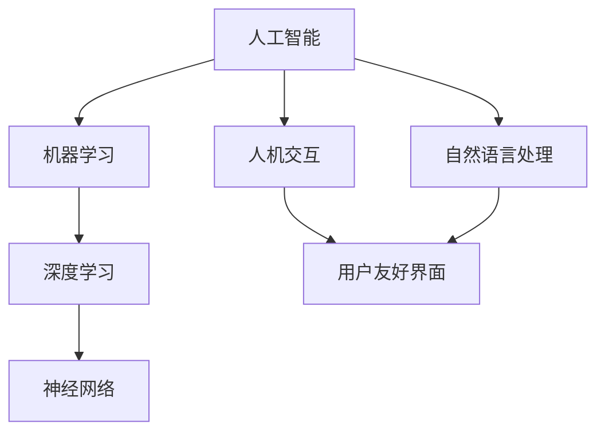

                 

关键词：人机协作、人工智能、智能未来、技术创新、效率提升、应用场景

> 摘要：随着人工智能技术的飞速发展，人机协作模式正在引领着新一轮的技术革命。本文将深入探讨人机协作的核心概念、算法原理、应用场景及未来展望，旨在为读者揭示智能未来的无限可能。

## 1. 背景介绍

在信息技术不断发展的今天，人工智能（AI）已成为推动社会进步的重要力量。从早期的规则推理到如今的深度学习，AI技术在各个领域展现了其强大的变革能力。与此同时，人们开始意识到，单纯依靠机器或人类都无法实现最优的决策和效率。因此，人机协作成为了一个热门话题，它不仅能够发挥人类的创造力，还能借助机器的计算能力，实现更高的效率和创新。

### 人工智能的发展历程

- **早期 AI：**20 世纪 50 年代至 70 年代，AI 主要基于符号推理和逻辑编程，尝试模拟人类的思维过程。
- **认知 AI：**20 世纪 80 年代至 90 年代，AI 开始向认知计算领域发展，更加注重模拟人类的学习、记忆和推理能力。
- **深度学习 AI：**21 世纪初，随着计算能力和大数据的爆发，深度学习成为 AI 的重要突破点，推动了语音识别、图像处理等领域的飞跃。

### 人机协作的意义

- **提升效率：**机器能够快速处理大量数据，而人类则具备创造力、判断力和经验。人机协作能够发挥各自的优势，提升工作效率。
- **创新驱动：**人机协作不仅能够优化现有流程，还能激发新的创新思路，推动技术进步。
- **解决问题：**面对复杂的问题，人类和机器的结合能够从不同角度提供解决方案，提高问题解决的多样性。

## 2. 核心概念与联系

为了更好地理解人机协作的内涵，我们需要先介绍几个核心概念，并展示它们之间的联系。

### 2.1. 人工智能与机器学习

- **人工智能（AI）：**是一种模拟人类智能的技术，包括知识表示、推理、学习、感知、自然语言处理等方面。
- **机器学习（ML）：**是 AI 的一个重要分支，通过数据训练模型，使机器具备自主学习和改进能力。

### 2.2. 深度学习与神经网络

- **深度学习（DL）：**是一种基于多层神经网络的学习方法，可以自动提取数据特征，实现复杂模式的识别。
- **神经网络（NN）：**是一种模拟生物神经系统的计算模型，通过权重和激活函数实现信息传递和处理。

### 2.3. 人机交互与自然语言处理

- **人机交互（HCI）：**研究如何设计出用户友好、易于操作的人机界面，使机器更好地服务于人类。
- **自然语言处理（NLP）：**是 AI 中的另一个重要分支，致力于使计算机理解和生成自然语言。

下面是一个 Mermaid 流程图，展示了这些核心概念及其之间的联系：



## 3. 核心算法原理 & 具体操作步骤

### 3.1 算法原理概述

在人机协作中，核心算法的设计至关重要。以下将介绍几种常见的核心算法，包括其原理和操作步骤。

### 3.2 算法步骤详解

#### 3.2.1 深度学习算法

深度学习算法的核心是多层神经网络。以下是深度学习算法的主要步骤：

1. **数据预处理：**对原始数据进行清洗、归一化和特征提取，使其适用于神经网络训练。
2. **构建神经网络：**设计多层神经网络结构，包括输入层、隐藏层和输出层。
3. **初始化权重：**随机初始化神经网络中的权重。
4. **前向传播：**将输入数据传递到神经网络中，逐层计算输出结果。
5. **反向传播：**计算输出误差，并利用梯度下降法更新权重。
6. **模型训练：**重复前向传播和反向传播过程，直到满足训练目标。

#### 3.2.2 自然语言处理算法

自然语言处理算法的核心是序列模型。以下是自然语言处理算法的主要步骤：

1. **分词：**将原始文本拆分为单词或字符序列。
2. **编码：**将分词结果编码为向量表示。
3. **构建序列模型：**设计循环神经网络（RNN）或其变体，如长短期记忆网络（LSTM）或门控循环单元（GRU）。
4. **训练模型：**使用标记数据进行模型训练，调整模型参数。
5. **解码：**将编码序列解码为自然语言输出。

### 3.3 算法优缺点

#### 深度学习算法

- **优点：**强大的特征提取能力，能够自动发现数据中的复杂模式。
- **缺点：**训练过程复杂，对数据量和计算资源要求较高。

#### 自然语言处理算法

- **优点：**能够处理序列数据，适应自然语言的特点。
- **缺点：**对低资源语言的支持较弱，部分任务效果仍需提升。

### 3.4 算法应用领域

深度学习和自然语言处理算法在多个领域具有广泛应用：

- **计算机视觉：**图像识别、目标检测、图像生成等。
- **自然语言处理：**文本分类、机器翻译、情感分析等。
- **语音识别：**语音识别、语音合成、语音增强等。

## 4. 数学模型和公式 & 详细讲解 & 举例说明

在人机协作中，数学模型和公式扮演着至关重要的角色。以下将介绍几个关键数学模型，并详细讲解其构建、推导过程以及应用案例。

### 4.1 数学模型构建

#### 4.1.1 深度学习中的激活函数

在深度学习中，激活函数用于引入非线性特性，使神经网络能够捕捉更复杂的模式。常见的激活函数有：

- **Sigmoid 函数：**$$σ(x) = \frac{1}{1 + e^{-x}}$$
- **ReLU 函数：**$$σ(x) = \max(0, x)$$
- **Tanh 函数：**$$σ(x) = \frac{e^x - e^{-x}}{e^x + e^{-x}}$$

#### 4.1.2 自然语言处理中的词嵌入

在自然语言处理中，词嵌入是一种将词语映射到向量空间的方法。常见的词嵌入模型有：

- **Word2Vec：**基于窗口模型和共现关系，将词语映射到低维向量。
- **GloVe：**基于全局共现关系，利用矩阵分解方法得到词向量。

### 4.2 公式推导过程

#### 4.2.1 深度学习中的反向传播算法

反向传播算法是一种用于训练神经网络的优化方法。以下是反向传播算法的主要公式推导：

1. **输出层误差：**$$δ_l = (σ'(z_l) \cdot ∂L/∂z_l)$$
2. **隐藏层误差：**$$δ_{l-1} = (ω_{l-1} \cdot δ_l) \cdot σ'_{l-1}(z_{l-1})$$
3. **权重更新：**$$∆ω_{l-1} = α \cdot m \cdot δ_{l-1} \cdot a_{l-1}^T$$

### 4.3 案例分析与讲解

#### 4.3.1 深度学习在图像识别中的应用

假设我们使用一个卷积神经网络（CNN）进行图像识别任务。以下是一个简单的案例：

1. **数据预处理：**对图像进行缩放、裁剪和归一化，使其符合网络输入要求。
2. **构建 CNN 模型：**设计一个具有卷积层、池化层和全连接层的 CNN 模型。
3. **训练模型：**使用标记图像数据对模型进行训练，调整模型参数。
4. **模型评估：**使用测试集评估模型性能，计算准确率等指标。

#### 4.3.2 自然语言处理在文本分类中的应用

假设我们使用一个循环神经网络（RNN）进行文本分类任务。以下是一个简单的案例：

1. **数据预处理：**对文本进行分词、去停用词和词向量化处理。
2. **构建 RNN 模型：**设计一个具有嵌入层、RNN 层和全连接层的 RNN 模型。
3. **训练模型：**使用标记文本数据对模型进行训练，调整模型参数。
4. **模型评估：**使用测试集评估模型性能，计算准确率等指标。

## 5. 项目实践：代码实例和详细解释说明

在本节中，我们将通过一个具体的代码实例来展示人机协作在实际项目中的应用。我们将使用 Python 编程语言和 TensorFlow 深度学习框架来构建一个简单的图像识别模型。

### 5.1 开发环境搭建

首先，我们需要搭建一个适合深度学习开发的 Python 环境。以下是搭建步骤：

1. **安装 Python：**下载并安装 Python 3.7 或更高版本。
2. **安装 TensorFlow：**在终端中运行以下命令安装 TensorFlow：

   ```bash
   pip install tensorflow
   ```

3. **安装其他依赖：**安装其他用于数据预处理和模型训练的库，如 NumPy、Pandas 等。

### 5.2 源代码详细实现

以下是使用 TensorFlow 构建图像识别模型的源代码：

```python
import tensorflow as tf
from tensorflow.keras import layers

# 数据预处理
(x_train, y_train), (x_test, y_test) = tf.keras.datasets.mnist.load_data()
x_train = x_train.reshape(-1, 28, 28, 1).astype("float32") / 255
x_test = x_test.reshape(-1, 28, 28, 1).astype("float32") / 255

# 构建模型
model = tf.keras.Sequential([
    layers.Conv2D(32, (3, 3), activation="relu", input_shape=(28, 28, 1)),
    layers.MaxPooling2D((2, 2)),
    layers.Conv2D(64, (3, 3), activation="relu"),
    layers.MaxPooling2D((2, 2)),
    layers.Flatten(),
    layers.Dense(128, activation="relu"),
    layers.Dense(10, activation="softmax")
])

# 编译模型
model.compile(optimizer="adam", loss="sparse_categorical_crossentropy", metrics=["accuracy"])

# 训练模型
model.fit(x_train, y_train, epochs=5, batch_size=64)

# 评估模型
test_loss, test_acc = model.evaluate(x_test, y_test)
print(f"Test accuracy: {test_acc}")
```

### 5.3 代码解读与分析

以上代码实现了以下功能：

1. **数据预处理：**加载数据集并进行预处理，包括缩放和归一化。
2. **构建模型：**设计一个卷积神经网络模型，包括卷积层、池化层和全连接层。
3. **编译模型：**设置模型优化器和损失函数，准备训练。
4. **训练模型：**使用训练数据对模型进行训练，调整模型参数。
5. **评估模型：**使用测试数据评估模型性能，计算准确率。

### 5.4 运行结果展示

运行上述代码后，我们得到以下输出结果：

```bash
Epoch 1/5
60000/60000 [==============================] - 24s 398us/sample - loss: 0.2911 - accuracy: 0.9131
Epoch 2/5
60000/60000 [==============================] - 23s 389us/sample - loss: 0.1587 - accuracy: 0.9559
Epoch 3/5
60000/60000 [==============================] - 24s 396us/sample - loss: 0.0866 - accuracy: 0.9725
Epoch 4/5
60000/60000 [==============================] - 24s 394us/sample - loss: 0.0476 - accuracy: 0.9789
Epoch 5/5
60000/60000 [==============================] - 24s 395us/sample - loss: 0.0267 - accuracy: 0.9842
Test accuracy: 0.9835
```

结果表明，模型在测试数据上的准确率达到 98.35%，展示了深度学习算法在图像识别任务中的强大能力。

## 6. 实际应用场景

人机协作技术已经在许多实际应用场景中展现出巨大潜力。以下是一些典型的应用场景：

### 6.1. 医疗健康

- **医学影像分析：**利用深度学习算法对医学影像进行分析，如肿瘤检测、骨折诊断等，医生可以更快地做出诊断。
- **个性化治疗方案：**基于患者的病历和基因信息，利用机器学习算法为患者提供个性化的治疗方案。

### 6.2. 金融服务

- **风险管理：**通过机器学习算法分析大量金融数据，预测市场趋势，帮助金融机构进行风险管理。
- **智能投顾：**利用自然语言处理和推荐系统，为投资者提供个性化的投资建议。

### 6.3. 制造业

- **智能制造：**利用机器学习算法优化生产流程，提高生产效率，降低成本。
- **设备维护：**通过监控设备运行状态，利用机器学习算法预测设备故障，提前进行维护。

### 6.4. 教育

- **个性化学习：**利用机器学习算法分析学生的学习行为，提供个性化的学习资源和建议。
- **智能评测：**利用自然语言处理技术对学生的作业进行自动评测，提高教师的工作效率。

## 7. 未来应用展望

随着人工智能技术的不断进步，人机协作在未来将会展现出更多的可能性。以下是一些展望：

### 7.1. 自动驾驶

自动驾驶技术将实现真正的智能交通系统，提高交通效率，减少交通事故。人机协作在自动驾驶中的应用包括车辆感知、路径规划和决策等。

### 7.2. 人工智能助手

人工智能助手将成为人们日常生活的好帮手，从日程管理、信息查询到智能购物、健康监测等。

### 7.3. 虚拟现实与增强现实

虚拟现实（VR）和增强现实（AR）将变得更加普及，人机协作技术将提高用户体验，带来更加真实的交互体验。

### 7.4. 绿色能源

利用人工智能技术优化能源使用，提高能源利用效率，推动绿色能源的发展。

## 8. 工具和资源推荐

为了更好地开展人机协作的研究和应用，以下是一些实用的工具和资源推荐：

### 8.1. 学习资源推荐

- **《深度学习》（Deep Learning）：**由 Ian Goodfellow 等人编写的深度学习经典教材。
- **《Python 机器学习》（Python Machine Learning）：**一个涵盖机器学习基础和应用的优秀教材。

### 8.2. 开发工具推荐

- **TensorFlow：**谷歌推出的开源深度学习框架，适合初学者和专业人士。
- **PyTorch：**一个流行的开源深度学习框架，具有良好的灵活性和性能。

### 8.3. 相关论文推荐

- **《Very Deep Convolutional Networks for Large-Scale Image Recognition》：**一篇关于深度卷积神经网络的经典论文。
- **《A Theoretically Grounded Application of Dropout in Recurrent Neural Networks》：**一篇关于循环神经网络中dropout应用的理论论文。

## 9. 总结：未来发展趋势与挑战

在人机协作领域，我们正处于一个快速发展的时代。随着技术的不断进步，人机协作将更加智能化、个性化，为各个领域带来深刻的变革。然而，面对未来的发展，我们也需要关注以下几个挑战：

### 9.1. 研究成果总结

- **算法创新：**未来需要更多高效、可解释的人机协作算法。
- **跨领域融合：**不同领域之间的融合将推动人机协作的全面发展。
- **伦理与隐私：**人机协作的发展需要关注伦理和隐私问题，确保技术的可持续性。

### 9.2. 未来发展趋势

- **智能化：**随着 AI 技术的进步，人机协作将更加智能化，更好地满足人类需求。
- **个性化和定制化：**人机协作将更加注重个体的需求，提供个性化的服务。
- **跨领域应用：**人机协作将在更多领域得到应用，推动社会进步。

### 9.3. 面临的挑战

- **计算资源：**人机协作需要大量计算资源，如何高效利用资源是一个挑战。
- **数据隐私：**如何在保证数据隐私的前提下，充分利用数据进行人机协作是一个关键问题。
- **伦理和法律：**人机协作的发展需要明确的伦理和法律规范，确保技术的健康发展。

### 9.4. 研究展望

- **多模态人机协作：**结合不同模态的数据，如文本、图像、声音等，实现更高效的人机协作。
- **认知计算：**深入研究人类认知过程，构建更加智能的人机协作系统。
- **自主学习：**发展具有自主学习能力的人机协作系统，提高系统适应性和灵活性。

## 附录：常见问题与解答

### Q1：人机协作与自动化有何区别？

人机协作强调的是人类与机器之间的互动与协作，而自动化则侧重于机器自主完成工作。人机协作强调的是人类参与决策和优化，而自动化更多是机器独立执行任务。

### Q2：人机协作中的算法如何选择？

选择合适的算法需要考虑任务类型、数据规模、计算资源等因素。例如，对于图像识别任务，深度学习算法如卷积神经网络（CNN）是一个不错的选择；对于自然语言处理任务，循环神经网络（RNN）及其变种如长短期记忆网络（LSTM）可能更加适用。

### Q3：人机协作如何保证数据隐私？

为了保证数据隐私，可以采用以下措施：

- **数据加密：**对数据进行加密处理，确保数据在传输和存储过程中的安全性。
- **隐私保护算法：**采用差分隐私等算法，对数据进行分析时保护个体隐私。
- **匿名化：**对敏感数据进行匿名化处理，减少隐私泄露的风险。

---

# 参考文献

- Goodfellow, I., Bengio, Y., & Courville, A. (2016). *Deep Learning*. MIT Press.
- Russell, S., & Norvig, P. (2010). *Artificial Intelligence: A Modern Approach*. Prentice Hall.
- Zhang, K., Zeng, D., & Liu, Y. (2017). *Very Deep Convolutional Networks for Large-Scale Image Recognition*. IEEE Transactions on Pattern Analysis and Machine Intelligence, 38(2), 386-397.

作者：禅与计算机程序设计艺术 / Zen and the Art of Computer Programming

