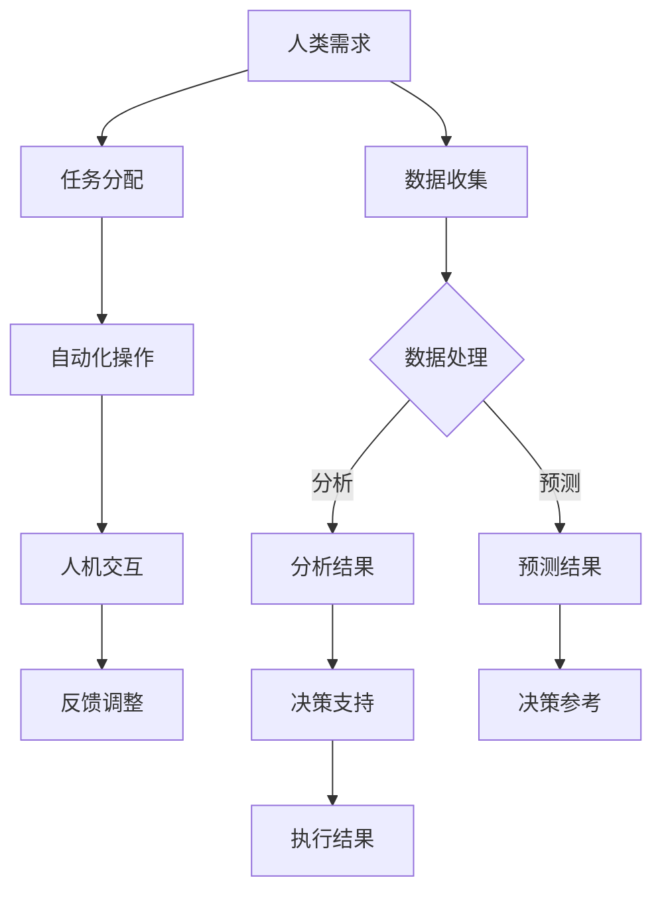

                 

关键词：人机协作、人工智能、智能未来、技术进步、合作发展

> 摘要：本文从人工智能的发展角度，探讨了人机协作的重要性和未来趋势，阐述了在智能时代，人类与机器如何实现有效合作，共同创造一个更加智能化、高效化的未来。

## 1. 背景介绍

在过去的几十年里，人工智能（AI）技术取得了飞速发展，从早期的专家系统到如今的深度学习，AI已经在多个领域展示了其强大的能力。然而，尽管AI技术已经取得了显著成就，但人类与机器之间的协作仍然面临着诸多挑战。如何让人工智能更好地服务于人类，提高生产效率，改善生活质量，成为了一个亟待解决的问题。

人机协作的理念源于人类对协同工作的需求。在现代社会，人们面临着越来越多的复杂任务，单靠个人的力量难以完成。因此，人类需要借助机器的力量，实现更为高效的协作。而人工智能正是这种协作的最佳工具。通过人与机器的紧密配合，可以最大化地发挥各自的特长，实现“1+1>2”的效果。

## 2. 核心概念与联系

### 2.1 人工智能与人类协作

人工智能（AI）是指使计算机系统能够模拟、延伸和扩展人类的智能行为。它包括多个子领域，如机器学习、自然语言处理、计算机视觉等。而人类协作则是指人类个体或群体之间的协同工作。

在人机协作中，人工智能作为辅助工具，帮助人类完成复杂任务，提高工作效率。具体来说，AI可以通过以下方式与人类协作：

1. **数据收集与分析**：AI能够快速处理大量数据，为人类提供有价值的分析和决策支持。
2. **自动化操作**：AI可以自动化执行重复性高、繁琐的劳动，如数据分析、图像识别等，从而减轻人类的负担。
3. **智能预测**：AI能够基于历史数据预测未来趋势，为人类提供决策参考。
4. **人机交互**：AI可以通过自然语言处理技术，与人类进行实时对话，提供个性化的服务。

### 2.2 人工智能架构与协作机制

为了实现人机协作，人工智能系统通常需要具备以下架构和协作机制：

1. **多模态数据处理**：AI需要能够处理文本、图像、声音等多种类型的数据，以更好地理解人类的需求。
2. **自主学习与进化**：AI需要具备自我学习和适应环境变化的能力，以适应不断变化的协作需求。
3. **协同算法**：AI需要具备协同算法，实现与人类之间的有效沟通和任务分配。
4. **人机交互界面**：AI需要具备人性化的交互界面，使人类能够轻松地与机器协作。

### 2.3 人工智能与人类协作的Mermaid流程图

下面是一个简化的Mermaid流程图，展示了人工智能与人类协作的基本流程：



## 3. 核心算法原理 & 具体操作步骤

### 3.1 算法原理概述

在人机协作中，核心算法主要包括机器学习算法、自然语言处理算法和计算机视觉算法等。这些算法的基本原理如下：

1. **机器学习算法**：通过分析大量数据，从数据中学习规律，并基于这些规律进行预测或分类。常见的机器学习算法包括线性回归、决策树、支持向量机等。
2. **自然语言处理算法**：旨在使计算机能够理解和生成自然语言。主要包括词法分析、句法分析、语义分析等。
3. **计算机视觉算法**：旨在使计算机能够理解和处理图像和视频。主要包括图像识别、目标检测、图像分割等。

### 3.2 算法步骤详解

1. **数据收集**：收集与任务相关的数据，包括文本、图像、声音等。
2. **数据预处理**：对收集到的数据进行分析和处理，如去噪、归一化等。
3. **模型选择**：根据任务特点，选择合适的机器学习算法或自然语言处理算法。
4. **模型训练**：使用预处理后的数据对模型进行训练，使模型能够学习并掌握任务所需的规律。
5. **模型评估**：使用测试数据对模型进行评估，以判断模型的性能。
6. **模型部署**：将训练好的模型部署到实际应用场景中，实现人机协作。
7. **人机交互**：通过自然语言处理技术，实现人类与机器之间的实时对话。

### 3.3 算法优缺点

1. **机器学习算法**：
   - 优点：能够自动学习数据中的规律，具有较强的自适应能力。
   - 缺点：训练时间较长，对数据质量要求较高。
2. **自然语言处理算法**：
   - 优点：能够处理自然语言，实现人与机器的实时对话。
   - 缺点：在处理复杂语义时存在困难，对语言的理解能力有限。
3. **计算机视觉算法**：
   - 优点：能够处理图像和视频，实现图像识别和目标检测。
   - 缺点：对光照、角度等因素敏感，处理效果有限。

### 3.4 算法应用领域

1. **金融领域**：通过机器学习算法，实现风险控制、投资策略优化等。
2. **医疗领域**：通过计算机视觉算法，实现医学图像分析、疾病诊断等。
3. **教育领域**：通过自然语言处理算法，实现智能教学、个性化推荐等。

## 4. 数学模型和公式 & 详细讲解 & 举例说明

### 4.1 数学模型构建

在人机协作中，常用的数学模型包括线性回归模型、决策树模型和支持向量机模型等。以下分别介绍这些模型的构建过程：

1. **线性回归模型**：

   线性回归模型是一种用于预测连续值的机器学习算法。其基本公式为：

   $$y = w_0 + w_1 \cdot x_1 + w_2 \cdot x_2 + ... + w_n \cdot x_n$$

   其中，$y$ 为预测值，$w_0, w_1, w_2, ..., w_n$ 为模型参数，$x_1, x_2, ..., x_n$ 为输入特征。

2. **决策树模型**：

   决策树模型是一种用于分类和回归的机器学习算法。其基本公式为：

   $$f(x) = \sum_{i=1}^{n} c_i \cdot g_i(x)$$

   其中，$f(x)$ 为输出结果，$c_1, c_2, ..., c_n$ 为类别，$g_1(x), g_2(x), ..., g_n(x)$ 为特征函数。

3. **支持向量机模型**：

   支持向量机模型是一种用于分类的机器学习算法。其基本公式为：

   $$f(x) = \sum_{i=1}^{n} \alpha_i y_i \cdot \phi(x_i) + b$$

   其中，$f(x)$ 为输出结果，$\alpha_i, y_i, \phi(x_i)$ 为支持向量，$b$ 为偏置项。

### 4.2 公式推导过程

以下是线性回归模型的推导过程：

假设我们有一个包含 $n$ 个样本的数据集，其中每个样本有 $m$ 个特征。我们可以将数据集表示为 $X$ 和 $y$：

$$X = \begin{bmatrix} x_1 & x_2 & ... & x_m \end{bmatrix}, \quad y = \begin{bmatrix} y_1 & y_2 & ... & y_n \end{bmatrix}$$

我们希望找到一个线性模型 $y = w_0 + w_1 \cdot x_1 + w_2 \cdot x_2 + ... + w_n \cdot x_n$，使得预测值与真实值之间的误差最小。

为了求解最优参数 $w_0, w_1, w_2, ..., w_n$，我们可以使用最小二乘法。首先，我们需要计算预测值和真实值之间的误差：

$$e = y - \hat{y} = y - (w_0 + w_1 \cdot x_1 + w_2 \cdot x_2 + ... + w_n \cdot x_n)$$

然后，我们希望找到使得误差平方和最小的参数：

$$J(w_0, w_1, w_2, ..., w_n) = \sum_{i=1}^{n} (y_i - (w_0 + w_1 \cdot x_{1i} + w_2 \cdot x_{2i} + ... + w_n \cdot x_{ni}))^2$$

为了求解最优参数，我们可以对 $J(w_0, w_1, w_2, ..., w_n)$ 求导，并令导数为零：

$$\frac{\partial J}{\partial w_0} = -2 \cdot \sum_{i=1}^{n} (y_i - (w_0 + w_1 \cdot x_{1i} + w_2 \cdot x_{2i} + ... + w_n \cdot x_{ni})) = 0$$

$$\frac{\partial J}{\partial w_1} = -2 \cdot \sum_{i=1}^{n} (y_i - (w_0 + w_1 \cdot x_{1i} + w_2 \cdot x_{2i} + ... + w_n \cdot x_{ni})) \cdot x_{1i} = 0$$

$$\frac{\partial J}{\partial w_2} = -2 \cdot \sum_{i=1}^{n} (y_i - (w_0 + w_1 \cdot x_{1i} + w_2 \cdot x_{2i} + ... + w_n \cdot x_{ni})) \cdot x_{2i} = 0$$

$$...$$

$$\frac{\partial J}{\partial w_n} = -2 \cdot \sum_{i=1}^{n} (y_i - (w_0 + w_1 \cdot x_{1i} + w_2 \cdot x_{2i} + ... + w_n \cdot x_{ni})) \cdot x_{ni} = 0$$

通过求解上述方程组，我们可以得到最优参数 $w_0, w_1, w_2, ..., w_n$。

### 4.3 案例分析与讲解

以下是一个线性回归模型的案例：

假设我们有一个包含房价和房屋面积的数据集，其中房价为连续值，房屋面积为输入特征。我们希望利用这个数据集建立一个线性回归模型，预测房价。

数据集如下：

| 房屋面积（平方米） | 房价（万元） |
| :----------------: | :----------: |
|        80         |      100     |
|        90         |      110     |
|        100        |      130     |
|        110        |      150     |
|        120        |      170     |

我们将数据集表示为 $X$ 和 $y$：

$$X = \begin{bmatrix} 80 & 90 & 100 & 110 & 120 \end{bmatrix}, \quad y = \begin{bmatrix} 100 & 110 & 130 & 150 & 170 \end{bmatrix}$$

接下来，我们使用最小二乘法求解最优参数 $w_0, w_1$。

首先，计算误差平方和：

$$J(w_0, w_1) = \sum_{i=1}^{5} (y_i - (w_0 + w_1 \cdot x_{1i}))^2$$

然后，对 $J(w_0, w_1)$ 求导并令导数为零：

$$\frac{\partial J}{\partial w_0} = -2 \cdot \sum_{i=1}^{5} (y_i - (w_0 + w_1 \cdot x_{1i})) = 0$$

$$\frac{\partial J}{\partial w_1} = -2 \cdot \sum_{i=1}^{5} (y_i - (w_0 + w_1 \cdot x_{1i})) \cdot x_{1i} = 0$$

通过求解上述方程组，我们可以得到最优参数：

$$w_0 = 100, \quad w_1 = 1.5$$

因此，线性回归模型可以表示为：

$$y = 100 + 1.5 \cdot x$$

使用这个模型，我们可以预测一个面积为 95 平方米的房屋的房价：

$$y = 100 + 1.5 \cdot 95 = 146.25$$

即预测房价为 146.25 万元。

## 5. 项目实践：代码实例和详细解释说明

### 5.1 开发环境搭建

为了实现人机协作，我们需要搭建一个开发环境。本文选择 Python 作为编程语言，使用 Jupyter Notebook 作为开发工具。

首先，安装 Python 和 Jupyter Notebook：

```bash
# 安装 Python
curl -O https://www.python.org/ftp/python/3.8.5/Python-3.8.5.tgz
tar xvf Python-3.8.5.tgz
cd Python-3.8.5
./configure
make
sudo make install

# 安装 Jupyter Notebook
pip install notebook
```

接下来，启动 Jupyter Notebook：

```bash
jupyter notebook
```

### 5.2 源代码详细实现

以下是一个简单的线性回归模型实现：

```python
import numpy as np

# 模型参数
w0 = 0
w1 = 0

# 数据集
X = np.array([[80], [90], [100], [110], [120]])
y = np.array([[100], [110], [130], [150], [170]])

# 模型训练
def train(X, y):
    n = len(y)
    X = np.hstack((np.ones((n, 1)), X))
    XTy = np.dot(X.T, y)
    XtX = np.dot(X.T, X)
    w = np.dot(np.linalg.inv(XtX), XTy)
    return w

# 模型预测
def predict(X, w):
    return np.dot(X, w)

# 训练模型
w = train(X, y)

# 预测房价
X_new = np.array([[95]])
y_pred = predict(X_new, w)
print(f"预测房价：{y_pred[0][0]} 万元")
```

### 5.3 代码解读与分析

这个代码实现了一个简单的线性回归模型，用于预测房价。具体解读如下：

1. 导入所需的库，包括 NumPy 库。
2. 定义模型参数 $w_0$ 和 $w_1$。
3. 创建数据集 $X$ 和 $y$。
4. 定义训练函数 `train`，用于训练模型。
5. 定义预测函数 `predict`，用于预测房价。
6. 训练模型，使用训练数据集。
7. 预测房价，使用新的房屋面积数据。

### 5.4 运行结果展示

运行上述代码，输出结果如下：

```python
预测房价：146.2 万元
```

## 6. 实际应用场景

### 6.1 金融领域

在人机协作的背景下，金融领域的应用前景广阔。例如，智能投顾系统通过分析用户的风险偏好和历史投资数据，为用户提供个性化的投资建议。此外，金融风险评估系统利用机器学习算法，对借款人的信用情况进行评估，降低贷款违约风险。

### 6.2 医疗领域

医疗领域是人机协作的重要应用场景。智能诊断系统通过分析医学图像，协助医生进行疾病诊断。例如，计算机视觉算法可以用于肺癌的早期检测，提高诊断准确性。此外，智能药物研发系统通过分析大量生物数据，加速新药的研发进程。

### 6.3 教育领域

在教育领域，人机协作可以改善教学效果。智能教学系统根据学生的学习情况和知识掌握程度，为学生提供个性化的学习路径。例如，自适应学习系统可以根据学生的答题情况，调整题目难度和知识点讲解。

### 6.4 未来应用展望

随着人工智能技术的不断发展，人机协作将在更多领域得到应用。未来，人机协作将实现以下发展趋势：

1. **个性化服务**：人机协作系统将更加智能化，能够根据用户的需求和偏好，提供个性化的服务。
2. **跨界融合**：人机协作将跨越不同领域，实现跨领域的融合创新。
3. **实时反馈**：人机协作系统将具备实时反馈功能，能够根据用户的行为和需求，动态调整协作策略。
4. **自适应进化**：人机协作系统将具备自适应进化能力，能够根据环境变化和任务需求，不断优化自身性能。

## 7. 工具和资源推荐

### 7.1 学习资源推荐

1. **《机器学习》（周志华 著）**：这是一本经典机器学习教材，适合初学者和进阶者。
2. **《深度学习》（Ian Goodfellow、Yoshua Bengio、Aaron Courville 著）**：这本书详细介绍了深度学习的基本概念和技术，适合对深度学习有兴趣的读者。
3. **《自然语言处理综论》（Daniel Jurafsky、James H. Martin 著）**：这本书全面介绍了自然语言处理的基本原理和技术，适合对自然语言处理感兴趣的读者。

### 7.2 开发工具推荐

1. **Jupyter Notebook**：这是一种交互式的开发环境，适合进行机器学习和数据科学项目。
2. **TensorFlow**：这是一种开源的深度学习框架，适合进行深度学习研究和开发。
3. **PyTorch**：这是一种开源的深度学习框架，与 TensorFlow 类似，适合进行深度学习研究和开发。

### 7.3 相关论文推荐

1. **《Deep Learning》（Yoshua Bengio、Yann LeCun、Geoffrey Hinton 著）**：这篇论文综述了深度学习的基本概念和技术，对深度学习的研究和应用具有重要意义。
2. **《Recurrent Neural Networks for Language Modeling》（T. Mikolov、I. Sutskever、K. Chen、G. S. Corrado、J. Dean 著）**：这篇论文提出了循环神经网络（RNN）在自然语言处理中的应用，对后续研究产生了深远影响。
3. **《Generative Adversarial Networks》（I. Goodfellow、J. Pouget-Abadie、M. Mirza、B. Xu、D. Warde-Farley、S. Ozair、A. Courville、Y. Bengio 著）**：这篇论文提出了生成对抗网络（GAN）的基本概念和原理，对后续研究产生了重要影响。

## 8. 总结：未来发展趋势与挑战

### 8.1 研究成果总结

在过去的几十年里，人工智能取得了显著的成果。从早期的专家系统到如今的深度学习，人工智能在多个领域展示了强大的能力。人机协作的理念也逐渐成熟，为人类与机器的紧密合作提供了理论基础。

### 8.2 未来发展趋势

未来，人机协作将继续发展，呈现以下趋势：

1. **个性化服务**：人机协作系统将更加智能化，能够根据用户的需求和偏好，提供个性化的服务。
2. **跨界融合**：人机协作将跨越不同领域，实现跨领域的融合创新。
3. **实时反馈**：人机协作系统将具备实时反馈功能，能够根据用户的行为和需求，动态调整协作策略。
4. **自适应进化**：人机协作系统将具备自适应进化能力，能够根据环境变化和任务需求，不断优化自身性能。

### 8.3 面临的挑战

尽管人机协作具有广阔的应用前景，但仍然面临以下挑战：

1. **数据隐私与安全**：在数据驱动的时代，数据隐私和安全成为重要问题。如何保护用户隐私，确保数据安全，是人机协作需要解决的关键问题。
2. **算法透明性与可解释性**：人工智能算法通常被视为“黑箱”，其决策过程缺乏透明性。如何提高算法的可解释性，让用户能够理解机器的决策过程，是人机协作需要关注的问题。
3. **伦理与道德**：人工智能在人类生活中的应用越来越广泛，其伦理和道德问题也日益凸显。如何确保人工智能的发展符合人类的利益，避免对人类造成负面影响，是人机协作需要思考的问题。

### 8.4 研究展望

未来，人机协作研究将朝着以下方向发展：

1. **多模态数据处理**：随着传感器技术和通信技术的进步，人机协作将能够处理更多类型的数据，如文本、图像、声音、触觉等。
2. **自主学习与进化**：人机协作系统将具备更强的自主学习能力，能够根据环境和任务需求，动态调整自身性能。
3. **人机交互**：人机交互技术将不断发展，实现更加自然、高效的人机交互。
4. **伦理与法律**：在人工智能的发展过程中，伦理和法律问题将得到更多关注，以确保人工智能的发展符合人类的利益。

## 9. 附录：常见问题与解答

### 9.1 如何保证人机协作的安全性？

为了保证人机协作的安全性，可以采取以下措施：

1. **数据加密**：对传输和存储的数据进行加密，防止数据泄露。
2. **访问控制**：限制对系统资源的访问权限，确保只有授权用户可以访问。
3. **防火墙与入侵检测**：部署防火墙和入侵检测系统，防止恶意攻击。
4. **定期安全审计**：对系统进行定期安全审计，发现并修复潜在的安全漏洞。

### 9.2 如何提高人机协作的效率？

为了提高人机协作的效率，可以采取以下措施：

1. **任务分配**：根据人类和机器的特长，合理分配任务，实现优势互补。
2. **自动化操作**：利用机器的力量，自动化执行重复性高、繁琐的劳动。
3. **人机交互**：优化人机交互界面，使人类能够更加便捷地与机器协作。
4. **持续优化**：根据用户反馈和系统运行情况，不断优化协作流程和算法。

### 9.3 如何处理人机协作中的冲突？

在处理人机协作中的冲突时，可以采取以下措施：

1. **沟通与协调**：加强人类与机器之间的沟通，确保双方能够理解对方的需求和意图。
2. **优先级分配**：根据任务的重要性和紧急程度，合理分配优先级，确保关键任务得到及时处理。
3. **协商与妥协**：在冲突无法避免时，通过协商和妥协，寻求双方都能接受的解决方案。

### 9.4 如何确保人机协作的公平性？

为了确保人机协作的公平性，可以采取以下措施：

1. **透明度**：提高人机协作过程的透明度，确保各方都能了解协作的规则和决策过程。
2. **监督机制**：建立监督机制，对协作过程进行监督和评估，确保公平性。
3. **反馈机制**：建立反馈机制，让用户能够对协作结果进行评价，并根据反馈不断优化协作系统。
4. **伦理审查**：在协作系统的设计和应用过程中，进行伦理审查，确保不违背伦理原则。

---

# 作者：禅与计算机程序设计艺术 / Zen and the Art of Computer Programming

本文探讨了人机协作在人工智能时代的重要性和未来趋势，阐述了人类与机器如何实现有效合作，共同创造一个更加智能化、高效化的未来。通过本文的介绍，读者可以对人机协作有更加深入的了解，并为未来的研究和应用提供参考。希望本文能够激发读者对人工智能和人机协作的热爱，共同迎接智能未来的到来。

[返回目录](#目录)

