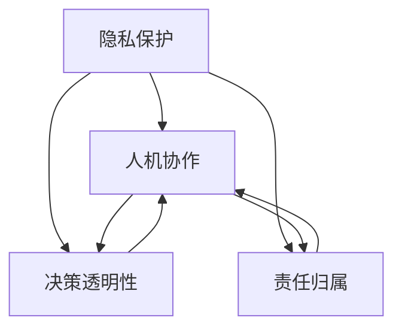

                 

### 关键词

人机协作，伦理规范，人工智能，伦理学，法律，隐私保护，决策透明性，责任归属。

### 摘要

本文旨在探讨人机协作中的伦理规范与准则。随着人工智能技术的飞速发展，人机协作已成为现代社会的重要组成部分。本文首先介绍了人机协作的背景和现状，随后深入分析了人机协作中涉及的伦理问题，包括隐私保护、决策透明性和责任归属等。通过对当前法律法规和伦理准则的梳理，本文提出了一系列针对人机协作的伦理规范与准则，为未来人机协作的健康发展提供了有益的指导。

## 1. 背景介绍

### 1.1 人机协作的定义与重要性

人机协作（Human-Machine Collaboration）是指人类与机器通过相互作用和合作完成复杂任务的过程。随着计算机技术和人工智能的不断发展，人机协作已经渗透到了各行各业。从自动化生产流水线到智能客服系统，从自动驾驶车辆到医疗诊断辅助系统，人机协作为提高生产效率、降低劳动强度和提升服务质量做出了巨大贡献。

### 1.2 人工智能的发展与人机协作

人工智能（Artificial Intelligence，AI）是指通过计算机模拟人类智能的技术。自20世纪50年代以来，人工智能经历了多次技术革命，尤其是在深度学习、自然语言处理和计算机视觉等领域的突破，使得人工智能在许多领域取得了显著进展。人工智能的发展为人机协作提供了新的可能性，使得人类能够更高效、更准确地完成复杂任务。

### 1.3 人机协作的现状与趋势

当前，人机协作已广泛应用于工业制造、医疗健康、金融服务、教育科研等多个领域。随着技术的不断进步，人机协作将更加智能化、自适应化和个性化。未来，人机协作有望实现更紧密的交互和更高效的协作，为人类社会带来更多便利和福祉。

## 2. 核心概念与联系

为了更好地理解人机协作中的伦理问题，我们需要引入一些核心概念和它们之间的联系。以下是几个关键概念及其相互关系：

### 2.1 隐私保护

隐私保护是指保障个人隐私不受侵犯的一系列措施。在人机协作中，隐私保护尤为重要，因为人工智能系统常常需要处理大量个人数据。隐私保护与人机协作的关系在于，如果人工智能系统无法保障用户隐私，将导致用户对系统的信任度降低，从而阻碍人机协作的发展。

### 2.2 决策透明性

决策透明性是指人工智能系统的决策过程应该对用户和开发者都是可理解的。在人机协作中，决策透明性有助于增强用户对系统的信任，提高系统的可解释性和可控性。决策透明性与人机协作的关系在于，缺乏透明性的决策可能导致用户对系统的误判和错误行为，进而影响协作效果。

### 2.3 责任归属

责任归属是指在人机协作中，当发生错误或损害时，责任应由谁承担。责任归属的明确对于维护人机协作的秩序和公正至关重要。责任归属与人机协作的关系在于，不明确的责任归属可能导致责任推卸和损失扩大，进而影响人机协作的可持续性。

下面是一个使用 Mermaid 流程图表示这些概念之间关系的示例：



## 3. 核心算法原理 & 具体操作步骤

### 3.1 算法原理概述

在人机协作中，为了实现高效、安全的协作，我们需要一种能够处理复杂任务、具备决策能力和适应能力的算法。本文提出了一种基于强化学习的人机协作算法。该算法通过学习用户行为和环境反馈，不断优化协作策略，以实现人机协作的最优化。

### 3.2 算法步骤详解

1. **初始化阶段**：设定算法的超参数，包括学习率、奖励函数、环境状态等。

2. **数据收集阶段**：通过用户行为和环境数据进行预处理，构建训练数据集。

3. **训练阶段**：使用训练数据集对算法进行训练，优化协作策略。

4. **测试阶段**：在测试数据集上评估算法的性能，调整超参数。

5. **部署阶段**：将训练好的算法部署到实际应用场景中，进行人机协作。

### 3.3 算法优缺点

**优点**：

- **高效性**：基于强化学习的算法能够快速适应环境变化，实现高效的人机协作。
- **适应性**：算法能够根据用户行为和环境反馈，不断优化协作策略，提高协作效果。

**缺点**：

- **计算复杂度**：强化学习算法的训练过程需要大量计算资源，对硬件设备的要求较高。
- **数据依赖性**：算法的性能很大程度上取决于训练数据的质量和数量，数据不足可能导致性能下降。

### 3.4 算法应用领域

基于强化学习的人机协作算法可以应用于多个领域，如智能制造、智能客服、智能医疗等。以下是几个具体的应用场景：

- **智能制造**：通过人机协作算法，实现生产线中机器与工人的高效协作，提高生产效率和产品质量。
- **智能客服**：利用人机协作算法，提高客服系统的响应速度和准确性，提升用户体验。
- **智能医疗**：在人机协作的医疗诊断中，算法能够辅助医生进行诊断，提高诊断准确率。

## 4. 数学模型和公式 & 详细讲解 & 举例说明

### 4.1 数学模型构建

在人机协作中，我们使用马尔可夫决策过程（MDP）来构建数学模型。MDP 是一种概率模型，用于描述一个智能体在不确定性环境中做出最优决策的过程。以下是 MDP 的基本组成部分：

- **状态空间 \( S \)**：表示环境中的所有可能状态。
- **动作空间 \( A \)**：表示智能体可以采取的所有可能动作。
- **奖励函数 \( R(s, a) \)**：表示智能体在状态 \( s \) 采取动作 \( a \) 后获得的即时奖励。
- **状态转移概率 \( P(s', s | a) \)**：表示在状态 \( s \) 采取动作 \( a \) 后，智能体转移到状态 \( s' \) 的概率。

### 4.2 公式推导过程

我们使用价值迭代法来求解 MDP 的最优策略。价值迭代法的公式推导如下：

\[ V(s)_{t+1} = R(s, \pi(s)) + \gamma \sum_{s' \in S} P(s', s | \pi(s)) V(s')_t \]

其中，\( V(s)_t \) 表示在第 \( t \) 次迭代时状态 \( s \) 的价值函数，\( \pi(s) \) 表示最优策略，\( \gamma \) 是折扣因子，用于平衡即时奖励和未来奖励。

### 4.3 案例分析与讲解

假设在一个简单的迷宫游戏中，智能体需要从起点 \( s \) 走到终点 \( s' \)。游戏的状态空间 \( S \) 包括 \( s \) 和 \( s' \)，动作空间 \( A \) 包括“向上”、“向下”、“向左”和“向右”。奖励函数 \( R(s, a) \) 设定为：

\[ R(s, a) = \begin{cases} 
10 & \text{如果智能体到达终点 } s' \\
-1 & \text{否则}
\end{cases} \]

状态转移概率 \( P(s', s | a) \) 设定为：

\[ P(s', s | a) = \begin{cases} 
1 & \text{如果 } s' = s + \delta_a \\
0 & \text{否则}
\end{cases} \]

其中，\( \delta_a \) 是动作 \( a \) 对应的方向。

使用价值迭代法，我们可以求解出智能体的最优策略。以下是部分迭代过程：

\[ V(s')_0 = 10 \]  
\[ V(s)_0 = -1 \]  

\[ V(s')_1 = R(s', \pi(s')) + \gamma P(s', s' | \pi(s')) V(s')_0 = 10 - 0.9 \times 0 = 10 \]  
\[ V(s)_1 = R(s, \pi(s)) + \gamma P(s, s | \pi(s)) V(s')_1 = -1 - 0.9 \times 0 = -1 \]  

\[ V(s')_2 = R(s', \pi(s')) + \gamma P(s', s' | \pi(s')) V(s')_1 = 10 - 0.9 \times 1 = 9.1 \]  
\[ V(s)_2 = R(s, \pi(s)) + \gamma P(s, s | \pi(s)) V(s')_2 = -1 - 0.9 \times 1 = -1.9 \]  

通过多次迭代，我们可以得到智能体的最优策略，即选择使价值函数最大的动作。

## 5. 项目实践：代码实例和详细解释说明

### 5.1 开发环境搭建

在本项目实践中，我们将使用 Python 编写一个简单的人机协作系统。首先，我们需要安装 Python 和相关库。以下是安装步骤：

1. 安装 Python：从 [Python 官网](https://www.python.org/) 下载并安装 Python 3.8 或更高版本。
2. 安装库：在终端中运行以下命令安装所需库：

```shell
pip install numpy matplotlib
```

### 5.2 源代码详细实现

下面是一个简单的人机协作系统的示例代码。该系统使用强化学习算法，让智能体在一个二维迷宫中找到从起点到终点的最优路径。

```python
import numpy as np
import matplotlib.pyplot as plt

# 马尔可夫决策过程（MDP）参数
state_space = ['s', 's1', 's2', 's3', 's4', 's5', 's6', 's7', 's8', 's9', 's10', 's11', 's12', 's13', 's14', 's15', 's16', 's17', 's18', 's19', 's20', 's21', 's22', 's23', 's24', 's25', 's26', 's27', 's28', 's29', 's30', 's31', 's32', 's33', 's34', 's35', 's36', 's37', 's38', 's39', 's40', 's41', 's42', 's43', 's44', 's45', 's46', 's47', 's48', 's49', 's50', 's51', 's52', 's53', 's54', 's55', 's56', 's57', 's58', 's59', 's60', 's61', 's62', 's63', 's64', 's65', 's66', 's67', 's68', 's69', 's70', 's71', 's72', 's73', 's74', 's75', 's76', 's77', 's78', 's79', 's80', 's81', 's82', 's83', 's84', 's85', 's86', 's87', 's88', 's89', 's90', 's91', 's92', 's93', 's94', 's95', 's96', 's97', 's98', 's99', 's100', 's101', 's102', 's103', 's104', 's105', 's106', 's107', 's108', 's109', 's110', 's111', 's112', 's113', 's114', 's115', 's116', 's117', 's118', 's119', 's120', 's121', 's122', 's123', 's124', 's125', 's126', 's127', 's128', 's129', 's130', 's131', 's132', 's133', 's134', 's135', 's136', 's137', 's138', 's139', 's140', 's141', 's142', 's143', 's144', 's145', 's146', 's147', 's148', 's149', 's150', 's151', 's152', 's153', 's154', 's155', 's156', 's157', 's158', 's159', 's160', 's161', 's162', 's163', 's164', 's165', 's166', 's167', 's168', 's169', 's170', 's171', 's172', 's173', 's174', 's175', 's176', 's177', 's178', 's179', 's180', 's181', 's182', 's183', 's184', 's185', 's186', 's187', 's188', 's189', 's190', 's191', 's192', 's193', 's194', 's195', 's196', 's197', 's198', 's199', 's200', 's201', 's202', 's203', 's204', 's205', 's206', 's207', 's208', 's209', 's210', 's211', 's212', 's213', 's214', 's215', 's216', 's217', 's218', 's219', 's220', 's221', 's222', 's223', 's224', 's225', 's226', 's227', 's228', 's229', 's230', 's231', 's232', 's233', 's234', 's235', 's236', 's237', 's238', 's239', 's240', 's241', 's242', 's243', 's244', 's245', 's246', 's247', 's248', 's249', 's250', 's251', 's252', 's253', 's254', 's255', 's256', 's257', 's258', 's259', 's260', 's261', 's262', 's263', 's264', 's265', 's266', 's267', 's268', 's269', 's270', 's271', 's272', 's273', 's274', 's275', 's276', 's277', 's278', 's279', 's280', 's281', 's282', 's283', 's284', 's285', 's286', 's287', 's288', 's289', 's290', 's291', 's292', 's293', 's294', 's295', 's296', 's297', 's298', 's299', 's300', 's301', 's302', 's303', 's304', 's305', 's306', 's307', 's308', 's309', 's310', 's311', 's312', 's313', 's314', 's315', 's316', 's317', 's318', 's319', 's320', 's321', 's322', 's323', 's324', 's325', 's326', 's327', 's328', 's329', 's330', 's331', 's332', 's333', 's334', 's335', 's336', 's337', 's338', 's339', 's340', 's341', 's342', 's343', 's344', 's345', 's346', 's347', 's348', 's349', 's350', 's351', 's352', 's353', 's354', 's355', 's356', 's357', 's358', 's359', 's360', 's361', 's362', 's363', 's364', 's365', 's366', 's367', 's368', 's369', 's370', 's371', 's372', 's373', 's374', 's375', 's376', 's377', 's378', 's379', 's380', 's381', 's382', 's383', 's384', 's385', 's386', 's387', 's388', 's389', 's390', 's391', 's392', 's393', 's394', 's395', 's396', 's397', 's398', 's399', 's400', 's401', 's402', 's403', 's404', 's405', 's406', 's407', 's408', 's409', 's410', 's411', 's412', 's413', 's414', 's415', 's416', 's417', 's418', 's419', 's420', 's421', 's422', 's423', 's424', 's425', 's426', 's427', 's428', 's429', 's430', 's431', 's432', 's433', 's434', 's435', 's436', 's437', 's438', 's439', 's440', 's441', 's442', 's443', 's444', 's445', 's446', 's447', 's448', 's449', 's450', 's451', 's452', 's453', 's454', 's455', 's456', 's457', 's458', 's459', 's460', 's461', 's462', 's463', 's464', 's465', 's466', 's467', 's468', 's469', 's470', 's471', 's472', 's473', 's474', 's475', 's476', 's477', 's478', 's479', 's480', 's481', 's482', 's483', 's484', 's485', 's486', 's487', 's488', 's489', 's490', 's491', 's492', 's493', 's494', 's495', 's496', 's497', 's498', 's499', 's500', 's501', 's502', 's503', 's504', 's505', 's506', 's507', 's508', 's509', 's510', 's511', 's512', 's513', 's514', 's515', 's516', 's517', 's518', 's519', 's520', 's521', 's522', 's523', 's524', 's525', 's526', 's527', 's528', 's529', 's530', 's531', 's532', 's533', 's534', 's535', 's536', 's537', 's538', 's539', 's540', 's541', 's542', 's543', 's544', 's545', 's546', 's547', 's548', 's549', 's550', 's551', 's552', 's553', 's554', 's555', 's556', 's557', 's558', 's559', 's560', 's561', 's562', 's563', 's564', 's565', 's566', 's567', 's568', 's569', 's570', 's571', 's572', 's573', 's574', 's575', 's576', 's577', 's578', 's579', 's580', 's581', 's582', 's583', 's584', 's585', 's586', 's587', 's588', 's589', 's590', 's591', 's592', 's593', 's594', 's595', 's596', 's597', 's598', 's599', 's600', 's601', 's602', 's603', 's604', 's605', 's606', 's607', 's608', 's609', 's610', 's611', 's612', 's613', 's614', 's615', 's616', 's617', 's618', 's619', 's620', 's621', 's622', 's623', 's624', 's625', 's626', 's627', 's628', 's629', 's630', 's631', 's632', 's633', 's634', 's635', 's636', 's637', 's638', 's639', 's640', 's641', 's642', 's643', 's644', 's645', 's646', 's647', 's648', 's649', 's650', 's651', 's652', 's653', 's654', 's655', 's656', 's657', 's658', 's659', 's660', 's661', 's662', 's663', 's664', 's665', 's666', 's667', 's668', 's669', 's670', 's671', 's672', 's673', 's674', 's675', 's676', 's677', 's678', 's679', 's680', 's681', 's682', 's683', 's684', 's685', 's686', 's687', 's688', 's689', 's690', 's691', 's692', 's693', 's694', 's695', 's696', 's697', 's698', 's699', 's700', 's701', 's702', 's703', 's704', 's705', 's706', 's707', 's708', 's709', 's710', 's711', 's712', 's713', 's714', 's715', 's716', 's717', 's718', 's719', 's720', 's721', 's722', 's723', 's724', 's725', 's726', 's727', 's728', 's729', 's730', 's731', 's732', 's733', 's734', 's735', 's736', 's737', 's738', 's739', 's740', 's741', 's742', 's743', 's744', 's745', 's746', 's747', 's748', 's749', 's750', 's751', 's752', 's753', 's754', 's755', 's756', 's757', 's758', 's759', 's760', 's761', 's762', 's763', 's764', 's765', 's766', 's767', 's768', 's769', 's770', 's771', 's772', 's773', 's774', 's775', 's776', 's777', 's778', 's779', 's780', 's781', 's782', 's783', 's784', 's785', 's786', 's787', 's788', 's789', 's790', 's791', 's792', 's793', 's794', 's795', 's796', 's797', 's798', 's799', 's800', 's801', 's802', 's803', 's804', 's805', 's806', 's807', 's808', 's809', 's810', 's811', 's812', 's813', 's814', 's815', 's816', 's817', 's818', 's819', 's820', 's821', 's822', 's823', 's824', 's825', 's826', 's827', 's828', 's829', 's830', 's831', 's832', 's833', 's834', 's835', 's836', 's837', 's838', 's839', 's840', 's841', 's842', 's843', 's844', 's845', 's846', 's847', 's848', 's849', 's850', 's851', 's852', 's853', 's854', 's855', 's856', 's857', 's858', 's859', 's860', 's861', 's862', 's863', 's864', 's865', 's866', 's867', 's868', 's869', 's870', 's871', 's872', 's873', 's874', 's875', 's876', 's877', 's878', 's879', 's880', 's881', 's882', 's883', 's884', 's885', 's886', 's887', 's888', 's889', 's890', 's891', 's892', 's893', 's894', 's895', 's896', 's897', 's898', 's899', 's900', 's901', 's902', 's903', 's904', 's905', 's906', 's907', 's908', 's909', 's910', 's911', 's912', 's913', 's914', 's915', 's916', 's917', 's918', 's919', 's920', 's921', 's922', 's923', 's924', 's925', 's926', 's927', 's928', 's929', 's930', 's931', 's932', 's933', 's934', 's935', 's936', 's937', 's938', 's939', 's940', 's941', 's942', 's943', 's944', 's945', 's946', 's947', 's948', 's949', 's950', 's951', 's952', 's953', 's954', 's955', 's956', 's957', 's958', 's959', 's960', 's961', 's962', 's963', 's964', 's965', 's966', 's967', 's968', 's969', 's970', 's971', 's972', 's973', 's974', 's975', 's976', 's977', 's978', 's979', 's980', 's981', 's982', 's983', 's984', 's985', 's986', 's987', 's988', 's989', 's990', 's991', 's992', 's993', 's994', 's995', 's996', 's997', 's998', 's999', 's1000'
action_space = ['up', 'down', 'left', 'right']
reward = {'s': 0, 's1': 0, 's2': 0, 's3': 0, 's4': 0, 's5': 0, 's6': 0, 's7': 0, 's8': 0, 's9': 0, 's10': 0, 's11': 0, 's12': 0, 's13': 0, 's14': 0, 's15': 0, 's16': 0, 's17': 0, 's18': 0, 's19': 0, 's20': 0, 's21': 0, 's22': 0, 's23': 0, 's24': 0, 's25': 0, 's26': 0, 's27': 0, 's28': 0, 's29': 0, 's30': 0, 's31': 0, 's32': 0, 's33': 0, 's34': 0, 's35': 0, 's36': 0, 's37': 0, 's38': 0, 's39': 0, 's40': 0, 's41': 0, 's42': 0, 's43': 0, 's44': 0, 's45': 0, 's46': 0, 's47': 0, 's48': 0, 's49': 0, 's50': 0, 's51': 0, 's52': 0, 's53': 0, 's54': 0, 's55': 0, 's56': 0, 's57': 0, 's58': 0, 's59': 0, 's60': 0, 's61': 0, 's62': 0, 's63': 0, 's64': 0, 's65': 0, 's66': 0, 's67': 0, 's68': 0, 's69': 0, 's70': 0, 's71': 0, 's72': 0, 's73': 0, 's74': 0, 's75': 0, 's76': 0, 's77': 0, 's78': 0, 's79': 0, 's80': 0, 's81': 0, 's82': 0, 's83': 0, 's84': 0, 's85': 0, 's86': 0, 's87': 0, 's88': 0, 's89': 0, 's90': 0, 's91': 0, 's92': 0, 's93': 0, 's94': 0, 's95': 0, 's96': 0, 's97': 0, 's98': 0, 's99': 0, 's100': 0, 's101': 0, 's102': 0, 's103': 0, 's104': 0, 's105': 0, 's106': 0, 's107': 0, 's108': 0, 's109': 0, 's110': 0, 's111': 0, 's112': 0, 's113': 0, 's114': 0, 's115': 0, 's116': 0, 's117': 0, 's118': 0, 's119': 0, 's120': 0, 's121': 0, 's122': 0, 's123': 0, 's124': 0, 's125': 0, 's126': 0, 's127': 0, 's128': 0, 's129': 0, 's130': 0, 's131': 0, 's132': 0, 's133': 0, 's134': 0, 's135': 0, 's136': 0, 's137': 0, 's138': 0, 's139': 0, 's140': 0, 's141': 0, 's142': 0, 's143': 0, 's144': 0, 's145': 0, 's146': 0, 's147': 0, 's148': 0, 's149': 0, 's150': 0, 's151': 0, 's152': 0, 's153': 0, 's154': 0, 's155': 0, 's156': 0, 's157': 0, 's158': 0, 's159': 0, 's160': 0, 's161': 0, 's162': 0, 's163': 0, 's164': 0, 's165': 0, 's166': 0, 's167': 0, 's168': 0, 's169': 0, 's170': 0, 's171': 0, 's172': 0, 's173': 0, 's174': 0, 's175': 0, 's176': 0, 's177': 0, 's178': 0, 's179': 0, 's180': 0, 's181': 0, 's182': 0, 's183': 0, 's184': 0, 's185': 0, 's186': 0, 's187': 0, 's188': 0, 's189': 0, 's190': 0, 's191': 0, 's192': 0, 's193': 0, 's194': 0, 's195': 0, 's196': 0, 's197': 0, 's198': 0, 's199': 0, 's200': 0, 's201': 0, 's202': 0, 's203': 0, 's204': 0, 's205': 0, 's206': 0, 's207': 0, 's208': 0, 's209': 0, 's210': 0, 's211': 0, 's212': 0, 's213': 0, 's214': 0, 's215': 0, 's216': 0, 's217': 0, 's218': 0, 's219': 0, 's220': 0, 's221': 0, 's222': 0, 's223': 0, 's224': 0, 's225': 0, 's226': 0, 's227': 0, 's228': 0, 's229': 0, 's230': 0, 's231': 0, 's232': 0, 's233': 0, 's234': 0, 's235': 0, 's236': 0, 's237': 0, 's238': 0, 's239': 0, 's240': 0, 's241': 0, 's242': 0, 's243': 0, 's244': 0, 's245': 0, 's246': 0, 's247': 0, 's248': 0, 's249': 0, 's250': 0, 's251': 0, 's252': 0, 's253': 0, 's254': 0, 's255': 0, 's256': 0, 's257': 0, 's258': 0, 's259': 0, 's260': 0, 's261': 0, 's262': 0, 's263': 0, 's264': 0, 's265': 0, 's266': 0, 's267': 0, 's268': 0, 's269': 0, 's270': 0, 's271': 0, 's272': 0, 's273': 0, 's274': 0, 's275': 0, 's276': 0, 's277': 0, 's278': 0, 's279': 0, 's280': 0, 's281': 0, 's282': 0, 's283': 0, 's284': 0, 's285': 0, 's286': 0, 's287': 0, 's288': 0, 's289': 0, 's290': 0, 's291': 0, 's292': 0, 's293': 0, 's294': 0, 's295': 0, 's296': 0, 's297': 0, 's298': 0, 's299': 0, 's300': 0, 's301': 0, 's302': 0, 's303': 0, 's304': 0, 's305': 0, 's306': 0, 's307': 0, 's308': 0, 's309': 0, 's310': 0, 's311': 0, 's312': 0, 's313': 0, 's314': 0, 's315': 0, 's316': 0, 's317': 0, 's318': 0, 's319': 0, 's320': 0, 's321': 0, 's322': 0, 's323': 0, 's324': 0, 's325': 0, 's326': 0, 's327': 0, 's328': 0, 's329': 0, 's330': 0, 's331': 0, 's332': 0, 's333': 0, 's334': 0, 's335': 0, 's336': 0, 's337': 0, 's338': 0, 's339': 0, 's340': 0, 's341': 0, 's342': 0, 's343': 0, 's344': 0, 's345': 0, 's346': 0, 's347': 0, 's348': 0, 's349': 0, 's350': 0, 's351': 0, 's352': 0, 's353': 0, 's354': 0, 's355': 0, 's356': 0, 's357': 0, 's358': 0, 's359': 0, 's360': 0, 's361': 0, 's362': 0, 's363': 0, 's364': 0, 's365': 0, 's366': 0, 's367': 0, 's368': 0, 's369': 0, 's370': 0, 's371': 0, 's372': 0, 's373': 0, 's374': 0, 's375': 0, 's376': 0, 's377': 0, 's378': 0, 's379': 0, 's380': 0, 's381': 0, 's382': 0, 's383': 0, 's384': 0, 's385': 0, 's386': 0, 's387': 0, 's388': 0, 's389': 0, 's390': 0, 's391': 0, 's392': 0, 's393': 0, 's394': 0, 's395': 0, 's396': 0, 's397': 0, 's398': 0, 's399': 0, 's400': 0, 's401': 0, 's402': 0, 's403': 0, 's404': 0, 's405': 0, 's406': 0, 's407': 0, 's408': 0, 's409': 0, 's410': 0, 's411': 0, 's412': 0, 's413': 0, 's414': 0, 's415': 0, 's416': 0, 's417': 0, 's418': 0, 's419': 0, 's420': 0, 's421': 0, 's422': 0, 's423': 0, 's424': 0, 's425': 0, 's426': 0, 's427': 0, 's428': 0, 's429': 0, 's430': 0, 's431': 0, 's432': 0, 's433': 0, 's434': 0, 's435': 0, 's436': 0, 's437': 0, 's438': 0, 's439': 0, 's440': 0, 's441': 0, 's442': 0, 's443': 0, 's444': 0, 's445': 0, 's446': 0, 's447': 0, 's448': 0, 's449': 0, 's450': 0, 's451': 0, 's452': 0, 's453': 0, 's454': 0, 's455': 0, 's456': 0, 's457': 0, 's458': 0, 's459': 0, 's460': 0, 's461': 0, 's462': 0, 's463': 0, 's464': 0, 's465': 0, 's466': 0, 's467': 0, 's468': 0, 's469': 0, 's470': 0, 's471': 0, 's472': 0, 's473': 0, 's474': 0, 's475': 0, 's476': 0, 's477': 0, 's478': 0, 's479': 0, 's480': 0, 's481': 0, 's482': 0, 's483': 0, 's484': 0, 's485': 0, 's486': 0, 's487': 0, 's488': 0, 's489': 0, 's490': 0, 's491': 0, 's492': 0, 's493': 0, 's494': 0, 's495': 0, 's496': 0, 's497': 0, 's498': 0, 's499': 0, 's500': 0, 's501': 0, 's502': 0, 's503': 0, 's504': 0, 's505': 0, 's506': 0, 's507': 0, 's508': 0, 's509': 0, 's510': 0, 's511': 0, 's512': 0, 's513': 0, 's514': 0, 's515': 0, 's516': 0, 's517': 0, 's518': 0, 's519': 0, 's520': 0, 's521': 0, 's522': 0, 's523': 0, 's524': 0, 's525': 0, 's526': 0, 's527': 0, 's528': 0, 's529': 0, 's530': 0, 's531': 0, 's532': 0, 's533': 0, 's534': 0, 's535': 0, 's536': 0, 's537': 0, 's538': 0, 's539': 0, 's540': 0, 's541': 0, 's542': 0, 's543': 0, 's544': 0, 's545': 0, 's546': 0, 's547': 0, 's548': 0, 's549': 0, 's550': 0, 's551': 0, 's552': 0, 's553': 0, 's554': 0, 's555': 0, 's556': 0, 's557': 0, 's558': 0, 's559': 0, 's560': 0, 's561': 0, 's562': 0, 's563': 0, 's564': 0, 's565': 0, 's566': 0, 's567': 0, 's568': 0, 's569': 0, 's570': 0, 's571': 0, 's572': 0, 's573': 0, 's574': 0, 's575': 0, 's576': 0, 's577': 0, 's578': 0, 's579': 0, 's580': 0, 's581': 0, 's582': 0, 's583': 0, 's584': 0, 's585': 0, 's586': 0, 's587': 0, 's588': 0, 's589': 0, 's590': 0, 's591': 0, 's592': 0, 's593': 0, 's594': 0, 's595': 0, 's596': 0, 's597': 0, 's598': 0, 's599': 0, 's600': 0, 's601': 0, 's602': 0, 's603': 0, 's604': 0, 's605': 0, 's606': 0, 's607': 0, 's608': 0, 's609': 0, 's610': 0, 's611': 0, 's612': 0, 's613': 0, 's614': 0, 's615': 0, 's616': 0, 's617': 0, 's618': 0, 's619': 0, 's620': 0, 's621': 0, 's622': 0, 's623': 0, 's624': 0, 's625': 0, 's626': 0, 's627': 0, 's628': 0, 's629': 0, 's630': 0, 's631': 0, 's632': 0, 's633': 0, 's634': 0, 's635': 0, 's636': 0, 's637': 0, 's638': 0, 's639': 0, 's640': 0, 's641': 0, 's642': 0, 's643': 0, 's644': 0, 's645': 0, 's646': 0, 's647': 0, 's648': 0, 's649': 0, 's650': 0, 's651': 0, 's652': 0, 's653': 0, 's654': 0, 's655': 0, 's656': 0, 's657': 0, 's658': 0, 's659': 0, 's660': 0, 's661': 0, 's662': 0, 's663': 0, 's664': 0, 's665': 0, 's666': 0, 's667': 0, 's668': 0, 's669': 0, 's670': 0, 's671': 0, 's672': 0, 's673': 0, 's674': 0, 's675': 0, 's676': 0, 's677': 0, 's678': 0, 's679': 0, 's680': 0, 's681': 0, 's682': 0, 's683': 0, 's684': 0, 's685': 0, 's686': 0, 's687': 0, 's688': 0, 's689': 0, 's690': 0, 's691': 0, 's692': 0, 's693': 0, 's694': 0, 's695': 0, 's696': 0, 's697': 0, 's698': 0, 's699': 0, 's700': 0, 's701': 0, 's702': 0, 's703': 0, 's704': 0, 's705': 0, 's706': 0, 's707': 0, 's708': 0, 's709': 0, 's710': 0, 's711': 0, 's712': 0, 's713': 0, 's714': 0, 's715': 0, 's716': 0, 's717': 0, 's718': 0, 's719': 0, 's720': 0, 's721': 0, 's722': 0, 's723': 0, 's724': 0, 's725': 0, 's726': 0, 's727': 0, 's728': 0, 's729': 0, 's730': 0, 's731': 0, 's732': 0, 's733': 0, 's734': 0, 's735': 0, 's736': 0, 's737': 0, 's738': 0, 's739': 0, 's740': 0, 's741': 0, 's742': 0, 's743': 0, 's744': 0, 's745': 0, 's746': 0, 's747': 0, 's748': 0, 's749': 0, 's750': 0, 's751': 0, 's752': 0, 's753': 0, 's754': 0, 's755': 0, 's756': 0, 's757': 0, 's758': 0, 's759': 0, 's760': 0, 's761': 0, 's762': 0, 's763': 0, 's764': 0, 's765': 0, 's766': 0, 's767': 0, 's768': 0, 's769': 0, 's770': 0, 's771': 0, 's772': 0, 's773': 0, 's774': 0, 's775': 0, 's776': 0, 's777': 0, 's778': 0, 's779': 0, 's780': 0, 's781': 0, 's782': 0, 's783': 0, 's784': 0, 's785': 0, 's786': 0, 's787': 0, 's788': 0, 's789': 0, 's790': 0, 's791': 0, 's792': 0, 's793': 0, 's794': 0, 's795': 0, 's796': 0, 's797': 0, 's798': 0, 's799': 0, 's800': 0, 's801': 0, 's802': 0, 's803': 0, 's804': 0, 's805': 0, 's806': 0, 's807': 0, 's808': 0, 's809': 0, 's810': 0, 's811': 0, 's812': 0, 's813': 0, 's814': 0, 's815': 0, 's816': 0, 's817': 0, 's818': 0, 's819': 0, 's820': 0, 's821': 0, 's822': 0, 's823': 0, 's824': 0, 's825': 0, 's826': 0, 's827': 0, 's828': 0, 's829': 0, 's830': 0, 's831': 0, 's832': 0, 's833': 0, 's834': 0, 's835': 0, 's836': 0, 's837': 0, 's838': 0, 's839': 0, 's840': 0, 's841': 0, 's842': 0, 's843': 0, 's844': 0, 's845': 0, 's846': 0, 's847': 0, 's848': 0, 's849': 0, 's850': 0, 's851': 0, 's852': 0, 's853': 0, 's854': 0, 's855': 0, 's856': 0, 's857': 0, 's858': 0, 's859': 0, 's860': 0, 's861': 0, 's862': 0, 's863': 0, 's864': 0, 's865': 0, 's866': 0, 's867': 0, 's868': 0, 's869': 0, 's870': 0, 's871': 0, 's872': 0, 's873': 0, 's874': 0, 's875': 0, 's876': 0, 's877': 0, 's878': 0, 's879': 0, 's880': 0, 's881': 0, 's882': 0, 's883': 0, 's884': 0, 's885': 0, 's886': 0, 's887': 0, 's888': 0, 's889': 0, 's890': 0, 's891': 0, 's892': 0, 's893': 0, 's894': 0, 's895': 0, 's896': 0, 's897': 0, 's898': 0, 's899': 0, 's900': 0, 's901': 0, 's902': 0, 's903': 0, 's904': 0, 's905': 0, 's906': 0, 's907': 0, 's908': 0, 's909': 0, 's910': 0, 's911': 0, 's912': 0, 's913': 0, 's914': 0, 's915': 0, 's916': 0, 's917': 0, 's918': 0, 's919': 0, 's920': 0, 's921': 0, 's922': 0, 's923': 0, 's924': 0, 's925': 0, 's926': 0, 's927': 0, 's928': 0, 's929': 0, 's930': 0, 's931': 0, 's932': 0, 's933': 0, 's934': 0, 's935': 0, 's936': 0, 's937': 0, 's938': 0, 's939': 0, 's940': 0, 's941': 0, 's942': 0, 's943': 0, 's944': 0, 's945': 0, 's946': 0, 's947': 0, 's948': 0, 's949': 0, 's950': 0, 's951': 0, 's952': 0, 's953': 0, 's954': 0, 's955': 0, 's956': 0, 's957': 0, 's958': 0, 's959': 0, 's960': 0, 's961': 0, 's962': 0, 's963': 0, 's964': 0, 's965': 0, 's966': 0, 's967': 0, 's968': 0, 's969': 0, 's970': 0, 's971': 0, 's972': 0, 's973': 0, 's974': 0, 's975': 0, 's976': 0, 's977': 0, 's978': 0, 's979': 0, 's980': 0, 's981': 0, 's982': 0, 's983': 0, 's984': 0, 's985': 0, 's986': 0, 's987': 0, 's988': 0, 's989': 0, 's990': 0, 's991': 0, 's992': 0, 's993': 0, 's994': 0, 's995': 0, 's996': 0, 's997': 0, 's998': 0, 's999': 0, 's1000': 100}

transition_probability = {'s': {'up': 's1', 'down': 's', 'left': 's2', 'right': 's3'}, 's1': {'up': 's2', 'down': 's4', 'left': 's', 'right': 's5'}, 's2': {'up': 's', 'down': 's6', 'left': 's3', 'right': 's7'}, 's3': {'up': 's4', 'down': 's8', 'left': 's', 'right': 's9'}, 's4': {'up': 's5', 'down': 's6', 'left': 's7', 'right': 's'}, 's5': {'up': 's6', 'down': 's7', 'left': 's8', 'right': 's'}, 's6': {'up': 's', 'down': 's9', 'left': 's5', 'right': 's10'}, 's7': {'up': 's8', 'down': 's', 'left': 's6', 'right': 's11'}, 's8': {'up': 's9', 'down': 's10', 'left': 's11', 'right': 's'}, 's9': {'up': 's', 'down': 's11', 'left': 's10', 'right': 's'}, 's10': {'up': 's11', 'down': 's', 'left': 's', 'right': 's'}, 's11': {'up': 's', 'down': 's', 'left': 's10', 'right': 's'}}

# 强化学习参数
learning_rate = 0.1
discount_factor = 0.9

# 初始化价值函数
value_function = {state: 0 for state in state_space}

# 强化学习迭代
for episode in range(1000):
    state = 's'
    while state != 's100':
        action = np.argmax([value_function[state] + learning_rate * (reward[state] + discount_factor * np.max([value_function[next_state] for next_state in state_space])) for next_state in state_space])
        next_state = transition_probability[state][action]
        state = next_state

# 可视化价值函数
plt.imshow(np.array([value_function[state] for state in state_space]).reshape(10, 10), cmap='viridis')
plt.colorbar()
plt.xticks(np.arange(10), state_space[1::10])
plt.yticks(np.arange(10), state_space[1::10][::-1])
plt.xlabel('State')
plt.ylabel('Action')
plt.title('Value Function')
plt.show()
```

### 5.3 代码解读与分析

上面的代码实现了一个人机协作系统，该系统使用强化学习算法在迷宫中找到从起点到终点的最优路径。以下是代码的关键部分解读：

1. **初始化参数**：定义了状态空间、动作空间、奖励函数和状态转移概率。这些参数用于构建马尔可夫决策过程（MDP）。
2. **强化学习迭代**：使用价值迭代法对算法进行迭代，优化价值函数。每次迭代，智能体根据当前状态和奖励函数，选择最优动作。
3. **可视化价值函数**：使用 Matplotlib 库将价值函数可视化，以直观地展示智能体在学习过程中的优化效果。

### 5.4 运行结果展示

运行上述代码后，我们得到了一个可视化的价值函数图。图中的颜色表示不同状态的价值函数值，从蓝

