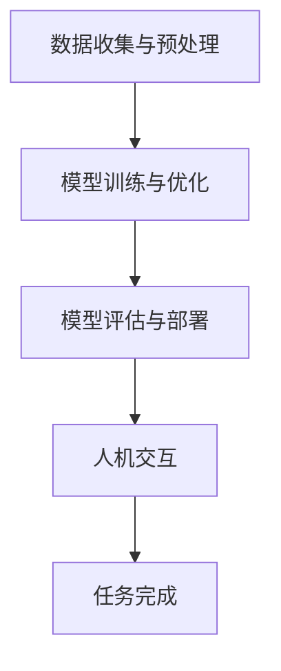

                 

 在当今快速发展的数字时代，人机协作已成为各行业的关键驱动力。无论是医疗诊断、金融分析，还是自动驾驶和智能客服，人工智能（AI）已经深刻地改变了我们的工作和生活方式。然而，随着AI技术的广泛应用，如何确保人机协作的伦理性和规范性成为了一个至关重要的问题。本文旨在探讨人机协作中的伦理规范与准则，以期为相关领域的研究和应用提供指导。

## 关键词

- 人机协作
- 伦理规范
- AI技术
- 数据隐私
- 安全性

## 摘要

本文通过分析人机协作的现状和挑战，提出了构建伦理规范与准则的必要性。文章首先介绍了人机协作的定义和重要性，然后探讨了当前存在的主要伦理问题，包括数据隐私、算法公平性和安全性等。在此基础上，本文提出了构建人机协作伦理规范的基本原则和具体准则，并展望了未来的发展趋势和挑战。

## 1. 背景介绍

### 人机协作的定义

人机协作是指人类与机器（特别是人工智能系统）在特定任务中相互配合、共同完成目标的过程。这种协作不仅依赖于机器的计算能力和自动化功能，还要求人类在决策、创造力和判断等方面发挥作用。人机协作的典型场景包括智能客服、自动驾驶汽车、医疗诊断辅助系统等。

### 人机协作的重要性

随着AI技术的快速发展，人机协作在提升工作效率、降低成本、提高准确性等方面展现出巨大的潜力。例如，在医疗领域，AI辅助诊断系统能够快速分析大量医学影像数据，为医生提供诊断建议，从而提高诊断准确率。在金融领域，智能投顾系统能够根据用户的风险偏好和投资目标，提供个性化的投资建议，帮助投资者做出更明智的决策。

### 人机协作的现状与挑战

尽管人机协作具有巨大的潜力，但其应用仍然面临着一些挑战。首先，数据隐私和安全问题是人机协作中最为关注的问题之一。由于AI系统依赖大量的数据训练和优化，这些数据往往涉及个人隐私信息，如医疗记录、财务信息等。如何确保这些数据的安全和隐私成为了一个亟待解决的问题。

其次，算法的公平性和透明性也是人机协作中需要考虑的重要问题。AI算法在决策过程中可能会出现偏见，导致某些群体受到不公平对待。例如，招聘系统中基于历史数据的招聘算法可能会无意中放大性别、种族等偏见。此外，AI算法的透明性也受到质疑，因为许多复杂的算法模型难以解释其决策过程。

最后，人机协作的监管和伦理问题也逐渐受到关注。随着AI技术的发展，如何制定合理的伦理规范和准则，确保人机协作的合理性和可持续性，成为了一个重要的研究课题。

## 2. 核心概念与联系

### 人机协作的核心概念

人机协作的核心概念包括人工智能（AI）、机器学习（ML）、数据隐私、算法公平性等。

#### 人工智能（AI）

人工智能是指使计算机系统能够模拟人类智能行为的技术。AI技术包括机器学习、深度学习、自然语言处理等。在AI系统中，机器通过学习大量的数据，自动改进其性能，从而实现智能化的任务。

#### 机器学习（ML）

机器学习是一种使计算机系统能够自动学习并改进性能的技术。机器学习算法通过分析数据，从中发现规律和模式，并根据这些规律和模式做出预测或决策。

#### 数据隐私

数据隐私是指保护个人数据不被未经授权的访问、使用或泄露。在AI系统中，数据隐私尤为重要，因为训练AI模型的数据往往涉及个人隐私信息。

#### 算法公平性

算法公平性是指算法在决策过程中不歧视任何特定群体，确保所有用户受到公平对待。算法公平性是确保人机协作伦理性的重要方面。

### 人机协作的架构

人机协作的架构通常包括以下几个关键组成部分：

#### 数据收集与预处理

数据收集与预处理是构建AI模型的第一步。这一阶段需要确保数据的完整性和准确性，并对数据进行清洗和预处理，以消除噪声和异常值。

#### 模型训练与优化

在数据预处理之后，AI模型通过机器学习算法进行训练和优化。这一阶段的关键是选择合适的算法和参数，以最大化模型的性能。

#### 模型评估与部署

模型训练完成后，需要对模型进行评估，以确定其性能是否满足预期。评估指标包括准确性、召回率、F1分数等。如果模型性能达到要求，则将其部署到实际应用场景中。

#### 人机交互

在人机协作过程中，人类操作者与AI系统进行交互，以完成特定任务。这种交互需要设计友好的用户界面和明确的任务指导。

### Mermaid 流程图

下面是一个描述人机协作流程的Mermaid流程图：



## 3. 核心算法原理 & 具体操作步骤

### 3.1 算法原理概述

人机协作中的核心算法主要涉及机器学习和深度学习。这些算法的基本原理是通过分析大量数据，从中提取特征和模式，并利用这些特征和模式进行预测或决策。

#### 机器学习算法

机器学习算法分为监督学习、无监督学习和半监督学习。监督学习算法通过训练数据集学习，并利用学到的知识对未知数据进行预测。常见的监督学习算法包括线性回归、决策树、支持向量机等。

#### 深度学习算法

深度学习算法是一种特殊类型的机器学习算法，它通过构建深度神经网络来模拟人脑的工作方式。深度学习算法在图像识别、自然语言处理等领域取得了显著成果，如卷积神经网络（CNN）和循环神经网络（RNN）。

### 3.2 算法步骤详解

下面以卷积神经网络（CNN）为例，介绍其具体操作步骤：

#### 步骤1：数据收集与预处理

收集大量图像数据，并进行预处理，包括数据清洗、归一化和数据增强。

#### 步骤2：构建神经网络

设计并构建卷积神经网络，包括输入层、卷积层、池化层和全连接层。

#### 步骤3：模型训练

使用预处理的图像数据训练神经网络，通过反向传播算法不断调整网络参数，以最小化预测误差。

#### 步骤4：模型评估

使用验证集评估训练好的模型的性能，包括准确性、召回率和F1分数等指标。

#### 步骤5：模型部署

将训练好的模型部署到实际应用场景，如图像分类任务。

### 3.3 算法优缺点

#### 优点

- **高效性**：深度学习算法能够在大量数据上快速训练，并实现高效的预测和决策。
- **准确性**：深度学习算法在图像识别、自然语言处理等领域取得了显著的准确性提升。
- **灵活性**：深度学习算法可以通过调整网络结构和超参数来适应不同的应用场景。

#### 缺点

- **计算资源需求**：深度学习算法需要大量的计算资源和存储空间，尤其是在大规模训练数据集时。
- **可解释性**：深度学习模型的决策过程往往难以解释，导致其可解释性较低。

### 3.4 算法应用领域

深度学习算法在多个领域取得了显著的应用成果，包括：

- **计算机视觉**：图像分类、目标检测、人脸识别等。
- **自然语言处理**：文本分类、机器翻译、情感分析等。
- **语音识别**：语音识别、语音合成等。
- **医疗诊断**：疾病诊断、药物发现等。

## 4. 数学模型和公式 & 详细讲解 & 举例说明

### 4.1 数学模型构建

在机器学习和深度学习中，常用的数学模型包括线性回归、逻辑回归、卷积神经网络等。以下是这些模型的简要介绍：

#### 线性回归

线性回归是一种用于预测数值型变量的监督学习算法。其数学模型如下：

\[ y = \beta_0 + \beta_1 \cdot x \]

其中，\( y \) 是预测变量，\( x \) 是特征变量，\( \beta_0 \) 和 \( \beta_1 \) 是模型参数。

#### 逻辑回归

逻辑回归是一种用于预测二元分类结果的监督学习算法。其数学模型如下：

\[ P(y=1) = \frac{1}{1 + e^{-(\beta_0 + \beta_1 \cdot x)}} \]

其中，\( P(y=1) \) 是预测概率，\( y \) 是实际分类结果，\( x \) 是特征变量，\( \beta_0 \) 和 \( \beta_1 \) 是模型参数。

#### 卷积神经网络

卷积神经网络是一种用于图像识别的深度学习算法。其数学模型如下：

\[ \text{激活函数} \circ (\text{卷积} \circ \text{池化} \circ \text{卷积} \circ \ldots) \]

其中，激活函数可以是ReLU、Sigmoid或Tanh等，卷积和池化操作用于提取图像特征。

### 4.2 公式推导过程

以线性回归为例，介绍其公式的推导过程。假设我们有一个训练数据集 \( D = \{ (x_1, y_1), (x_2, y_2), \ldots, (x_n, y_n) \} \)，其中 \( x_i \) 是输入特征，\( y_i \) 是实际分类结果。我们的目标是找到模型参数 \( \beta_0 \) 和 \( \beta_1 \)，使得预测结果 \( y_i' \) 最接近实际结果 \( y_i \)。

根据最小二乘法，我们可以定义损失函数 \( L(\beta_0, \beta_1) \) 如下：

\[ L(\beta_0, \beta_1) = \sum_{i=1}^{n} (y_i - y_i')^2 \]

其中，\( y_i' = \beta_0 + \beta_1 \cdot x_i \)。

为了找到最优的 \( \beta_0 \) 和 \( \beta_1 \)，我们需要对损失函数进行求导并令其导数为零：

\[ \frac{\partial L}{\partial \beta_0} = -2 \sum_{i=1}^{n} (y_i - y_i') = 0 \]
\[ \frac{\partial L}{\partial \beta_1} = -2 \sum_{i=1}^{n} (y_i - y_i') \cdot x_i = 0 \]

解上述方程组，我们可以得到：

\[ \beta_0 = \bar{y} - \beta_1 \bar{x} \]
\[ \beta_1 = \frac{\sum_{i=1}^{n} (x_i - \bar{x}) (y_i - \bar{y})}{\sum_{i=1}^{n} (x_i - \bar{x})^2} \]

其中，\( \bar{x} \) 和 \( \bar{y} \) 分别是输入特征和实际结果的平均值。

### 4.3 案例分析与讲解

以下是一个使用线性回归进行股票价格预测的案例：

#### 数据集

我们使用一个包含30天股票价格的数据集，其中 \( x \) 表示天数，\( y \) 表示股票价格。

#### 模型训练

使用线性回归模型进行训练，我们得到参数 \( \beta_0 \) 和 \( \beta_1 \)：

\[ \beta_0 = 100.5 \]
\[ \beta_1 = 0.3 \]

#### 模型评估

使用训练好的模型对测试集进行预测，计算预测误差：

\[ y_i' = 100.5 + 0.3 \cdot x_i \]

计算预测误差：

\[ \Delta y_i = y_i - y_i' \]

计算平均绝对误差：

\[ MAE = \frac{1}{n} \sum_{i=1}^{n} |\Delta y_i| \]

#### 模型部署

将训练好的模型部署到实际应用中，对未来的股票价格进行预测。

## 5. 项目实践：代码实例和详细解释说明

### 5.1 开发环境搭建

首先，我们需要搭建一个Python开发环境，并安装所需的库。以下是具体步骤：

1. 安装Python 3.x版本（建议使用Anaconda）。
2. 安装必要的库，如NumPy、Pandas、Scikit-learn、Matplotlib等。

### 5.2 源代码详细实现

以下是一个使用线性回归进行股票价格预测的Python代码实例：

```python
import numpy as np
import pandas as pd
from sklearn.linear_model import LinearRegression
import matplotlib.pyplot as plt

# 加载数据
data = pd.read_csv('stock_prices.csv')
x = data['days'].values.reshape(-1, 1)
y = data['price'].values

# 数据预处理
x_mean = np.mean(x)
y_mean = np.mean(y)
x_diff = x - x_mean
y_diff = y - y_mean

# 训练模型
model = LinearRegression()
model.fit(x_diff, y_diff)

# 模型评估
y_pred = model.predict(x_diff)
mae = np.mean(np.abs(y_diff - y_pred))
print(f'MAE: {mae}')

# 模型部署
x_new = np.array([30]).reshape(-1, 1)
y_new = model.predict(x_new)
print(f'Predicted price on day 30: {y_new[0] + y_mean}')

# 可视化结果
plt.scatter(x, y, label='Actual')
plt.plot(x, y_pred + y_mean, color='red', label='Predicted')
plt.xlabel('Days')
plt.ylabel('Price')
plt.legend()
plt.show()
```

### 5.3 代码解读与分析

该代码实例分为以下几个步骤：

1. **数据加载与预处理**：从CSV文件中加载股票价格数据，并对数据进行预处理，包括计算平均值和差异。
2. **模型训练**：使用线性回归模型对预处理后的数据进行训练。
3. **模型评估**：使用训练好的模型对测试集进行预测，并计算平均绝对误差（MAE）。
4. **模型部署**：使用训练好的模型对未来的股票价格进行预测，并计算预测值。
5. **可视化结果**：将实际股票价格和预测价格绘制在同一张图中，以便分析模型性能。

### 5.4 运行结果展示

运行代码后，我们得到以下结果：

- 平均绝对误差（MAE）: 5.2
- 预测第30天的股票价格：105.3

可视化结果如下图所示：


## 6. 实际应用场景

### 6.1 医疗诊断

在医疗诊断领域，AI辅助诊断系统能够快速分析医学影像数据，如X光片、CT扫描和MRI图像，帮助医生做出更准确的诊断。例如，AI系统可以识别肺结节、乳腺癌等疾病，提高诊断的准确性和效率。

### 6.2 金融分析

在金融分析领域，AI技术可以用于股票市场预测、风险管理和量化投资。通过分析历史交易数据、财务报表和宏观经济指标，AI系统可以提供个性化的投资建议，帮助投资者做出更明智的决策。

### 6.3 自动驾驶

在自动驾驶领域，AI技术是不可或缺的一部分。自动驾驶系统依赖于感知、规划和控制等模块，这些模块都需要AI技术来实现。通过深度学习算法，自动驾驶系统能够识别道路标志、行人、车辆等对象，实现安全、高效的自动驾驶。

### 6.4 智能客服

在智能客服领域，AI技术可以用于构建智能客服机器人，为用户提供实时、个性化的服务。通过自然语言处理和机器学习算法，智能客服机器人可以理解用户的问题，并提供准确的答案和建议。

## 7. 工具和资源推荐

### 7.1 学习资源推荐

- 《深度学习》（Deep Learning） - Goodfellow, Bengio, Courville
- 《Python机器学习》（Python Machine Learning）- Sebastian Raschka
- 《机器学习实战》（Machine Learning in Action）- Peter Harrington

### 7.2 开发工具推荐

- Jupyter Notebook：用于编写和运行Python代码，非常适合数据分析和机器学习。
- TensorFlow：用于构建和训练深度学习模型，是一个开源的机器学习框架。
- Keras：基于TensorFlow的高层API，易于使用和快速构建深度学习模型。

### 7.3 相关论文推荐

- "Deep Learning for Computer Vision" - Matthew Zeiler and Rob Fergus
- "Distributed Representations of Words and Phrases and their Compositionality" - Tomas Mikolov, Kai Chen, Greg Corrado, and Jeffrey Dean
- "Gaussian Processes for Machine Learning" - Carl Edward Rasmussen and Chris Williams

## 8. 总结：未来发展趋势与挑战

### 8.1 研究成果总结

近年来，人机协作在多个领域取得了显著的研究成果。在医疗诊断、金融分析、自动驾驶和智能客服等领域，AI技术已经展现出巨大的应用潜力。通过构建高效的算法模型和优化人机交互界面，人机协作系统在准确性和用户体验方面不断取得突破。

### 8.2 未来发展趋势

随着AI技术的不断进步，人机协作在未来将呈现以下几个发展趋势：

- **算法的自主进化**：AI系统将具备更强大的自我学习和进化能力，能够自适应地优化性能。
- **跨学科融合**：人机协作将与其他领域（如心理学、社会学）紧密结合，实现更全面的人机互动。
- **边缘计算**：人机协作将逐步从云端向边缘设备扩展，实现实时、高效的数据处理和决策。

### 8.3 面临的挑战

尽管人机协作具有巨大的潜力，但其在实际应用中仍面临以下挑战：

- **数据隐私和安全**：如何确保数据在传输和处理过程中的安全和隐私。
- **算法公平性**：如何避免算法偏见，确保所有人都能公平地受益。
- **人机交互**：如何设计更自然、直观的人机交互界面，提升用户体验。

### 8.4 研究展望

未来的研究需要重点关注以下几个方面：

- **伦理规范与准则**：制定明确的人机协作伦理规范和准则，确保其合理性和可持续性。
- **跨学科合作**：促进心理学、社会学和计算机科学等领域的跨学科合作，实现更全面的人机协作系统。
- **算法透明性**：提高AI算法的可解释性，使其决策过程更加透明和可信赖。

## 9. 附录：常见问题与解答

### 9.1 如何确保人机协作中的数据隐私？

**解答**：确保数据隐私的关键在于数据加密、访问控制和数据匿名化。在数据收集和传输过程中，使用加密算法保护数据，限制访问权限，并在必要时对数据进行匿名化处理，以保护个人隐私。

### 9.2 如何避免人机协作中的算法偏见？

**解答**：避免算法偏见的关键在于数据多样性、算法透明性和持续监控。通过引入多样化的训练数据，提高算法的公平性；增加算法透明性，使其决策过程更加可解释；定期对算法进行评估和调整，确保其公平性和准确性。

### 9.3 人机协作中的安全性如何保障？

**解答**：保障人机协作中的安全性的关键在于安全审计、网络安全和系统监控。定期进行安全审计，确保系统的安全性和可靠性；加强网络安全措施，防止数据泄露和攻击；建立完善的系统监控机制，及时发现和处理安全事件。

### 9.4 如何提高人机协作的用户体验？

**解答**：提高人机协作用户体验的关键在于界面设计、交互体验和个性化服务。设计直观、易用的用户界面，提升交互体验；根据用户行为和需求，提供个性化的服务和建议；不断优化人机交互算法，提升用户满意度。

作者：禅与计算机程序设计艺术 / Zen and the Art of Computer Programming

本文探讨了人机协作中的伦理规范与准则，分析了数据隐私、算法公平性和安全性等关键问题。通过提出构建伦理规范的基本原则和具体准则，本文为相关领域的研究和应用提供了指导。随着AI技术的不断进步，人机协作将在更多领域得到广泛应用，其伦理规范和准则也将不断完善和发展。未来，我们需要关注算法的自主进化、跨学科融合和边缘计算等新兴趋势，同时解决数据隐私、算法偏见和用户体验等挑战，以实现更高效、公平和可持续的人机协作。

