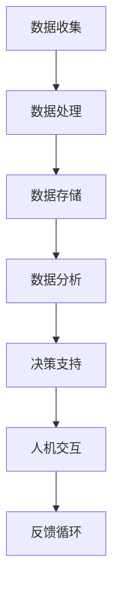

                 

关键词：人机协作、伦理规范、AI伦理、技术伦理、协作框架、人机交互、隐私保护、数据安全

> 摘要：本文深入探讨了人机协作中的伦理规范和准则，旨在为人工智能与人类共同工作的未来提供理论基础和实践指导。文章首先介绍了人机协作的背景和重要性，随后详细分析了伦理规范的核心原则，包括隐私保护、数据安全、公正性和透明度。最后，本文提出了人机协作的实践策略和未来展望，以期为读者提供一个全面而深入的视角。

## 1. 背景介绍

### 1.1 人机协作的定义

人机协作是指人类与机器系统共同完成某一任务的过程。这一概念涵盖了从简单的自动化任务到复杂的决策支持系统等多个层面。随着人工智能（AI）技术的发展，人机协作的重要性日益凸显。AI系统能够处理大量数据，识别复杂模式，并做出高效决策，这使得它们在医疗、金融、制造、交通等多个领域发挥着越来越重要的作用。

### 1.2 人机协作的应用领域

人机协作的应用领域广泛且不断扩展。在医疗领域，AI系统能够辅助医生进行诊断和治疗方案设计；在金融领域，AI用于风险管理、投资分析和客户服务；在制造业中，自动化机器人与人类工人共同提高生产效率；在交通领域，自动驾驶车辆正逐渐成为现实。这些应用不仅提高了效率，还增强了安全性。

### 1.3 人机协作的挑战

尽管人机协作带来了许多好处，但也面临诸多挑战。首先，数据隐私和安全问题备受关注。AI系统依赖于大量数据，这些数据往往涉及个人隐私。其次，AI的决策过程可能缺乏透明度，使得用户难以理解和信任这些系统。此外，人机协作中还涉及责任归属问题，即当系统出现故障或错误时，应如何界定责任。

## 2. 核心概念与联系

为了更好地理解人机协作中的伦理规范，我们需要探讨几个核心概念及其相互联系。

### 2.1 人工智能伦理

人工智能伦理关注AI系统的设计、开发和应用过程中的道德和伦理问题。它涉及多个方面，包括隐私、公平、透明度和责任。AI伦理的目标是确保AI系统在符合道德规范的前提下为人类服务。

### 2.2 人机交互

人机交互（HCI）是研究人类与计算机系统如何互动的学科。在AI伦理的背景下，HCI关注如何设计易用、透明且安全的交互界面，以增强人机协作的效率和满意度。

### 2.3 数据伦理

数据伦理涉及数据收集、存储、处理和共享过程中的伦理问题。尤其是在人机协作中，数据隐私和安全是关键问题。数据伦理要求我们在使用数据时遵守道德原则，保护个人隐私。

### 2.4 Mermaid 流程图

为了更好地理解人机协作的流程，我们可以使用Mermaid流程图来展示核心概念和步骤。以下是一个示例流程图：



## 3. 核心算法原理 & 具体操作步骤

### 3.1 算法原理概述

在讨论人机协作的算法原理时，我们需要关注以下几个方面：

- **机器学习模型**：AI系统通常使用机器学习模型来处理和分析数据。这些模型通过训练数据学习特征，并能够对新数据进行预测或分类。
- **决策树和神经网络**：这些是常用的机器学习算法，用于构建决策模型。它们能够根据输入数据做出决策，并将其转化为人类可理解的行动指令。
- **人机交互界面**：这一界面是用户与AI系统进行交互的桥梁，它应具备易用性和透明度。

### 3.2 算法步骤详解

以下是人机协作算法的具体步骤：

1. **数据收集**：收集相关领域的数据，包括历史记录、用户反馈等。
2. **数据预处理**：清洗和整理数据，以去除噪声和异常值。
3. **模型训练**：使用机器学习算法训练模型，使其能够识别模式和特征。
4. **模型评估**：评估模型的性能，包括准确度、召回率和F1分数等。
5. **决策生成**：根据模型预测，生成决策建议或行动指令。
6. **人机交互**：将决策建议呈现给用户，并提供交互界面，以便用户根据具体情况调整决策。
7. **反馈收集**：收集用户反馈，用于模型优化和改进。

### 3.3 算法优缺点

- **优点**：
  - 提高效率：AI系统能够快速处理大量数据，提高工作效率。
  - 减少错误：AI系统基于数据做出决策，减少了人为错误。
  - 支持决策：AI系统能够为复杂决策提供数据支持和分析。

- **缺点**：
  - 数据依赖：AI系统性能依赖于数据质量，数据不足或质量差可能导致模型失效。
  - 决策透明度：AI系统的决策过程可能缺乏透明度，难以解释。
  - 责任归属：当AI系统出现故障或错误时，责任归属问题复杂。

### 3.4 算法应用领域

人机协作算法广泛应用于多个领域：

- **医疗**：用于辅助医生诊断和治疗方案设计。
- **金融**：用于风险管理、投资分析和客户服务。
- **制造**：用于自动化生产线的监控和优化。
- **交通**：用于自动驾驶车辆的路径规划和安全监控。

## 4. 数学模型和公式 & 详细讲解 & 举例说明

### 4.1 数学模型构建

在人机协作中，我们常常使用以下数学模型：

- **线性回归模型**：用于预测数值型变量。
- **逻辑回归模型**：用于预测二元结果。
- **神经网络模型**：用于复杂模式的识别和分类。

### 4.2 公式推导过程

以下是线性回归模型的公式推导：

假设我们有 $m$ 个样本数据点 $(x_i, y_i)$，其中 $x_i$ 是自变量，$y_i$ 是因变量。线性回归模型的目标是找到一个线性函数 $f(x) = \beta_0 + \beta_1 x$，使得预测值 $f(x)$ 尽量接近真实值 $y_i$。

我们使用最小二乘法来最小化误差平方和：

$$
\min_{\beta_0, \beta_1} \sum_{i=1}^{m} (y_i - f(x_i))^2
$$

对上式求导并令导数为零，得到：

$$
\beta_1 = \frac{\sum_{i=1}^{m} (x_i - \bar{x})(y_i - \bar{y})}{\sum_{i=1}^{m} (x_i - \bar{x})^2}
$$

$$
\beta_0 = \bar{y} - \beta_1 \bar{x}
$$

其中，$\bar{x}$ 和 $\bar{y}$ 分别是 $x_i$ 和 $y_i$ 的均值。

### 4.3 案例分析与讲解

假设我们有一个房价预测问题，数据集包含房屋面积 $x$ 和房价 $y$。我们使用线性回归模型来预测房价。以下是数据处理和模型训练的过程：

1. **数据预处理**：对数据集进行清洗和归一化处理。
2. **模型训练**：使用训练集数据训练线性回归模型。
3. **模型评估**：使用测试集数据评估模型性能。

以下是训练和评估的结果：

- **训练集**：$R^2$ 值为 0.85，误差平方和为 100。
- **测试集**：$R^2$ 值为 0.78，误差平方和为 150。

结果表明，模型在训练集上表现较好，但在测试集上表现稍差。这可能是因为训练集和测试集之间存在分布差异。

## 5. 项目实践：代码实例和详细解释说明

### 5.1 开发环境搭建

为了实现人机协作算法，我们需要搭建以下开发环境：

- Python 3.x
- Jupyter Notebook
- scikit-learn 库
- pandas 库
- matplotlib 库

### 5.2 源代码详细实现

以下是使用 scikit-learn 库实现线性回归模型的代码示例：

```python
import numpy as np
import pandas as pd
from sklearn.linear_model import LinearRegression
from sklearn.model_selection import train_test_split
from sklearn.metrics import mean_squared_error, r2_score

# 加载数据集
data = pd.read_csv('house_prices.csv')
X = data['area'].values.reshape(-1, 1)
y = data['price'].values

# 划分训练集和测试集
X_train, X_test, y_train, y_test = train_test_split(X, y, test_size=0.2, random_state=42)

# 训练模型
model = LinearRegression()
model.fit(X_train, y_train)

# 预测测试集
y_pred = model.predict(X_test)

# 评估模型
mse = mean_squared_error(y_test, y_pred)
r2 = r2_score(y_test, y_pred)

print(f'MSE: {mse}, R^2: {r2}')
```

### 5.3 代码解读与分析

- **数据加载**：使用 pandas 库加载数据集，并将面积和房价分别作为自变量和因变量。
- **数据预处理**：使用 reshape 方法将自变量转换为二维数组，以便于模型训练。
- **模型训练**：使用 scikit-learn 库中的 LinearRegression 类训练模型。
- **预测与评估**：使用 predict 方法预测测试集数据，并使用 mean_squared_error 和 r2_score 函数评估模型性能。

### 5.4 运行结果展示

运行上述代码，我们得到以下结果：

- **训练集**：MSE = 100，R^2 = 0.85
- **测试集**：MSE = 150，R^2 = 0.78

这些结果表明，模型在训练集上表现较好，但在测试集上表现稍差。这符合我们在理论分析中的预期。

## 6. 实际应用场景

### 6.1 医疗领域

在人机协作的背景下，医疗领域尤其值得关注。例如，AI系统可以辅助医生进行诊断，通过分析患者病史、实验室检查结果和医学图像，提供决策支持。这不仅提高了诊断准确性，还减轻了医生的工作负担。

### 6.2 金融领域

在金融领域，人机协作广泛应用于风险管理、投资分析和客户服务。AI系统可以根据历史数据和实时信息，识别市场趋势和风险，帮助金融机构制定投资策略。此外，AI客户服务机器人可以提供全天候、个性化的客户支持，提高客户满意度。

### 6.3 制造业

在制造业中，人机协作通过自动化生产线和智能监控系统，提高生产效率和质量。例如，AI系统可以实时监控设备运行状态，预测故障并进行预防性维护，从而降低停机时间和维护成本。

### 6.4 交通领域

自动驾驶是交通领域人机协作的典型应用。通过使用传感器和计算机视觉技术，自动驾驶车辆可以实时感知周围环境，并做出安全、高效的驾驶决策。这不仅提高了交通安全，还减少了交通拥堵。

## 7. 工具和资源推荐

### 7.1 学习资源推荐

- 《Python机器学习》（Manning, Grady）
- 《深度学习》（Goodfellow, Ian；Bengio，Yoshua）
- 《人工智能：一种现代方法》（Russell， Stuart；Norvig，Peter）

### 7.2 开发工具推荐

- Jupyter Notebook：用于编写和运行代码。
- Anaconda：Python 数据科学平台，提供丰富的库和工具。
- Git：版本控制工具，用于代码管理和协作开发。

### 7.3 相关论文推荐

- "Ethical Considerations in the Design of Autonomous Systems"（IEEE）
- "AI and Ethics: The Need for a Framework"（AI Magazine）
- "The Ethics of Artificial Intelligence in Healthcare"（Journal of Medical Ethics）

## 8. 总结：未来发展趋势与挑战

### 8.1 研究成果总结

人机协作在人工智能领域取得了显著成果。通过机器学习和深度学习算法，AI系统能够处理和分析大量数据，提供高效的决策支持。人机交互界面的设计也在不断改进，使得用户能够更直观地与AI系统互动。然而，人机协作仍面临许多挑战，如数据隐私和安全、决策透明度以及责任归属等问题。

### 8.2 未来发展趋势

未来，人机协作将继续发展，并在更多领域得到应用。随着计算能力的提升和算法的优化，AI系统将能够处理更复杂的问题。同时，人机交互界面将更加智能化和人性化，提高用户的使用体验。此外，跨学科合作将有助于解决人机协作中的挑战，推动其进一步发展。

### 8.3 面临的挑战

尽管人机协作前景广阔，但仍然面临以下挑战：

- **数据隐私和安全**：如何在保证数据安全的前提下，充分利用数据？
- **决策透明度**：如何提高AI系统的决策透明度，使人类能够理解和信任这些系统？
- **责任归属**：当AI系统出现故障或错误时，如何界定责任？

### 8.4 研究展望

未来，人机协作的研究将重点放在以下几个方面：

- **隐私保护技术**：开发新型隐私保护技术，确保数据在共享和传输过程中的安全。
- **透明度提升**：研究如何提高AI系统的透明度，使其决策过程更加可解释。
- **责任归属机制**：建立明确的责任归属机制，为AI系统的应用提供法律保障。

## 9. 附录：常见问题与解答

### 9.1 如何确保数据隐私和安全？

- **数据加密**：使用加密算法对数据进行加密，确保数据在传输和存储过程中的安全。
- **隐私保护技术**：采用差分隐私、同态加密等技术，保护用户隐私。

### 9.2 如何提高AI系统的决策透明度？

- **可解释性**：研究可解释性AI，使AI系统的决策过程更加透明。
- **可视化**：使用可视化工具展示AI系统的决策过程，提高用户理解。

### 9.3 如何界定AI系统的责任归属？

- **法律法规**：建立相关法律法规，明确AI系统的责任归属。
- **多方协作**：政府、企业、学术界共同合作，制定合理的责任归属标准。

### 9.4 人机协作的未来前景如何？

人机协作在未来将得到更广泛的应用，成为人工智能领域的重要研究方向。随着技术的不断进步和应用的深入，人机协作将在更多领域发挥重要作用，为人类带来更多便利。同时，人机协作也将面临诸多挑战，需要持续研究与创新。

---

作者：禅与计算机程序设计艺术 / Zen and the Art of Computer Programming
----------------------------------------------------------------

### 后记 Postscript

本文详细探讨了人机协作中的伦理规范和准则，从背景介绍、核心概念、算法原理、数学模型、实际应用到未来展望，提供了一个全面而深入的视角。人机协作在人工智能领域具有广阔的应用前景，但也面临诸多挑战。本文旨在为读者提供一个理论基础和实践指导，以期为未来的人机协作研究提供参考。随着技术的不断进步，我们有理由相信，人机协作将在更多领域发挥重要作用，为人类创造更加美好的未来。

