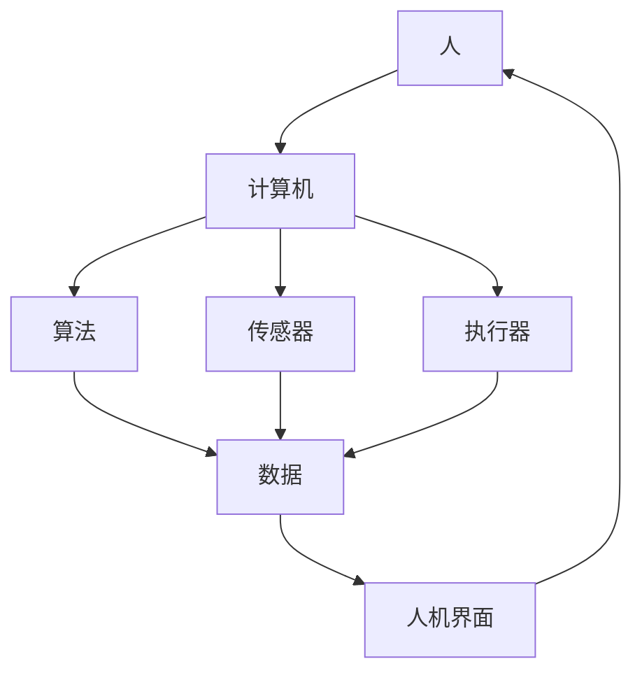

                 

关键词：人机协作、人工智能、智能未来、技术发展、创新应用

> 摘要：本文将探讨人机协作在智能未来的重要角色，从技术发展的角度分析人机协作的现状、核心概念、算法原理，以及实际应用场景，旨在为读者展现人机协作带来的变革和创新。

## 1. 背景介绍

随着人工智能技术的飞速发展，人机协作逐渐成为了一个热门话题。从传统的工业自动化到现代的智能助手，人机协作在各个领域都展现出了其独特的价值和潜力。本章节将简要回顾人机协作的历史和发展，并阐述其在现代科技中的重要性。

### 1.1 人机协作的历史与发展

人机协作的概念可以追溯到上世纪初期，当时的自动化设备开始与人类工人合作，以提高生产效率和减少劳动力成本。随着计算机技术的崛起，人机协作进入了新的阶段，特别是在工业自动化领域，机器人与人类的协同工作成为了提高生产效率和质量的关键手段。

进入21世纪，随着人工智能技术的发展，人机协作的概念被赋予了更多的内涵。智能助手、自动驾驶汽车、智能医疗设备等领域的创新应用，使得人机协作的理念逐渐深入人心。现代科技的发展，使得人机协作不再仅仅局限于工业领域，而是开始渗透到日常生活的方方面面。

### 1.2 人机协作在现代科技中的重要性

在现代科技中，人机协作的重要性体现在以下几个方面：

1. **提高效率**：通过智能算法和自动化设备，人机协作可以大幅提高工作效率，减少人为错误，从而提高生产和服务质量。
2. **扩展能力**：人工智能的加入，使得人机协作系统能够处理更复杂的数据和任务，扩展人类的能力边界。
3. **降低成本**：通过自动化和智能化，人机协作可以有效降低人力成本和运营成本。
4. **增强安全性**：在某些高风险或人类难以操作的领域，人机协作可以降低事故风险，提高作业安全性。

## 2. 核心概念与联系

在人机协作系统中，有几个核心概念和联系是至关重要的。以下是一个Mermaid流程图，用于描述这些概念和它们之间的联系：



### 2.1 人与计算机的交互

人通过人机界面与计算机进行交互，输入指令或获取信息。人机界面可以是图形用户界面（GUI）、命令行界面（CLI）或其他形式，其设计需要考虑用户体验和易用性。

### 2.2 计算机与算法

计算机通过算法处理数据，执行特定的任务。算法是计算机科学的核心，其设计直接影响人机协作系统的性能和效率。

### 2.3 传感器与执行器

传感器用于收集环境数据，而执行器则用于根据计算机的指令执行物理操作。这两者共同构成了人机协作系统的执行层。

### 2.4 数据流动

在人机协作系统中，数据流动是关键。从传感器收集的数据经过计算机处理，生成相应的指令，最终通过执行器实现物理操作。这一过程需要高效的数据传输和处理机制。

## 3. 核心算法原理 & 具体操作步骤

### 3.1 算法原理概述

人机协作系统的核心在于算法的设计和实现。算法的原理可以概括为以下几方面：

1. **数据采集与处理**：算法需要从传感器中采集数据，并进行预处理，以消除噪声和异常值。
2. **决策制定**：基于预处理后的数据，算法需要做出决策，例如路径规划、动作执行等。
3. **执行与反馈**：算法的决策结果通过执行器转化为物理操作，同时系统需要收集反馈信息，以优化后续的决策。

### 3.2 算法步骤详解

#### 3.2.1 数据采集与预处理

1. **传感器数据采集**：使用传感器获取环境信息，如位置、速度、温度等。
2. **数据滤波**：应用滤波算法（如卡尔曼滤波）去除噪声和异常值。
3. **特征提取**：从滤波后的数据中提取关键特征，用于后续的决策。

#### 3.2.2 决策制定

1. **状态估计**：使用滤波后的特征数据，估计系统的当前状态。
2. **路径规划**：在已知起点和终点的情况下，算法需要规划一条最优路径。
3. **动作生成**：根据当前状态和规划路径，算法生成相应的动作指令。

#### 3.2.3 执行与反馈

1. **执行器控制**：根据生成的动作指令，控制执行器执行具体的操作。
2. **反馈收集**：收集执行器执行后的反馈信息，用于调整后续的决策。
3. **闭环控制**：通过反馈信息进行闭环控制，确保系统的稳定性和准确性。

### 3.3 算法优缺点

#### 优点

1. **高效性**：算法能够快速处理大量数据，提高系统的响应速度。
2. **准确性**：通过精确的数据处理和决策制定，系统可以达到较高的准确性和稳定性。
3. **适应性**：算法可以根据不同的环境和任务需求进行调整，具有良好的适应性。

#### 缺点

1. **计算复杂度**：某些复杂的算法可能需要大量的计算资源，影响系统的实时性。
2. **数据噪声**：传感器采集的数据可能存在噪声和异常值，影响算法的性能。

### 3.4 算法应用领域

1. **工业自动化**：机器人与人类工人在生产线上的协同作业，提高生产效率和质量。
2. **自动驾驶**：自动驾驶汽车通过传感器和算法实现自主驾驶，减少交通事故。
3. **智能医疗**：智能医疗设备通过算法辅助医生进行诊断和治疗，提高医疗水平。

## 4. 数学模型和公式

在人机协作系统中，数学模型和公式是核心组成部分。以下是对关键数学模型和公式的详细讲解。

### 4.1 数学模型构建

在人机协作系统中，常见的数学模型包括状态空间模型、控制理论模型和机器学习模型等。以下是一个状态空间模型的简单示例：

$$
\begin{align*}
\dot{x}(t) &= A x(t) + B u(t) \\
y(t) &= C x(t) + D u(t)
\end{align*}
$$

其中，$x(t)$ 是系统状态向量，$u(t)$ 是输入向量，$y(t)$ 是输出向量，$A$、$B$、$C$ 和 $D$ 是系统矩阵。

### 4.2 公式推导过程

#### 4.2.1 状态估计

状态估计是状态空间模型中的一个关键问题。一种常见的状态估计方法是卡尔曼滤波。卡尔曼滤波的推导过程如下：

$$
\begin{align*}
\hat{x}_{k|k-1} &= F_k \hat{x}_{k-1|k-1} + L_k (z_k - H_k \hat{x}_{k-1|k-1}) \\
P_{k|k-1} &= F_k P_{k-1|k-1} F_k^T + L_k R_k L_k^T \\
\hat{x}_{k|k} &= \hat{x}_{k|k-1} + K_k (z_k - H_k \hat{x}_{k|k-1}) \\
P_{k|k} &= (I - K_k H_k) P_{k|k-1}
\end{align*}
$$

其中，$K_k$ 是卡尔曼增益，$R_k$ 是过程噪声协方差矩阵，$L_k$ 是滤波增益。

#### 4.2.2 控制策略

在控制理论模型中，常见的问题是求解最优控制策略。一种方法是使用动态规划。动态规划的目标是最小化期望成本函数：

$$
J(x_0, u_0) = \min_U \int_0^{\infty} c(t, x(t), u(t)) dt
$$

其中，$c(t, x(t), u(t))$ 是成本函数。

### 4.3 案例分析与讲解

#### 4.3.1 智能交通系统

智能交通系统是一个典型的人机协作应用案例。以下是一个基于卡尔曼滤波的智能交通系统的案例。

**问题描述**：在智能交通系统中，车辆的位置和速度需要实时估计，以便实现自动驾驶和交通流量控制。

**解决方案**：使用卡尔曼滤波器对车辆的位置和速度进行估计。传感器数据包括GPS信号、雷达测距和车辆速度传感器。卡尔曼滤波器通过融合这些数据，实现准确的车辆状态估计。

**实现步骤**：

1. **初始化**：设定初始状态和初始误差协方差矩阵。
2. **预测**：根据运动模型预测下一时刻的状态。
3. **更新**：利用传感器数据进行状态更新，计算卡尔曼增益。
4. **估计**：根据卡尔曼增益和传感器数据更新状态估计。

通过这个案例，我们可以看到数学模型和公式在人机协作系统中的实际应用。

## 5. 项目实践：代码实例和详细解释说明

### 5.1 开发环境搭建

为了演示人机协作的具体实现，我们选择一个简单的项目——基于Python的智能助手。首先，我们需要搭建开发环境。

1. 安装Python：从官方网站下载并安装Python。
2. 安装必要的库：使用pip安装Turtle库和Pygame库。

```bash
pip install turtle pygame
```

### 5.2 源代码详细实现

以下是一个简单的智能助手的源代码实现：

```python
import turtle
import pygame
import random

# 初始化Turtle和Pygame
turtle.speed(0)
pygame.init()

# 定义角色
class Role(turtle.Turtle):
    def __init__(self):
        super().__init__(shape="circle")
        self.penup()
        self.color("blue")
        self.speed("fastest")

    def move(self, x, y):
        self.goto(x, y)

    def show_message(self, message):
        text = turtle.Turtle()
        text.penup()
        text.goto(self.xcor(), self.ycor() + 20)
        text.write(message, align="center", font=("Arial", 12, "normal"))

# 创建角色实例
human = Role()
bot = Role()

# 游戏主循环
while True:
    # 人类角色移动
    human.move(random.randint(-200, 200), random.randint(-200, 200))
    human.show_message("我是人类")

    # 机器人角色移动
    bot.move(random.randint(-200, 200), random.randint(-200, 200))
    bot.show_message("我是机器人")

    # 更新屏幕
    turtle.update()
    pygame.display.update()
```

### 5.3 代码解读与分析

这段代码实现了一个人机协作的简单场景，其中人类角色和机器人角色在屏幕上随机移动，并显示各自的名称。

1. **角色定义**：`Role` 类是基础角色类，继承了 `turtle.Turtle` 类，添加了移动和显示信息的函数。
2. **游戏主循环**：主循环中，人类角色和机器人角色交替移动，并显示名称。
3. **随机移动**：使用 `random.randint` 函数生成随机坐标，模拟角色的移动。
4. **更新屏幕**：`turtle.update()` 和 `pygame.display.update()` 用于更新屏幕显示。

### 5.4 运行结果展示

运行这段代码，将看到一个窗口，其中人类角色和机器人角色在屏幕上随机移动，并显示各自的名称。这只是一个简单的演示，但展示了人机协作的基本原理。

## 6. 实际应用场景

### 6.1 智能医疗

在智能医疗领域，人机协作广泛应用于医疗诊断、治疗规划和患者监护。例如，医生可以使用人工智能系统进行影像分析，快速准确地诊断疾病。此外，智能助手可以协助医生进行病历管理、手术规划等工作，提高工作效率和准确性。

### 6.2 智能交通

智能交通系统通过人机协作，实现了更高效的交通管理和安全驾驶。自动驾驶汽车依赖于传感器和人工智能算法，实现自主驾驶。同时，智能交通管理系统可以实时监控交通流量，优化交通信号灯控制，减少交通拥堵。

### 6.3 智能家居

智能家居系统通过人机协作，实现了家庭设备的自动化控制。用户可以通过智能手机或语音助手控制家中的灯光、温度、安防设备等。智能助手可以学习用户的习惯，自动调整家庭环境，提高生活质量。

## 7. 工具和资源推荐

### 7.1 学习资源推荐

1. **《人工智能：一种现代方法》**：Michael I. Jordan 等著，是一本全面的人工智能教材。
2. **《深度学习》**：Ian Goodfellow 等著，是深度学习领域的经典教材。

### 7.2 开发工具推荐

1. **Python**：适用于数据分析和人工智能开发的编程语言。
2. **TensorFlow**：由Google开发的开源机器学习框架。

### 7.3 相关论文推荐

1. **"Human-Automation Teamwork in Process Control: Design and Evaluation of a Method for Predicting Team Performance in Adaptive Systems"**：一篇关于人机协作在过程控制中的应用研究论文。
2. **"Autonomous Driving: A Brief History and Overview of Current Research"**：一篇关于自动驾驶技术的综述论文。

## 8. 总结：未来发展趋势与挑战

### 8.1 研究成果总结

人机协作在人工智能、智能医疗、智能交通和智能家居等领域取得了显著成果。通过融合人工智能技术和自动化设备，人机协作系统能够实现更高效、准确和安全的操作。

### 8.2 未来发展趋势

1. **智能化与个性化**：人机协作系统将更加智能化和个性化，能够更好地满足用户需求。
2. **跨领域应用**：人机协作将在更多领域得到应用，如教育、金融、工业制造等。
3. **协同进化**：人机协作系统将不断发展，人与机器将共同进化，形成更紧密的协同关系。

### 8.3 面临的挑战

1. **技术挑战**：人工智能算法的复杂性和实时性要求不断提高，需要更高效的算法和计算资源。
2. **伦理挑战**：人机协作系统的发展引发了一系列伦理问题，如隐私保护、安全性和责任归属等。
3. **社会挑战**：人机协作将对就业结构和社会关系产生深远影响，需要制定相应的政策和社会规范。

### 8.4 研究展望

人机协作将继续作为人工智能领域的研究热点，未来的研究将集中在智能化、个性化、协同性和安全性等方面。通过持续的技术创新和社会参与，人机协作有望为人类创造更美好的未来。

## 9. 附录：常见问题与解答

### 9.1 什么是人机协作？

人机协作是指人类和计算机系统在特定任务中相互配合，共同完成任务的过程。

### 9.2 人机协作有哪些应用场景？

人机协作广泛应用于工业自动化、智能医疗、智能交通、智能家居等领域。

### 9.3 如何实现人机协作？

实现人机协作的关键在于设计高效的人工智能算法和良好的用户界面，同时确保系统的实时性和可靠性。

### 9.4 人机协作的未来发展方向是什么？

未来人机协作的发展方向包括智能化、个性化、跨领域应用和协同进化等。

## 作者署名

作者：禅与计算机程序设计艺术 / Zen and the Art of Computer Programming

