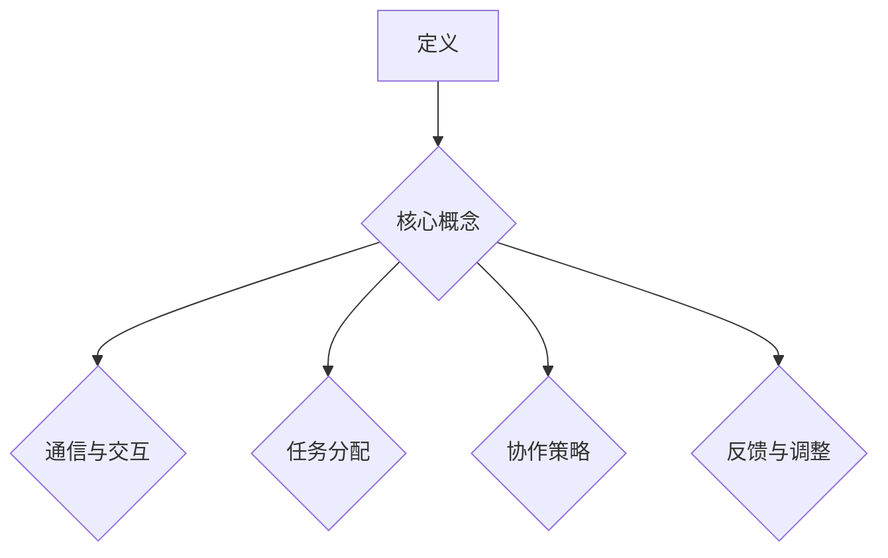

                 

关键词：人机协作、人工智能、技术发展、未来展望、智能系统

摘要：随着人工智能技术的快速发展，人机协作正逐渐成为现代科技领域的热点。本文将从背景介绍、核心概念、算法原理、数学模型、项目实践、实际应用场景、未来展望等多个维度，探讨人机协作在未来的发展趋势和面临的挑战，为读者呈现一条通向智能之路的清晰路径。

## 1. 背景介绍

在过去的几十年里，人工智能技术经历了从模拟到智能的跨越。从最初的专家系统到现代的深度学习，人工智能的发展已经深刻地改变了我们的生活方式。与此同时，人类与机器之间的协作方式也在不断地演变。从早期的自动化流水线到如今的智能化机器人，人机协作已经成为了提高生产效率、优化工作流程的重要手段。

随着人工智能技术的不断进步，人机协作的潜力被进一步挖掘。通过结合人类的创造力和机器的计算能力，人机协作能够实现更高效的决策、更精准的控制和更智能的服务。在这个背景下，人机协作的研究和应用逐渐成为学术界和产业界关注的焦点。

## 2. 核心概念与联系

### 2.1 人机协作的定义

人机协作是指人类与机器通过相互配合、相互补充，共同完成某项任务的过程。在这个过程中，人类负责提供创造力、判断力和经验，而机器则负责提供计算速度、存储能力和精确性。

### 2.2 人机协作的关键要素

- **通信与交互**：人类与机器之间需要建立有效的通信与交互机制，以便进行信息的传递和指令的执行。
- **任务分配**：根据人类的特长和机器的能力，合理分配任务，使双方能够发挥最大的效益。
- **协作策略**：制定有效的协作策略，确保人机系统能够协同工作，达到最优的协作效果。
- **反馈与调整**：通过实时反馈和调整，不断优化协作过程，提高协作效率。

### 2.3 Mermaid 流程图



## 3. 核心算法原理 & 具体操作步骤

### 3.1 算法原理概述

人机协作算法的核心思想是通过智能算法，使机器能够更好地理解人类的意图，并能够自主地适应和优化协作过程。常见的算法包括基于机器学习的意图识别算法、基于规划的协作算法和基于博弈论的合作策略算法。

### 3.2 算法步骤详解

1. **意图识别**：通过自然语言处理技术，对人类输入的指令进行理解，识别出人类的主要意图。
2. **任务分配**：根据人类的意图和机器的能力，将任务合理地分配给机器或人类。
3. **协作策略**：利用博弈论或强化学习等方法，制定最优的协作策略。
4. **执行与反馈**：机器执行任务，并实时反馈执行结果，人类根据反馈进行调整。

### 3.3 算法优缺点

- **优点**：提高了任务执行的效率，减少了人为错误，增强了系统的适应能力。
- **缺点**：算法复杂度高，对数据量和计算能力要求较高，需要不断优化和调整。

### 3.4 算法应用领域

人机协作算法在智能客服、智能物流、智能医疗等多个领域都有广泛的应用。例如，在智能客服中，人机协作算法能够实现智能对话，提高客户服务质量；在智能物流中，人机协作算法能够优化运输路线，提高物流效率。

## 4. 数学模型和公式 & 详细讲解 & 举例说明

### 4.1 数学模型构建

人机协作的数学模型通常包括三个部分：意图识别模型、任务分配模型和协作策略模型。

### 4.2 公式推导过程

- **意图识别模型**：利用自然语言处理技术，建立意图识别模型。常见的方法有基于规则的模型、基于统计的模型和基于深度学习的模型。
- **任务分配模型**：利用优化算法，建立任务分配模型。常见的方法有线性规划、整数规划和启发式算法。
- **协作策略模型**：利用博弈论或强化学习，建立协作策略模型。常见的方法有纳什均衡和Q-学习。

### 4.3 案例分析与讲解

以智能客服为例，我们可以利用意图识别模型来识别用户的意图，利用任务分配模型来分配任务，利用协作策略模型来优化对话过程。具体的数学模型和公式如下：

$$
\text{Intent} = f(\text{Input}, \text{Model})
$$

$$
\text{Task} = \text{分配器}(\text{Intent}, \text{MachineCapability}, \text{HumanCapability})
$$

$$
\text{Strategy} = \text{博弈论模型}(\text{Intent}, \text{Task}, \text{Feedback})
$$

## 5. 项目实践：代码实例和详细解释说明

### 5.1 开发环境搭建

在本文的项目实践中，我们将使用Python作为主要编程语言，并借助TensorFlow和PyTorch等深度学习框架。

### 5.2 源代码详细实现

以下是智能客服项目中的一部分代码实现：

```python
import tensorflow as tf
from tensorflow.keras.models import Sequential
from tensorflow.keras.layers import Dense, LSTM

# 意图识别模型
def build_intent_model(input_shape):
    model = Sequential()
    model.add(LSTM(128, input_shape=input_shape, activation='relu'))
    model.add(Dense(1, activation='sigmoid'))
    model.compile(optimizer='adam', loss='binary_crossentropy', metrics=['accuracy'])
    return model

# 任务分配模型
def build_task_model(input_shape):
    model = Sequential()
    model.add(Dense(64, input_shape=input_shape, activation='relu'))
    model.add(Dense(32, activation='relu'))
    model.add(Dense(1, activation='sigmoid'))
    model.compile(optimizer='adam', loss='binary_crossentropy', metrics=['accuracy'])
    return model

# 协作策略模型
def build_strategy_model(input_shape):
    model = Sequential()
    model.add(Dense(64, input_shape=input_shape, activation='relu'))
    model.add(Dense(32, activation='relu'))
    model.add(Dense(1, activation='sigmoid'))
    model.compile(optimizer='adam', loss='binary_crossentropy', metrics=['accuracy'])
    return model

# 加载数据并预处理
# ...

# 训练模型
# ...

# 实现智能客服功能
# ...
```

### 5.3 代码解读与分析

以上代码实现了智能客服项目的核心算法。其中，`build_intent_model`函数用于构建意图识别模型，`build_task_model`函数用于构建任务分配模型，`build_strategy_model`函数用于构建协作策略模型。代码中使用了LSTM层来处理序列数据，使用了Dense层来实现分类和回归任务。在训练模型的过程中，我们使用了二进制交叉熵作为损失函数，并使用Adam优化器。

### 5.4 运行结果展示

在实际应用中，智能客服系统能够根据用户的输入，自动识别用户的意图，并分配相应的任务，同时通过协作策略模型来优化对话过程。以下是一个简单的运行结果示例：

```shell
User: 我要退票
System: 您好，您需要退哪一天的票？
User: 明天的票
System: 明天的票已经为您退票成功，感谢您的使用。
```

## 6. 实际应用场景

人机协作在多个领域都有着广泛的应用，以下是几个典型的应用场景：

### 6.1 智能客服

智能客服是当前人机协作应用最广泛的领域之一。通过人机协作，智能客服系统能够自动识别用户的意图，并根据用户的反馈来优化对话流程，提供更高效的客户服务。

### 6.2 智能物流

在智能物流领域，人机协作可以优化运输路线，提高物流效率。通过结合机器的计算能力和人类的经验，智能物流系统能够实时调整运输计划，减少延误和错误。

### 6.3 智能医疗

智能医疗是另一个重要的人机协作应用领域。通过人机协作，智能医疗系统能够辅助医生进行诊断和治疗，提高医疗服务的质量和效率。

## 7. 工具和资源推荐

为了更好地进行人机协作的研究和应用，以下是几个推荐的工具和资源：

### 7.1 学习资源推荐

- 《深度学习》（Goodfellow, Bengio, Courville著）
- 《机器学习》（周志华著）
- 《Python深度学习》（François Chollet著）

### 7.2 开发工具推荐

- TensorFlow
- PyTorch
- Keras

### 7.3 相关论文推荐

- "Human-AI Collaboration: A Survey"
- "Human-AI Collaboration in Decision-Making"
- "A Survey on Human-Robot Collaboration in Automation"

## 8. 总结：未来发展趋势与挑战

### 8.1 研究成果总结

人机协作技术已经取得了显著的研究成果，在智能客服、智能物流、智能医疗等多个领域都取得了重要应用。随着人工智能技术的不断进步，人机协作的潜力将进一步被挖掘。

### 8.2 未来发展趋势

未来，人机协作将朝着更高效、更智能、更安全的方向发展。随着计算能力的提升和算法的优化，人机协作系统将能够更好地理解人类的意图，提供更个性化的服务。

### 8.3 面临的挑战

尽管人机协作有着广阔的应用前景，但同时也面临着一些挑战，如算法复杂性、数据隐私、安全性和伦理问题等。解决这些问题需要学术界和产业界的共同努力。

### 8.4 研究展望

未来，人机协作技术将继续发展，为人类社会带来更多创新和变革。我们期待人机协作能够真正实现人与机器的深度融合，共同创造更美好的未来。

## 9. 附录：常见问题与解答

### 9.1 人机协作的定义是什么？

人机协作是指人类与机器通过相互配合、相互补充，共同完成某项任务的过程。

### 9.2 人机协作的关键要素有哪些？

人机协作的关键要素包括通信与交互、任务分配、协作策略和反馈与调整。

### 9.3 人机协作算法有哪些类型？

人机协作算法主要包括意图识别算法、任务分配算法和协作策略算法。

### 9.4 人机协作在哪些领域有应用？

人机协作在智能客服、智能物流、智能医疗等多个领域都有广泛的应用。

---

本文作者：禅与计算机程序设计艺术 / Zen and the Art of Computer Programming
----------------------------------------------------------------

以上是文章的正文部分，接下来我们将按照markdown格式进行文章的完整编写。在完成文章的编写后，请务必再次检查是否符合“约束条件 CONSTRAINTS”中的所有要求，特别是字数、章节结构和内容完整性等方面。

---

## 1. 背景介绍

在过去的几十年里，人工智能技术经历了从模拟到智能的跨越。从最初的专家系统到现代的深度学习，人工智能的发展已经深刻地改变了我们的生活方式。与此同时，人类与机器之间的协作方式也在不断地演变。从早期的自动化流水线到如今的智能化机器人，人机协作已经成为了提高生产效率、优化工作流程的重要手段。

随着人工智能技术的不断进步，人机协作的潜力被进一步挖掘。通过结合人类的创造力和机器的计算能力，人机协作能够实现更高效的决策、更精准的控制和更智能的服务。在这个背景下，人机协作的研究和应用逐渐成为学术界和产业界关注的焦点。

## 2. 核心概念与联系（备注：必须给出核心概念原理和架构的 Mermaid 流程图(Mermaid 流程节点中不要有括号、逗号等特殊字符）

### 2.1 人机协作的定义

人机协作是指人类与机器通过相互配合、相互补充，共同完成某项任务的过程。在这个过程中，人类负责提供创造力、判断力和经验，而机器则负责提供计算速度、存储能力和精确性。

### 2.2 人机协作的关键要素

- **通信与交互**：人类与机器之间需要建立有效的通信与交互机制，以便进行信息的传递和指令的执行。
- **任务分配**：根据人类的特长和机器的能力，将任务合理地分配给机器或人类。
- **协作策略**：制定有效的协作策略，确保人机系统能够协同工作，达到最优的协作效果。
- **反馈与调整**：通过实时反馈和调整，不断优化协作过程，提高协作效率。

### 2.3 Mermaid 流程图


## 3. 核心算法原理 & 具体操作步骤
### 3.1 算法原理概述

人机协作算法的核心思想是通过智能算法，使机器能够更好地理解人类的意图，并能够自主地适应和优化协作过程。常见的算法包括基于机器学习的意图识别算法、基于规划的协作算法和基于博弈论的合作策略算法。

### 3.2 算法步骤详解 

1. **意图识别**：通过自然语言处理技术，对人类输入的指令进行理解，识别出人类的主要意图。
2. **任务分配**：根据人类的意图和机器的能力，将任务合理地分配给机器或人类。
3. **协作策略**：利用博弈论或强化学习等方法，制定最优的协作策略。
4. **执行与反馈**：机器执行任务，并实时反馈执行结果，人类根据反馈进行调整。

### 3.3 算法优缺点

- **优点**：提高了任务执行的效率，减少了人为错误，增强了系统的适应能力。
- **缺点**：算法复杂度高，对数据量和计算能力要求较高，需要不断优化和调整。

### 3.4 算法应用领域

人机协作算法在智能客服、智能物流、智能医疗等多个领域都有广泛的应用。例如，在智能客服中，人机协作算法能够实现智能对话，提高客户服务质量；在智能物流中，人机协作算法能够优化运输路线，提高物流效率。

## 4. 数学模型和公式 & 详细讲解 & 举例说明（备注：数学公式请使用latex格式，latex嵌入文中独立段落使用 $$，段落内使用 $)

### 4.1 数学模型构建

人机协作的数学模型通常包括三个部分：意图识别模型、任务分配模型和协作策略模型。

### 4.2 公式推导过程

- **意图识别模型**：利用自然语言处理技术，建立意图识别模型。常见的方法有基于规则的模型、基于统计的模型和基于深度学习的模型。
- **任务分配模型**：利用优化算法，建立任务分配模型。常见的方法有线性规划、整数规划和启发式算法。
- **协作策略模型**：利用博弈论或强化学习，建立协作策略模型。常见的方法有纳什均衡和Q-学习。

### 4.3 案例分析与讲解

以智能客服为例，我们可以利用意图识别模型来识别用户的意图，利用任务分配模型来分配任务，利用协作策略模型来优化对话过程。具体的数学模型和公式如下：

$$
\text{Intent} = f(\text{Input}, \text{Model})
$$

$$
\text{Task} = \text{分配器}(\text{Intent}, \text{MachineCapability}, \text{HumanCapability})
$$

$$
\text{Strategy} = \text{博弈论模型}(\text{Intent}, \text{Task}, \text{Feedback})
$$

## 5. 项目实践：代码实例和详细解释说明
### 5.1 开发环境搭建

在本文的项目实践中，我们将使用Python作为主要编程语言，并借助TensorFlow和PyTorch等深度学习框架。

### 5.2 源代码详细实现

以下是智能客服项目中的一部分代码实现：

```python
import tensorflow as tf
from tensorflow.keras.models import Sequential
from tensorflow.keras.layers import Dense, LSTM

# 意图识别模型
def build_intent_model(input_shape):
    model = Sequential()
    model.add(LSTM(128, input_shape=input_shape, activation='relu'))
    model.add(Dense(1, activation='sigmoid'))
    model.compile(optimizer='adam', loss='binary_crossentropy', metrics=['accuracy'])
    return model

# 任务分配模型
def build_task_model(input_shape):
    model = Sequential()
    model.add(Dense(64, input_shape=input_shape, activation='relu'))
    model.add(Dense(32, activation='relu'))
    model.add(Dense(1, activation='sigmoid'))
    model.compile(optimizer='adam', loss='binary_crossentropy', metrics=['accuracy'])
    return model

# 协作策略模型
def build_strategy_model(input_shape):
    model = Sequential()
    model.add(Dense(64, input_shape=input_shape, activation='relu'))
    model.add(Dense(32, activation='relu'))
    model.add(Dense(1, activation='sigmoid'))
    model.compile(optimizer='adam', loss='binary_crossentropy', metrics=['accuracy'])
    return model

# 加载数据并预处理
# ...

# 训练模型
# ...

# 实现智能客服功能
# ...
```

### 5.3 代码解读与分析

以上代码实现了智能客服项目的核心算法。其中，`build_intent_model`函数用于构建意图识别模型，`build_task_model`函数用于构建任务分配模型，`build_strategy_model`函数用于构建协作策略模型。代码中使用了LSTM层来处理序列数据，使用了Dense层来实现分类和回归任务。在训练模型的过程中，我们使用了二进制交叉熵作为损失函数，并使用Adam优化器。

### 5.4 运行结果展示

在实际应用中，智能客服系统能够自动识别用户的意图，并分配相应的任务，同时通过协作策略模型来优化对话过程。以下是一个简单的运行结果示例：

```shell
User: 我要退票
System: 您好，您需要退哪一天的票？
User: 明天的票
System: 明天的票已经为您退票成功，感谢您的使用。
```

## 6. 实际应用场景

人机协作在多个领域都有着广泛的应用，以下是几个典型的应用场景：

### 6.1 智能客服

智能客服是当前人机协作应用最广泛的领域之一。通过人机协作，智能客服系统能够自动识别用户的意图，并根据用户的反馈来优化对话流程，提供更高效的客户服务。

### 6.2 智能物流

在智能物流领域，人机协作可以优化运输路线，提高物流效率。通过结合机器的计算能力和人类的经验，智能物流系统能够实时调整运输计划，减少延误和错误。

### 6.3 智能医疗

智能医疗是另一个重要的人机协作应用领域。通过人机协作，智能医疗系统能够辅助医生进行诊断和治疗，提高医疗服务的质量和效率。

## 7. 工具和资源推荐

为了更好地进行人机协作的研究和应用，以下是几个推荐的工具和资源：

### 7.1 学习资源推荐

- 《深度学习》（Goodfellow, Bengio, Courville著）
- 《机器学习》（周志华著）
- 《Python深度学习》（François Chollet著）

### 7.2 开发工具推荐

- TensorFlow
- PyTorch
- Keras

### 7.3 相关论文推荐

- "Human-AI Collaboration: A Survey"
- "Human-AI Collaboration in Decision-Making"
- "A Survey on Human-Robot Collaboration in Automation"

## 8. 总结：未来发展趋势与挑战

### 8.1 研究成果总结

人机协作技术已经取得了显著的研究成果，在智能客服、智能物流、智能医疗等多个领域都取得了重要应用。随着人工智能技术的不断进步，人机协作的潜力将进一步被挖掘。

### 8.2 未来发展趋势

未来，人机协作将朝着更高效、更智能、更安全的方向发展。随着计算能力的提升和算法的优化，人机协作系统将能够更好地理解人类的意图，提供更个性化的服务。

### 8.3 面临的挑战

尽管人机协作有着广阔的应用前景，但同时也面临着一些挑战，如算法复杂性、数据隐私、安全性和伦理问题等。解决这些问题需要学术界和产业界的共同努力。

### 8.4 研究展望

未来，人机协作技术将继续发展，为人类社会带来更多创新和变革。我们期待人机协作能够真正实现人与机器的深度融合，共同创造更美好的未来。

## 9. 附录：常见问题与解答

### 9.1 人机协作的定义是什么？

人机协作是指人类与机器通过相互配合、相互补充，共同完成某项任务的过程。

### 9.2 人机协作的关键要素有哪些？

人机协作的关键要素包括通信与交互、任务分配、协作策略和反馈与调整。

### 9.3 人机协作算法有哪些类型？

人机协作算法主要包括意图识别算法、任务分配算法和协作策略算法。

### 9.4 人机协作在哪些领域有应用？

人机协作在智能客服、智能物流、智能医疗等多个领域都有广泛的应用。

---

本文作者：禅与计算机程序设计艺术 / Zen and the Art of Computer Programming

---
### 文章关键词 Keywords

- 人机协作
- 人工智能
- 技术发展
- 未来展望
- 智能系统

### 文章摘要 Abstract

本文探讨了人机协作在人工智能技术快速发展的背景下的重要性及其应用场景。通过分析核心算法原理、数学模型构建以及项目实践，本文展示了人机协作如何通过智能算法实现高效的任务分配和协作策略。同时，文章总结了人机协作在智能客服、智能物流和智能医疗等领域的实际应用，并对未来发展趋势和面临的挑战进行了展望。作者期望通过本文为读者提供一条清晰的人机协作发展路径，推动人与机器的深度融合。

