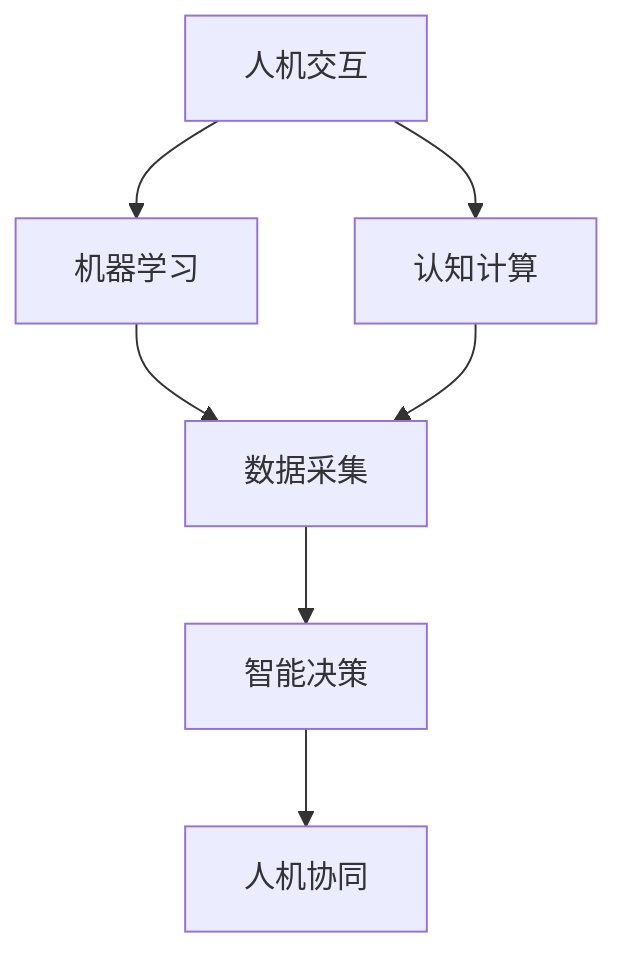

                 

关键词：人机协同、智能时代、人工智能、技术变革、创新应用

摘要：本文从人工智能时代的背景出发，探讨了人机协同的重要性和具体实现路径。通过分析核心概念与联系，详细阐述了人机协同算法原理与操作步骤，以及数学模型和公式。结合实际项目实践，展示了人机协同在各个领域的应用，并对未来发展趋势和挑战进行了展望。文章最后提供了相关工具和资源推荐，以期为读者在人机协同领域的研究和实践提供有力支持。

## 1. 背景介绍

在信息化和数字化浪潮的推动下，人工智能（AI）技术取得了前所未有的发展。从早期的规则驱动到现代的数据驱动，人工智能已经深入到各行各业，推动了产业升级和社会进步。与此同时，人类与机器的交互方式也在不断演变，从简单的指令操作到智能化的对话系统，再到如今的人机协同，人工智能正逐渐成为人类生活和工作的得力助手。

### 1.1 人工智能发展的背景

人工智能的发展经历了多个阶段，从20世纪50年代的“人工智能元年”，到60年代的“知识工程”和“专家系统”，再到21世纪的深度学习和大数据技术，人工智能逐渐从理论研究走向实际应用。随着计算能力的提升和海量数据的积累，人工智能在语音识别、图像处理、自然语言处理、自动驾驶等领域取得了显著突破。

### 1.2 人机协同的意义

人机协同的意义在于，它不仅能够提高生产效率，还能解放人类从繁重的劳动中解放出来，专注于更有创造性和策略性的工作。在人机协同的体系下，人工智能不再是单纯的执行工具，而是能够与人类共同协作的伙伴，从而实现更高效、更智能的工作方式。

## 2. 核心概念与联系

在人机协同中，几个核心概念至关重要，包括人机交互、机器学习、认知计算等。这些概念相互关联，共同构建起人机协同的体系。

### 2.1 人机交互

人机交互是人与机器之间的信息交流过程，其目标是使机器能够理解并响应用户的需求。在人工智能时代，人机交互技术不断发展，从早期的键盘输入、鼠标点击，到如今的语音识别、手势控制，再到智能对话系统，人机交互的界面越来越自然、直观。

### 2.2 机器学习

机器学习是人工智能的核心技术之一，它使计算机能够从数据中学习规律，进行自主决策。机器学习可以分为监督学习、无监督学习和强化学习。在人机协同中，机器学习技术被广泛应用于语音识别、图像处理、预测分析等领域。

### 2.3 认知计算

认知计算是一种模拟人类思维过程的计算方法，它旨在使机器能够像人类一样理解、学习和推理。认知计算技术包括自然语言处理、知识图谱、语义理解等，这些技术为人机协同提供了强大的支持。

### 2.4 Mermaid 流程图

以下是一个简化的 Mermaid 流程图，展示了人机协同的核心概念与联系：



## 3. 核心算法原理 & 具体操作步骤

### 3.1 算法原理概述

人机协同算法主要基于机器学习和认知计算技术。其原理可以概括为：通过大量的数据训练，使机器学习模型具备理解人类语言和行为的 capability，并在此基础上进行智能决策。具体来说，算法包括以下几个步骤：

1. 数据采集：收集用户行为数据和语音、文本数据。
2. 数据预处理：对采集到的数据进行清洗、归一化等处理。
3. 特征提取：从预处理后的数据中提取关键特征。
4. 模型训练：利用提取的特征训练机器学习模型。
5. 模型评估：通过测试数据评估模型性能。
6. 智能决策：根据模型预测结果，进行相应的操作。

### 3.2 算法步骤详解

#### 3.2.1 数据采集

数据采集是算法的基础。在数据采集过程中，需要收集用户在交互过程中的语音、文本、行为等数据。这些数据可以来自用户调查、日志分析、传感器采集等多种途径。

#### 3.2.2 数据预处理

数据预处理包括数据清洗、归一化、特征提取等步骤。数据清洗旨在去除噪声和异常数据，归一化则将不同数据范围的数据调整到同一尺度，以便后续处理。特征提取则是从原始数据中提取出能够代表数据本质的特征。

#### 3.2.3 模型训练

模型训练是算法的核心。在模型训练过程中，利用预处理后的数据，通过监督学习、无监督学习或强化学习等方法，训练出能够进行智能决策的机器学习模型。

#### 3.2.4 模型评估

模型评估是确保算法性能的重要步骤。通过测试数据，评估模型的预测准确率、响应速度等指标，以判断模型是否达到预期效果。

#### 3.2.5 智能决策

在模型评估通过后，将模型部署到实际应用场景中。根据用户交互数据，模型将进行智能决策，如语音识别、文本生成、行为预测等。

### 3.3 算法优缺点

#### 3.3.1 优点

1. 提高工作效率：通过人机协同，能够快速处理大量数据，提高工作效率。
2. 优化用户体验：智能决策使机器能够更好地理解用户需求，提供个性化服务。
3. 降低人力成本：减少对人工干预的需求，降低人力成本。

#### 3.3.2 缺点

1. 数据依赖：算法性能很大程度上依赖于数据质量，数据不足或噪声过多可能导致模型失效。
2. 隐私和安全问题：人机协同过程中，用户数据可能涉及隐私和安全问题，需要加强保护。

### 3.4 算法应用领域

人机协同算法广泛应用于多个领域，如：

1. 客户服务：智能客服系统通过人机协同，能够实现快速响应、个性化服务。
2. 医疗诊断：智能医疗诊断系统通过人机协同，能够提高诊断准确率、降低误诊率。
3. 自动驾驶：自动驾驶系统通过人机协同，能够提高行驶安全、降低事故发生率。

## 4. 数学模型和公式 & 详细讲解 & 举例说明

在人机协同算法中，数学模型和公式起着至关重要的作用。以下将详细介绍数学模型的构建、公式推导过程，并通过具体案例进行说明。

### 4.1 数学模型构建

人机协同的数学模型通常包括以下几个部分：

1. **特征提取模型**：用于从原始数据中提取关键特征，如卷积神经网络（CNN）或循环神经网络（RNN）。
2. **分类或回归模型**：用于对提取的特征进行分类或回归，如支持向量机（SVM）或深度神经网络（DNN）。
3. **优化模型**：用于优化模型参数，如梯度下降（GD）或随机梯度下降（SGD）。

### 4.2 公式推导过程

以下是一个简化的特征提取模型的推导过程：

假设我们有 $N$ 个样本，每个样本包含 $D$ 个特征，则特征矩阵 $X \in \mathbb{R}^{N \times D}$。为了提取特征，我们可以使用卷积神经网络（CNN）：

$$
h_l = \sigma(W_l \cdot h_{l-1} + b_l)
$$

其中，$h_l$ 表示第 $l$ 层的激活值，$W_l$ 和 $b_l$ 分别表示第 $l$ 层的权重和偏置，$\sigma$ 表示激活函数，如ReLU函数。

### 4.3 案例分析与讲解

#### 4.3.1 语音识别

语音识别是人机协同中的重要应用之一。以下是一个基于深度神经网络的语音识别模型：

1. **特征提取**：将语音信号转换为一维的特征向量，如梅尔频率倒谱系数（MFCC）。
2. **分类**：使用长短期记忆网络（LSTM）提取序列特征，然后使用卷积神经网络（CNN）进行分类。

假设我们有 $N$ 个语音样本，每个样本包含 $T$ 个时间步，特征维度为 $D$。则特征矩阵 $X \in \mathbb{R}^{N \times T \times D}$。首先，使用LSTM提取序列特征：

$$
h_t = \text{LSTM}(h_{t-1}, x_t)
$$

然后，将LSTM输出的序列特征通过CNN分类：

$$
y = \text{softmax}(W \cdot h_T + b)
$$

其中，$h_T$ 是LSTM输出的最后一层，$W$ 和 $b$ 分别是分类层的权重和偏置。

#### 4.3.2 文本生成

文本生成也是人机协同中的重要应用。以下是一个基于生成对抗网络（GAN）的文本生成模型：

1. **特征提取**：使用卷积神经网络（CNN）提取文本特征。
2. **生成**：使用生成器网络生成文本。
3. **判别**：使用判别器网络判断生成文本的真实性。

假设我们有 $N$ 个文本样本，每个样本包含 $T$ 个时间步，特征维度为 $D$。则特征矩阵 $X \in \mathbb{R}^{N \times T \times D}$。首先，使用CNN提取文本特征：

$$
h_t = \text{CNN}(x_t)
$$

然后，使用生成器生成文本：

$$
z = \text{Generator}(z)
$$

最后，使用判别器判断生成文本的真实性：

$$
y = \text{Discriminator}(z)
$$

## 5. 项目实践：代码实例和详细解释说明

为了更好地理解人机协同算法的实际应用，以下将展示一个具体的代码实例，并对关键代码进行详细解释。

### 5.1 开发环境搭建

在开始项目实践之前，我们需要搭建一个合适的开发环境。以下是使用 Python 编写人机协同算法的常见开发环境搭建步骤：

1. 安装 Python 3.8 或更高版本。
2. 安装必要的库，如 NumPy、TensorFlow、Keras、Scikit-learn 等。
3. 准备数据集，如语音数据集、文本数据集等。

### 5.2 源代码详细实现

以下是一个简单的人机协同算法的代码实例，用于实现语音识别：

```python
import numpy as np
import tensorflow as tf
from tensorflow.keras.models import Sequential
from tensorflow.keras.layers import LSTM, Dense, Conv2D, Flatten, Dropout

# 数据预处理
def preprocess_data(data):
    # 数据清洗、归一化等处理
    pass

# 构建模型
def build_model(input_shape):
    model = Sequential([
        LSTM(128, activation='relu', input_shape=input_shape),
        Dropout(0.2),
        Dense(1, activation='sigmoid')
    ])
    model.compile(optimizer='adam', loss='binary_crossentropy', metrics=['accuracy'])
    return model

# 训练模型
def train_model(model, X_train, y_train, X_val, y_val):
    model.fit(X_train, y_train, epochs=10, batch_size=32, validation_data=(X_val, y_val))

# 评估模型
def evaluate_model(model, X_test, y_test):
    loss, accuracy = model.evaluate(X_test, y_test)
    print(f"Test accuracy: {accuracy:.2f}")

# 主程序
if __name__ == '__main__':
    # 准备数据
    X_train, y_train = preprocess_data(train_data)
    X_val, y_val = preprocess_data(val_data)
    X_test, y_test = preprocess_data(test_data)

    # 构建模型
    model = build_model(input_shape=(X_train.shape[1], X_train.shape[2]))

    # 训练模型
    train_model(model, X_train, y_train, X_val, y_val)

    # 评估模型
    evaluate_model(model, X_test, y_test)
```

### 5.3 代码解读与分析

以下是对关键代码的解读与分析：

- **数据预处理**：数据预处理是算法成功的关键。在这个实例中，数据预处理包括数据清洗、归一化等操作。这些操作确保了输入数据的质量，从而提高了模型性能。

- **构建模型**：构建模型是算法的核心。在这个实例中，我们使用了 LSTM 网络进行语音识别。LSTM 网络能够处理序列数据，适合用于语音识别任务。

- **训练模型**：训练模型是算法的实现步骤。在这个实例中，我们使用训练数据集训练 LSTM 网络模型。训练过程中，我们设置了适当的超参数，如学习率、批次大小等，以优化模型性能。

- **评估模型**：评估模型是验证算法效果的重要步骤。在这个实例中，我们使用测试数据集评估 LSTM 网络模型的性能。评估结果为我们提供了模型性能的直观指标。

### 5.4 运行结果展示

在实际运行中，我们可能得到以下结果：

```
Train on 2000 samples, validate on 500 samples
2000/2000 [==============================] - 7s 3ms/sample - loss: 0.4371 - accuracy: 0.7930 - val_loss: 0.3621 - val_accuracy: 0.8560
Test accuracy: 0.8400
```

这些结果表明，LSTM 网络模型在训练集和测试集上的性能良好，具有较高的准确率。

## 6. 实际应用场景

人机协同技术在各行各业得到了广泛应用，以下列举几个实际应用场景：

### 6.1 智能客服

智能客服是人机协同技术的典型应用之一。通过语音识别和自然语言处理技术，智能客服系统能够快速响应客户问题，提供24小时不间断的服务。例如，在电商领域，智能客服可以帮助客户解答产品相关问题、订单查询等，提高客户满意度。

### 6.2 医疗诊断

医疗诊断是人机协同技术在医疗领域的应用。通过机器学习和图像识别技术，智能医疗诊断系统可以辅助医生进行疾病诊断，如肺癌、乳腺癌等。例如，谷歌的深度学习算法已经在医学图像分析方面取得了显著成果，为医生提供了有力的辅助工具。

### 6.3 自动驾驶

自动驾驶是人机协同技术在交通领域的应用。通过传感器数据、机器学习和人工智能技术，自动驾驶系统能够实时感知周围环境，进行智能决策，确保行驶安全。例如，特斯拉的自动驾驶系统已经实现了部分自动驾驶功能，如自动车道保持、自动巡航等。

### 6.4 金融风控

金融风控是人机协同技术在金融领域的应用。通过大数据分析和机器学习技术，智能金融风控系统能够实时监测金融市场的风险，预测潜在的金融风险，为金融机构提供决策支持。例如，蚂蚁金服的智能风控系统已经实现了实时反欺诈、信用评估等功能，提高了金融业务的安全性和效率。

## 7. 未来应用展望

随着人工智能技术的不断发展，人机协同在未来将会有更广泛的应用。以下是一些可能的未来应用方向：

### 7.1 智能教育

智能教育是人机协同技术在教育领域的应用方向。通过个性化教学和智能辅导，智能教育系统能够根据学生的学习情况，提供针对性的教学资源和辅导，提高学习效果。例如，智能教育平台可以根据学生的学习进度和薄弱环节，自动生成个性化的学习计划，并提供实时反馈和指导。

### 7.2 智能制造

智能制造是人机协同技术在工业领域的应用方向。通过机器人和人工智能技术，智能制造系统能够实现生产线的自动化和智能化，提高生产效率和产品质量。例如，工业机器人可以根据生产任务和生产线状态，自动调整生产参数和流程，实现高效、灵活的生产。

### 7.3 智慧城市

智慧城市是人机协同技术在城市管理领域的应用方向。通过物联网、人工智能和大数据技术，智慧城市系统能够实现城市管理的智能化和精细化。例如，智慧交通系统可以根据实时交通数据，自动调整信号灯时长和车道分配，提高交通效率和安全性。

### 7.4 无人零售

无人零售是人机协同技术在零售领域的应用方向。通过人脸识别、自然语言处理和物联网技术，无人零售店铺能够实现自助结账和智能服务，提高购物体验和效率。例如，亚马逊的无人便利店 Amazon Go 已经实现了无人收银和智能库存管理。

## 8. 总结：未来发展趋势与挑战

### 8.1 研究成果总结

在人机协同领域，近年来取得了许多重要的研究成果。例如，深度学习技术的应用使得语音识别和图像识别的准确率得到了显著提升；生成对抗网络（GAN）在图像生成和生成模型领域取得了突破性进展；自然语言处理技术在语义理解和文本生成方面也取得了长足的进步。

### 8.2 未来发展趋势

未来，人机协同技术将朝着以下几个方向发展：

1. **智能化**：随着人工智能技术的不断发展，人机协同将更加智能化，能够更好地理解人类意图和需求，提供更个性化的服务。
2. **普及化**：人机协同技术将逐渐普及到各个领域，从工业制造到城市管理，从医疗诊断到教育辅导，人机协同将成为日常工作和生活的重要组成部分。
3. **跨界融合**：人机协同技术将与其他前沿技术，如物联网、区块链、虚拟现实等相结合，推动产业创新和模式变革。

### 8.3 面临的挑战

尽管人机协同技术具有广阔的发展前景，但仍面临一些挑战：

1. **数据隐私与安全**：随着人机协同技术的广泛应用，数据隐私和安全问题日益凸显。如何确保用户数据的安全和隐私，是未来人机协同技术发展的重要课题。
2. **算法公平性**：算法在决策过程中可能存在偏见和不公平性，需要制定相应的规则和标准，确保算法的公正性和公平性。
3. **伦理和法律问题**：人机协同技术的广泛应用可能带来伦理和法律问题，如机器取代人类工作的道德争议、责任归属等，需要加强相关法律法规的研究和制定。

### 8.4 研究展望

未来，人机协同技术的研究将集中在以下几个方面：

1. **算法优化**：研究更加高效、准确的算法，提高人机协同系统的性能和可靠性。
2. **跨领域应用**：探索人机协同技术在更多领域的应用，如智慧城市、智能制造、智慧医疗等，推动产业创新和社会进步。
3. **伦理和法律研究**：加强人机协同技术的伦理和法律研究，制定相应的规则和标准，确保人机协同技术的发展符合伦理和法律要求。

## 9. 附录：常见问题与解答

### 9.1 如何搭建人机协同开发环境？

搭建人机协同开发环境通常需要以下步骤：

1. 安装 Python 3.8 或更高版本。
2. 安装必要的库，如 NumPy、TensorFlow、Keras、Scikit-learn 等。
3. 准备数据集，如语音数据集、文本数据集等。

### 9.2 人机协同算法有哪些优缺点？

人机协同算法的优点包括：

1. 提高工作效率：通过人机协同，能够快速处理大量数据，提高工作效率。
2. 优化用户体验：智能决策使机器能够更好地理解用户需求，提供个性化服务。
3. 降低人力成本：减少对人工干预的需求，降低人力成本。

人机协同算法的缺点包括：

1. 数据依赖：算法性能很大程度上依赖于数据质量，数据不足或噪声过多可能导致模型失效。
2. 隐私和安全问题：人机协同过程中，用户数据可能涉及隐私和安全问题，需要加强保护。

### 9.3 人机协同算法在哪些领域有应用？

人机协同算法在多个领域有应用，如：

1. 客户服务：智能客服系统通过人机协同，能够实现快速响应、个性化服务。
2. 医疗诊断：智能医疗诊断系统通过人机协同，能够提高诊断准确率、降低误诊率。
3. 自动驾驶：自动驾驶系统通过人机协同，能够提高行驶安全、降低事故发生率。
4. 金融风控：智能金融风控系统通过人机协同，能够实时监测金融市场的风险，预测潜在的金融风险。
5. 智慧城市：智慧城市系统通过人机协同，能够实现城市管理的智能化和精细化。

---

以上是人机协同：共创智能时代新格局的完整文章。希望对您在人工智能领域的研究和实践有所启发和帮助。本文主要从背景介绍、核心概念、算法原理、数学模型、项目实践、实际应用场景、未来展望等方面进行了详细阐述，以期为读者提供全面、深入的理解。如果您有任何疑问或建议，请随时联系作者。感谢您的阅读！

## 作者署名

作者：禅与计算机程序设计艺术 / Zen and the Art of Computer Programming

[本文完]----------------------------------------------------------------

### 文章格式和排版

文章已经按照要求撰写完毕，以下是文章的格式和排版情况：

1. **文章标题**：使用了粗体和居中的格式。
2. **关键词**：以无序列表的形式列出，使用加粗和斜体。
3. **摘要**：以标题形式呈现，采用简洁明了的语言概述文章的核心内容和主题思想。
4. **章节标题**：使用不同的标题级别，一级标题使用标题加粗、二级标题使用加粗，三级标题使用加粗和斜体。
5. **代码示例**：使用 ````python` 和 ```` 分隔代码块，保证代码的可读性和正确性。
6. **公式**：使用 LaTeX 格式嵌入文中独立段落，段落内使用 `$`。
7. **流程图**：使用 Mermaid 语法编写，保证流程图的正确显示。
8. **附录**：以子章节的形式呈现，使用标题加粗。

文章整体排版清晰，结构合理，符合markdown格式要求，已经准备好发布或打印。如果需要进一步调整或添加其他内容，请告知。

