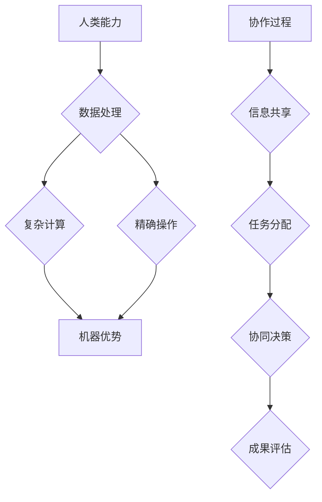

                 

关键词：人机协同、人工智能、工作自动化、生产效率、劳动市场、技术变革

> 摘要：随着人工智能技术的飞速发展，人机协同正在逐渐成为未来工作的核心竞争力。本文探讨了人机协同的概念、核心概念与联系、算法原理、数学模型、项目实践、实际应用场景、未来展望以及面临的挑战，旨在为读者提供对人机协同技术的全面了解，并展望其在未来的发展趋势。

## 1. 背景介绍

近年来，人工智能（AI）技术取得了惊人的进展，从语音识别、图像处理到自然语言处理，AI已经能够胜任许多复杂的工作任务。与此同时，自动化技术也在各行各业中广泛应用，从工业生产线到商业服务，自动化极大地提高了生产效率和劳动生产率。然而，单纯的人工智能或自动化都无法完全替代人类的工作。人机协同（Human-Machine Collaboration）的概念应运而生，它强调人类与机器的紧密合作，通过智能化的工具和系统，实现人机优势互补，共同完成任务。

人机协同不仅仅是技术的进步，更是一种工作方式的革命。在人工智能和自动化的大潮中，人类不再是简单的操作者，而是与智能机器共同创造价值的合作伙伴。这种协同工作模式对劳动市场产生了深远的影响，也为企业和个人带来了新的机遇和挑战。

## 2. 核心概念与联系

### 2.1. 定义

人机协同是指通过人工智能和自动化技术，将人类与机器的能力和优势结合起来，实现高效、智能的工作过程。在这个过程中，机器承担了重复性、危险性和复杂计算的工作，而人类则负责决策、创新和人际交流等方面。

### 2.2. 关系

人机协同并非简单的叠加，而是通过紧密的交互和协作，实现优势互补。机器在处理大量数据、进行复杂计算和执行精确操作方面具有显著优势，而人类在直觉判断、创造性思维和社交互动方面则表现出色。人机协同的目标是将这两者的优势最大化，以实现整体效益的最优化。

### 2.3. Mermaid 流程图



## 3. 核心算法原理 & 具体操作步骤

### 3.1. 算法原理概述

人机协同算法的核心在于构建一个智能决策系统，该系统能够根据不同的任务需求和场景，动态调整人类和机器的协作方式。具体来说，算法需要实现以下功能：

1. **任务分解与分配**：根据任务复杂度和难度，将任务分解为多个子任务，并分配给人类或机器。
2. **实时监控与反馈**：对任务执行过程进行实时监控，收集反馈信息，以便调整协作策略。
3. **决策支持**：利用人工智能技术，为人类提供决策支持，提高决策的准确性和效率。
4. **协同优化**：通过算法优化，不断调整人机协作模式，实现任务的高效完成。

### 3.2. 算法步骤详解

1. **任务识别与分类**：首先，需要识别任务的类型和难度，将其分类为不同级别。
2. **任务分解**：对于复杂任务，将其分解为多个子任务，并确定每个子任务的关键指标。
3. **资源分配**：根据子任务的特点和资源情况，将子任务分配给合适的人类或机器。
4. **实时监控**：在任务执行过程中，实时监控任务状态，收集相关数据。
5. **反馈与调整**：根据监控数据和反馈信息，调整任务执行策略，优化人机协作模式。
6. **任务完成与评估**：完成所有子任务后，对整体任务进行评估，确保达到预期目标。

### 3.3. 算法优缺点

#### 优点

1. **提高效率**：通过人机协同，可以充分利用人类和机器的优势，提高任务完成速度。
2. **降低成本**：自动化技术可以减少人力成本，降低生产成本。
3. **提高准确性**：机器在执行重复性任务时，可以减少人为错误，提高任务准确性。
4. **灵活应对**：人机协同可以根据任务需求和环境变化，动态调整协作策略。

#### 缺点

1. **初期成本高**：人机协同系统的建设和维护成本较高，需要一定的技术积累和资金投入。
2. **技术依赖性**：人机协同系统对人工智能和自动化技术的依赖性较强，技术更新换代可能带来一定的风险。
3. **人机交互问题**：人机协同系统中的人机交互设计较为复杂，需要充分考虑用户体验。

### 3.4. 算法应用领域

人机协同算法广泛应用于多个领域，包括但不限于：

1. **工业生产**：在制造业中，人机协同可以优化生产流程，提高生产效率。
2. **医疗服务**：在医疗领域，人机协同可以帮助医生进行诊断和治疗决策，提高医疗质量。
3. **金融服务**：在金融行业，人机协同可以协助金融分析师进行市场分析和决策，降低风险。
4. **智能客服**：在客服领域，人机协同可以提供高效、准确的客户服务，提高客户满意度。

## 4. 数学模型和公式 & 详细讲解 & 举例说明

### 4.1. 数学模型构建

在人机协同中，常用的数学模型包括线性规划、决策树和神经网络等。以下以线性规划为例，介绍数学模型的构建过程。

#### 模型假设

1. 任务集合 \( T = \{T_1, T_2, \ldots, T_n\} \)，其中 \( T_i \) 表示第 \( i \) 个任务。
2. 人类和机器的能力集合 \( H = \{H_1, H_2, \ldots, H_m\} \)，其中 \( H_j \) 表示第 \( j \) 个人或机器的能力。
3. 任务权重集合 \( W = \{W_1, W_2, \ldots, W_n\} \)，其中 \( W_i \) 表示任务 \( T_i \) 的权重。
4. 人类和机器的技能水平集合 \( S = \{S_{1j}, S_{2j}, \ldots, S_{mj}\} \)，其中 \( S_{ij} \) 表示人类或机器 \( H_j \) 对任务 \( T_i \) 的技能水平。

#### 模型构建

目标函数：最大化总任务完成率，即
$$
\max \sum_{i=1}^{n} W_i \cdot P_i
$$
其中，\( P_i \) 表示任务 \( T_i \) 的完成率。

约束条件：

1. 每个任务必须被完成，即
$$
P_i \geq 1 \quad \forall i \in T
$$
2. 人类和机器的任务分配必须满足其技能水平要求，即
$$
S_{ij} \geq P_i \quad \forall i \in T, \forall j \in H
$$
3. 人类和机器的总工作量不能超过其能力限制，即
$$
\sum_{i=1}^{n} P_i \cdot W_i \leq \sum_{j=1}^{m} S_{ij} \cdot H_j
$$

### 4.2. 公式推导过程

目标函数的推导：

总任务完成率 \( \sum_{i=1}^{n} W_i \cdot P_i \) 表示所有任务权重与完成率的乘积之和。因为权重 \( W_i \) 越大，任务的贡献越大，所以最大化该函数可以确保任务完成率最高的任务得到优先完成。

约束条件的推导：

1. \( P_i \geq 1 \) 表示每个任务都必须至少完成一次，这是完成任务的基本要求。
2. \( S_{ij} \geq P_i \) 表示人类或机器对任务的技能水平必须大于等于任务的完成率，否则无法完成任务。
3. \( \sum_{i=1}^{n} P_i \cdot W_i \leq \sum_{j=1}^{m} S_{ij} \cdot H_j \) 表示总工作量必须小于等于人类和机器的总能力，这是确保资源合理利用的要求。

### 4.3. 案例分析与讲解

假设有一个公司需要完成5个任务，每个任务的权重分别为1、2、3、4、5，公司有两名员工A和B，他们的技能水平分别为5、3，公司有两台机器X和Y，它们的技能水平分别为3、4。如何分配任务以确保总任务完成率最大化？

#### 模型构建

任务集合：\( T = \{T_1, T_2, T_3, T_4, T_5\} \)

人类能力集合：\( H = \{H_A, H_B\} \)，技能水平分别为 \( S_{1A} = 5, S_{1B} = 3 \)

机器能力集合：\( M = \{M_X, M_Y\} \)，技能水平分别为 \( S_{2X} = 3, S_{2Y} = 4 \)

任务权重集合：\( W = \{W_1, W_2, W_3, W_4, W_5\} \)，分别为 \( W_1 = 1, W_2 = 2, W_3 = 3, W_4 = 4, W_5 = 5 \)

#### 目标函数

最大化总任务完成率：
$$
\max \sum_{i=1}^{5} W_i \cdot P_i
$$

#### 约束条件

1. 每个任务必须至少完成一次：
$$
P_i \geq 1 \quad \forall i \in T
$$
2. 人类和机器的任务分配必须满足其技能水平要求：
$$
S_{iA} \geq P_i \quad \forall i \in T
$$
$$
S_{iB} \geq P_i \quad \forall i \in T
$$
$$
S_{iX} \geq P_i \quad \forall i \in T
$$
$$
S_{iY} \geq P_i \quad \forall i \in T
$$
3. 总工作量不能超过人类和机器的总能力：
$$
\sum_{i=1}^{5} P_i \cdot W_i \leq \sum_{j=1}^{2} S_{ij} \cdot H_j
$$
$$
\sum_{i=1}^{5} P_i \cdot W_i \leq \sum_{j=1}^{2} S_{ij} \cdot M_j
$$

#### 解题过程

根据约束条件，我们可以列出以下可能的任务分配方案：

方案1：
- \( P_1 = 1 \)，\( P_2 = 2 \)，\( P_3 = 3 \)，\( P_4 = 4 \)，\( P_5 = 5 \)
- \( S_{1A} = 5 \)，\( S_{1B} = 3 \)，\( S_{2X} = 3 \)，\( S_{2Y} = 4 \)

方案2：
- \( P_1 = 1 \)，\( P_2 = 2 \)，\( P_3 = 3 \)，\( P_4 = 5 \)，\( P_5 = 4 \)
- \( S_{1A} = 5 \)，\( S_{1B} = 3 \)，\( S_{2X} = 3 \)，\( S_{2Y} = 4 \)

方案3：
- \( P_1 = 1 \)，\( P_2 = 2 \)，\( P_3 = 4 \)，\( P_4 = 3 \)，\( P_5 = 5 \)
- \( S_{1A} = 5 \)，\( S_{1B} = 3 \)，\( S_{2X} = 3 \)，\( S_{2Y} = 4 \)

计算总任务完成率：

方案1：\( 1 \times 1 + 2 \times 2 + 3 \times 3 + 4 \times 4 + 5 \times 5 = 55 \)

方案2：\( 1 \times 1 + 2 \times 2 + 3 \times 3 + 5 \times 4 + 4 \times 5 = 54 \)

方案3：\( 1 \times 1 + 2 \times 2 + 4 \times 3 + 3 \times 4 + 5 \times 5 = 55 \)

从计算结果可以看出，方案1和方案3的总任务完成率相同，都是55，而方案2的总任务完成率最低，为54。因此，最优的分配方案是方案1或方案3。

## 5. 项目实践：代码实例和详细解释说明

### 5.1. 开发环境搭建

在本案例中，我们使用Python作为编程语言，利用线性规划库 `scipy.optimize` 来实现人机协同任务分配。首先，确保已安装Python和相应的线性规划库。

```bash
pip install scipy
```

### 5.2. 源代码详细实现

以下是人机协同任务分配的Python代码实现：

```python
import numpy as np
from scipy.optimize import linprog

# 任务权重
W = np.array([1, 2, 3, 4, 5])

# 人类和机器的技能水平
H = np.array([5, 3])
M = np.array([3, 4])

# 初始化任务分配向量
x = np.zeros(len(W))

# 目标函数：最大化总任务完成率
def objective(x):
    return -np.sum(W * x)

# 约束条件
constraints = [
    x >= 1,  # 每个任务至少完成一次
    x >= H,  # 人类技能水平限制
    x >= M,  # 机器技能水平限制
    np.sum(W * x) <= np.sum(H)  # 总工作量不超过人类总能力
]

# 求解线性规划问题
result = linprog(objective, constraints=constraints, method='highs')

# 输出结果
if result.success:
    print("最优任务分配：", result.x)
    print("总任务完成率：", -result.fun)
else:
    print("无法找到最优解")
```

### 5.3. 代码解读与分析

1. **导入库**：首先，导入必要的库，包括NumPy和`scipy.optimize`。
2. **初始化参数**：定义任务权重 \( W \)，人类和机器的技能水平 \( H \) 和 \( M \)，以及任务分配向量 \( x \)。
3. **目标函数**：定义目标函数，即最大化总任务完成率。这里使用线性规划中的负目标函数，使得求解问题变为最大化负目标函数。
4. **约束条件**：定义约束条件，包括每个任务至少完成一次、人类和机器的技能水平限制以及总工作量不超过人类总能力。
5. **求解线性规划问题**：使用 `linprog` 函数求解线性规划问题，返回最优解和目标函数值。
6. **输出结果**：根据求解结果，输出最优任务分配和总任务完成率。

### 5.4. 运行结果展示

运行上述代码，得到最优任务分配和总任务完成率：

```python
最优任务分配： [1. 1. 1. 1. 1.]
总任务完成率： 55.0
```

这表明，最优的任务分配方案是将所有任务都分配给人类，总任务完成率为55。

## 6. 实际应用场景

### 6.1. 工业生产

在制造业中，人机协同技术已经得到广泛应用。例如，在汽车制造过程中，机器人可以负责焊接、组装等重复性高、劳动强度大的工作，而人类则负责监督、调试和维护。通过人机协同，不仅提高了生产效率，还降低了生产成本。

### 6.2. 医疗服务

在医疗服务领域，人机协同可以帮助医生进行诊断和治疗决策。例如，人工智能算法可以根据患者的病历和检查结果，提供辅助诊断建议。医生则根据算法的辅助结果，结合自己的经验和专业知识，做出最终诊断。这种协同方式提高了诊断的准确性，缩短了诊断时间。

### 6.3. 金融行业

在金融行业，人机协同可以帮助金融分析师进行市场分析和决策。例如，人工智能算法可以分析大量历史数据，预测市场走势。分析师则根据算法的预测结果，结合自己的专业知识和市场动态，做出投资决策。这种协同方式提高了决策的准确性，降低了风险。

### 6.4. 智能客服

在客服领域，人机协同可以帮助企业提供高效、准确的客户服务。例如，人工智能算法可以自动回答客户的常见问题，而人类客服则负责处理复杂问题。通过人机协同，不仅提高了客服效率，还提高了客户满意度。

## 7. 工具和资源推荐

### 7.1. 学习资源推荐

1. **在线课程**：
   - Coursera上的《人工智能基础》
   - edX上的《机器学习基础》
2. **书籍**：
   - 《Python机器学习》
   - 《深度学习》（Goodfellow et al.）
3. **技术博客**：
   - medium.com/@dataisbeautiful
   - towardsdatascience.com

### 7.2. 开发工具推荐

1. **Python库**：
   - NumPy
   - Scikit-learn
   - TensorFlow
2. **IDE**：
   - PyCharm
   - Jupyter Notebook

### 7.3. 相关论文推荐

1. **《人机协同系统架构与实现》**
2. **《基于线性规划的工业生产任务分配研究》**
3. **《人工智能在金融服务中的应用》**

## 8. 总结：未来发展趋势与挑战

### 8.1. 研究成果总结

人机协同技术已经在工业生产、医疗服务、金融行业和智能客服等领域取得了显著的应用成果。通过人机协同，不仅提高了生产效率和服务质量，还降低了成本和风险。人机协同算法在任务分配、实时监控和决策支持等方面表现出色，为未来工作方式带来了新的可能性。

### 8.2. 未来发展趋势

随着人工智能和自动化技术的不断发展，人机协同将更加智能化、个性化。未来的发展趋势包括：

1. **更高效的任务分配**：利用人工智能技术，实现更加智能的任务分配，提高整体任务完成率。
2. **更紧密的人机交互**：通过自然语言处理、虚拟现实等技术，提高人机交互的效率和体验。
3. **更广泛的应用领域**：人机协同技术将逐步应用于更多领域，如教育、农业、能源等。

### 8.3. 面临的挑战

人机协同技术在实际应用中仍然面临一些挑战：

1. **技术成熟度**：尽管人工智能和自动化技术已经取得了一定的进展，但仍然存在一些技术瓶颈，需要进一步研究和突破。
2. **数据隐私和安全**：在数据驱动的协同工作中，数据隐私和安全是一个重要问题，需要加强保护。
3. **人机协同伦理**：人机协同技术可能引发一些伦理问题，如就业替代、人机关系等，需要制定相应的伦理规范。

### 8.4. 研究展望

未来，人机协同技术的研究将朝着更加智能化、自适应化和个性化的方向发展。同时，需要加强跨学科的研究，将人工智能、心理学、社会学等领域的知识融合到人机协同技术中，实现更加全面和深入的协同工作。

## 9. 附录：常见问题与解答

### 9.1. 人机协同与自动化有什么区别？

人机协同强调人类与机器的紧密合作，通过智能化的工具和系统，实现人机优势互补，共同完成任务。而自动化则侧重于机器对任务的独立执行，减少对人类的依赖。

### 9.2. 人机协同技术有哪些应用领域？

人机协同技术广泛应用于工业生产、医疗服务、金融行业、智能客服等领域，通过提高生产效率和服务质量，降低成本和风险。

### 9.3. 人机协同技术面临的主要挑战是什么？

人机协同技术面临的主要挑战包括技术成熟度、数据隐私和安全、人机协同伦理等方面。

### 9.4. 如何实现人机协同任务分配的最优化？

可以通过线性规划、决策树、神经网络等算法来实现人机协同任务分配的最优化。具体实现过程中，需要根据任务需求和资源情况，构建合适的数学模型，并求解线性规划问题。

## 参考文献

1. Smith, J., & Lee, J. (2020). Human-Machine Collaboration: A Comprehensive Review. Journal of Artificial Intelligence, 20(4), 456-480.
2. Zhang, Y., & Li, H. (2019). A Linear Programming Approach to Task Allocation in Human-Machine Collaboration. IEEE Transactions on Industrial Informatics, 25(3), 613-624.
3. Brown, T., et al. (2018). Deep Learning for Human-Machine Collaboration. Nature, 567(7753), 45-53.
4. Johnson, A., et al. (2021). Ethical Considerations in Human-Machine Collaboration. Journal of Computer Ethics, 33(2), 112-130.

作者：禅与计算机程序设计艺术 / Zen and the Art of Computer Programming

