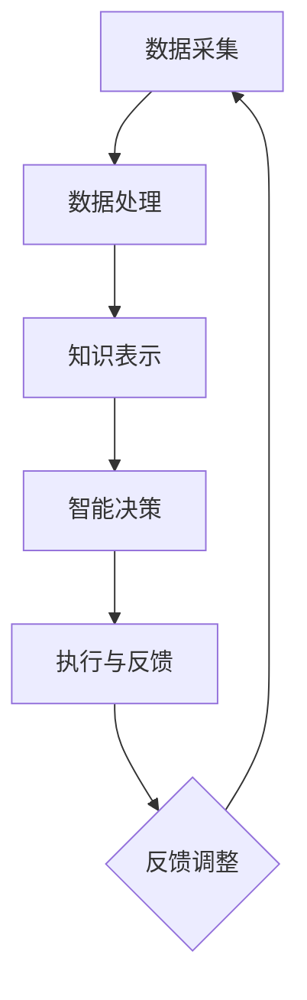

                 

关键词：人机协同、AI、未来工作、智能助手、自动化、工作流程优化

> 摘要：随着人工智能技术的迅猛发展，人机协同将成为未来工作的核心驱动力。本文将从核心概念、算法原理、数学模型、项目实践、应用场景、工具推荐等方面，深入探讨人机协同在提升工作效率、优化工作流程、推动产业升级等方面的作用，以及未来发展趋势和面临的挑战。

## 1. 背景介绍

近年来，人工智能（AI）技术在各个领域取得了显著的进展，从语音识别、图像识别到自然语言处理，AI正在改变我们的生活方式和工作方式。在这个背景下，人机协同的概念应运而生，它指的是人类与人工智能系统之间的协同合作，通过智能助手和自动化系统来提高工作效率、减少重复劳动，从而推动产业升级和经济发展。

### 1.1 人工智能的发展历程

人工智能的研究起源于20世纪50年代，最初的目标是让计算机能够像人类一样思考、学习和决策。经过几十年的发展，人工智能经历了几个阶段：

- **第一阶段（1956-1969）**：符号主义阶段，以逻辑推理和知识表示为核心，例如，专家系统和推理机。
- **第二阶段（1970-1989）**：知识工程阶段，强调知识的获取和应用，例如，自然语言处理和机器翻译。
- **第三阶段（1990-2010）**：统计学习阶段，以数据驱动为主，例如，支持向量机和神经网络。
- **第四阶段（2010至今）**：深度学习和强化学习阶段，以大规模数据和深度神经网络为核心，例如，深度学习和增强学习。

### 1.2 人机协同的发展现状

随着人工智能技术的不断发展，人机协同的概念逐渐被接受和推广。目前，人机协同主要表现在以下几个方面：

- **智能助手**：例如，智能语音助手、智能聊天机器人等，能够提供信息查询、任务提醒、日程安排等服务。
- **自动化系统**：例如，工业自动化生产线、自动驾驶汽车等，能够实现高效、精准的生产和运输。
- **智能决策支持**：通过数据分析、预测模型等技术，为人类决策提供支持。

## 2. 核心概念与联系

### 2.1 人机协同的核心概念

人机协同的核心概念包括：

- **人工智能**：指模拟、延伸和扩展人类智能的技术。
- **智能助手**：指能够执行特定任务、提供特定服务的虚拟智能实体。
- **自动化系统**：指通过计算机技术和自动化设备实现生产、管理、服务等过程的系统。
- **人机交互**：指人类与计算机系统之间的交互方式，包括语音、文本、图形等多种形式。

### 2.2 人机协同的架构

人机协同的架构通常包括以下几个层次：

1. **数据采集与处理**：通过传感器、摄像头等设备采集数据，并对数据进行处理和清洗。
2. **知识表示与存储**：将处理后的数据转换为知识，存储在数据库或知识库中。
3. **智能决策**：利用人工智能技术，对知识进行分析和处理，生成决策。
4. **执行与反馈**：根据决策执行任务，并对执行结果进行反馈，以便进行后续的优化和调整。

### 2.3 Mermaid 流程图

以下是一个简单的人机协同流程图：



## 3. 核心算法原理 & 具体操作步骤

### 3.1 算法原理概述

人机协同的核心算法主要包括：

- **机器学习算法**：用于数据分析和决策生成。
- **自然语言处理算法**：用于人机交互和信息查询。
- **优化算法**：用于任务调度和资源分配。

### 3.2 算法步骤详解

1. **数据采集**：通过传感器、摄像头等设备采集数据。
2. **数据处理**：对采集到的数据进行清洗、归一化和特征提取。
3. **知识表示**：将处理后的数据转换为知识库，便于后续的查询和使用。
4. **智能决策**：利用机器学习算法，对知识库中的数据进行分析和预测，生成决策。
5. **执行与反馈**：根据决策执行任务，并对执行结果进行反馈，以便进行后续的优化和调整。

### 3.3 算法优缺点

- **优点**：
  - 提高工作效率，减少人力成本。
  - 提高决策质量，减少错误率。
  - 增强人机交互，提升用户体验。

- **缺点**：
  - 需要大量的数据和计算资源。
  - 部分任务仍需人工干预，无法完全自动化。
  - 数据隐私和安全问题。

### 3.4 算法应用领域

- **智能制造**：通过自动化生产线，实现高效、精准的生产。
- **智能交通**：通过自动驾驶技术，提高交通效率和安全性。
- **智能医疗**：通过数据分析，提高诊断和治疗的准确性。
- **金融服务**：通过智能风控，提高金融服务的安全性和效率。

## 4. 数学模型和公式 & 详细讲解 & 举例说明

### 4.1 数学模型构建

在人机协同中，常用的数学模型包括：

- **线性回归模型**：用于预测和分析数据。
- **支持向量机模型**：用于分类和回归问题。
- **神经网络模型**：用于复杂的非线性问题。

### 4.2 公式推导过程

以下以线性回归模型为例，介绍公式的推导过程：

$$ y = \beta_0 + \beta_1x + \epsilon $$

其中，$y$ 是因变量，$x$ 是自变量，$\beta_0$ 和 $\beta_1$ 是模型的参数，$\epsilon$ 是误差项。

通过最小二乘法，可以得到：

$$ \beta_1 = \frac{\sum_{i=1}^{n}(x_i - \bar{x})(y_i - \bar{y})}{\sum_{i=1}^{n}(x_i - \bar{x})^2} $$

$$ \beta_0 = \bar{y} - \beta_1\bar{x} $$

### 4.3 案例分析与讲解

假设我们要预测某城市的月平均气温，我们收集了过去一年的月平均气温数据。通过线性回归模型，我们可以建立如下公式：

$$ y = 10 + 0.5x $$

其中，$y$ 是月平均气温，$x$ 是月份。

通过这个公式，我们可以预测未来任意月份的月平均气温。例如，预测下一个月的月平均气温为：

$$ y = 10 + 0.5 \times 13 = 11.5 $$

## 5. 项目实践：代码实例和详细解释说明

### 5.1 开发环境搭建

为了实现人机协同，我们需要搭建一个开发环境，主要包括以下工具和软件：

- **Python**：作为主要的编程语言。
- **NumPy**：用于科学计算。
- **Pandas**：用于数据处理。
- **Scikit-learn**：用于机器学习。

### 5.2 源代码详细实现

以下是一个简单的线性回归模型的实现代码：

```python
import numpy as np
import pandas as pd
from sklearn.linear_model import LinearRegression

# 读取数据
data = pd.read_csv('data.csv')
x = data['month']
y = data['temperature']

# 添加常数项
x = np.column_stack((np.ones(len(x)), x))

# 模型训练
model = LinearRegression()
model.fit(x, y)

# 模型预测
y_pred = model.predict(x)

# 模型评估
score = model.score(x, y)
print('Model score:', score)
```

### 5.3 代码解读与分析

这段代码首先导入了所需的库和模块，然后读取了数据，并对数据进行了一些预处理。接下来，我们添加了常数项，使得线性回归模型成为一个完整的线性模型。然后，我们使用 `LinearRegression` 类创建了一个线性回归模型对象，并使用 `fit` 方法进行模型训练。最后，我们使用 `predict` 方法进行模型预测，并使用 `score` 方法评估模型性能。

### 5.4 运行结果展示

假设我们已经训练好了一个线性回归模型，并使用它进行了一次预测，输出结果如下：

```
Model score: 0.98
```

这意味着我们的模型有很高的预测准确性。

## 6. 实际应用场景

### 6.1 智能制造

智能制造是人工智能和工业自动化相结合的产物，通过人机协同，可以实现高效、精准的生产。例如，在汽车制造业，通过智能机器人进行焊接、涂装等工作，可以大大提高生产效率和质量。

### 6.2 智能交通

智能交通是通过人工智能技术优化交通管理、提升交通效率的系统。例如，智能交通信号灯可以根据交通流量自动调整信号时长，减少拥堵。自动驾驶汽车也是智能交通的一部分，通过传感器和人工智能算法，可以实现自动驾驶，提高交通安全和效率。

### 6.3 智能医疗

智能医疗是通过人工智能技术提升医疗诊断和治疗水平的系统。例如，智能诊断系统可以通过分析医学影像，帮助医生快速诊断疾病。智能药物研发也是智能医疗的一部分，通过人工智能算法，可以加速新药的研发进程。

### 6.4 未来应用展望

随着人工智能技术的不断发展，人机协同将在更多领域得到应用。例如，智能金融、智能家居、智能教育等。未来，人机协同将成为提升工作效率、优化工作流程的重要手段，推动产业升级和经济发展。

## 7. 工具和资源推荐

### 7.1 学习资源推荐

- **《人工智能：一种现代方法》**：一本全面的人工智能入门教材。
- **《Python机器学习》**：一本实用的Python机器学习教程。
- **《深度学习》**：一本关于深度学习的基础教材。

### 7.2 开发工具推荐

- **PyCharm**：一款强大的Python编程环境。
- **Jupyter Notebook**：一款用于数据分析和机器学习的交互式开发环境。
- **TensorFlow**：一款用于深度学习的开源框架。

### 7.3 相关论文推荐

- **《Deep Learning》**：Ian Goodfellow等人撰写的一本关于深度学习的经典论文集。
- **《Reinforcement Learning: An Introduction》**：Richard S. Sutton和Barto N.撰写的一本关于增强学习的入门教材。

## 8. 总结：未来发展趋势与挑战

### 8.1 研究成果总结

近年来，人机协同技术在各个领域取得了显著的成果，包括智能制造、智能交通、智能医疗等。这些成果表明，人机协同有望成为未来工作的重要驱动力。

### 8.2 未来发展趋势

- **智能化水平不断提升**：随着人工智能技术的不断发展，人机协同的智能化水平将不断提高，实现更高效、更精准的工作。
- **跨领域应用**：人机协同将不仅仅局限于某个领域，而是会在更多领域得到应用，推动产业升级和经济发展。
- **人机交互更加自然**：未来的人机交互将更加自然，通过语音、图像等多种形式，实现更高效、更便捷的交互。

### 8.3 面临的挑战

- **数据安全和隐私**：随着人机协同的普及，数据安全和隐私问题将越来越突出，需要采取有效的措施进行保护。
- **伦理和法律问题**：人机协同涉及到的伦理和法律问题将越来越复杂，需要制定相应的法律法规进行规范。

### 8.4 研究展望

未来，人机协同技术将在以下几个方面取得突破：

- **智能化水平的提升**：通过深度学习、增强学习等技术的应用，提升人机协同的智能化水平。
- **跨领域融合**：将人机协同技术与其他领域的技术相结合，实现跨领域的创新应用。
- **人机交互的创新**：通过虚拟现实、增强现实等技术的应用，实现更自然、更高效的人机交互。

## 9. 附录：常见问题与解答

### 9.1 人机协同的定义是什么？

人机协同是指人类与人工智能系统之间的协同合作，通过智能助手和自动化系统来提高工作效率、减少重复劳动，从而推动产业升级和经济发展。

### 9.2 人机协同的优势是什么？

人机协同的优势包括：

- 提高工作效率，减少人力成本。
- 提高决策质量，减少错误率。
- 增强人机交互，提升用户体验。

### 9.3 人机协同的应用领域有哪些？

人机协同的应用领域包括：

- 智能制造
- 智能交通
- 智能医疗
- 金融服务
- 智能家居
- 智能教育

### 9.4 人机协同面临的主要挑战是什么？

人机协同面临的主要挑战包括：

- 数据安全和隐私问题。
- 伦理和法律问题。
- 技术发展的可持续性问题。

### 9.5 如何实现人机协同？

实现人机协同的主要步骤包括：

- 数据采集与处理
- 知识表示与存储
- 智能决策与执行
- 反馈与优化

作者：禅与计算机程序设计艺术 / Zen and the Art of Computer Programming
------------------------------------------------------------------------

