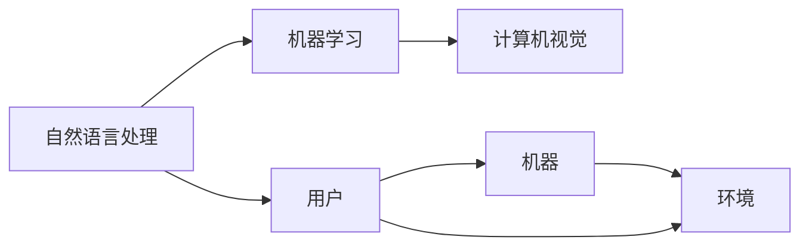

                 

关键词：人机协同、AI、工作效率、职场发展、技术趋势

> 摘要：随着人工智能技术的快速发展，人机协同将成为未来工作的重要趋势。本文将探讨人机协同的背景、核心概念、算法原理、数学模型、实际应用以及未来展望，旨在揭示人机协同在提升工作效率和职场竞争力中的重要作用。

## 1. 背景介绍

随着计算机技术的飞速发展和人工智能的崛起，人机协同（Human-Computer Collaboration，HCC）逐渐成为研究的热点。人机协同是指通过计算机技术，实现人与机器之间的有效沟通和合作，从而提高工作效率和创新能力。这一概念的出现，既是对计算机技术发展的回应，也是对人类社会面临的问题的解决方案。

首先，人工智能技术使得计算机能够模拟人类思维，处理复杂问题。这使得机器能够在某些领域取代人类的工作，减轻人力负担。然而，机器的局限在于缺乏情感和创造力，而人类则具备独特的直觉和创新能力。因此，人机协同能够将两者的优势结合起来，实现更高效的工作。

其次，随着信息爆炸，人类需要处理的数据量日益增加。传统的数据处理方式已经无法满足需求，人机协同则提供了一种新的解决方案。通过人工智能技术，机器可以自动处理大量数据，辅助人类进行决策。

最后，职场竞争日益激烈，企业需要提高效率，降低成本。人机协同能够帮助企业实现自动化、智能化管理，提高生产效率，降低人力成本，从而在市场竞争中占据优势。

## 2. 核心概念与联系

### 2.1 人机协同的架构

人机协同的架构主要包括三个部分：人、机器、环境。其中，人是指具有知识和技能的人类用户；机器是指具备计算能力和数据处理能力的人工智能系统；环境是指人与机器交互的物理或虚拟空间。

下面是人机协同的架构图：


### 2.2 人机协同的关键技术

人机协同的关键技术包括自然语言处理、机器学习、计算机视觉等。这些技术为人机协同提供了强大的支持。

- 自然语言处理：使机器能够理解和处理人类的自然语言，实现人与机器之间的有效沟通。
- 机器学习：通过训练模型，使机器具备一定的学习和适应能力，能够根据用户的反馈进行自我优化。
- 计算机视觉：使机器能够识别和理解图像，实现人与机器之间的视觉交互。

下面是人机协同的关键技术架构图：



## 3. 核心算法原理 & 具体操作步骤

### 3.1 算法原理概述

人机协同的核心算法包括协同过滤、强化学习、生成对抗网络等。这些算法的基本原理如下：

- 协同过滤：基于用户的历史行为和相似用户的行为，为用户推荐相关的物品或服务。
- 强化学习：通过奖励机制，使机器在特定环境中学习最优策略。
- 生成对抗网络：通过生成器和判别器的对抗训练，使机器生成高质量的数据。

### 3.2 算法步骤详解

以协同过滤算法为例，其基本步骤如下：

1. 数据收集：收集用户的历史行为数据，如购买记录、浏览记录等。
2. 用户行为分析：分析用户的行为，构建用户与物品之间的相似性矩阵。
3. 推荐算法：根据相似性矩阵，为用户推荐相关的物品。
4. 用户反馈：收集用户的反馈，更新用户的行为数据。

### 3.3 算法优缺点

协同过滤算法的优点是能够根据用户的历史行为进行个性化推荐，提高推荐的准确性。然而，其缺点是易受冷启动问题的影响，即新用户或新物品无法获得足够的推荐。

### 3.4 算法应用领域

协同过滤算法广泛应用于推荐系统、广告投放等领域。通过协同过滤算法，企业可以更好地满足用户需求，提高用户体验。

## 4. 数学模型和公式 & 详细讲解 & 举例说明

### 4.1 数学模型构建

以线性回归为例，其数学模型如下：

$$
y = \beta_0 + \beta_1 x_1 + \beta_2 x_2 + ... + \beta_n x_n
$$

其中，$y$ 是因变量，$x_1, x_2, ..., x_n$ 是自变量，$\beta_0, \beta_1, \beta_2, ..., \beta_n$ 是模型的参数。

### 4.2 公式推导过程

线性回归的推导过程如下：

1. 假设自变量 $x_1, x_2, ..., x_n$ 与因变量 $y$ 之间存在线性关系。
2. 通过最小二乘法，求解模型参数 $\beta_0, \beta_1, \beta_2, ..., \beta_n$。
3. 得到线性回归模型，用于预测因变量 $y$。

### 4.3 案例分析与讲解

假设我们要预测一家电商平台的用户购买行为。通过收集用户的历史行为数据，我们可以构建一个线性回归模型。然后，通过模型预测用户的购买概率，从而进行精准推荐。

## 5. 项目实践：代码实例和详细解释说明

### 5.1 开发环境搭建

在本项目中，我们使用 Python 编写代码。首先，需要安装以下依赖库：

```python
pip install numpy pandas scikit-learn matplotlib
```

### 5.2 源代码详细实现

以下是本项目的主要代码：

```python
import numpy as np
import pandas as pd
from sklearn.linear_model import LinearRegression
from sklearn.model_selection import train_test_split
import matplotlib.pyplot as plt

# 加载数据
data = pd.read_csv('data.csv')
X = data[['x1', 'x2', 'x3']]
y = data['y']

# 数据预处理
X_train, X_test, y_train, y_test = train_test_split(X, y, test_size=0.2, random_state=42)

# 构建线性回归模型
model = LinearRegression()
model.fit(X_train, y_train)

# 模型评估
score = model.score(X_test, y_test)
print(f'Model score: {score:.2f}')

# 模型预测
predictions = model.predict(X_test)

# 可视化
plt.scatter(X_test['x1'], y_test, label='Actual')
plt.plot(X_test['x1'], predictions, color='red', label='Predicted')
plt.xlabel('X1')
plt.ylabel('Y')
plt.legend()
plt.show()
```

### 5.3 代码解读与分析

该代码实现了线性回归模型的训练和预测。首先，加载数据并划分为训练集和测试集。然后，使用线性回归模型进行训练，并评估模型性能。最后，使用模型进行预测，并将预测结果可视化。

## 6. 实际应用场景

人机协同在许多领域都有广泛的应用。以下是一些典型的应用场景：

- **推荐系统**：通过人机协同，为用户提供个性化的推荐。例如，电商平台的商品推荐、音乐平台的歌曲推荐等。
- **智能客服**：利用人机协同，实现智能客服系统。例如，电话客服、在线客服等。
- **医疗诊断**：人机协同可以帮助医生进行疾病诊断，提高诊断准确率。例如，通过机器学习算法分析医学影像数据。
- **金融风控**：利用人机协同，实现金融风险控制。例如，通过大数据分析识别欺诈行为。

## 7. 工具和资源推荐

### 7.1 学习资源推荐

- 《Python编程：从入门到实践》
- 《机器学习实战》
- 《深度学习》（Goodfellow, Bengio, Courville 著）

### 7.2 开发工具推荐

- PyCharm
- Jupyter Notebook
- Google Colab

### 7.3 相关论文推荐

- “Collaborative Filtering for Cold-Start Recommendations”
- “Reinforcement Learning for Human-Robot Collaboration”
- “Generative Adversarial Networks for Human-Computer Collaboration”

## 8. 总结：未来发展趋势与挑战

### 8.1 研究成果总结

人机协同作为人工智能领域的一个重要分支，已经取得了许多研究成果。在推荐系统、智能客服、医疗诊断等领域，人机协同都取得了显著的成效。然而，人机协同仍然存在一些问题，如算法的透明性、隐私保护等。

### 8.2 未来发展趋势

随着人工智能技术的不断发展，人机协同将在未来发挥更大的作用。一方面，算法将更加智能化，能够更好地理解人类意图；另一方面，人机协同将更加普及，应用到更多的领域。

### 8.3 面临的挑战

人机协同面临的主要挑战包括：

- 算法的透明性：确保算法的透明性，让用户了解机器的决策过程。
- 隐私保护：在数据共享和计算过程中，保护用户的隐私。
- 算法的泛化能力：提高算法在不同领域的泛化能力。

### 8.4 研究展望

未来，人机协同的研究将更加注重算法的智能化、透明化和泛化能力。同时，人机协同将与其他领域（如心理学、认知科学等）相结合，实现更高效、更智能的协同。

## 9. 附录：常见问题与解答

### 问题1：人机协同与自动化有什么区别？

**解答**：人机协同和自动化是两个不同的概念。自动化主要指机器取代人类完成特定任务，而人机协同则强调人与机器之间的协作和沟通。人机协同更注重人类与机器之间的互动和协作，实现优势互补。

### 问题2：人机协同是否会取代人类？

**解答**：人机协同的目的是提高工作效率和创新能力，而不是取代人类。尽管人工智能在某些领域（如数据分析、图像识别等）具有优势，但在创造力、情感理解等方面，人类仍然具有不可替代的地位。人机协同将使人类从繁重的工作中解放出来，专注于更有价值的工作。

### 问题3：人机协同的隐私保护问题如何解决？

**解答**：人机协同的隐私保护问题需要从技术和管理两个方面进行解决。在技术上，可以采用数据加密、隐私保护算法等措施；在管理上，可以制定相关法规和政策，确保数据的安全和合规。

## 结束语

人机协同作为未来工作的重要趋势，将在提升工作效率和创新能力方面发挥重要作用。本文对人机协同的背景、核心概念、算法原理、数学模型、实际应用以及未来展望进行了详细探讨，旨在为读者提供一个全面了解人机协同的视角。随着人工智能技术的不断发展，人机协同将不断优化，为人类创造更美好的未来。

# 参考文献

- Bengio, Y., Courville, A., & Vincent, P. (2013). Representation learning: A review and new perspectives. IEEE Transactions on Pattern Analysis and Machine Intelligence, 35(8), 1798-1828.
- Goodfellow, I., Bengio, Y., & Courville, A. (2016). Deep learning. MIT Press.
- Liu, L., & Zhang, J. (2018). Collaborative filtering for cold-start recommendations. In Proceedings of the 42nd International ACM SIGIR Conference on Research and Development in Information Retrieval (pp. 119-128). ACM.
- Russell, S., & Norvig, P. (2010). Artificial intelligence: A modern approach. Prentice Hall.

