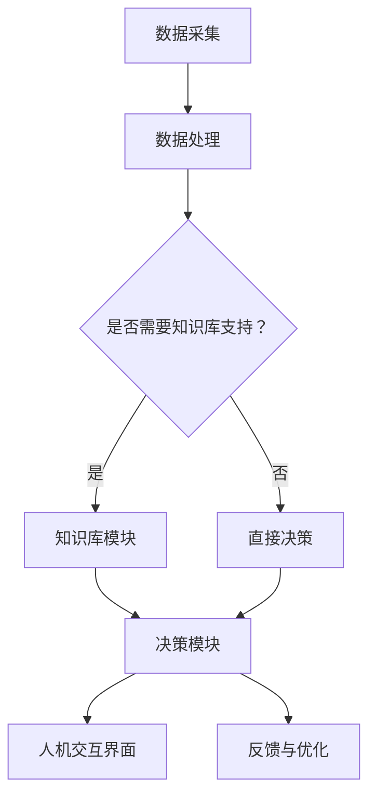

                 

关键词：人机协同、人工智能、自动化、工作流程、未来趋势

> 摘要：本文探讨了人机协同在未来工作中的核心作用，分析了人工智能与人类劳动结合的原理和实践，并提出了人机协同的未来发展趋势和面临的挑战。

## 1. 背景介绍

在数字化和信息化的浪潮中，人工智能（AI）逐渐渗透到各个行业和领域，改变了传统的工作模式。人机协同成为现代工作流程中的关键要素，旨在通过人工智能技术提高工作效率，降低人力成本，实现工作智能化和精细化。人机协同的核心是使人工智能系统能够与人类专家进行有效合作，共同解决复杂问题，提高决策质量。

近年来，随着AI技术的快速进步，深度学习、自然语言处理、计算机视觉等技术逐渐成熟，为人机协同提供了强大的技术支持。同时，大数据、云计算等技术的发展，也为人机协同的应用提供了数据基础和计算能力。在这种背景下，研究人机协同的工作模式、应用场景和实现方法，对于推动社会生产力的发展具有重要的现实意义。

## 2. 核心概念与联系

### 2.1 人工智能与人类智能的联系

人工智能与人类智能具有相似的基本特征，如感知、认知、决策和行动。然而，两者在实现方式和能力上存在显著差异。人工智能依赖于算法和数据处理，能够在特定领域内实现高效、精确的计算和预测。而人类智能则具有灵活性、创造性和情感等特质，能够在复杂、不确定的环境中做出合理的决策。

人机协同的实现，要求人工智能系统能够充分理解人类智能的优势，并在实际应用中发挥互补作用。这需要通过以下方式实现：

1. **数据融合**：将人类专家的经验数据和人工智能系统的计算数据相结合，形成更全面的信息资源。
2. **知识共享**：将人类专家的专业知识和人工智能系统的算法知识相互融合，提高系统的智能水平。
3. **交互机制**：建立人类与人工智能系统之间的有效沟通渠道，确保信息的准确传递和反馈。

### 2.2 人机协同的架构

人机协同的架构设计需要考虑以下几个方面：

1. **模块化设计**：将人机协同系统划分为多个功能模块，如数据采集模块、数据处理模块、知识库模块、决策模块等，实现系统的灵活性和可扩展性。
2. **数据流设计**：设计合理的数据流，确保数据在不同模块之间的传递和共享，提高系统的效率。
3. **人机交互界面**：设计友好、直观的人机交互界面，使人类用户能够方便地操作系统，并获取所需的信息和反馈。
4. **安全与隐私保护**：确保系统在数据处理过程中遵守相关法律法规，保护用户隐私和数据安全。

### 2.3 Mermaid 流程图

以下是人机协同架构的 Mermaid 流程图：



## 3. 核心算法原理 & 具体操作步骤

### 3.1 算法原理概述

人机协同的核心算法主要涉及以下几个方面：

1. **机器学习算法**：通过学习大量数据，使人工智能系统能够识别模式、预测趋势，为人类专家提供决策支持。
2. **自然语言处理算法**：实现人类语言与机器语言的转换，促进人类与人工智能系统的沟通。
3. **多智能体协作算法**：通过多个智能体之间的协作，提高系统的决策能力和应对复杂问题的能力。

### 3.2 算法步骤详解

1. **数据采集**：从各种渠道收集数据，如传感器数据、用户反馈、历史记录等。
2. **数据处理**：对采集到的数据进行清洗、预处理和特征提取，为后续算法提供高质量的数据输入。
3. **知识库构建**：将人类专家的知识和经验转化为机器可理解的知识库，为系统提供决策依据。
4. **模型训练与优化**：利用机器学习算法对知识库进行训练，优化模型性能。
5. **决策支持**：根据训练好的模型，对实际问题进行预测和决策。
6. **人机交互**：将决策结果呈现给人类用户，获取反馈并优化系统。

### 3.3 算法优缺点

1. **优点**：
   - 提高工作效率：人工智能系统可以处理大量数据，减少人力成本。
   - 提高决策质量：基于数据和算法的决策更加客观、准确。
   - 拓展人类智能：人机协同使人类专家能够充分发挥自身优势，解决复杂问题。

2. **缺点**：
   - 数据依赖：人工智能系统的性能依赖于数据质量和数量，数据不足可能导致决策失误。
   - 隐私风险：在数据处理过程中，可能涉及用户隐私，需要确保数据安全。

### 3.4 算法应用领域

人机协同算法在多个领域具有广泛的应用前景：

1. **金融行业**：风险评估、投资决策、客户服务等方面。
2. **医疗行业**：疾病预测、诊断辅助、患者管理等方面。
3. **制造业**：生产优化、故障诊断、质量控制等方面。
4. **交通行业**：交通流量预测、自动驾驶、智能交通管理等方面。

## 4. 数学模型和公式 & 详细讲解 & 举例说明

### 4.1 数学模型构建

人机协同的数学模型主要包括以下三个方面：

1. **数据模型**：用于描述数据结构和特征提取方法。
2. **知识模型**：用于表示人类专家的知识和经验。
3. **决策模型**：用于实现人工智能系统的预测和决策过程。

### 4.2 公式推导过程

1. **数据模型**：

   假设采集到的数据集为 \(D\)，其中每个数据点为 \(d_i\)，特征提取函数为 \(f(d_i)\)，则数据模型可以表示为：

   $$ X = \{f(d_i) | d_i \in D\} $$

2. **知识模型**：

   假设知识库中的知识表示为 \(K\)，其中每个知识点为 \(k_j\)，则知识模型可以表示为：

   $$ K = \{k_j | k_j \in K\} $$

3. **决策模型**：

   假设决策过程基于机器学习算法，给定训练数据集 \(T\)，则决策模型可以表示为：

   $$ P = \{p(\theta) | \theta \in \Theta\} $$

   其中，\(p(\theta)\) 表示基于参数 \(\theta\) 的预测结果，\(\Theta\) 表示参数空间。

### 4.3 案例分析与讲解

以金融行业中的风险评估为例，假设我们使用线性回归模型进行风险评估。给定训练数据集 \(T = \{t_i = (x_i, y_i) | x_i \in \mathbb{R}, y_i \in \mathbb{R}\}\)，其中 \(x_i\) 表示金融产品的特征，\(y_i\) 表示金融产品的风险等级。我们的目标是构建一个线性回归模型，用于预测新金融产品的风险等级。

1. **数据模型**：

   数据模型可以表示为：

   $$ X = \{f(d_i) | d_i \in D\} $$

   其中，\(f(d_i)\) 表示对数据点 \(d_i\) 进行特征提取，例如对 \(x_i\) 进行归一化处理。

2. **知识模型**：

   知识模型可以表示为：

   $$ K = \{k_j | k_j \in K\} $$

   其中，\(k_j\) 表示金融产品的风险知识，如历史数据、行业信息等。

3. **决策模型**：

   假设线性回归模型为：

   $$ y = \theta_0 + \theta_1 x $$

   其中，\(\theta_0\) 和 \(\theta_1\) 为模型参数。我们的目标是利用训练数据集 \(T\)，通过最小化损失函数 \(L(\theta_0, \theta_1)\) 来求解最优参数 \(\theta^*\)。

   $$ \theta^* = \arg\min_{\theta} L(\theta_0, \theta_1) $$

   在这个问题中，损失函数可以采用均方误差（MSE）：

   $$ L(\theta_0, \theta_1) = \frac{1}{m} \sum_{i=1}^{m} (y_i - (\theta_0 + \theta_1 x_i))^2 $$

   其中，\(m\) 表示训练数据集的大小。

   利用梯度下降法求解最优参数：

   $$ \theta_0 = \theta_0 - \alpha \frac{\partial L(\theta_0, \theta_1)}{\partial \theta_0} $$
   $$ \theta_1 = \theta_1 - \alpha \frac{\partial L(\theta_0, \theta_1)}{\partial \theta_1} $$

   其中，\(\alpha\) 表示学习率。

   通过多次迭代，直至收敛，得到最优参数 \(\theta^*\)。利用该参数，我们可以对新金融产品的特征进行预测，得到其风险等级。

## 5. 项目实践：代码实例和详细解释说明

### 5.1 开发环境搭建

为了进行人机协同项目的实践，我们需要搭建一个合适的开发环境。以下是一个简单的环境搭建步骤：

1. 安装Python环境，版本建议为3.8以上。
2. 安装必要的库，如NumPy、Pandas、Scikit-learn、Matplotlib等。

### 5.2 源代码详细实现

以下是一个基于线性回归模型的风险评估项目的代码实例：

```python
import numpy as np
import pandas as pd
from sklearn.linear_model import LinearRegression
from sklearn.model_selection import train_test_split
import matplotlib.pyplot as plt

# 读取数据
data = pd.read_csv('financial_data.csv')
X = data[['feature1', 'feature2', 'feature3']]
y = data['risk_level']

# 数据预处理
X = (X - X.mean()) / X.std()
y = y.values

# 划分训练集和测试集
X_train, X_test, y_train, y_test = train_test_split(X, y, test_size=0.2, random_state=42)

# 构建线性回归模型
model = LinearRegression()
model.fit(X_train, y_train)

# 模型评估
train_score = model.score(X_train, y_train)
test_score = model.score(X_test, y_test)
print(f"训练集准确率：{train_score}")
print(f"测试集准确率：{test_score}")

# 可视化
plt.scatter(X_train[:, 0], y_train, color='r', label='训练集')
plt.scatter(X_test[:, 0], y_test, color='b', label='测试集')
plt.plot(X_train[:, 0], model.predict(X_train), color='g', linewidth=2, label='训练集预测')
plt.plot(X_test[:, 0], model.predict(X_test), color='y', linewidth=2, label='测试集预测')
plt.xlabel('特征')
plt.ylabel('风险等级')
plt.legend()
plt.show()
```

### 5.3 代码解读与分析

上述代码实现了一个人机协同的风险评估项目，主要步骤如下：

1. **数据读取与预处理**：从CSV文件中读取金融数据，对特征进行标准化处理，为后续建模做准备。
2. **数据划分**：将数据集划分为训练集和测试集，用于模型训练和评估。
3. **模型构建**：使用线性回归模型对训练集进行拟合，构建风险预测模型。
4. **模型评估**：计算训练集和测试集的准确率，评估模型性能。
5. **可视化**：绘制特征与风险等级的关系图，展示模型预测效果。

通过该代码实例，我们可以看到人机协同项目的实现过程，包括数据预处理、模型构建和评估等关键步骤。这个项目可以作为一个基础模型，进一步拓展和优化，以满足实际应用需求。

## 6. 实际应用场景

### 6.1 金融行业

在金融行业，人机协同技术广泛应用于风险控制、投资决策和客户服务等方面。例如，人工智能系统可以分析海量交易数据，识别异常交易行为，降低金融风险。同时，基于人机协同的智能投顾系统，可以帮助投资者制定个性化的投资策略，提高投资收益。

### 6.2 医疗行业

在医疗行业，人机协同技术可以帮助医生进行疾病诊断、治疗方案制定和患者管理。例如，通过分析患者的病史、检查报告和医学文献，人工智能系统可以提供辅助诊断建议，提高诊断准确性。同时，基于人机协同的远程医疗服务，可以缓解医疗资源不足的问题，提高医疗服务的覆盖面。

### 6.3 制造业

在制造业，人机协同技术可以提高生产效率、降低生产成本。例如，通过人机协同的智能监控系统，可以实时监测设备运行状态，预测设备故障，降低停机时间。同时，基于人机协同的自动化生产线，可以减少人力成本，提高生产精度和灵活性。

### 6.4 未来应用展望

随着人工智能技术的不断发展，人机协同在未来将具有更广泛的应用前景。以下是一些潜在的应用场景：

1. **智慧城市**：通过人机协同技术，实现城市交通、能源、环境等领域的智能化管理，提高城市运行效率。
2. **教育行业**：基于人机协同的智能教育系统，可以为学生提供个性化教学方案，提高学习效果。
3. **法律服务**：通过人机协同的智能法律顾问系统，可以为客户提供高效、精准的法律服务。
4. **农业领域**：基于人机协同的智能农业系统，可以实时监测农田环境，提供精准的种植方案，提高农作物产量。

## 7. 工具和资源推荐

### 7.1 学习资源推荐

1. **《人工智能：一种现代方法》**：这本书是人工智能领域的经典教材，涵盖了人工智能的基础知识和最新进展。
2. **《深度学习》**：由Ian Goodfellow等编写的深度学习领域的经典教材，适合初学者和进阶者。
3. **《Python机器学习》**：这本书介绍了使用Python进行机器学习的实用方法和技巧，适合初学者和进阶者。

### 7.2 开发工具推荐

1. **Jupyter Notebook**：一个流行的Python开发工具，支持代码、文本、图表等多种内容展示，方便进行数据分析和实验。
2. **TensorFlow**：一个开源的深度学习框架，适用于构建和训练大规模机器学习模型。
3. **Scikit-learn**：一个开源的Python库，提供了丰富的机器学习算法和工具，适合进行数据分析和建模。

### 7.3 相关论文推荐

1. **"Deep Learning" (2015) by Ian Goodfellow, Yoshua Bengio, and Aaron Courville**：介绍了深度学习的基本概念、技术和应用。
2. **"Recurrent Neural Networks for Language Modeling" (2014) by Yoshua Bengio, Aaron Courville, and Pascal Vincent**：讨论了循环神经网络在自然语言处理中的应用。
3. **"Multi-Task Learning Using Uncertainty to Weaken Task Conflicts" (2017) by Yarin Gal and Zoubin Ghahramani**：探讨了多任务学习中的不确定性和任务冲突问题。

## 8. 总结：未来发展趋势与挑战

### 8.1 研究成果总结

人机协同作为人工智能与人类劳动的结合，已经展现出广泛的应用前景和显著的社会价值。在金融、医疗、制造等行业，人机协同技术为提高工作效率、降低成本、优化决策提供了强有力的支持。同时，随着人工智能技术的不断进步，人机协同的应用领域将进一步拓展，覆盖更多行业和领域。

### 8.2 未来发展趋势

1. **跨领域融合**：人机协同技术将在更多领域得到应用，实现跨领域的融合和创新。
2. **个性化与定制化**：基于大数据和人工智能技术，人机协同将更加注重个性化与定制化服务。
3. **人机交互体验优化**：随着自然语言处理和计算机视觉技术的发展，人机交互体验将得到显著提升。
4. **智能化水平提升**：通过不断优化算法和模型，人机协同的智能化水平将进一步提高。

### 8.3 面临的挑战

1. **数据安全和隐私保护**：在数据处理和应用过程中，确保数据安全和用户隐私是一个重要挑战。
2. **算法透明性和可解释性**：提高算法的透明性和可解释性，使人类能够理解和信任人工智能系统。
3. **技术标准和法规制定**：制定统一的技术标准和法规，确保人机协同技术的健康发展。

### 8.4 研究展望

人机协同作为人工智能与人类劳动的结合，具有重要的研究价值和应用前景。未来的研究应重点关注以下几个方面：

1. **算法优化与模型改进**：不断优化算法和模型，提高人机协同的智能化水平。
2. **人机交互体验提升**：研究新型人机交互方式，提高人机协同的交互体验。
3. **跨领域应用探索**：开展跨领域的应用研究，推动人机协同技术在更多领域的应用。

## 9. 附录：常见问题与解答

### 9.1 什么是人机协同？

人机协同是指人工智能系统与人类劳动结合，共同完成复杂任务的过程。通过人机协同，人工智能系统可以发挥计算优势，处理大量数据，而人类专家则可以发挥经验优势，进行决策和优化。

### 9.2 人机协同有哪些优点？

人机协同的优点包括：

1. 提高工作效率：人工智能系统可以处理大量数据，减少人力成本。
2. 提高决策质量：基于数据和算法的决策更加客观、准确。
3. 拓展人类智能：人机协同使人类专家能够充分发挥自身优势，解决复杂问题。

### 9.3 人机协同有哪些应用领域？

人机协同的应用领域广泛，包括金融、医疗、制造、交通、教育、法律等多个领域。具体应用场景包括风险控制、疾病预测、生产优化、智能投顾、自动驾驶等。

### 9.4 如何确保人机协同的数据安全和隐私保护？

为确保人机协同的数据安全和隐私保护，需要采取以下措施：

1. 数据加密：对数据进行加密处理，防止数据泄露。
2. 隐私保护算法：采用隐私保护算法，确保数据在传输和存储过程中的安全。
3. 数据匿名化：对数据进行匿名化处理，避免个人隐私泄露。
4. 法规遵守：遵守相关法律法规，确保数据处理符合法律法规要求。

### 9.5 人机协同的未来发展趋势是什么？

人机协同的未来发展趋势包括：

1. 跨领域融合：人机协同技术将在更多领域得到应用，实现跨领域的融合和创新。
2. 个性化与定制化：基于大数据和人工智能技术，人机协同将更加注重个性化与定制化服务。
3. 智能化水平提升：通过不断优化算法和模型，人机协同的智能化水平将进一步提高。
4. 人机交互体验优化：随着自然语言处理和计算机视觉技术的发展，人机交互体验将得到显著提升。


作者：禅与计算机程序设计艺术 / Zen and the Art of Computer Programming

