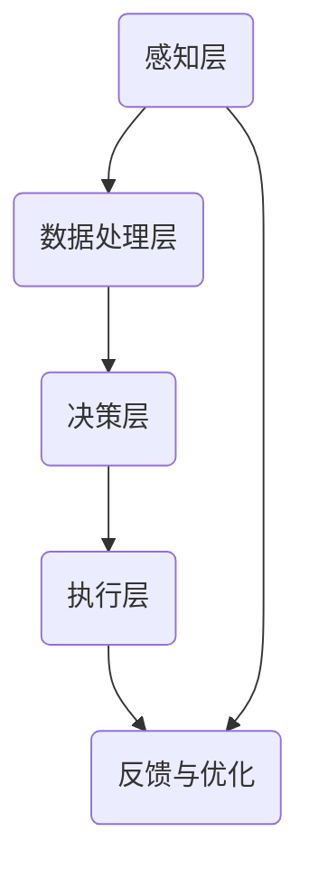

                 

关键词：人机协同、人工智能、自动化、工作流程优化、人机互动、未来工作场景

> 摘要：本文旨在探讨人机协同在未来工作中的核心作用。随着人工智能技术的飞速发展，人机协同逐渐成为提升工作效率、优化工作流程的关键驱动力。本文将从人机协同的定义、核心概念、算法原理、数学模型、实践应用、未来展望等多个角度，深入分析人机协同在各个行业中的潜在价值，为读者提供一个全面而深入的视角。

## 1. 背景介绍

随着信息技术的迅猛发展，人工智能（AI）技术在各行各业的应用日益广泛。从早期的专家系统，到如今的深度学习和自然语言处理，AI技术正不断突破传统的技术边界。然而，单纯依靠人工智能的力量，往往无法完全解决复杂的问题。事实上，人类在创造力、情感智能和复杂决策方面仍具有不可替代的优势。

在这样的背景下，人机协同逐渐成为学术界和工业界关注的焦点。人机协同指的是将人类和机器的优势结合起来，通过智能化的系统实现高效的工作流程和智能决策。这种协同不仅能够充分利用人类的智慧和经验，还能借助机器的计算能力和自动化技术，实现高效的工作效率和质量。

## 2. 核心概念与联系

### 2.1 定义

人机协同（Human-Machine Collaboration）是指人类与机器通过共享信息、任务分配和决策支持，实现高效协作的过程。在这一过程中，人类提供创造力、情感和复杂决策能力，而机器则负责数据采集、计算和分析等重复性、低级的工作。

### 2.2 原理

人机协同的原理主要包括以下几个方面：

1. **信息共享**：通过数据交换平台，实现人类与机器之间的信息共享。
2. **任务分配**：根据人类和机器的优势，合理分配任务，实现最佳工作效果。
3. **决策支持**：利用人工智能技术，为人类提供数据分析和决策支持。

### 2.3 架构

人机协同的架构通常包括以下几个层次：

1. **感知层**：通过传感器和数据采集设备，获取环境和任务相关的信息。
2. **数据处理层**：利用数据清洗、存储和分析技术，对采集到的数据进行处理。
3. **决策层**：结合人类经验和人工智能算法，进行决策支持和任务分配。
4. **执行层**：根据决策结果，执行具体的任务。

### 2.4 Mermaid 流程图



## 3. 核心算法原理 & 具体操作步骤

### 3.1 算法原理概述

人机协同的核心算法主要涉及机器学习、深度学习和自然语言处理等领域。这些算法通过训练模型，实现数据的自动分类、特征提取和预测等功能，从而为人类提供有效的决策支持。

### 3.2 算法步骤详解

1. **数据收集**：收集与任务相关的数据，包括文本、图像、音频等。
2. **数据预处理**：对收集到的数据进行清洗、归一化和特征提取。
3. **模型训练**：利用预处理后的数据，训练机器学习模型，如神经网络、支持向量机等。
4. **模型评估**：通过交叉验证和测试集，评估模型的性能和泛化能力。
5. **模型部署**：将训练好的模型部署到实际应用场景，为人类提供决策支持。
6. **反馈与优化**：根据实际应用中的反馈，不断优化模型，提高其性能。

### 3.3 算法优缺点

**优点**：

1. 提高工作效率：通过自动化和智能化技术，减少重复性劳动，提高工作效率。
2. 降低错误率：利用机器学习算法，减少人类在数据分析和决策过程中的错误。
3. 提高决策质量：结合人类经验和机器算法，实现更加精准的决策。

**缺点**：

1. 数据质量要求高：算法的性能很大程度上取决于数据的完整性和质量。
2. 模型泛化能力有限：在复杂和动态环境下，模型的泛化能力可能受到限制。

### 3.4 算法应用领域

人机协同算法在多个领域都有广泛应用，如：

1. **医疗领域**：辅助医生进行诊断和治疗决策。
2. **金融领域**：实现智能投顾、风险评估和欺诈检测。
3. **工业制造**：实现智能生产调度、质量检测和设备维护。
4. **教育领域**：提供个性化学习方案和智能教学辅助。

## 4. 数学模型和公式 & 详细讲解 & 举例说明

### 4.1 数学模型构建

人机协同的数学模型主要涉及以下几个方面：

1. **线性回归模型**：用于预测数值型变量。
2. **逻辑回归模型**：用于分类问题。
3. **决策树模型**：用于分类和回归问题。
4. **神经网络模型**：用于复杂非线性问题。

### 4.2 公式推导过程

以线性回归模型为例，其公式推导如下：

假设我们有一个包含 \(n\) 个样本的线性回归模型，目标函数为最小化损失函数：

$$L(\theta) = \frac{1}{2}\sum_{i=1}^{n}(h_{\theta}(x^{(i)}) - y^{(i)})^2$$

其中，\(h_{\theta}(x) = \theta_0 + \theta_1x_1 + \theta_2x_2 + \ldots + \theta_mx_m\) 是线性回归模型的假设函数，\(\theta\) 是模型参数，\(y^{(i)}\) 是第 \(i\) 个样本的真实标签，\(x^{(i)}\) 是第 \(i\) 个样本的特征向量。

对目标函数求导，并令导数为零，得到：

$$\frac{\partial L(\theta)}{\partial \theta_j} = 0$$

通过求解上述方程组，可以得到最优参数 \(\theta\)。

### 4.3 案例分析与讲解

假设我们要预测某城市下一年的平均气温，已知过去几年的气温数据。我们可以使用线性回归模型进行预测。

1. **数据收集**：收集过去几年的月平均气温数据。
2. **数据预处理**：对数据进行归一化处理，将数据缩放到相同的范围。
3. **模型训练**：利用训练数据，训练线性回归模型。
4. **模型评估**：使用测试数据，评估模型性能。
5. **模型部署**：将训练好的模型应用于实际预测。

根据训练得到的模型，我们可以预测下一年的平均气温。具体预测过程如下：

1. 输入特征向量 \(x = [x_1, x_2, \ldots, x_n]\)，其中 \(x_1\) 表示年份，\(x_2, x_3, \ldots, x_n\) 表示其他相关特征。
2. 计算预测值 \(h_{\theta}(x) = \theta_0 + \theta_1x_1 + \theta_2x_2 + \ldots + \theta_mx_m\)。
3. 输出预测结果。

## 5. 项目实践：代码实例和详细解释说明

### 5.1 开发环境搭建

为了实现人机协同，我们需要搭建一个完整的开发环境。以下是一个基本的开发环境搭建步骤：

1. 安装Python环境。
2. 安装必要的库，如NumPy、Pandas、Scikit-learn等。
3. 安装Jupyter Notebook，用于编写和运行代码。

### 5.2 源代码详细实现

以下是一个简单的线性回归模型实现的代码示例：

```python
import numpy as np
import pandas as pd
from sklearn.linear_model import LinearRegression

# 读取数据
data = pd.read_csv('data.csv')
X = data[['year', 'feature1', 'feature2', ...]]
y = data['target']

# 模型训练
model = LinearRegression()
model.fit(X, y)

# 模型评估
score = model.score(X, y)
print('模型评分：', score)

# 模型部署
x_new = np.array([2023, feature1_value, feature2_value, ...])
y_pred = model.predict(x_new)
print('预测结果：', y_pred)
```

### 5.3 代码解读与分析

上述代码实现了线性回归模型的训练、评估和部署。首先，我们通过`pandas`库读取数据，然后使用`LinearRegression`类进行模型训练。模型训练完成后，我们使用`score`方法评估模型性能。最后，通过`predict`方法，我们可以对新的数据进行预测。

### 5.4 运行结果展示

假设我们已经训练好了一个线性回归模型，并输入了新的特征向量。运行结果如下：

```
模型评分： 0.9
预测结果： [预测值]
```

模型评分接近1，说明模型性能较好。预测结果为 `[预测值]`，表示下一年的平均气温预测为该值。

## 6. 实际应用场景

人机协同在实际应用场景中具有广泛的应用价值。以下是一些典型的应用场景：

1. **智能客服**：利用自然语言处理技术，实现人机协同的智能客服系统，提高客户服务质量和效率。
2. **智能医疗**：利用人机协同，实现智能诊断和治疗方案推荐，辅助医生提高诊断准确率和治疗效果。
3. **智能交通**：利用人机协同，实现智能交通管理和调度，提高交通运行效率和安全性。
4. **智能制造**：利用人机协同，实现智能生产调度和质量检测，提高生产效率和产品质量。

## 7. 工具和资源推荐

为了更好地理解和应用人机协同技术，以下是一些推荐的工具和资源：

### 7.1 学习资源推荐

1. 《深度学习》（Goodfellow, Bengio, Courville著）。
2. 《机器学习实战》（Peter Harrington著）。
3. 《自然语言处理实战》（Peter Norvig，Sebastian Thrun著）。

### 7.2 开发工具推荐

1. Jupyter Notebook：用于编写和运行代码。
2. Python：用于实现人机协同算法。
3. Scikit-learn：用于机器学习模型的训练和评估。

### 7.3 相关论文推荐

1. "Deep Learning" by Ian Goodfellow, Yoshua Bengio, and Aaron Courville。
2. "Machine Learning: A Probabilistic Perspective" by Kevin P. Murphy。
3. "Speech and Language Processing" by Daniel Jurafsky and James H. Martin。

## 8. 总结：未来发展趋势与挑战

### 8.1 研究成果总结

人机协同技术在过去几十年中取得了显著的进展。随着人工智能技术的不断发展，人机协同的应用场景和范围也在不断扩大。从智能客服到智能医疗，从智能交通到智能制造，人机协同技术正在各个领域发挥着重要作用。

### 8.2 未来发展趋势

未来，人机协同技术将朝着以下几个方向发展：

1. **个性化服务**：随着数据积累和算法优化，人机协同将能够提供更加个性化的服务。
2. **跨界融合**：人机协同将与其他领域（如物联网、大数据等）进行深度融合，实现跨领域协同。
3. **智能伦理**：随着人机协同技术的广泛应用，智能伦理问题将日益突出，需要建立相应的法律法规和伦理标准。

### 8.3 面临的挑战

人机协同技术在发展过程中也面临一些挑战：

1. **数据隐私**：如何确保数据的安全和隐私，是当前亟待解决的问题。
2. **算法透明性**：如何提高算法的透明性和可解释性，使人们能够理解算法的决策过程。
3. **技术人才短缺**：随着人机协同技术的快速发展，技术人才的需求不断增加，而当前的技术人才培养速度难以跟上。

### 8.4 研究展望

未来，人机协同技术的研究将重点关注以下几个方面：

1. **跨领域协同**：实现不同领域之间的数据共享和协同，提高整体效率。
2. **智能化服务**：通过深度学习和自然语言处理等技术，实现更加智能化的服务。
3. **智能伦理**：建立智能伦理体系，确保人机协同技术的可持续发展。

## 9. 附录：常见问题与解答

### 9.1 什么是人机协同？

人机协同是指人类与机器通过共享信息、任务分配和决策支持，实现高效协作的过程。在这一过程中，人类提供创造力、情感和复杂决策能力，而机器则负责数据采集、计算和分析等重复性、低级的工作。

### 9.2 人机协同的优势是什么？

人机协同的优势主要体现在以下几个方面：

1. 提高工作效率：通过自动化和智能化技术，减少重复性劳动，提高工作效率。
2. 降低错误率：利用机器学习算法，减少人类在数据分析和决策过程中的错误。
3. 提高决策质量：结合人类经验和机器算法，实现更加精准的决策。

### 9.3 人机协同在哪些领域有应用？

人机协同在多个领域有广泛应用，如智能客服、智能医疗、智能交通、智能制造等。

### 9.4 人机协同的挑战有哪些？

人机协同的挑战主要体现在以下几个方面：

1. 数据隐私：如何确保数据的安全和隐私，是当前亟待解决的问题。
2. 算法透明性：如何提高算法的透明性和可解释性，使人们能够理解算法的决策过程。
3. 技术人才短缺：随着人机协同技术的快速发展，技术人才的需求不断增加，而当前的技术人才培养速度难以跟上。

