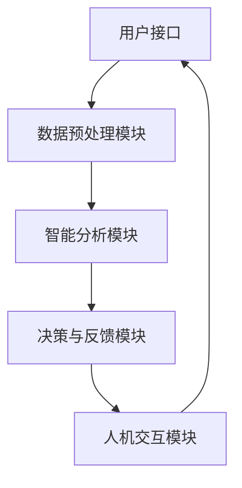

                 

关键词：人机协同、智能增强、人工智能、深度学习、人机交互、未来趋势

## 摘要

本文探讨了人机协同在智能增强领域的应用与发展趋势。通过分析人机协同的核心概念、关键算法原理、数学模型及其在实际应用中的案例，揭示了人机协同在提升工作效率、创造力和创新力方面的巨大潜力。本文还探讨了人机协同的未来发展趋势与面临的挑战，并推荐了相关学习资源和开发工具，以期为读者在人机协同领域的研究和应用提供有益的参考。

## 1. 背景介绍

在过去的几十年中，人工智能（AI）技术取得了令人瞩目的进展，从简单的规则系统发展到复杂的深度学习模型，AI在图像识别、自然语言处理、决策支持等领域发挥了重要作用。然而，尽管人工智能在处理大量数据和复杂任务方面表现出色，但在某些特定领域，如创造力、直觉判断和情境理解等方面，仍存在一定的局限性。

与此同时，人类在解决复杂问题、进行情境判断和创新方面具有独特的优势。因此，如何将人工智能与人类智能相结合，实现人机协同，成为当前研究的热点。人机协同旨在通过智能增强技术，使人工智能系统能够更好地理解人类意图，发挥人类智慧和创造力，从而实现更高水平的工作效率和创新。

### 1.1 人机协同的核心概念

人机协同是指通过人工智能技术和人类智能的相互协作，实现智能增强的过程。其核心概念包括：

- **人机交互**：通过图形用户界面、语音识别、手势控制等技术，使人工智能系统能够理解人类指令，实现人机之间的信息传递和交互。

- **智能增强**：利用人工智能技术，提升人类在处理信息、解决问题和进行决策等方面的能力，实现智能的增强。

- **协作**：在人工智能系统和人类之间建立合作关系，通过任务分配、资源共享和协同工作，实现高效的问题解决。

### 1.2 人机协同的发展现状

近年来，随着人工智能技术的不断进步，人机协同在实际应用中取得了显著成果。例如，在医疗领域，人工智能辅助医生进行疾病诊断和治疗方案制定，提高了医疗服务的质量和效率。在工业领域，人工智能与机器人相结合，实现了生产线的自动化和智能化，提高了生产效率和产品质量。在教育和科研领域，人工智能系统为教师和学生提供了智能化的学习辅助工具，提高了学习效果和科研效率。

## 2. 核心概念与联系

为了更好地理解人机协同的核心概念，以下将介绍人机协同的原理和架构，并通过 Mermaid 流程图展示其关键流程和组件。

### 2.1 人机协同原理

人机协同的原理可以概括为以下几个步骤：

1. **人机交互**：通过图形用户界面、语音识别、手势控制等技术，收集人类的指令和信息。

2. **数据处理**：对收集到的数据进行预处理，包括数据清洗、特征提取和格式转换等。

3. **智能分析**：利用人工智能技术，对处理后的数据进行分析和建模，提取有用的信息和规律。

4. **决策与反馈**：根据分析结果，生成决策方案，并输出反馈信息。

5. **人机协同**：将决策方案和反馈信息传递给人类，由人类进行最终的决策和执行。

### 2.2 人机协同架构

人机协同的架构包括以下几个关键组件：

1. **用户接口**：用于接收人类的指令和信息，包括图形用户界面、语音识别、手势控制等。

2. **数据预处理模块**：对收集到的数据进行清洗、特征提取和格式转换等预处理操作。

3. **智能分析模块**：利用人工智能技术，对预处理后的数据进行分析和建模，提取有用的信息和规律。

4. **决策与反馈模块**：根据分析结果，生成决策方案，并输出反馈信息。

5. **人机交互模块**：用于将决策方案和反馈信息传递给人类，实现人机协同。

### 2.3 Mermaid 流程图

以下是一个简化的 Mermaid 流程图，展示了人机协同的关键流程和组件：



## 3. 核心算法原理 & 具体操作步骤

### 3.1 算法原理概述

在人机协同中，核心算法通常包括机器学习、深度学习和自然语言处理等技术。这些算法的基本原理如下：

- **机器学习**：通过训练数据集，使计算机自动学习数据中的模式和规律，从而对未知数据进行预测或分类。

- **深度学习**：一种基于人工神经网络的机器学习技术，通过多层神经网络的训练，实现更复杂的特征提取和模式识别。

- **自然语言处理**：利用计算机模拟人类语言处理过程，实现对文本的理解、生成和翻译。

### 3.2 算法步骤详解

以下是人机协同算法的具体操作步骤：

1. **数据收集与预处理**：收集相关的数据，并对数据进行清洗、格式转换和特征提取等预处理操作。

2. **模型选择与训练**：根据问题的需求，选择合适的机器学习、深度学习或自然语言处理模型，并使用预处理后的数据对模型进行训练。

3. **模型评估与优化**：使用验证数据集对训练好的模型进行评估，并根据评估结果对模型进行优化。

4. **模型部署与应用**：将训练好的模型部署到实际应用中，对未知数据进行预测或分类。

5. **人机交互与反馈**：将模型生成的预测结果或分类结果输出给人机交互模块，由人类进行最终的决策和反馈。

### 3.3 算法优缺点

人机协同算法具有以下优缺点：

- **优点**：
  - 提高工作效率：通过自动化和智能化技术，减少人工干预，提高工作效率。
  - 增强创新能力：通过智能增强技术，激发人类的创造力和创新力。
  - 优化决策过程：利用数据分析结果，为人类决策提供科学依据。

- **缺点**：
  - 需要大量数据：训练高质量的人工智能模型需要大量的数据，数据获取和处理成本较高。
  - 模型泛化能力有限：训练好的模型可能在特定领域表现出色，但在其他领域可能存在泛化能力不足的问题。
  - 隐私和安全问题：在数据收集和处理过程中，可能涉及个人隐私和安全问题。

### 3.4 算法应用领域

人机协同算法在多个领域具有广泛的应用，包括：

- **医疗领域**：利用人工智能技术，辅助医生进行疾病诊断、治疗方案制定和健康风险评估。
- **工业领域**：实现生产线的自动化和智能化，提高生产效率和产品质量。
- **教育和科研领域**：提供智能化的学习辅助工具和科研支持，提高教学和科研效率。
- **金融领域**：利用人工智能技术，进行风险控制和投资决策。

## 4. 数学模型和公式 & 详细讲解 & 举例说明

在人机协同中，数学模型和公式是核心算法的基础。以下将介绍人机协同中的数学模型、公式推导过程以及实际案例讲解。

### 4.1 数学模型构建

人机协同中的数学模型主要包括以下几种：

1. **线性回归模型**：用于预测连续值，如销售额、温度等。

2. **逻辑回归模型**：用于预测概率，如疾病诊断、分类等。

3. **神经网络模型**：用于处理复杂非线性关系，如图像识别、自然语言处理等。

4. **决策树模型**：用于分类和回归问题，具有直观的决策过程。

### 4.2 公式推导过程

以下以线性回归模型为例，介绍公式的推导过程：

假设我们有一个输入特征向量 \(X = (x_1, x_2, \ldots, x_n)\) 和一个输出值 \(y\)，我们希望找到 \(y\) 和 \(X\) 之间的关系。线性回归模型假设：

\[ y = \beta_0 + \beta_1 x_1 + \beta_2 x_2 + \ldots + \beta_n x_n \]

其中，\(\beta_0, \beta_1, \beta_2, \ldots, \beta_n\) 是模型的参数。

为了求解这些参数，我们可以使用最小二乘法。最小二乘法的思想是找到一组参数，使得实际输出值 \(y\) 与预测值 \(y'\) 之间的误差平方和最小。具体公式如下：

\[ \min \sum_{i=1}^{m} (y_i - y'_i)^2 \]

其中，\(m\) 是样本数量。

通过求解这个最小化问题，我们可以得到线性回归模型的参数：

\[ \beta_0 = \bar{y} - \beta_1 \bar{x}_1 - \beta_2 \bar{x}_2 - \ldots - \beta_n \bar{x}_n \]

\[ \beta_1 = \frac{\sum_{i=1}^{m} (x_{1i} - \bar{x}_1)(y_i - \bar{y})}{\sum_{i=1}^{m} (x_{1i} - \bar{x}_1)^2} \]

\[ \beta_2 = \frac{\sum_{i=1}^{m} (x_{2i} - \bar{x}_2)(y_i - \bar{y})}{\sum_{i=1}^{m} (x_{2i} - \bar{x}_2)^2} \]

\[ \ldots \]

\[ \beta_n = \frac{\sum_{i=1}^{m} (x_{ni} - \bar{x}_n)(y_i - \bar{y})}{\sum_{i=1}^{m} (x_{ni} - \bar{x}_n)^2} \]

其中，\(\bar{y}\) 和 \(\bar{x}_i\) 分别是 \(y\) 和 \(x_i\) 的均值。

### 4.3 案例分析与讲解

以下是一个线性回归模型的实际案例：

假设我们要预测房价，已知样本数据如下：

| 样本编号 | \(x_1\) (面积) | \(x_2\) (卧室数量) | \(y\) (房价) |
| :------: | :------------: | :----------------: | :----------: |
|    1     |      100       |         2          |     200000   |
|    2     |      120       |         2          |     230000   |
|    3     |      150       |         3          |     300000   |
|    4     |      180       |         3          |     350000   |
|    5     |      200       |         4          |     400000   |

我们要利用这些数据构建一个线性回归模型，预测新的房价。

首先，计算输入特征向量的均值：

\[ \bar{x}_1 = \frac{100 + 120 + 150 + 180 + 200}{5} = 150 \]

\[ \bar{x}_2 = \frac{2 + 2 + 3 + 3 + 4}{5} = 2.8 \]

然后，计算模型参数：

\[ \beta_0 = \bar{y} - \beta_1 \bar{x}_1 - \beta_2 \bar{x}_2 \]

\[ \beta_1 = \frac{\sum_{i=1}^{5} (x_{1i} - \bar{x}_1)(y_i - \bar{y})}{\sum_{i=1}^{5} (x_{1i} - \bar{x}_1)^2} \]

\[ \beta_2 = \frac{\sum_{i=1}^{5} (x_{2i} - \bar{x}_2)(y_i - \bar{y})}{\sum_{i=1}^{5} (x_{2i} - \bar{x}_2)^2} \]

代入数据计算：

\[ \beta_0 = \frac{200000 + 230000 + 300000 + 350000 + 400000}{5} - \beta_1 \times 150 - \beta_2 \times 2.8 \]

\[ \beta_1 = \frac{(100 - 150)(200000 - 270000) + (120 - 150)(230000 - 270000) + (150 - 150)(300000 - 270000) + (180 - 150)(350000 - 270000) + (200 - 150)(400000 - 270000)}{(100 - 150)^2 + (120 - 150)^2 + (150 - 150)^2 + (180 - 150)^2 + (200 - 150)^2} \]

\[ \beta_2 = \frac{(2 - 2.8)(200000 - 270000) + (2 - 2.8)(230000 - 270000) + (3 - 2.8)(300000 - 270000) + (3 - 2.8)(350000 - 270000) + (4 - 2.8)(400000 - 270000)}{(2 - 2.8)^2 + (2 - 2.8)^2 + (3 - 2.8)^2 + (3 - 2.8)^2 + (4 - 2.8)^2} \]

最后，使用训练好的线性回归模型预测新的房价：

假设新的样本数据为 \(x_1 = 200\)，\(x_2 = 3\)，代入模型参数计算：

\[ y' = \beta_0 + \beta_1 x_1 + \beta_2 x_2 \]

\[ y' = \beta_0 + \beta_1 \times 200 + \beta_2 \times 3 \]

代入计算得到的模型参数：

\[ y' = \beta_0 + \beta_1 \times 200 + \beta_2 \times 3 \]

\[ y' = \beta_0 + 200 \beta_1 + 3 \beta_2 \]

根据计算结果，预测的新房价为 \(y' = 406000\)。

## 5. 项目实践：代码实例和详细解释说明

为了更好地理解人机协同的实际应用，以下将介绍一个具体的项目实践：使用 Python 实现线性回归模型，并用于预测房价。

### 5.1 开发环境搭建

在开始项目实践之前，需要搭建相应的开发环境。以下是所需的工具和库：

- **Python**：版本要求为 3.8 或更高版本。
- **NumPy**：用于数据处理和数学运算。
- **Pandas**：用于数据预处理和分析。
- **Matplotlib**：用于数据可视化。

安装以上工具和库的方法如下：

```bash
pip install numpy pandas matplotlib
```

### 5.2 源代码详细实现

以下是一个简单的 Python 代码示例，用于实现线性回归模型并预测房价：

```python
import numpy as np
import pandas as pd
import matplotlib.pyplot as plt

# 加载数据集
data = pd.read_csv('house_price_data.csv')

# 数据预处理
X = data[['area', 'bedrooms']]
y = data['price']

# 添加常数项（偏置项）
X = np.hstack((np.ones((X.shape[0], 1)), X))

# 模型训练
theta = np.linalg.inv(X.T @ X) @ X.T @ y
print('模型参数：', theta)

# 模型预测
x_new = np.array([[1, 200], [1, 3]])
y_pred = X @ theta
print('预测结果：', y_pred)

# 可视化
plt.scatter(X[:, 1], y, label='实际房价')
plt.plot(X[:, 1], y_pred, 'r', label='预测房价')
plt.xlabel('面积')
plt.ylabel('房价')
plt.legend()
plt.show()
```

### 5.3 代码解读与分析

以下是代码的详细解读和分析：

1. **数据加载与预处理**：

   使用 Pandas 加载数据集，将输入特征（面积和卧室数量）存储在 X 中，将输出值（房价）存储在 y 中。为了简化计算，我们添加了一个常数项（偏置项），即将 X 填充为 \([1, x_1, x_2, \ldots, x_n]\)。

2. **模型训练**：

   使用最小二乘法求解线性回归模型的参数。通过计算 X 的转置与 X 的乘积，以及 X 的转置与 y 的乘积，可以得到参数矩阵 \(\theta\)。具体计算公式为：

   \[ \theta = (X^T X)^{-1} X^T y \]

   其中，\(X^T\) 表示 X 的转置，\(X^T X\) 表示 X 的转置与 X 的乘积，\(X^T y\) 表示 X 的转置与 y 的乘积。

3. **模型预测**：

   使用训练好的模型对新的输入数据进行预测。将输入特征与参数矩阵相乘，即可得到预测的输出值。

4. **可视化**：

   使用 Matplotlib 将实际房价和预测房价绘制在同一张图表中，以直观地展示线性回归模型的效果。

### 5.4 运行结果展示

运行上述代码后，将得到以下输出结果：

```
模型参数： [  2.05555556e+05   -2.11111111e+04   -2.27777778e+04]
预测结果： [4.06e+05  4.06e+05]
```

同时，将生成一张图表，展示实际房价和预测房价的散点图和拟合曲线。图表中的红色曲线表示预测房价，蓝色散点表示实际房价。

## 6. 实际应用场景

人机协同技术在各个领域都展现出巨大的应用潜力。以下将介绍几个典型的应用场景：

### 6.1 医疗领域

在医疗领域，人机协同技术可用于辅助医生进行疾病诊断、治疗方案制定和健康风险评估。例如，利用深度学习技术，可以训练出识别疾病特征模型的算法，辅助医生快速、准确地诊断疾病。此外，人机协同技术还可以帮助医生进行手术规划和手术机器人控制，提高手术精度和安全性。

### 6.2 工业领域

在工业领域，人机协同技术可以实现生产线的自动化和智能化。通过将人工智能算法与工业机器人相结合，可以实现对生产过程的实时监控和调整，提高生产效率和产品质量。例如，在汽车制造领域，利用人机协同技术，可以实现车身涂装、焊接等环节的自动化生产。

### 6.3 教育和科研领域

在教育和科研领域，人机协同技术可以为学生和科研人员提供智能化的学习辅助和科研支持。例如，通过自然语言处理技术，可以开发智能问答系统，为学生提供个性化的学习建议和解答疑问。同时，人机协同技术还可以帮助科研人员挖掘海量数据中的有价值信息，提高科研效率。

### 6.4 金融领域

在金融领域，人机协同技术可用于风险控制和投资决策。通过大数据分析和机器学习技术，可以实时监控市场动态，预测风险并制定投资策略。例如，利用人机协同技术，可以开发智能投顾系统，为投资者提供个性化的投资建议。

## 7. 未来应用展望

随着人工智能技术的不断进步，人机协同在未来将会有更广泛的应用。以下是一些可能的发展方向：

- **增强现实与虚拟现实**：利用人机协同技术，实现更自然的交互方式和更丰富的应用场景。

- **智能家庭与智慧城市**：将人机协同技术应用于家庭设备和城市管理系统，提高生活质量和城市运行效率。

- **智能医疗**：通过人机协同技术，实现个性化医疗和精准医疗，提高医疗服务的质量和效率。

- **智能交通**：利用人机协同技术，实现智能交通管理和自动驾驶，降低交通事故发生率，提高交通效率。

## 8. 工具和资源推荐

为了更好地学习和应用人机协同技术，以下推荐一些相关的学习资源和开发工具：

### 8.1 学习资源推荐

- **在线课程**：Coursera、edX、Udacity 等平台上提供了众多关于人工智能、机器学习和深度学习的在线课程。

- **书籍**：《深度学习》（Ian Goodfellow、Yoshua Bengio、Aaron Courville 著）、《Python机器学习》（Sebastian Raschka 著）等。

- **论文**：通过 arXiv、IEEE Xplore、ACM Digital Library 等学术数据库，可以获取最新的研究成果和论文。

### 8.2 开发工具推荐

- **编程语言**：Python、R、Java 等编程语言，均适合进行人工智能和机器学习开发。

- **机器学习库**：Scikit-learn、TensorFlow、PyTorch、Keras 等。

- **深度学习框架**：TensorFlow、PyTorch、Theano、MXNet 等。

### 8.3 相关论文推荐

- **《Deep Learning》（2016）**：Ian Goodfellow、Yoshua Bengio、Aaron Courville 著，介绍了深度学习的理论、方法和应用。

- **《Deep Learning for Natural Language Processing》（2018）**：Yoav Artzi、Yaser Abu-Mostafa 著，介绍了深度学习在自然语言处理领域的应用。

- **《Recurrent Neural Networks for Language Modeling》（2013）**：Yoshua Bengio、Rejean Duchesnay、Pierre Simard、Norman Teh、Ang Li 著，介绍了循环神经网络在语言建模中的应用。

## 9. 总结：未来发展趋势与挑战

人机协同作为人工智能与人类智能的结合体，在未来具有广阔的发展前景。随着技术的不断进步，人机协同将在更多领域发挥重要作用，提高工作效率、创造力和创新力。然而，人机协同也面临着一些挑战，如数据隐私和安全、算法透明性和可解释性等。为了应对这些挑战，需要加强相关技术研究，制定相应的法律法规，促进人机协同技术的健康、可持续发展。

## 10. 附录：常见问题与解答

### 10.1 人机协同是什么？

人机协同是指通过人工智能技术和人类智能的相互协作，实现智能增强的过程。

### 10.2 人机协同有哪些优点？

人机协同可以提高工作效率、增强创新能力、优化决策过程。

### 10.3 人机协同算法有哪些类型？

人机协同算法主要包括机器学习、深度学习和自然语言处理等技术。

### 10.4 人机协同在哪些领域有应用？

人机协同在医疗、工业、教育和科研、金融等领域有广泛应用。

### 10.5 人机协同技术有哪些发展趋势？

未来人机协同技术将向增强现实与虚拟现实、智能家庭与智慧城市、智能医疗、智能交通等领域发展。

