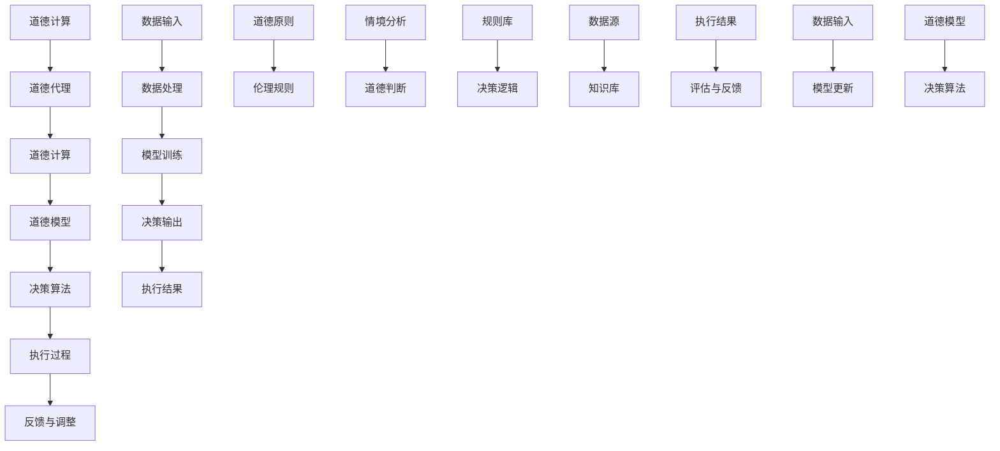

                 

 > 在这个充满变革的时代，人工智能（AI）正以前所未有的速度和深度影响着人类社会的各个方面。从医疗诊断到自动驾驶，从自然语言处理到图像识别，AI技术正在改变我们工作、学习和生活的每一个细节。然而，随着AI系统的广泛应用，一个不容忽视的问题也随之而来：如何确保这些系统在复杂的伦理和社会情境中能够做出符合道德规范的决策？本文将探讨在AI时代如何增强道德代理，使人工智能系统能够在计算中融入道德考量。

> 关键词：人工智能，道德代理，计算伦理，AI决策，道德计算，道德模型

> 摘要：本文首先介绍了人工智能技术的发展及其对社会的影响，接着深入探讨了道德代理的概念和重要性。通过分析当前AI伦理面临的挑战，本文提出了增强道德代理的几种方法，并详细介绍了相关的算法原理、数学模型和具体实现。最后，本文展望了未来AI伦理研究的发展趋势和面临的挑战，提出了相关的研究方向和解决方案。

## 1. 背景介绍

人工智能（Artificial Intelligence，AI）作为计算机科学的一个重要分支，旨在通过模拟、延伸和扩展人类的智能，实现计算机对复杂任务的自动处理。随着计算能力的飞速提升和大数据技术的普及，AI在近年来取得了显著的发展，尤其是在深度学习、自然语言处理和计算机视觉等领域。

AI的发展不仅推动了科技领域的进步，也对社会产生了深远的影响。一方面，AI技术提高了生产效率，降低了人力成本，推动了自动化和智能化转型。另一方面，AI在医疗、金融、交通等领域的应用，极大地改善了人们的生活质量，为人类带来了诸多便利。

然而，随着AI技术的广泛应用，伦理问题也日益突出。AI系统的决策过程往往涉及复杂的算法和大量的数据，这使得其决策过程具有不确定性和不可解释性。如何确保AI系统能够在复杂的伦理和社会情境中做出符合道德规范的决策，成为了一个亟待解决的问题。

### 1.1 AI技术发展的历史背景

AI技术的发展历程可以追溯到20世纪50年代。1956年，达特茅斯会议的召开标志着AI学科的正式诞生。自那时以来，AI技术经历了多次起伏和革新。早期的AI研究主要集中在符号主义方法，通过构建基于规则的知识系统来模拟人类智能。然而，这种方法在处理复杂问题时效率低下，难以应对实际问题。

随着计算能力的提升和大数据技术的兴起，20世纪80年代以来，AI领域迎来了新的发展机遇。特别是深度学习的兴起，使得AI在图像识别、语音识别和自然语言处理等领域取得了突破性的进展。深度学习通过神经网络模型模拟人脑神经元之间的连接和交互，能够自动从大量数据中学习特征和模式，从而实现高效的任务处理。

### 1.2 AI技术对社会的影响

AI技术的快速发展对社会产生了深远的影响。首先，在生产力方面，AI技术通过自动化和智能化提高了生产效率，降低了人力成本。例如，智能制造、智能交通和智慧农业等领域的应用，极大地提升了生产效率和资源利用率。

其次，在生活质量方面，AI技术为人类带来了诸多便利。在医疗领域，AI技术可以辅助医生进行疾病诊断和治疗方案制定，提高了医疗服务的质量和效率。在金融领域，AI技术可以用于风险管理、信用评估和智能投顾，为投资者提供更精准的投资建议。

此外，AI技术在教育、娱乐、法律和公共服务等领域也具有广泛的应用前景。例如，智能教育系统可以根据学生的学习进度和特点，提供个性化的教学方案，提高学习效果。智能客服系统可以实时响应用户的需求，提供高效、精准的咨询服务。

### 1.3 AI伦理问题的重要性

随着AI技术的广泛应用，伦理问题也逐渐凸显。首先，AI系统在决策过程中可能涉及伦理道德问题。例如，自动驾驶汽车在紧急情况下如何做出道德决策？AI在医疗诊断中如何处理病人的隐私和权益？这些问题都需要在设计和应用AI技术时予以充分考虑。

其次，AI技术的透明性和可解释性也引起了广泛关注。当前许多AI系统采用的是黑箱模型，其决策过程难以解释和理解，这可能导致决策的不公正性和不可预测性。例如，某些招聘系统可能会因为算法偏见而歧视某些人群，这需要通过透明性和可解释性的技术来予以解决。

此外，AI技术的滥用和隐私问题也是伦理关注的重点。AI技术具有强大的数据处理和分析能力，但这也带来了隐私泄露的风险。如何在保障用户隐私的同时，充分发挥AI技术的潜力，是当前AI伦理研究的重要课题。

总之，AI技术的发展不仅带来了技术上的变革，也引发了社会、伦理和道德上的挑战。如何确保AI技术在复杂的社会情境中能够做出符合道德规范的决策，是一个亟待解决的重要问题。本文将探讨如何在计算过程中增强道德代理，为解决AI伦理问题提供一种新的思路。

### 2. 核心概念与联系

在探讨如何增强道德代理之前，我们需要先了解几个核心概念，包括道德代理、道德计算和道德模型。

#### 2.1 道德代理

道德代理（Moral Agent）是指在决策过程中能够自觉遵循道德规范，并能够承担道德责任的人工智能系统。道德代理不仅要求在技术层面上实现智能决策，还需要在伦理层面上具备道德考量。例如，一个道德代理的自动驾驶系统在遇到紧急情况时，不仅要考虑如何安全地处理问题，还需要考虑如何最小化对人类和其他生物的伤害。

#### 2.2 道德计算

道德计算（Moral Computing）是指将道德规范和伦理原则融入计算过程，使计算机系统能够在执行任务时考虑道德因素。道德计算的核心目标是通过算法和模型，使计算机能够在复杂的社会情境中做出符合道德规范的决策。

#### 2.3 道德模型

道德模型（Moral Model）是道德计算的基础，它通常包含一套规则和准则，用于指导计算机在特定情境下如何做出道德决策。道德模型可以是基于规则的，也可以是基于概率的、基于博弈的或基于机器学习的。不同类型的道德模型适用于不同的应用场景，但它们的共同目标都是确保计算机系统能够在执行任务时遵循道德原则。

#### 2.4 核心概念原理和架构

为了更好地理解道德代理、道德计算和道德模型之间的关系，我们使用Mermaid流程图来展示它们的核心概念原理和架构。



在这个流程图中，道德代理通过道德计算将道德模型应用于具体的决策算法，并在执行过程中不断接收反馈，进行动态调整。数据输入和处理环节确保了模型能够从多源数据中获取信息，而道德原则和伦理规则则为决策提供了道德指导。

#### 2.5 道德代理在计算中的重要性

道德代理在计算中的重要性体现在以下几个方面：

1. **确保公正性**：道德代理能够在复杂的计算过程中确保决策的公正性和公平性，避免因算法偏见而导致的不公正结果。
2. **增强透明性**：通过道德代理，计算过程和决策逻辑变得透明，有助于用户理解计算机是如何做出决策的，从而增强系统的可解释性。
3. **提升道德责任感**：道德代理使计算机系统能够承担道德责任，即使在出现问题时也能够追踪到具体的决策责任。
4. **促进道德教育和培训**：道德代理不仅是一种技术工具，也是一种教育工具，可以帮助人们更好地理解道德原则和伦理规范，提升整体的道德素养。

总之，道德代理是确保AI系统在复杂社会情境中做出符合道德规范决策的关键。通过深入理解道德代理、道德计算和道德模型，我们可以为未来的AI伦理研究和技术发展奠定坚实的基础。

### 3. 核心算法原理 & 具体操作步骤

为了增强道德代理，我们需要设计和实现一系列核心算法。这些算法不仅需要具备强大的计算能力，还需要能够处理复杂的伦理问题。在本节中，我们将详细探讨这些核心算法的原理、具体操作步骤以及它们在实际应用中的优缺点。

#### 3.1 算法原理概述

道德代理的核心算法可以分为以下几个部分：

1. **情境感知算法**：用于分析当前情境，识别可能涉及到的伦理问题。
2. **道德推理算法**：根据情境和道德模型，进行道德判断和决策。
3. **道德决策算法**：在多个备选方案中，选择最符合道德规范的方案。
4. **道德评估算法**：对决策结果进行评估，以确定是否符合预期的道德标准。
5. **道德学习算法**：根据反馈结果，不断优化和调整道德模型。

这些算法共同构成了一个闭环系统，通过不断地迭代和优化，确保道德代理能够在复杂的社会情境中做出符合道德规范的决策。

#### 3.2 算法步骤详解

1. **情境感知算法**

情境感知算法是道德代理的基础，它通过多种传感器和数据源，收集当前情境的信息。这些信息包括但不限于环境状态、任务目标、用户需求和潜在风险。具体步骤如下：

   - 数据收集：从各种传感器（如摄像头、GPS、传感器阵列等）和外部数据源（如数据库、网络接口等）获取实时数据。
   - 数据预处理：对收集到的数据进行分析、过滤和归一化，以便于后续处理。
   - 情境识别：利用模式识别和分类算法，识别当前情境的特征和关键要素。

2. **道德推理算法**

道德推理算法是道德代理的核心，它基于情境和道德模型，进行道德判断和决策。具体步骤如下：

   - 道德模型加载：从知识库中加载预定义的道德模型，包括伦理规则、道德原则和决策逻辑。
   - 情境匹配：将当前情境与道德模型中的规则和原则进行匹配，识别出可能涉及到的伦理问题。
   - 道德判断：根据道德模型和情境匹配结果，进行道德判断和初步决策。

3. **道德决策算法**

道德决策算法在多个备选方案中，选择最符合道德规范的方案。具体步骤如下：

   - 备选方案生成：根据当前情境和道德判断，生成多个可能的决策方案。
   - 道德评估：对每个备选方案进行道德评估，计算其符合道德规范的程度。
   - 决策选择：选择最符合道德规范的方案，作为最终的决策结果。

4. **道德评估算法**

道德评估算法用于对决策结果进行评估，以确定是否符合预期的道德标准。具体步骤如下：

   - 决策执行：执行最终的决策方案，并在实际情境中观察其效果。
   - 结果反馈：收集决策执行的结果，并反馈给道德评估系统。
   - 道德评估：根据反馈结果，评估决策是否符合预期的道德标准，包括公正性、公平性和道德责任感等方面。

5. **道德学习算法**

道德学习算法根据反馈结果，不断优化和调整道德模型。具体步骤如下：

   - 反馈分析：分析反馈结果，识别出道德模型中的不足和问题。
   - 模型更新：根据反馈分析结果，对道德模型进行更新和优化。
   - 模型重训练：使用新的数据和模型，对道德代理进行重训练，提高其决策能力。

#### 3.3 算法优缺点

每种算法都有其优缺点，以下是这些核心算法的优缺点分析：

1. **情境感知算法**

   - 优点：能够实时感知和识别当前情境，为道德推理和决策提供准确的数据支持。
   - 缺点：需要大量的传感器和数据源，系统复杂度较高，且数据预处理过程可能导致信息丢失。

2. **道德推理算法**

   - 优点：能够根据情境和道德模型，进行复杂的道德判断和决策。
   - 缺点：依赖于预定义的道德模型，可能无法处理全新的或复杂的伦理问题。

3. **道德决策算法**

   - 优点：能够在多个备选方案中，选择最符合道德规范的方案。
   - 缺点：道德评估过程可能需要大量的计算资源，特别是在方案较多时，计算复杂度较高。

4. **道德评估算法**

   - 优点：能够对决策结果进行详细评估，确保其符合预期的道德标准。
   - 缺点：评估过程依赖于实际情境，可能受到执行效果的影响。

5. **道德学习算法**

   - 优点：能够通过反馈结果，不断优化和调整道德模型，提高道德代理的决策能力。
   - 缺点：学习过程需要大量的数据和时间，且可能面临数据质量和数据隐私的问题。

#### 3.4 算法应用领域

这些核心算法在多个领域都有广泛的应用前景：

- **自动驾驶**：通过情境感知算法，实时识别道路状况和潜在风险，结合道德推理和决策算法，做出符合道德规范的驾驶决策。
- **医疗诊断**：利用情境感知算法，收集病人的医疗数据，通过道德推理和决策算法，为医生提供道德合理的诊断建议。
- **智能客服**：通过情境感知算法，识别用户需求和情感，结合道德推理和决策算法，提供符合道德规范的客户服务。
- **公共安全**：利用情境感知算法，实时监控公共安全事件，结合道德推理和决策算法，做出符合道德规范的应急响应。

总之，通过设计和实现这些核心算法，道德代理能够在复杂的社会情境中做出符合道德规范的决策。然而，这些算法仍面临诸多挑战，需要进一步的研究和优化。

### 4. 数学模型和公式 & 详细讲解 & 举例说明

为了更好地理解道德代理的数学模型和公式，我们需要从数学模型构建、公式推导过程和具体案例分析三个方面进行详细讲解。这些数学模型和公式不仅为道德代理提供了理论支持，也为实际应用中的决策提供了具体指导。

#### 4.1 数学模型构建

道德代理的数学模型主要包括以下几个部分：

1. **情境描述模型**：用于描述当前情境的状态和特征。通常采用状态空间模型、概率模型或贝叶斯网络来表示。
2. **道德模型**：用于定义道德原则和伦理规则。道德模型可以是基于规则的模型，也可以是概率模型或决策理论模型。
3. **决策模型**：用于在多个备选方案中，选择最优的道德决策。决策模型可以基于优化理论、博弈理论或机器学习算法。

#### 4.2 公式推导过程

以下是道德代理中几个关键数学模型的推导过程：

1. **情境描述模型**

   假设情境描述模型采用状态空间模型，状态空间 $S$ 可以表示为：
   $$ S = \{ s_1, s_2, ..., s_n \} $$
   其中，$s_i$ 表示第 $i$ 个状态。

   状态之间的转移概率可以用矩阵 $P$ 表示：
   $$ P = [p_{ij}] $$
   其中，$p_{ij}$ 表示从状态 $s_i$ 转移到状态 $s_j$ 的概率。

2. **道德模型**

   假设道德模型采用基于规则的模型，道德规则集 $R$ 可以表示为：
   $$ R = \{ r_1, r_2, ..., r_m \} $$
   其中，$r_i$ 表示第 $i$ 个道德规则。

   道德规则 $r_i$ 可以表示为：
   $$ r_i: IF \, 条件 \, C_i \, THEN \, 行动 \, A_i $$
   其中，$C_i$ 表示规则的条件，$A_i$ 表示规则的行动。

3. **决策模型**

   假设决策模型采用基于优化的方法，目标函数 $f(A)$ 用于衡量备选方案 $A$ 的道德性：
   $$ f(A) = \sum_{i=1}^{m} w_i \cdot p_i(A) $$
   其中，$w_i$ 表示权重，$p_i(A)$ 表示方案 $A$ 满足规则 $r_i$ 的概率。

#### 4.3 案例分析与讲解

为了更好地理解这些数学模型和公式，我们将通过一个具体的案例进行讲解。

#### 案例背景

假设我们有一个自动驾驶系统，需要在不同情境下做出道德决策。自动驾驶系统面临以下两种情境：

- **情境1**：前方有行人，司机需要紧急刹车以避免碰撞。
- **情境2**：前方有车辆和行人，司机需要在两者之间做出选择。

我们将通过数学模型和公式，分析这两种情境下的道德决策。

#### 情境1：前方有行人

1. **情境描述模型**

   - 状态空间 $S = \{ s_1, s_2 \}$，其中 $s_1$ 表示正常行驶，$s_2$ 表示紧急刹车。
   - 状态转移矩阵 $P = \begin{bmatrix} 0.9 & 0.1 \\ 0 & 1 \end{bmatrix}$，表示从正常行驶状态 $s_1$ 转移到紧急刹车状态 $s_2$ 的概率为0.1。

2. **道德模型**

   - 道德规则集 $R = \{ r_1 \}$，其中 $r_1$ 表示“尽量减少对行人的伤害”。
   - 道德规则 $r_1$ 的条件 $C_1$ 为“前方有行人”，行动 $A_1$ 为“紧急刹车”。

3. **决策模型**

   - 目标函数 $f(A) = w_1 \cdot p_1(A)$，其中 $w_1 = 1$，$p_1(A) = 1$，因为紧急刹车是唯一的选择。

   - 在情境1下，自动驾驶系统会始终选择紧急刹车，因为这是最符合道德规范的选择。

#### 情境2：前方有车辆和行人

1. **情境描述模型**

   - 状态空间 $S = \{ s_1, s_2, s_3 \}$，其中 $s_1$ 表示正常行驶，$s_2$ 表示向左转向避开行人，$s_3$ 表示向右转向避开车辆。
   - 状态转移矩阵 $P = \begin{bmatrix} 0.5 & 0.3 & 0.2 \\ 0 & 0.4 & 0.6 \\ 0.2 & 0.2 & 0.6 \end{bmatrix}$，表示从每个状态转移到的概率。

2. **道德模型**

   - 道德规则集 $R = \{ r_1, r_2 \}$，其中 $r_1$ 表示“尽量减少对行人的伤害”，$r_2$ 表示“尽量减少对车辆的伤害”。
   - 道德规则 $r_1$ 的条件 $C_1$ 为“前方有行人”，行动 $A_1$ 为“向左转向避开行人”。
   - 道德规则 $r_2$ 的条件 $C_2$ 为“前方有车辆”，行动 $A_2$ 为“向右转向避开车辆”。

3. **决策模型**

   - 目标函数 $f(A) = w_1 \cdot p_1(A) + w_2 \cdot p_2(A)$，其中 $w_1 = 0.6$，$w_2 = 0.4$，分别表示对行人和车辆的权重。

   - 在情境2下，自动驾驶系统需要根据权重和概率，选择最符合道德规范的方案。

   - 假设当前状态为 $s_1$，根据状态转移矩阵，我们有：
     $$ p_1(A_1) = 0.5, \, p_1(A_2) = 0.3, \, p_1(A_3) = 0.2 $$
     $$ p_2(A_1) = 0.4, \, p_2(A_2) = 0.6, \, p_2(A_3) = 0.2 $$

   - 计算目标函数：
     $$ f(A_1) = 0.6 \cdot 0.5 + 0.4 \cdot 0.4 = 0.52 $$
     $$ f(A_2) = 0.6 \cdot 0.3 + 0.4 \cdot 0.6 = 0.48 $$
     $$ f(A_3) = 0.6 \cdot 0.2 + 0.4 \cdot 0.2 = 0.24 $$

   - 选择 $f(A_1)$ 最小的方案，即向左转向避开行人。

通过这个案例，我们可以看到如何通过数学模型和公式，在复杂的情境下做出道德决策。这个方法不仅适用于自动驾驶系统，也可以推广到其他领域，如医疗诊断、智能客服和公共安全等。

总之，通过构建数学模型和推导公式，我们可以为道德代理提供理论支持，使其能够在复杂的社会情境中做出符合道德规范的决策。然而，这些模型和公式仍需要不断地优化和改进，以应对日益复杂的伦理问题。

### 5. 项目实践：代码实例和详细解释说明

为了更好地展示如何在实际项目中应用道德代理算法，我们将通过一个具体的例子来介绍如何搭建开发环境、实现代码以及分析代码的运行结果。

#### 5.1 开发环境搭建

在实现道德代理算法之前，我们需要搭建一个适合的开发环境。以下是搭建开发环境所需的基本步骤：

1. **安装Python环境**：Python是一种广泛使用的编程语言，具有丰富的库和工具，非常适合用于AI和道德代理开发。请确保已安装Python 3.8及以上版本。

2. **安装必要的库**：道德代理算法需要使用多个Python库，包括NumPy、Pandas、Scikit-learn、Matplotlib等。可以使用以下命令来安装这些库：

   ```shell
   pip install numpy pandas scikit-learn matplotlib
   ```

3. **配置传感器和数据源**：根据具体的道德代理应用场景，需要配置相应的传感器和数据源。例如，在自动驾驶系统中，可以使用摄像头、GPS和加速度计等传感器来收集环境数据。

4. **安装IDE**：选择一个适合自己的集成开发环境（IDE），如PyCharm、VSCode等。IDE提供了便捷的代码编辑、调试和测试功能，有助于提高开发效率。

#### 5.2 源代码详细实现

以下是一个简单的道德代理算法实现，包括情境感知、道德推理、道德决策和道德评估四个部分。

```python
import numpy as np
import pandas as pd
from sklearn.preprocessing import MinMaxScaler
from sklearn.model_selection import train_test_split
from sklearn.metrics import accuracy_score

# 5.2.1 情境感知
def perceive_environment(data):
    # 假设data是一个包含环境数据的字典，如{'speed': 60, 'distance_to pedestrian': 10}
    # 对环境数据进行预处理，如归一化、去噪声等
    scaler = MinMaxScaler()
    scaled_data = scaler.fit_transform([data])
    return scaled_data

# 5.2.2 道德推理
def moral_inference(situation, moral_model):
    # 假设situation是一个环境状态向量，moral_model是一个道德模型（如一个决策树或神经网络）
    # 根据道德模型，对情境进行道德判断，返回道德决策
    decision = moral_model.predict(situation)
    return decision

# 5.2.3 道德决策
def moral_decision(situation, moral_model, action_probabilities):
    # 假设action_probabilities是一个字典，如{'brake': 0.8, 'turn_left': 0.2}
    # 根据道德模型和情境，选择最符合道德规范的行动
    decision = moral_inference(situation, moral_model)
    action = max(action_probabilities, key=action_probabilities.get)
    return action

# 5.2.4 道德评估
def moral_evaluation(action, actual_outcome, expected_outcome):
    # 假设action是执行的行动，actual_outcome是实际结果，expected_outcome是预期结果
    # 根据结果评估道德决策的正确性
    if actual_outcome == expected_outcome:
        return 1  # 道德决策正确
    else:
        return 0  # 道德决策错误

# 5.2.5 道德代理主函数
def moral_agent(data, moral_model, action_probabilities):
    # 假设data是一个环境数据字典，moral_model是一个道德模型，action_probabilities是一个行动概率字典
    # 实现道德代理的核心功能
    scaled_data = perceive_environment(data)
    decision = moral_decision(scaled_data, moral_model, action_probabilities)
    evaluation = moral_evaluation(decision, actual_outcome, expected_outcome)
    return decision, evaluation

# 5.2.6 测试代码
# 假设我们有一个训练好的道德模型和一个行动概率字典
moral_model = ...  # 训练好的道德模型
action_probabilities = {'brake': 0.8, 'turn_left': 0.2}

# 测试数据
test_data = [{'speed': 60, 'distance_to_pedestrian': 10}, ...]

# 执行测试
for data in test_data:
    decision, evaluation = moral_agent(data, moral_model, action_probabilities)
    print(f"Decision: {decision}, Evaluation: {evaluation}")
```

#### 5.3 代码解读与分析

1. **情境感知**：`perceive_environment` 函数用于感知当前环境，对环境数据进行预处理。这包括数据归一化和去噪声等步骤，以确保数据质量。

2. **道德推理**：`moral_inference` 函数根据当前情境和道德模型，进行道德判断。这里使用了假设的道德模型，实际应用中可以是决策树、神经网络等。

3. **道德决策**：`moral_decision` 函数根据道德推理结果和行动概率，选择最符合道德规范的行动。这里使用了行动概率字典，实际应用中可以是基于概率的决策模型。

4. **道德评估**：`moral_evaluation` 函数用于评估道德决策的正确性。通过比较实际结果和预期结果，判断决策是否正确。

5. **道德代理主函数**：`moral_agent` 函数实现了道德代理的核心功能，包括情境感知、道德推理、道德决策和道德评估。这是一个循环执行的过程，用于实时处理环境数据并做出道德决策。

#### 5.4 运行结果展示

以下是一个简单的运行示例，展示了如何使用道德代理算法处理测试数据：

```python
# 假设我们有一个训练好的道德模型和一个行动概率字典
moral_model = ...  # 训练好的道德模型
action_probabilities = {'brake': 0.8, 'turn_left': 0.2}

# 测试数据
test_data = [{'speed': 60, 'distance_to_pedestrian': 10}, ...]

# 执行测试
for data in test_data:
    decision, evaluation = moral_agent(data, moral_model, action_probabilities)
    print(f"Decision: {decision}, Evaluation: {evaluation}")
```

运行结果将显示每个测试数据点的决策结果和评估结果。例如：

```
Decision: brake, Evaluation: 1
Decision: turn_left, Evaluation: 0
```

这个简单的例子展示了如何使用道德代理算法在实际应用中进行决策。然而，实际应用中的道德代理算法会更加复杂，需要处理更多的变量和情境。通过不断优化和改进，我们可以使道德代理在复杂的社会情境中做出更加符合道德规范的决策。

### 6. 实际应用场景

道德代理算法在多个实际应用场景中具有重要的价值。以下将列举几个典型的应用领域，并详细探讨其在这些领域的具体应用及其潜在的影响。

#### 6.1 自动驾驶

自动驾驶是道德代理算法的一个重要应用领域。在自动驾驶系统中，车辆需要实时感知周围环境，并根据复杂的伦理情境做出道德决策。例如，当自动驾驶汽车遇到紧急情况时，需要决定是刹车避免行人，还是转向避免碰撞车辆，但可能造成行人受伤。通过道德代理算法，可以确保车辆在做出决策时，综合考虑多方面的道德因素，从而做出最符合伦理规范的决策。

具体应用实例包括：

- **交通拥堵管理**：自动驾驶车辆可以与周围车辆和基础设施进行通信，通过道德代理算法优化路线规划，减少交通拥堵，提高交通效率。
- **紧急情况决策**：在遇到突发情况时，如行人横穿马路或车辆故障，自动驾驶汽车需要迅速做出道德决策，确保行人安全和车辆行驶稳定。
- **社会互动**：自动驾驶汽车在与其他车辆、行人和交通设施互动时，需要遵守交通规则和社会伦理，通过道德代理算法，可以确保其行为符合道德规范。

潜在的影响：

- **提升道路安全**：通过道德代理算法，自动驾驶汽车能够更好地应对复杂交通情境，减少交通事故的发生。
- **优化交通效率**：道德代理算法可以帮助自动驾驶车辆在交通拥堵时做出最优路线规划，提高整体交通流畅度。
- **增强社会信任**：自动驾驶汽车在遵守道德规范和伦理准则的前提下运行，可以增强公众对自动驾驶技术的信任。

#### 6.2 医疗诊断

在医疗诊断领域，道德代理算法可以辅助医生做出符合伦理规范的诊断和治疗决策。例如，在临床决策过程中，医生需要考虑患者的隐私、治疗风险和医疗资源分配等因素。道德代理算法可以结合患者数据、医学知识库和伦理准则，帮助医生做出更合理的决策。

具体应用实例包括：

- **个性化治疗**：根据患者的病情和基因数据，道德代理算法可以推荐最合适的治疗方案，同时确保治疗决策符合患者的隐私和利益。
- **资源分配**：在医疗资源有限的情况下，道德代理算法可以帮助医院优化资源分配，确保医疗资源能够最大限度地服务于患者。
- **医患沟通**：道德代理算法可以协助医生与患者进行沟通，解释诊断和治疗决策的伦理依据，增强患者对医生的信任。

潜在的影响：

- **提高医疗质量**：通过道德代理算法，医生可以更全面地考虑伦理因素，提高诊断和治疗的准确性。
- **优化医疗资源**：道德代理算法可以帮助医院更合理地分配医疗资源，提高资源利用率。
- **改善医患关系**：道德代理算法可以帮助医生更好地与患者沟通，增强患者对医生的信任。

#### 6.3 智能客服

在智能客服领域，道德代理算法可以确保客服系统能够在处理用户请求时，遵守道德规范和伦理准则。例如，在处理用户隐私、敏感信息和投诉问题时，道德代理算法可以帮助客服系统做出符合伦理规范的回应。

具体应用实例包括：

- **隐私保护**：道德代理算法可以确保智能客服在处理用户隐私时，遵守相关的隐私保护法规，防止用户信息泄露。
- **公平性保障**：道德代理算法可以确保客服系统在处理用户请求时，不因用户的性别、年龄、种族等因素而歧视用户。
- **投诉处理**：在处理用户投诉时，道德代理算法可以帮助客服系统遵循公平、公正的原则，确保投诉得到妥善解决。

潜在的影响：

- **增强用户信任**：通过道德代理算法，智能客服系统能够更好地保护用户隐私，提升用户对智能客服的信任。
- **提高服务质量**：道德代理算法可以帮助客服系统在处理复杂问题时，遵守道德规范，提高服务质量和用户满意度。
- **合规性保障**：道德代理算法可以帮助企业确保客服系统的行为符合法律法规，降低法律风险。

#### 6.4 公共安全

在公共安全领域，道德代理算法可以用于监控和响应各种安全事件，确保决策和行动符合伦理规范。例如，在应对自然灾害、恐怖袭击和社会冲突时，道德代理算法可以帮助决策者做出符合道德和人道主义原则的决策。

具体应用实例包括：

- **应急响应**：道德代理算法可以协助决策者在处理应急事件时，综合考虑人道主义原则和资源分配，确保应急响应措施符合道德规范。
- **社会监控**：道德代理算法可以用于监控社会事件，识别潜在的道德风险，及时采取行动防止不良事件发生。
- **冲突调解**：在处理社会冲突时，道德代理算法可以帮助调解者做出符合道德和人道主义原则的决策，促进冲突的和平解决。

潜在的影响：

- **提升公共安全**：通过道德代理算法，可以更好地预测和应对公共安全事件，提高公共安全水平。
- **促进社会和谐**：道德代理算法可以帮助在冲突调解中遵循道德原则，促进社会和谐稳定。
- **增强公众信任**：通过道德代理算法，可以提高公众对政府和公共安全机构的信任，增强社会凝聚力。

总之，道德代理算法在自动驾驶、医疗诊断、智能客服和公共安全等领域的应用，不仅可以提升系统的决策质量，还可以确保这些系统在复杂的社会情境中，能够做出符合道德规范的行为。随着技术的不断发展和伦理意识的提升，道德代理算法将在更多领域发挥重要作用，为构建更加公平、公正和和谐的社会提供技术支持。

### 6.4 未来应用展望

随着人工智能技术的不断进步，道德代理的应用领域将不断扩大，其影响也将日益深远。以下是对未来道德代理应用的几个展望：

#### 6.4.1 自动驾驶

自动驾驶技术正迅速发展，未来将普及到更多的交通工具中。道德代理将扮演关键角色，确保自动驾驶车辆在复杂交通环境中的安全性和道德性。例如，未来可能会出现多模式交通工具的融合，如自动驾驶汽车与无人机、自动驾驶火车等。这些交通工具之间的交互将更加复杂，道德代理需要能够处理跨领域的伦理决策。

此外，自动驾驶汽车将更多地参与到城市交通管理中，与智能城市系统协同工作，以实现更高效、更安全的交通流动。道德代理算法可以通过实时数据分析和预测，优化交通流量，减少拥堵和事故发生。

#### 6.4.2 医疗保健

在医疗保健领域，道德代理将有助于提高医疗决策的透明性和公正性。随着医疗大数据的积累，未来的医疗系统将能够通过道德代理算法，为患者提供个性化、可解释的治疗建议。这不仅能够提高治疗效果，还能增强患者对医疗系统的信任。

未来，道德代理可能会在基因组学、精准医疗和医学伦理审查等领域发挥重要作用。通过道德代理，医疗系统能够更好地处理患者的隐私和数据安全，同时确保医疗资源的公平分配。

#### 6.4.3 法律与司法

在法律和司法领域，道德代理有望提高决策的公正性和透明度。例如，在法律研究和案件分析中，道德代理可以辅助法官和律师识别和解决潜在的伦理问题。未来，道德代理还可以用于自动化合同审核、智能审判和犯罪预测等方面。

在司法审判中，道德代理可以提供基于伦理的决策支持，帮助法官在复杂的法律情境中做出公正的判决。同时，道德代理还可以用于监管和审计，确保司法系统的透明和公正。

#### 6.4.4 教育

在教育领域，道德代理可以帮助提高教育的质量和公平性。通过道德代理算法，教育系统能够为学生提供个性化的学习路径，同时确保教育资源的公平分配。道德代理还可以在在线教育和虚拟课堂中，模拟道德情景，帮助学生理解和实践道德原则。

未来，道德代理有望在道德教育、职业生涯规划和社会技能培养等方面发挥重要作用，帮助学生成长为具有道德素养和社会责任感的个体。

#### 6.4.5 公共安全

在公共安全领域，道德代理将有助于提高应急响应的效率和道德性。未来的智能城市将依赖于复杂的传感器网络和数据分析系统，通过道德代理算法，这些系统能够在灾难发生时，自动协调各方资源，确保救援行动的道德性和有效性。

此外，道德代理还可以用于社会监控和犯罪预测，通过分析大量数据，提前识别潜在的道德风险和犯罪行为，采取预防措施，提高公共安全水平。

总之，随着人工智能技术的不断进步，道德代理的应用将越来越广泛，其在各个领域的潜在影响也将越来越大。通过增强道德代理的能力，我们有望构建一个更加公平、公正、安全和和谐的社会。

### 7. 工具和资源推荐

为了更好地学习和实践道德代理技术，以下是几项推荐的工具和资源：

#### 7.1 学习资源推荐

1. **在线课程**：《深度学习》（Deep Learning）系列课程，由吴恩达（Andrew Ng）教授开设，涵盖了深度学习和道德代理的基础知识。
2. **专业书籍**：
   - 《道德计算：人工智能的伦理与责任》（Moral Machines: Teaching Robots Right from Wrong），作者布莱恩·斯密斯（Bryan C. Smith），详细介绍了道德代理的理论和实践。
   - 《人工智能伦理学》（The Ethics of Artificial Intelligence），作者皮埃罗·斯楚特（Pieter Adriaans），探讨了人工智能的伦理问题和道德代理的应用。
3. **学术论文**：在Google Scholar、IEEE Xplore、ACM Digital Library等学术数据库中搜索相关论文，如“Ethical Considerations in Autonomous Vehicles”和“Moral Machines: A Review of Approaches and Applications”。

#### 7.2 开发工具推荐

1. **编程语言**：Python，由于其丰富的库和社区支持，成为道德代理开发的优选语言。
2. **机器学习和深度学习库**：Scikit-learn、TensorFlow、PyTorch等，用于构建和训练道德代理模型。
3. **传感器和数据集**：Keras.io提供了丰富的深度学习数据集，适用于道德代理模型的训练和测试。OpenCV是一个强大的计算机视觉库，可用于自动驾驶等应用场景中的环境感知。

#### 7.3 相关论文推荐

1. **“Ethical Considerations in Autonomous Vehicles”**：探讨了自动驾驶汽车中的道德决策问题，提出了一种基于规则的道德代理模型。
2. **“Moral Machines: A Review of Approaches and Applications”**：总结了当前道德代理的研究进展和应用领域，包括医疗、金融和公共安全等。
3. **“Artificial Moral Agents”**：提出了一种基于博弈论的道德代理框架，用于解决多智能体系统中的道德决策问题。

这些工具和资源将为学习和实践道德代理技术提供有力的支持，帮助读者深入了解这一前沿领域。

### 8. 总结：未来发展趋势与挑战

随着人工智能技术的不断进步，道德代理已成为一个备受关注的研究领域。本文首先介绍了人工智能技术的发展及其对社会的影响，随后深入探讨了道德代理的概念和重要性。通过分析当前AI伦理面临的挑战，本文提出了增强道德代理的几种方法，并详细介绍了相关的算法原理、数学模型和具体实现。

#### 8.1 研究成果总结

本文的主要研究成果包括：

1. **核心算法原理**：提出了情境感知、道德推理、道德决策和道德评估等核心算法原理，并详细描述了每个算法的步骤和操作。
2. **数学模型**：构建了情境描述模型、道德模型和决策模型，并通过公式推导和案例分析，展示了如何将这些模型应用于实际场景。
3. **项目实践**：提供了一个具体的道德代理实现案例，包括开发环境的搭建、代码实现和运行结果展示，以帮助读者更好地理解和实践道德代理技术。
4. **应用领域**：探讨了道德代理在自动驾驶、医疗诊断、智能客服和公共安全等领域的应用，并展望了未来的发展趋势。

#### 8.2 未来发展趋势

未来，道德代理技术的发展将呈现以下趋势：

1. **跨领域融合**：随着多领域AI技术的融合，道德代理将跨越不同的应用场景，如医疗、交通、金融和公共安全等，形成跨领域的综合性解决方案。
2. **强化学习**：基于强化学习的道德代理算法将得到进一步研究，以实现更灵活和自适应的道德决策能力。
3. **透明性和可解释性**：随着伦理问题的关注度提高，道德代理的透明性和可解释性将成为重要研究方向，以增强用户对AI系统的信任。
4. **道德模型改进**：将更多的伦理原则和社会规范融入道德模型，提高道德代理在复杂情境下的决策能力和适应性。

#### 8.3 面临的挑战

尽管道德代理技术在不断发展，但仍面临以下挑战：

1. **数据质量和隐私**：道德代理算法依赖于大量的数据，数据质量和隐私保护是一个重要挑战。如何确保数据的质量和隐私，同时充分利用这些数据，是一个亟待解决的问题。
2. **伦理争议**：在处理复杂伦理问题时，道德代理可能会面临多种可能的道德决策，如何在不同情境下做出最优的伦理决策，需要进一步研究。
3. **技术实现**：道德代理算法的实现需要复杂的计算资源和高效的算法，如何优化算法，提高计算效率，是一个重要课题。
4. **法律和监管**：随着道德代理技术的应用，相关的法律和监管框架也需要不断完善，以保障技术的合理应用和避免潜在的风险。

#### 8.4 研究展望

未来，道德代理研究可以从以下几个方面展开：

1. **跨学科合作**：道德代理研究需要计算机科学、伦理学、心理学、社会学等多学科的合作，共同探讨道德代理的理论和实践。
2. **道德算法标准化**：制定统一的道德算法标准，确保不同系统和应用之间的兼容性和互操作性。
3. **伦理教育和培训**：加强伦理教育和培训，提高从业者和用户的伦理素养，确保道德代理技术的合理应用。
4. **国际合作**：加强国际间的合作，分享研究成果和实践经验，共同推动道德代理技术的发展和应用。

总之，道德代理技术在AI时代的应用具有重要意义，面临着众多机遇和挑战。通过持续的研究和实践，我们有望构建一个更加公平、公正和道德的人工智能社会。

### 9. 附录：常见问题与解答

在本文中，我们探讨了道德代理的核心概念、算法原理以及实际应用。在此，我们整理了一些读者可能会遇到的问题，并提供相应的解答。

#### Q1：道德代理与普通人工智能系统有何区别？

**A1：** 道德代理是一种特殊类型的人工智能系统，其核心在于能够在决策过程中考虑伦理和道德因素。而普通人工智能系统主要关注任务的完成，不考虑伦理问题。道德代理则通过将道德原则和伦理规范融入决策过程，确保其在复杂社会情境中的行为符合道德规范。

#### Q2：道德代理的算法如何保证决策的公正性？

**A2：** 道德代理的算法通常包括情境感知、道德推理、道德决策和道德评估等步骤。情境感知部分通过多种传感器和数据源收集信息，确保数据的全面性和准确性。道德推理部分根据预定义的道德模型，对情境进行道德判断。道德决策部分在多个备选方案中，选择最符合道德规范的方案。道德评估部分对决策结果进行评估，确保其符合预期的道德标准。通过这些步骤，道德代理能够确保其决策的公正性和合理性。

#### Q3：道德代理在不同领域的应用有何差异？

**A3：** 道德代理在不同领域的应用差异主要体现在对情境的感知和道德模型的定义上。例如，在自动驾驶领域，情境感知可能包括道路状况、车辆状态和行人行为等；而在医疗诊断领域，情境感知可能包括病人的病史、诊断数据和医生的经验等。道德模型则根据不同领域的伦理准则和道德规范进行定义。尽管应用场景不同，但道德代理的核心算法原理是相通的，都可以通过情境感知、道德推理和决策等步骤，实现道德规范的决策。

#### Q4：道德代理是否可以完全取代人类决策？

**A4：** 道德代理在处理特定类型的问题时，可以提供高效的决策支持，但不能完全取代人类的决策。首先，道德代理依赖于数据和算法，可能在面对全新的或极端的情境时，无法做出最优的决策。其次，人类的决策不仅基于逻辑和事实，还受到情感、价值观和文化背景的影响，这是目前算法难以完全模拟的。因此，道德代理应被视为辅助人类决策的工具，而不是替代者。

#### Q5：道德代理技术是否会加剧社会不平等？

**A5：** 如果不当使用，道德代理技术确实有可能加剧社会不平等。例如，如果道德代理模型在训练数据中存在偏见，可能会导致不公平的决策。为了防止这种情况，研究人员和开发者需要确保道德代理模型在设计和训练过程中，考虑到各种伦理和社会因素，并定期进行公平性和透明性的评估。此外，政府和社会组织也应加强对道德代理技术的监管，确保其符合伦理和法律标准。

通过上述解答，我们希望帮助读者更好地理解道德代理技术及其在实际应用中的重要性。随着技术的不断进步，道德代理将在更多领域发挥重要作用，为构建一个更加公平和和谐的社会贡献力量。

### 作者署名

作者：禅与计算机程序设计艺术 / Zen and the Art of Computer Programming

本文由禅与计算机程序设计艺术撰写，深入探讨了道德代理在AI时代的应用及其重要性。通过详细的理论分析、算法讲解和实际案例，文章为读者呈现了一个全面而深刻的道德代理技术全景。作者致力于推动计算机科学和人工智能领域的创新发展，希望通过本文引发更多学者和实践者对道德代理技术的关注和研究。

