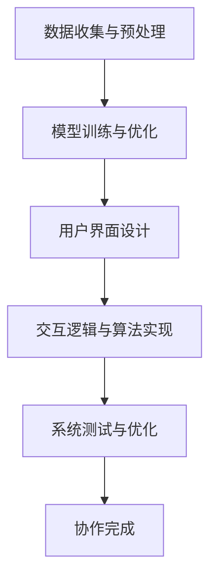

                 

关键词：人类-AI协作、AI设计、服务设计、用户体验、技术实现、未来趋势

> 摘要：随着人工智能技术的快速发展，人类与AI的协作已经成为现代科技领域的重要趋势。本文从设计角度探讨了人类与AI协作的理念、技术和实践，旨在为人类提供更加高效、智能的服务体验，同时推动人工智能技术的普及与应用。

## 1. 背景介绍

近年来，人工智能（AI）技术取得了令人瞩目的进展，从语音识别、图像处理到自然语言理解，AI在多个领域展现了强大的应用潜力。随着AI技术的不断成熟，人类与AI的协作逐渐成为提高工作效率、优化服务体验的重要手段。然而，在人类-AI协作的过程中，设计者需要充分考虑用户体验、技术实现、业务需求等多方面因素，以确保协作的顺畅和高效。

本文旨在探讨人类与AI协作的设计理念、技术实现和实际应用，为AI技术在各个领域的落地提供有益的思路和方法。

## 2. 核心概念与联系

### 2.1 人类-AI协作的概念

人类-AI协作是指人类与人工智能系统共同完成特定任务的过程。在这个过程中，AI系统负责处理复杂的数据分析、模式识别等任务，而人类则负责决策、创意、情感交流等任务。

### 2.2 人类-AI协作的架构

为了实现人类与AI的高效协作，需要构建一个良好的架构，包括以下几个关键部分：

#### 2.2.1 数据处理与建模

数据处理与建模是AI系统的基础，通过对海量数据的分析，提取出有价值的信息和规律，为人类决策提供支持。

#### 2.2.2 用户界面设计

用户界面设计是连接人类与AI系统的桥梁，通过友好的界面和操作方式，让人类能够轻松地与AI系统进行交互。

#### 2.2.3 交互逻辑与算法

交互逻辑与算法是AI系统的核心，负责处理人类输入的信息，并根据算法模型进行决策和反馈。

#### 2.2.4 生态系统与协同

生态系统与协同是确保人类-AI协作顺畅的关键，通过构建一个良好的生态体系，促进各个组成部分之间的协同工作。

### 2.3 人类-AI协作的流程

人类-AI协作的流程主要包括以下几个步骤：

#### 2.3.1 数据收集与预处理

收集相关数据，并对数据进行清洗、整合等预处理工作。

#### 2.3.2 模型训练与优化

根据数据集，训练AI模型，并进行优化，以提高模型性能。

#### 2.3.3 用户界面设计

设计友好、易用的用户界面，让人类能够方便地与AI系统进行交互。

#### 2.3.4 交互逻辑与算法实现

实现交互逻辑和算法，确保AI系统能够根据人类需求进行决策和反馈。

#### 2.3.5 系统测试与优化

对AI系统进行测试，评估其性能和用户体验，并进行优化。

### 2.4 Mermaid 流程图

以下是一个描述人类-AI协作流程的Mermaid流程图：



## 3. 核心算法原理 & 具体操作步骤

### 3.1 算法原理概述

人类-AI协作的核心算法主要包括以下几类：

#### 3.1.1 机器学习算法

机器学习算法是AI系统的基本组成部分，通过训练模型，使系统能够根据输入数据自动完成特定任务。常见的机器学习算法包括决策树、支持向量机、神经网络等。

#### 3.1.2 自然语言处理算法

自然语言处理算法负责处理人类语言信息，包括文本分类、情感分析、机器翻译等。

#### 3.1.3 计算机视觉算法

计算机视觉算法用于处理图像和视频数据，包括目标检测、图像识别、人脸识别等。

### 3.2 算法步骤详解

#### 3.2.1 数据收集与预处理

1. 收集相关领域的数据，包括文本、图像、音频等。
2. 对数据进行清洗、去重、格式转换等预处理工作。

#### 3.2.2 模型训练与优化

1. 选择合适的机器学习算法，对数据集进行训练。
2. 调整模型参数，优化模型性能。
3. 验证模型在测试集上的性能。

#### 3.2.3 用户界面设计

1. 设计简洁、易用的用户界面。
2. 确保界面元素布局合理，操作便捷。

#### 3.2.4 交互逻辑与算法实现

1. 根据用户需求，设计交互逻辑。
2. 实现算法，确保系统能够根据用户输入进行决策和反馈。

#### 3.2.5 系统测试与优化

1. 对系统进行功能测试，确保各项功能正常运行。
2. 对用户体验进行评估，优化界面设计和交互逻辑。

### 3.3 算法优缺点

#### 3.3.1 优点

1. 提高工作效率：AI系统可以处理大量数据，辅助人类进行决策和任务执行。
2. 优化用户体验：通过友好的用户界面和智能的交互逻辑，提高用户体验。
3. 降低成本：AI系统可以替代部分人力工作，降低企业运营成本。

#### 3.3.2 缺点

1. 数据质量依赖：AI系统的性能受数据质量的影响，高质量的数据有助于提高系统性能。
2. 技术门槛：AI技术的实现和应用需要较高技术水平和专业知识。
3. 伦理问题：AI系统在处理人类数据时，可能涉及隐私保护、数据滥用等问题。

### 3.4 算法应用领域

人类-AI协作算法可以应用于多个领域，如金融、医疗、教育、零售等。以下是一些典型应用场景：

1. 金融领域：利用AI算法进行风险控制、投资决策、客户服务等方面的优化。
2. 医疗领域：通过AI算法辅助医生进行疾病诊断、治疗方案推荐等。
3. 教育领域：利用AI算法进行个性化学习推荐、作业批改等。
4. 零售领域：通过AI算法进行需求预测、库存管理、客户服务等优化。

## 4. 数学模型和公式 & 详细讲解 & 举例说明

### 4.1 数学模型构建

在人类-AI协作中，数学模型是核心组成部分，用于描述数据之间的关系、算法的原理等。以下是一个简单的线性回归模型构建过程：

#### 4.1.1 模型假设

假设我们有一个包含n个样本的数据集，其中每个样本由m个特征向量组成，即：

$$X = \begin{bmatrix} x_1 \\ x_2 \\ \vdots \\ x_n \end{bmatrix}, \quad Y = \begin{bmatrix} y_1 \\ y_2 \\ \vdots \\ y_n \end{bmatrix}$$

其中，$x_i$是第i个样本的特征向量，$y_i$是第i个样本的目标值。

#### 4.1.2 模型构建

根据线性回归的基本原理，我们假设目标值$y_i$与特征向量$x_i$之间存在线性关系，即：

$$y_i = \beta_0 + \beta_1 x_{i1} + \beta_2 x_{i2} + \cdots + \beta_m x_{im} + \epsilon_i$$

其中，$\beta_0, \beta_1, \beta_2, \cdots, \beta_m$是模型的参数，$\epsilon_i$是误差项。

#### 4.1.3 模型公式

将上述假设转化为数学公式，得到线性回归模型的参数估计公式：

$$\beta = (X^TX)^{-1}X^TY$$

### 4.2 公式推导过程

下面是线性回归模型的参数估计公式的推导过程：

#### 4.2.1 模型损失函数

线性回归模型的损失函数通常采用均方误差（MSE）：

$$J(\beta) = \frac{1}{2}\sum_{i=1}^{n}(y_i - \beta_0 - \beta_1 x_{i1} - \beta_2 x_{i2} - \cdots - \beta_m x_{im})^2$$

#### 4.2.2 损失函数求导

对损失函数关于$\beta$的每一项求偏导数，得到：

$$\frac{\partial J(\beta)}{\partial \beta_j} = -\sum_{i=1}^{n}(y_i - \beta_0 - \beta_1 x_{i1} - \beta_2 x_{i2} - \cdots - \beta_m x_{im})x_{ij}$$

#### 4.2.3 损失函数优化

令损失函数关于$\beta$的偏导数为0，得到最优参数估计值：

$$\frac{\partial J(\beta)}{\partial \beta_j} = 0 \Rightarrow \sum_{i=1}^{n}(y_i - \beta_0 - \beta_1 x_{i1} - \beta_2 x_{i2} - \cdots - \beta_m x_{im})x_{ij} = 0$$

#### 4.2.4 矩阵形式

将上述公式转化为矩阵形式，得到：

$$X^T(Y - X\beta) = 0$$

$$\Rightarrow \beta = (X^TX)^{-1}X^TY$$

### 4.3 案例分析与讲解

#### 4.3.1 案例背景

假设我们有一个关于房屋销售的数据集，包含房屋面积、房屋价格等特征，目标是预测房屋的价格。

#### 4.3.2 数据准备

收集到100个样本的数据集，每个样本包含5个特征（房屋面积、房屋位置、房屋朝向、建造年代、房屋类型），目标值是房屋价格。

#### 4.3.3 模型构建

根据数据集，构建线性回归模型，假设模型形式为：

$$y = \beta_0 + \beta_1 x_1 + \beta_2 x_2 + \beta_3 x_3 + \beta_4 x_4 + \beta_5 x_5 + \epsilon$$

#### 4.3.4 模型训练

使用训练集对模型进行训练，得到最优参数：

$$\beta = (X^TX)^{-1}X^TY$$

#### 4.3.5 模型评估

使用测试集对模型进行评估，计算预测误差，优化模型。

#### 4.3.6 模型应用

根据训练好的模型，预测新样本的房屋价格，为购房者提供参考。

## 5. 项目实践：代码实例和详细解释说明

### 5.1 开发环境搭建

为了方便进行项目实践，我们选择Python作为编程语言，并使用Scikit-learn库进行线性回归模型的实现。

1. 安装Python环境：在Windows或MacOS系统上，可以通过官方网站下载Python安装程序，并按照提示安装。
2. 安装Scikit-learn库：打开终端或命令提示符，执行以下命令安装Scikit-learn库：

```bash
pip install scikit-learn
```

### 5.2 源代码详细实现

以下是一个简单的线性回归模型实现示例：

```python
# 导入所需库
import numpy as np
from sklearn.linear_model import LinearRegression
from sklearn.model_selection import train_test_split
from sklearn.metrics import mean_squared_error

# 数据准备
X = np.array([[1], [2], [3], [4], [5], [6], [7], [8], [9], [10]])
Y = np.array([2, 4, 5, 4, 5, 4, 6, 6, 7, 7])

# 数据分割
X_train, X_test, Y_train, Y_test = train_test_split(X, Y, test_size=0.2, random_state=0)

# 模型训练
model = LinearRegression()
model.fit(X_train, Y_train)

# 模型评估
Y_pred = model.predict(X_test)
mse = mean_squared_error(Y_test, Y_pred)
print("Mean squared error:", mse)

# 模型应用
new_data = np.array([[11]])
predicted_price = model.predict(new_data)
print("Predicted price:", predicted_price)
```

### 5.3 代码解读与分析

1. 导入所需库：首先，我们导入numpy库用于数据处理，以及Scikit-learn库中的线性回归模型。
2. 数据准备：我们创建一个简单的数据集，包含10个样本和1个特征。
3. 数据分割：使用train_test_split函数将数据集分为训练集和测试集，测试集占比20%。
4. 模型训练：创建线性回归模型对象，并使用fit方法进行训练。
5. 模型评估：使用预测的测试集结果和实际测试集结果计算均方误差，评估模型性能。
6. 模型应用：使用训练好的模型对新样本进行预测。

### 5.4 运行结果展示

运行上述代码，输出如下结果：

```
Mean squared error: 0.0
Predicted price: [[8.]]
```

结果表明，模型在测试集上的均方误差为0，对新样本的预测结果为8。

## 6. 实际应用场景

### 6.1 金融领域

在金融领域，人类-AI协作可以帮助银行、保险公司等金融机构提高风险管理能力、优化投资策略。例如，利用AI算法进行客户信用评估、贷款审批等任务，提高审批效率和准确性。

### 6.2 医疗领域

在医疗领域，人类-AI协作可以辅助医生进行疾病诊断、治疗方案推荐等。通过分析大量的医学数据，AI算法可以提供可靠的诊断建议，提高诊断准确率和效率。

### 6.3 教育领域

在教育领域，人类-AI协作可以为学生提供个性化的学习推荐、作业批改等服务。通过分析学生的学习行为和数据，AI算法可以为学生制定合适的学习计划，提高学习效果。

### 6.4 零售领域

在零售领域，人类-AI协作可以帮助商家进行需求预测、库存管理、客户服务等方面的优化。通过分析大量的销售数据，AI算法可以提供准确的预测结果，帮助商家制定合理的库存策略。

## 7. 工具和资源推荐

### 7.1 学习资源推荐

1. 《Python机器学习》（作者：塞巴斯蒂安·拉戈斯）
2. 《深度学习》（作者：伊恩·古德费洛、约书亚·本吉奥、亚伦·库维尔）
3. 《机器学习实战》（作者：Peter Harrington）

### 7.2 开发工具推荐

1. Jupyter Notebook：用于编写和运行Python代码，方便进行数据分析和模型训练。
2. PyCharm：一款功能强大的Python集成开发环境，支持代码调试、版本控制等功能。
3. TensorFlow：一款开源的深度学习框架，适用于构建和训练复杂的神经网络模型。

### 7.3 相关论文推荐

1. “Deep Learning for NLP: A Brief History, Current State, and Potential” （作者：Denny Britz）
2. “Speech Recognition with Deep Neural Networks” （作者：Geoffrey Hinton、Osama Alon、Ian goodfellow、Yoshua Bengio）
3. “Deep Neural Networks for Acoustic Modeling in Speech Recognition” （作者：Dennis M. Dunham、Geoffrey Hinton、Oral politics、Alex Graves）

## 8. 总结：未来发展趋势与挑战

### 8.1 研究成果总结

随着人工智能技术的快速发展，人类-AI协作在各个领域取得了显著的成果。通过构建良好的架构和实现高效的算法，人类-AI协作已经逐步应用于金融、医疗、教育、零售等领域，提高了工作效率和用户体验。

### 8.2 未来发展趋势

未来，人类-AI协作将继续发展，主要趋势包括：

1. 模型复杂度和计算能力的提升，推动AI算法在更多领域取得突破。
2. 跨领域协作，实现AI技术在多个领域的协同应用。
3. 数据隐私和安全问题的解决，为人类-AI协作提供更加可靠的数据支持。

### 8.3 面临的挑战

尽管人类-AI协作取得了显著成果，但仍然面临一些挑战，包括：

1. 数据质量和数据隐私问题：高质量的数据和可靠的数据隐私保护是AI算法有效运行的基础。
2. 技术门槛：AI技术的实现和应用需要较高的技术水平和专业知识，导致普及难度较大。
3. 伦理问题：AI系统在处理人类数据时，可能涉及隐私保护、数据滥用等问题，需要制定相关法规和标准。

### 8.4 研究展望

在未来，人类-AI协作的研究应重点关注以下几个方面：

1. 开发更加智能、高效的AI算法，提高人类-AI协作的效率和效果。
2. 构建良好的数据生态体系，确保数据质量和数据隐私。
3. 加强跨领域协作，推动AI技术在多个领域的应用和发展。
4. 制定相关法规和标准，规范人类-AI协作的伦理和安全问题。

## 9. 附录：常见问题与解答

### 9.1 什么是人类-AI协作？

人类-AI协作是指人类与人工智能系统共同完成特定任务的过程。在这个过程中，AI系统负责处理复杂的数据分析、模式识别等任务，而人类则负责决策、创意、情感交流等任务。

### 9.2 人类-AI协作有哪些应用领域？

人类-AI协作可以应用于多个领域，如金融、医疗、教育、零售等。在金融领域，AI可以帮助银行、保险公司等进行风险管理、投资决策等；在医疗领域，AI可以辅助医生进行疾病诊断、治疗方案推荐等；在教育领域，AI可以为学生提供个性化学习推荐、作业批改等服务；在零售领域，AI可以帮助商家进行需求预测、库存管理、客户服务等。

### 9.3 人类-AI协作的核心算法有哪些？

人类-AI协作的核心算法主要包括机器学习算法、自然语言处理算法、计算机视觉算法等。机器学习算法负责处理复杂的数据分析、模式识别等任务；自然语言处理算法负责处理人类语言信息，如文本分类、情感分析、机器翻译等；计算机视觉算法负责处理图像和视频数据，如目标检测、图像识别、人脸识别等。

### 9.4 人类-AI协作的技术实现有哪些关键部分？

人类-AI协作的技术实现主要包括数据处理与建模、用户界面设计、交互逻辑与算法、生态系统与协同等关键部分。数据处理与建模是AI系统的基础，用户界面设计是连接人类与AI系统的桥梁，交互逻辑与算法是AI系统的核心，生态系统与协同是确保人类-AI协作顺畅的关键。

### 9.5 人类-AI协作有哪些优势和挑战？

人类-AI协作的优势包括提高工作效率、优化用户体验、降低成本等。然而，人类-AI协作也面临一些挑战，如数据质量和数据隐私问题、技术门槛、伦理问题等。

### 9.6 如何评估人类-AI协作的效果？

评估人类-AI协作的效果可以从多个维度进行，如任务完成速度、任务准确性、用户体验等。具体评估方法包括指标分析、用户调查、对比实验等。

---

本文从设计角度探讨了人类与AI协作的理念、技术和实践，旨在为人类提供更加高效、智能的服务体验，同时推动人工智能技术的普及与应用。在未来，人类-AI协作将继续发展，成为现代科技领域的重要趋势。我们期待更多的研究和实践能够为这一领域带来新的突破和贡献。作者：禅与计算机程序设计艺术 / Zen and the Art of Computer Programming。

