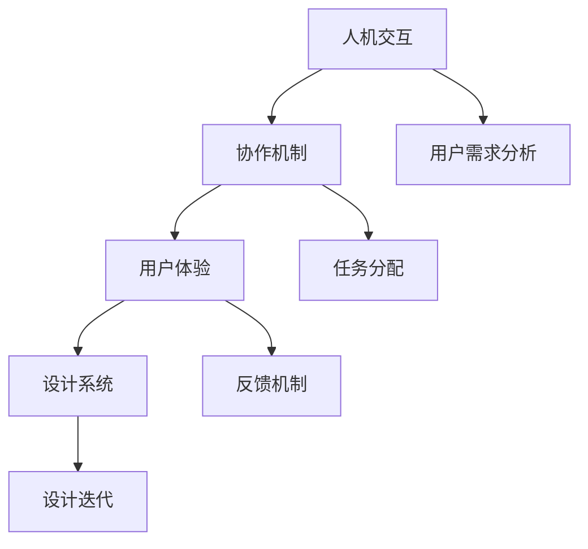

                 

关键词：人工智能，协作设计，人类-AI互动，用户体验，技术融合，设计原则。

> 摘要：随着人工智能技术的不断进步，人类与AI之间的协作设计已经成为现代科技领域的重要课题。本文探讨了人类-AI协作的背景、核心概念、算法原理、数学模型、实际应用以及未来展望，旨在为设计师和开发者提供关于如何更好地实现人类-AI协作的设计指导和实践建议。

## 1. 背景介绍

### 1.1 人工智能的发展

人工智能（Artificial Intelligence，AI）作为计算机科学的一个分支，旨在使计算机系统具备类似人类智能的能力，包括学习、推理、规划、感知和自然语言处理等。从早期的符号逻辑和专家系统，到深度学习和神经网络，人工智能技术经历了数代的发展，如今已经能够解决复杂的现实问题，如自动驾驶、医疗诊断、自然语言处理等。

### 1.2 人类-AI协作的必要性

随着AI技术的普及，人类与AI的交互变得越来越频繁。然而，单纯的AI操作无法完全取代人类的判断和创造力，反之亦然。人类-AI协作可以在多个层面上实现优势互补，提高效率、减少错误、扩展人类的认知能力。例如，在医疗领域，AI可以辅助医生进行疾病诊断，但最终决策仍需由医生根据患者的具体状况做出。

### 1.3 人类-AI协作的现状与挑战

尽管人类-AI协作具有巨大的潜力，但在实际应用中仍面临诸多挑战。首先是技术层面的挑战，如AI系统的可靠性、可解释性以及与人类思维的兼容性。其次是设计层面的挑战，如何在设计过程中平衡AI与人类的作用，确保系统的易用性和用户体验。此外，还有伦理和法律方面的挑战，如AI决策的透明度、隐私保护以及责任归属等。

## 2. 核心概念与联系

为了更好地理解人类-AI协作的设计原则，我们需要首先了解一些核心概念，包括人机交互、协作机制、用户体验和设计系统等。以下是这些概念的Mermaid流程图表示：



### 2.1 人机交互

人机交互（Human-Computer Interaction，HCI）是研究人类与计算机系统之间交互的学科。在人类-AI协作中，人机交互的目的是确保用户能够方便、有效地与AI系统进行交互。这涉及到用户界面设计、交互流程设计、错误处理等多个方面。

### 2.2 协作机制

协作机制是确保人类和AI能够有效协作的体系结构。这包括任务分配、沟通机制、协同工作空间等。任务分配是指根据人类和AI的能力和优势来分配任务，以达到最佳效果。沟通机制则是确保信息能够准确、及时地在人类和AI之间传递。协同工作空间提供了一个共同的工作环境，使得人类和AI能够共同完成任务。

### 2.3 用户体验

用户体验（User Experience，UX）是用户在使用产品或服务过程中所感受到的整体感受。在人类-AI协作中，用户体验至关重要。良好的用户体验能够提高用户满意度，增强用户忠诚度，从而推动产品的成功。用户体验设计涉及到用户需求分析、交互设计、视觉设计等多个方面。

### 2.4 设计系统

设计系统是一套统一的、可复用的设计元素和指南，用于确保产品或服务的整体设计一致性。在人类-AI协作中，设计系统有助于提高开发效率，确保用户体验的连贯性。设计系统通常包括样式指南、组件库、交互模式等。

## 3. 核心算法原理 & 具体操作步骤

### 3.1 算法原理概述

在人类-AI协作中，算法的设计和实现至关重要。核心算法原理包括以下方面：

1. **机器学习算法**：用于训练AI模型，使其能够从数据中学习并做出预测或决策。
2. **自然语言处理算法**：用于理解和生成自然语言，实现人与AI的语音或文本交互。
3. **协同优化算法**：用于优化人类和AI之间的任务分配和协作过程，以提高整体效率。
4. **用户行为分析算法**：用于分析用户行为，为用户体验设计提供数据支持。

### 3.2 算法步骤详解

1. **数据收集与预处理**：收集用户数据，如语音、文本、行为等，并进行预处理，包括去噪、归一化等。
2. **模型训练**：使用机器学习和自然语言处理算法对数据进行分析和训练，生成AI模型。
3. **模型评估与优化**：评估AI模型的性能，并通过调整模型参数进行优化。
4. **协作过程实现**：根据任务分配和协同优化算法，实现人类和AI的协同工作。
5. **用户体验优化**：根据用户行为分析算法的结果，不断优化用户体验。

### 3.3 算法优缺点

**优点**：

1. 提高工作效率：通过AI的协助，人类可以在更短的时间内完成复杂的任务。
2. 减少错误：AI系统可以在处理过程中发现并纠正错误，提高工作准确性。
3. 扩展认知能力：AI系统可以提供大量的信息和分析，帮助人类更好地理解和解决问题。

**缺点**：

1. 可解释性不足：AI系统的决策过程往往难以解释，增加了信任和透明度的挑战。
2. 数据隐私问题：大量用户数据的收集和处理可能引发隐私泄露的风险。
3. 技术依赖性：过度依赖AI可能导致人类技能的退化。

### 3.4 算法应用领域

1. **医疗**：AI可以辅助医生进行疾病诊断和治疗方案推荐。
2. **金融**：AI可以用于风险评估、投资策略制定等。
3. **教育**：AI可以为学生提供个性化的学习计划和辅导。
4. **制造业**：AI可以用于生产线的监控、故障诊断和优化。

## 4. 数学模型和公式 & 详细讲解 & 举例说明

### 4.1 数学模型构建

在人类-AI协作中，数学模型用于描述人类和AI之间的交互过程。以下是一个简单的数学模型：

$$
\text{UX} = f(\text{UI}, \text{AI}, \text{User})
$$

其中，UX表示用户体验，UI表示用户界面，AI表示人工智能，User表示用户。

### 4.2 公式推导过程

1. **用户界面设计**：UI的设计需要考虑用户的需求和行为模式，可以使用以下公式进行评估：

$$
\text{UI} = g(\text{需求}, \text{行为模式}, \text{设计原则})
$$

2. **人工智能模型**：AI模型的设计需要考虑数据的特征和算法的选择，可以使用以下公式进行评估：

$$
\text{AI} = h(\text{数据特征}, \text{算法选择}, \text{训练数据})
$$

3. **用户体验**：用户体验是由UI和AI共同影响的，可以使用以下公式进行评估：

$$
\text{UX} = f(\text{UI}, \text{AI}, \text{User})
$$

### 4.3 案例分析与讲解

以一个在线教育平台为例，分析如何通过数学模型优化用户体验。首先，收集用户的行为数据，如学习时长、学习频率、学习进度等。然后，使用自然语言处理算法分析用户的评论和反馈，生成用户需求。接着，根据用户需求和现有的教学内容，设计用户界面。最后，使用机器学习算法对教学内容进行推荐，并根据用户的学习进度和反馈进行调整。

通过这个案例，我们可以看到数学模型在人类-AI协作中的应用，如何通过数据分析和算法优化来提高用户体验。

## 5. 项目实践：代码实例和详细解释说明

### 5.1 开发环境搭建

在开始编写代码之前，我们需要搭建一个合适的开发环境。这里我们选择使用Python作为编程语言，并使用Jupyter Notebook作为开发工具。以下是搭建开发环境的步骤：

1. 安装Python：在官方网站下载并安装Python。
2. 安装Jupyter Notebook：在命令行中运行`pip install jupyter`。
3. 启动Jupyter Notebook：在命令行中运行`jupyter notebook`。

### 5.2 源代码详细实现

以下是一个简单的Python代码实例，用于实现一个基于机器学习的用户推荐系统：

```python
import pandas as pd
from sklearn.model_selection import train_test_split
from sklearn.ensemble import RandomForestClassifier

# 数据预处理
data = pd.read_csv('user_data.csv')
X = data.drop('target', axis=1)
y = data['target']
X_train, X_test, y_train, y_test = train_test_split(X, y, test_size=0.2, random_state=42)

# 模型训练
model = RandomForestClassifier()
model.fit(X_train, y_train)

# 模型评估
accuracy = model.score(X_test, y_test)
print(f'Model accuracy: {accuracy:.2f}')

# 推荐系统实现
def recommend_course(user_data):
    prediction = model.predict([user_data])
    if prediction[0] == 1:
        return 'Recommend course A'
    else:
        return 'Recommend course B'

# 测试推荐系统
user_data = [0.1, 0.2, 0.3, 0.4, 0.5]
print(recommend_course(user_data))
```

### 5.3 代码解读与分析

1. **数据预处理**：首先，我们使用Pandas库读取用户数据，然后分离特征和标签，并使用`train_test_split`函数进行数据切分。
2. **模型训练**：我们选择随机森林算法（RandomForestClassifier）对数据进行训练。
3. **模型评估**：使用`score`函数评估模型在测试集上的准确率。
4. **推荐系统实现**：定义一个函数`recommend_course`，根据用户数据预测并推荐相应的课程。

通过这个实例，我们可以看到如何使用Python实现一个简单的用户推荐系统，以及如何通过机器学习算法优化用户体验。

## 6. 实际应用场景

### 6.1 医疗领域

在医疗领域，人类-AI协作可以帮助医生进行疾病诊断和治疗方案推荐。AI系统可以处理大量的医疗数据，识别出潜在的疾病模式，为医生提供辅助决策。例如，Google的DeepMind团队开发的AI系统已经能够辅助医生进行眼科疾病的诊断，大大提高了诊断的准确性和效率。

### 6.2 金融领域

在金融领域，人类-AI协作可以用于风险评估、投资策略制定等。AI系统可以分析大量的市场数据，预测市场的走势，为投资者提供参考。例如，量化交易平台Robinhood就利用AI技术为用户提供个性化的投资建议，帮助用户做出更明智的投资决策。

### 6.3 教育领域

在教育领域，人类-AI协作可以帮助教师为学生提供个性化的教学和辅导。AI系统可以分析学生的学习数据，识别出学生的学习风格和薄弱环节，为教师提供针对性的教学建议。例如，Khan Academy就利用AI技术为学生提供个性化的学习路径，帮助学生更好地掌握知识。

### 6.4 制造业

在制造业，人类-AI协作可以用于生产线的监控、故障诊断和优化。AI系统可以实时监控生产线的数据，识别出潜在的故障隐患，为维护人员提供预警。例如，西门子就利用AI技术对其制造设备进行监控和优化，提高了生产效率和产品质量。

## 7. 工具和资源推荐

### 7.1 学习资源推荐

1. **《人工智能：一种现代的方法》（人工智能：一种现代的方法）》
2. **《深度学习》（深度学习）》
3. **《机器学习实战》（机器学习实战）》

### 7.2 开发工具推荐

1. **Python**
2. **TensorFlow**
3. **PyTorch**

### 7.3 相关论文推荐

1. **"Deep Learning for Human-AI Collaboration"**
2. **"Human-AI Interaction: A Survey"**
3. **"The Future of Human-AI Collaboration"**

## 8. 总结：未来发展趋势与挑战

### 8.1 研究成果总结

人类-AI协作的设计研究已经取得了显著的成果，包括算法优化、用户界面设计、用户体验研究等方面。然而，当前的协作设计仍存在许多不足，如AI的可解释性、数据隐私保护、用户体验优化等。

### 8.2 未来发展趋势

未来，人类-AI协作的发展将更加注重人机交互的优化、AI系统的智能化和个性化、以及协作机制的完善。随着技术的进步，AI将能够更好地理解人类的需求和行为，实现更高效、更自然的协作。

### 8.3 面临的挑战

未来，人类-AI协作将面临以下挑战：

1. **技术挑战**：提高AI系统的可靠性、可解释性和与人类思维的兼容性。
2. **设计挑战**：平衡AI与人类的作用，确保系统的易用性和用户体验。
3. **伦理挑战**：确保AI决策的透明度、隐私保护和责任归属。

### 8.4 研究展望

为了应对上述挑战，未来的研究应重点关注以下几个方面：

1. **人机交互**：研究更加自然、直观的人机交互方式，提高用户体验。
2. **AI系统设计**：提高AI系统的智能化和个性化，使其更好地适应人类的需求。
3. **协作机制**：优化协作机制，确保人类和AI能够高效、和谐地协作。
4. **伦理和法律**：制定相关的伦理和法律规范，确保人类-AI协作的可持续发展。

## 9. 附录：常见问题与解答

### 9.1 什么是人类-AI协作？

人类-AI协作是指人类和人工智能系统在共同的任务中相互协作，实现优势互补，提高工作效率和准确性的过程。

### 9.2 人类-AI协作的设计原则是什么？

人类-AI协作的设计原则包括：平衡人类和AI的作用、确保系统的易用性和用户体验、提高AI系统的可靠性和可解释性、保护用户隐私和确保责任归属。

### 9.3 人类-AI协作在哪些领域有应用？

人类-AI协作在医疗、金融、教育、制造业等多个领域有广泛应用，如疾病诊断、风险评估、个性化教学、生产线监控等。

### 9.4 人类-AI协作的未来发展趋势是什么？

未来，人类-AI协作将更加注重人机交互的优化、AI系统的智能化和个性化、以及协作机制的完善。随着技术的进步，AI将能够更好地理解人类的需求和行为，实现更高效、更自然的协作。

---

# 作者署名

作者：禅与计算机程序设计艺术 / Zen and the Art of Computer Programming

[END]

