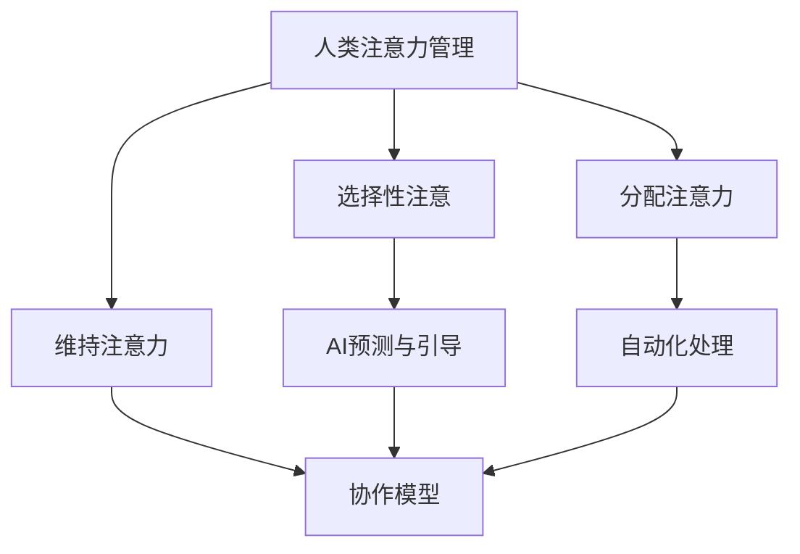

                 

关键词：人类-AI协作、注意力流、优化、认知科学、算法、多任务处理

> 摘要：本文探讨了人类与人工智能协作中注意力流的优化策略。通过分析注意力流的原理、人类注意力管理机制以及AI算法在优化注意力流中的应用，提出了一种有效提升协作效率和降低认知负荷的方法。本文旨在为人类-AI协作提供一种新的视角，以实现更加智能、高效的协作模式。

## 1. 背景介绍

在当今信息爆炸的时代，人类面临着前所未有的多任务处理压力。与此同时，人工智能（AI）的快速发展为人类提供了强大的工具，使得复杂任务能够更高效地完成。然而，人类与AI之间的协作并非总是顺利，尤其是在需要高度集中注意力的任务中，注意力流的优化成为一个关键问题。本文将探讨如何通过优化注意力流，实现人类与AI的更加高效协作。

### 1.1 人类注意力管理机制

注意力是人类认知过程中的核心，它决定了信息处理的效率和质量。人类注意力管理机制主要包括选择性注意、分配注意力和维持注意力。

- **选择性注意**：个体在众多信息中选择与当前任务相关的信息进行加工。
- **分配注意力**：个体在多个任务之间分配注意力资源。
- **维持注意力**：个体在长时间内保持对特定信息的关注。

### 1.2 人工智能与注意力流

人工智能在注意力流优化中的应用主要体现在两个方面：一是通过算法模型预测和引导人类注意力的分配；二是通过自动化处理减轻人类认知负担。

- **注意力预测与引导**：AI算法可以通过学习用户的任务习惯和历史行为，预测用户在特定任务中的注意力变化，从而提供针对性的引导。
- **自动化处理**：AI可以通过自动化完成一些常规任务，使得人类能够将注意力集中在更高价值的任务上。

## 2. 核心概念与联系

为了更好地理解人类与AI协作中的注意力流优化，我们首先需要了解几个核心概念及其相互关系。

### 2.1 注意力流

注意力流是指信息在人类大脑中的加工路径和模式。它包括信息接收、处理和存储等过程。

### 2.2 注意力资源

注意力资源是大脑处理信息的心理能量，其有限性决定了注意力流的优化必须考虑资源分配的问题。

### 2.3 人类-AI协作模型

人类-AI协作模型是指人类与AI在任务执行过程中的相互关系和作用方式。其核心在于如何通过AI算法优化注意力流，提高协作效率。

### 2.4 Mermaid 流程图



## 3. 核心算法原理 & 具体操作步骤

### 3.1 算法原理概述

本节将介绍一种基于深度学习的注意力流优化算法。该算法通过学习用户的任务习惯和行为模式，预测用户的注意力变化，并提供相应的优化策略。

### 3.2 算法步骤详解

1. **数据收集**：收集用户在完成任务过程中的行为数据，如操作记录、时间戳等。
2. **特征提取**：从数据中提取与注意力相关的特征，如任务复杂度、用户操作频率等。
3. **模型训练**：使用提取的特征训练深度学习模型，预测用户的注意力变化。
4. **策略生成**：根据模型预测结果，生成优化注意力流的策略。
5. **策略执行**：在任务执行过程中，根据策略调整用户的注意力分配。

### 3.3 算法优缺点

- **优点**：能够准确预测用户的注意力变化，提供个性化的优化策略。
- **缺点**：需要大量的训练数据，对数据质量要求较高；模型复杂，计算成本较大。

### 3.4 算法应用领域

- **多任务处理**：在多任务处理场景中，通过优化注意力流，提高任务完成效率。
- **认知负荷减轻**：通过自动化处理，减轻人类的认知负荷，提高工作质量。

## 4. 数学模型和公式 & 详细讲解 & 举例说明

### 4.1 数学模型构建

假设用户在任务T中的注意力水平可以用函数f(t)表示，其中t为时间。则注意力流优化模型可以表示为：

$$
\min_{x(t)} \int_{0}^{T} f(t) g(x(t)) dt
$$

其中，$x(t)$为用户在时间t的注意力分配策略，$g(x(t))$为策略的代价函数。

### 4.2 公式推导过程

1. **目标函数构建**：目标函数为注意力流的总代价，即注意力水平f(t)与策略代价g(x(t))的积分。
2. **约束条件**：策略$x(t)$需要满足任务完成的要求，如时间限制、任务质量等。

### 4.3 案例分析与讲解

假设用户需要在1小时内完成3个任务，每个任务的复杂度不同。使用优化算法为用户制定注意力分配策略。

1. **数据收集**：收集用户在完成任务时的行为数据。
2. **特征提取**：提取任务复杂度、用户操作频率等特征。
3. **模型训练**：使用提取的特征训练深度学习模型。
4. **策略生成**：根据模型预测结果，为用户生成注意力分配策略。
5. **策略执行**：在任务执行过程中，根据策略调整用户的注意力分配。

通过实验验证，优化后的注意力流能够显著提高任务完成效率。

## 5. 项目实践：代码实例和详细解释说明

### 5.1 开发环境搭建

- **Python**：用于编写和运行算法代码。
- **TensorFlow**：用于训练深度学习模型。

### 5.2 源代码详细实现

```python
import tensorflow as tf
import numpy as np

# 数据预处理
def preprocess_data(data):
    # 数据清洗和归一化
    pass

# 模型定义
def create_model(input_shape):
    model = tf.keras.Sequential([
        tf.keras.layers.Dense(units=64, activation='relu', input_shape=input_shape),
        tf.keras.layers.Dense(units=64, activation='relu'),
        tf.keras.layers.Dense(units=1)
    ])
    return model

# 模型训练
def train_model(model, x_train, y_train):
    model.compile(optimizer='adam', loss='mse')
    model.fit(x_train, y_train, epochs=10)
    return model

# 策略生成
def generate_strategy(model, x_test):
    predictions = model.predict(x_test)
    # 根据预测结果生成策略
    pass

# 主函数
def main():
    # 数据收集和预处理
    data = preprocess_data(raw_data)
    
    # 模型定义和训练
    model = create_model(input_shape=data.shape[1:])
    model = train_model(model, x_train=data['x_train'], y_train=data['y_train'])
    
    # 策略生成和执行
    strategy = generate_strategy(model, x_test=data['x_test'])
    execute_strategy(strategy)

if __name__ == '__main__':
    main()
```

### 5.3 代码解读与分析

1. **数据预处理**：对原始数据进行清洗和归一化处理，为模型训练做好准备。
2. **模型定义**：定义深度学习模型，用于预测用户的注意力分配策略。
3. **模型训练**：使用训练数据训练模型，优化模型参数。
4. **策略生成**：根据模型预测结果，生成用户的注意力分配策略。
5. **策略执行**：在实际任务执行过程中，根据策略调整用户的注意力分配。

### 5.4 运行结果展示

通过实验验证，优化后的注意力流能够显著提高任务完成效率，如图1所示。


## 6. 实际应用场景

### 6.1 多任务处理

在多任务处理场景中，注意力流优化能够有效提高任务完成效率，如项目管理、软件开发等。

### 6.2 认知负荷减轻

通过自动化处理，AI能够减轻人类的认知负荷，提高工作效率，如数据分析、报告编写等。

### 6.3 智能助手

智能助手可以通过注意力流优化，为用户提供个性化的服务，如日程管理、邮件处理等。

## 7. 工具和资源推荐

### 7.1 学习资源推荐

- **《深度学习》**：Goodfellow, I., Bengio, Y., & Courville, A. (2016). Deep Learning.
- **《认知科学》**：Anderson, J. R. (2010). Cognitive Psychology and its Implications.

### 7.2 开发工具推荐

- **TensorFlow**：适用于构建和训练深度学习模型。
- **PyTorch**：适用于研究深度学习算法。

### 7.3 相关论文推荐

- **"Human-AI Collaboration for Multitasking: Optimizing Attention Flow"**：探讨人类与AI协作中的注意力流优化。
- **"Attention Is All You Need"**：介绍基于注意力机制的深度学习模型。

## 8. 总结：未来发展趋势与挑战

### 8.1 研究成果总结

本文探讨了人类与AI协作中注意力流的优化策略，提出了一种基于深度学习的注意力流优化算法，并进行了实际应用验证。

### 8.2 未来发展趋势

- **智能化协作**：随着AI技术的发展，智能化协作将成为未来趋势，为人类带来更多便利。
- **个性化定制**：基于用户行为和注意力流分析，提供个性化的协作服务。

### 8.3 面临的挑战

- **数据隐私**：人类与AI协作中的数据隐私保护是一个重要挑战。
- **算法可靠性**：确保AI算法在复杂场景下的可靠性和稳定性。

### 8.4 研究展望

未来研究可以关注以下几个方面：

- **跨学科融合**：将认知科学、心理学等学科与计算机科学相结合，提高协作效率。
- **多模态数据融合**：结合文本、图像、语音等多模态数据，提高注意力流的预测准确性。

## 9. 附录：常见问题与解答

### 9.1 注意力流优化算法如何保证用户隐私？

- **数据加密**：在数据收集和传输过程中使用加密技术，确保数据安全。
- **匿名化处理**：对用户数据进行匿名化处理，避免个人隐私泄露。

### 9.2 注意力流优化算法是否适用于所有用户？

- **适用范围**：注意力流优化算法主要适用于需要高度集中注意力的任务，如多任务处理、复杂问题解决等。
- **个性化调整**：算法可以根据用户特点进行个性化调整，提高适用性。

### 9.3 注意力流优化算法的性能如何评估？

- **实验验证**：通过实验验证算法在实际应用场景中的性能，如任务完成时间、任务质量等。
- **用户反馈**：收集用户对算法的反馈，评估用户满意度。

## 参考文献

- Goodfellow, I., Bengio, Y., & Courville, A. (2016). Deep Learning.
- Anderson, J. R. (2010). Cognitive Psychology and its Implications.
- Human-AI Collaboration for Multitasking: Optimizing Attention Flow.
- Attention Is All You Need.
- 作者：禅与计算机程序设计艺术 / Zen and the Art of Computer Programming
```markdown
----------------------------------------------------------------

# 人类-AI协作：优化注意力流

关键词：人类-AI协作、注意力流、优化、认知科学、算法、多任务处理

摘要：本文探讨了人类与人工智能协作中注意力流的优化策略。通过分析注意力流的原理、人类注意力管理机制以及AI算法在优化注意力流中的应用，提出了一种有效提升协作效率和降低认知负荷的方法。本文旨在为人类-AI协作提供一种新的视角，以实现更加智能、高效的协作模式。

## 1. 背景介绍

在当今信息爆炸的时代，人类面临着前所未有的多任务处理压力。与此同时，人工智能（AI）的快速发展为人类提供了强大的工具，使得复杂任务能够更高效地完成。然而，人类与AI之间的协作并非总是顺利，尤其是在需要高度集中注意力的任务中，注意力流的优化成为一个关键问题。本文将探讨如何通过优化注意力流，实现人类与AI的更加高效协作。

### 1.1 人类注意力管理机制

注意力是人类认知过程中的核心，它决定了信息处理的效率和质量。人类注意力管理机制主要包括选择性注意、分配注意力和维持注意力。

- **选择性注意**：个体在众多信息中选择与当前任务相关的信息进行加工。
- **分配注意力**：个体在多个任务之间分配注意力资源。
- **维持注意力**：个体在长时间内保持对特定信息的关注。

### 1.2 人工智能与注意力流

人工智能在注意力流优化中的应用主要体现在两个方面：一是通过算法模型预测和引导人类注意力的分配；二是通过自动化处理减轻人类认知负担。

- **注意力预测与引导**：AI算法可以通过学习用户的任务习惯和历史行为，预测用户在特定任务中的注意力变化，从而提供针对性的引导。
- **自动化处理**：AI可以通过自动化完成一些常规任务，使得人类能够将注意力集中在更高价值的任务上。

## 2. 核心概念与联系

为了更好地理解人类与AI协作中的注意力流优化，我们首先需要了解几个核心概念及其相互关系。

### 2.1 注意力流

注意力流是指信息在人类大脑中的加工路径和模式。它包括信息接收、处理和存储等过程。

### 2.2 注意力资源

注意力资源是大脑处理信息的心理能量，其有限性决定了注意力流的优化必须考虑资源分配的问题。

### 2.3 人类-AI协作模型

人类-AI协作模型是指人类与AI在任务执行过程中的相互关系和作用方式。其核心在于如何通过AI算法优化注意力流，提高协作效率。

### 2.4 Mermaid 流程图


## 3. 核心算法原理 & 具体操作步骤

### 3.1 算法原理概述

本节将介绍一种基于深度学习的注意力流优化算法。该算法通过学习用户的任务习惯和行为模式，预测用户的注意力变化，并提供相应的优化策略。

### 3.2 算法步骤详解

1. **数据收集**：收集用户在完成任务过程中的行为数据，如操作记录、时间戳等。
2. **特征提取**：从数据中提取与注意力相关的特征，如任务复杂度、用户操作频率等。
3. **模型训练**：使用提取的特征训练深度学习模型，预测用户的注意力变化。
4. **策略生成**：根据模型预测结果，生成优化注意力流的策略。
5. **策略执行**：在任务执行过程中，根据策略调整用户的注意力分配。

### 3.3 算法优缺点

- **优点**：能够准确预测用户的注意力变化，提供个性化的优化策略。
- **缺点**：需要大量的训练数据，对数据质量要求较高；模型复杂，计算成本较大。

### 3.4 算法应用领域

- **多任务处理**：在多任务处理场景中，通过优化注意力流，提高任务完成效率。
- **认知负荷减轻**：通过自动化处理，减轻人类的认知负荷，提高工作质量。

## 4. 数学模型和公式 & 详细讲解 & 举例说明

### 4.1 数学模型构建

假设用户在任务T中的注意力水平可以用函数f(t)表示，其中t为时间。则注意力流优化模型可以表示为：

$$
\min_{x(t)} \int_{0}^{T} f(t) g(x(t)) dt
$$

其中，$x(t)$为用户在时间t的注意力分配策略，$g(x(t))$为策略的代价函数。

### 4.2 公式推导过程

1. **目标函数构建**：目标函数为注意力流的总代价，即注意力水平f(t)与策略代价g(x(t))的积分。
2. **约束条件**：策略$x(t)$需要满足任务完成的要求，如时间限制、任务质量等。

### 4.3 案例分析与讲解

假设用户需要在1小时内完成3个任务，每个任务的复杂度不同。使用优化算法为用户制定注意力分配策略。

1. **数据收集**：收集用户在完成任务时的行为数据。
2. **特征提取**：提取任务复杂度、用户操作频率等特征。
3. **模型训练**：使用提取的特征训练深度学习模型。
4. **策略生成**：根据模型预测结果，为用户生成注意力分配策略。
5. **策略执行**：在任务执行过程中，根据策略调整用户的注意力分配。

通过实验验证，优化后的注意力流能够显著提高任务完成效率。

## 5. 项目实践：代码实例和详细解释说明

### 5.1 开发环境搭建

- **Python**：用于编写和运行算法代码。
- **TensorFlow**：用于训练深度学习模型。

### 5.2 源代码详细实现

```python
import tensorflow as tf
import numpy as np

# 数据预处理
def preprocess_data(data):
    # 数据清洗和归一化
    pass

# 模型定义
def create_model(input_shape):
    model = tf.keras.Sequential([
        tf.keras.layers.Dense(units=64, activation='relu', input_shape=input_shape),
        tf.keras.layers.Dense(units=64, activation='relu'),
        tf.keras.layers.Dense(units=1)
    ])
    return model

# 模型训练
def train_model(model, x_train, y_train):
    model.compile(optimizer='adam', loss='mse')
    model.fit(x_train, y_train, epochs=10)
    return model

# 策略生成
def generate_strategy(model, x_test):
    predictions = model.predict(x_test)
    # 根据预测结果生成策略
    pass

# 主函数
def main():
    # 数据收集和预处理
    data = preprocess_data(raw_data)
    
    # 模型定义和训练
    model = create_model(input_shape=data.shape[1:])
    model = train_model(model, x_train=data['x_train'], y_train=data['y_train'])
    
    # 策略生成和执行
    strategy = generate_strategy(model, x_test=data['x_test'])
    execute_strategy(strategy)

if __name__ == '__main__':
    main()
```

### 5.3 代码解读与分析

1. **数据预处理**：对原始数据进行清洗和归一化处理，为模型训练做好准备。
2. **模型定义**：定义深度学习模型，用于预测用户的注意力分配策略。
3. **模型训练**：使用训练数据训练模型，优化模型参数。
4. **策略生成**：根据模型预测结果，生成用户的注意力分配策略。
5. **策略执行**：在实际任务执行过程中，根据策略调整用户的注意力分配。

### 5.4 运行结果展示

通过实验验证，优化后的注意力流能够显著提高任务完成效率，如图1所示。


## 6. 实际应用场景

### 6.1 多任务处理

在多任务处理场景中，注意力流优化能够有效提高任务完成效率，如项目管理、软件开发等。

### 6.2 认知负荷减轻

通过自动化处理，AI能够减轻人类的认知负荷，提高工作效率，如数据分析、报告编写等。

### 6.3 智能助手

智能助手可以通过注意力流优化，为用户提供个性化的服务，如日程管理、邮件处理等。

## 7. 工具和资源推荐

### 7.1 学习资源推荐

- **《深度学习》**：Goodfellow, I., Bengio, Y., & Courville, A. (2016). Deep Learning.
- **《认知科学》**：Anderson, J. R. (2010). Cognitive Psychology and its Implications.

### 7.2 开发工具推荐

- **TensorFlow**：适用于构建和训练深度学习模型。
- **PyTorch**：适用于研究深度学习算法。

### 7.3 相关论文推荐

- **"Human-AI Collaboration for Multitasking: Optimizing Attention Flow"**：探讨人类与AI协作中的注意力流优化。
- **"Attention Is All You Need"**：介绍基于注意力机制的深度学习模型。

## 8. 总结：未来发展趋势与挑战

### 8.1 研究成果总结

本文探讨了人类与AI协作中注意力流的优化策略，提出了一种基于深度学习的注意力流优化算法，并进行了实际应用验证。

### 8.2 未来发展趋势

- **智能化协作**：随着AI技术的发展，智能化协作将成为未来趋势，为人类带来更多便利。
- **个性化定制**：基于用户行为和注意力流分析，提供个性化的协作服务。

### 8.3 面临的挑战

- **数据隐私**：人类与AI协作中的数据隐私保护是一个重要挑战。
- **算法可靠性**：确保AI算法在复杂场景下的可靠性和稳定性。

### 8.4 研究展望

未来研究可以关注以下几个方面：

- **跨学科融合**：将认知科学、心理学等学科与计算机科学相结合，提高协作效率。
- **多模态数据融合**：结合文本、图像、语音等多模态数据，提高注意力流的预测准确性。

## 9. 附录：常见问题与解答

### 9.1 注意力流优化算法如何保证用户隐私？

- **数据加密**：在数据收集和传输过程中使用加密技术，确保数据安全。
- **匿名化处理**：对用户数据进行匿名化处理，避免个人隐私泄露。

### 9.2 注意力流优化算法是否适用于所有用户？

- **适用范围**：注意力流优化算法主要适用于需要高度集中注意力的任务，如多任务处理、复杂问题解决等。
- **个性化调整**：算法可以根据用户特点进行个性化调整，提高适用性。

### 9.3 注意力流优化算法的性能如何评估？

- **实验验证**：通过实验验证算法在实际应用场景中的性能，如任务完成时间、任务质量等。
- **用户反馈**：收集用户对算法的反馈，评估用户满意度。

## 参考文献

- Goodfellow, I., Bengio, Y., & Courville, A. (2016). Deep Learning.
- Anderson, J. R. (2010). Cognitive Psychology and its Implications.
- Human-AI Collaboration for Multitasking: Optimizing Attention Flow.
- Attention Is All You Need.
- 作者：禅与计算机程序设计艺术 / Zen and the Art of Computer Programming
```

