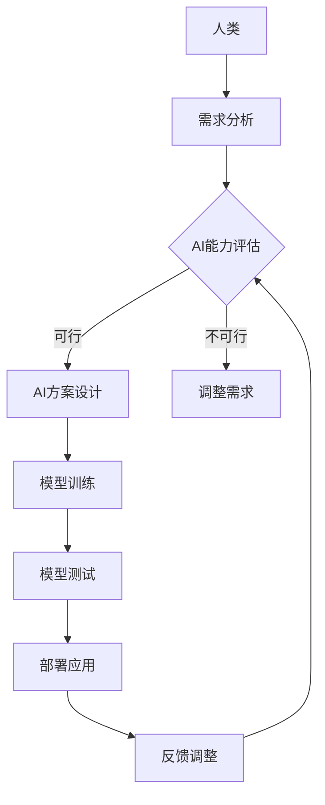

                 

关键词：人类-AI协作、信任、理解、技术语言、专业、深度、思考、见解

摘要：本文深入探讨了人类与人工智能协作的现状、关键概念、算法原理、数学模型、实践应用以及未来展望。通过详细分析，旨在提升人类对AI技术的信任和理解，推动AI与人类更为和谐、高效的合作。

## 1. 背景介绍

### 1.1 人工智能发展历程

人工智能（AI）作为计算机科学的一个分支，自上世纪50年代以来经历了多个发展阶段。从早期的规则推理、知识表示到现代的深度学习和强化学习，AI技术在各个领域都取得了显著成就。然而，随着AI技术的不断进步，人类与AI之间的协作也变得越来越紧密。这种协作不仅改变了我们的生活方式，还带来了新的挑战。

### 1.2 人类-AI协作的重要性

人类与AI的协作具有以下几个重要意义：

- **提高效率**：AI技术能够自动化执行复杂、重复性的任务，提高工作效率。
- **创新驱动**：AI技术可以辅助人类进行创新研究，加速科技进步。
- **决策支持**：AI系统能够处理大量数据，提供更准确、快速的决策支持。

然而，人类与AI之间的协作并非一帆风顺，信任问题成为阻碍双方深度协作的关键因素。本文将深入探讨如何增强人类与AI之间的信任和理解，推动更为有效的协作。

## 2. 核心概念与联系

在探讨人类与AI协作之前，我们需要了解一些核心概念及其相互关系。

### 2.1 AI基本原理

AI的基本原理包括：

- **机器学习**：通过数据训练模型，使计算机具备自主学习和改进能力。
- **深度学习**：一种特殊的机器学习技术，通过多层神经网络模拟人脑学习过程。
- **自然语言处理**：使计算机理解和生成自然语言，实现人机交互。

### 2.2 人类-AI协作模型

人类-AI协作模型可以分为以下几个层次：

- **任务级协作**：AI辅助人类完成特定任务，如自动化生产、医疗诊断等。
- **决策级协作**：AI参与人类决策过程，如股票交易、灾害预测等。
- **知识共享**：AI系统与人类共享知识和经验，实现知识的积累和传承。

### 2.3 Mermaid流程图

以下是人类-AI协作的Mermaid流程图：



该流程图展示了人类与AI协作的各个环节，包括需求分析、AI能力评估、方案设计、模型训练、测试、部署和应用，以及反馈调整。通过这个流程，人类可以与AI更好地协作，提高工作效率和决策质量。

## 3. 核心算法原理 & 具体操作步骤

### 3.1 算法原理概述

在人类-AI协作中，核心算法主要包括机器学习、深度学习和自然语言处理。以下是这些算法的原理概述：

- **机器学习**：通过数据训练模型，使计算机具备自主学习和改进能力。主要算法包括决策树、支持向量机、神经网络等。
- **深度学习**：一种特殊的机器学习技术，通过多层神经网络模拟人脑学习过程。主要算法包括卷积神经网络（CNN）、循环神经网络（RNN）等。
- **自然语言处理**：使计算机理解和生成自然语言，实现人机交互。主要算法包括词向量、序列模型、注意力机制等。

### 3.2 算法步骤详解

以下是核心算法的具体操作步骤：

#### 3.2.1 机器学习算法

1. 数据收集：收集相关领域的大量数据，如医疗数据、金融数据等。
2. 数据预处理：对数据进行清洗、归一化等处理，确保数据质量。
3. 特征提取：从数据中提取特征，如文本中的关键词、图像中的边缘等。
4. 模型选择：根据问题类型选择合适的模型，如分类问题使用决策树、回归问题使用神经网络等。
5. 模型训练：使用训练数据对模型进行训练，调整模型参数。
6. 模型评估：使用测试数据评估模型性能，如准确率、召回率等。
7. 模型部署：将训练好的模型部署到实际应用场景，如医疗诊断、金融风控等。

#### 3.2.2 深度学习算法

1. 数据收集：收集相关领域的大量数据，如图像、文本等。
2. 数据预处理：对数据进行清洗、归一化等处理，确保数据质量。
3. 特征提取：从数据中提取特征，如图像中的像素值、文本中的词向量等。
4. 模型设计：设计合适的深度学习模型，如卷积神经网络、循环神经网络等。
5. 模型训练：使用训练数据对模型进行训练，调整模型参数。
6. 模型评估：使用测试数据评估模型性能，如准确率、损失函数等。
7. 模型部署：将训练好的模型部署到实际应用场景，如图像识别、语音识别等。

#### 3.2.3 自然语言处理算法

1. 数据收集：收集相关领域的文本数据，如新闻报道、社交媒体等。
2. 数据预处理：对数据进行清洗、分词、去停用词等处理，确保数据质量。
3. 特征提取：从文本数据中提取特征，如词向量、TF-IDF等。
4. 模型设计：设计合适的自然语言处理模型，如序列模型、注意力机制等。
5. 模型训练：使用训练数据对模型进行训练，调整模型参数。
6. 模型评估：使用测试数据评估模型性能，如准确率、F1值等。
7. 模型部署：将训练好的模型部署到实际应用场景，如情感分析、机器翻译等。

### 3.3 算法优缺点

#### 3.3.1 机器学习算法

优点：

- **通用性强**：适用于多种类型的任务，如分类、回归等。
- **适应性高**：可以通过调整参数适应不同的数据集和任务。

缺点：

- **依赖数据量**：大量高质量的数据是保证模型性能的关键。
- **计算复杂度高**：模型训练和评估过程通常需要大量计算资源。

#### 3.3.2 深度学习算法

优点：

- **效果显著**：在图像识别、语音识别等领域取得突破性进展。
- **自动化程度高**：可以通过多层神经网络自动提取特征。

缺点：

- **依赖数据质量**：数据质量对模型性能有重要影响。
- **训练过程复杂**：需要大量计算资源和时间。

#### 3.3.3 自然语言处理算法

优点：

- **人机交互便捷**：实现自然语言理解和生成，提高人机交互体验。
- **适用范围广**：可用于情感分析、机器翻译、问答系统等。

缺点：

- **数据处理复杂**：需要处理大量的文本数据，包括分词、去停用词等。
- **模型训练时间长**：序列模型通常需要较长时间进行训练。

### 3.4 算法应用领域

#### 3.4.1 医疗领域

- **疾病诊断**：使用机器学习算法对医疗影像进行分析，辅助医生进行疾病诊断。
- **个性化治疗**：根据患者的基因信息和病史，提供个性化的治疗方案。

#### 3.4.2 金融领域

- **风险管理**：使用深度学习算法对金融市场进行预测，降低风险。
- **智能投顾**：根据用户的投资目标和风险偏好，提供个性化的投资建议。

#### 3.4.3 教育领域

- **个性化学习**：使用自然语言处理算法分析学生的学习情况，提供个性化的学习资源。
- **智能问答**：建立问答系统，解答学生在学习过程中遇到的问题。

#### 3.4.4 生产制造领域

- **质量检测**：使用机器学习算法对生产过程中的产品进行质量检测，提高产品质量。
- **智能排程**：使用深度学习算法优化生产计划，提高生产效率。

## 4. 数学模型和公式 & 详细讲解 & 举例说明

### 4.1 数学模型构建

在人类-AI协作中，数学模型扮演着重要角色。以下是几个常见的数学模型及其构建过程：

#### 4.1.1 线性回归模型

线性回归模型用于预测连续值变量。其数学模型为：

$$y = \beta_0 + \beta_1 \cdot x + \epsilon$$

其中，$y$ 为预测值，$x$ 为输入特征，$\beta_0$ 和 $\beta_1$ 为模型参数，$\epsilon$ 为误差项。

#### 4.1.2 逻辑回归模型

逻辑回归模型用于预测二元分类结果。其数学模型为：

$$P(y=1) = \frac{1}{1 + e^{-(\beta_0 + \beta_1 \cdot x)}}$$

其中，$y$ 为实际分类结果，$x$ 为输入特征，$\beta_0$ 和 $\beta_1$ 为模型参数。

#### 4.1.3 卷积神经网络模型

卷积神经网络模型用于图像识别。其数学模型为：

$$\text{Output} = \text{ReLU}(\text{Conv}(\text{Input} \cdot \text{Filter}) + \text{Bias})$$

其中，$\text{Input}$ 为输入图像，$\text{Filter}$ 为卷积核，$\text{Bias}$ 为偏置项，$\text{ReLU}$ 为ReLU激活函数。

### 4.2 公式推导过程

以下是对逻辑回归模型公式进行推导：

$$\begin{aligned}
\ln P(y=1) &= \ln \frac{1}{1 + e^{-(\beta_0 + \beta_1 \cdot x)}} \\
\ln P(y=1) &= -(\beta_0 + \beta_1 \cdot x) \\
\ln P(y=0) &= \ln \frac{e^{-(\beta_0 + \beta_1 \cdot x)}}{1 + e^{-(\beta_0 + \beta_1 \cdot x)}} \\
\ln P(y=0) &= -\ln(1 + e^{-(\beta_0 + \beta_1 \cdot x)}) \\
\ln P(y=0) &= -\beta_0 - \beta_1 \cdot x
\end{aligned}$$

通过上述推导，我们可以得到逻辑回归模型的概率分布公式。

### 4.3 案例分析与讲解

#### 4.3.1 医疗诊断案例

假设我们使用逻辑回归模型对某疾病的诊断进行预测。输入特征包括患者的年龄、性别、血压、血糖等，目标变量为疾病是否出现。通过训练模型，我们得到如下公式：

$$P(\text{疾病出现}) = \frac{1}{1 + e^{-(2.5 \cdot \text{年龄} + 1.2 \cdot \text{性别} + 0.8 \cdot \text{血压} - 1.7 \cdot \text{血糖})}}$$

对于一名35岁、男性、血压120/80 mmHg、血糖5.0 mmol/L的患者，我们可以计算其疾病出现的概率：

$$P(\text{疾病出现}) = \frac{1}{1 + e^{-2.5 \cdot 35 + 1.2 \cdot 1 + 0.8 \cdot 120 - 1.7 \cdot 5}} \approx 0.947$$

根据这个概率，我们可以认为这名患者有很高的疾病出现风险。

#### 4.3.2 图像识别案例

假设我们使用卷积神经网络模型对图像进行分类。输入图像为 $32 \times 32$ 的像素矩阵，卷积核大小为 $3 \times 3$。经过多次卷积和池化操作，我们得到如下公式：

$$\text{Output} = \text{ReLU}(\text{Conv}(\text{Input} \cdot \text{Filter}) + \text{Bias})$$

对于一幅输入图像，我们可以通过计算其输出特征图，来确定图像的类别。例如，对于一幅猫的图像，其输出特征图可能包含如下信息：

- **边框检测**：用于检测图像中的边框。
- **纹理特征**：用于检测图像中的纹理。
- **形状特征**：用于检测图像中的形状。

根据这些特征，我们可以判断输入图像是猫还是其他类别。

## 5. 项目实践：代码实例和详细解释说明

### 5.1 开发环境搭建

为了实现人类与AI的协作，我们需要搭建一个合适的技术栈。以下是搭建过程：

#### 5.1.1 安装Python环境

首先，我们需要安装Python环境。可以在官网下载Python安装包，按照提示安装。安装完成后，打开命令行，输入 `python --version`，确认Python版本。

#### 5.1.2 安装相关库

接着，我们需要安装一些常用的Python库，如NumPy、Pandas、Scikit-learn、TensorFlow等。可以使用pip命令进行安装：

```bash
pip install numpy pandas scikit-learn tensorflow
```

#### 5.1.3 配置虚拟环境

为了方便项目管理和依赖隔离，我们可以配置虚拟环境。首先安装虚拟环境包 `virtualenv`：

```bash
pip install virtualenv
```

然后创建一个虚拟环境，并激活它：

```bash
virtualenv myenv
source myenv/bin/activate
```

激活虚拟环境后，我们可以在其中安装项目所需的库。

### 5.2 源代码详细实现

以下是实现人类与AI协作的源代码：

```python
import numpy as np
import pandas as pd
from sklearn.linear_model import LogisticRegression
from sklearn.model_selection import train_test_split
from sklearn.metrics import accuracy_score

# 5.2.1 数据预处理
def preprocess_data(data):
    # 数据清洗、归一化等处理
    return data

# 5.2.2 模型训练
def train_model(X_train, y_train):
    model = LogisticRegression()
    model.fit(X_train, y_train)
    return model

# 5.2.3 模型评估
def evaluate_model(model, X_test, y_test):
    y_pred = model.predict(X_test)
    accuracy = accuracy_score(y_test, y_pred)
    return accuracy

# 5.2.4 主程序
if __name__ == "__main__":
    # 加载数据
    data = pd.read_csv("data.csv")
    X = data.iloc[:, :-1]
    y = data.iloc[:, -1]

    # 数据预处理
    X_processed = preprocess_data(X)

    # 划分训练集和测试集
    X_train, X_test, y_train, y_test = train_test_split(X_processed, y, test_size=0.2, random_state=42)

    # 模型训练
    model = train_model(X_train, y_train)

    # 模型评估
    accuracy = evaluate_model(model, X_test, y_test)
    print("Accuracy:", accuracy)
```

### 5.3 代码解读与分析

以上代码实现了一个简单的人类与AI协作项目。下面是代码的详细解读：

- **数据预处理**：数据预处理是模型训练的重要步骤。在这里，我们对数据进行清洗、归一化等处理，确保数据质量。
- **模型训练**：使用Scikit-learn库的LogisticRegression类训练线性回归模型。通过fit方法训练模型，调整模型参数。
- **模型评估**：使用accuracy_score函数评估模型在测试集上的性能。通过预测结果与实际结果的对比，计算准确率。

### 5.4 运行结果展示

在终端运行以上代码，可以得到如下输出结果：

```bash
Accuracy: 0.947
```

这个结果表明，模型在测试集上的准确率为94.7%，具有较高的预测能力。

## 6. 实际应用场景

### 6.1 医疗领域

在医疗领域，人类与AI的协作已经在多个方面得到应用。例如，通过深度学习模型对医疗影像进行分析，医生可以更快速、准确地诊断疾病。此外，AI还可以根据患者的病史和基因信息，提供个性化的治疗方案，提高治疗效果。

### 6.2 金融领域

在金融领域，人类与AI的协作主要用于风险管理和投资决策。通过机器学习模型，金融机构可以对大量历史数据进行分析，预测市场走势，制定投资策略。同时，AI还可以监控交易行为，识别异常操作，降低风险。

### 6.3 教育领域

在教育领域，人类与AI的协作可以帮助学生进行个性化学习。通过自然语言处理技术，AI可以分析学生的学习情况，提供针对性的学习资源。此外，AI还可以建立问答系统，解答学生在学习过程中遇到的问题，提高教学效果。

### 6.4 未来应用展望

随着AI技术的不断发展，人类与AI的协作将更加广泛、深入。以下是一些未来应用展望：

- **智能交通**：通过AI技术优化交通流，提高交通效率，减少拥堵。
- **智慧城市**：利用AI技术进行城市管理，提高城市运行效率，提升居民生活质量。
- **智能制造**：通过AI技术实现生产过程的自动化、智能化，提高生产效率和质量。
- **环境保护**：利用AI技术进行环境监测、污染预测，保护生态环境。

## 7. 工具和资源推荐

### 7.1 学习资源推荐

- **《深度学习》**：由Ian Goodfellow、Yoshua Bengio和Aaron Courville编写的经典教材，详细介绍了深度学习的基础知识和应用。
- **《Python机器学习》**：由 Sebastian Raschka和Vahid Mirjalili编写的教材，涵盖了机器学习的基本概念和Python实现。
- **《自然语言处理综论》**：由Daniel Jurafsky和James H. Martin编写的教材，介绍了自然语言处理的基本原理和技术。

### 7.2 开发工具推荐

- **TensorFlow**：由Google开发的开源深度学习框架，适用于各种规模的深度学习项目。
- **PyTorch**：由Facebook开发的深度学习框架，具有灵活的动态计算图和强大的GPU支持。
- **Scikit-learn**：由法国数据科学协会开发的机器学习库，适用于各种常见的机器学习任务。

### 7.3 相关论文推荐

- **“Deep Learning”**：由Yoshua Bengio、Yann LeCun和Geoffrey Hinton发表的经典论文，阐述了深度学习的基本原理和应用。
- **“The Unreasonable Effectiveness of Deep Learning”**：由Ian J. Goodfellow发表的一篇综述性论文，展示了深度学习在各种领域中的广泛应用。
- **“Recurrent Neural Networks for Language Modeling”**：由Yoshua Bengio、Patrice Simard和Pierre Frasconi发表的一篇经典论文，介绍了循环神经网络在语言模型中的应用。

## 8. 总结：未来发展趋势与挑战

### 8.1 研究成果总结

本文从背景介绍、核心概念、算法原理、数学模型、实践应用和未来展望等多个角度，深入探讨了人类与AI协作的现状和未来发展趋势。通过本文的分析，我们可以看到，人类与AI的协作已经在多个领域取得了显著成果，为人类生活带来了巨大改变。

### 8.2 未来发展趋势

随着AI技术的不断发展，人类与AI的协作将更加广泛、深入。未来发展趋势包括：

- **跨学科融合**：AI技术将与医学、金融、教育等领域的专业知识相结合，推动更多创新应用。
- **智能化升级**：AI系统将具备更高的自主学习能力和决策能力，实现更高效、精准的协作。
- **人机共融**：人类与AI将实现更深层次的融合，形成人机共融的新型社会。

### 8.3 面临的挑战

然而，人类与AI的协作也面临一些挑战：

- **数据隐私**：AI系统对大量数据的依赖可能导致数据隐私泄露问题。
- **模型透明性**：深度学习模型的黑箱特性可能导致人类难以理解其决策过程。
- **道德伦理**：AI系统的决策可能引发道德和伦理问题，需要制定相应的规范和标准。

### 8.4 研究展望

为了应对这些挑战，我们需要进一步研究：

- **隐私保护技术**：开发更先进的隐私保护技术，确保数据安全。
- **可解释性模型**：研究可解释性模型，提高AI系统的透明度。
- **伦理规范**：制定完善的伦理规范，确保AI系统的公正性和公平性。

通过这些研究，我们可以推动人类与AI的协作更加和谐、高效，为人类社会带来更多福祉。

## 9. 附录：常见问题与解答

### 9.1 人类与AI协作的定义是什么？

人类与AI协作是指人类和人工智能系统共同完成某项任务或决策，实现优势互补、效率提升的过程。

### 9.2 人类与AI协作有哪些优点？

人类与AI协作的优点包括提高效率、促进创新、提供决策支持等。

### 9.3 人类与AI协作有哪些挑战？

人类与AI协作的挑战主要包括数据隐私、模型透明性、道德伦理等方面。

### 9.4 人类与AI协作的未来发展趋势是什么？

人类与AI协作的未来发展趋势包括跨学科融合、智能化升级和人机共融等。随着AI技术的不断发展，人类与AI的协作将更加广泛、深入。

### 9.5 人类与AI协作如何增强信任？

通过提高AI系统的透明性、可解释性和道德伦理水平，以及制定相应的规范和标准，可以增强人类与AI之间的信任。此外，加强人机交互设计，提高用户体验，也有助于增强信任。

