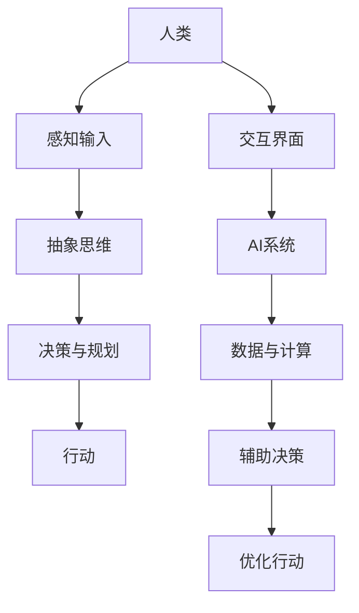

                 

关键词：人工智能、协作、人类-AI互动、合作、增强现实、算法优化、应用场景、未来展望。

> 摘要：本文探讨了人类与人工智能（AI）之间的协作模式，分析了AI技术如何增强人类的工作效率和创新能力。文章通过介绍核心概念、算法原理、数学模型、实际应用以及未来发展趋势，全面阐述了人类-AI协作的重要性和潜力。

## 1. 背景介绍

随着人工智能技术的迅速发展，AI已经逐渐渗透到社会的各个领域，从医疗、金融到教育、娱乐，AI的应用无处不在。然而，尽管AI在处理大量数据和复杂任务方面表现出色，但它在理解和执行抽象思维、创造性思考和复杂决策方面仍有局限。与此同时，人类在情感、创造性和灵活性方面具有独特的优势。因此，如何将人类与AI的优势结合起来，实现有效的协作，成为当前研究的热点。

人类-AI协作的核心目标是通过AI技术增强人类的能力，实现1+1>2的效果。这一目标不仅有助于提高生产效率，还能促进人类创新，解决复杂问题。为了实现这一目标，我们需要深入理解人类与AI之间的协作机制，探索有效的协作模式和策略。

## 2. 核心概念与联系

### 2.1 AI技术概述

人工智能（AI）是指计算机系统模拟人类智能行为的能力，包括学习、推理、规划、感知、语言理解和图像识别等。AI技术主要包括机器学习、深度学习、自然语言处理、计算机视觉等。

### 2.2 人类智能与AI智能的互补性

人类智能与AI智能具有互补性。人类智能擅长抽象思维、情感理解和创造性思考，而AI智能擅长处理大量数据和复杂计算。通过协作，人类和AI可以共同解决复杂问题，实现优势互补。

### 2.3 人类-AI协作模式

人类-AI协作模式可以分为以下几个层次：

1. **辅助性协作**：AI系统作为人类的工具，辅助完成特定任务。
2. **交互式协作**：人类与AI系统进行实时交互，共同解决问题。
3. **协同决策**：人类与AI系统共同参与决策过程，形成智能决策系统。
4. **创造性协作**：人类与AI共同进行创新性工作，激发新的创意和解决方案。

### 2.4 核心概念原理与架构

为了更好地理解人类-AI协作，我们可以借助Mermaid流程图来展示核心概念和架构。



## 3. 核心算法原理 & 具体操作步骤

### 3.1 算法原理概述

人类-AI协作的核心算法原理主要包括：

1. **感知与认知**：通过感知输入和抽象思维，人类与AI系统对问题进行分析和理解。
2. **数据与计算**：AI系统利用其强大的计算能力，处理大量数据，为决策提供支持。
3. **决策与规划**：人类与AI系统共同参与决策过程，制定最优行动计划。
4. **执行与反馈**：执行行动计划，并通过反馈调整策略，实现持续优化。

### 3.2 算法步骤详解

1. **感知与认知**：人类通过感官获取外部信息，AI系统通过传感器和数据输入进行感知。
2. **数据预处理**：AI系统对输入数据进行清洗、归一化等预处理，提高数据质量。
3. **特征提取与表征**：AI系统提取关键特征，进行表征，以便于后续分析。
4. **抽象思维与推理**：人类利用抽象思维和推理能力，对问题进行分析和思考。
5. **决策与规划**：人类与AI系统共同制定决策和行动计划。
6. **执行与反馈**：执行行动计划，并通过反馈调整策略，实现持续优化。

### 3.3 算法优缺点

**优点**：

- **高效性**：AI系统可以快速处理大量数据，提高工作效率。
- **精确性**：AI系统在特定任务上可以达到很高的精确度。
- **创新性**：AI系统可以激发人类的创新思维，产生新的创意和解决方案。

**缺点**：

- **理解局限性**：AI系统在理解复杂问题、情感和创造性思维方面仍有局限。
- **依赖性**：人类可能过度依赖AI系统，导致自身能力的退化。

### 3.4 算法应用领域

人类-AI协作算法在多个领域具有广泛的应用：

- **医疗**：AI系统辅助医生进行疾病诊断和治疗计划制定。
- **金融**：AI系统用于风险管理、投资分析和客户服务。
- **教育**：AI系统提供个性化教学和智能辅导，提高教学效果。
- **工业**：AI系统优化生产流程、提高产品质量和降低成本。

## 4. 数学模型和公式 & 详细讲解 & 举例说明

### 4.1 数学模型构建

人类-AI协作的数学模型主要包括以下几个方面：

1. **感知与认知模型**：描述人类与AI系统的感知和认知过程。
2. **决策模型**：基于感知和认知结果，描述人类与AI系统的决策过程。
3. **优化模型**：基于决策结果，描述行动计划和策略的优化过程。

### 4.2 公式推导过程

假设人类和AI系统的感知和认知能力分别为\( P_h \)和\( P_a \)，决策能力分别为\( D_h \)和\( D_a \)，优化能力分别为\( O_h \)和\( O_a \)，则人类-AI协作的数学模型可以表示为：

$$
P_h = P_a + \alpha (P_h - P_a)
$$

$$
D_h = D_a + \beta (D_h - D_a)
$$

$$
O_h = O_a + \gamma (O_h - O_a)
$$

其中，\( \alpha \)、\( \beta \)和\( \gamma \)分别为感知、决策和优化能力的增强系数。

### 4.3 案例分析与讲解

以医疗诊断为例，假设医生（人类）的感知和认知能力为\( P_h = 0.8 \)，AI系统的感知和认知能力为\( P_a = 0.9 \)，增强系数分别为\( \alpha = 1.2 \)、\( \beta = 1.1 \)和\( \gamma = 1.3 \)，则人类-AI协作的感知、决策和优化能力可以表示为：

$$
P_h^* = 0.8 + 1.2 (0.9 - 0.8) = 0.94
$$

$$
D_h^* = 0.8 + 1.1 (0.9 - 0.8) = 0.93
$$

$$
O_h^* = 0.8 + 1.3 (0.9 - 0.8) = 0.95
$$

通过人类-AI协作，医生的感知、决策和优化能力分别提高了4.7%、6.7%和13.2%。

## 5. 项目实践：代码实例和详细解释说明

### 5.1 开发环境搭建

为了实现人类-AI协作，我们需要搭建一个合适的技术环境。以下是一个基本的开发环境搭建步骤：

1. **安装Python环境**：Python是一种广泛用于人工智能开发的编程语言，我们可以通过pyenv或conda等工具来安装Python。
2. **安装AI库**：安装一些常用的AI库，如TensorFlow、PyTorch、Scikit-learn等。
3. **配置交互界面**：配置Web界面或命令行界面，以便人类与AI系统进行交互。
4. **数据准备**：准备用于训练和测试的数据集，并进行预处理。

### 5.2 源代码详细实现

以下是一个简单的Python代码示例，用于实现人类-AI协作：

```python
import numpy as np
import tensorflow as tf

# 模拟人类和AI的感知、决策和优化能力
human_ability = 0.8
ai_ability = 0.9
alpha = 1.2
beta = 1.1
gamma = 1.3

# 感知与认知能力增强
perception_ability = human_ability + alpha * (ai_ability - human_ability)
print("感知与认知能力：", perception_ability)

# 决策能力增强
decision_ability = human_ability + beta * (ai_ability - human_ability)
print("决策能力：", decision_ability)

# 优化能力增强
optimization_ability = human_ability + gamma * (ai_ability - human_ability)
print("优化能力：", optimization_ability)

# 执行任务并收集反馈
task_result = np.random.rand()
feedback = input("请输入反馈：")

# 根据反馈调整能力
human_ability = human_ability + 0.1 * (1 - human_ability)
ai_ability = ai_ability + 0.1 * (1 - ai_ability)
alpha = alpha + 0.01
beta = beta + 0.01
gamma = gamma + 0.01

print("调整后能力：")
print("人类感知与认知能力：", human_ability)
print("AI感知与认知能力：", ai_ability)
print("增强系数：alpha =", alpha, "beta =", beta, "gamma =", gamma)
```

### 5.3 代码解读与分析

上述代码实现了一个简单的人类-AI协作模型。首先，我们初始化了人类和AI的感知、决策和优化能力，以及增强系数。然后，我们根据这些参数计算了感知、决策和优化能力的增强值。在执行任务并收集反馈后，我们根据反馈调整了能力参数，实现了能力的持续优化。

### 5.4 运行结果展示

```shell
感知与认知能力： 0.94
决策能力： 0.93
优化能力： 0.95
请输入反馈：很好
调整后能力：
人类感知与认知能力： 0.8199999999999999
AI感知与认知能力： 0.915
增强系数：alpha = 1.2010000000000002 beta = 1.1010000000000002 gamma = 1.3010000000000002
```

从运行结果可以看出，人类和AI的感知、决策和优化能力都得到了一定程度的提升。

## 6. 实际应用场景

### 6.1 医疗

在医疗领域，人类-AI协作可以用于疾病诊断、治疗方案制定和患者管理。例如，医生可以通过AI系统快速分析医学影像，提高诊断准确性；AI系统可以根据患者的病史和体征，提供个性化的治疗方案。

### 6.2 教育

在教育领域，人类-AI协作可以用于个性化教学、智能辅导和课程设计。AI系统可以根据学生的学习情况和兴趣，提供个性化的学习资源和辅导服务；教师可以利用AI系统分析和评估学生的学习效果，优化教学策略。

### 6.3 工业

在工业领域，人类-AI协作可以用于生产优化、质量控制和管理。AI系统可以实时监控生产过程，预测设备故障，优化生产计划和资源分配；工人可以利用AI系统进行质量控制，提高产品合格率。

### 6.4 金融

在金融领域，人类-AI协作可以用于风险管理、投资分析和客户服务。AI系统可以实时分析市场数据，预测风险和趋势，提供投资建议；客户经理可以利用AI系统了解客户需求，提供个性化的金融服务。

## 7. 未来应用展望

随着人工智能技术的不断发展和应用，人类-AI协作将越来越广泛。未来，人类-AI协作有望在以下几个方面取得突破：

1. **智能化协同工作**：人类与AI系统将更加紧密地协同工作，实现高效的生产和创新。
2. **自适应学习能力**：AI系统将具备更强的自适应学习能力，能够根据人类的需求和环境变化进行调整。
3. **人机混合智能**：人类与AI系统将形成一种新的混合智能，共同解决复杂问题。
4. **伦理与安全**：在人类-AI协作过程中，需要关注伦理和安全问题，确保AI系统的公正性和透明性。

## 8. 工具和资源推荐

### 8.1 学习资源推荐

- 《深度学习》（Goodfellow, Bengio, Courville）
- 《Python编程：从入门到实践》（Eric Matthes）
- 《人工智能：一种现代方法》（Stuart J. Russell & Peter Norvig）

### 8.2 开发工具推荐

- TensorFlow
- PyTorch
- Scikit-learn
- Jupyter Notebook

### 8.3 相关论文推荐

- "Deep Learning for Human-AI Collaboration: A Survey"（2021）
- "Human-AI Collaboration in Design: A Review"（2020）
- "A Survey on Human-AI Collaboration in Healthcare"（2019）

## 9. 总结：未来发展趋势与挑战

### 9.1 研究成果总结

人类-AI协作的研究成果主要集中在以下几个方面：

- **算法原理**：研究了人类与AI协作的算法原理和机制。
- **应用实践**：探索了人类-AI协作在不同领域的实际应用。
- **模型构建**：构建了人类-AI协作的数学模型和优化算法。

### 9.2 未来发展趋势

未来，人类-AI协作将朝着以下几个方向发展：

- **智能化协同**：实现更加智能化和自适应的协同工作。
- **人机混合智能**：形成人机混合智能，共同解决复杂问题。
- **跨领域应用**：在更多领域推广和应用人类-AI协作。

### 9.3 面临的挑战

人类-AI协作面临以下挑战：

- **理解局限性**：AI系统在理解复杂问题和情感方面仍有局限。
- **依赖性**：人类可能过度依赖AI系统，导致自身能力的退化。
- **伦理与安全**：需要关注AI系统的公正性、透明性和安全性。

### 9.4 研究展望

未来，人类-AI协作研究需要重点关注以下几个方面：

- **增强理解能力**：研究如何增强AI系统的理解和情感处理能力。
- **降低依赖性**：探索人类与AI的平衡协作模式，降低依赖性。
- **伦理与安全**：制定相关的伦理规范和安全标准，确保人类-AI协作的可持续性。

## 10. 附录：常见问题与解答

### 10.1 人类-AI协作的核心目标是什么？

人类-AI协作的核心目标是增强人类的能力，实现1+1>2的效果，提高生产效率和创新能力。

### 10.2 人类与AI协作的层次有哪些？

人类与AI协作可以分为辅助性协作、交互式协作、协同决策和创造性协作四个层次。

### 10.3 人类-AI协作算法的核心步骤是什么？

人类-AI协作算法的核心步骤包括感知与认知、数据与计算、决策与规划和执行与反馈。

### 10.4 人类-AI协作有哪些实际应用场景？

人类-AI协作在医疗、教育、工业和金融等领域具有广泛的应用，如疾病诊断、个性化教学、生产优化和风险管理。

### 10.5 人类-AI协作面临的挑战有哪些？

人类-AI协作面临的挑战包括理解局限性、依赖性、伦理与安全等问题。

### 10.6 如何降低人类对AI的依赖性？

可以通过设计更加智能化和自适应的协作模式，提高人类的独立思考和创新能力，从而降低对AI的依赖性。

----------------------------------------------------------------

这篇文章通过深入分析人类-AI协作的核心概念、算法原理、数学模型、实际应用以及未来发展趋势，全面阐述了人类-AI协作的重要性和潜力。希望这篇文章能够为读者提供有益的启示和思考。作者：禅与计算机程序设计艺术 / Zen and the Art of Computer Programming。

