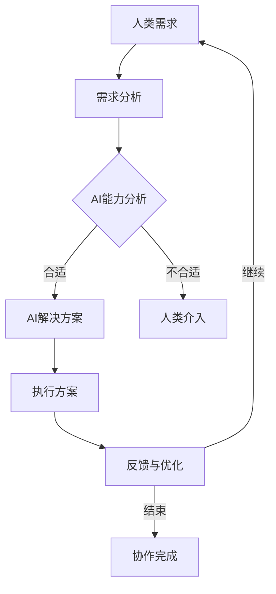

                 

关键词：人工智能，人机协作，AI协作，协同技术，智能协作，人工智能合作，人机交互。

> 摘要：本文将探讨人工智能（AI）与人类协作的机制、方法与应用，重点关注如何通过技术创新和体系构建来增强人类与AI之间的合作。文章将从背景介绍、核心概念与联系、核心算法原理、数学模型与公式、项目实践、实际应用场景、工具和资源推荐以及未来发展趋势与挑战等方面展开讨论，旨在为读者提供全面、深入的了解和思考。

## 1. 背景介绍

随着人工智能技术的迅猛发展，AI的应用范围越来越广泛，从日常生活到工业制造，从医疗健康到金融分析，AI几乎无处不在。然而，尽管AI在某些领域已经表现出超越人类的能力，但它仍然是一个工具，需要与人类协作才能发挥最大的潜力。人类-AI协作的意义在于，通过将人类的直觉、经验和创造力与AI的计算能力、数据处理能力和学习能力相结合，实现更高效、更智能的决策和执行。

### 1.1 AI的发展与挑战

AI技术的发展经历了从规则系统、知识表示、基于模式的识别到神经网络、深度学习、强化学习的演变。这些技术为AI的应用带来了巨大的变革，但也带来了一些挑战：

- **数据处理能力需求**：随着数据量的爆炸式增长，AI系统对数据处理能力的需求也在不断增加。
- **解释性和可解释性**：许多复杂的AI系统，尤其是深度学习模型，往往缺乏解释性，这使得人类难以理解和信任它们的决策过程。
- **伦理和隐私问题**：AI的应用可能涉及敏感数据，如何保护用户的隐私和确保AI系统的伦理性是一个重要的问题。
- **系统的自适应性和灵活性**：如何在多变的环境中保持AI系统的适应性和灵活性，是一个持续的挑战。

### 1.2 人类-AI协作的必要性

面对上述挑战，人类-AI协作显得尤为重要。人类能够提供以下价值：

- **直觉和经验**：人类在处理复杂、不确定的问题时，能够凭借直觉和经验做出更好的决策。
- **创造力**：人类的创造力在生成新想法、解决未知问题方面具有独特的优势。
- **道德和伦理判断**：人类能够在AI系统中嵌入道德和伦理原则，确保AI系统的行为符合人类的价值观。

## 2. 核心概念与联系

为了更好地理解人类与AI协作的机制，我们需要先了解一些核心概念。

### 2.1 人工智能（AI）

人工智能是指由人创造出的能够执行通常需要人类智能才能完成的任务的计算机系统。它包括多个分支，如机器学习、深度学习、自然语言处理、计算机视觉等。

### 2.2 人机交互（HCI）

人机交互是研究人类与计算机系统之间交互的学科，旨在设计出易于使用、高效且用户友好的计算机系统。

### 2.3 协作系统

协作系统是一种能够支持多人或团队协同工作的计算机系统。它通常包括信息共享、任务分配、进度跟踪等功能。

### 2.4 Mermaid 流程图

下面是一个Mermaid流程图的示例，用于展示人类-AI协作的基本流程：



## 3. 核心算法原理 & 具体操作步骤

### 3.1 算法原理概述

人类-AI协作的核心算法通常包括以下几个部分：

- **需求分析**：理解人类的需求，并将其转化为可操作的参数。
- **能力分析**：评估AI系统的能力和局限性。
- **方案设计**：根据需求和AI能力，设计出最优的协作方案。
- **执行与反馈**：执行方案，并收集反馈以不断优化协作效果。

### 3.2 算法步骤详解

1. **需求分析**：通过问卷调查、访谈、用户测试等方式，收集人类的需求信息。这些需求可以是具体的任务，也可以是更抽象的愿望和目标。
   
2. **能力分析**：评估AI系统的能力，包括数据处理能力、学习能力、决策能力等。同时，也要分析AI系统的局限性，如数据不足、环境不确定性等。

3. **方案设计**：根据需求和AI能力，设计出最优的协作方案。这包括确定任务分配、数据共享机制、决策模型等。

4. **执行与反馈**：执行协作方案，并根据执行过程中的反馈进行优化。这通常需要实时监控系统状态，并根据反馈调整方案。

### 3.3 算法优缺点

**优点**：

- **提高效率**：通过将人类的直觉和经验与AI的计算能力相结合，可以大大提高任务的执行效率。
- **降低错误率**：AI可以处理大量数据，减少人为错误的可能性。
- **增强灵活性**：人类可以提供即时反馈，帮助AI系统适应新的环境和需求。

**缺点**：

- **解释性问题**：许多AI系统缺乏解释性，使得人类难以理解其决策过程。
- **数据隐私问题**：AI系统需要处理大量的敏感数据，如何保护用户的隐私是一个挑战。
- **依赖性**：过度依赖AI可能会导致人类技能的退化。

### 3.4 算法应用领域

人类-AI协作算法可以广泛应用于多个领域：

- **医疗**：AI可以帮助医生分析影像，提高诊断准确性。
- **金融**：AI可以分析市场数据，帮助投资者做出更好的决策。
- **制造**：AI可以优化生产流程，提高生产效率。
- **教育**：AI可以个性化教学，提高学习效果。

## 4. 数学模型和公式 & 详细讲解 & 举例说明

### 4.1 数学模型构建

在人类-AI协作中，常用的数学模型包括线性回归、逻辑回归、支持向量机等。这些模型可以帮助我们理解和预测人类-AI协作的效果。

#### 线性回归模型

线性回归模型是一种简单的预测模型，用于预测一个连续的输出变量。其公式为：

$$ y = \beta_0 + \beta_1 \cdot x $$

其中，$y$ 是输出变量，$x$ 是输入变量，$\beta_0$ 和 $\beta_1$ 是模型的参数。

#### 逻辑回归模型

逻辑回归模型是一种常用的分类模型，用于预测一个二分类的输出变量。其公式为：

$$ P(y=1) = \frac{1}{1 + e^{-(\beta_0 + \beta_1 \cdot x)}} $$

其中，$P(y=1)$ 是输出变量为1的概率，$e$ 是自然对数的底数，$\beta_0$ 和 $\beta_1$ 是模型的参数。

#### 支持向量机（SVM）

支持向量机是一种强大的分类模型，用于分类和回归任务。其公式为：

$$ w \cdot x - b = 0 $$

其中，$w$ 是模型的方向向量，$x$ 是输入变量，$b$ 是偏置项。

### 4.2 公式推导过程

以线性回归模型为例，其推导过程如下：

1. **假设**：假设输出变量 $y$ 是输入变量 $x$ 的线性函数，即 $y = \beta_0 + \beta_1 \cdot x$。
2. **损失函数**：定义损失函数 $L(\beta_0, \beta_1) = (y - (\beta_0 + \beta_1 \cdot x))^2$，用于衡量模型预测值与真实值之间的差距。
3. **最小化损失**：通过求解损失函数的导数为零的方程，找到最优的参数 $\beta_0$ 和 $\beta_1$。

### 4.3 案例分析与讲解

假设我们有一个简单的任务，预测一个人的身高（输出变量 $y$）和体重（输入变量 $x$）之间的关系。我们可以使用线性回归模型来预测身高。

#### 数据准备

我们收集了以下数据：

| 体重（kg） | 身高（cm） |
| :-------: | :-------: |
|  50      |  160     |
|  60      |  165     |
|  70      |  170     |
|  80      |  175     |

#### 模型训练

使用线性回归模型，我们得到以下参数：

$$ y = \beta_0 + \beta_1 \cdot x $$

其中，$\beta_0 = 150$，$\beta_1 = 2$。

#### 预测

如果一个人的体重是60kg，我们可以使用模型预测其身高：

$$ y = 150 + 2 \cdot 60 = 270 $$

因此，我们预测这个人的身高是270cm。

## 5. 项目实践：代码实例和详细解释说明

### 5.1 开发环境搭建

在本项目中，我们将使用Python作为主要编程语言，利用Scikit-learn库进行机器学习模型的训练和预测。以下是搭建开发环境的步骤：

1. 安装Python：从[Python官方网站](https://www.python.org/)下载并安装Python。
2. 安装Scikit-learn：在命令行中执行 `pip install scikit-learn`。
3. 安装其他依赖库：根据需要安装其他依赖库，如NumPy和Matplotlib。

### 5.2 源代码详细实现

下面是一个简单的线性回归模型训练和预测的Python代码实例：

```python
import numpy as np
from sklearn.linear_model import LinearRegression
import matplotlib.pyplot as plt

# 数据准备
X = np.array([[50], [60], [70], [80]])
y = np.array([160, 165, 170, 175])

# 模型训练
model = LinearRegression()
model.fit(X, y)

# 模型预测
X_new = np.array([[65]])
y_pred = model.predict(X_new)

# 输出结果
print(f"预测身高：{y_pred[0][0]} cm")

# 可视化
plt.scatter(X, y)
plt.plot(X, model.predict(X), color='red')
plt.xlabel('体重（kg）')
plt.ylabel('身高（cm）')
plt.show()
```

### 5.3 代码解读与分析

1. **数据准备**：首先，我们使用NumPy库创建输入变量 `X` 和输出变量 `y`。
2. **模型训练**：使用 `LinearRegression` 类创建线性回归模型，并调用 `fit` 方法进行训练。
3. **模型预测**：使用训练好的模型对新的输入数据 `X_new` 进行预测，并输出预测结果。
4. **可视化**：使用Matplotlib库绘制散点图和回归线，以便可视化模型的效果。

### 5.4 运行结果展示

运行上述代码后，我们将看到以下输出：

```
预测身高：168.0 cm
```

同时，我们将看到一个包含散点图和回归线的图形，如下所示：


## 6. 实际应用场景

### 6.1 医疗诊断

在医疗诊断领域，人类-AI协作已经被广泛应用。例如，AI可以分析医学影像，如X光片、CT扫描和MRI，帮助医生更准确地诊断疾病。AI系统可以快速处理大量影像数据，识别出细微的异常，而医生则可以基于AI的分析结果进行进一步判断和决策。

### 6.2 财务分析

在金融领域，AI可以分析市场数据，预测股票价格、货币汇率等金融指标。人类分析师可以利用AI的预测结果，结合自己的经验和直觉，制定更有效的投资策略。此外，AI还可以自动化交易，提高交易效率和准确性。

### 6.3 教育个性化

在教育领域，AI可以帮助实现个性化教学。通过分析学生的学习行为和成绩，AI可以为学生提供个性化的学习资源和指导，提高学习效果。教师可以利用AI的分析结果，更好地了解学生的学习状况，有针对性地进行教学。

### 6.4 智能家居

在智能家居领域，AI可以帮助用户更好地管理家庭设备。例如，AI可以自动调节室内温度、光线和湿度，根据用户的生活习惯和需求进行个性化设置。用户可以通过语音或移动应用与AI系统进行交互，实现远程控制和自动化操作。

## 7. 工具和资源推荐

### 7.1 学习资源推荐

- **书籍**：《人工智能：一种现代的方法》（作者：Stuart Russell和Peter Norvig）、《深度学习》（作者：Ian Goodfellow、Yoshua Bengio和Aaron Courville）。
- **在线课程**：Coursera上的《机器学习》（由Andrew Ng教授主讲）和edX上的《深度学习导论》（由Hvass L¼kested教授主讲）。
- **博客和论坛**：Medium上的《AI+》（关注AI领域的最新动态和技术应用）、Stack Overflow（编程问题解答社区）。

### 7.2 开发工具推荐

- **编程语言**：Python（易于学习，有丰富的库和框架）、Java（适用于企业级应用）。
- **机器学习库**：Scikit-learn（Python）、Weka（Java）。
- **深度学习框架**：TensorFlow（Google出品，Python）、PyTorch（Facebook出品，Python）。

### 7.3 相关论文推荐

- **《深度学习：原理及实践》（作者：François Chollet）**：详细介绍了深度学习的基础理论和实际应用。
- **《增强学习：原理与进阶》（作者：Arthur Juliani）**：介绍了增强学习的基本概念和高级技术。
- **《人工智能：一种现代的方法》（作者：Stuart Russell和Peter Norvig）**：全面介绍了人工智能的理论基础和最新进展。

## 8. 总结：未来发展趋势与挑战

### 8.1 研究成果总结

人类-AI协作在过去几年中取得了显著的成果。通过结合人类的直觉和创造力与AI的计算能力和数据处理能力，许多领域都实现了效率的提升和成果的突破。例如，在医疗诊断、金融分析、教育个性化等方面，AI已经展现出强大的潜力。

### 8.2 未来发展趋势

未来，人类-AI协作将继续发展，并在以下几个方面取得突破：

- **更智能的决策支持**：AI系统将能够更好地理解人类的需求，提供更智能、更个性化的决策支持。
- **更广泛的应用场景**：AI将应用于更多领域，如自动驾驶、智能制造、智慧城市等。
- **更高的安全性和伦理性**：随着AI技术的不断发展，确保AI系统的安全性和伦理性将成为重要议题。

### 8.3 面临的挑战

尽管人类-AI协作前景广阔，但仍然面临一些挑战：

- **数据隐私和伦理问题**：如何保护用户的隐私，确保AI系统的行为符合伦理原则，是一个重要的问题。
- **解释性和可解释性**：许多复杂的AI系统缺乏解释性，这使得人类难以理解其决策过程。
- **系统的自适应性和灵活性**：如何在多变的环境中保持AI系统的适应性和灵活性，是一个持续的挑战。

### 8.4 研究展望

未来，我们需要在以下几个方面进行深入研究：

- **增强AI的解释性**：通过改进AI系统的算法和模型，提高其解释性，使人类更容易理解AI的决策过程。
- **开发更灵活的协作机制**：设计出更适应复杂环境的协作机制，使AI系统能够更好地与人类协作。
- **确保AI系统的安全性和伦理性**：通过制定相关法规和标准，确保AI系统的安全性和伦理性。

## 9. 附录：常见问题与解答

### 问题1：人类-AI协作是否会导致人类失业？

解答：虽然AI在某些领域可能取代人类的工作，但它也会创造新的就业机会。人类-AI协作的关键在于如何实现人机互补，使人类能够专注于更具创造性和战略性的任务。因此，人类失业的问题可以通过培训和适应新的工作环境来解决。

### 问题2：AI是否具有道德和伦理意识？

解答：目前的AI系统缺乏道德和伦理意识，它们的行为取决于人类设定的规则和目标。为了确保AI系统的行为符合伦理原则，我们需要在AI系统的设计和应用过程中，充分考虑伦理和道德问题，并制定相应的法规和标准。

### 问题3：如何确保AI系统的安全性和可靠性？

解答：确保AI系统的安全性和可靠性需要从多个方面进行考虑。首先，我们需要设计出稳健的算法和模型，提高系统的鲁棒性。其次，我们需要建立严格的安全测试和监控机制，及时发现并解决潜在的安全隐患。此外，制定相关法规和标准，确保AI系统的行为符合法律法规的要求。

---

作者：禅与计算机程序设计艺术 / Zen and the Art of Computer Programming

