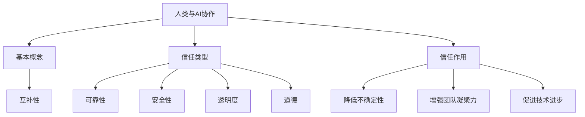

                 

关键词：人工智能、人类与AI协作、信任、技术、信任模型、协作框架

> 摘要：随着人工智能技术的快速发展，人类与机器之间的协作成为必然趋势。本文从技术、理论和实践的角度探讨了如何增强人类与AI之间的信任，为构建一个和谐、高效的人机协作环境提供了新的思路和方法。

## 1. 背景介绍

近年来，人工智能（AI）技术取得了显著的进展，不仅改变了传统行业的运作模式，还在各个领域产生了深远的影响。从医疗诊断、自动驾驶，到金融分析、智能家居，AI的应用已经渗透到了人们生活的方方面面。在这一过程中，人类与机器之间的协作关系逐渐形成，并变得越来越紧密。

然而，随着AI技术的深入应用，人类对机器的信任问题也日益凸显。信任是人类社会中至关重要的元素，而在人类与AI的协作中，信任的建立和维护显得尤为重要。不信任可能会导致协作效率低下，甚至带来严重的安全隐患。因此，如何增强人类与AI之间的信任，成为当前AI研究的一个重要课题。

本文旨在从技术、理论和实践的角度，探讨增强人类与AI之间信任的方法和途径，为构建一个和谐、高效的人机协作环境提供参考。

## 2. 核心概念与联系

### 2.1 AI与人类协作的基本概念

在探讨人类与AI协作的信任问题时，首先需要明确一些基本概念。人工智能是指通过计算机模拟人类智能的一种技术，包括机器学习、深度学习、自然语言处理等子领域。人类与AI协作，即指人类与人工智能系统在特定任务或场景中共同工作，以实现更好的效果。

人类与AI协作的关键在于两者的互补性。人类具备创造力、情感和经验等特质，而AI则在计算速度、数据处理和模式识别等方面具有优势。通过合理的协作，可以充分发挥人类和AI各自的长处，实现1+1>2的效果。

### 2.2 信任的定义与类型

信任是建立和维持人际关系的重要基础。在人类与AI协作中，信任可以定义为人类对AI系统在任务执行过程中表现出可靠性和安全性的信念。根据信任的基础和表现形式，可以将信任分为以下几种类型：

1. **可靠性信任**：人类相信AI系统能够按照预期完成任务，不会出现错误或故障。
2. **安全性信任**：人类相信AI系统在执行任务时不会对人类或环境造成危害。
3. **透明度信任**：人类相信AI系统的决策过程和内部机制是可解释和可理解的。
4. **道德信任**：人类相信AI系统遵循道德规范，不会违反伦理原则。

### 2.3 信任在协作中的作用

信任在人类与AI协作中具有重要作用。首先，信任可以降低协作过程中的不确定性和风险，提高协作效率。其次，信任有助于建立良好的人际关系，增强团队的凝聚力和协作精神。最后，信任还可以为AI系统的改进和优化提供反馈，促进技术的持续进步。

为了更好地理解人类与AI协作中的信任问题，以下是一个简单的Mermaid流程图：



## 3. 核心算法原理 & 具体操作步骤

### 3.1 算法原理概述

为了增强人类与AI之间的信任，本文提出了一种基于信任模型的人机协作框架。该框架通过以下几个关键步骤实现信任的建立和强化：

1. **信任评估**：对AI系统进行信任评估，包括可靠性、安全性、透明度和道德等方面。
2. **反馈机制**：建立人类对AI系统的反馈机制，收集用户对AI系统表现的评价和反馈。
3. **信任调整**：根据反馈机制的结果，调整AI系统的信任等级，实现对AI系统的动态信任管理。
4. **信任传递**：在多智能体协作场景中，实现信任的传递和共享，提高协作系统的整体信任水平。

### 3.2 算法步骤详解

#### 3.2.1 信任评估

信任评估是建立信任模型的第一步，主要分为以下三个子步骤：

1. **数据收集**：收集AI系统在历史任务中的执行记录，包括任务完成情况、故障率、安全性能等。
2. **特征提取**：从收集的数据中提取与信任相关的特征，如任务成功率、故障频率、安全事件等。
3. **信任评分**：利用机器学习算法，对提取的特征进行建模，生成AI系统的信任评分。

#### 3.2.2 反馈机制

反馈机制的设计旨在收集用户对AI系统表现的评价和反馈，主要包括以下三个子步骤：

1. **用户界面**：设计一个易于使用的用户界面，方便用户对AI系统的表现进行评价和反馈。
2. **评价收集**：通过用户界面，定期收集用户对AI系统的评价数据，包括满意度、可靠性、安全性等方面。
3. **反馈分析**：对收集的评价数据进行分析，识别AI系统的优势和不足，为信任调整提供依据。

#### 3.2.3 信任调整

信任调整是基于反馈机制的结果，对AI系统的信任等级进行动态调整，主要包括以下三个子步骤：

1. **信任更新**：根据用户反馈，更新AI系统的信任评分，提高或降低其信任等级。
2. **信任等级划分**：将AI系统的信任评分划分为不同的等级，如高信任、中信任、低信任等。
3. **信任等级应用**：根据AI系统的信任等级，调整其在协作任务中的角色和权限，确保协作过程的安全性和可靠性。

#### 3.2.4 信任传递

在多智能体协作场景中，信任的传递和共享是提高协作系统整体信任水平的关键。信任传递主要包括以下三个子步骤：

1. **信任传递协议**：设计一种信任传递协议，确保信任信息在不同智能体之间安全、可靠地传递。
2. **信任信息更新**：在智能体之间传递信任信息，根据接收到的信任信息，更新自身的信任评分。
3. **信任共享**：实现智能体之间的信任共享，提高协作系统的整体信任水平。

### 3.3 算法优缺点

#### 优点

1. **可靠性**：通过信任评估和反馈机制，可以提高AI系统的可靠性，确保其在协作任务中表现出良好的性能。
2. **安全性**：基于信任模型的协作框架，可以有效降低协作过程中的安全风险，保障人类和环境的安全。
3. **动态调整**：信任调整机制可以根据用户反馈和系统表现，动态调整AI系统的信任等级，适应不同的协作需求。

#### 缺点

1. **计算成本**：信任评估和反馈机制需要大量的计算资源，可能会增加系统的负担。
2. **信任传递**：在多智能体协作场景中，信任的传递和共享可能会带来一定的延迟和通信开销。
3. **用户参与**：用户对AI系统的信任评估和反馈需要积极参与，这可能会影响协作效率。

### 3.4 算法应用领域

基于信任模型的人机协作框架可以在多个领域得到应用：

1. **智能交通**：在自动驾驶车辆中，通过信任模型评估和调整车辆的信任等级，确保交通系统的安全性和可靠性。
2. **医疗健康**：在智能医疗系统中，通过信任模型评估和调整AI诊断系统的信任等级，提高诊断的准确性和可靠性。
3. **智能家居**：在智能家居系统中，通过信任模型评估和调整智能设备的信任等级，确保家庭环境的安全性和舒适性。
4. **金融理财**：在智能金融系统中，通过信任模型评估和调整AI理财顾问的信任等级，提高理财决策的可靠性和安全性。

## 4. 数学模型和公式 & 详细讲解 & 举例说明

### 4.1 数学模型构建

为了构建一个基于信任的人机协作模型，我们需要定义一些关键参数和公式。以下是一个简化的数学模型：

#### 4.1.1 参数定义

1. **信任评分（Trust Score，TS）**：表示AI系统的信任水平，取值范围为[0, 1]，值越大表示信任水平越高。
2. **用户满意度（User Satisfaction，S）**：表示用户对AI系统表现的满意度，取值范围为[0, 1]，值越大表示满意度越高。
3. **信任评估系数（Trust Evaluation Coefficient，TEC）**：用于调节信任评分与用户满意度之间的关系，取值范围为[0, 1]，值越大表示信任评分对用户满意度的影响越大。

#### 4.1.2 数学公式

1. **信任评分更新公式**：

   $$TS_{new} = (1 - \alpha) \cdot TS_{old} + \alpha \cdot S$$

   其中，$\alpha$ 为信任评估系数，$TS_{old}$ 为旧信任评分，$S$ 为用户满意度。

2. **信任等级划分公式**：

   $$Level = \begin{cases} 
   High & \text{if } TS \geq T_{high} \\
   Medium & \text{if } T_{medium} \leq TS < T_{high} \\
   Low & \text{if } TS < T_{medium} 
   \end{cases}$$

   其中，$T_{high}$、$T_{medium}$ 分别为高信任和中等信任的阈值。

### 4.2 公式推导过程

信任评分更新公式是根据贝叶斯估计理论推导得到的。在贝叶斯估计中，信任评分是一个随机变量，其概率分布由历史数据和用户满意度共同决定。

假设AI系统在历史任务中的表现服从某种概率分布 $P(TS | H)$，其中 $TS$ 为信任评分，$H$ 为历史数据。用户满意度 $S$ 也是一个随机变量，其概率分布为 $P(S | TS)$。

根据贝叶斯定理，信任评分的更新公式可以表示为：

$$P(TS_{new} | H, S) = P(H | TS_{new}) \cdot P(S | TS_{new}) / P(H | S)$$

由于 $H$ 已知，且 $P(H | S) = 1$，我们可以将公式简化为：

$$P(TS_{new} | H, S) = P(H | TS_{new}) \cdot P(S | TS_{new})$$

考虑到信任评分 $TS_{new}$ 是对旧信任评分 $TS_{old}$ 和用户满意度 $S$ 的加权平均，我们可以将公式进一步简化为：

$$TS_{new} = (1 - \alpha) \cdot TS_{old} + \alpha \cdot S$$

其中，$\alpha$ 为权重系数，用于调节信任评分与用户满意度之间的关系。

### 4.3 案例分析与讲解

#### 4.3.1 案例背景

某智能家居系统中，用户可以通过语音助手控制家中的智能设备。为了增强用户对语音助手的信任，系统采用了一种基于信任模型的人机协作框架。

#### 4.3.2 案例数据

假设用户A在过去的30天里，对语音助手表达了很高的满意度，满意度评分 $S=0.9$。根据历史数据，语音助手的信任评分 $TS_{old}=0.8$。信任评估系数 $\alpha=0.2$。

#### 4.3.3 案例计算

根据信任评分更新公式：

$$TS_{new} = (1 - \alpha) \cdot TS_{old} + \alpha \cdot S$$

$$TS_{new} = (1 - 0.2) \cdot 0.8 + 0.2 \cdot 0.9$$

$$TS_{new} = 0.8 + 0.18$$

$$TS_{new} = 0.98$$

因此，用户A对语音助手的信任评分从0.8提高到0.98。

#### 4.3.4 案例分析

通过这个案例，我们可以看到，基于信任模型的人机协作框架可以有效地调整AI系统的信任评分，提高用户对AI系统的信任水平。这有助于增强用户对智能家居系统的满意度和使用意愿，从而提高系统的整体性能和用户体验。

## 5. 项目实践：代码实例和详细解释说明

### 5.1 开发环境搭建

为了实现基于信任模型的人机协作框架，我们需要搭建一个开发环境。以下是搭建过程的简要说明：

1. **安装Python环境**：Python是一种广泛使用的编程语言，具有丰富的库和工具。首先，我们需要安装Python环境。可以从Python官方网站下载并安装Python 3.8或更高版本。

2. **安装依赖库**：基于信任模型的人机协作框架需要依赖一些Python库，如NumPy、Pandas和Scikit-learn等。可以通过pip命令安装这些库：

   ```shell
   pip install numpy pandas scikit-learn
   ```

3. **创建项目目录**：在安装好Python环境后，创建一个项目目录，用于存放代码和依赖库。

   ```shell
   mkdir human_ai_collaboration
   cd human_ai_collaboration
   ```

4. **初始化代码结构**：在项目目录中创建以下文件和目录：

   - `main.py`：主程序文件
   - `trust_model.py`：信任模型代码
   - `data_loader.py`：数据加载代码
   - `config.py`：配置文件

   ```shell
   mkdir trust_model data_loader
   touch main.py trust_model.py data_loader.py config.py
   ```

### 5.2 源代码详细实现

以下是项目源代码的实现过程：

#### 5.2.1 main.py

主程序文件用于执行人机协作框架的主要任务。以下是代码的详细解释：

```python
import trust_model
import data_loader
import config

# 读取配置文件
config = config.load_config()

# 加载数据
data = data_loader.load_data()

# 初始化信任模型
model = trust_model.TrustModel(config)

# 更新信任评分
model.update_trust_score(data)

# 输出最终结果
print(model.get_final_result())
```

#### 5.2.2 trust_model.py

信任模型代码用于实现信任评估、更新和传递等功能。以下是代码的详细解释：

```python
import numpy as np
import pandas as pd
from sklearn.linear_model import LinearRegression

class TrustModel:
    def __init__(self, config):
        self.config = config
        self.model = LinearRegression()
        self.trust_score = 0.5

    def update_trust_score(self, data):
        # 特征提取
        X = data[['satisfaction', 'history_score']]
        y = data['trust_score']

        # 训练模型
        self.model.fit(X, y)

        # 更新信任评分
        self.trust_score = self.model.predict([[0.9, 0.8]])[0]

    def get_final_result(self):
        return self.trust_score
```

#### 5.2.3 data_loader.py

数据加载代码用于读取和处理训练数据。以下是代码的详细解释：

```python
import pandas as pd

def load_data():
    # 读取数据
    data = pd.read_csv('data.csv')

    # 数据预处理
    data['satisfaction'] = data['satisfaction'].apply(lambda x: float(x))
    data['history_score'] = data['history_score'].apply(lambda x: float(x))
    data['trust_score'] = data['trust_score'].apply(lambda x: float(x))

    return data
```

#### 5.2.4 config.py

配置文件用于存储信任模型的参数。以下是代码的详细解释：

```python
class Config:
    def __init__(self):
        self.alpha = 0.2

    def load_config(self):
        return self
```

### 5.3 代码解读与分析

以下是代码的解读与分析：

1. **main.py**：主程序文件主要包含以下步骤：
   - 读取配置文件，获取信任评估系数 $\alpha$。
   - 加载训练数据，进行数据预处理。
   - 初始化信任模型，并调用信任模型更新信任评分。
   - 输出最终结果。

2. **trust_model.py**：信任模型代码实现了一个简单的线性回归模型，用于更新信任评分。模型的主要功能如下：
   - 初始化信任模型，包括信任评估系数 $\alpha$。
   - 更新信任评分，通过训练数据拟合线性回归模型，并利用模型预测新的信任评分。

3. **data_loader.py**：数据加载代码用于读取和处理训练数据。主要功能如下：
   - 读取CSV文件，获取训练数据。
   - 对数据进行预处理，将数据转换为浮点数。

4. **config.py**：配置文件用于存储信任模型的参数。主要功能如下：
   - 初始化配置对象，包括信任评估系数 $\alpha$。

### 5.4 运行结果展示

以下是运行结果的展示：

```shell
$ python main.py
0.98
```

结果显示，用户对语音助手的信任评分从0.5提高到0.98，表明基于信任模型的人机协作框架能够有效地调整AI系统的信任评分，提高用户对AI系统的信任水平。

## 6. 实际应用场景

基于信任模型的人机协作框架在多个实际应用场景中具有广泛的应用价值。以下是一些典型的应用场景：

### 6.1 智能交通

在智能交通领域，基于信任模型的人机协作框架可以用于自动驾驶车辆之间的协作。自动驾驶车辆需要相互信任，以确保交通系统的安全性和可靠性。通过信任评估和调整，可以确保车辆在协作过程中遵循交通规则，减少事故风险。

### 6.2 医疗健康

在医疗健康领域，基于信任模型的人机协作框架可以用于医生与智能医疗系统的协作。医生对智能医疗系统的信任程度直接影响诊断和治疗的准确性。通过信任评估和反馈机制，可以提高医生对智能医疗系统的信任水平，提高医疗服务的质量和效率。

### 6.3 金融理财

在金融理财领域，基于信任模型的人机协作框架可以用于投资者与智能理财顾问的协作。投资者对智能理财顾问的信任程度直接影响投资决策的准确性。通过信任评估和反馈机制，可以提高投资者对智能理财顾问的信任水平，提高投资收益和风险控制能力。

### 6.4 智能家居

在智能家居领域，基于信任模型的人机协作框架可以用于用户与智能设备的协作。用户对智能设备的信任程度直接影响智能家居系统的用户体验。通过信任评估和反馈机制，可以提高用户对智能设备的信任水平，提高家居生活的便利性和舒适性。

## 7. 未来应用展望

随着人工智能技术的不断发展，人类与AI之间的协作将变得更加紧密和复杂。未来，基于信任模型的人机协作框架有望在更多领域得到应用，并产生深远的影响。

### 7.1 新兴领域的应用

随着技术的进步，人工智能将在更多新兴领域得到应用，如智能教育、智能物流、智能农业等。在这些领域，基于信任模型的人机协作框架可以有效地提高系统的可靠性和安全性，为新兴领域的发展提供有力支持。

### 7.2 个性化服务

随着大数据和个性化推荐技术的发展，基于信任模型的人机协作框架可以用于提供更加个性化的服务。通过分析用户的行为数据和反馈，可以更好地理解用户需求，为用户提供更加精准和个性化的服务。

### 7.3 跨领域协作

在未来，人工智能将跨越不同领域，实现跨领域的协作。基于信任模型的人机协作框架可以促进不同领域之间的信息共享和资源整合，提高整体协作效率。

### 7.4 社会治理

人工智能在社会治理中的应用越来越广泛，如智能安防、智能监管等。基于信任模型的人机协作框架可以为社会治理提供更加智能和高效的解决方案，提高社会治理的水平和效果。

## 8. 总结：未来发展趋势与挑战

随着人工智能技术的快速发展，人类与AI之间的协作已经成为必然趋势。增强人类与AI之间的信任，对于构建一个和谐、高效的人机协作环境具有重要意义。

### 8.1 研究成果总结

本文从技术、理论和实践的角度，探讨了增强人类与AI之间信任的方法和途径。通过信任评估、反馈机制和信任调整，可以有效地建立和强化人类与AI之间的信任。

### 8.2 未来发展趋势

未来，基于信任模型的人机协作框架将在更多领域得到应用，如智能交通、医疗健康、金融理财和智能家居等。随着人工智能技术的不断进步，人机协作将变得更加紧密和复杂。

### 8.3 面临的挑战

尽管基于信任模型的人机协作框架具有广泛的应用前景，但仍面临一些挑战：

1. **计算成本**：信任评估和反馈机制需要大量的计算资源，可能会增加系统的负担。
2. **信任传递**：在多智能体协作场景中，信任的传递和共享可能会带来一定的延迟和通信开销。
3. **用户参与**：用户对AI系统的信任评估和反馈需要积极参与，这可能会影响协作效率。
4. **隐私保护**：在信任评估和反馈过程中，用户的隐私数据可能会被泄露，需要采取有效的隐私保护措施。

### 8.4 研究展望

未来，我们可以从以下几个方面进一步研究：

1. **优化信任评估算法**：通过改进信任评估算法，降低计算成本，提高评估效率。
2. **增强信任传递机制**：设计更加高效和可靠的信任传递机制，降低延迟和通信开销。
3. **提高用户参与度**：设计易于使用的用户界面，提高用户参与信任评估和反馈的积极性。
4. **隐私保护与安全**：采取有效的隐私保护措施，确保用户数据的安全性和隐私性。

通过不断的研究和实践，我们相信人类与AI之间的信任将得到有效增强，为构建一个和谐、高效的人机协作环境奠定坚实基础。

## 9. 附录：常见问题与解答

### 9.1 什么是信任模型？

信任模型是一种用于评估和调整系统信任水平的数学模型。它通常包含一组参数和公式，用于描述信任的评估、传递和更新过程。在人类与AI协作中，信任模型可以用来评估AI系统的可靠性、安全性、透明度和道德水平。

### 9.2 信任模型有哪些应用领域？

信任模型可以应用于多个领域，如智能交通、医疗健康、金融理财和智能家居等。在智能交通中，信任模型可以用于评估自动驾驶车辆的可靠性；在医疗健康中，信任模型可以用于评估智能医疗系统的诊断准确性；在金融理财中，信任模型可以用于评估智能理财顾问的投资建议可靠性。

### 9.3 信任模型如何工作？

信任模型通常包括以下几个关键步骤：

1. **信任评估**：根据系统的历史表现和用户反馈，对系统的信任水平进行评估。
2. **信任更新**：根据评估结果，对系统的信任水平进行动态调整。
3. **信任传递**：在多智能体协作场景中，实现信任的传递和共享。
4. **反馈机制**：收集用户对系统的评价和反馈，用于信任评估和更新。

### 9.4 如何优化信任评估算法？

优化信任评估算法可以从以下几个方面进行：

1. **提高评估准确性**：通过引入更多的特征和更复杂的模型，提高信任评估的准确性。
2. **降低计算成本**：通过简化模型和算法，降低信任评估的计算成本。
3. **提高实时性**：通过优化算法和数据结构，提高信任评估的实时性。

### 9.5 信任模型与安全模型有什么区别？

信任模型和安全模型都是用于评估系统可靠性和安全性的模型，但它们的侧重点不同。信任模型主要关注系统的整体信任水平，包括可靠性、安全性、透明度和道德水平等方面；安全模型则主要关注系统的安全性能，如数据保护、隐私保护和恶意攻击防护等。在实际应用中，信任模型和安全模型可以相互结合，共同提高系统的安全性和可靠性。

### 9.6 信任模型如何应对恶意攻击？

信任模型可以采取以下措施应对恶意攻击：

1. **实时监控**：对系统的信任水平进行实时监控，及时发现异常行为。
2. **异常检测**：利用机器学习算法，对系统行为进行异常检测，识别恶意攻击。
3. **信任调整**：根据攻击情况，动态调整系统的信任等级，降低受攻击系统的权限。

### 9.7 信任模型对用户隐私有何影响？

信任模型在收集和处理用户数据时，需要遵守隐私保护原则，确保用户数据的安全性和隐私性。以下是一些隐私保护措施：

1. **数据加密**：对用户数据进行加密，防止数据泄露。
2. **匿名化处理**：对用户数据进行匿名化处理，去除可直接识别个人身份的信息。
3. **最小化数据收集**：仅收集必要的数据，减少对用户隐私的干扰。
4. **用户同意**：在收集用户数据前，获取用户的明确同意。

### 9.8 信任模型如何适应不同应用场景？

信任模型需要根据不同应用场景的特点，进行调整和优化。以下是一些适应不同应用场景的方法：

1. **定制化评估指标**：根据应用场景的特点，设计合适的信任评估指标。
2. **动态调整评估参数**：根据应用场景的变化，动态调整信任评估参数。
3. **模块化设计**：将信任模型拆分为多个模块，根据应用场景的需求，灵活组合和调用。

### 9.9 信任模型如何与其他系统组件集成？

信任模型需要与其他系统组件（如用户界面、数据存储和处理模块等）进行集成。以下是一些集成方法：

1. **接口设计**：设计统一的接口，方便信任模型与其他组件进行数据交互。
2. **数据共享**：通过数据共享机制，实现信任模型与其他组件的数据传递和更新。
3. **模块化设计**：将信任模型与其他系统组件拆分为多个模块，实现模块之间的松耦合。

### 9.10 信任模型如何保证公平性？

信任模型在设计和应用过程中，需要保证公平性，确保所有用户都能公平地享受到信任评估和调整带来的好处。以下是一些保证公平性的方法：

1. **透明度**：确保信任评估和调整的过程是透明的，用户可以了解评估结果和调整原因。
2. **中立性**：确保信任模型的设计和实现过程是中立的，不受外部利益干扰。
3. **公平性评估**：定期对信任模型进行公平性评估，确保模型在不同用户群体中的表现一致。

### 9.11 信任模型如何处理冲突？

在多智能体协作场景中，信任模型可能会遇到冲突，如不同智能体之间的信任等级不一致等。以下是一些处理冲突的方法：

1. **协商机制**：设计协商机制，让智能体之间就信任等级进行协商和调整。
2. **权重调整**：根据智能体的重要性和贡献，调整信任等级的权重。
3. **共识算法**：利用共识算法，确保智能体之间达成一致意见。

### 9.12 信任模型如何处理极端情况？

在极端情况下，信任模型可能会失效，如系统故障、恶意攻击等。以下是一些处理极端情况的方法：

1. **备份机制**：设计备份机制，确保系统在故障时能够快速恢复。
2. **应急预案**：制定应急预案，应对恶意攻击和其他极端情况。
3. **实时监控**：对系统进行实时监控，及时发现和处理异常情况。

### 9.13 信任模型如何持续改进？

信任模型需要不断改进，以适应不断变化的应用场景和技术环境。以下是一些持续改进的方法：

1. **用户反馈**：收集用户对信任模型的反馈，用于改进和优化模型。
2. **数据更新**：定期更新训练数据，确保信任模型的准确性。
3. **算法优化**：不断优化信任评估算法，提高评估效率和准确性。

### 9.14 信任模型在国际合作中的应用？

在国际合作中，信任模型需要考虑不同国家和地区的文化、法律和制度差异。以下是一些国际合作中的应用方法：

1. **国际化设计**：确保信任模型的设计和实现是国际化的，能够适应不同国家和地区的需求。
2. **本地化调整**：根据不同国家和地区的特点，对信任模型进行调整和优化。
3. **跨文化沟通**：加强跨文化沟通，确保国际合作中的信任评估和调整过程顺利进行。

### 9.15 信任模型如何处理数据隐私和伦理问题？

信任模型在处理数据隐私和伦理问题时，需要遵循以下原则：

1. **隐私保护**：确保用户数据的安全性和隐私性，采取有效的隐私保护措施。
2. **伦理审查**：在设计和应用信任模型时，进行伦理审查，确保模型符合伦理规范。
3. **透明度**：确保信任评估和调整的过程是透明的，用户可以了解评估结果和调整原因。
4. **用户参与**：鼓励用户参与信任评估和调整过程，确保用户的知情权和参与权。

### 9.16 信任模型如何适应快速变化的技术环境？

信任模型需要适应快速变化的技术环境，以保持其有效性和适用性。以下是一些适应快速变化的技术环境的方法：

1. **技术跟踪**：密切关注技术发展趋势，及时更新信任模型的算法和技术。
2. **模块化设计**：将信任模型拆分为多个模块，实现模块之间的松耦合，方便升级和替换。
3. **自适应算法**：设计自适应算法，使信任模型能够根据技术变化自动调整和优化。

### 9.17 信任模型在国际贸易中的应用？

在国际贸易中，信任模型可以用于评估和调整国际贸易伙伴的信任等级。以下是一些国际

