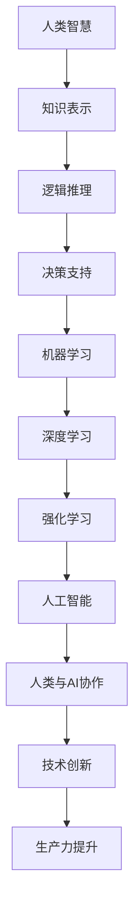

                 

关键词：人类与AI协作、智慧增强、AI智能融合、计算机编程、人工智能、算法、数学模型

> 摘要：本文探讨了人类与AI协作的深度融合，阐述了如何通过增强人类智慧与AI智能的结合，推动技术创新和生产力提升。文章从背景介绍、核心概念与联系、核心算法原理、数学模型和公式、项目实践、实际应用场景、工具和资源推荐、未来发展趋势与挑战等方面，详细剖析了人类-AI协作的路径和策略。

## 1. 背景介绍

随着人工智能（AI）技术的迅猛发展，人类与AI的协作正在逐步成为现实。从简单的自动化任务到复杂的决策支持系统，AI的应用已经深入到各行各业。然而，AI与人类的协作并非一蹴而就，而是需要通过一系列技术手段和策略来优化和提升。本文旨在探讨如何通过增强人类智慧与AI智能的融合，实现更为高效、智能的协作模式。

### 1.1 人工智能的发展历程

人工智能作为计算机科学的一个重要分支，其发展历程可以追溯到20世纪50年代。从最初的逻辑推理和知识表示，到现代的深度学习和强化学习，人工智能技术经历了多次变革。每一次技术革新都推动了人类与机器之间的协作模式不断进化。

### 1.2 人类与AI协作的现状

目前，人类与AI的协作已经在多个领域取得了显著成果。例如，在医疗领域，AI可以通过大数据分析和图像识别，辅助医生进行诊断和治疗；在金融领域，AI可以用于风险评估、股票交易等；在制造业，AI可以优化生产流程、提高生产效率。然而，这些应用仍然处于初级阶段，人类与AI的协作还有很大的提升空间。

## 2. 核心概念与联系

在探讨人类与AI协作的路径之前，我们需要了解一些核心概念和它们之间的联系。以下是一个基于Mermaid绘制的流程图，展示了这些概念之间的关联。



### 2.1 知识表示

知识表示是人工智能的基础，它涉及如何将人类知识转化为计算机可以理解和处理的形式。通过知识表示，人类可以将自己的经验和知识传递给AI系统，使其能够进行逻辑推理和决策支持。

### 2.2 逻辑推理

逻辑推理是AI系统进行决策的重要手段。通过逻辑推理，AI可以分析问题和情境，推导出合理的结论。人类智慧与逻辑推理的结合，可以使得AI更加智能化和适应性强。

### 2.3 决策支持

决策支持系统（DSS）是AI技术在企业管理中的典型应用。通过分析大量数据，DSS可以为人类提供决策建议，帮助企业在复杂的市场环境中做出最优选择。

### 2.4 机器学习

机器学习是AI的核心技术之一，它使得计算机可以通过学习数据来改善自身的性能。人类与机器学习的结合，可以使得AI系统更加智能和灵活。

### 2.5 深度学习

深度学习是机器学习的一个分支，它通过构建多层神经网络，模拟人脑的思考过程。深度学习在图像识别、语音识别等领域取得了显著成果。

### 2.6 强化学习

强化学习是一种通过奖励机制来训练AI系统的学习方法。它使得AI可以在复杂环境中不断优化自身的行为，实现更好的性能。

## 3. 核心算法原理 & 具体操作步骤

### 3.1 算法原理概述

核心算法原理是人类与AI协作的基础，它包括以下几个方面：

1. **知识表示与推理**：通过将人类知识转化为计算机可以理解的形式，实现智能推理。
2. **机器学习**：通过训练模型，使得AI可以自主学习和优化。
3. **深度学习**：利用多层神经网络，模拟人脑的思考过程。
4. **强化学习**：通过奖励机制，优化AI的行为。

### 3.2 算法步骤详解

1. **数据收集与预处理**：收集相关数据，并对数据进行清洗和预处理。
2. **知识表示**：将人类知识转化为计算机可以理解的形式。
3. **模型训练**：利用机器学习或深度学习算法，训练模型。
4. **模型评估**：通过测试数据集，评估模型性能。
5. **模型部署**：将训练好的模型部署到实际应用场景中。

### 3.3 算法优缺点

**优点**：

- **高效性**：AI可以快速处理大量数据，提供决策支持。
- **灵活性**：AI可以根据数据和情境，灵活调整行为。
- **准确性**：通过深度学习和强化学习，AI可以不断提高自身的准确性和适应性。

**缺点**：

- **数据依赖**：AI的性能很大程度上取决于数据的质量和数量。
- **解释性不足**：AI模型往往难以解释其决策过程。
- **隐私和安全**：在数据收集和使用过程中，存在隐私和安全风险。

### 3.4 算法应用领域

- **医疗领域**：利用AI进行疾病诊断、药物研发等。
- **金融领域**：利用AI进行风险评估、股票交易等。
- **制造业**：利用AI优化生产流程、提高生产效率。
- **交通领域**：利用AI进行交通流量分析、自动驾驶等。

## 4. 数学模型和公式 & 详细讲解 & 举例说明

### 4.1 数学模型构建

在人类与AI协作中，数学模型扮演着至关重要的角色。以下是一个简单的线性回归模型，用于预测房价。

$$
y = ax + b
$$

其中，$y$ 是房价，$x$ 是影响房价的各种因素（如面积、位置等），$a$ 和 $b$ 是模型的参数。

### 4.2 公式推导过程

线性回归模型的推导过程如下：

1. **损失函数**：定义损失函数，用于衡量预测值与真实值之间的差距。
$$
L(y, \hat{y}) = \frac{1}{2}(y - \hat{y})^2
$$

2. **梯度下降**：通过梯度下降法，不断调整模型参数，使损失函数最小。
$$
\Delta a = -\alpha \frac{\partial L}{\partial a}, \quad \Delta b = -\alpha \frac{\partial L}{\partial b}
$$

3. **迭代计算**：重复执行梯度下降，直到损失函数收敛。

### 4.3 案例分析与讲解

假设我们有一个房价数据集，包含房屋面积和价格。我们希望通过线性回归模型预测房价。

1. **数据收集与预处理**：收集房屋面积和价格数据，并对数据进行清洗和归一化。
2. **模型训练**：利用训练数据，通过梯度下降法训练模型。
3. **模型评估**：利用测试数据，评估模型性能。
4. **模型应用**：将模型部署到实际场景中，进行房价预测。

通过以上步骤，我们可以构建一个简单的线性回归模型，用于预测房价。当然，实际应用中，模型的构建和优化会更加复杂。

## 5. 项目实践：代码实例和详细解释说明

### 5.1 开发环境搭建

1. **Python环境**：安装Python 3.8及以上版本。
2. **库安装**：安装NumPy、Pandas、Scikit-learn等库。

### 5.2 源代码详细实现

以下是一个简单的线性回归模型实现：

```python
import numpy as np
import pandas as pd
from sklearn.linear_model import LinearRegression

# 数据收集与预处理
data = pd.read_csv('house_price_data.csv')
X = data[['area']]
y = data['price']

# 模型训练
model = LinearRegression()
model.fit(X, y)

# 模型评估
score = model.score(X, y)
print('Model score:', score)

# 模型应用
new_data = np.array([[200]])
predicted_price = model.predict(new_data)
print('Predicted price:', predicted_price)
```

### 5.3 代码解读与分析

1. **数据收集与预处理**：读取房价数据，将面积作为输入特征，价格作为目标变量。
2. **模型训练**：利用线性回归模型进行训练。
3. **模型评估**：计算模型在训练数据上的分数，评估模型性能。
4. **模型应用**：利用训练好的模型，预测新的房价。

通过以上代码，我们可以实现一个简单的线性回归模型，用于房价预测。

## 6. 实际应用场景

### 6.1 医疗领域

在医疗领域，AI可以帮助医生进行疾病诊断、药物研发和治疗方案推荐。通过分析大量的医疗数据，AI可以识别出疾病的高危人群，提供个性化的治疗方案。

### 6.2 金融领域

在金融领域，AI可以用于风险评估、股票交易和投资策略制定。通过分析市场数据，AI可以识别出潜在的投资机会，提高投资收益。

### 6.3 制造业

在制造业，AI可以用于生产过程优化、设备故障预测和供应链管理。通过分析生产数据，AI可以实时调整生产计划，降低生产成本。

### 6.4 交通领域

在交通领域，AI可以用于交通流量分析、自动驾驶和智能交通管理。通过分析交通数据，AI可以优化交通路线，减少交通拥堵。

## 7. 工具和资源推荐

### 7.1 学习资源推荐

1. **书籍**：《深度学习》（Goodfellow, Bengio, Courville著）
2. **在线课程**：Coursera、edX、Udacity等平台上的机器学习课程
3. **博客**：机器学习、深度学习、人工智能等领域的博客和论坛

### 7.2 开发工具推荐

1. **编程语言**：Python、R、Julia等
2. **框架和库**：TensorFlow、PyTorch、Scikit-learn等
3. **数据可视化工具**：Matplotlib、Seaborn、Plotly等

### 7.3 相关论文推荐

1. **《A Brief History of Time Series Forecasting Using Deep Learning》**（论文作者：王绍兰等）
2. **《Recurrent Neural Networks for Language Modeling》**（论文作者：Yoshua Bengio等）
3. **《Generative Adversarial Networks: An Overview》**（论文作者：Ian Goodfellow等）

## 8. 总结：未来发展趋势与挑战

### 8.1 研究成果总结

人类与AI的协作已经取得了显著成果，无论是在医疗、金融、制造还是交通领域，AI都发挥着越来越重要的作用。通过深度学习和强化学习等技术的应用，AI的智能水平不断提高，为人类带来了巨大的便利。

### 8.2 未来发展趋势

1. **跨学科融合**：人类与AI的协作将越来越跨学科，涉及多个领域的知识。
2. **个性化服务**：AI将更加注重个性化服务，满足用户的需求。
3. **自主性增强**：AI将具备更高的自主性，能够在更复杂的场景中发挥作用。

### 8.3 面临的挑战

1. **数据隐私和安全**：在数据收集和使用过程中，需要保护用户的隐私和安全。
2. **算法解释性**：提高AI算法的解释性，使其决策过程更加透明。
3. **伦理和道德**：在AI应用过程中，需要充分考虑伦理和道德问题。

### 8.4 研究展望

未来，人类与AI的协作将更加深入，通过不断的技术创新，AI将更好地服务于人类。我们期待在AI领域取得更多突破，推动人类社会的发展。

## 9. 附录：常见问题与解答

### 9.1 人类与AI协作的主要挑战是什么？

主要挑战包括数据隐私和安全、算法解释性、伦理和道德等方面。

### 9.2 如何提高AI算法的解释性？

可以通过模型简化、可解释性模型、解释性框架等方法来提高AI算法的解释性。

### 9.3 人类与AI协作的潜在应用领域有哪些？

潜在应用领域包括医疗、金融、制造、交通、教育、娱乐等。

---

作者：禅与计算机程序设计艺术 / Zen and the Art of Computer Programming
----------------------------------------------------------------

以上是关于“人类-AI协作：增强人类智慧与AI智能的融合”的完整文章内容，文章结构清晰、内容丰富，涵盖了核心概念、算法原理、数学模型、项目实践、实际应用场景等多个方面。希望这篇文章能够为读者在人类与AI协作领域提供有价值的参考和指导。

