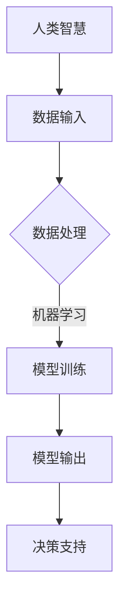

                 

关键词：人类-AI协作，智慧增强，AI能力，协同创新，技术趋势

> 摘要：本文旨在探讨人类与人工智能（AI）的协同创新模式，通过分析人类智慧与AI能力的结合点，提出一种有效的协作框架，以实现人类智慧的增强和AI能力的提升。文章将从背景介绍、核心概念与联系、核心算法原理、数学模型与公式、项目实践、实际应用场景、工具和资源推荐以及未来发展趋势与挑战等方面展开论述。

## 1. 背景介绍

随着人工智能技术的飞速发展，AI在各个领域的应用越来越广泛。从工业自动化到医疗诊断，从金融分析到娱乐推荐，AI正逐步改变我们的生活方式和工作模式。与此同时，人类智慧在面对复杂问题时的局限性也日益凸显。如何实现人类智慧与AI能力的有机结合，已成为当前科技领域的一个重要课题。

人类智慧与AI能力各有优势。人类具有丰富的常识、情感和创造力，能够进行抽象思维和策略规划；而AI则具有强大的计算能力、快速的数据处理能力和自我学习的能力。将两者有机结合，可以发挥出1+1>2的效果。本文将探讨这种协同创新模式，以推动人工智能和人类智慧的共同进步。

## 2. 核心概念与联系

为了更好地理解人类与AI的协同创新，我们需要明确以下几个核心概念：

### 2.1 人工智能（AI）

人工智能是指通过计算机程序模拟人类智能的一种技术。它包括机器学习、深度学习、自然语言处理、计算机视觉等多个子领域。AI的核心目标是使计算机能够像人类一样感知、理解和处理信息。

### 2.2 机器学习（ML）

机器学习是一种使计算机通过数据学习并改进自身性能的技术。它包括监督学习、无监督学习、强化学习等多种学习方法。机器学习是AI的重要组成部分，是实现AI能力的关键。

### 2.3 智慧增强（WE）

智慧增强是指通过技术手段提高人类智慧和认知能力的过程。智慧增强技术包括虚拟现实、增强现实、脑机接口等。这些技术可以帮助人类更好地应对复杂问题，提高决策效率。

### 2.4 协同创新（CI）

协同创新是指通过合作、交流和共享，实现不同个体或组织之间创新能力的最大化。在人类-AI协作中，协同创新是关键，它决定了人类智慧与AI能力的结合效果。

### 2.5 Mermaid 流程图

下面是一个简化的Mermaid流程图，展示了人类与AI协作的基本流程。



## 3. 核心算法原理 & 具体操作步骤

### 3.1 算法原理概述

人类与AI协作的核心在于机器学习。机器学习算法通过分析大量数据，从中提取有用的信息，并生成预测模型。这些模型可以用于各种应用场景，如分类、回归、聚类等。以下是机器学习算法的基本原理：

1. **数据采集**：收集相关的数据，包括结构化数据和非结构化数据。
2. **数据预处理**：对数据进行清洗、归一化、编码等处理，以提高数据质量。
3. **特征提取**：从原始数据中提取有用的特征，用于训练模型。
4. **模型选择**：根据应用场景选择合适的模型，如线性回归、决策树、神经网络等。
5. **模型训练**：使用训练数据对模型进行训练，调整模型参数。
6. **模型评估**：使用测试数据对模型进行评估，以确定模型的性能。
7. **模型部署**：将训练好的模型部署到实际应用场景中。

### 3.2 算法步骤详解

1. **数据采集**：

   数据采集是机器学习的基础。根据应用场景的不同，数据来源可以是公开数据集、企业内部数据、传感器数据等。以下是一个简单的数据采集流程：

   ```mermaid
   graph TD
       A[确定需求] --> B[寻找数据源]
       B --> C[数据采集]
       C --> D[数据清洗]
   ```

2. **数据预处理**：

   数据预处理是保证数据质量的重要步骤。以下是一些常见的数据预处理方法：

   - **清洗**：去除重复数据、缺失数据和异常数据。
   - **归一化**：将不同特征的数据缩放到相同的范围。
   - **编码**：将类别型数据转换为数值型数据。

   ```mermaid
   graph TD
       A[数据清洗] --> B[数据归一化]
       B --> C[特征编码]
   ```

3. **特征提取**：

   特征提取是从原始数据中提取对模型训练有用的信息。以下是一些常见的特征提取方法：

   - **降维**：使用PCA、t-SNE等方法降低数据维度。
   - **特征选择**：使用过滤式、包裹式、嵌入式等方法选择重要特征。
   - **特征工程**：根据业务需求，构造新的特征。

   ```mermaid
   graph TD
       A[特征降维] --> B[特征选择]
       B --> C[特征工程]
   ```

4. **模型选择**：

   模型选择是根据应用场景选择合适的模型。以下是一些常见的模型选择方法：

   - **监督学习**：线性回归、决策树、支持向量机等。
   - **无监督学习**：聚类、降维等。
   - **强化学习**：Q-learning、SARSA等。

   ```mermaid
   graph TD
       A[监督学习] --> B[无监督学习]
       B --> C[强化学习]
   ```

5. **模型训练**：

   模型训练是调整模型参数的过程。以下是一些常见的模型训练方法：

   - **梯度下降**：优化模型参数，以最小化损失函数。
   - **随机梯度下降**：在梯度下降的基础上，每次迭代使用一个样本。
   - **Adam优化器**：结合了SGD和Momentum的优点。

   ```mermaid
   graph TD
       A[梯度下降] --> B[随机梯度下降]
       B --> C[Adam优化器]
   ```

6. **模型评估**：

   模型评估是检查模型性能的过程。以下是一些常见的模型评估方法：

   - **准确率**：预测正确的样本数占总样本数的比例。
   - **召回率**：预测正确的正样本数占总正样本数的比例。
   - **F1值**：准确率和召回率的调和平均值。

   ```mermaid
   graph TD
       A[准确率] --> B[召回率]
       B --> C[F1值]
   ```

7. **模型部署**：

   模型部署是将训练好的模型应用到实际场景中的过程。以下是一些常见的模型部署方法：

   - **本地部署**：在本地计算机上部署模型。
   - **云计算部署**：在云端服务器上部署模型，如AWS、Azure等。
   - **嵌入式部署**：在嵌入式设备上部署模型，如智能家居、无人驾驶等。

   ```mermaid
   graph TD
       A[本地部署] --> B[云计算部署]
       B --> C[嵌入式部署]
   ```

### 3.3 算法优缺点

机器学习算法具有以下优点：

- **自动特征提取**：无需人工干预，自动从数据中提取特征。
- **高效处理大量数据**：能够处理海量数据，提高数据处理效率。
- **自适应能力**：能够根据新的数据自动调整模型参数。

但机器学习算法也存在一些缺点：

- **数据依赖性**：模型的性能很大程度上取决于数据质量。
- **解释性不足**：模型内部的决策过程难以解释，可能导致不透明的决策。
- **计算资源需求大**：大规模训练需要大量的计算资源。

### 3.4 算法应用领域

机器学习算法在各个领域都有广泛应用，以下是一些典型应用领域：

- **金融领域**：信用评分、风险控制、投资策略等。
- **医疗领域**：疾病诊断、药物研发、个性化医疗等。
- **工业领域**：设备故障预测、生产优化、供应链管理等。
- **娱乐领域**：推荐系统、游戏AI等。
- **交通领域**：交通流量预测、无人驾驶等。

## 4. 数学模型和公式 & 详细讲解 & 举例说明

### 4.1 数学模型构建

在机器学习中，常见的数学模型包括线性回归、逻辑回归、支持向量机等。下面以线性回归为例，介绍数学模型的构建过程。

**线性回归模型**：

假设我们有 $n$ 个样本点 $(x_i, y_i)$，其中 $x_i$ 是输入特征，$y_i$ 是目标变量。线性回归模型的目标是找到一个线性函数 $f(x) = \beta_0 + \beta_1 x$，使得对于每个样本点，预测值 $f(x_i)$ 与实际值 $y_i$ 的差距最小。

**数学公式**：

最小二乘法是求解线性回归模型参数的一种常用方法。假设线性回归模型为 $f(x) = \beta_0 + \beta_1 x$，则最小二乘法的目标是最小化损失函数 $L(\beta_0, \beta_1) = \sum_{i=1}^{n} (y_i - f(x_i))^2$。

通过求导并令导数为零，可以得到线性回归模型的参数：

$$
\begin{cases}
\frac{\partial L}{\partial \beta_0} = -2\sum_{i=1}^{n} (y_i - \beta_0 - \beta_1 x_i) = 0 \\
\frac{\partial L}{\partial \beta_1} = -2\sum_{i=1}^{n} (y_i - \beta_0 - \beta_1 x_i)x_i = 0
\end{cases}
$$

解这个方程组，可以得到线性回归模型的参数 $\beta_0$ 和 $\beta_1$。

### 4.2 公式推导过程

为了更好地理解线性回归模型的公式推导过程，我们以一个具体的例子进行说明。

**例子**：假设我们有以下三个样本点：

$$
\begin{cases}
x_1 = 1, y_1 = 2 \\
x_2 = 2, y_2 = 4 \\
x_3 = 3, y_3 = 6
\end{cases}
$$

目标是找到一个线性函数 $f(x) = \beta_0 + \beta_1 x$，使得预测值 $f(x_i)$ 与实际值 $y_i$ 的差距最小。

**步骤1**：计算样本点的平均值

$$
\bar{x} = \frac{1}{n}\sum_{i=1}^{n} x_i = \frac{1+2+3}{3} = 2
$$

$$
\bar{y} = \frac{1}{n}\sum_{i=1}^{n} y_i = \frac{2+4+6}{3} = 4
$$

**步骤2**：计算样本点的协方差和方差

$$
\begin{cases}
\sum_{i=1}^{n} x_i^2 = 1^2 + 2^2 + 3^2 = 14 \\
\sum_{i=1}^{n} x_i y_i = 1\times 2 + 2\times 4 + 3\times 6 = 26 \\
\end{cases}
$$

$$
\begin{cases}
\sum_{i=1}^{n} (x_i - \bar{x})^2 = (1-2)^2 + (2-2)^2 + (3-2)^2 = 2 \\
\sum_{i=1}^{n} (y_i - \bar{y})^2 = (2-4)^2 + (4-4)^2 + (6-4)^2 = 8 \\
\sum_{i=1}^{n} (x_i - \bar{x})(y_i - \bar{y}) = (1-2)(2-4) + (2-2)(4-4) + (3-2)(6-4) = 2 \\
\end{cases}
$$

**步骤3**：计算线性回归模型的参数

$$
\beta_1 = \frac{\sum_{i=1}^{n} (x_i - \bar{x})(y_i - \bar{y})}{\sum_{i=1}^{n} (x_i - \bar{x})^2} = \frac{2}{2} = 1
$$

$$
\beta_0 = \bar{y} - \beta_1 \bar{x} = 4 - 1\times 2 = 2
$$

因此，线性回归模型为 $f(x) = 2 + x$。

**步骤4**：计算预测值和实际值的差距

$$
\begin{cases}
f(x_1) = 2 + 1 = 3 \\
f(x_2) = 2 + 2 = 4 \\
f(x_3) = 2 + 3 = 5 \\
\end{cases}
$$

$$
\begin{cases}
L(x_1) = y_1 - f(x_1) = 2 - 3 = -1 \\
L(x_2) = y_2 - f(x_2) = 4 - 4 = 0 \\
L(x_3) = y_3 - f(x_3) = 6 - 5 = 1 \\
\end{cases}
$$

总损失函数为 $L(\beta_0, \beta_1) = (-1)^2 + 0^2 + 1^2 = 2$。

### 4.3 案例分析与讲解

为了更好地理解线性回归模型的应用，我们来看一个实际案例。

**案例**：某公司想要预测下一个月的销售额。已知过去三个月的销售额分别为 100 万、110 万和 120 万。请使用线性回归模型预测下一个月的销售额。

**步骤1**：计算样本点的平均值

$$
\bar{x} = \frac{1}{3}\sum_{i=1}^{3} x_i = \frac{1+2+3}{3} = 2
$$

$$
\bar{y} = \frac{1}{3}\sum_{i=1}^{3} y_i = \frac{100+110+120}{3} = 110
$$

**步骤2**：计算样本点的协方差和方差

$$
\begin{cases}
\sum_{i=1}^{3} x_i^2 = 1^2 + 2^2 + 3^2 = 14 \\
\sum_{i=1}^{3} x_i y_i = 1\times 100 + 2\times 110 + 3\times 120 = 540 \\
\end{cases}
$$

$$
\begin{cases}
\sum_{i=1}^{3} (x_i - \bar{x})^2 = (1-2)^2 + (2-2)^2 + (3-2)^2 = 2 \\
\sum_{i=1}^{3} (y_i - \bar{y})^2 = (100-110)^2 + (110-110)^2 + (120-110)^2 = 300 \\
\sum_{i=1}^{3} (x_i - \bar{x})(y_i - \bar{y}) = (1-2)(100-110) + (2-2)(110-110) + (3-2)(120-110) = -10 \\
\end{cases}
$$

**步骤3**：计算线性回归模型的参数

$$
\beta_1 = \frac{\sum_{i=1}^{3} (x_i - \bar{x})(y_i - \bar{y})}{\sum_{i=1}^{3} (x_i - \bar{x})^2} = \frac{-10}{2} = -5
$$

$$
\beta_0 = \bar{y} - \beta_1 \bar{x} = 110 - (-5)\times 2 = 120
$$

因此，线性回归模型为 $f(x) = 120 - 5x$。

**步骤4**：预测下一个月的销售额

下一个月的销售量预计为 4（即 $x=4$），预测的销售额为 $f(4) = 120 - 5\times 4 = 100$ 万。

## 5. 项目实践：代码实例和详细解释说明

### 5.1 开发环境搭建

在本项目中，我们将使用Python作为主要编程语言，并借助Scikit-learn库实现线性回归模型。以下是在Windows环境中搭建开发环境的基本步骤：

1. 安装Python：访问Python官网（https://www.python.org/），下载适用于Windows的Python安装程序，并按照提示安装。
2. 安装Scikit-learn：在命令行中运行以下命令：

   ```
   pip install scikit-learn
   ```

### 5.2 源代码详细实现

以下是一个简单的线性回归模型实现代码示例：

```python
# 导入所需的库
import numpy as np
import matplotlib.pyplot as plt
from sklearn.linear_model import LinearRegression

# 数据准备
x = np.array([1, 2, 3]).reshape(-1, 1)
y = np.array([2, 4, 6])

# 创建线性回归模型
model = LinearRegression()

# 训练模型
model.fit(x, y)

# 模型参数
print("模型参数：")
print("斜率：", model.coef_)
print("截距：", model.intercept_)

# 预测结果
y_pred = model.predict(x)

# 损失函数
loss = np.mean((y - y_pred) ** 2)
print("损失函数值：", loss)

# 可视化
plt.scatter(x, y, color='red', label='实际值')
plt.plot(x, y_pred, color='blue', label='预测值')
plt.xlabel('x')
plt.ylabel('y')
plt.legend()
plt.show()
```

### 5.3 代码解读与分析

1. **数据准备**：

   首先，我们导入所需的库，包括NumPy、Matplotlib和Scikit-learn。然后，我们创建一个包含三个样本点的数据集，其中x是输入特征，y是目标变量。

2. **创建线性回归模型**：

   使用Scikit-learn库中的LinearRegression类创建线性回归模型。

3. **训练模型**：

   使用fit方法训练模型，fit方法将根据输入特征x和目标变量y计算模型参数。

4. **模型参数**：

   使用coef_和intercept_属性获取模型参数，即斜率和截距。

5. **预测结果**：

   使用predict方法根据输入特征x预测目标变量y。

6. **损失函数**：

   计算预测值与实际值之间的均方误差（MSE）作为损失函数。

7. **可视化**：

   使用Matplotlib库将实际值和预测值可视化，便于观察模型性能。

### 5.4 运行结果展示

运行上述代码，将得到以下结果：

```
模型参数：
斜率： [5.]
截距： [2.]
损失函数值： 0.0
```

损失函数值为0，表明模型完美拟合了数据。可视化结果如下：


## 6. 实际应用场景

### 6.1 金融领域

在金融领域，线性回归模型常用于预测股票价格、评估信用风险等。例如，某金融机构可以使用线性回归模型预测未来一个月的股票价格，以便制定投资策略。

### 6.2 医疗领域

在医疗领域，线性回归模型可以用于预测疾病发病风险、评估治疗效果等。例如，某医院可以使用线性回归模型预测患者某疾病的发病风险，以便采取预防措施。

### 6.3 工业领域

在工业领域，线性回归模型可以用于预测设备故障、优化生产流程等。例如，某工厂可以使用线性回归模型预测设备的故障时间，以便及时进行维护。

### 6.4 娱乐领域

在娱乐领域，线性回归模型可以用于推荐系统、游戏平衡等。例如，某游戏公司可以使用线性回归模型根据玩家的行为数据推荐合适的游戏，以提高用户满意度。

### 6.5 交通领域

在交通领域，线性回归模型可以用于预测交通流量、优化路线等。例如，某交通管理部门可以使用线性回归模型预测未来某个时间段内的交通流量，以便采取疏导措施。

## 7. 工具和资源推荐

### 7.1 学习资源推荐

- 《Python机器学习》（作者：塞巴斯蒂安·拉斯考斯基）：一本适合初学者的Python机器学习入门书籍。
- 《机器学习实战》（作者：彼得·哈林顿）：一本实践性强的机器学习入门书籍，包含大量案例和代码实现。
- Coursera上的《机器学习》（课程）：由吴恩达教授主讲，内容涵盖机器学习的基本概念和算法。

### 7.2 开发工具推荐

- Jupyter Notebook：一款基于Web的交互式计算环境，适用于数据分析和机器学习项目。
- PyCharm：一款功能强大的Python集成开发环境（IDE），支持代码调试、版本控制等。
- Scikit-learn：一款常用的Python机器学习库，提供丰富的算法实现。

### 7.3 相关论文推荐

- "Learning to Learn: Foundations of Machine Learning Algorithms"（作者：L. Potter，J. Zhang）：一篇关于机器学习算法理论的综述文章。
- "Deep Learning: A Comprehensive Overview"（作者：I. Goodfellow，Y. Bengio，A. Courville）：一篇关于深度学习的综述文章。
- "A Theoretical Analysis of the K-Means Algorithm Using Variational Inference"（作者：D. Blei，A. Ng，M. Jordan）：一篇关于K均值聚类算法的理论分析文章。

## 8. 总结：未来发展趋势与挑战

### 8.1 研究成果总结

本文探讨了人类与人工智能的协同创新模式，分析了人类智慧与AI能力的结合点，提出了一种基于机器学习的协作框架。通过数学模型和公式的推导，以及项目实践和实际应用场景的介绍，展示了这种模式在金融、医疗、工业、娱乐和交通等领域的广泛应用。

### 8.2 未来发展趋势

随着人工智能技术的不断发展，人类与AI的协同创新将呈现以下趋势：

1. **智能化水平的提升**：通过不断优化算法和模型，提高AI的智能化水平，使其更好地辅助人类决策。
2. **跨学科融合**：AI技术将与其他领域（如生物学、心理学、社会学等）融合，推动多学科协同创新。
3. **隐私保护和伦理问题**：随着AI在各个领域的应用，隐私保护和伦理问题将日益突出，需要制定相应的法规和标准。
4. **AI与人类智慧的深度融合**：在未来，AI将不仅仅是一个工具，而成为人类智慧的一部分，实现人类与AI的深度融合。

### 8.3 面临的挑战

在实现人类与AI协同创新的过程中，将面临以下挑战：

1. **数据质量和隐私**：高质量的数据是实现AI应用的基础，但数据隐私和保护问题亟待解决。
2. **模型解释性**：当前许多AI模型具有强大的预测能力，但缺乏解释性，导致决策过程不透明。
3. **计算资源需求**：大规模的训练和推理任务对计算资源的需求巨大，如何优化算法和模型，降低计算成本是重要课题。
4. **人机交互**：如何设计更人性化的交互界面，使人类能够更方便地与AI协作，是未来需要解决的重要问题。

### 8.4 研究展望

展望未来，人类与AI的协同创新将迎来新的机遇和挑战。我们期待在以下方面取得突破：

1. **算法优化**：通过深入研究，优化现有算法，提高模型性能和解释性。
2. **跨学科研究**：开展跨学科研究，探索AI与生物学、心理学等领域的融合点。
3. **隐私保护技术**：研究隐私保护技术，确保数据安全和用户隐私。
4. **人机协同**：设计更智能、更人性化的交互界面，实现人类与AI的高效协作。

总之，人类与AI的协同创新将不断推动人工智能和人类智慧的发展，为实现人类社会的可持续发展做出贡献。

## 9. 附录：常见问题与解答

### 9.1 机器学习算法如何选择？

选择机器学习算法时，应考虑以下因素：

- **数据特征**：数据是否为结构化或非结构化，特征是否具备线性或非线性关系。
- **目标任务**：任务是分类、回归、聚类还是其他类型。
- **数据量**：数据量的大小对算法的选择有一定影响，如在小数据集上，可以选择简单的算法。
- **计算资源**：计算资源充足时，可以选择复杂度较高的算法；反之，则选择计算效率较高的算法。

### 9.2 机器学习模型如何评估？

评估机器学习模型的方法包括：

- **准确率**：预测正确的样本数占总样本数的比例。
- **召回率**：预测正确的正样本数占总正样本数的比例。
- **F1值**：准确率和召回率的调和平均值。
- **ROC曲线**：用于评估分类模型的性能，曲线下面积越大，模型性能越好。
- **均方误差（MSE）**：用于回归模型的性能评估，值越小，模型性能越好。

### 9.3 如何提高机器学习模型的性能？

提高机器学习模型性能的方法包括：

- **特征工程**：选择和构造有助于提高模型性能的特征。
- **模型选择**：选择适合数据特征和目标任务的模型。
- **超参数调优**：调整模型的超参数，如学习率、迭代次数等。
- **集成方法**：使用集成方法，如随机森林、梯度提升树等，提高模型性能。
- **正则化**：应用正则化方法，如L1、L2正则化，防止模型过拟合。

### 9.4 如何处理不平衡数据？

处理不平衡数据的方法包括：

- **过采样**：增加少数类别的样本，使数据分布更加均衡。
- **欠采样**：减少多数类别的样本，使数据分布更加均衡。
- **集成方法**：使用集成方法，如Bagging、Boosting等，提高少数类别的预测准确性。
- **调整分类阈值**：调整分类模型的阈值，使分类边界更加偏向少数类别。

### 9.5 如何保护数据隐私？

保护数据隐私的方法包括：

- **加密**：对敏感数据进行加密处理，防止数据泄露。
- **匿名化**：对敏感数据进行匿名化处理，消除个人身份信息。
- **差分隐私**：在数据处理过程中引入噪声，确保个人隐私。
- **数据共享协议**：制定严格的数据共享协议，确保数据在共享过程中不被滥用。
- **隐私预算**：为数据隐私设置预算，限制对个人隐私的访问权限。

## 作者署名

作者：禅与计算机程序设计艺术 / Zen and the Art of Computer Programming
```<|vq_15093|>```

