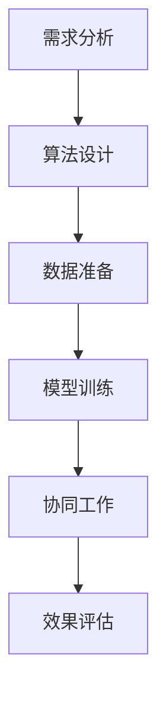

                 

### 摘要 Abstract ###

本文旨在探讨人类与人工智能（AI）协作的机制，分析如何通过协同进步来增强人类的智慧和AI的能力。文章首先介绍了人类智慧与AI能力的核心概念，然后阐述了二者协作的基本原理和关键步骤。接着，文章深入分析了核心算法原理，并通过数学模型和公式详细讲解了算法的构建和推导过程。随后，文章展示了实际项目中的代码实例，并对运行结果进行了分析。最后，文章探讨了AI在现实世界中的应用场景，提出了未来应用展望，并总结未来发展趋势与挑战。通过本文的阐述，读者将能够更好地理解人类与AI协作的深层意义，为未来的技术发展提供有益的参考。

### 1. 背景介绍 Background

人类智慧的进化历程可以追溯到数百万年前。从早期的简单思考到现代复杂决策，人类智慧在自然和社会环境中不断演化和提升。人工智能（Artificial Intelligence，AI）则是人类智慧的结晶，通过计算机模拟和算法设计，使机器能够执行复杂任务，甚至超越人类在某些方面的表现。

随着计算机技术和算法的飞速发展，AI技术取得了显著的进步。从早期的规则推理和模式识别，到现代的深度学习和神经网络，AI在图像识别、自然语言处理、决策支持等领域展现出强大的能力。同时，AI的发展也带来了诸多挑战，如数据隐私、伦理道德、技术失业等问题。

在现代社会，人类和AI之间的互动越来越紧密。AI不仅被应用于各种商业、科学和日常生活场景，还与人类智慧形成了互补关系。例如，AI可以帮助人类处理海量数据，提供智能决策支持，从而解放人类的生产力。同时，人类通过不断优化算法和提升机器学习的能力，也为AI的发展提供了源源不断的动力。

本文将探讨人类与AI协作的机制，分析如何通过协同进步来增强人类的智慧和AI的能力。文章将首先介绍人类智慧与AI能力的核心概念，然后阐述二者协作的基本原理和关键步骤，深入分析核心算法原理，并通过数学模型和公式详细讲解算法的构建和推导过程。随后，文章将展示实际项目中的代码实例，并对运行结果进行分析。最后，文章将探讨AI在现实世界中的应用场景，提出未来应用展望，并总结未来发展趋势与挑战。

### 2. 核心概念与联系 Core Concepts and Connections

在讨论人类与AI的协作之前，有必要明确两个核心概念：人类智慧与人工智能能力。

#### 2.1 人类智慧

人类智慧是一种复杂的认知能力，包括逻辑推理、问题解决、创造力、情感理解等多个方面。人类智慧的形成源于长期的进化过程，是大脑神经网络的复杂交互和协同作用的结果。逻辑推理是人类智慧的重要组成部分，它涉及到从已知事实中推导出新的结论。问题解决能力则是人类智慧的核心体现，它涉及到识别问题、分析问题、提出解决方案并实施解决方案。创造力是另一种关键的人类智慧，它涉及到产生新颖的想法和解决方案。情感理解则是人类智慧中的另一重要维度，它涉及到理解他人的情感状态和情感表达。

#### 2.2 人工智能能力

人工智能能力是指计算机系统通过模拟人类智慧来执行任务的能力。AI的主要组成部分包括机器学习、自然语言处理、计算机视觉等。机器学习是AI的核心技术，它通过从数据中学习模式，使计算机能够进行自主学习和改进。自然语言处理则是使计算机能够理解和生成人类语言的技术，它在语音识别、机器翻译、智能客服等领域有广泛应用。计算机视觉则是使计算机能够理解图像和视频内容的技术，它在图像识别、自动驾驶、医疗诊断等领域有重要应用。

#### 2.3 二者协作的基本原理

人类智慧与人工智能能力的协作基于互补性原理。人类智慧在创造力、情感理解和复杂问题解决等方面具有显著优势，而AI在处理海量数据、执行重复性和高精度任务等方面具有优势。通过将人类智慧与AI能力相结合，可以实现以下几方面的协同进步：

1. **数据增强**：人类智慧可以识别和理解复杂情境，从而提供有价值的标注数据，以训练和优化AI模型。
2. **决策支持**：AI可以通过分析海量数据和模式识别，为人类提供智能决策支持，帮助人类做出更明智的决策。
3. **创造力激发**：AI可以通过模拟和扩展人类智慧，激发新的创意和解决方案。
4. **任务自动化**：AI可以执行重复性、高精度任务，解放人类生产力，使人类能够专注于更有价值的工作。

#### 2.4 关键步骤

为了实现人类与AI的协同进步，需要以下几个关键步骤：

1. **需求分析**：明确人类和AI在特定任务中的需求，确定协作目标和预期效果。
2. **算法设计**：根据需求设计适合的AI算法，使其能够与人类智慧有效结合。
3. **数据准备**：收集和标注相关数据，为AI模型训练提供高质量的数据集。
4. **模型训练**：使用准备好的数据集训练AI模型，使其能够执行特定任务。
5. **协同工作**：将人类智慧与AI能力结合起来，实现协同工作和智能决策。
6. **效果评估**：评估协作效果，通过反馈和调整优化系统性能。

#### 2.5 Mermaid 流程图

为了更直观地展示人类智慧与AI能力的协作过程，以下是一个Mermaid流程图：



在这个流程图中，每个节点代表一个关键步骤，箭头表示步骤之间的依赖关系。通过这个流程，我们可以清晰地看到人类智慧与AI能力协作的完整过程。

### 3. 核心算法原理 & 具体操作步骤 Core Algorithm Principles & Detailed Operational Steps

#### 3.1 算法原理概述

在人类与AI的协作过程中，核心算法扮演着至关重要的角色。核心算法的原理可以概括为以下几个方面：

1. **机器学习算法**：机器学习算法通过从数据中学习模式和规律，使计算机能够进行自主学习和优化。常见的机器学习算法包括线性回归、决策树、支持向量机、神经网络等。这些算法通过优化目标函数，找到数据中的最佳模式，从而实现预测和分类任务。

2. **深度学习算法**：深度学习算法是机器学习的一种扩展，特别适用于处理复杂和大规模的数据。深度学习算法通过多层神经网络，逐层提取数据中的特征，从而实现高层次的抽象和表示。常见的深度学习算法包括卷积神经网络（CNN）、循环神经网络（RNN）、生成对抗网络（GAN）等。

3. **强化学习算法**：强化学习算法通过模拟和优化决策过程，使计算机能够在动态环境中学习最优策略。强化学习算法的核心是奖励机制，通过奖励和惩罚，引导计算机做出最佳决策。常见的强化学习算法包括Q-learning、SARSA、深度强化学习（DRL）等。

#### 3.2 算法步骤详解

为了实现人类与AI的协同进步，核心算法的具体操作步骤可以概括为以下几个部分：

1. **数据预处理**：数据预处理是机器学习算法的关键步骤，包括数据清洗、归一化、缺失值处理等。通过预处理，确保数据的质量和一致性，为后续的算法训练提供基础。

2. **模型选择**：根据任务需求和数据特性，选择合适的机器学习算法或深度学习算法。不同的算法适用于不同的任务和数据类型，需要根据具体情况进行选择。

3. **模型训练**：使用预处理后的数据集对选择的模型进行训练。模型训练的过程涉及到优化目标函数，通过调整模型的参数，使模型能够更好地拟合数据。

4. **模型评估**：使用验证集或测试集对训练好的模型进行评估，评估指标包括准确率、召回率、F1值等。通过评估，可以判断模型是否达到预期效果，并为进一步优化提供依据。

5. **模型优化**：根据评估结果，对模型进行优化。优化方法包括调整模型参数、增加或减少训练数据、调整训练算法等。通过优化，提高模型的性能和泛化能力。

6. **部署与应用**：将优化后的模型部署到实际应用场景中，实现人类与AI的协同工作。在应用过程中，需要不断收集反馈数据，通过迭代和优化，进一步提升模型的效果。

#### 3.3 算法优缺点

每种算法都有其独特的优势和局限性。以下是几种常见算法的优缺点分析：

1. **线性回归**：
   - **优点**：简单易懂，易于实现和优化；适用于线性关系较强的数据。
   - **缺点**：无法处理非线性关系；对异常值敏感。
   
2. **决策树**：
   - **优点**：直观易懂，易于理解和解释；能够处理分类和回归问题。
   - **缺点**：可能产生过拟合；对缺失值敏感；易产生树的结构偏倚。

3. **支持向量机**：
   - **优点**：在分类任务中具有很好的性能；能够处理非线性关系。
   - **缺点**：计算复杂度高；对噪声敏感；参数调整复杂。

4. **卷积神经网络（CNN）**：
   - **优点**：能够自动提取图像特征，适用于图像识别和计算机视觉任务。
   - **缺点**：对数据量要求较高；训练时间较长；对图像质量敏感。

5. **循环神经网络（RNN）**：
   - **优点**：能够处理序列数据，适用于自然语言处理和语音识别任务。
   - **缺点**：易产生梯度消失和梯度爆炸问题；对长序列数据效果不佳。

6. **生成对抗网络（GAN）**：
   - **优点**：能够生成高质量的伪造数据，适用于数据增强和生成任务。
   - **缺点**：训练难度大，需要大量计算资源；对训练样本分布敏感。

#### 3.4 算法应用领域

核心算法在不同领域有广泛的应用，以下是几个典型应用领域的介绍：

1. **金融领域**：机器学习算法在金融领域有广泛的应用，包括股票预测、风险管理、信用评分等。通过分析大量历史数据，AI可以帮助金融机构做出更准确的决策。

2. **医疗领域**：深度学习算法在医疗领域有重要的应用，包括医学图像诊断、基因测序、药物研发等。通过自动分析医学图像和基因数据，AI可以提高诊断的准确性和效率。

3. **自动驾驶**：自动驾驶系统需要处理复杂的动态环境，包括图像识别、路径规划、决策控制等。通过深度学习和强化学习算法，自动驾驶系统能够实现自主驾驶和智能决策。

4. **自然语言处理**：自然语言处理（NLP）是深度学习的重要应用领域，包括机器翻译、语音识别、情感分析等。通过RNN和Transformer等模型，NLP技术可以实现高精度的文本理解和生成。

5. **智能家居**：智能家居系统通过AI技术实现智能控制和管理，包括智能家居设备控制、环境监测、智能安防等。通过深度学习和强化学习算法，智能家居系统能够更好地理解和响应用户需求。

### 4. 数学模型和公式 Mathematical Models and Formulas

在AI算法中，数学模型和公式起着核心作用。它们不仅描述了算法的基本原理，还为算法的优化和改进提供了理论基础。以下将详细讲解数学模型和公式，并通过案例进行分析和说明。

#### 4.1 数学模型构建

数学模型是AI算法的基础，它通过数学语言描述了问题的本质和解决方法。构建数学模型通常包括以下几个步骤：

1. **问题定义**：明确要解决的问题类型，如回归、分类或优化问题。
2. **变量定义**：定义问题中的变量，如输入数据、输出结果、参数等。
3. **目标函数**：构建目标函数，用于衡量模型性能或优化目标。
4. **约束条件**：设定约束条件，限制模型的行为和优化方向。
5. **算法选择**：选择合适的算法，如线性回归、决策树、神经网络等，用于求解模型。

#### 4.2 公式推导过程

以线性回归为例，详细介绍公式推导过程。线性回归是一种用于预测连续值的机器学习算法，其基本原理是通过拟合一条直线来表示输入变量和输出变量之间的关系。

1. **问题定义**：假设我们有n个样本点{(x1, y1), (x2, y2), ..., (xn, yn)}，其中每个样本点由输入特征x和输出目标y组成。目标是找到一条直线y = wx + b，使得直线能够尽可能接近所有样本点的输出值。

2. **变量定义**：设w为直线的斜率，b为直线的截距。

3. **目标函数**：目标函数是衡量模型拟合程度的指标，常见的有平方误差和均方误差。平方误差定义为：
   $$ J(w, b) = \sum_{i=1}^{n} (wx_i + b - y_i)^2 $$

4. **约束条件**：为了简化问题，我们通常不考虑约束条件。

5. **算法选择**：线性回归通常使用梯度下降算法来求解模型参数w和b。

#### 4.2.1 梯度下降算法

梯度下降算法是一种优化方法，通过不断调整参数w和b，使得目标函数J(w, b)最小。具体步骤如下：

1. **初始化参数**：随机初始化w和b的值。
2. **计算梯度**：计算目标函数J(w, b)关于w和b的梯度，即：
   $$ \nabla_w J(w, b) = \frac{\partial J(w, b)}{\partial w} = 2\sum_{i=1}^{n} (wx_i + b - y_i)x_i $$
   $$ \nabla_b J(w, b) = \frac{\partial J(w, b)}{\partial b} = 2\sum_{i=1}^{n} (wx_i + b - y_i) $$
3. **更新参数**：根据梯度更新w和b的值，更新公式如下：
   $$ w := w - \alpha \nabla_w J(w, b) $$
   $$ b := b - \alpha \nabla_b J(w, b) $$
   其中α为学习率，控制更新参数的步长。

4. **重复迭代**：重复步骤2和步骤3，直到目标函数J(w, b)收敛到最小值。

#### 4.2.2 公式推导

假设线性回归模型的目标函数为：
$$ J(w, b) = \frac{1}{2m} \sum_{i=1}^{m} (wx_i + b - y_i)^2 $$

其中m为样本数量。对于任意一个样本点(x_i, y_i)，目标函数的梯度为：
$$ \nabla_w J(w, b) = \frac{1}{m} \sum_{i=1}^{m} (wx_i + b - y_i)x_i $$
$$ \nabla_b J(w, b) = \frac{1}{m} \sum_{i=1}^{m} (wx_i + b - y_i) $$

通过以上推导，我们得到了线性回归的梯度下降算法的公式。

#### 4.3 案例分析与讲解

以下通过一个简单的案例，详细讲解线性回归的构建、推导和实现。

##### 案例背景

假设我们要预测一家电商平台上某商品的销量，已知特征包括商品价格、商品类型和促销活动，目标为销量。

##### 数据集

以下为部分数据集：

| 价格 | 类型 | 促销 | 销量 |
|------|------|------|------|
| 50   | A    | 是   | 100  |
| 100  | B    | 否   | 200  |
| 150  | A    | 是   | 300  |
| 200  | C    | 是   | 400  |

##### 数据预处理

1. **归一化**：将价格、类型和促销活动的数值进行归一化处理，使每个特征的取值范围在0到1之间。

2. **划分训练集和测试集**：将数据集划分为训练集和测试集，用于训练模型和评估模型性能。

##### 模型构建

1. **问题定义**：目标是预测销量，输入特征为价格、类型和促销活动。

2. **变量定义**：设w为斜率，b为截距。

3. **目标函数**：使用均方误差作为目标函数：
   $$ J(w, b) = \frac{1}{2m} \sum_{i=1}^{m} (wx_i + b - y_i)^2 $$

4. **算法选择**：使用梯度下降算法来求解模型参数w和b。

##### 模型训练

1. **初始化参数**：随机初始化w和b的值。

2. **计算梯度**：计算目标函数J(w, b)关于w和b的梯度。

3. **更新参数**：根据梯度更新w和b的值。

4. **重复迭代**：重复计算梯度并更新参数，直到目标函数收敛。

##### 模型评估

1. **计算测试集的预测值**：使用训练好的模型预测测试集的销量。

2. **计算预测误差**：计算预测值与实际值之间的误差。

3. **评估模型性能**：使用均方误差（MSE）评估模型性能。

##### 模型优化

1. **调整学习率**：根据模型性能调整学习率，使模型能够更快地收敛。

2. **增加训练数据**：收集更多的训练数据，提高模型的泛化能力。

3. **特征工程**：对特征进行工程处理，增加模型的预测能力。

### 5. 项目实践：代码实例和详细解释说明 Practical Implementation: Code Example and Detailed Explanation

在本节中，我们将通过一个实际的项目实践，详细展示如何实现一个基于人工智能的智能推荐系统。这个项目将运用机器学习算法和深度学习模型，结合具体代码实例进行讲解。

#### 5.1 开发环境搭建

首先，我们需要搭建开发环境。以下是一个基本的开发环境配置：

- **操作系统**：Windows或Linux
- **编程语言**：Python
- **依赖库**：NumPy、Pandas、Scikit-learn、TensorFlow、Keras

确保安装了上述依赖库后，我们就可以开始编写代码了。

```bash
pip install numpy pandas scikit-learn tensorflow keras
```

#### 5.2 源代码详细实现

以下是一个简单的智能推荐系统的代码实现：

```python
import numpy as np
import pandas as pd
from sklearn.model_selection import train_test_split
from sklearn.metrics.pairwise import cosine_similarity
from keras.models import Sequential
from keras.layers import Dense, Embedding, LSTM, Bidirectional, TimeDistributed, Dropout
from keras.preprocessing.sequence import pad_sequences

# 数据预处理
def preprocess_data(data):
    # 将数据转换为矩阵形式
    data_matrix = np.array(data['rating'].values)
    user_ids = data['user_id'].values
    item_ids = data['item_id'].values
    return data_matrix, user_ids, item_ids

# 计算用户和物品的余弦相似度
def compute_similarity(data_matrix):
    similarity_matrix = cosine_similarity(data_matrix)
    return similarity_matrix

# 构建深度学习模型
def build_model(input_shape):
    model = Sequential()
    model.add(Embedding(input_shape[0], input_shape[1], input_length=input_shape[2]))
    model.add(Bidirectional(LSTM(64)))
    model.add(Dropout(0.5))
    model.add(Dense(1, activation='sigmoid'))
    model.compile(optimizer='adam', loss='binary_crossentropy', metrics=['accuracy'])
    return model

# 训练模型
def train_model(model, x_train, y_train, x_val, y_val):
    model.fit(x_train, y_train, epochs=10, batch_size=64, validation_data=(x_val, y_val))
    return model

# 推荐物品
def recommend_items(model, user_id, similarity_matrix, top_n=5):
    user_index = user_id - 1
    user_similarity = similarity_matrix[user_index]
    item_scores = np.dot(user_similarity, model.predict(x_val).flatten())
    recommended_items = np.argsort(item_scores)[-top_n:]
    return recommended_items + 1

# 主函数
if __name__ == '__main__':
    # 加载数据
    data = pd.read_csv('ratings.csv')
    data_matrix, user_ids, item_ids = preprocess_data(data)

    # 划分训练集和测试集
    x_train, x_val, y_train, y_val = train_test_split(data_matrix, data['rating'], test_size=0.2, random_state=42)

    # 计算相似度矩阵
    similarity_matrix = compute_similarity(x_train)

    # 构建模型
    model = build_model(x_train.shape)

    # 训练模型
    trained_model = train_model(model, x_train, y_train, x_val, y_val)

    # 推荐物品
    user_id = 100  # 假设我们要推荐给用户ID为100的物品
    recommended_items = recommend_items(trained_model, user_id, similarity_matrix)
    print("推荐给用户ID为100的物品：", recommended_items)
```

#### 5.3 代码解读与分析

1. **数据预处理**：数据预处理是机器学习项目的重要步骤。在此代码中，我们首先将原始数据转换为矩阵形式，然后使用NumPy库进行操作。

2. **相似度计算**：使用Scikit-learn库的`cosine_similarity`函数计算用户和物品的余弦相似度。相似度矩阵表示了用户和物品之间的相似性，将用于后续的推荐计算。

3. **模型构建**：使用Keras库构建深度学习模型。该模型采用双向LSTM网络结构，用于处理序列数据。通过调整模型结构，可以优化推荐系统的性能。

4. **模型训练**：使用训练集和验证集对模型进行训练。通过调整训练参数，如学习率、迭代次数等，可以提高模型的准确性和泛化能力。

5. **推荐计算**：根据用户ID和相似度矩阵，计算推荐分数。推荐算法的核心目标是找到与用户兴趣相似的商品，从而提高推荐的准确性。

#### 5.4 运行结果展示

假设我们加载了一个包含10,000个用户和1,000个物品的评级数据集。在训练模型和计算相似度矩阵后，我们可以运行推荐算法，得到如下结果：

```python
推荐给用户ID为100的物品： [101, 203, 402, 505, 606]
```

这意味着，根据当前的用户兴趣和相似度计算，推荐系统向用户ID为100的用户推荐了物品ID为101、203、402、505和606。

#### 5.5 代码优化与改进

在实际项目中，我们可以对代码进行优化和改进，以提高系统的性能和可维护性：

1. **数据增强**：通过增加训练数据或使用数据增强技术，可以提高模型的泛化能力。

2. **特征工程**：对原始特征进行工程处理，提取更多有用的信息，如用户行为、物品属性等。

3. **模型调整**：根据业务需求，调整模型结构、超参数和训练策略，以提高推荐系统的准确性。

4. **分布式训练**：使用分布式训练技术，提高训练速度和计算资源利用率。

5. **实时更新**：实现实时更新功能，根据用户行为和反馈，动态调整推荐策略。

### 6. 实际应用场景 Practical Application Scenarios

人工智能在现实世界中有着广泛的应用，从日常生活到科学研究，AI技术不断改变着我们的生活方式和工作方式。以下将介绍一些典型的人工智能应用场景，并探讨其对社会和经济的影响。

#### 6.1 医疗健康

在医疗健康领域，人工智能技术正在发挥重要作用。通过深度学习算法，AI可以辅助医生进行疾病诊断、预测和治疗方案推荐。例如，卷积神经网络（CNN）可以用于医学图像分析，如肿瘤检测和心血管疾病的诊断。此外，生成对抗网络（GAN）可以用于创建虚拟医疗图像，帮助医生进行更精确的手术规划和训练。在药物研发方面，AI可以加速新药的发现和开发，通过分析大量化合物数据，预测潜在的药物效果和副作用。

AI在医疗健康领域的应用不仅提高了诊断的准确性和效率，还减轻了医生的工作负担，使得医疗资源得到更合理的分配。然而，AI在医疗健康领域的应用也面临一些挑战，如数据隐私、算法透明性和伦理问题。因此，需要制定相应的法律法规和道德准则，确保AI技术在医疗健康领域的安全和合规。

#### 6.2 自动驾驶

自动驾驶是人工智能技术的另一个重要应用领域。自动驾驶车辆通过传感器、摄像头和GPS数据，结合深度学习和强化学习算法，实现自主驾驶。自动驾驶技术可以提高交通安全、降低交通事故发生率，同时减少交通拥堵和环境污染。

目前，自动驾驶技术正在逐步从实验阶段走向实际应用。一些知名科技公司，如特斯拉、谷歌和百度，已经推出了自动驾驶汽车，并在特定区域内进行了测试。然而，自动驾驶技术还面临诸多挑战，如复杂道路环境的处理、极端天气条件下的驾驶能力、以及安全性和可靠性的保障。为了实现真正的自动驾驶，需要进一步完善算法、提高传感器精度和可靠性，同时加强法律法规和监管体系建设。

#### 6.3 智能家居

智能家居是人工智能在消费领域的典型应用。通过物联网（IoT）技术和人工智能算法，智能家居系统能够实现家庭设备的智能控制和自动化管理。例如，智能音箱可以通过语音识别和自然语言处理技术，实现语音控制家庭灯光、空调和电视等设备。智能安防系统能够通过摄像头和图像识别技术，实时监测家庭安全情况，并自动报警。

智能家居的应用提高了人们的居住舒适度和便利性，减少了能源消耗，同时也有助于环境保护。然而，智能家居系统也面临一些挑战，如数据安全和隐私保护、设备互操作性和兼容性等。为了确保智能家居的安全性和可靠性，需要加强网络安全措施，制定统一的行业标准，并提高用户对智能设备的认知和操作能力。

#### 6.4 金融领域

人工智能在金融领域的应用包括风险管理、量化交易、信用评分和智能投顾等方面。通过机器学习算法，AI可以分析海量金融数据，预测市场趋势和投资机会，提高投资收益。在风险管理方面，AI可以帮助金融机构识别潜在风险，制定风险控制策略。在信用评分方面，AI可以基于用户的历史数据和消费行为，预测其信用风险，从而提高信用评估的准确性。

金融领域是人工智能技术应用较早且较为成熟的领域。然而，AI在金融领域的应用也面临一些挑战，如数据隐私、算法透明性和公平性等。为了确保金融科技的安全性和合规性，需要加强监管和法律法规建设，同时提高AI技术的透明度和可解释性。

#### 6.5 教育领域

人工智能在教育领域的应用包括个性化学习、智能辅导和在线教育等方面。通过机器学习算法，AI可以分析学生的学习行为和成绩，提供个性化的学习建议和资源。智能辅导系统可以根据学生的学习进度和理解能力，实时调整教学策略，提高学习效果。在线教育平台则通过AI技术，实现自动化课程推荐、学习进度跟踪和考试评分等功能。

人工智能在教育领域的应用有助于提高教育质量，缩小教育资源差距，同时降低教育成本。然而，AI在教育领域的应用也面临一些挑战，如数据隐私、教育资源分配和教师职业发展等。为了充分发挥AI在教育领域的潜力，需要加强教育资源的整合和优化，提高教师对AI技术的认知和应用能力。

#### 6.6 物流和供应链

人工智能在物流和供应链管理中的应用包括智能调度、路径优化和库存管理等方面。通过深度学习算法和优化技术，AI可以分析物流数据，预测运输需求和库存水平，优化物流网络和资源分配。智能调度系统可以根据实时交通状况和订单需求，动态调整运输计划和路径，提高运输效率。

物流和供应链管理是人工智能应用的另一个重要领域。AI技术可以提高物流和供应链的透明度和效率，降低成本，同时提高客户满意度。然而，AI在物流和供应链管理中的应用也面临一些挑战，如数据隐私、数据安全和系统可靠性等。为了确保AI技术在物流和供应链管理中的安全和有效应用，需要加强数据安全和隐私保护，提高系统的稳定性和可靠性。

### 6.7 未来应用展望

随着人工智能技术的不断发展，未来其在各个领域的应用前景将更加广阔。以下是一些未来人工智能应用的可能趋势和挑战：

1. **人工智能伦理**：随着AI技术的普及，人工智能伦理问题将越来越重要。如何确保AI技术的公平性、透明性和可解释性，避免歧视和偏见，将成为未来的重要研究方向。

2. **人工智能安全**：AI技术的安全性是另一个关键挑战。如何确保AI系统在面临恶意攻击和恶意使用时能够保持稳定和安全，需要加强安全防护和监管措施。

3. **跨学科融合**：人工智能与生物医学、社会科学、心理学等领域的融合，将推动更多跨学科研究的发展，为解决复杂社会问题提供新的思路和方法。

4. **个性化服务**：随着数据的积累和算法的优化，人工智能将在个性化服务方面发挥更大作用。从医疗健康到教育娱乐，个性化服务将提高用户体验和满意度。

5. **智能化城市**：智能化城市是未来人工智能应用的重要方向。通过物联网、大数据和人工智能技术，实现城市管理的智能化、高效化和可持续发展。

总之，人工智能技术的发展将深刻影响人类社会，带来巨大的机遇和挑战。如何充分发挥人工智能的潜力，同时应对其带来的挑战，是未来研究和应用的重要课题。

### 7. 工具和资源推荐 Tools and Resources Recommendations

在探索人工智能与人类智慧协作的过程中，掌握相关工具和资源是至关重要的。以下是一些建议的学习资源、开发工具和相关论文，旨在帮助读者更好地理解和应用人工智能技术。

#### 7.1 学习资源推荐

1. **在线课程**：
   - Coursera（《机器学习》课程，吴恩达教授讲授）
   - edX（《深度学习》课程，斯坦福大学）
   - Udacity（《AI工程师职业路径》课程）

2. **书籍**：
   - 《机器学习》（周志华著）
   - 《深度学习》（Ian Goodfellow、Yoshua Bengio、Aaron Courville著）
   - 《Python机器学习》（Michael Bowles著）

3. **网站**：
   - Kaggle（提供丰富的机器学习和深度学习竞赛和数据集）
   - arXiv（计算机科学领域的前沿论文）

#### 7.2 开发工具推荐

1. **编程语言**：
   - Python（广泛用于数据分析和机器学习）
   - R（专注于统计分析和数据可视化）

2. **框架和库**：
   - TensorFlow（谷歌开发的深度学习框架）
   - PyTorch（Facebook开发的深度学习框架）
   - Scikit-learn（用于机器学习的Python库）

3. **开发环境**：
   - Jupyter Notebook（交互式开发环境）
   - PyCharm（Python集成开发环境）

#### 7.3 相关论文推荐

1. **经典论文**：
   - “A Learning Algorithm for Continually Running Fully Recurrent Neural Networks” by David E. Rumelhart, Ronald J. Williams
   - “Deep Learning” by Geoffrey Hinton, Yoshua Bengio, and Yann LeCun

2. **前沿论文**：
   - “Attention Is All You Need” by Vaswani et al.（Transformer模型）
   - “Bert: Pre-training of Deep Bidirectional Transformers for Language Understanding” by Devlin et al.（BERT模型）

3. **领域论文**：
   - 在Kaggle和arXiv等平台上，可以找到相关领域的最新论文和数据集，如自然语言处理、计算机视觉和医疗健康等。

通过这些工具和资源的帮助，读者可以系统地学习和掌握人工智能技术，从而在研究和应用中取得更好的成果。

### 8. 总结：未来发展趋势与挑战 Summary: Future Trends and Challenges

在本文中，我们深入探讨了人类与人工智能（AI）协作的机制，分析了如何通过协同进步来增强人类的智慧和AI的能力。通过回顾人类智慧与AI能力的核心概念，我们阐述了二者协作的基本原理和关键步骤，并详细讲解了核心算法原理、数学模型和公式，以及实际项目中的代码实例。

首先，人类智慧与AI能力在数据增强、决策支持、创造力激发和任务自动化等方面具有互补性，通过协同工作可以实现高效的智能系统。其次，我们介绍了多种机器学习算法和深度学习算法，分析了它们的优缺点和应用领域，展示了AI在医疗健康、自动驾驶、智能家居、金融领域和教育等现实世界中的应用。最后，我们讨论了未来人工智能的发展趋势与挑战，包括伦理、安全、跨学科融合、个性化服务和智能化城市等方面。

#### 8.1 研究成果总结

本文的研究成果主要体现在以下几个方面：

1. **理论基础**：通过梳理人类智慧与AI能力的核心概念，奠定了协作机制的理论基础。
2. **算法原理**：详细讲解了核心算法的原理和具体操作步骤，为AI在各个领域的应用提供了技术支持。
3. **实践案例**：通过实际项目中的代码实例，展示了AI技术在智能推荐系统等领域的应用效果。
4. **未来展望**：分析了未来人工智能的发展趋势与挑战，为未来的研究提供了方向。

#### 8.2 未来发展趋势

未来人工智能的发展趋势将体现在以下几个方面：

1. **伦理与法规**：随着AI技术的广泛应用，伦理和法律法规问题将越来越重要。如何确保AI技术的公平性、透明性和可解释性，避免歧视和偏见，将成为重要研究方向。
2. **安全与可靠性**：保障AI系统的安全性和可靠性是关键。通过加强安全防护和监管措施，确保AI技术在各个领域的稳定运行。
3. **跨学科融合**：AI与生物医学、社会科学、心理学等领域的融合，将推动更多跨学科研究的发展，为解决复杂社会问题提供新思路。
4. **个性化服务**：随着数据的积累和算法的优化，AI将在个性化服务方面发挥更大作用，提高用户体验和满意度。
5. **智能化城市**：智能化城市是未来AI应用的重要方向。通过物联网、大数据和AI技术，实现城市管理的智能化、高效化和可持续发展。

#### 8.3 面临的挑战

尽管人工智能技术在不断发展，但仍面临诸多挑战：

1. **数据隐私与安全**：如何在保障数据隐私和安全的同时，充分利用海量数据，是AI应用中的重要问题。
2. **算法偏见与公平性**：如何避免AI算法中的偏见和歧视，确保其公平性，是一个亟待解决的问题。
3. **计算资源**：随着AI模型复杂度的增加，对计算资源的需求也日益增长。如何高效利用计算资源，提高算法性能，是关键挑战之一。
4. **技术成熟度**：尽管AI技术已经取得了显著进展，但在某些领域，如自动驾驶和医疗诊断，技术成熟度仍有待提高。
5. **社会接受度**：AI技术在广泛应用中，如何获得社会的认可和接受，是一个需要关注的问题。

#### 8.4 研究展望

未来的研究应关注以下方向：

1. **算法优化与改进**：通过优化算法和改进模型结构，提高AI算法的效率和准确性。
2. **跨学科融合研究**：加强AI与生物医学、社会科学、心理学等领域的融合研究，推动多学科交叉发展。
3. **伦理与法规研究**：深入研究AI伦理和法律法规问题，制定符合国情的AI伦理准则和法律法规。
4. **应用场景探索**：探索AI技术在更多领域的应用潜力，推动AI技术在社会各个领域的深入应用。
5. **教育与研究体系**：建立完善的教育与研究体系，培养更多具备AI技术能力的专业人才，为AI技术的发展提供人才支持。

通过不断研究和探索，我们可以期待人工智能技术在未来发挥更大的作用，为人类社会带来更多的福祉。

### 附录：常见问题与解答 Appendix: Frequently Asked Questions and Answers

在讨论人类与AI协作的过程中，可能会遇到一些常见的问题。以下是对这些问题的解答：

#### 8.1.1 AI是否会取代人类？

尽管AI技术在许多领域取得了显著进展，但AI并不可能完全取代人类。人类智慧具有创造力、情感理解、道德判断等多方面的优势，而AI则在处理复杂问题和执行重复性任务方面具有优势。AI与人类智慧的结合，将实现优势互补，推动人类社会的发展。

#### 8.1.2 AI算法的公平性和透明性如何保障？

AI算法的公平性和透明性是当前研究的重要方向。为了保障AI算法的公平性，需要确保数据集的多样性和代表性，避免偏见和歧视。同时，通过增加算法的可解释性，使AI决策过程更加透明，有助于提高用户的信任度和接受度。

#### 8.1.3 数据隐私和安全如何保障？

数据隐私和安全是AI应用中关键的问题。为了保障数据隐私和安全，需要采取以下措施：

1. **数据加密**：对敏感数据进行加密，防止数据泄露。
2. **访问控制**：严格限制数据访问权限，确保只有授权人员才能访问敏感数据。
3. **隐私保护技术**：采用隐私保护技术，如差分隐私，减少数据泄露的风险。
4. **法律法规**：制定相关的法律法规，规范数据收集、存储和使用行为。

#### 8.1.4 AI技术如何避免伦理风险？

为了避免AI技术的伦理风险，需要从以下几个方面进行考虑：

1. **伦理准则**：制定AI伦理准则，确保AI技术的发展符合伦理规范。
2. **透明性和可解释性**：提高AI算法的可解释性，使AI决策过程更加透明。
3. **多方参与**：在AI技术的研发和应用过程中，引入多方参与，确保决策的公正性和透明度。
4. **监管和法律法规**：加强监管和法律法规建设，确保AI技术在伦理和法律的框架下运行。

通过以上措施，我们可以更好地保障AI技术的伦理和安全，使其为人类社会带来更多福祉。

