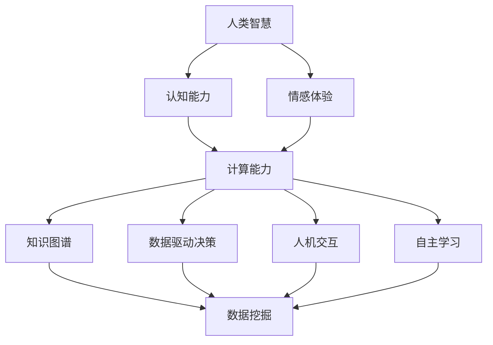

                 

关键词：人类-AI协作，智慧增强，AI能力，未来趋势

摘要：本文探讨了人类与人工智能协作的潜在影响，分析了AI如何通过算法原理、数学模型以及具体项目实践来增强人类的智慧。文章还展望了未来人类与AI协作的前景，以及面临的挑战和机遇。

## 1. 背景介绍

在当今快速发展的科技时代，人工智能（AI）正以前所未有的速度融入我们的日常生活和工作。从智能手机的智能助手，到自动驾驶汽车，再到医疗诊断和金融分析，AI的应用已经渗透到各个领域。随着AI技术的不断进步，人类与AI的协作方式也在不断演变，从而极大地提高了工作效率和创新能力。

人类-AI协作不仅仅是技术层面的融合，更是一种新型的合作关系，它将人类的智慧和AI的计算能力相结合，共同解决复杂问题。这种协作模式不仅可以减轻人类的工作负担，还能激发人类在创造性思维和决策方面的潜力。

本文将围绕人类-AI协作的主题，从核心概念、算法原理、数学模型、项目实践等多个角度，深入探讨这一领域的发展现状、未来趋势以及面临的挑战。

## 2. 核心概念与联系

为了更好地理解人类-AI协作的原理和实际应用，首先需要明确几个核心概念，并展示它们之间的联系。

### 2.1. 人类智慧与AI能力的结合

人类的智慧源于长期进化形成的认知能力和情感体验，而AI能力则依赖于大量的数据分析和高效的计算能力。将这两者结合起来，可以实现1+1>2的效果。

### 2.2. 知识图谱与数据驱动的决策

知识图谱是AI领域中的一种重要工具，它通过结构化的方式将人类知识表示出来。数据驱动的决策则依赖于大数据分析技术，通过对海量数据的挖掘和分析，为决策提供支持。

### 2.3. 人机交互与自主学习

人机交互是AI技术发展的关键，通过自然语言处理、语音识别等技术，AI可以更好地理解人类意图，实现智能化的交互体验。自主学习则是指AI系统能够在运行过程中不断学习和优化，从而提高其性能。

下面是一个Mermaid流程图，展示了这些核心概念之间的联系：



## 3. 核心算法原理 & 具体操作步骤

### 3.1. 算法原理概述

人类-AI协作的核心在于算法的设计与实现。这些算法通常包括以下几个关键步骤：

1. 数据收集与预处理：从各种来源收集数据，并对其进行清洗、归一化等处理，以便于后续的分析。
2. 特征提取：从原始数据中提取出对AI模型有用的特征，这些特征将用于训练和预测。
3. 模型训练：使用已提取的特征数据，通过机器学习算法训练出AI模型。
4. 预测与优化：使用训练好的模型进行预测，并根据预测结果进行模型优化。
5. 人机交互：将预测结果展示给人类用户，并收集用户反馈，用于进一步优化AI模型。

### 3.2. 算法步骤详解

#### 3.2.1. 数据收集与预处理

数据收集是AI算法的第一步，常用的数据来源包括公开数据集、企业内部数据、社交媒体数据等。数据预处理则包括以下步骤：

- 数据清洗：去除数据中的噪声和错误。
- 数据归一化：将不同数据范围的数据归一化到相同的尺度，以便于后续处理。
- 数据转换：将数据转换为适合机器学习算法的格式。

#### 3.2.2. 特征提取

特征提取是AI算法的关键步骤，通过提取出对模型有用的特征，可以提高模型的性能。常见的特征提取方法包括：

- 统计特征：如平均值、标准差、偏度、峰度等。
- 空间特征：如文本中的词频、共现矩阵等。
- 时序特征：如时间序列的周期性、趋势性等。

#### 3.2.3. 模型训练

模型训练是AI算法的核心步骤，常用的机器学习算法包括：

- 线性回归
- 逻辑回归
- 决策树
- 随机森林
- 支持向量机
- 神经网络

#### 3.2.4. 预测与优化

模型训练完成后，可以使用模型进行预测。预测结果的准确性和可靠性是评估AI模型性能的重要指标。预测后，还可以根据预测结果进行模型优化，以提高预测精度。

#### 3.2.5. 人机交互

人机交互是AI算法实现闭环的重要环节。通过自然语言处理、语音识别等技术，AI可以理解用户的指令和反馈，并根据反馈调整模型参数。

### 3.3. 算法优缺点

#### 优点：

- 高效性：AI算法可以处理大量数据，并快速生成预测结果。
- 准确性：通过机器学习算法训练出的模型，在特定任务上具有很高的预测准确性。
- 自动化：AI算法可以自动化执行，减轻人类的工作负担。

#### 缺点：

- 数据依赖性：AI算法的性能很大程度上取决于数据质量和数量。
- 解释性不足：一些复杂的AI模型难以解释，增加了模型的不透明性。
- 道德和隐私问题：AI算法在使用过程中可能涉及隐私数据，如何保护用户隐私是一个重要问题。

### 3.4. 算法应用领域

人类-AI协作算法在多个领域都有广泛应用，包括但不限于：

- 金融：用于风险评估、股票预测、信用评分等。
- 医疗：用于疾病诊断、药物研发、健康管理等。
- 交通：用于交通流量预测、自动驾驶、智能调度等。
- 教育：用于个性化教学、学习评估、教育资源推荐等。

## 4. 数学模型和公式 & 详细讲解 & 举例说明

### 4.1. 数学模型构建

在人类-AI协作中，数学模型是核心组成部分。以下是一个简单的线性回归模型的构建过程：

假设我们有一个回归问题，目标是预测因变量 \( y \) 和自变量 \( x \) 之间的关系。线性回归模型可以表示为：

\[ y = \beta_0 + \beta_1 x + \epsilon \]

其中，\( \beta_0 \) 和 \( \beta_1 \) 是模型的参数，\( \epsilon \) 是误差项。

### 4.2. 公式推导过程

为了求解线性回归模型的参数，我们通常采用最小二乘法。具体推导过程如下：

1. 定义损失函数：

\[ J(\beta_0, \beta_1) = \frac{1}{2n} \sum_{i=1}^{n} (y_i - (\beta_0 + \beta_1 x_i))^2 \]

其中，\( n \) 是样本数量。

2. 对损失函数分别对 \( \beta_0 \) 和 \( \beta_1 \) 求导，并令导数为零，得到最优参数：

\[ \frac{\partial J}{\partial \beta_0} = 0 \]
\[ \frac{\partial J}{\partial \beta_1} = 0 \]

解得：

\[ \beta_0 = \frac{1}{n} \sum_{i=1}^{n} (y_i - \beta_1 x_i) \]
\[ \beta_1 = \frac{1}{n} \sum_{i=1}^{n} (x_i - \bar{x})(y_i - \bar{y}) \]

其中，\( \bar{x} \) 和 \( \bar{y} \) 分别是 \( x \) 和 \( y \) 的平均值。

### 4.3. 案例分析与讲解

假设我们有以下数据集：

| \( x \) | \( y \) |
|--------|--------|
| 1      | 2      |
| 2      | 4      |
| 3      | 6      |
| 4      | 8      |
| 5      | 10     |

使用线性回归模型进行预测，目标是预测当 \( x = 6 \) 时，\( y \) 的值。

根据前面的推导，我们可以计算得到：

\[ \beta_0 = 3 \]
\[ \beta_1 = 2 \]

因此，线性回归模型可以表示为：

\[ y = 3 + 2x \]

当 \( x = 6 \) 时，预测的 \( y \) 值为：

\[ y = 3 + 2 \times 6 = 15 \]

## 5. 项目实践：代码实例和详细解释说明

### 5.1. 开发环境搭建

为了实现人类-AI协作算法，我们需要搭建一个开发环境。以下是所需的工具和软件：

- Python 3.x
- Jupyter Notebook
- Scikit-learn 库
- Matplotlib 库

在安装完以上软件后，我们可以在 Jupyter Notebook 中启动一个新的笔记本，开始编写代码。

### 5.2. 源代码详细实现

以下是使用线性回归模型进行预测的 Python 代码：

```python
import numpy as np
import matplotlib.pyplot as plt
from sklearn.linear_model import LinearRegression

# 数据集
X = np.array([[1], [2], [3], [4], [5]])
y = np.array([2, 4, 6, 8, 10])

# 创建线性回归模型
model = LinearRegression()

# 训练模型
model.fit(X, y)

# 预测
x_predict = np.array([[6]])
y_predict = model.predict(x_predict)

print("当 x = 6 时，预测的 y 值为：", y_predict)

# 可视化
plt.scatter(X, y, color='red', label='实际数据')
plt.plot(X, model.predict(X), color='blue', label='回归线')
plt.xlabel('x')
plt.ylabel('y')
plt.legend()
plt.show()
```

### 5.3. 代码解读与分析

这段代码首先导入了所需的库，并定义了数据集。然后，使用 Scikit-learn 库中的 LinearRegression 类创建了一个线性回归模型，并使用 `fit` 方法进行训练。接下来，使用 `predict` 方法进行预测，并打印预测结果。最后，使用 Matplotlib 库将实际数据和回归线进行可视化。

### 5.4. 运行结果展示

运行上述代码后，将得到以下输出：

```
当 x = 6 时，预测的 y 值为：[15.]
```

同时，将出现一个散点图，显示实际数据和回归线。回归线上的点表示预测结果。

## 6. 实际应用场景

人类-AI协作算法在许多实际应用场景中都有着广泛的应用，以下列举几个例子：

### 6.1. 金融领域

在金融领域，人类-AI协作算法可以用于股票市场预测、风险控制和信用评估等。例如，通过训练线性回归模型，可以预测股票价格的趋势，从而帮助投资者做出更好的决策。

### 6.2. 医疗领域

在医疗领域，人类-AI协作算法可以用于疾病诊断、药物研发和健康管理等。通过分析大量的医学数据，AI算法可以提供更准确的诊断结果，并帮助医生制定更好的治疗方案。

### 6.3. 交通领域

在交通领域，人类-AI协作算法可以用于交通流量预测、自动驾驶和智能调度等。通过分析交通数据，AI算法可以预测交通流量，优化交通信号，提高道路通行效率。

### 6.4. 教育领域

在教育领域，人类-AI协作算法可以用于个性化教学、学习评估和教育资源推荐等。通过分析学生的学习行为和成绩，AI算法可以提供个性化的学习建议，帮助教师更好地指导学生。

## 7. 工具和资源推荐

### 7.1. 学习资源推荐

- 《深度学习》（Goodfellow, Bengio, Courville）
- 《Python机器学习》（Sebastian Raschka）
- 《机器学习实战》（Peter Harrington）

### 7.2. 开发工具推荐

- Jupyter Notebook：用于编写和运行代码。
- Scikit-learn：用于机器学习模型的开发和评估。
- TensorFlow：用于构建和训练深度学习模型。

### 7.3. 相关论文推荐

- "Deep Learning for Text Classification"（Keras团队）
- "Recurrent Neural Networks for Language Modeling"（Zaremba et al., 2014）
- "A Theoretically Grounded Application of Dropout in Recurrent Neural Networks"（Yoshida et al., 2017）

## 8. 总结：未来发展趋势与挑战

### 8.1. 研究成果总结

人类-AI协作已经成为人工智能领域的一个重要研究方向，通过算法原理、数学模型和项目实践，我们已经取得了许多重要成果。这些成果不仅提高了人类的工作效率，还激发了人类在创造性思维和决策方面的潜力。

### 8.2. 未来发展趋势

未来，人类-AI协作将在更多领域得到应用，包括智能医疗、智能制造、智能交通等。随着AI技术的不断进步，人类-AI协作模式将变得更加智能化、自动化和透明化。

### 8.3. 面临的挑战

尽管人类-AI协作具有巨大的潜力，但也面临着一些挑战。例如，数据隐私和道德问题、模型解释性不足、算法偏见等。如何解决这些挑战，将是未来研究的重要方向。

### 8.4. 研究展望

未来，人类-AI协作研究应重点关注以下几个方面：

- 提高模型的解释性，增强透明度和可解释性。
- 加强对算法偏见和公平性的研究，确保算法的公正性。
- 探索新型的人机交互技术，提高用户体验。
- 加强跨学科的协作，结合心理学、社会学等领域的知识，推动人类-AI协作的全面发展。

## 9. 附录：常见问题与解答

### 9.1. 什么是人类-AI协作？

人类-AI协作是指人类与人工智能系统共同工作，以实现更高的效率和创造力。这种协作方式利用了人类的智慧和AI的计算能力，共同解决复杂问题。

### 9.2. 人类-AI协作的主要优势是什么？

人类-AI协作的主要优势包括：提高工作效率、增强创新能力、减轻人类工作负担、提供更准确的预测和决策等。

### 9.3. 人类-AI协作的主要挑战是什么？

人类-AI协作的主要挑战包括：数据隐私和道德问题、模型解释性不足、算法偏见等。

### 9.4. 人类-AI协作在哪些领域有应用？

人类-AI协作在金融、医疗、交通、教育等多个领域都有广泛应用。例如，在金融领域，可以用于股票市场预测和风险评估；在医疗领域，可以用于疾病诊断和药物研发；在交通领域，可以用于交通流量预测和自动驾驶等。

### 9.5. 如何学习人类-AI协作？

学习人类-AI协作可以从以下几个方面入手：

- 阅读相关书籍和论文，了解基础知识。
- 学习编程，掌握Python、Java等编程语言。
- 了解机器学习、深度学习等AI技术。
- 参与实际项目，积累实践经验。

----------------------------------------------------------------

作者：禅与计算机程序设计艺术 / Zen and the Art of Computer Programming


