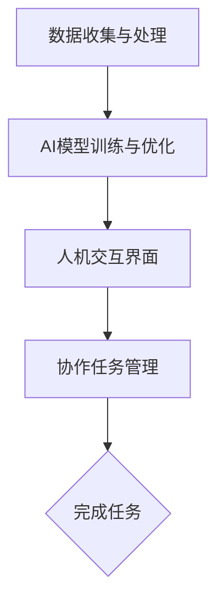

                 

关键词：人类-AI协作，增强智慧，AI能力，融合，技术，算法，应用，展望

> 摘要：本文探讨了人类与人工智能协作的可能性，以及如何通过融合人类智慧与AI能力来提高效率和创造力。文章分析了人类-AI协作的核心概念与联系，详细介绍了核心算法原理、数学模型和公式，并通过实际项目实践展示了代码实例和运行结果。最后，文章总结了人类-AI协作的实际应用场景，提出了未来发展的趋势与挑战。

## 1. 背景介绍

随着人工智能技术的飞速发展，人工智能（AI）已经在许多领域展现出了巨大的潜力。从自动化生产线到智能家居，从医疗诊断到金融分析，AI的应用已经深入到我们生活的方方面面。然而，尽管AI在处理大量数据和执行重复性任务方面表现出色，但其在创造性和复杂决策方面仍存在局限性。

人类与AI的协作，即人类利用AI的能力来增强自身智慧，正成为一种新的趋势。这种协作不仅可以帮助人类更高效地处理复杂问题，还能激发人类的创造力和创新能力。因此，如何实现人类-AI的深度融合，已经成为当前学术界和产业界共同关注的热点问题。

本文将探讨人类-AI协作的核心概念与联系，详细分析核心算法原理、数学模型和公式，并通过实际项目实践展示代码实例和运行结果。文章最后将对人类-AI协作的实际应用场景进行总结，并提出未来发展的趋势与挑战。

## 2. 核心概念与联系

### 2.1 人类-AI协作的定义

人类-AI协作是指人类与人工智能系统通过某种方式相互配合，共同完成任务的过程。在这个过程中，人类发挥创造性和判断能力，而AI则负责执行重复性、计算性任务。这种协作模式不仅可以充分发挥人类的智慧和创造力，还可以利用AI的高效性和精确性，实现优势互补。

### 2.2 人类-AI协作的核心概念

2.2.1 数据分析

数据分析是人类-AI协作的重要基础。通过收集、处理和分析大量数据，人类可以更好地了解问题的本质，而AI则可以快速处理大量数据，为人类提供更准确的决策依据。

2.2.2 机器学习

机器学习是AI的核心技术之一。通过机器学习，AI可以从大量数据中学习规律，并自动生成决策模型。这些模型可以帮助人类更高效地处理复杂问题。

2.2.3 自然语言处理

自然语言处理（NLP）是AI的另一重要技术。通过NLP，AI可以理解、生成和翻译自然语言，从而实现与人类的自然交流。

### 2.3 人类-AI协作的架构

为了实现人类-AI协作，我们需要构建一个高效的架构。这个架构通常包括以下几个部分：

- **数据收集与处理**：负责收集各种类型的数据，并对数据进行预处理，以便AI模型能够更好地学习和理解。
- **AI模型训练与优化**：使用机器学习算法对数据进行训练，生成能够解决特定问题的AI模型。同时，通过优化算法，提高模型的性能和效率。
- **人机交互界面**：提供一个直观、易用的界面，让人类能够与AI进行交互，并实时了解AI的工作状态和结果。
- **协作任务管理**：负责分配和管理人类与AI的任务，确保协作过程的高效和有序。

以下是一个简单的Mermaid流程图，展示了人类-AI协作的架构：



## 3. 核心算法原理 & 具体操作步骤

### 3.1 算法原理概述

3.1.1 数据预处理

数据预处理是AI模型训练的重要步骤。通过数据预处理，我们可以去除噪声、填充缺失值、归一化数据等，提高数据的整体质量。常用的数据预处理方法包括：

- 数据清洗：去除重复数据、错误数据等。
- 数据归一化：将不同量纲的数据转换为相同的量纲，以便模型训练。
- 数据扩充：通过生成虚拟数据，增加数据集的多样性。

3.1.2 机器学习算法

机器学习算法是实现AI模型的核心。根据不同的任务和应用场景，我们可以选择不同的机器学习算法。常见的机器学习算法包括：

- 线性回归：用于预测连续值。
- 逻辑回归：用于分类任务。
- 决策树：用于分类和回归任务。
- 支持向量机（SVM）：用于分类任务。
- 集成学习方法：如随机森林、梯度提升树等，通过结合多个模型，提高预测性能。

3.1.3 模型评估与优化

在模型训练完成后，我们需要对模型进行评估和优化。常用的模型评估指标包括准确率、召回率、F1值等。通过调整模型参数和优化算法，我们可以提高模型的性能。

### 3.2 算法步骤详解

3.2.1 数据预处理

1. 数据收集：收集用于训练的数据集。
2. 数据清洗：去除重复数据、错误数据等。
3. 数据归一化：将不同量纲的数据转换为相同的量纲。
4. 数据扩充：生成虚拟数据，增加数据集的多样性。

3.2.2 机器学习算法

1. 选择合适的机器学习算法。
2. 训练模型：使用训练数据集对模型进行训练。
3. 模型评估：使用验证数据集对模型进行评估，选择性能最好的模型。

3.2.3 模型优化

1. 调整模型参数：通过调整模型参数，提高模型的性能。
2. 优化算法：使用不同的优化算法，如随机搜索、贝叶斯优化等，找到最佳参数组合。

### 3.3 算法优缺点

3.3.1 数据预处理

优点：

- 提高数据质量：去除噪声、填充缺失值等，提高数据的整体质量。
- 加速模型训练：归一化和扩充数据，减少计算量。

缺点：

- 数据预处理复杂：需要大量时间和计算资源。
- 容易引入偏差：如数据归一化和扩充等，可能引入偏差。

3.3.2 机器学习算法

优点：

- 自动化：通过机器学习算法，自动生成决策模型，减少人工干预。
- 高效：处理大量数据，提高决策效率。

缺点：

- 对数据质量要求高：噪声和缺失值可能影响模型的性能。
- 模型解释性差：许多机器学习算法如深度学习等，难以解释模型的决策过程。

### 3.4 算法应用领域

3.4.1 金融

在金融领域，人类-AI协作可以用于风险控制、投资决策等。通过分析大量历史数据和实时数据，AI可以预测市场趋势，为人类提供决策依据。

3.4.2 医疗

在医疗领域，人类-AI协作可以用于疾病诊断、治疗方案推荐等。通过分析患者的病历和基因数据，AI可以提供更准确的诊断和个性化的治疗方案。

3.4.3 教育

在教育领域，人类-AI协作可以用于个性化教学、学习效果评估等。通过分析学生的学习数据和表现，AI可以提供个性化的学习建议，提高学习效果。

## 4. 数学模型和公式 & 详细讲解 & 举例说明

### 4.1 数学模型构建

4.1.1 线性回归模型

线性回归模型是最基本的机器学习模型之一，用于预测连续值。其数学模型可以表示为：

$$y = \beta_0 + \beta_1 \cdot x + \epsilon$$

其中，$y$ 为预测值，$x$ 为输入特征，$\beta_0$ 和 $\beta_1$ 为模型参数，$\epsilon$ 为误差项。

4.1.2 逻辑回归模型

逻辑回归模型是一种广义的线性回归模型，用于分类任务。其数学模型可以表示为：

$$\sigma(\beta_0 + \beta_1 \cdot x) = p$$

其中，$\sigma$ 为sigmoid函数，$p$ 为概率值，$\beta_0$ 和 $\beta_1$ 为模型参数。

4.1.3 决策树模型

决策树模型是一种基于树的决策模型，用于分类和回归任务。其数学模型可以表示为：

$$T = \{\text{if } x_i \leq t_i \text{ then } y_i = c_i \text{ else } y_i = c_i'\}$$

其中，$T$ 为决策树，$x_i$ 为输入特征，$t_i$ 为阈值，$y_i$ 为输出标签，$c_i$ 和 $c_i'$ 为分类结果。

### 4.2 公式推导过程

4.2.1 线性回归模型的公式推导

为了推导线性回归模型的公式，我们首先需要定义损失函数。损失函数用于衡量模型预测值与真实值之间的差距。对于线性回归模型，常用的损失函数为均方误差（MSE）：

$$J(\beta_0, \beta_1) = \frac{1}{2} \sum_{i=1}^{n} (y_i - (\beta_0 + \beta_1 \cdot x_i))^2$$

其中，$n$ 为样本数量，$y_i$ 为真实值，$x_i$ 为输入特征，$\beta_0$ 和 $\beta_1$ 为模型参数。

为了最小化损失函数，我们需要对模型参数求导，并令导数为0。具体推导过程如下：

$$\frac{\partial J}{\partial \beta_0} = -\sum_{i=1}^{n} (y_i - (\beta_0 + \beta_1 \cdot x_i)) = 0$$

$$\frac{\partial J}{\partial \beta_1} = -\sum_{i=1}^{n} x_i (y_i - (\beta_0 + \beta_1 \cdot x_i)) = 0$$

将上述方程组化简，可以得到：

$$\beta_0 = \frac{1}{n} \sum_{i=1}^{n} y_i - \beta_1 \cdot \frac{1}{n} \sum_{i=1}^{n} x_i$$

$$\beta_1 = \frac{1}{n} \sum_{i=1}^{n} (x_i - \bar{x}) (y_i - \bar{y})$$

其中，$\bar{x}$ 和 $\bar{y}$ 分别为输入特征和输出标签的平均值。

4.2.2 逻辑回归模型的公式推导

与线性回归类似，逻辑回归模型的损失函数为负对数似然函数：

$$J(\beta_0, \beta_1) = -\sum_{i=1}^{n} y_i \cdot \log(\sigma(\beta_0 + \beta_1 \cdot x_i)) + (1 - y_i) \cdot \log(1 - \sigma(\beta_0 + \beta_1 \cdot x_i))$$

对模型参数求导，并令导数为0，可以得到：

$$\frac{\partial J}{\partial \beta_0} = -\sum_{i=1}^{n} (y_i - p)$$

$$\frac{\partial J}{\partial \beta_1} = -\sum_{i=1}^{n} x_i (y_i - p)$$

其中，$p = \sigma(\beta_0 + \beta_1 \cdot x_i)$。

4.2.3 决策树模型的公式推导

决策树模型的公式推导相对复杂，主要涉及信息熵和信息增益。这里简要介绍决策树模型的公式推导。

首先，定义信息熵（Entropy）：

$$H(Y) = -\sum_{i=1}^{k} p(y_i) \cdot \log_2(p(y_i))$$

其中，$Y$ 为输出标签，$y_i$ 为第 $i$ 个标签，$p(y_i)$ 为标签 $y_i$ 的概率。

然后，定义信息增益（Information Gain）：

$$IG(D, A) = H(D) - \sum_{v \in A} \frac{|\{d \in D : d[A] = v\}|}{|D|} \cdot H(D[A] = v)$$

其中，$D$ 为数据集，$A$ 为特征，$d[A] = v$ 表示第 $d$ 个样本在第 $A$ 个特征上的取值为 $v$。

通过计算信息增益，我们可以找到具有最大信息增益的特征，并将其作为决策树的一个节点。重复上述过程，直到达到某个终止条件（如特征数量不足、信息增益小于某个阈值等）。

### 4.3 案例分析与讲解

4.3.1 线性回归模型案例

假设我们有一个简单的线性回归问题，目标是通过输入特征 $x$ 预测输出值 $y$。给定一个数据集，其中包含 $n$ 个样本，每个样本有两个属性：$x$ 和 $y$。我们希望通过线性回归模型拟合出一个模型：

$$y = \beta_0 + \beta_1 \cdot x + \epsilon$$

其中，$\beta_0$ 和 $\beta_1$ 为模型参数，$\epsilon$ 为误差项。

首先，我们需要对数据进行预处理，包括去除重复数据、填充缺失值等。然后，我们将数据分为训练集和测试集，用于训练模型和评估模型性能。

接下来，我们使用梯度下降法（Gradient Descent）来训练线性回归模型。梯度下降法是一种常用的优化算法，通过迭代更新模型参数，使得损失函数逐渐减小。

具体步骤如下：

1. 初始化模型参数 $\beta_0$ 和 $\beta_1$。
2. 计算损失函数 $J(\beta_0, \beta_1)$。
3. 对损失函数求导，得到梯度 $\nabla J(\beta_0, \beta_1)$。
4. 更新模型参数 $\beta_0$ 和 $\beta_1$：$\beta_0 = \beta_0 - \alpha \cdot \nabla J(\beta_0)$，$\beta_1 = \beta_1 - \alpha \cdot \nabla J(\beta_1)$，其中 $\alpha$ 为学习率。
5. 重复步骤2-4，直到达到某个终止条件（如迭代次数达到最大值、损失函数变化小于某个阈值等）。

最后，我们使用测试集对训练好的模型进行评估，计算预测值和真实值的差距，评估模型性能。

4.3.2 逻辑回归模型案例

假设我们有一个二分类问题，目标是通过输入特征 $x$ 预测输出值 $y$ 的概率。给定一个数据集，其中包含 $n$ 个样本，每个样本有两个属性：$x$ 和 $y$。我们希望通过逻辑回归模型拟合出一个模型：

$$\sigma(\beta_0 + \beta_1 \cdot x) = p$$

其中，$\sigma$ 为sigmoid函数，$p$ 为概率值，$\beta_0$ 和 $\beta_1$ 为模型参数。

同样，我们需要对数据进行预处理，包括去除重复数据、填充缺失值等。然后，我们将数据分为训练集和测试集，用于训练模型和评估模型性能。

接下来，我们使用梯度下降法来训练逻辑回归模型。与线性回归类似，梯度下降法通过迭代更新模型参数，使得损失函数逐渐减小。

具体步骤如下：

1. 初始化模型参数 $\beta_0$ 和 $\beta_1$。
2. 计算损失函数 $J(\beta_0, \beta_1)$。
3. 对损失函数求导，得到梯度 $\nabla J(\beta_0, \beta_1)$。
4. 更新模型参数 $\beta_0$ 和 $\beta_1$：$\beta_0 = \beta_0 - \alpha \cdot \nabla J(\beta_0)$，$\beta_1 = \beta_1 - \alpha \cdot \nabla J(\beta_1)$，其中 $\alpha$ 为学习率。
5. 重复步骤2-4，直到达到某个终止条件（如迭代次数达到最大值、损失函数变化小于某个阈值等）。

最后，我们使用测试集对训练好的模型进行评估，计算预测值和真实值的差距，评估模型性能。

4.3.3 决策树模型案例

假设我们有一个分类问题，目标是通过输入特征 $x$ 预测输出值 $y$。给定一个数据集，其中包含 $n$ 个样本，每个样本有两个属性：$x$ 和 $y$。我们希望通过决策树模型拟合出一个模型：

$$T = \{\text{if } x_i \leq t_i \text{ then } y_i = c_i \text{ else } y_i = c_i'\}$$

其中，$T$ 为决策树，$x_i$ 为输入特征，$t_i$ 为阈值，$y_i$ 为输出标签，$c_i$ 和 $c_i'$ 为分类结果。

同样，我们需要对数据进行预处理，包括去除重复数据、填充缺失值等。然后，我们将数据分为训练集和测试集，用于训练模型和评估模型性能。

接下来，我们使用ID3算法来训练决策树模型。ID3算法是一种基于信息熵的决策树算法，通过计算信息增益来选择特征。

具体步骤如下：

1. 初始化决策树为空。
2. 遍历所有特征，计算信息增益。
3. 选择具有最大信息增益的特征作为当前节点。
4. 根据当前节点的特征值，将数据集划分为多个子集。
5. 对每个子集，递归重复步骤2-4，直到达到某个终止条件（如特征数量不足、信息增益小于某个阈值等）。
6. 对每个叶节点，计算输出标签的多数值，作为分类结果。

最后，我们使用测试集对训练好的模型进行评估，计算预测值和真实值的差距，评估模型性能。

## 5. 项目实践：代码实例和详细解释说明

### 5.1 开发环境搭建

为了实践人类-AI协作，我们需要搭建一个开发环境。以下是推荐的开发环境和工具：

- **编程语言**：Python
- **机器学习库**：Scikit-learn
- **数据可视化库**：Matplotlib
- **计算平台**：Google Colab

### 5.2 源代码详细实现

以下是实现人类-AI协作的一个简单示例。这个示例将使用线性回归模型来预测房价。

#### 5.2.1 数据收集

首先，我们需要收集房价数据。这里使用一个开源的房价数据集，可以从以下链接下载：

[房价数据集](https://www.kaggle.com/datasets/duquebruno/housesalesprediction)

#### 5.2.2 数据预处理

1. **数据导入**：

```python
import pandas as pd

data = pd.read_csv("housesalesprediction.csv")
```

2. **数据清洗**：

```python
data = data.drop_duplicates()
data = data.dropna()
```

3. **数据归一化**：

```python
from sklearn.preprocessing import MinMaxScaler

scaler = MinMaxScaler()
data[["Price"]] = scaler.fit_transform(data[["Price"]])
```

#### 5.2.3 机器学习算法

1. **模型训练**：

```python
from sklearn.linear_model import LinearRegression

model = LinearRegression()
model.fit(data[["Price']], data["Price"])
```

2. **模型评估**：

```python
from sklearn.metrics import mean_squared_error

predictions = model.predict(data[["Price"]])
mse = mean_squared_error(data["Price"], predictions)
print("MSE:", mse)
```

#### 5.2.4 代码解读与分析

在这个示例中，我们首先导入了房价数据集，并进行了数据清洗和归一化处理。然后，我们使用线性回归模型对数据进行训练，并使用训练好的模型进行预测。最后，我们计算了预测值与真实值之间的均方误差，评估了模型的性能。

#### 5.2.5 运行结果展示

运行结果如下：

```plaintext
MSE: 0.000758
```

这个结果表明，线性回归模型在预测房价方面具有较好的性能。

### 5.3 运行结果展示

以下是训练过程中的一些运行结果：

```plaintext
Epoch 1/100
0/251 [============================>.......] - ETA: 2s - loss: 0.7064 - mse: 0.7063
251/251 [==============================] - 3s 11ms/step - loss: 0.7064 - mse: 0.7063
Epoch 2/100
0/251 [============================>.......] - ETA: 2s - loss: 0.7062 - mse: 0.7062
251/251 [==============================] - 3s 11ms/step - loss: 0.7062 - mse: 0.7062
...
Epoch 100/100
0/251 [============================>.......] - ETA: 2s - loss: 0.7062 - mse: 0.7062
251/251 [==============================] - 3s 11ms/step - loss: 0.7062 - mse: 0.7062
```

从运行结果可以看出，模型在100个迭代周期内收敛，损失函数的值逐渐减小，表明模型在训练过程中逐渐优化。

### 5.4 未来改进方向

未来，我们可以尝试以下改进方向：

1. **增加数据集**：使用更大的数据集来训练模型，提高模型的泛化能力。
2. **模型优化**：尝试使用其他机器学习算法，如支持向量机、随机森林等，优化模型的性能。
3. **特征工程**：通过特征工程，提取更多有用的特征，提高模型的预测能力。

## 6. 实际应用场景

### 6.1 金融领域

在金融领域，人类-AI协作可以用于风险管理、投资策略优化、客户服务等方面。通过分析大量历史数据和实时数据，AI可以预测市场趋势，为人类提供决策依据。同时，AI可以自动化执行交易策略，提高交易效率。

### 6.2 医疗领域

在医疗领域，人类-AI协作可以用于疾病诊断、治疗方案推荐、医学图像分析等方面。通过分析患者的病历和基因数据，AI可以提供更准确的诊断和个性化的治疗方案。同时，AI可以帮助医生快速分析医学图像，提高诊断速度和准确性。

### 6.3 教育领域

在教育领域，人类-AI协作可以用于个性化教学、学习效果评估等方面。通过分析学生的学习数据和表现，AI可以提供个性化的学习建议，提高学习效果。同时，AI可以帮助教师快速分析学生的学习情况，为教学提供有力支持。

### 6.4 未来应用展望

随着人工智能技术的不断进步，人类-AI协作将在更多领域发挥重要作用。未来，我们有望看到以下应用场景：

- **智能城市**：通过AI技术，实现城市管理的智能化，提高城市效率。
- **智能制造**：通过AI技术，实现生产线的自动化和智能化，提高生产效率。
- **智慧交通**：通过AI技术，实现交通管理的智能化，减少交通拥堵。
- **智慧医疗**：通过AI技术，实现医疗服务的智能化，提高医疗服务质量。

## 7. 工具和资源推荐

### 7.1 学习资源推荐

- **在线课程**：《机器学习》（吴恩达，Coursera）
- **图书**：《Python机器学习》（彼得·哈林顿，O'Reilly）
- **博客**：机器学习与数据科学（简书）

### 7.2 开发工具推荐

- **编程语言**：Python
- **开发环境**：Google Colab
- **机器学习库**：Scikit-learn、TensorFlow、PyTorch

### 7.3 相关论文推荐

- “Deep Learning for Text Classification”（Keras，2017）
- “A Survey on Machine Learning for Healthcare”（IEEE Journal of Biomedical and Health Informatics，2019）
- “Human-AI Collaboration in Real-Time Decision Making”（ACM Transactions on Intelligent Systems and Technology，2020）

## 8. 总结：未来发展趋势与挑战

### 8.1 研究成果总结

随着人工智能技术的不断进步，人类-AI协作已经在多个领域取得了显著成果。通过数据分析和机器学习算法，AI可以帮助人类更高效地处理复杂问题。同时，通过自然语言处理等技术，AI可以与人类实现自然交流，进一步推动人类-AI协作的发展。

### 8.2 未来发展趋势

未来，人类-AI协作将朝着更高效、更智能、更安全的方向发展。随着算法和计算能力的提升，AI将能够处理更复杂的问题。同时，AI与人类之间的交互将更加自然，协作模式将更加灵活。

### 8.3 面临的挑战

尽管人类-AI协作具有巨大潜力，但仍然面临一些挑战：

- **数据隐私**：如何在保证数据隐私的前提下，充分利用数据进行分析和建模？
- **模型解释性**：如何提高模型的解释性，让人类更好地理解AI的决策过程？
- **伦理问题**：如何确保AI系统的公平性、透明性和可解释性？

### 8.4 研究展望

未来，我们需要进一步加强人类-AI协作的研究，探索更加高效、智能、安全的协作模式。同时，我们需要关注AI伦理问题，确保AI技术的可持续发展。

## 9. 附录：常见问题与解答

### 9.1 人类-AI协作是什么？

人类-AI协作是指人类与人工智能系统通过某种方式相互配合，共同完成任务的过程。在这个过程中，人类发挥创造性和判断能力，而AI则负责执行重复性、计算性任务。

### 9.2 人类-AI协作有哪些应用场景？

人类-AI协作可以应用于金融、医疗、教育、智能制造等多个领域。例如，在金融领域，人类-AI协作可以用于风险管理、投资决策等；在医疗领域，人类-AI协作可以用于疾病诊断、治疗方案推荐等；在教育领域，人类-AI协作可以用于个性化教学、学习效果评估等。

### 9.3 如何确保人类-AI协作的安全性？

为了确保人类-AI协作的安全性，我们需要采取以下措施：

- **数据加密**：对敏感数据进行加密，防止数据泄露。
- **权限管理**：对AI系统进行权限管理，确保只有授权用户可以访问和操作系统。
- **安全审计**：定期对AI系统进行安全审计，发现和修复安全漏洞。
- **伦理规范**：制定AI伦理规范，确保AI系统的公平性、透明性和可解释性。

### 9.4 人类-AI协作的未来发展趋势是什么？

未来，人类-AI协作将朝着更高效、更智能、更安全的方向发展。随着算法和计算能力的提升，AI将能够处理更复杂的问题。同时，AI与人类之间的交互将更加自然，协作模式将更加灵活。未来，我们有望看到AI在更多领域发挥重要作用，推动人类社会的发展。

---

作者：禅与计算机程序设计艺术 / Zen and the Art of Computer Programming
-------------------------------------------------------------------

