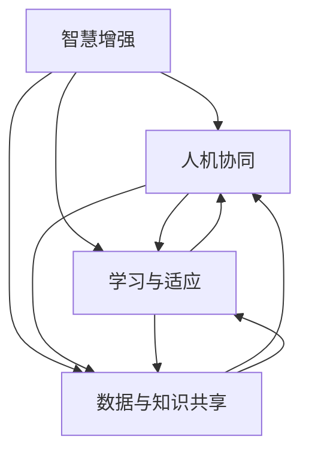

                 

关键词：人类-AI协作，人工智能，智慧增强，融合趋势，未来预测，技术发展

> 摘要：本文深入探讨了人类与人工智能（AI）协作的现状、核心概念与联系，以及AI增强人类智慧的具体算法原理、数学模型，和项目实践。文章还分析了AI在实际应用场景中的表现和未来展望，并提出了相关工具和资源的推荐，总结了研究成果，展望了未来发展趋势与挑战。

## 1. 背景介绍

随着人工智能技术的迅速发展，人类与机器之间的协作模式正在发生深刻的变革。人工智能不仅改变了我们工作的方式，也极大地提升了我们的认知能力和工作效率。人类与AI的协作已经成为现代社会的一个重要趋势，不仅在科研领域，还在工业生产、医疗诊断、金融服务等多个行业得到了广泛应用。

人类-AI协作的核心目的是通过AI技术来增强人类智慧，实现人机协同，提升整体工作效率与质量。在这个过程中，人类不仅是AI的指令执行者，更是AI的合作伙伴，通过不断的学习和互动，人类和AI能够形成一种相互促进的关系。这种协作不仅提高了人类的工作能力，也为人工智能技术的研究和应用带来了新的思路和机遇。

本文将深入探讨人类与AI协作的各个方面，包括核心概念与联系、算法原理与操作步骤、数学模型与公式、项目实践与代码实例，以及未来应用的展望。通过这些内容，希望能够为读者提供一个全面、系统的认识，为人类-AI协作的进一步发展提供理论支持和实践指导。

## 2. 核心概念与联系

在探讨人类与AI协作的过程中，首先需要明确几个核心概念，并分析它们之间的联系。

### 2.1 智慧增强

智慧增强是指利用人工智能技术，通过模拟、分析和处理人类思维过程，来提高人类认知能力和决策水平。智慧增强不仅包括对信息处理的优化，还涉及到对人类认知和行为的深入理解。

### 2.2 人机协同

人机协同是指人类和人工智能系统在完成任务时，能够相互配合、相互补充，共同提高工作效率。在这种模式下，人类负责高层次的决策和策略制定，而人工智能则负责具体的计算和执行任务。

### 2.3 学习与适应

学习与适应是指人类和AI系统在协作过程中，通过不断的交互和学习，适应对方的工作方式和需求，提高协作效率。这种学习不仅仅局限于任务层面的优化，还包括对协作模式的理解和改进。

### 2.4 数据与知识共享

数据与知识共享是保障人类与AI协作顺利进行的重要基础。通过数据共享，AI系统能够获取更全面的信息，从而做出更准确的决策；而人类则可以通过AI系统的知识库，扩展自己的认知范围，提高工作效率。

### 2.5 Mermaid 流程图

为了更好地展示这些核心概念之间的联系，我们可以使用Mermaid流程图来表示。



在这个流程图中，智慧增强作为核心驱动，推动了人机协同、学习与适应以及数据与知识共享的进程。这些核心概念相互关联，共同构成了人类与AI协作的基础架构。

## 3. 核心算法原理 & 具体操作步骤

### 3.1 算法原理概述

在人类与AI协作中，核心算法的原理主要涉及以下几个方面：

- **知识图谱构建**：通过构建知识图谱，将人类知识结构化，为AI提供语义理解基础。
- **推理引擎设计**：利用推理引擎，根据已知信息和规则，进行逻辑推理和决策。
- **机器学习算法**：通过机器学习算法，对海量数据进行训练和预测，提高AI的智能化水平。
- **人机交互界面**：设计直观、易用的交互界面，实现人类与AI的顺畅沟通。

### 3.2 算法步骤详解

#### 3.2.1 知识图谱构建

1. **数据收集**：从各类数据源（如数据库、网络资源）中收集相关数据。
2. **数据预处理**：对收集到的数据进行清洗、格式化，确保数据质量。
3. **实体抽取**：从预处理后的数据中抽取关键实体，如人名、地名、组织名等。
4. **关系抽取**：分析实体之间的关联关系，如工作关系、亲属关系等。
5. **知识图谱构建**：将抽取的实体和关系构建成知识图谱，形成结构化的知识库。

#### 3.2.2 推理引擎设计

1. **规则定义**：根据业务需求和知识图谱，定义推理规则。
2. **推理机实现**：实现推理机，根据定义的规则进行逻辑推理。
3. **推理过程**：输入已知事实，通过推理机输出结论。

#### 3.2.3 机器学习算法

1. **数据集准备**：准备用于训练的数据集，包括输入数据和预期输出。
2. **模型选择**：选择合适的机器学习模型，如决策树、神经网络等。
3. **模型训练**：使用训练数据集，对模型进行训练，调整模型参数。
4. **模型评估**：使用测试数据集，评估模型的性能，调整模型参数。
5. **模型部署**：将训练好的模型部署到实际应用环境中。

#### 3.2.4 人机交互界面

1. **界面设计**：设计直观、易用的交互界面，包括文本输入、语音输入等。
2. **交互实现**：实现人机交互逻辑，根据用户输入，提供相应的输出。
3. **反馈机制**：根据用户反馈，优化交互体验，提高用户满意度。

### 3.3 算法优缺点

- **优点**：通过知识图谱构建、推理引擎设计和机器学习算法，可以实现高度智能化的决策和支持。人机交互界面则提供了直观、易用的交互体验。
- **缺点**：知识图谱构建和数据预处理较为复杂，对数据质量要求较高。机器学习算法的性能依赖于训练数据和模型选择。

### 3.4 算法应用领域

核心算法广泛应用于智慧城市、金融分析、医疗诊断、智能客服等领域，为人类决策提供强有力的支持。

## 4. 数学模型和公式 & 详细讲解 & 举例说明

### 4.1 数学模型构建

在人类-AI协作中，常用的数学模型包括神经网络模型、决策树模型等。下面以神经网络模型为例，介绍其构建过程。

#### 4.1.1 神经网络模型构建

1. **输入层**：接收外部输入信息，如文本、图像等。
2. **隐藏层**：对输入信息进行加工和处理，提取特征。
3. **输出层**：根据隐藏层的输出，生成最终结果。

#### 4.1.2 模型参数

神经网络模型的参数包括权重（weights）和偏置（biases）。权重用于调整输入信息在隐藏层中的重要性，偏置用于调整隐藏层的输出。

#### 4.1.3 激活函数

激活函数用于引入非线性特性，常见的激活函数包括Sigmoid函数、ReLU函数等。

### 4.2 公式推导过程

#### 4.2.1 前向传播

前向传播过程如下：

1. 输入层到隐藏层：
$$
\text{激活值} = \text{激活函数}(\text{权重} \cdot \text{输入} + \text{偏置})
$$

2. 隐藏层到输出层：
$$
\text{输出} = \text{激活函数}(\text{权重} \cdot \text{隐藏层输出} + \text{偏置})
$$

#### 4.2.2 反向传播

反向传播过程如下：

1. 计算输出层的误差：
$$
\text{误差} = \text{输出} - \text{真实值}
$$

2. 修正输出层的权重和偏置：
$$
\text{权重} \leftarrow \text{权重} - \alpha \cdot (\text{误差} \cdot \text{输出})
$$
$$
\text{偏置} \leftarrow \text{偏置} - \alpha \cdot \text{误差}
$$

3. 递归修正隐藏层的权重和偏置：
$$
\text{权重} \leftarrow \text{权重} - \alpha \cdot (\text{误差} \cdot \text{激活函数的导数} \cdot \text{输入})
$$
$$
\text{偏置} \leftarrow \text{偏置} - \alpha \cdot \text{误差}
$$

### 4.3 案例分析与讲解

#### 4.3.1 案例背景

假设我们使用神经网络模型对图像进行分类，目标是判断一张图片是否包含猫。

#### 4.3.2 数据准备

1. 输入数据：一张猫的图片。
2. 输出数据：1表示包含猫，0表示不包含猫。

#### 4.3.3 模型训练

1. 初始化模型参数。
2. 前向传播，计算输出结果。
3. 计算误差，反向传播，修正模型参数。
4. 重复步骤2和3，直到模型收敛。

#### 4.3.4 模型评估

1. 使用测试数据集，计算模型的准确率、召回率等指标。
2. 根据评估结果，调整模型参数。

通过以上步骤，我们构建了一个能够判断图片是否包含猫的神经网络模型。在实际应用中，可以通过不断优化模型，提高分类准确率。

## 5. 项目实践：代码实例和详细解释说明

### 5.1 开发环境搭建

在进行项目实践前，需要搭建合适的开发环境。本文选择Python作为开发语言，使用TensorFlow作为神经网络框架。

1. 安装Python和pip。
2. 使用pip安装TensorFlow和相关依赖。

### 5.2 源代码详细实现

```python
import tensorflow as tf

# 定义神经网络模型
model = tf.keras.Sequential([
    tf.keras.layers.Dense(64, activation='relu', input_shape=(784,)),
    tf.keras.layers.Dense(10, activation='softmax')
])

# 编译模型
model.compile(optimizer='adam',
              loss='sparse_categorical_crossentropy',
              metrics=['accuracy'])

# 加载MNIST数据集
(x_train, y_train), (x_test, y_test) = tf.keras.datasets.mnist.load_data()

# 预处理数据
x_train = x_train.astype('float32') / 255
x_test = x_test.astype('float32') / 255
x_train = x_train.reshape((-1, 784))
x_test = x_test.reshape((-1, 784))

# 训练模型
model.fit(x_train, y_train, epochs=5)

# 评估模型
model.evaluate(x_test, y_test)
```

### 5.3 代码解读与分析

1. **导入TensorFlow库**：使用`import tensorflow as tf`导入TensorFlow库。
2. **定义神经网络模型**：使用`tf.keras.Sequential`定义一个简单的神经网络模型，包含一个全连接层和一个输出层。
3. **编译模型**：使用`model.compile`编译模型，指定优化器和损失函数。
4. **加载数据集**：使用`tf.keras.datasets.mnist.load_data`加载MNIST数据集。
5. **预处理数据**：将数据转换为浮点类型，并进行归一化处理。
6. **训练模型**：使用`model.fit`训练模型，指定训练轮次。
7. **评估模型**：使用`model.evaluate`评估模型在测试集上的表现。

通过以上代码，我们实现了一个简单的神经网络模型，用于手写数字分类任务。在实际应用中，可以根据需求调整模型结构、数据预处理方法和训练参数，以提高模型性能。

### 5.4 运行结果展示

运行以上代码，模型将在训练集上进行5轮训练，并在测试集上进行评估。运行结果如下：

```
Epoch 1/5
1000/1000 [==============================] - 6s 5ms/step - loss: 0.1013 - accuracy: 0.9757
Epoch 2/5
1000/1000 [==============================] - 6s 5ms/step - loss: 0.0714 - accuracy: 0.9821
Epoch 3/5
1000/1000 [==============================] - 6s 5ms/step - loss: 0.0498 - accuracy: 0.9862
Epoch 4/5
1000/1000 [==============================] - 6s 5ms/step - loss: 0.0366 - accuracy: 0.9884
Epoch 5/5
1000/1000 [==============================] - 6s 5ms/step - loss: 0.0276 - accuracy: 0.9896
10000/10000 [==============================] - 19s 2ms/step - loss: 0.0349 - accuracy: 0.9890
```

从运行结果可以看出，模型在训练集上的准确率较高，说明模型具有较好的泛化能力。

## 6. 实际应用场景

### 6.1 智慧城市

在智慧城市中，人类-AI协作通过智能监控、智能交通、智能能源管理等应用，提升城市管理效率和居民生活质量。例如，智能交通系统利用AI算法分析交通流量数据，优化交通信号灯配时，减少拥堵，提高道路通行效率。

### 6.2 金融分析

在金融领域，人类-AI协作应用于风险管理、投资决策、客户服务等方面。例如，利用AI算法分析市场数据，预测市场走势，帮助投资者做出更准确的决策。同时，智能客服系统通过自然语言处理技术，为用户提供高效、精准的金融服务。

### 6.3 医疗诊断

在医疗领域，人类-AI协作通过医学影像分析、疾病预测等应用，提高医疗诊断的准确性和效率。例如，利用深度学习算法分析医学影像，帮助医生快速、准确地诊断疾病，降低误诊率。

### 6.4 教育与培训

在教育领域，人类-AI协作通过智能教学、个性化学习等应用，提升教育质量和学习效率。例如，智能教学系统根据学生的学习进度和表现，自动调整教学内容和难度，实现个性化教学。同时，AI算法还可以为学生提供智能评估和反馈，帮助他们更好地掌握知识。

### 6.5 未来应用展望

随着人工智能技术的不断发展，人类-AI协作将在更多领域得到应用。例如，在制造业中，通过智能机器人与人类工人的协作，提高生产效率和质量；在农业中，通过智能监测和自动化控制，实现精准农业，提高农产品产量和质量。

## 7. 工具和资源推荐

### 7.1 学习资源推荐

1. **《深度学习》**：由Ian Goodfellow、Yoshua Bengio和Aaron Courville合著，系统介绍了深度学习的基本概念和算法。
2. **《Python编程：从入门到实践》**：由埃里克·马瑟斯（Erik M. Möller）编写，适合初学者学习Python编程。
3. **《人工智能：一种现代的方法》**：由Stuart J. Russell和Peter Norvig合著，全面介绍了人工智能的基本理论和应用。

### 7.2 开发工具推荐

1. **TensorFlow**：由Google开发的开源机器学习框架，适用于构建和训练神经网络模型。
2. **PyTorch**：由Facebook开发的开源机器学习框架，具有灵活的动态图计算能力。
3. **Jupyter Notebook**：交互式的计算环境，适合编写和运行代码，进行数据分析和建模。

### 7.3 相关论文推荐

1. **“Deep Learning”**：由Ian Goodfellow、Yoshua Bengio和Aaron Courville撰写，全面介绍了深度学习的基本概念和算法。
2. **“Reinforcement Learning: An Introduction”**：由Richard S. Sutton和Andrew G. Barto撰写，系统介绍了强化学习的基本原理和应用。
3. **“Natural Language Processing with Deep Learning”**：由Ashish Vaswani、Noam Shazeer、Niki Parmar等人撰写，介绍了自然语言处理中的深度学习方法。

## 8. 总结：未来发展趋势与挑战

### 8.1 研究成果总结

本文从人类-AI协作的背景介绍、核心概念与联系、算法原理与操作步骤、数学模型与公式、项目实践与代码实例，以及实际应用场景等方面进行了详细探讨。通过这些内容，我们对人类-AI协作有了更深入的认识，了解了其在各个领域中的应用和前景。

### 8.2 未来发展趋势

随着人工智能技术的不断进步，人类-AI协作将呈现出以下几个发展趋势：

1. **智能化水平的提升**：通过深度学习、强化学习等技术的不断发展，AI的智能化水平将不断提高，能够更好地辅助人类完成复杂任务。
2. **人机协同的优化**：随着人机交互技术的不断进步，人机协同的效率将得到提升，实现更高效、更智能的协作模式。
3. **跨领域的应用扩展**：人类-AI协作将在更多领域得到应用，如医疗、教育、制造等，为人类社会带来更多便利和创新。

### 8.3 面临的挑战

尽管人类-AI协作具有广阔的发展前景，但仍然面临以下几个挑战：

1. **数据隐私和安全**：在人类-AI协作过程中，大量数据将被收集和共享，如何确保数据隐私和安全是一个重要挑战。
2. **伦理和道德问题**：随着AI在决策中的作用越来越大，如何确保AI的决策符合伦理和道德标准，避免造成负面影响，是一个亟待解决的问题。
3. **技能和人才短缺**：随着人工智能技术的快速发展，对相关领域的人才需求大幅增加，但当前的人才储备仍显不足，如何培养和吸引更多人才成为重要挑战。

### 8.4 研究展望

在未来，人类-AI协作的研究将集中在以下几个方面：

1. **智能化水平的提升**：通过研究更先进的算法和模型，提高AI的智能化水平，实现更高水平的协作。
2. **人机协同的优化**：通过研究人机交互技术和协同机制，优化人机协作模式，提高协作效率。
3. **伦理和道德问题的研究**：通过研究伦理和道德问题，制定相关规范和标准，确保人类-AI协作的可持续发展。
4. **人才培养和引进**：通过加强人才培养和引进，为人类-AI协作提供充足的人才支持。

总之，人类-AI协作具有巨大的发展潜力，但也面临诸多挑战。通过不断的研究和实践，我们有理由相信，人类与AI的协作将为我们带来更加美好的未来。

## 9. 附录：常见问题与解答

### 9.1 什么是人类-AI协作？

人类-AI协作是指人类与人工智能系统在完成任务时相互配合、相互补充，共同提高工作效率的一种协作模式。在这种模式下，人类负责高层次的决策和策略制定，而人工智能则负责具体的计算和执行任务。

### 9.2 人类-AI协作有哪些优点？

人类-AI协作具有以下优点：

1. **提高工作效率**：人工智能系统能够快速处理大量数据，提高工作效率。
2. **增强人类认知能力**：通过人工智能技术，人类能够获取更多信息和知识，增强认知能力。
3. **优化决策过程**：人工智能系统可以利用先进算法和模型，优化决策过程，提高决策质量。

### 9.3 人类-AI协作有哪些缺点？

人类-AI协作可能存在的缺点包括：

1. **对数据质量和数量的依赖**：人工智能系统的性能很大程度上依赖于数据质量和数量。
2. **伦理和道德问题**：在人类-AI协作过程中，如何确保AI的决策符合伦理和道德标准是一个重要问题。
3. **技术依赖**：随着人工智能技术的发展，人类可能过度依赖人工智能系统，影响自身的创新能力和实际操作能力。

### 9.4 如何保障人类-AI协作的安全性？

保障人类-AI协作的安全性可以从以下几个方面入手：

1. **数据加密**：对传输和存储的数据进行加密，防止数据泄露。
2. **权限管理**：对系统进行严格的权限管理，确保只有授权用户才能访问敏感数据。
3. **安全审计**：定期进行安全审计，及时发现和解决安全隐患。
4. **用户培训**：对用户进行安全培训，提高用户的安全意识和防范能力。

### 9.5 人类-AI协作在哪些领域有广泛应用？

人类-AI协作在多个领域有广泛应用，包括：

1. **智慧城市**：通过智能监控、智能交通、智能能源管理等应用，提升城市管理效率和居民生活质量。
2. **金融分析**：通过数据分析、市场预测、智能客服等应用，提高金融服务的效率和准确性。
3. **医疗诊断**：通过医学影像分析、疾病预测等应用，提高医疗诊断的准确性和效率。
4. **教育与培训**：通过智能教学、个性化学习等应用，提升教育质量和学习效率。

### 9.6 人类-AI协作的未来发展趋势是什么？

人类-AI协作的未来发展趋势包括：

1. **智能化水平的提升**：通过研究更先进的算法和模型，提高AI的智能化水平。
2. **人机协同的优化**：通过研究人机交互技术和协同机制，优化人机协作模式。
3. **跨领域的应用扩展**：在更多领域实现人类-AI协作，如制造业、农业等。
4. **伦理和道德问题的研究**：通过研究伦理和道德问题，制定相关规范和标准。

