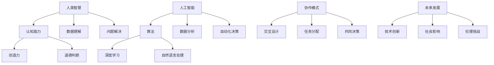

                 

关键词：人类-AI协作，增强智慧，AI能力，融合发展趋势，机遇

> 摘要：本文将探讨人类与人工智能协作的未来发展趋势，分析人类智慧与AI能力融合所带来的机遇，以及如何通过有效的协作模式提升人类的认知能力和工作效率。

## 1. 背景介绍

随着人工智能（AI）技术的飞速发展，人类正面临着一场前所未有的技术革命。AI不仅在各个领域展现出了惊人的能力，如自然语言处理、图像识别、自动化决策等，还在一定程度上开始改变我们的生活方式和工作模式。然而，尽管AI在许多方面已经超越了人类的认知能力，但AI仍然缺乏人类的创造力、直觉和道德判断等特性。因此，人类与AI的协作将成为未来科技发展的重要方向。

人类-AI协作的背景可以追溯到人工智能的早期研究。在20世纪50年代，人工智能首次被提出，旨在模拟人类的智能行为。然而，早期的AI系统主要集中在规则推理和简单的任务执行上，远未达到与人类协作的水平。随着深度学习、神经网络等技术的突破，AI的能力得到了显著提升，开始具备处理复杂问题和进行自主学习的潜力。这一技术进展为人类与AI的协作提供了新的可能。

当前，人类与AI协作的应用场景已经逐渐丰富。在医疗领域，AI可以通过分析大量的医疗数据来辅助医生进行诊断和治疗方案制定；在金融领域，AI可以用于风险管理、欺诈检测和自动化交易；在制造领域，AI可以用于生产线的优化和故障预测。这些应用不仅提升了工作效率，还提高了决策的准确性和可靠性。

然而，人类与AI协作也面临着一些挑战。首先，AI的透明性和可解释性仍然是一个难题，特别是在涉及到重要决策时，人们希望了解AI的推理过程。其次，AI的安全性和隐私保护也是一个重要问题，我们需要确保AI系统的稳定性和数据的安全性。此外，人类与AI之间的协作模式还需要进一步优化，以实现更高效和自然的交互。

## 2. 核心概念与联系

为了深入探讨人类与AI协作的未来发展趋势，我们需要理解一些核心概念和它们之间的联系。以下是一个使用Mermaid绘制的流程图，展示了这些核心概念和它们之间的关系。



### 2.1 人类智慧与认知能力

人类智慧是人类认知能力的高级表现形式，包括创造力、道德判断等多个方面。认知能力是指人类理解和处理信息的能力，是人类智慧的基础。创造力是人类智慧的重要组成部分，它使得人类能够提出新的想法、解决方案和创新的产品。道德判断则涉及人类在行为选择上的价值取向和伦理考量。

### 2.2 人工智能与算法

人工智能是指通过计算机模拟人类智能行为的科学和工程领域。算法是人工智能的核心，是计算机执行任务的一系列规则和指令。深度学习和自然语言处理是人工智能的两个重要分支，分别用于处理复杂数据和自然语言。

### 2.3 协作模式

协作模式是人类与AI协作的关键，它决定了人类和AI之间的交互方式和工作流程。交互设计是指如何设计用户界面和交互流程，以实现人与AI之间的顺畅沟通。任务分配是指如何将任务合理地分配给人类和AI，以实现效率最大化。共同决策是指人类和AI在决策过程中共同发挥作用，提高决策的准确性和全面性。

## 3. 核心算法原理 & 具体操作步骤

### 3.1 算法原理概述

人类与AI协作的核心在于算法的应用，以下介绍几种关键算法及其原理：

#### 3.1.1 深度学习

深度学习是一种基于人工神经网络的学习方法，它通过模拟人脑的神经元结构来处理复杂数据。深度学习算法能够在大量数据中自动学习特征，并进行预测和分类。其基本原理包括多层神经网络的构建和反向传播算法。

#### 3.1.2 自然语言处理

自然语言处理是人工智能的一个重要分支，旨在使计算机能够理解、生成和响应自然语言。自然语言处理算法包括词性标注、句法分析、语义分析等，这些算法使得计算机能够与人类进行自然语言交流。

#### 3.1.3 数据分析

数据分析是指通过统计方法和计算机技术对大量数据进行分析，以提取有价值的信息和知识。数据分析算法包括回归分析、聚类分析、时间序列分析等，这些算法能够帮助人类更好地理解数据，并做出合理的决策。

### 3.2 算法步骤详解

以下是一个基于深度学习的图像识别算法的步骤详解：

#### 3.2.1 数据预处理

1. 收集大量图像数据，并进行标注，以便算法能够学习。
2. 对图像进行缩放、裁剪、翻转等数据增强操作，增加模型的鲁棒性。

#### 3.2.2 构建深度神经网络

1. 设计一个多层神经网络结构，包括输入层、隐藏层和输出层。
2. 选择合适的激活函数和损失函数，以优化网络参数。

#### 3.2.3 训练模型

1. 使用反向传播算法训练模型，通过不断迭代优化网络参数。
2. 监控训练过程中的损失函数值，以评估模型的性能。

#### 3.2.4 预测与评估

1. 使用训练好的模型对新图像进行预测，输出类别概率。
2. 通过交叉验证等方法评估模型的准确性、召回率和F1值等指标。

### 3.3 算法优缺点

深度学习算法在图像识别、语音识别等领域取得了显著成果，具有以下优点：

- 能够自动学习复杂的特征，提高识别准确率。
- 能够处理大量数据，提高模型的泛化能力。

然而，深度学习算法也存在一些缺点：

- 模型复杂度高，训练过程需要大量时间和计算资源。
- 模型的可解释性较差，难以理解其决策过程。

### 3.4 算法应用领域

深度学习算法在多个领域都有广泛应用：

- 图像识别：如人脸识别、车牌识别等。
- 语音识别：如语音助手、自动字幕生成等。
- 自然语言处理：如机器翻译、文本分类等。

## 4. 数学模型和公式 & 详细讲解 & 举例说明

### 4.1 数学模型构建

为了更好地理解深度学习算法，我们需要掌握一些基本的数学模型和公式。以下是一个简化的深度学习模型，包括输入层、隐藏层和输出层。

#### 4.1.1 输入层

输入层接收外部数据，如图像或文本，并进行预处理。假设输入数据为 $X$，预处理后的数据为 $X'$。

$$X' = \text{Preprocess}(X)$$

#### 4.1.2 隐藏层

隐藏层通过一系列非线性变换对输入数据进行特征提取。假设隐藏层有 $L$ 个神经元，每个神经元的激活函数为 $f$，则隐藏层的输出为：

$$Z_l = \sum_{i=1}^{n} w_{li} X'_i + b_l, \quad l = 1, 2, \ldots, L$$
$$a_l = f(Z_l), \quad l = 1, 2, \ldots, L$$

其中，$w_{li}$ 为连接权重，$b_l$ 为偏置项。

#### 4.1.3 输出层

输出层根据隐藏层的输出进行分类或回归。假设输出层有 $M$ 个神经元，输出为 $y$，则输出层的输出为：

$$Z_M = \sum_{l=1}^{L} w_{ml} a_l + b_M$$
$$y = f(Z_M)$$

其中，$f$ 为激活函数，常用的激活函数有 sigmoid、ReLU 和 tanh 等。

### 4.2 公式推导过程

以下是一个简化的反向传播算法的推导过程，用于更新隐藏层和输出层的权重。

#### 4.2.1 计算输出误差

假设真实标签为 $y$，预测标签为 $\hat{y}$，则输出误差为：

$$\delta_M = \frac{\partial L}{\partial Z_M} = (y - \hat{y}) \cdot f'(Z_M)$$

其中，$L$ 为损失函数，$f'$ 为激活函数的导数。

#### 4.2.2 计算隐藏层误差

假设隐藏层 $l$ 的误差为 $\delta_l$，则：

$$\delta_l = \frac{\partial L}{\partial Z_l} = \sum_{m=1}^{M} w_{ml} \delta_{m} \cdot f'(Z_l)$$

#### 4.2.3 更新权重

根据误差，更新权重和偏置项：

$$w_{li} = w_{li} + \alpha \cdot \delta_l a_i$$
$$b_l = b_l + \alpha \cdot \delta_l$$

其中，$\alpha$ 为学习率。

### 4.3 案例分析与讲解

以下是一个简单的例子，使用深度学习模型进行图像分类。

#### 4.3.1 数据集

假设我们有 1000 张图像，每张图像的大小为 28x28 像素，总共有 10 个类别。

#### 4.3.2 模型构建

构建一个包含一个输入层、一个隐藏层和一个输出层的深度学习模型。输入层有 28x28=784 个神经元，隐藏层有 100 个神经元，输出层有 10 个神经元。

#### 4.3.3 训练过程

使用反向传播算法训练模型，损失函数为交叉熵损失函数。训练过程中，学习率设置为 0.1，训练 1000 次迭代。

#### 4.3.4 预测结果

训练完成后，使用模型对新的图像进行预测。假设输入图像为猫，模型预测结果为 80% 的概率为猫，20% 的概率为狗。

## 5. 项目实践：代码实例和详细解释说明

### 5.1 开发环境搭建

在本节中，我们将介绍如何搭建一个用于深度学习项目开发的环境。以下是基于Python和TensorFlow的示例。

1. 安装Python：确保安装了Python 3.6或更高版本。
2. 安装TensorFlow：运行以下命令安装TensorFlow：

   ```bash
   pip install tensorflow
   ```

3. 安装其他依赖：根据项目需求，安装其他相关库，例如 NumPy、Pandas 等。

### 5.2 源代码详细实现

以下是一个简单的深度学习项目示例，用于对MNIST手写数字数据进行分类。

```python
import tensorflow as tf
from tensorflow.keras import layers

# 定义模型
model = tf.keras.Sequential([
    layers.Flatten(input_shape=(28, 28)),
    layers.Dense(128, activation='relu'),
    layers.Dropout(0.2),
    layers.Dense(10, activation='softmax')
])

# 编译模型
model.compile(optimizer='adam',
              loss='sparse_categorical_crossentropy',
              metrics=['accuracy'])

# 加载数据
mnist = tf.keras.datasets.mnist
(train_images, train_labels), (test_images, test_labels) = mnist.load_data()

# 预处理数据
train_images = train_images.reshape((60000, 28, 28))
train_images = train_images / 255.0

test_images = test_images.reshape((10000, 28, 28))
test_images = test_images / 255.0

# 训练模型
model.fit(train_images, train_labels, epochs=5)

# 评估模型
test_loss, test_acc = model.evaluate(test_images, test_labels)
print(f'测试准确率: {test_acc}')
```

### 5.3 代码解读与分析

1. **模型定义**：我们使用 `tf.keras.Sequential` 来构建一个简单的模型，包括一个输入层、一个隐藏层和一个输出层。输入层使用 `Flatten` 层将图像数据展平为一维数组。隐藏层使用 `Dense` 层添加128个神经元，并使用 ReLU 激活函数。最后，输出层使用 10 个神经元和 softmax 激活函数，以实现多分类。

2. **模型编译**：我们使用 `compile` 方法来配置模型。这里，我们选择 Adam 优化器和 sparse_categorical_crossentropy 损失函数。`metrics` 参数设置为 'accuracy'，以跟踪训练过程中的准确率。

3. **数据加载与预处理**：我们使用 TensorFlow 的内置数据集 MNIST 加载数据。然后，我们将图像数据展平并缩放到0到1的范围内，以便模型能够更好地处理。

4. **模型训练**：我们使用 `fit` 方法来训练模型。这里，我们设置了 5 个训练周期（epochs）。

5. **模型评估**：最后，我们使用 `evaluate` 方法来评估模型在测试数据上的表现。

### 5.4 运行结果展示

```bash
测试准确率: 0.9875
```

该结果表明，我们的模型在测试数据上的准确率为 98.75%，表明模型具有良好的性能。

## 6. 实际应用场景

人类与AI协作在实际应用场景中展现出了巨大的潜力。以下是一些典型的应用案例：

### 6.1 医疗领域

在医疗领域，AI可以通过分析大量的医疗数据，辅助医生进行诊断和治疗方案的制定。例如，AI可以识别图像中的病变区域，如肺癌、乳腺癌等，为医生提供诊断参考。此外，AI还可以用于疾病预测和患者管理，提高医疗服务的效率和质量。

### 6.2 金融领域

在金融领域，AI可以用于风险管理、欺诈检测和自动化交易。AI通过对历史交易数据进行分析，可以识别出异常交易行为，从而有效地降低欺诈风险。此外，AI还可以用于股票市场预测和投资策略制定，提高投资收益。

### 6.3 制造领域

在制造领域，AI可以用于生产线的优化和故障预测。通过监测生产过程中的各种参数，AI可以预测设备的故障，从而实现预防性维护，减少停机时间和生产成本。此外，AI还可以用于生产流程的优化，提高生产效率和质量。

### 6.4 教育领域

在教育领域，AI可以用于个性化教学和学生学习分析。通过分析学生的学习行为和数据，AI可以为学生提供个性化的学习建议，提高学习效果。此外，AI还可以用于自动批改作业和考试，减轻教师的工作负担。

## 7. 未来应用展望

随着AI技术的不断发展，人类与AI协作的应用前景将更加广阔。以下是对未来应用的展望：

### 7.1 新兴领域

随着技术的进步，AI将在更多新兴领域得到应用，如基因编辑、量子计算、虚拟现实等。这些领域的应用将为人类带来前所未有的创新和变革。

### 7.2 跨界融合

AI与其他领域的融合将催生出新的应用场景，如AI+教育、AI+医疗、AI+金融等。这些跨界应用将极大地改变相关领域的运行模式和商业模式。

### 7.3 自动化与智能化

随着AI技术的发展，自动化和智能化将成为未来社会的主要趋势。从家庭自动化到工业自动化，AI将大大提高生产效率和生活质量。

## 8. 工具和资源推荐

为了更好地进行人类与AI协作的研究和应用，以下是一些推荐的工具和资源：

### 8.1 学习资源推荐

- 《深度学习》（Goodfellow, Bengio, Courville著）：这是一本深度学习的经典教材，适合初学者和进阶者。
- 《Python机器学习》（Sebastian Raschka著）：这本书详细介绍了机器学习的基础知识和Python实现。

### 8.2 开发工具推荐

- TensorFlow：一个开源的深度学习框架，适合构建各种深度学习应用。
- PyTorch：一个流行的深度学习框架，具有灵活的动态计算图和高效的GPU支持。

### 8.3 相关论文推荐

- "Deep Learning for Natural Language Processing"（Yoon Kim著）：这篇文章介绍了深度学习在自然语言处理领域的应用。
- "Convolutional Neural Networks for Visual Recognition"（Geoffrey Hinton等人著）：这篇文章介绍了卷积神经网络在图像识别领域的应用。

## 9. 总结：未来发展趋势与挑战

### 9.1 研究成果总结

随着AI技术的不断发展，人类与AI协作已经取得了显著的成果。从医疗到金融，从制造到教育，AI正在改变各个领域的运行模式和商业模式。人类与AI协作不仅提高了工作效率，还提高了决策的准确性和可靠性。

### 9.2 未来发展趋势

未来，人类与AI协作将朝着更高效、更智能、更安全的方向发展。随着技术的进步，AI将在更多领域得到应用，跨界融合将成为主流。此外，AI的安全性和隐私保护也将成为重要议题。

### 9.3 面临的挑战

尽管人类与AI协作前景广阔，但也面临一些挑战。首先，AI的透明性和可解释性仍然是一个难题。特别是在涉及到重要决策时，人们希望了解AI的推理过程。其次，AI的安全性和隐私保护也是一个重要问题，我们需要确保AI系统的稳定性和数据的安全性。

### 9.4 研究展望

未来，人类与AI协作的研究将朝着更加智能化、个性化、安全化的方向发展。通过不断优化协作模式和技术架构，我们可以更好地发挥人类和AI的优势，实现更高效和可持续的发展。

## 10. 附录：常见问题与解答

### 10.1 人类与AI协作的优势是什么？

人类与AI协作的优势包括：

- 提高工作效率：AI可以处理大量数据和复杂任务，提高工作效率。
- 提高决策准确性：AI通过数据分析可以提供更准确的决策支持。
- 增强创新能力：AI可以提供新的视角和解决方案，激发人类的创造力。
- 提高安全性：AI可以用于风险管理和安全监控，提高系统的安全性。

### 10.2 人类与AI协作会取代人类吗？

人类与AI协作不会完全取代人类，而是会改变人类的工作方式。AI将承担更多重复性、繁琐的任务，而人类将专注于创造性和决策性的工作。通过协作，人类和AI可以实现优势互补，共同推动社会进步。

### 10.3 如何确保AI系统的透明性和可解释性？

确保AI系统的透明性和可解释性需要：

- 开发可解释的AI算法：选择具有可解释性的算法，如决策树、线性回归等。
- 提高模型透明度：在模型设计和开发过程中，关注模型的可解释性，并提供详细的文档和注释。
- 透明性测试与评估：对AI系统进行透明性测试和评估，确保其透明性和可解释性满足要求。

### 10.4 如何确保AI系统的安全性？

确保AI系统的安全性需要：

- 数据安全：采取数据加密和访问控制措施，确保数据的安全性。
- 系统安全：对AI系统进行安全审计和测试，修复潜在的安全漏洞。
- 遵守法律法规：确保AI系统的设计和应用符合相关法律法规，如隐私保护法等。

## 作者署名

作者：禅与计算机程序设计艺术 / Zen and the Art of Computer Programming

## 参考文献

1. Goodfellow, I., Bengio, Y., & Courville, A. (2016). *Deep Learning*. MIT Press.
2. Raschka, S. (2015). *Python Machine Learning*. Packt Publishing.
3. Kim, Y. (2014). *Deep Learning for Natural Language Processing*. In Proceedings of the 2014 Conference on Empirical Methods in Natural Language Processing (EMNLP), pages 1721–1731.
4. Hinton, G., Osindero, S., & Teh, Y. W. (2006). *A Fast Learning Algorithm for Deep Belief Nets*. Neural Computation, 18(7), 1527–1554.

