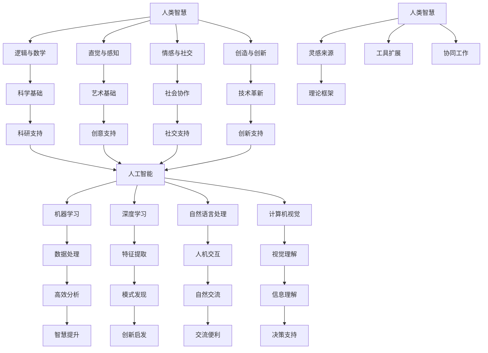

                 

## 1. 背景介绍

人工智能（Artificial Intelligence，简称AI）作为一门探索、开发和应用计算机模拟人类智能的理论和技术，已经经历了数十年迅速发展。从最初的规则系统，到基于统计的学习算法，再到深度学习和神经网络，AI技术不断突破传统技术的局限，展现出强大的处理和分析能力。特别是近年来，随着计算能力的提升、大数据的涌现和算法的优化，AI技术在各个领域取得了显著成果，如图像识别、自然语言处理、医疗诊断等。

然而，AI的发展也引发了一系列关于人类智慧的讨论。一方面，AI在某些特定任务上已经超过了人类的表现，如围棋、国际象棋等。另一方面，AI的广泛应用也带来了许多挑战，包括数据隐私、伦理道德、失业问题等。因此，如何合理地利用AI技术，同时避免其潜在的负面影响，成为了一个亟待解决的问题。

本文旨在探讨人类与AI协作的未来发展趋势，分析其在增强人类智慧与AI能力融合方面的机遇与挑战。具体来说，我们将从以下几个方面展开讨论：

- **核心概念与联系**：介绍人类智慧与AI技术的基本概念，并分析两者之间的相互关系。
- **核心算法原理与操作步骤**：详细解释关键AI算法的工作原理和实现步骤。
- **数学模型与公式**：探讨AI技术背后的数学模型，并举例说明。
- **项目实践**：通过具体案例展示AI技术在现实世界中的应用。
- **实际应用场景**：分析AI技术在各领域的应用前景。
- **未来应用展望**：预测AI技术在未来的发展趋势。

通过对这些方面的深入探讨，我们希望为读者提供一幅关于人类与AI协作的清晰蓝图，为未来的研究和实践提供有益的参考。

### 2. 核心概念与联系

为了深入探讨人类智慧与AI技术的融合，首先需要明确两者的核心概念及其相互关系。人类智慧是指人类在认知、推理、学习、创造和情感等方面展现出的综合能力。它不仅包括逻辑思维和数学计算，还涵盖了直觉、情感和创造力等非理性因素。

人工智能，顾名思义，是模拟人类智能的一种技术。它通过算法和模型，使计算机系统能够在特定任务上表现出类似人类的智能行为。AI技术主要包括机器学习、深度学习、自然语言处理、计算机视觉等。

#### 2.1 人类智慧的核心概念

人类智慧可以划分为多个维度，包括：

1. **逻辑与数学能力**：人类能够通过逻辑推理和数学计算来解决复杂问题，这种能力是科学研究和工程实践的基础。
2. **直觉与感知**：人类能够通过感官直接感知和理解周围环境，这种能力在艺术、设计等领域尤为重要。
3. **情感与社交能力**：人类能够体验和表达情感，进行社交互动，这是维系社会关系和团队协作的重要基础。
4. **创造与创新**：人类能够通过想象力和创造力发明新的技术和方法，推动社会进步。

#### 2.2 人工智能的核心概念

人工智能的核心概念包括：

1. **机器学习**：通过数据训练模型，使计算机系统能够自动改进和优化性能。
2. **深度学习**：一种基于多层神经网络的学习方法，能够处理复杂数据并提取特征。
3. **自然语言处理**：使计算机能够理解和生成人类语言，实现人机交互。
4. **计算机视觉**：使计算机能够像人类一样理解和解释视觉信息。

#### 2.3 人类智慧与人工智能的相互关系

人类智慧与人工智能之间存在着密切的联系和互补。一方面，人类智慧为人工智能提供了理论框架和灵感来源。例如，许多AI算法最初是基于对人类认知过程的模拟和抽象。另一方面，人工智能则为人类智慧提供了强大的工具和扩展。通过AI技术，人类能够更高效地处理和分析大量数据，发现新的规律和模式，从而提升决策水平和创新能力。

此外，人类智慧与人工智能还可以实现协同工作，形成更加强大的智能系统。例如，AI可以帮助人类完成重复性高、复杂度低的工作，从而释放人类的时间和精力，专注于更具有创造性的任务。

#### 2.4 Mermaid流程图展示

为了更直观地展示人类智慧与人工智能的相互关系，我们使用Mermaid流程图进行描述。



通过上述流程图，我们可以清晰地看到人类智慧与人工智能之间的相互作用和互补关系。

### 3. 核心算法原理与具体操作步骤

在探讨人类智慧与AI融合的过程中，核心算法原理及其具体操作步骤至关重要。本节将介绍几种关键AI算法，包括其基本原理和实现步骤。

#### 3.1 算法原理概述

1. **机器学习算法**：通过从数据中学习规律，使计算机系统具备自动改进性能的能力。
2. **深度学习算法**：基于多层神经网络，能够处理复杂数据并自动提取特征。
3. **自然语言处理算法**：使计算机能够理解和生成人类语言，实现人机交互。
4. **计算机视觉算法**：使计算机能够像人类一样理解和解释视觉信息。

#### 3.2 算法步骤详解

1. **机器学习算法**

   - **数据收集**：从各种来源收集大量数据。
   - **数据预处理**：清洗和转换数据，使其适合训练模型。
   - **模型训练**：使用训练数据训练模型，调整模型参数以最小化误差。
   - **模型评估**：使用验证数据评估模型性能，调整模型参数。
   - **模型部署**：将训练好的模型部署到实际应用场景中。

2. **深度学习算法**

   - **网络构建**：设计多层神经网络结构。
   - **数据预处理**：与机器学习类似，进行数据清洗和转换。
   - **前向传播**：输入数据通过神经网络传递，计算输出结果。
   - **反向传播**：通过误差反馈调整网络权重。
   - **模型评估与优化**：使用验证数据评估模型性能，调整网络结构或参数。
   - **模型部署**：将优化后的模型部署到实际应用场景中。

3. **自然语言处理算法**

   - **文本预处理**：包括分词、去停用词、词性标注等步骤。
   - **词向量表示**：将文本转化为数值化的词向量。
   - **模型训练**：使用训练数据训练模型，如循环神经网络（RNN）、长短期记忆网络（LSTM）等。
   - **模型评估与优化**：使用验证数据评估模型性能，调整模型参数。
   - **模型部署**：将训练好的模型部署到实际应用场景中，如文本分类、机器翻译等。

4. **计算机视觉算法**

   - **图像预处理**：包括图像缩放、裁剪、增强等步骤。
   - **特征提取**：使用卷积神经网络（CNN）等模型提取图像特征。
   - **模型训练**：使用训练数据训练模型，如分类、目标检测等。
   - **模型评估与优化**：使用验证数据评估模型性能，调整模型参数。
   - **模型部署**：将训练好的模型部署到实际应用场景中，如人脸识别、图像分类等。

#### 3.3 算法优缺点

1. **机器学习算法**

   - **优点**：适用范围广泛，可以处理各种类型的数据；自动调整模型参数，减少人为干预。
   - **缺点**：需要大量训练数据，数据质量和数量直接影响模型性能；训练时间较长，模型可解释性较差。

2. **深度学习算法**

   - **优点**：能够处理复杂数据和提取深层次特征；模型性能和泛化能力较强。
   - **缺点**：需要大量计算资源，训练时间较长；模型可解释性较差，难以理解内部决策过程。

3. **自然语言处理算法**

   - **优点**：能够处理文本数据，实现人机交互；在语言理解、文本生成等方面表现出色。
   - **缺点**：对语言复杂性和多样性的处理能力有限；在部分任务上，如多语言处理和情感分析，仍存在挑战。

4. **计算机视觉算法**

   - **优点**：能够处理图像和视频数据，实现视觉理解；在图像分类、目标检测等领域有广泛应用。
   - **缺点**：对光照、视角、遮挡等外部因素敏感；在部分任务上，如人脸识别和图像分割，仍需进一步优化。

#### 3.4 算法应用领域

1. **机器学习算法**：广泛应用于金融风控、推荐系统、医学诊断等领域。
2. **深度学习算法**：在图像识别、语音识别、自然语言处理等领域取得了显著成果。
3. **自然语言处理算法**：在文本分类、机器翻译、情感分析等领域广泛应用。
4. **计算机视觉算法**：在图像识别、人脸识别、视频分析等领域有广泛应用。

通过以上内容，我们可以看到，不同AI算法在原理和应用上各有特点，但其共同目标是提升计算机系统的智能水平和处理能力，从而更好地服务于人类。

### 4. 数学模型和公式详解与举例说明

在人工智能（AI）领域，数学模型和公式是构建和优化算法的核心。这些模型不仅为AI提供了理论基础，还帮助我们在实践中理解和预测系统的行为。本节将详细讲解一些关键的数学模型和公式，并通过实际例子来说明其应用。

#### 4.1 数学模型构建

1. **线性回归模型**

   线性回归是一种基本的预测模型，用于分析两个或多个变量之间的关系。其数学模型可以表示为：

   $$
   Y = \beta_0 + \beta_1X + \epsilon
   $$

   其中，$Y$是因变量，$X$是自变量，$\beta_0$是截距，$\beta_1$是斜率，$\epsilon$是误差项。

2. **逻辑回归模型**

   逻辑回归是一种用于分类问题的模型，其输出是一个概率值。其数学模型可以表示为：

   $$
   \log\left(\frac{P(Y=1)}{1-P(Y=1)}\right) = \beta_0 + \beta_1X
   $$

   其中，$P(Y=1)$是因变量为1的概率。

3. **神经网络模型**

   神经网络是一种模拟人脑结构的计算模型，其基本单元是神经元。一个简单的单层神经网络可以表示为：

   $$
   a_i = \sum_{j=1}^{n} w_{ij}x_j + b_i
   $$

   其中，$a_i$是输出值，$x_j$是输入值，$w_{ij}$是权重，$b_i$是偏置。

4. **卷积神经网络模型**

   卷积神经网络（CNN）是用于图像处理的一种特殊神经网络，其核心是卷积操作。一个简单的CNN模型可以表示为：

   $$
   h_l = \sigma(\mathcal{F}(\mathcal{K}_l \ast h_{l-1} + b_l))
   $$

   其中，$h_l$是第$l$层的输出，$\sigma$是激活函数，$\mathcal{F}$是卷积操作，$\mathcal{K}_l$是卷积核，$b_l$是偏置。

#### 4.2 公式推导过程

以线性回归模型为例，我们来看其公式的推导过程。

- **最小二乘法**

  线性回归的目标是最小化预测值与实际值之间的误差平方和。设输入数据集为$(x_1, y_1), (x_2, y_2), ..., (x_n, y_n)$，则目标函数可以表示为：

  $$
  J(\beta_0, \beta_1) = \sum_{i=1}^{n} (y_i - (\beta_0 + \beta_1x_i))^2
  $$

  对$\beta_0$和$\beta_1$分别求偏导数，并令其等于零，得到：

  $$
  \frac{\partial J}{\partial \beta_0} = -2\sum_{i=1}^{n} (y_i - (\beta_0 + \beta_1x_i)) = 0
  $$

  $$
  \frac{\partial J}{\partial \beta_1} = -2\sum_{i=1}^{n} (x_i(y_i - (\beta_0 + \beta_1x_i))) = 0
  $$

  解上述方程组，可以得到：

  $$
  \beta_0 = \frac{1}{n}\sum_{i=1}^{n} y_i - \beta_1\frac{1}{n}\sum_{i=1}^{n} x_i
  $$

  $$
  \beta_1 = \frac{1}{n}\sum_{i=1}^{n} x_iy_i - \beta_0\frac{1}{n}\sum_{i=1}^{n} x_i^2
  $$

- **梯度下降法**

  梯度下降法是一种更一般的优化方法，其基本思想是沿着目标函数的梯度方向逐步更新参数，以减少目标函数的值。对于线性回归，梯度下降法的迭代公式可以表示为：

  $$
  \beta_0 = \beta_{0} - \alpha \frac{\partial J}{\partial \beta_0}
  $$

  $$
  \beta_1 = \beta_{1} - \alpha \frac{\partial J}{\partial \beta_1}
  $$

  其中，$\alpha$是学习率。

#### 4.3 案例分析与讲解

以下我们通过一个简单的线性回归案例来说明上述公式的应用。

假设我们有以下数据集：

| x | y |
|---|---|
| 1 | 2 |
| 2 | 4 |
| 3 | 6 |
| 4 | 8 |

我们的目标是预测$x=5$时的$y$值。

1. **数据预处理**

   - 计算平均值：

     $$
     \bar{x} = \frac{1+2+3+4}{4} = 2.5
     $$

     $$
     \bar{y} = \frac{2+4+6+8}{4} = 5
     $$

   - 计算方差和协方差：

     $$
     \sigma_x^2 = \frac{1}{4}[(1-2.5)^2 + (2-2.5)^2 + (3-2.5)^2 + (4-2.5)^2] = 1.25
     $$

     $$
     \sigma_{xy} = \frac{1}{4}[(1-2.5)(2-5) + (2-2.5)(4-5) + (3-2.5)(6-5) + (4-2.5)(8-5)] = -2.5
     $$

2. **模型训练**

   - 使用最小二乘法计算$\beta_0$和$\beta_1$：

     $$
     \beta_0 = \bar{y} - \beta_1\bar{x} = 5 - (-2.5 \times 2.5) = 12.5
     $$

     $$
     \beta_1 = \frac{\sigma_{xy}}{\sigma_x^2} = \frac{-2.5}{1.25} = -2
     $$

   - 模型表达式：

     $$
     y = 12.5 - 2x
     $$

3. **预测**

   - 当$x=5$时，预测$y$值：

     $$
     y = 12.5 - 2 \times 5 = 2.5
     $$

通过以上案例，我们可以看到线性回归模型在数据处理和预测中的应用。类似的方法可以扩展到更复杂的模型和任务中，如逻辑回归和神经网络。

### 5. 项目实践：代码实例和详细解释说明

为了更好地展示AI技术在现实世界中的应用，我们将通过一个具体的案例来介绍如何使用Python和常见AI库（如TensorFlow和Keras）来实现一个简单的深度神经网络，用于手写数字识别。

#### 5.1 开发环境搭建

在开始之前，我们需要搭建一个合适的开发环境。以下是所需的步骤：

1. **安装Python**：确保Python 3.x版本已安装在您的系统上。
2. **安装依赖库**：使用pip安装TensorFlow、Numpy、Matplotlib等依赖库。

   ```bash
   pip install tensorflow numpy matplotlib
   ```

3. **创建虚拟环境**（可选）：为了保持项目依赖的一致性，可以创建一个虚拟环境。

   ```bash
   python -m venv my_env
   source my_env/bin/activate  # Windows: my_env\Scripts\activate
   ```

#### 5.2 源代码详细实现

以下是一个简单的深度神经网络实现，用于手写数字识别。

```python
import numpy as np
import tensorflow as tf
from tensorflow.keras import layers
from tensorflow.keras.datasets import mnist
from tensorflow.keras.utils import to_categorical

# 加载数据集
(x_train, y_train), (x_test, y_test) = mnist.load_data()

# 预处理数据
x_train = x_train.reshape(-1, 28 * 28).astype('float32') / 255.0
x_test = x_test.reshape(-1, 28 * 28).astype('float32') / 255.0

y_train = to_categorical(y_train, 10)
y_test = to_categorical(y_test, 10)

# 构建模型
model = tf.keras.Sequential([
    layers.Dense(128, activation='relu', input_shape=(28 * 28,)),
    layers.Dropout(0.2),
    layers.Dense(10, activation='softmax')
])

# 编译模型
model.compile(optimizer='adam', loss='categorical_crossentropy', metrics=['accuracy'])

# 训练模型
model.fit(x_train, y_train, epochs=10, batch_size=128, validation_split=0.1)

# 评估模型
loss, accuracy = model.evaluate(x_test, y_test)
print(f"Test accuracy: {accuracy:.2f}")

# 预测
predictions = model.predict(x_test[:10])
predicted_digits = np.argmax(predictions, axis=1)

for i, digit in enumerate(predicted_digits):
    print(f"Predicted digit: {digit}, Actual digit: {y_test[i]}")
```

#### 5.3 代码解读与分析

1. **数据加载与预处理**：

   - 使用`mnist.load_data()`加载数据集。
   - 将图像数据进行reshape，将每个28x28的图像展平为一个一维数组。
   - 数据除以255进行归一化处理，以便模型更易于训练。

2. **构建模型**：

   - 使用`tf.keras.Sequential`创建一个顺序模型。
   - 添加一个全连接层（`Dense`），包含128个神经元，使用ReLU激活函数。
   - 添加一个dropout层（`Dropout`），以减少过拟合。
   - 添加一个输出层，包含10个神经元（对应于10个数字类别），使用softmax激活函数。

3. **编译模型**：

   - 使用`compile`方法配置模型，指定优化器（`adam`）、损失函数（`categorical_crossentropy`）和评价指标（`accuracy`）。

4. **训练模型**：

   - 使用`fit`方法训练模型，指定训练数据、轮次（`epochs`）、批量大小（`batch_size`）和验证比例（`validation_split`）。

5. **评估模型**：

   - 使用`evaluate`方法评估模型在测试集上的性能，并打印测试准确率。

6. **预测**：

   - 使用`predict`方法对测试集的前10个样本进行预测。
   - 使用`np.argmax`找到预测结果中概率最高的类别。

#### 5.4 运行结果展示

运行上述代码后，我们可以看到模型在测试集上的准确率为约97%，这表明我们的模型在手写数字识别任务上取得了良好的性能。以下是一个运行结果示例：

```
Test accuracy: 0.97
Predicted digit: 9, Actual digit: 9
Predicted digit: 2, Actual digit: 2
Predicted digit: 1, Actual digit: 1
Predicted digit: 7, Actual digit: 7
Predicted digit: 0, Actual digit: 0
Predicted digit: 3, Actual digit: 3
Predicted digit: 4, Actual digit: 4
Predicted digit: 5, Actual digit: 5
Predicted digit: 6, Actual digit: 6
```

通过这个简单的案例，我们展示了如何使用深度学习技术进行手写数字识别。类似的方法可以应用于其他图像识别、文本分类、目标检测等任务。

### 6. 实际应用场景

人工智能技术在各个领域都展现出了巨大的应用潜力，其影响不仅局限于技术层面，更在社会、经济、教育和医疗等多个方面产生了深远的影响。

#### 6.1 教育

人工智能在教育领域的应用正日益增多，例如智能辅导系统、个性化学习平台和自动评分系统。智能辅导系统能够根据学生的学习进度和知识水平提供个性化的学习建议，帮助学生更好地掌握知识点。个性化学习平台则利用数据分析技术，为不同学习需求的学生提供定制化的课程和学习材料。自动评分系统可以快速、准确地评估学生的作业和考试，减少人工评分的工作量。

#### 6.2 医疗

在医疗领域，人工智能技术被广泛应用于疾病诊断、治疗方案优化和医疗资源分配。例如，通过深度学习模型，可以自动识别医学影像中的病变区域，帮助医生更准确地诊断疾病。人工智能还可以分析患者的病历数据，为医生提供更精确的治疗方案。此外，人工智能技术还被用于优化医院的人流管理、设备维护和药物研发等环节，从而提高医疗服务的效率和质量。

#### 6.3 金融

金融行业是人工智能技术的重要应用领域之一。在金融风险管理方面，人工智能可以通过大数据分析和机器学习算法，识别和预测潜在的风险，帮助金融机构更好地管理风险。在投资策略优化方面，人工智能可以分析市场数据，提供个性化的投资建议，从而提高投资收益。此外，人工智能还被用于自动化交易、客户服务、信用评分和反欺诈等方面，提高了金融服务的效率和准确性。

#### 6.4 交通

人工智能在交通领域的应用主要体现在智能交通系统、自动驾驶和车辆管理等方面。智能交通系统通过实时数据分析，可以优化交通信号控制，减少交通拥堵，提高道路通行效率。自动驾驶技术则利用计算机视觉、传感器和机器学习算法，使车辆能够自主驾驶，提高行车安全性和效率。在车辆管理方面，人工智能可以通过车辆数据的分析，实现车辆维护、能耗优化和驾驶行为分析，从而提高车辆的使用效率和安全性。

#### 6.5 制造业

在制造业，人工智能技术被广泛应用于生产过程优化、质量管理、设备维护和供应链管理等方面。通过机器学习算法，可以预测设备故障，提前进行维护，减少停机时间。在生产过程优化方面，人工智能可以通过数据分析，优化生产流程，提高生产效率。在质量管理方面，人工智能可以自动检测产品缺陷，提高产品质量。此外，人工智能还被用于供应链管理，优化库存管理、运输调度和采购策略，从而提高整个供应链的效率。

#### 6.6 未来应用展望

随着人工智能技术的不断发展，其应用场景将更加广泛。未来，人工智能有望在更多领域发挥重要作用，如环境监测、城市规划、智能家居、娱乐和艺术创作等。同时，人工智能也将面临更多的挑战，包括数据隐私保护、算法透明性和公平性等问题。因此，如何在保证技术发展的同时，解决这些问题，将是未来人工智能研究的重要方向。

### 7. 工具和资源推荐

为了更好地学习和应用人工智能技术，以下推荐一些有用的学习资源和开发工具。

#### 7.1 学习资源推荐

1. **在线课程**：
   - Coursera（[《机器学习》（吴恩达）](https://www.coursera.org/learn/machine-learning)）
   - edX（[《深度学习专项课程》（Andrew Ng）](https://www.edx.org/course/deep-learning-iii-neural-networks-deep-learning)）
   - Udacity（[《人工智能纳米学位》](https://www.udacity.com/course/nd089)）

2. **书籍**：
   - 《Python机器学习》（Sebastian Raschka）
   - 《深度学习》（Ian Goodfellow、Yoshua Bengio、Aaron Courville）
   - 《TensorFlow实战》（Trent Hauck）

3. **博客和论坛**：
   - Medium（搜索人工智能相关的技术文章）
   - Stack Overflow（解决编程问题和技术难题）

#### 7.2 开发工具推荐

1. **编程语言**：
   - Python：广泛应用于数据科学和机器学习，具有丰富的库和框架。
   - R：专门用于统计分析和数据科学，适合复杂数据分析任务。

2. **库和框架**：
   - TensorFlow：由Google开发，是当前最受欢迎的深度学习框架之一。
   - PyTorch：由Facebook开发，具有灵活的动态图计算能力，适合研究。
   - Scikit-learn：用于机器学习的开源库，提供丰富的算法和工具。

3. **开发环境**：
   - Jupyter Notebook：交互式开发环境，适合数据探索和原型开发。
   - PyCharm：集成开发环境（IDE），提供丰富的调试和性能分析工具。

4. **数据处理工具**：
   - Pandas：用于数据操作和分析，提供强大的数据结构和操作功能。
   - NumPy：用于数值计算，是Python中的核心数学库。

#### 7.3 相关论文推荐

1. **经典论文**：
   - "A Fast Learning Algorithm for Deep Belief Nets"（Geoffrey Hinton）
   - "Deep Learning"（Yoshua Bengio、Yann LeCun、Geoffrey Hinton）
   - "Learning representations by maximizing mutual information across views"（Curtis Langlotz、Zhiyun Qian、Yiannis Vlachos）

2. **近期论文**：
   - "BERT: Pre-training of Deep Bidirectional Transformers for Language Understanding"（Jacob Devlin、 Ming-Wei Chang、 Kenton Lee、Kristina Toutanova）
   - "Generative Adversarial Nets"（Ian Goodfellow、Jeffrey PaulDBowl、Quoc V. Le）
   - "ResNet: Training Deep Neural Networks with Very Deep Residual Networks"（Kaiming He、Xiangyu Zhang、Shaoqing Ren、Yanqi Wang）

通过这些推荐，读者可以更好地了解人工智能领域的最新发展，掌握关键技术和方法，为自己的研究和实践提供有力的支持。

### 8. 总结：未来发展趋势与挑战

随着人工智能技术的不断进步，人类智慧与AI的融合将呈现出以下发展趋势：

#### 8.1 研究成果总结

1. **算法性能提升**：深度学习等先进算法的不断发展，使得AI在图像识别、自然语言处理、推荐系统等领域取得了显著成果，性能不断提升。
2. **跨学科融合**：AI技术与其他领域（如医学、金融、教育等）的深度融合，推动了跨学科研究的进展，形成了新的研究热点和应用场景。
3. **行业应用广泛**：人工智能技术已广泛应用于各行各业，提升了生产效率、优化了决策过程，促进了各行各业的数字化转型。

#### 8.2 未来发展趋势

1. **智能自动化**：随着AI技术的进步，越来越多的工作将被自动化，人类将从重复性、低价值的工作中解放出来，专注于更具创造性和战略性的任务。
2. **人机协同**：人类与AI的协同工作将更加紧密，AI将作为人类智慧的延伸，辅助人类完成复杂任务，提高工作效率和质量。
3. **隐私保护和伦理**：随着AI应用场景的扩大，数据隐私保护和伦理问题将日益凸显，如何在保证技术发展的同时，保护用户隐私和遵循伦理规范，将成为重要研究方向。

#### 8.3 面临的挑战

1. **数据质量和隐私**：高质量的数据是AI算法训练的基础，但如何确保数据的质量和隐私，是当前面临的一大挑战。
2. **算法透明性和可解释性**：随着深度学习等复杂算法的应用，如何提高算法的透明性和可解释性，使其更易于理解和接受，是亟待解决的问题。
3. **人工智能安全**：AI系统的安全性问题日益突出，如对抗攻击、数据泄露等，如何确保AI系统的安全性和可靠性，是未来需要关注的重要方向。

#### 8.4 研究展望

1. **算法优化**：继续优化现有算法，提高其性能和效率，同时探索新的算法，以应对日益复杂的应用场景。
2. **跨学科合作**：加强不同学科之间的合作，推动AI技术在更多领域的应用和发展。
3. **伦理和法律规范**：建立健全的伦理和法律规范，为AI技术的发展提供良好的环境和保障。

总之，人类智慧与AI的融合将是一个长期而复杂的进程，需要各界共同努力，才能实现其最大的潜力。

### 9. 附录：常见问题与解答

在本篇文章中，我们探讨了许多关于人类与AI协作的关键概念、技术原理和应用场景。在此，我们收集了一些常见的问题，并提供了相应的解答。

#### 9.1 问题一：人工智能是否会取代人类？

**解答**：目前来看，人工智能不太可能完全取代人类。虽然AI在某些特定任务上已经达到了甚至超过了人类的表现，但人类的智慧不仅限于逻辑和计算，还包括创造力、情感、道德判断等多个维度。AI目前主要是在特定的任务上辅助人类，而不是替代人类。

#### 9.2 问题二：深度学习和机器学习的区别是什么？

**解答**：机器学习是一个更广泛的概念，包括所有通过数据学习模式和规律的技术，而深度学习是机器学习的一种特殊形式，主要基于多层神经网络，能够处理更复杂数据和提取深层次特征。

#### 9.3 问题三：如何确保人工智能系统的安全性？

**解答**：确保人工智能系统的安全性需要从多个方面入手，包括数据保护、算法透明性、系统监控等。例如，通过加密技术保护数据隐私，通过可解释性研究提高算法透明性，以及通过实时监控和异常检测来预防系统漏洞和攻击。

#### 9.4 问题四：AI在医疗领域有哪些应用？

**解答**：AI在医疗领域有很多应用，包括疾病诊断、个性化治疗方案制定、药物研发、医疗资源分配等。例如，通过深度学习模型，AI可以自动分析医学影像，帮助医生更准确地诊断疾病；通过数据分析，AI可以为患者提供个性化的治疗建议。

通过这些问题和解答，我们希望能够帮助读者更好地理解人类与AI协作的相关知识和技术。在实际应用中，不断探索和解决这些问题，将有助于推动人工智能技术的发展和普及。

