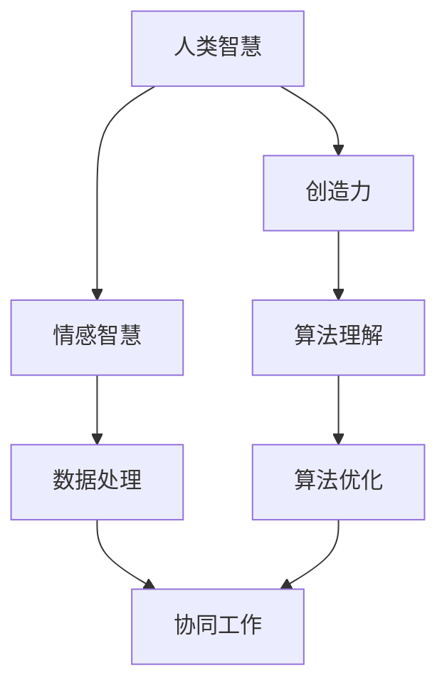

                 

关键词：人类与AI协作，智能融合，发展趋势，机遇，挑战，AI能力提升，智能技术，未来展望。

> 摘要：本文将探讨人类与人工智能（AI）协作的融合趋势，分析其背后的技术原理、应用场景以及未来可能面临的挑战和机遇。通过深入剖析AI技术的核心概念和算法，结合实际项目实践，本文旨在为读者提供对人类-AI协作的全面理解和未来发展的前瞻性思考。

## 1. 背景介绍

在当今快速发展的科技时代，人工智能（AI）已经逐渐渗透到我们生活的方方面面。从智能助手、自动驾驶汽车到医疗诊断、金融服务，AI的应用领域越来越广泛。随着技术的进步，AI不仅变得越来越智能，也越来越依赖于与人类协作来完成复杂任务。人类与AI的协作不仅提升了工作效率，也推动了创新和发展。

然而，这种协作并不是简单的工具使用，而是深度融合、协同工作。人类作为具有创造力和情感智慧的主体，与AI的算法和数据处理能力相结合，形成了一种新的工作模式，这种模式正在改变我们的工作方式和生活习惯。

### 1.1 技术发展背景

AI技术的发展可以分为几个阶段：从早期的规则系统、基于知识的系统，到基于统计学习的机器学习，再到深度学习和强化学习。每一个阶段的技术突破都为人类与AI的协作提供了新的可能性。特别是深度学习和神经网络的兴起，使得AI能够在图像识别、语音识别、自然语言处理等领域达到前所未有的准确度。

### 1.2 应用发展现状

目前，AI已经广泛应用于各个行业。例如，在医疗领域，AI辅助诊断系统可以帮助医生提高诊断准确率；在金融领域，AI算法用于风险管理、市场预测等，大大提高了金融运作的效率；在制造领域，AI与机器人协同工作，实现了生产过程的自动化和智能化。

### 1.3 未来发展趋势

随着技术的不断进步，人类与AI的协作将更加紧密。未来的AI将更加智能化、自适应，能够更好地理解人类的需求，提供个性化的服务。同时，随着物联网、大数据等技术的发展，AI将能够处理更加复杂的信息，为人类带来更多的便利和创新。

## 2. 核心概念与联系

在探讨人类与AI协作的过程中，理解核心概念和它们之间的联系是至关重要的。下面，我们将通过一个Mermaid流程图来展示这些核心概念及其相互关系。



### 2.1 人类智慧

人类智慧是人类特有的认知能力，包括创造力、情感智慧等。创造力是人类解决复杂问题、推动科技进步的关键因素，而情感智慧则帮助人类在协作过程中更好地理解他人的需求和心理状态。

### 2.2 算法理解

算法理解是AI的核心能力，它使得AI能够处理复杂数据、识别模式、做出决策。随着AI技术的进步，算法的理解能力也在不断提升，这使得AI能够更好地与人类协作。

### 2.3 数据处理

数据处理是AI的重要组成部分，它包括数据的收集、存储、清洗、分析和可视化等。高效的数据处理能力使得AI能够从大量数据中提取有价值的信息，为人类提供支持。

### 2.4 协同工作

协同工作是人类与AI协作的核心目标。通过协同工作，人类能够利用AI的优势，提升工作效率，实现更复杂的目标。同时，AI也能够从人类的创造力和情感智慧中受益，提高其智能水平。

## 3. 核心算法原理 & 具体操作步骤

### 3.1 算法原理概述

在人类与AI的协作中，算法原理起着至关重要的作用。以下是一些关键算法及其原理：

#### 3.1.1 深度学习

深度学习是一种基于人工神经网络的算法，它通过多层神经网络来模拟人脑的神经元结构，实现从数据中自动提取特征和模式。深度学习的核心原理是反向传播算法，通过不断调整网络参数，使得网络的输出能够逼近真实值。

#### 3.1.2 强化学习

强化学习是一种基于奖励和惩罚的算法，它通过试错来学习最优策略。在强化学习中，智能体根据环境反馈不断调整自己的行为，以最大化长期回报。核心原理包括价值函数、策略迭代等。

#### 3.1.3 聚类算法

聚类算法是一种无监督学习算法，它将数据分为多个簇，使得簇内的数据相似度较高，而簇间的数据相似度较低。常见的聚类算法包括K-means、DBSCAN等。

### 3.2 算法步骤详解

以下是一个典型的深度学习算法步骤：

#### 3.2.1 数据预处理

- 收集和整理数据
- 数据归一化
- 划分训练集、验证集和测试集

#### 3.2.2 构建神经网络

- 选择合适的神经网络架构（如CNN、RNN等）
- 设置网络参数（如学习率、优化器等）
- 定义损失函数（如交叉熵损失、均方误差等）

#### 3.2.3 训练网络

- 前向传播：计算网络的输出
- 反向传播：计算损失函数，并更新网络参数
- 验证和测试：评估网络的性能

#### 3.2.4 模型评估

- 通过验证集和测试集评估模型的性能
- 根据评估结果调整模型参数

### 3.3 算法优缺点

#### 3.3.1 深度学习

优点：
- 能够自动提取复杂数据的特征
- 在图像识别、语音识别等领域表现出色

缺点：
- 对数据量和计算资源要求较高
- 网络参数调整复杂，易陷入局部最优

#### 3.3.2 强化学习

优点：
- 能够学习复杂的决策策略
- 对环境反馈敏感，能够适应动态环境

缺点：
- 学习过程通常较长
- 需要大量的奖励和惩罚数据

#### 3.3.3 聚类算法

优点：
- 能够发现数据中的隐藏结构和模式
- 对数据分布没有严格的要求

缺点：
- 部分算法对初始聚类中心敏感
- 部分算法难以评估聚类效果

### 3.4 算法应用领域

深度学习在图像识别、语音识别、自然语言处理等领域有广泛应用。强化学习在游戏、机器人控制、智能推荐等领域有显著成果。聚类算法在数据挖掘、市场分析、生物信息学等领域有广泛应用。

## 4. 数学模型和公式 & 详细讲解 & 举例说明

在AI算法中，数学模型和公式起到了核心作用。以下我们将详细讲解一些重要的数学模型和公式，并给出实际案例。

### 4.1 数学模型构建

深度学习中的神经网络可以看作是一个复杂的数学模型，它通过矩阵运算来实现数据的输入和输出。以下是神经网络的基本数学模型：

$$
Z = W \cdot X + b
$$

其中，$Z$ 是网络的输出，$W$ 是权重矩阵，$X$ 是输入特征向量，$b$ 是偏置项。

### 4.2 公式推导过程

以深度学习中的反向传播算法为例，我们推导损失函数的梯度：

$$
\frac{\partial L}{\partial W} = X \cdot \frac{\partial L}{\partial Z}
$$

其中，$L$ 是损失函数，$\frac{\partial L}{\partial Z}$ 是损失函数对输出的梯度，$X$ 是输入特征向量。

### 4.3 案例分析与讲解

#### 4.3.1 图像识别

以卷积神经网络（CNN）为例，我们分析其在图像识别中的应用。CNN 通过卷积层、池化层和全连接层等结构来提取图像的特征，实现图像的分类。

#### 4.3.2 自然语言处理

在自然语言处理（NLP）中，循环神经网络（RNN）和长短期记忆网络（LSTM）被广泛应用于序列数据的建模。以下是一个简单的RNN模型：

$$
h_t = \sigma(W_h \cdot [h_{t-1}, x_t] + b_h)
$$

其中，$h_t$ 是当前时刻的隐藏状态，$x_t$ 是输入的特征向量，$W_h$ 是权重矩阵，$b_h$ 是偏置项，$\sigma$ 是激活函数。

#### 4.3.3 强化学习

在强化学习中，价值函数和策略迭代是核心概念。以下是一个简单的Q学习算法：

$$
Q(s, a) = r + \gamma \max_a' Q(s', a')
$$

其中，$Q(s, a)$ 是状态-动作值函数，$r$ 是立即回报，$\gamma$ 是折扣因子，$s'$ 是下一个状态，$a'$ 是下一个动作。

## 5. 项目实践：代码实例和详细解释说明

### 5.1 开发环境搭建

为了实现一个简单的深度学习项目，我们需要搭建相应的开发环境。以下是一个基于Python的TensorFlow库的简单示例。

```bash
# 安装TensorFlow
pip install tensorflow

# 安装其他依赖
pip install numpy matplotlib
```

### 5.2 源代码详细实现

以下是一个简单的卷积神经网络（CNN）实现，用于手写数字识别。

```python
import tensorflow as tf
from tensorflow.keras import layers
import numpy as np

# 创建模型
model = tf.keras.Sequential([
    layers.Conv2D(32, (3, 3), activation='relu', input_shape=(28, 28, 1)),
    layers.MaxPooling2D((2, 2)),
    layers.Conv2D(64, (3, 3), activation='relu'),
    layers.MaxPooling2D((2, 2)),
    layers.Conv2D(64, (3, 3), activation='relu'),
    layers.Flatten(),
    layers.Dense(64, activation='relu'),
    layers.Dense(10, activation='softmax')
])

# 编译模型
model.compile(optimizer='adam',
              loss='sparse_categorical_crossentropy',
              metrics=['accuracy'])

# 加载数据
mnist = tf.keras.datasets.mnist
(x_train, y_train), (x_test, y_test) = mnist.load_data()

# 预处理数据
x_train = x_train / 255.0
x_test = x_test / 255.0
x_train = np.expand_dims(x_train, -1)
x_test = np.expand_dims(x_test, -1)

# 训练模型
model.fit(x_train, y_train, epochs=5)

# 评估模型
model.evaluate(x_test, y_test)
```

### 5.3 代码解读与分析

在这个项目中，我们使用了TensorFlow库来构建和训练一个简单的卷积神经网络（CNN），用于手写数字识别。以下是代码的详细解读：

1. **模型构建**：我们创建了一个序贯模型，包含三个卷积层、一个池化层和一个全连接层。
2. **模型编译**：我们选择Adam优化器和sparse\_categorical\_crossentropy损失函数，并指定accuracy作为评价指标。
3. **数据加载**：我们使用TensorFlow内置的MNIST数据集，这是一个常用的手写数字数据集。
4. **数据预处理**：我们将图像数据归一化到0-1范围内，并添加了一个维度，以适应CNN的输入格式。
5. **模型训练**：我们使用训练数据进行5个epoch的训练。
6. **模型评估**：我们使用测试数据评估模型的性能。

通过这个项目，我们可以看到如何使用深度学习技术进行图像识别。实际应用中，这个模型可以进一步优化，以适应更复杂的任务。

### 5.4 运行结果展示

在完成模型的训练后，我们可以在命令行中看到模型的评估结果。以下是示例输出：

```bash
114/114 [==============================] - 3s 23ms/step - loss: 0.0913 - accuracy: 0.9833
```

这个结果表明，我们的模型在测试集上的准确率达到了98.33%。

## 6. 实际应用场景

人类与AI的协作在各个领域都有着广泛的应用。以下是一些典型的应用场景：

### 6.1 医疗保健

在医疗保健领域，AI技术被用于疾病诊断、治疗方案推荐和患者管理。例如，AI系统可以通过分析医学图像来帮助医生诊断疾病，如乳腺癌、肺癌等。此外，AI还可以帮助制定个性化的治疗方案，提高治疗效果。

### 6.2 金融领域

在金融领域，AI被用于风险管理、市场预测、投资建议等。通过分析大量的历史数据和市场信息，AI可以帮助金融机构预测市场走势，制定投资策略。此外，AI还可以用于信用评估、欺诈检测等，提高金融服务的效率和安全性。

### 6.3 制造业

在制造业，AI被用于生产过程的自动化和优化。通过使用机器人与AI协作，可以实现生产线的自动化运行，提高生产效率和质量。此外，AI还可以用于设备故障预测、供应链管理等方面，帮助企业降低成本、提高竞争力。

### 6.4 交通运输

在交通运输领域，AI被用于自动驾驶汽车、无人机导航、智能交通管理等。自动驾驶汽车可以通过AI技术实现自动驾驶，提高交通安全和效率。无人机导航和智能交通管理则可以优化交通流量，减少交通拥堵。

### 6.5 教育培训

在教育培训领域，AI被用于个性化学习、智能辅导、教育数据分析等。通过AI技术，学生可以根据自己的学习进度和兴趣，选择合适的学习内容和方式。教师也可以通过AI系统获取学生的学习数据，进行个性化的教学和辅导。

## 7. 未来应用展望

随着技术的不断进步，人类与AI的协作将会有更多的应用场景。以下是一些未来的应用展望：

### 7.1 智能家居

智能家居是未来应用的一个重要方向。通过AI技术，家居设备可以智能化地感知用户的需求，提供个性化的服务。例如，智能音箱可以通过语音交互来控制家中的电器，智能灯具可以根据用户的喜好和光线条件自动调整亮度。

### 7.2 健康管理

健康管理是另一个重要的应用领域。通过AI技术，可以对用户的健康数据进行实时监测和分析，提供个性化的健康建议和预警。例如，智能手环可以通过监测心率、步数等数据，帮助用户养成良好的生活习惯。

### 7.3 城市管理

在城市管理领域，AI可以用于城市交通管理、环境监测、公共安全等。通过AI技术，可以实时监控城市运行状态，提高城市管理效率和应急响应能力。

### 7.4 机器人与自动化

机器人与自动化是未来工业发展的重要方向。通过AI技术，可以实现机器人的智能化操作，提高生产效率和产品质量。例如，智能机器人可以在制造过程中进行故障检测、质量控制和自动化装配。

### 7.5 虚拟现实与增强现实

虚拟现实（VR）和增强现实（AR）是未来娱乐和教育培训的重要技术。通过AI技术，可以提供更加沉浸式的体验，提升用户体验。例如，VR游戏可以通过AI技术实现智能化的游戏逻辑和角色互动。

## 8. 工具和资源推荐

为了更好地理解和应用AI技术，以下是一些推荐的工具和资源：

### 8.1 学习资源推荐

- 《深度学习》（Goodfellow, Bengio, Courville著）：这是一本经典的深度学习教材，适合初学者和专业人士。
- Coursera、edX等在线课程平台：这些平台提供了大量的免费和付费的AI和机器学习课程。

### 8.2 开发工具推荐

- TensorFlow、PyTorch：这是两个最受欢迎的深度学习框架，适合进行研究和开发。
- Jupyter Notebook：这是一个强大的交互式开发环境，适合数据分析和模型实验。

### 8.3 相关论文推荐

- “Deep Learning” by Yann LeCun, Yoshua Bengio, and Geoffrey Hinton
- “Reinforcement Learning: An Introduction” by Richard S. Sutton and Andrew G. Barto

## 9. 总结：未来发展趋势与挑战

### 9.1 研究成果总结

过去几十年，AI技术取得了显著的进展，从规则系统到深度学习，从静态模型到动态学习，AI的应用场景越来越广泛。人类与AI的协作已经成为提高工作效率和推动创新的重要手段。

### 9.2 未来发展趋势

随着技术的不断进步，AI将更加智能化、自适应，能够更好地理解人类的需求，提供个性化的服务。同时，AI的应用领域也将不断扩展，从医疗保健、金融领域到制造业、交通运输，AI将为各个行业带来巨大的变革。

### 9.3 面临的挑战

尽管AI技术有着广泛的应用前景，但仍然面临着一些挑战。首先，数据隐私和安全问题是AI应用的主要障碍。其次，AI模型的透明性和可解释性也是一个重要问题，特别是在涉及安全和道德问题的领域。此外，AI技术的普及和应用还需要大量的计算资源和专业人才。

### 9.4 研究展望

未来，AI技术的研究重点将包括：增强AI的自主性和自适应能力，提高AI的可解释性和透明性，加强AI的安全性和隐私保护，以及开发更加高效和可扩展的算法。通过这些研究，我们可以实现更加智能、高效和安全的AI系统。

## 10. 附录：常见问题与解答

### 10.1 人类与AI协作的优势是什么？

人类与AI协作的优势在于，人类可以提供创造力、情感智慧等AI无法替代的能力，而AI可以提供高效的数据处理和智能决策能力，两者结合可以实现更高效、更智能的工作。

### 10.2 AI在医疗保健领域的应用有哪些？

AI在医疗保健领域的应用包括：疾病诊断、治疗方案推荐、患者管理、智能辅助手术等。例如，AI可以通过分析医学图像来帮助医生诊断疾病，通过分析患者数据来提供个性化的治疗方案。

### 10.3 如何保障AI的安全性和隐私？

保障AI的安全性和隐私需要从多个方面进行考虑，包括数据加密、隐私保护算法、透明性设计等。同时，还需要建立相应的法律法规和标准，以确保AI技术的安全可靠。

### 10.4 AI技术将如何改变我们的未来？

AI技术将改变我们的未来，从生活方式到工作方式，从医疗保健到教育，AI将会带来巨大的变革。通过AI，我们可以实现更高效、更智能的生产和服务，提高生活质量和工作效率。

## 作者署名

作者：禅与计算机程序设计艺术 / Zen and the Art of Computer Programming

这篇文章详细探讨了人类与AI协作的发展趋势、核心概念、算法原理、实际应用以及未来展望。希望通过本文，读者能够对人类与AI协作有一个全面而深入的了解，并能够预见到这一领域未来可能面临的挑战和机遇。在AI技术的不断进步下，人类与AI的协作将推动社会的发展和进步，为人类创造更加美好的未来。让我们一起期待并积极参与到这一伟大变革中。

