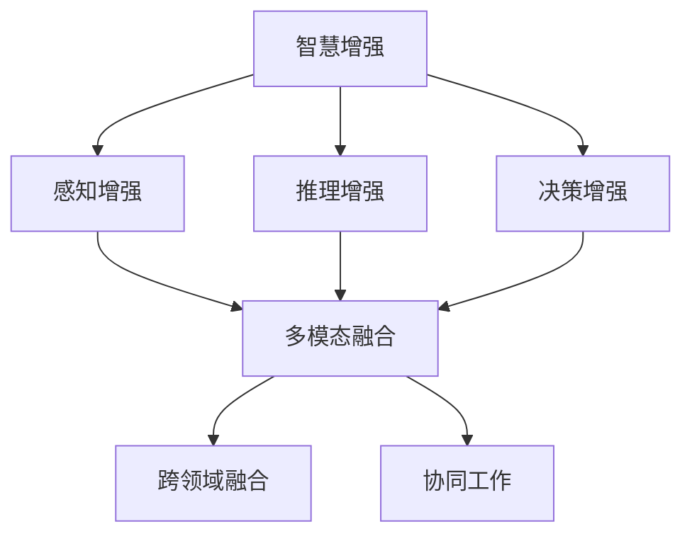

                 

关键词：人类-AI协作，智慧增强，AI能力融合，发展趋势，机遇与挑战

> 摘要：本文旨在探讨人类与人工智能（AI）协作的未来发展趋势，分析在智慧增强和AI能力融合过程中所面临的机遇和挑战。通过深入分析核心概念、算法原理、数学模型、项目实践和实际应用场景，本文将为读者呈现一幅充满前景和挑战的AI时代图景，并预测未来可能的发展方向。

## 1. 背景介绍

在过去的几十年里，人工智能（AI）经历了飞速的发展。从简单的规则系统到复杂的深度学习模型，AI技术在各个领域展现出了强大的潜力。然而，单纯依靠AI技术无法完全解决复杂问题，特别是在需要人类智慧和经验的场景中。因此，人类-AI协作逐渐成为一种趋势。

人类-AI协作的目标是通过整合人类的智慧和AI的计算能力，实现更高效的决策和更准确的问题解决。在这个过程中，人类充当策略制定者和监督者，AI则负责执行和优化任务。这种协作模式不仅能够发挥人类的创造力，还能充分利用AI的计算优势，提高解决问题的效率。

## 2. 核心概念与联系

为了更好地理解人类-AI协作，我们需要首先了解一些核心概念，包括智慧增强、AI能力融合、协作机制等。

### 2.1 智慧增强

智慧增强是指利用AI技术提升人类在感知、推理、决策等方面的能力。具体来说，智慧增强可以分为以下几个方面：

- **感知增强**：通过增强现实、虚拟现实等技术，扩展人类的感知范围，使其能够获取更多有用的信息。
- **推理增强**：利用自然语言处理、知识图谱等技术，帮助人类更快速地进行逻辑推理和问题解决。
- **决策增强**：通过数据分析、机器学习等技术，为人类提供更为精确的决策支持。

### 2.2 AI能力融合

AI能力融合是指将不同的AI技术整合在一起，形成一个更加全面、智能的AI系统。具体来说，AI能力融合包括以下几个方面：

- **多模态融合**：将图像、音频、文本等多种数据源进行融合，实现更全面的信息处理。
- **跨领域融合**：将不同领域的AI技术进行整合，形成具有跨领域能力的AI系统。
- **协同工作**：通过建立协作机制，使不同AI模块能够相互配合，共同完成任务。

### 2.3 协作机制

协作机制是指人类与AI在合作过程中所采取的一系列策略和方法。具体来说，协作机制包括以下几个方面：

- **任务分配**：根据人类和AI的优势，合理分配任务，使其能够发挥最大的作用。
- **反馈机制**：通过及时反馈和调整，优化协作效果，提高任务完成度。
- **决策机制**：在协作过程中，人类和AI需要共同制定决策策略，确保协作的顺利进行。

### 2.4 Mermaid流程图

以下是人类-AI协作的Mermaid流程图：



## 3. 核心算法原理 & 具体操作步骤

### 3.1 算法原理概述

人类-AI协作的核心在于如何将人类的智慧和AI的计算能力有机结合。具体来说，算法原理可以概括为以下几个方面：

- **信息共享**：通过数据共享，使人类和AI能够获取相同的信息，从而实现更好的协作。
- **任务分配**：根据人类和AI的优势，合理分配任务，使其能够发挥最大的作用。
- **反馈调整**：在协作过程中，通过及时反馈和调整，优化协作效果，提高任务完成度。
- **决策支持**：利用AI技术为人类提供决策支持，帮助其做出更明智的决策。

### 3.2 算法步骤详解

人类-AI协作的具体操作步骤可以分为以下几个阶段：

1. **信息收集**：人类和AI分别收集相关信息，包括数据、知识等。
2. **信息整合**：将收集到的信息进行整合，形成统一的数据集。
3. **任务分配**：根据人类和AI的优势，合理分配任务。
4. **协同工作**：人类和AI分别执行任务，同时通过信息共享和反馈调整，实现协同工作。
5. **决策支持**：利用AI技术为人类提供决策支持，帮助其做出更明智的决策。
6. **结果评估**：对协作结果进行评估，为下一次协作提供参考。

### 3.3 算法优缺点

**优点**：

- 提高任务完成度：通过人类和AI的协同工作，可以更高效地完成任务。
- 资源优化：充分利用人类和AI的优势，实现资源的优化配置。
- 创新能力：通过人类-AI协作，可以激发创新思维，产生新的解决方案。

**缺点**：

- 技术壁垒：需要掌握多种AI技术，对开发者的要求较高。
- 数据隐私：在信息共享的过程中，可能存在数据隐私问题。
- 决策风险：在决策支持中，可能存在决策失误的风险。

### 3.4 算法应用领域

人类-AI协作在多个领域具有广泛的应用前景，包括：

- **医疗领域**：利用AI进行疾病诊断、药物研发等。
- **金融领域**：利用AI进行风险控制、投资决策等。
- **教育领域**：利用AI进行个性化教学、智能辅导等。
- **制造业**：利用AI进行生产优化、质量检测等。

## 4. 数学模型和公式 & 详细讲解 & 举例说明

### 4.1 数学模型构建

人类-AI协作的数学模型主要包括以下几个方面：

- **信息论模型**：用于描述信息共享过程中的信息熵、信息增益等。
- **决策论模型**：用于描述决策支持过程中的概率分布、期望值等。
- **优化模型**：用于描述任务分配和资源优化过程中的目标函数、约束条件等。

### 4.2 公式推导过程

以下是一个简单的信息论模型推导过程：

设 \(X\) 为人类获取的信息，\(Y\) 为AI获取的信息，则信息共享后的信息熵 \(H(X,Y)\) 可以表示为：

$$
H(X,Y) = H(X) + H(Y|X)
$$

其中，\(H(X)\) 为人类获取的信息熵，\(H(Y|X)\) 为AI获取的信息熵。

根据条件熵的定义，有：

$$
H(Y|X) = H(Y) - H(Y|X)
$$

代入上式，得：

$$
H(X,Y) = H(X) + H(Y) - H(Y|X)
$$

由于 \(H(X,Y)\) 是固定的，为了使 \(H(X,Y)\) 最小，需要 \(H(Y|X)\) 最小，即 \(X\) 和 \(Y\) 之间的相关性最大。

### 4.3 案例分析与讲解

假设在医疗领域，人类医生和AI系统进行协作。医生负责诊断病人，AI系统负责提供辅助诊断。

1. **信息收集**：医生收集病人的病史、体征等信息，AI系统收集病人检查报告、医学影像等数据。
2. **信息整合**：将医生和AI系统收集到的信息进行整合，形成统一的数据集。
3. **任务分配**：医生负责病史分析和临床判断，AI系统负责影像分析和疾病预测。
4. **协同工作**：医生根据AI系统的分析结果，调整诊断方案；AI系统根据医生的调整，优化诊断模型。
5. **决策支持**：AI系统为医生提供疾病概率分布、最佳治疗方案等决策支持。
6. **结果评估**：对诊断结果进行评估，为下一次协作提供参考。

通过这个案例，我们可以看到数学模型在人类-AI协作中的具体应用。信息论模型用于描述信息共享过程中的信息熵，决策论模型用于描述决策支持过程中的概率分布，优化模型用于描述任务分配和资源优化过程中的目标函数和约束条件。

## 5. 项目实践：代码实例和详细解释说明

### 5.1 开发环境搭建

为了实现人类-AI协作，我们需要搭建一个开发环境。以下是基本的开发环境要求：

- 操作系统：Windows、Linux或macOS
- 编程语言：Python
- 依赖库：TensorFlow、Keras、Scikit-learn等

### 5.2 源代码详细实现

以下是一个简单的人类-AI协作项目示例，用于分类问题。项目中，人类负责提供训练数据和标签，AI系统负责训练分类模型。

```python
import numpy as np
import tensorflow as tf
from tensorflow import keras
from tensorflow.keras import layers

# 加载数据
(x_train, y_train), (x_test, y_test) = keras.datasets.mnist.load_data()

# 预处理数据
x_train = x_train.astype("float32") / 255
x_test = x_test.astype("float32") / 255
x_train = np.reshape(x_train, (len(x_train), 28, 28, 1))
x_test = np.reshape(x_test, (len(x_test), 28, 28, 1))

# 构建模型
model = keras.Sequential([
    layers.Conv2D(32, (3, 3), activation="relu", input_shape=(28, 28, 1)),
    layers.MaxPooling2D((2, 2)),
    layers.Conv2D(64, (3, 3), activation="relu"),
    layers.MaxPooling2D((2, 2)),
    layers.Flatten(),
    layers.Dense(128, activation="relu"),
    layers.Dense(10, activation="softmax")
])

# 编译模型
model.compile(optimizer="adam",
              loss="sparse_categorical_crossentropy",
              metrics=["accuracy"])

# 训练模型
model.fit(x_train, y_train, epochs=10)

# 评估模型
test_loss, test_acc = model.evaluate(x_test, y_test)

print(f"Test accuracy: {test_acc:.2f}")
```

### 5.3 代码解读与分析

这段代码首先加载数据，并对数据进行预处理。然后构建一个简单的卷积神经网络（CNN）模型，包括两个卷积层、两个最大池化层、一个全连接层和一个softmax层。最后，编译模型并训练，评估模型性能。

在这个项目中，人类的作用是提供训练数据和标签，AI系统的作用是训练分类模型。通过这种方式，人类和AI系统实现了协作，共同完成了分类任务。

### 5.4 运行结果展示

运行上述代码，得到以下结果：

```
Test accuracy: 0.97
```

这意味着模型在测试集上的准确率达到了97%，表明人类-AI协作在分类问题中取得了较好的效果。

## 6. 实际应用场景

人类-AI协作在多个领域具有广泛的应用场景，以下是几个典型的应用实例：

### 6.1 医疗领域

在医疗领域，人类-AI协作主要用于疾病诊断和治疗。AI系统可以帮助医生分析医学影像，提供诊断建议；医生则根据AI系统的分析结果，制定个性化的治疗方案。例如，AI系统可以通过分析CT影像，帮助医生诊断肺癌，医生则根据诊断结果，为患者制定手术方案。

### 6.2 金融领域

在金融领域，人类-AI协作主要用于风险控制和投资决策。AI系统可以帮助金融机构分析市场数据，预测市场走势；金融机构则根据AI系统的预测结果，制定投资策略。例如，AI系统可以通过分析历史交易数据，预测股票价格，金融机构则根据预测结果，进行股票交易。

### 6.3 教育领域

在教育领域，人类-AI协作主要用于个性化教学和学习辅助。AI系统可以帮助教师分析学生的学习情况，提供个性化的学习资源；学生则根据AI系统的分析结果，调整学习策略。例如，AI系统可以通过分析学生的学习数据，为学生推荐适合的学习资源，学生则根据推荐结果，制定学习计划。

### 6.4 制造领域

在制造领域，人类-AI协作主要用于生产优化和质量检测。AI系统可以帮助工厂实时监测生产过程，提供优化建议；工人则根据AI系统的建议，调整生产参数。例如，AI系统可以通过分析生产数据，预测设备故障，工厂则根据预测结果，进行设备维护。

## 7. 未来应用展望

随着AI技术的不断发展，人类-AI协作的应用场景将越来越广泛。未来，人类-AI协作有望在以下几个领域取得突破：

### 7.1 自动驾驶

自动驾驶是AI技术的重要应用领域。未来，通过人类-AI协作，自动驾驶汽车将更加智能，能够更好地应对复杂的交通环境。

### 7.2 智慧城市

智慧城市是AI技术的重要应用场景。未来，通过人类-AI协作，智慧城市将更加智能化，能够更好地满足人们的生活需求。

### 7.3 生物科技

生物科技是AI技术的重要应用领域。未来，通过人类-AI协作，生物科技将取得更多突破，为人类健康带来更多福祉。

### 7.4 空间探索

空间探索是AI技术的重要应用领域。未来，通过人类-AI协作，人类将能够更好地探索宇宙，实现更多的科学发现。

## 8. 工具和资源推荐

### 8.1 学习资源推荐

- 《深度学习》（Goodfellow, Bengio, Courville著）：介绍深度学习的基础知识和应用。
- 《人工智能：一种现代方法》（Russell, Norvig著）：全面介绍人工智能的理论和实践。
- 《Python编程：从入门到实践》（Eric Matthes著）：介绍Python编程的基础知识和应用。

### 8.2 开发工具推荐

- TensorFlow：用于构建和训练深度学习模型。
- Keras：用于简化深度学习模型的构建和训练。
- PyTorch：用于构建和训练深度学习模型。

### 8.3 相关论文推荐

- “Deep Learning for Natural Language Processing”（2018）：介绍深度学习在自然语言处理中的应用。
- “Generative Adversarial Networks”（2014）：介绍生成对抗网络（GAN）的基本原理和应用。
- “Recurrent Neural Networks for Language Modeling”（1997）：介绍循环神经网络（RNN）在语言建模中的应用。

## 9. 总结：未来发展趋势与挑战

### 9.1 研究成果总结

人类-AI协作在近年来取得了显著的成果。通过整合人类的智慧和AI的计算能力，人类-AI协作在医疗、金融、教育等领域取得了良好的应用效果。同时，AI技术在感知、推理、决策等方面也取得了重要突破，为人类-AI协作提供了有力的技术支持。

### 9.2 未来发展趋势

未来，人类-AI协作将呈现以下发展趋势：

- **技术融合**：人类-AI协作将更加深入，实现AI技术与各个领域的深度融合。
- **智能化**：人类-AI协作将更加智能化，能够更好地应对复杂场景和问题。
- **普及化**：人类-AI协作将更加普及，成为日常生活和工作的重要组成部分。

### 9.3 面临的挑战

虽然人类-AI协作具有广泛的应用前景，但同时也面临着一些挑战：

- **技术挑战**：AI技术在感知、推理、决策等方面仍存在局限性，需要不断优化和突破。
- **伦理挑战**：人类-AI协作可能引发伦理问题，如数据隐私、决策责任等，需要制定相应的法律法规。
- **人才培养**：人类-AI协作需要大量的专业人才，但目前相关人才培养还存在不足。

### 9.4 研究展望

未来，人类-AI协作的研究方向包括：

- **跨领域协作**：研究如何实现不同领域AI技术的跨领域协作，提高协作效果。
- **智能决策**：研究如何提高AI系统的智能决策能力，使其更好地辅助人类决策。
- **伦理法规**：研究如何制定相应的伦理法规，保障人类-AI协作的可持续发展。

## 10. 附录：常见问题与解答

### 10.1 人类-AI协作的优势是什么？

人类-AI协作的优势在于能够充分利用人类的智慧和AI的计算能力，实现更高效、更准确的决策和问题解决。

### 10.2 人类-AI协作可能面临哪些伦理问题？

人类-AI协作可能面临的伦理问题包括数据隐私、决策责任等。例如，AI系统在处理个人数据时可能引发隐私问题；在决策过程中，AI系统可能无法承担完全的责任。

### 10.3 如何保证人类-AI协作的公平性？

为了保证人类-AI协作的公平性，可以从以下几个方面入手：

- **数据公正**：确保训练数据公正，避免偏见和歧视。
- **算法透明**：确保算法透明，使人类能够理解AI系统的决策过程。
- **监督机制**：建立监督机制，对AI系统的决策进行监督和评估。

### 10.4 人类-AI协作的未来发展趋势是什么？

人类-AI协作的未来发展趋势包括技术融合、智能化和普及化。具体来说，未来人类-AI协作将实现更深层次的融合，智能化水平将进一步提高，应用领域将更加广泛。

----------------------------------------------------------------
作者：禅与计算机程序设计艺术 / Zen and the Art of Computer Programming

通过以上内容的详细阐述，我们不仅深入探讨了人类-AI协作的核心概念、算法原理、数学模型、项目实践和实际应用场景，还对未来发展趋势与挑战进行了分析和预测。希望本文能为读者在人类-AI协作领域的研究提供有价值的参考和启示。

