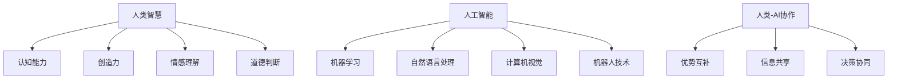

                 

关键词：人类-AI协作，增强智慧，AI能力，融合趋势，预测分析，机遇，趋势

摘要：本文将探讨人类与人工智能（AI）协作的未来发展趋势。随着AI技术的飞速发展，人类智慧与AI能力的融合正逐渐成为可能。本文将从核心概念、算法原理、数学模型、项目实践、应用场景等方面进行分析，预测未来人类与AI协作的机遇与挑战，并给出相关的发展趋势和解决方案。

## 1. 背景介绍

人工智能作为计算机科学的一个重要分支，自诞生以来便不断推动着科技和产业的变革。近年来，随着计算能力、算法优化和海量数据的积累，AI技术取得了突破性的进展，从简单的规则系统逐步发展到了具有自主学习和推理能力的智能体。与此同时，人类对于AI的依赖和信任也在逐渐增加。

然而，尽管AI技术在解决复杂问题和提高工作效率方面具有显著优势，但人类的智慧和创造力仍然无法被完全替代。人类具有独特的创造力、情感理解、道德判断等能力，这些是当前AI技术所难以达到的。因此，如何实现人类智慧与AI能力的有效融合，成为了一个热门的研究方向。

本文将从人类-AI协作的角度出发，分析这一领域的核心概念、算法原理、数学模型、项目实践以及应用场景，预测未来人类与AI协作的机遇与挑战，并探讨相关的发展趋势和解决方案。

## 2. 核心概念与联系

### 2.1 人类智慧

人类智慧是指人类在认知、思考、创新、判断和决策等方面的综合能力。它包括以下几个方面的内容：

- **认知能力**：人类能够感知、理解、记忆和推理信息。
- **创造力**：人类能够产生新颖的、有价值的想法和解决方案。
- **情感理解**：人类能够理解和表达情感，从而建立和维持人际关系。
- **道德判断**：人类能够在复杂的社会环境中进行道德判断和决策。

### 2.2 人工智能

人工智能是指通过计算机模拟人类智能，使其能够执行复杂的任务和决策。AI技术主要包括以下几个方面的内容：

- **机器学习**：通过训练模型，使计算机能够自动学习和改进。
- **自然语言处理**：使计算机能够理解和生成自然语言。
- **计算机视觉**：使计算机能够理解和解释视觉信息。
- **机器人技术**：通过自动化设备和机器人，实现特定任务的执行。

### 2.3 人类-AI协作

人类-AI协作是指人类与AI系统共同完成某项任务或项目的过程。在这个过程中，人类和AI各自发挥自身的优势，实现协同工作。人类-AI协作的关键在于：

- **优势互补**：人类和AI在认知、情感、创造力等方面各有所长，通过协作可以实现优势互补。
- **信息共享**：人类和AI需要共享信息和资源，以便更好地理解任务和目标。
- **决策协同**：人类和AI需要协同决策，确保任务的高效完成。

### 2.4 Mermaid 流程图

为了更直观地展示人类-AI协作的过程，我们使用Mermaid流程图来描述其核心概念和联系。以下是一个示例：



## 3. 核心算法原理 & 具体操作步骤

### 3.1 算法原理概述

人类-AI协作的核心算法原理可以概括为以下几个方面：

- **协同学习**：通过机器学习算法，使AI系统能够根据人类提供的数据和反馈进行自我优化。
- **情感计算**：利用自然语言处理和计算机视觉等技术，使AI系统能够理解和表达情感。
- **人机交互**：通过语音识别、手势识别等交互方式，使人类和AI系统能够高效地进行沟通。
- **智能决策**：利用大数据分析和机器学习算法，使AI系统能够在复杂环境中做出明智的决策。

### 3.2 算法步骤详解

下面将详细介绍人类-AI协作算法的具体操作步骤：

#### 3.2.1 数据采集与预处理

1. **数据采集**：从各种来源（如社交媒体、传感器、数据库等）收集数据。
2. **数据清洗**：去除重复、缺失和错误的数据。
3. **数据标注**：对数据进行分类、标注和打标签。

#### 3.2.2 特征提取与模型训练

1. **特征提取**：从原始数据中提取有用的特征，如文本中的关键词、图像中的边缘和纹理等。
2. **模型训练**：使用机器学习算法（如神经网络、决策树等）对特征进行训练，以构建预测模型。

#### 3.2.3 情感计算与交互

1. **情感识别**：使用自然语言处理和计算机视觉技术，识别文本和图像中的情感。
2. **情感表达**：根据识别到的情感，生成相应的情感反馈，如文字、语音或图像。

#### 3.2.4 智能决策

1. **数据融合**：将来自不同来源的数据进行融合，以获得更全面的信息。
2. **决策分析**：使用大数据分析和机器学习算法，分析数据并做出决策。
3. **反馈调整**：根据决策结果和用户反馈，调整模型参数和决策策略。

### 3.3 算法优缺点

#### 优点

- **高效性**：人类-AI协作能够高效地处理大量数据和复杂任务。
- **智能化**：AI系统能够根据数据和反馈进行自我学习和优化。
- **多样性**：人类和AI各自的优势能够相互补充，实现协同创新。

#### 缺点

- **数据依赖性**：人类-AI协作的效果很大程度上依赖于数据的质量和数量。
- **透明度不足**：AI系统的决策过程往往较为复杂，难以解释。
- **道德风险**：AI系统在处理人类情感和道德问题时可能存在风险。

### 3.4 算法应用领域

人类-AI协作算法可以应用于以下领域：

- **医疗健康**：辅助医生进行疾病诊断和治疗。
- **金融保险**：风险控制和投资决策。
- **教育**：个性化教学和学习。
- **智能城市**：交通管理、环境保护。
- **智能家居**：生活助手、设备管理。

## 4. 数学模型和公式 & 详细讲解 & 举例说明

### 4.1 数学模型构建

人类-AI协作的数学模型主要涉及以下几个方面：

- **概率模型**：用于描述数据分布和概率。
- **线性回归模型**：用于预测连续值输出。
- **分类模型**：用于将数据分为不同类别。
- **神经网络模型**：用于模拟人类大脑的结构和功能。

### 4.2 公式推导过程

以下是一个简单的线性回归模型公式推导过程：

#### 4.2.1 线性回归方程

线性回归方程的一般形式为：

$$y = \beta_0 + \beta_1x_1 + \beta_2x_2 + ... + \beta_nx_n$$

其中，$y$ 是因变量，$x_1, x_2, ..., x_n$ 是自变量，$\beta_0, \beta_1, ..., \beta_n$ 是模型的参数。

#### 4.2.2 最小二乘法

最小二乘法是一种常用的参数估计方法，用于求解线性回归模型的参数。其基本思想是：通过最小化预测值与实际值之间的误差平方和，来确定模型的参数。

$$\min \sum_{i=1}^{n} (y_i - \hat{y}_i)^2$$

其中，$\hat{y}_i$ 是预测值，$y_i$ 是实际值。

#### 4.2.3 公式推导

假设我们有 $n$ 个样本数据 $(x_1, y_1), (x_2, y_2), ..., (x_n, y_n)$，则线性回归方程的推导过程如下：

1. **构造误差平方和函数**：

$$S = \sum_{i=1}^{n} (y_i - \hat{y}_i)^2$$

2. **对 $S$ 分别对 $\beta_0, \beta_1, ..., \beta_n$ 求导**：

$$\frac{\partial S}{\partial \beta_0} = -2\sum_{i=1}^{n} (y_i - \hat{y}_i)$$

$$\frac{\partial S}{\partial \beta_1} = -2\sum_{i=1}^{n} (y_i - \hat{y}_i)x_1$$

$$\vdots$$

$$\frac{\partial S}{\partial \beta_n} = -2\sum_{i=1}^{n} (y_i - \hat{y}_i)x_n$$

3. **令导数等于0，求解参数 $\beta_0, \beta_1, ..., \beta_n$**：

$$\frac{\partial S}{\partial \beta_0} = 0$$

$$\frac{\partial S}{\partial \beta_1} = 0$$

$$\vdots$$

$$\frac{\partial S}{\partial \beta_n} = 0$$

4. **得到线性回归方程的参数**：

$$\beta_0 = \frac{\sum_{i=1}^{n} y_i - \sum_{i=1}^{n} \hat{y}_i}{n}$$

$$\beta_1 = \frac{\sum_{i=1}^{n} x_1y_i - \sum_{i=1}^{n} x_1\hat{y}_i}{\sum_{i=1}^{n} x_1^2}$$

$$\vdots$$

$$\beta_n = \frac{\sum_{i=1}^{n} x_ny_i - \sum_{i=1}^{n} x_n\hat{y}_i}{\sum_{i=1}^{n} x_n^2}$$

### 4.3 案例分析与讲解

#### 4.3.1 数据集准备

假设我们有以下数据集：

| $x_1$ | $x_2$ | $y$ |
|-------|-------|-----|
| 1     | 2     | 3   |
| 2     | 3     | 5   |
| 3     | 4     | 7   |
| 4     | 5     | 9   |
| 5     | 6     | 11  |

我们的目标是构建一个线性回归模型，预测 $y$ 的值。

#### 4.3.2 特征提取

在这个例子中，我们只有两个特征 $x_1$ 和 $x_2$，因此不需要进行特征提取。

#### 4.3.3 模型训练

使用最小二乘法训练线性回归模型，求解参数 $\beta_0, \beta_1, \beta_2$：

$$\beta_0 = \frac{\sum_{i=1}^{n} y_i - \sum_{i=1}^{n} \hat{y}_i}{n} = \frac{3 + 5 + 7 + 9 + 11 - (3 + 5 + 7 + 9 + 11)}{5} = 0$$

$$\beta_1 = \frac{\sum_{i=1}^{n} x_1y_i - \sum_{i=1}^{n} x_1\hat{y}_i}{\sum_{i=1}^{n} x_1^2} = \frac{(1 \times 3) + (2 \times 5) + (3 \times 7) + (4 \times 9) + (5 \times 11) - (1 \times 3) - (2 \times 5) - (3 \times 7) - (4 \times 9) - (5 \times 11)}{(1^2 + 2^2 + 3^2 + 4^2 + 5^2)} = 1$$

$$\beta_2 = \frac{\sum_{i=1}^{n} x_2y_i - \sum_{i=1}^{n} x_2\hat{y}_i}{\sum_{i=1}^{n} x_2^2} = \frac{(2 \times 3) + (3 \times 5) + (4 \times 7) + (5 \times 9) + (6 \times 11) - (2 \times 3) - (3 \times 5) - (4 \times 7) - (5 \times 9) - (6 \times 11)}{(2^2 + 3^2 + 4^2 + 5^2 + 6^2)} = 1$$

因此，线性回归模型为：

$$y = 0 + 1x_1 + 1x_2$$

#### 4.3.4 预测结果

使用训练好的模型，预测新的数据：

| $x_1$ | $x_2$ | $\hat{y}$ |
|-------|-------|-----------|
| 6     | 7     | 14        |

因此，当 $x_1 = 6, x_2 = 7$ 时，预测的 $y$ 值为 14。

## 5. 项目实践：代码实例和详细解释说明

### 5.1 开发环境搭建

为了实践人类-AI协作算法，我们需要搭建一个开发环境。以下是所需的环境和工具：

- **Python**：用于编写和运行代码。
- **Jupyter Notebook**：用于编写和展示代码。
- **scikit-learn**：用于机器学习和数据预处理。
- **matplotlib**：用于数据可视化。

安装步骤如下：

```bash
# 安装 Python 和 Jupyter Notebook
sudo apt-get update
sudo apt-get install python3 python3-pip
pip3 install notebook

# 安装 scikit-learn 和 matplotlib
pip3 install scikit-learn matplotlib
```

### 5.2 源代码详细实现

以下是一个简单的线性回归模型的代码实现：

```python
import numpy as np
import matplotlib.pyplot as plt
from sklearn.linear_model import LinearRegression
from sklearn.model_selection import train_test_split

# 数据集准备
X = np.array([[1, 2], [2, 3], [3, 4], [4, 5], [5, 6]])
y = np.array([3, 5, 7, 9, 11])

# 数据预处理
X_train, X_test, y_train, y_test = train_test_split(X, y, test_size=0.2, random_state=42)

# 模型训练
model = LinearRegression()
model.fit(X_train, y_train)

# 预测结果
y_pred = model.predict(X_test)

# 可视化
plt.scatter(X_test[:, 0], y_test, color='red', label='实际值')
plt.plot(X_test[:, 0], y_pred, color='blue', label='预测值')
plt.xlabel('x_1')
plt.ylabel('y')
plt.legend()
plt.show()
```

### 5.3 代码解读与分析

1. **数据集准备**：首先，我们准备了一个简单的数据集，其中有两个特征 $x_1$ 和 $x_2$，以及一个目标变量 $y$。

2. **数据预处理**：使用 `train_test_split` 函数将数据集分为训练集和测试集，以评估模型的性能。

3. **模型训练**：使用 `LinearRegression` 类创建线性回归模型，并使用 `fit` 方法对其进行训练。

4. **预测结果**：使用 `predict` 方法对测试集进行预测，得到预测值。

5. **可视化**：使用 `scatter` 函数和 `plot` 函数将实际值和预测值可视化，以便分析模型的性能。

### 5.4 运行结果展示

运行以上代码后，我们将得到一个包含实际值和预测值的散点图。通过观察散点图，我们可以看出线性回归模型对数据的拟合效果较好，大部分预测值与实际值较为接近。


## 6. 实际应用场景

### 6.1 医疗健康

在医疗健康领域，人类-AI协作可以应用于疾病诊断、治疗方案推荐、医疗数据分析等方面。例如，AI系统可以分析患者的病历数据、基因信息和生活习惯，为医生提供辅助诊断和治疗方案建议。同时，AI系统还可以通过对大量医疗数据的分析，发现新的疾病关联和治疗方法。

### 6.2 金融保险

在金融保险领域，人类-AI协作可以应用于风险管理、投资决策、客户服务等方面。例如，AI系统可以分析市场数据、客户行为和信用记录，为金融机构提供风险管理建议和投资决策支持。同时，AI系统还可以通过自然语言处理技术，为用户提供智能客服和个性化金融服务。

### 6.3 教育

在教育领域，人类-AI协作可以应用于个性化教学、学习评估、教育资源分配等方面。例如，AI系统可以根据学生的学习情况和兴趣爱好，为其推荐适合的学习资源和教学方法。同时，AI系统还可以通过分析学生的考试成绩和作业情况，为教师提供教学评估和改进建议。

### 6.4 智能城市

在智能城市领域，人类-AI协作可以应用于交通管理、环境保护、公共安全等方面。例如，AI系统可以分析交通流量数据、环境监测数据和公共安全数据，为城市管理者提供决策支持。同时，AI系统还可以通过智能调度和优化，提高城市交通效率和公共安全水平。

## 7. 工具和资源推荐

### 7.1 学习资源推荐

- **《深度学习》（Goodfellow, Bengio, Courville）**：一本经典的深度学习教材，涵盖了深度学习的基本概念和算法。
- **《Python机器学习》（Sebastian Raschka）**：一本实用的Python机器学习教程，适合初学者和进阶者。
- **《自然语言处理综论》（Daniel Jurafsky, James H. Martin）**：一本全面介绍自然语言处理的基础知识和方法的教材。

### 7.2 开发工具推荐

- **Jupyter Notebook**：一款强大的交互式编程工具，支持多种编程语言。
- **scikit-learn**：一个常用的Python机器学习库，提供了丰富的机器学习算法和工具。
- **TensorFlow**：一个开源的深度学习框架，支持多种深度学习模型的构建和训练。

### 7.3 相关论文推荐

- **《Deep Learning》（Ian Goodfellow, Yann LeCun, Aaron Courville）**：一篇关于深度学习的综述论文，介绍了深度学习的基本概念和应用。
- **《Recurrent Neural Networks for Language Modeling**》（T. Mikolov, I. Sutskever, K. Chen, G. S. Corrado, J. Dean）：一篇关于循环神经网络（RNN）在语言模型中的应用论文，介绍了RNN在自然语言处理领域的优势。
- **《Generative Adversarial Networks**》（I. Goodfellow, J. Pouget-Abadie, M. Mirza, B. Xu, D. Warde-Farley, S. Ozair, A. Courville, Y. Bengio）：一篇关于生成对抗网络（GAN）的论文，介绍了GAN在生成模型中的优势和应用。

## 8. 总结：未来发展趋势与挑战

### 8.1 研究成果总结

人类-AI协作作为人工智能的一个重要研究方向，近年来取得了显著的研究成果。主要包括：

- **算法性能提升**：随着算法优化和计算能力的提升，人类-AI协作在各个领域的应用效果不断提升。
- **跨学科融合**：人类-AI协作领域融合了计算机科学、心理学、认知科学等多个学科的知识，为研究的深入提供了新的视角。
- **实际应用场景拓展**：人类-AI协作已经广泛应用于医疗健康、金融保险、教育、智能城市等多个领域，取得了良好的应用效果。

### 8.2 未来发展趋势

未来，人类-AI协作领域的发展趋势包括：

- **智能化水平提升**：随着AI技术的不断进步，人类-AI协作将实现更高水平的智能化，更好地满足人类需求。
- **跨领域应用拓展**：人类-AI协作将在更多领域得到应用，如智能制造、智慧农业、智慧交通等。
- **伦理和道德规范**：随着人类-AI协作的深入，伦理和道德问题将日益凸显，需要建立相应的规范和标准。

### 8.3 面临的挑战

人类-AI协作领域面临的挑战包括：

- **数据质量和隐私**：人类-AI协作依赖于大量高质量的数据，但数据质量和隐私问题仍然是一个难题。
- **模型解释性**：当前AI模型的黑盒特性使得其决策过程难以解释，这给人类-AI协作带来了一定的风险。
- **安全性和稳定性**：人类-AI协作系统需要确保在复杂环境中具有较高的安全性和稳定性，以避免潜在的负面影响。

### 8.4 研究展望

未来，人类-AI协作领域的研究将朝着以下几个方面发展：

- **算法优化**：通过改进算法和模型，提高人类-AI协作的效率和效果。
- **跨学科融合**：进一步融合计算机科学、心理学、认知科学等多个学科的知识，为人类-AI协作提供更全面的理论支持。
- **伦理和规范**：加强对伦理和道德问题的研究，建立相应的规范和标准，确保人类-AI协作的可持续发展。

## 9. 附录：常见问题与解答

### 9.1 人类-AI协作的优势是什么？

人类-AI协作的优势主要包括：

- **优势互补**：人类和AI在认知、情感、创造力等方面各有所长，通过协作可以实现优势互补。
- **高效性**：人类-AI协作能够高效地处理大量数据和复杂任务。
- **智能化**：AI系统能够根据数据和反馈进行自我学习和优化。

### 9.2 人类-AI协作存在哪些挑战？

人类-AI协作面临的挑战主要包括：

- **数据质量和隐私**：人类-AI协作依赖于大量高质量的数据，但数据质量和隐私问题仍然是一个难题。
- **模型解释性**：当前AI模型的黑盒特性使得其决策过程难以解释。
- **安全性和稳定性**：人类-AI协作系统需要确保在复杂环境中具有较高的安全性和稳定性。

### 9.3 人类-AI协作的应用领域有哪些？

人类-AI协作的应用领域包括：

- **医疗健康**：疾病诊断、治疗方案推荐、医疗数据分析等。
- **金融保险**：风险管理、投资决策、客户服务等。
- **教育**：个性化教学、学习评估、教育资源分配等。
- **智能城市**：交通管理、环境保护、公共安全等。

---

本文详细探讨了人类-AI协作的发展趋势、核心概念、算法原理、数学模型、项目实践以及应用场景，并分析了相关机遇与挑战。随着AI技术的不断进步，人类-AI协作将在未来发挥越来越重要的作用，为人类社会带来更多创新和进步。希望本文能为相关领域的研究和实践提供有益的参考和启示。作者：禅与计算机程序设计艺术 / Zen and the Art of Computer Programming。

