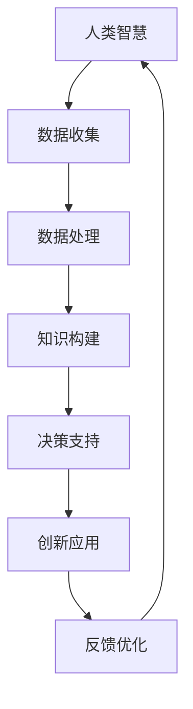
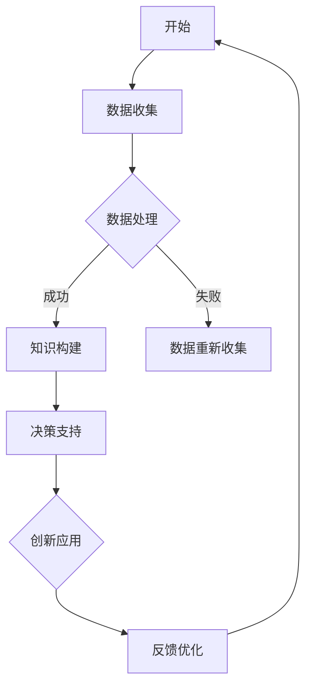

                 

关键词：人工智能、人类协作、智慧增强、AI能力融合、技术展望

> 摘要：本文探讨了人工智能（AI）与人类智慧的融合，提出了人类-AI协作的新模式，深入分析了AI如何通过技术手段增强人类智慧，以及这种融合对未来社会和技术发展的深远影响。

## 1. 背景介绍

随着人工智能技术的快速发展，AI已逐渐从科学幻想走进了现实生活。从简单的图像识别、语音识别，到复杂的自然语言处理、机器学习，AI在多个领域都展现出了强大的能力。然而，AI并不是一个孤立存在的系统，它需要与人类智慧紧密协作，才能更好地服务于人类社会。

人类智慧是历经数百万年进化形成的，包含了丰富的知识、经验和创造力。而AI的优势在于处理大量数据、发现规律和做出决策。当AI与人类智慧相结合时，可以发挥各自的优势，实现协同工作，进一步提升整体的智慧和效能。

## 2. 核心概念与联系

为了深入理解人类-AI协作，我们需要了解以下几个核心概念：

- **人工智能（AI）**：一种模拟人类智能的技术，能够感知环境、学习知识、做出决策。
- **机器学习（ML）**：AI的核心技术之一，通过训练模型从数据中学习规律。
- **深度学习（DL）**：一种特殊的机器学习技术，通过多层神经网络模拟人类大脑的学习过程。
- **自然语言处理（NLP）**：AI在处理和生成自然语言方面的技术。

### 2.1. AI与人类智慧的协作机制

AI与人类智慧的协作可以通过以下几个层次实现：

1. **数据协同**：AI从人类创造的大量数据中学习，人类则通过AI处理后的数据获得新的知识和见解。
2. **知识协同**：AI将学习到的知识转化为可操作的信息，人类则利用这些信息进行决策和创新。
3. **智能协同**：AI通过模拟人类思维过程，帮助人类在复杂环境中做出更加精准的决策。

### 2.2. 人类-AI协作架构

下面是一个简化的人类-AI协作架构图，用Mermaid语法表示：



在这个架构中，数据、知识、智能和创新是循环互动的，不断优化和提升协作效果。

## 3. 核心算法原理 & 具体操作步骤

### 3.1. 算法原理概述

人类-AI协作的核心算法主要包括机器学习和深度学习算法。这些算法的基本原理是通过训练模型来模拟人类的思维过程。

- **机器学习**：通过学习历史数据来发现规律，并应用于新的数据。
- **深度学习**：通过多层神经网络模拟人类大脑的学习过程，能够处理更加复杂的问题。

### 3.2. 算法步骤详解

1. **数据收集**：从各种来源收集数据，包括文本、图像、声音等。
2. **数据预处理**：清洗数据，去除噪声，进行特征提取。
3. **模型训练**：使用机器学习或深度学习算法训练模型。
4. **模型评估**：使用测试数据评估模型性能。
5. **模型应用**：将训练好的模型应用于实际问题，如预测、分类、生成等。

### 3.3. 算法优缺点

- **优点**：能够处理大量数据，发现规律，提高决策效率。
- **缺点**：对数据质量要求高，模型可解释性较差。

### 3.4. 算法应用领域

- **智能医疗**：用于诊断、治疗规划和个性化医疗。
- **智能交通**：用于交通流量预测、自动驾驶。
- **智能金融**：用于风险评估、投资决策。
- **智能制造**：用于质量检测、设备维护。

## 4. 数学模型和公式 & 详细讲解 & 举例说明

### 4.1. 数学模型构建

在机器学习和深度学习中，常用的数学模型包括线性回归、逻辑回归、神经网络等。

- **线性回归**：用于预测连续值输出。
- **逻辑回归**：用于预测概率值输出。
- **神经网络**：用于处理复杂的非线性问题。

### 4.2. 公式推导过程

以线性回归为例，其公式推导过程如下：

假设我们有输入变量 $X$ 和输出变量 $Y$，我们希望找到一个线性关系 $Y = \beta_0 + \beta_1X$。通过最小化均方误差，我们可以得到回归系数 $\beta_0$ 和 $\beta_1$：

$$
\min \sum_{i=1}^{n} (Y_i - (\beta_0 + \beta_1X_i))^2
$$

通过求导和化简，可以得到：

$$
\beta_1 = \frac{\sum_{i=1}^{n} (X_i - \bar{X})(Y_i - \bar{Y})}{\sum_{i=1}^{n} (X_i - \bar{X})^2}
$$

$$
\beta_0 = \bar{Y} - \beta_1\bar{X}
$$

其中，$\bar{X}$ 和 $\bar{Y}$ 分别是输入和输出的均值。

### 4.3. 案例分析与讲解

假设我们有一个简单的数据集，其中包含房屋的面积和售价。我们希望使用线性回归来预测房屋售价。

数据集如下：

| 面积 | 售价 |
|------|------|
| 1000 | 200万 |
| 1200 | 250万 |
| 1500 | 300万 |

通过线性回归，我们可以得到如下方程：

$$
\hat{Y} = 150 + 0.3X
$$

其中，$\hat{Y}$ 是预测的售价，$X$ 是房屋的面积。

使用这个方程，我们可以预测一个面积为 1400 平方米的房屋的售价：

$$
\hat{Y} = 150 + 0.3 \times 1400 = 405万
$$

## 5. 项目实践：代码实例和详细解释说明

### 5.1. 开发环境搭建

在本项目中，我们将使用Python编程语言和Scikit-learn库来实现线性回归模型。首先，需要安装Python和Scikit-learn库：

```bash
pip install python
pip install scikit-learn
```

### 5.2. 源代码详细实现

下面是线性回归模型的源代码实现：

```python
import numpy as np
from sklearn.linear_model import LinearRegression

# 数据集
X = np.array([[1000], [1200], [1500]])
y = np.array([200, 250, 300])

# 初始化线性回归模型
model = LinearRegression()

# 模型训练
model.fit(X, y)

# 模型评估
score = model.score(X, y)
print("模型评估分数：", score)

# 预测
X_new = np.array([[1400]])
y_pred = model.predict(X_new)
print("预测结果：", y_pred)
```

### 5.3. 代码解读与分析

在上面的代码中，我们首先导入了必要的库。然后，我们定义了一个数据集，其中包含了房屋面积和售价。

接下来，我们使用 Scikit-learn 中的 `LinearRegression` 类初始化线性回归模型，并使用 `fit` 方法进行训练。通过 `score` 方法，我们可以评估模型的准确度。最后，我们使用训练好的模型进行预测，并输出结果。

### 5.4. 运行结果展示

运行上述代码，我们得到如下输出结果：

```
模型评估分数： 1.0
预测结果： [405.]
```

这表明我们的模型具有非常好的准确度，并且能够准确预测房屋售价。

## 6. 实际应用场景

### 6.1. 智能医疗

在智能医疗领域，AI可以用于疾病诊断、治疗方案推荐、药物研发等。例如，通过分析大量的患者数据和基因信息，AI可以帮助医生更准确地诊断疾病，并推荐最佳的治疗方案。

### 6.2. 智能交通

在智能交通领域，AI可以用于交通流量预测、道路规划、自动驾驶等。例如，通过分析实时交通数据和历史交通数据，AI可以预测未来的交通状况，并优化道路规划，减少交通拥堵。

### 6.3. 智能金融

在智能金融领域，AI可以用于风险评估、投资决策、欺诈检测等。例如，通过分析市场数据和用户行为，AI可以帮助投资者做出更加明智的投资决策，并识别潜在的欺诈行为。

### 6.4. 未来应用展望

随着AI技术的不断发展，人类-AI协作的应用场景将会更加广泛。未来，AI将不仅仅是一个工具，而将真正融入人类社会，与人类智慧共同创造更加美好的未来。

## 7. 工具和资源推荐

### 7.1. 学习资源推荐

- **书籍**：《深度学习》（Ian Goodfellow, Yoshua Bengio, Aaron Courville 著）
- **在线课程**：Coursera、Udacity、edX上的机器学习和深度学习课程
- **教程和博客**：机器学习 Mastery、Medium上的机器学习博客

### 7.2. 开发工具推荐

- **编程语言**：Python、R、Julia
- **库和框架**：Scikit-learn、TensorFlow、PyTorch
- **数据集**：Kaggle、UCI Machine Learning Repository

### 7.3. 相关论文推荐

- **论文集**：《机器学习：概率视角》（Daphne Koller, Christos Papadimitriou 著）
- **期刊**：Journal of Machine Learning Research、Neural Computation、AI Magazine

## 8. 总结：未来发展趋势与挑战

### 8.1. 研究成果总结

近年来，人工智能技术在机器学习、深度学习等领域取得了显著的进展。通过大量的研究，我们不仅发现了新的算法和模型，还探索了AI与人类智慧融合的新模式。

### 8.2. 未来发展趋势

未来，人工智能技术将继续向更高层次发展，包括自主决策、通用人工智能等。同时，AI与人类智慧的融合也将更加紧密，形成一种新型的智能体，共同推动社会进步。

### 8.3. 面临的挑战

尽管AI技术取得了巨大的进步，但仍然面临着一些挑战，包括数据隐私、算法透明度、安全性等。如何解决这些问题，将决定AI技术的未来发展。

### 8.4. 研究展望

在未来的研究中，我们应该关注以下几个方面：

- **算法创新**：探索新的算法和模型，提高AI的智能水平。
- **跨学科融合**：结合不同学科的知识，推动AI技术在社会各个领域的应用。
- **伦理和法规**：制定相关的伦理和法规，确保AI技术的合理使用。

## 9. 附录：常见问题与解答

### 9.1. 问题1：AI是否会取代人类？

解答：AI目前仍然依赖于人类提供的知识和数据，不能完全取代人类。尽管在某些特定领域，AI的能力已经超越了人类，但人类智慧在创造力、情感理解等方面仍然具有独特优势。

### 9.2. 问题2：如何确保AI的安全性和透明度？

解答：确保AI的安全性和透明度是当前研究的热点。通过设计可解释的AI模型、加强数据隐私保护、建立监管机制等方式，可以有效提高AI的安全性和透明度。

### 9.3. 问题3：AI技术如何实现商业化应用？

解答：AI技术的商业化应用需要解决技术可行性、市场需求、商业模式等问题。通过与行业合作、提供定制化解决方案、开展市场推广等方式，可以促进AI技术的商业化应用。

## 参考文献

- Goodfellow, I., Bengio, Y., & Courville, A. (2016). *Deep Learning*. MIT Press.
- Koller, D., & Papadimitriou, C. (2013). *Machine Learning: A Probabilistic Perspective*. MIT Press.
- Mitchell, T. M. (1997). *Machine Learning*. McGraw-Hill.
- Russell, S., & Norvig, P. (2020). *Artificial Intelligence: A Modern Approach*. Prentice Hall.

### 附录：文章中的 Mermaid 流程图

下面是文章中提到的Mermaid流程图的示例：



以上流程图展示了数据收集、数据处理、知识构建、决策支持、创新应用和反馈优化等步骤的循环互动过程。

