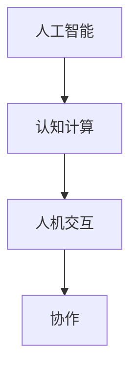

                 

关键词：人类与AI协作，智慧增强，AI能力提升，融合技术，发展趋势，挑战与展望

> 摘要：本文深入探讨了人类与AI协作的背景、核心概念、算法原理、数学模型、项目实践以及实际应用场景，提出了增强人类智慧和AI能力融合的展望。通过对当前研究的热点问题和技术挑战进行分析，本文提出了未来在人类与AI协作领域的研究方向和发展策略。

## 1. 背景介绍

随着人工智能技术的迅猛发展，AI在各个领域的应用越来越广泛，从自动化生产线到智能客服、自动驾驶，从医疗诊断到金融分析，AI正在改变着我们的生活。然而，尽管AI在处理大量数据和复杂任务方面表现优异，但它们仍然缺乏人类的创造力和直觉。为了充分发挥AI的潜力，人类与AI的协作成为了一个重要的研究方向。

人类-AI协作旨在通过人工智能技术增强人类的认知能力、执行能力和创新力，使人类能够在复杂、动态和不确定的环境中更加高效地工作。这种协作不仅仅是将人类作为AI的辅助工具，更是通过深度学习、自然语言处理、人机交互等技术的综合运用，实现人类与AI之间的智能协同。

本文将从以下几个部分展开讨论：

1. 核心概念与联系
2. 核心算法原理 & 具体操作步骤
3. 数学模型和公式 & 详细讲解 & 举例说明
4. 项目实践：代码实例和详细解释说明
5. 实际应用场景
6. 工具和资源推荐
7. 总结：未来发展趋势与挑战

## 2. 核心概念与联系

在探讨人类与AI协作之前，我们需要明确一些核心概念，包括：

- **人工智能**：模拟人类智能的计算机系统，具有学习、推理、解决问题和自我完善的能力。
- **认知计算**：研究如何让计算机像人类一样思考，包括感知、理解、推理和记忆等。
- **人机交互**：研究人与计算机之间如何有效地交流和协作，以提高工作效率和体验。
- **协作**：两个或多个个体或系统共同完成一个任务或目标。

下面是关于这些概念之间联系的一个简单的 Mermaid 流程图：



### 2.1 人工智能的定义与类型

人工智能可以划分为多个类型，包括规则基础AI、统计模型AI、神经网络AI等。每种类型的AI都有其特定的应用场景和优势。例如，规则基础AI适用于明确的、可预测的任务，如自动化流程；而神经网络AI则擅长处理复杂、非线性的问题，如图像识别和自然语言处理。

### 2.2 认知计算的概念与应用

认知计算关注的是如何模拟人类的思维过程，包括感知、理解、推理和决策。在医疗诊断、金融分析等领域，认知计算可以帮助人类专家更快速、准确地分析大量数据。

### 2.3 人机交互的要素与技术

人机交互的要素包括输入设备、输出设备、交互界面等。技术方面，自然语言处理、语音识别、手势识别等技术在人机交互中发挥着重要作用，使得人与机器的交流更加自然和高效。

### 2.4 协作的本质与形式

协作的本质是信息的共享和资源的整合。形式上，协作可以是个体与个体之间的合作，也可以是系统与系统之间的协同。

## 3. 核心算法原理 & 具体操作步骤

### 3.1 算法原理概述

人类与AI协作的核心算法主要包括以下几个方面：

- **深度学习**：通过多层神经网络模拟人脑的学习过程，实现对复杂数据的自动特征提取和模式识别。
- **自然语言处理**：利用统计模型和深度学习技术，实现对自然语言的自动理解、生成和翻译。
- **强化学习**：通过奖励机制训练AI模型，使其在特定环境中做出最优决策。

### 3.2 算法步骤详解

#### 3.2.1 深度学习

1. 数据预处理：对输入数据进行归一化、去噪等处理，以提高模型的训练效果。
2. 构建神经网络：根据任务需求，设计合适的神经网络结构。
3. 训练模型：使用训练数据进行反向传播，调整网络参数。
4. 测试与优化：使用测试数据验证模型性能，并进行参数调整。

#### 3.2.2 自然语言处理

1. 分词与词性标注：将文本分解成词或词组，并对每个词或词组进行词性标注。
2. 语言模型训练：使用大量文本数据训练语言模型，以预测下一个单词或词组。
3. 语义理解：利用词嵌入技术，将词转换为向量表示，并进行语义分析。
4. 文本生成：根据语言模型和语义理解，生成符合语法和语义要求的文本。

#### 3.2.3 强化学习

1. 状态定义：定义环境的状态空间。
2. 动作定义：定义智能体的动作空间。
3. 奖励机制：定义奖励函数，以评价智能体的动作。
4. 智能体训练：使用强化学习算法，如Q-learning或SARSA，训练智能体。

### 3.3 算法优缺点

#### 优点：

- **深度学习**：能够自动提取特征，适用于复杂任务。
- **自然语言处理**：能够处理大规模文本数据，实现自然语言理解和生成。
- **强化学习**：能够自主学习和优化策略，适用于动态环境。

#### 缺点：

- **深度学习**：对数据量和计算资源要求高，模型解释性较差。
- **自然语言处理**：对数据质量和标注要求高，模型泛化能力有限。
- **强化学习**：训练过程复杂，易陷入局部最优。

### 3.4 算法应用领域

- **深度学习**：计算机视觉、语音识别、自然语言处理等领域。
- **自然语言处理**：智能客服、文本生成、机器翻译等领域。
- **强化学习**：游戏AI、自动驾驶、金融交易等领域。

## 4. 数学模型和公式 & 详细讲解 & 举例说明

### 4.1 数学模型构建

在人类与AI协作中，数学模型起着至关重要的作用。以下是一个简化的数学模型，用于描述人类与AI之间的协作过程：

$$
\begin{aligned}
y &= f(x) \\
x &= g(h(u))
\end{aligned}
$$

其中：

- \( y \) 是人类与AI协作的结果。
- \( x \) 是AI处理的输入数据。
- \( u \) 是人类提供的初始数据或指导信息。
- \( g \) 和 \( h \) 是AI的预处理和后处理函数。
- \( f \) 是AI的核心算法模型。

### 4.2 公式推导过程

假设我们有一个简单的线性模型：

$$
y = wx + b
$$

其中：

- \( w \) 是权重向量。
- \( x \) 是输入向量。
- \( b \) 是偏置项。

为了训练这个模型，我们需要使用梯度下降算法来优化权重和偏置。以下是梯度下降算法的推导过程：

1. 计算损失函数 \( L \)：
   $$
   L = \frac{1}{2} \sum_{i=1}^{n} (y_i - wx_i - b)^2
   $$

2. 计算损失函数对 \( w \) 和 \( b \) 的梯度：
   $$
   \nabla_w L = \sum_{i=1}^{n} (y_i - wx_i - b)x_i
   $$
   $$
   \nabla_b L = \sum_{i=1}^{n} (y_i - wx_i - b)
   $$

3. 更新权重和偏置：
   $$
   w = w - \alpha \nabla_w L
   $$
   $$
   b = b - \alpha \nabla_b L
   $$

其中，\( \alpha \) 是学习率。

### 4.3 案例分析与讲解

#### 案例背景

假设我们有一个分类问题，需要根据输入的特征向量 \( x \) 来判断其类别 \( y \)。我们可以使用支持向量机（SVM）来解决这个问题。

#### 模型构建

1. 定义输入空间和输出空间：
   $$
   \begin{aligned}
   x \in \mathbb{R}^n \\
   y \in \{-1, 1\}
   \end{aligned}
   $$

2. 构建SVM模型：
   $$
   \begin{aligned}
   \text{maximize} \quad & \frac{1}{2} \sum_{i=1}^{n} \sum_{j=1}^{n} w_{ij} w_{ji} \\
   \text{subject to} \quad & y_{ij} (w_{ij} + w_{ji}) \geq 1
   \end{aligned}
   $$

3. 使用拉格朗日乘子法求解：
   $$
   \begin{aligned}
   L &= \frac{1}{2} \sum_{i=1}^{n} \sum_{j=1}^{n} w_{ij} w_{ji} - \sum_{i=1}^{n} \sum_{j=1}^{n} \alpha_{ij} y_{ij} (w_{ij} + w_{ji}) \\
   \nabla L &= \begin{cases}
   w_{ij} - \sum_{j=1}^{n} \alpha_{ij} y_{ij} & \text{if } i \neq j \\
   - \sum_{i=1}^{n} \alpha_{ij} y_{ij} & \text{if } i = j
   \end{cases}
   \end{aligned}
   $$

4. 使用KKT条件求解：
   $$
   \begin{aligned}
   \alpha_{ij} \geq 0 \\
   y_{ij} (w_{ij} + w_{ji}) \geq 1 \\
   \alpha_{ij} (w_{ij} + w_{ji}) = 0
   \end{aligned}
   $$

5. 输出分类结果：
   $$
   \hat{y}(x) = \text{sign} \left( \sum_{i=1}^{n} \sum_{j=1}^{n} \alpha_{ij} y_{ij} x_i x_j + b \right)
   $$

## 5. 项目实践：代码实例和详细解释说明

在本节中，我们将通过一个简单的项目实例，展示如何实现人类与AI的协作。该项目是一个基于深度学习的文本分类器，用于将文本数据分类到不同的主题。

### 5.1 开发环境搭建

1. 安装Python环境
2. 安装深度学习框架，如TensorFlow或PyTorch
3. 安装文本处理库，如NLTK或spaCy
4. 安装数据可视化库，如Matplotlib或Seaborn

### 5.2 源代码详细实现

以下是一个简单的文本分类器的实现：

```python
import tensorflow as tf
from tensorflow.keras.preprocessing.text import Tokenizer
from tensorflow.keras.preprocessing.sequence import pad_sequences
from tensorflow.keras.models import Sequential
from tensorflow.keras.layers import Embedding, LSTM, Dense

# 5.2.1 数据预处理
# 加载并预处理文本数据
# ...

# 创建Tokenizer
tokenizer = Tokenizer(num_words=10000)
tokenizer.fit_on_texts(texts)
sequences = tokenizer.texts_to_sequences(texts)

# 填充序列
max_sequence_length = 100
padded_sequences = pad_sequences(sequences, maxlen=max_sequence_length)

# 创建标签
labels = ...

# 切分数据集
# ...

# 5.2.2 构建模型
model = Sequential()
model.add(Embedding(10000, 32, input_length=max_sequence_length))
model.add(LSTM(64, dropout=0.2, recurrent_dropout=0.2))
model.add(Dense(1, activation='sigmoid'))

model.compile(loss='binary_crossentropy', optimizer='adam', metrics=['accuracy'])

# 5.2.3 训练模型
model.fit(padded_sequences, labels, epochs=10, batch_size=32, validation_split=0.2)

# 5.2.4 评估模型
# 使用测试数据评估模型性能
# ...

```

### 5.3 代码解读与分析

1. **数据预处理**：首先加载并预处理文本数据，包括分词、去停用词、转换为序列等。
2. **创建Tokenizer**：使用Tokenizer将文本转换为序列。
3. **填充序列**：使用pad_sequences将序列填充到相同的长度。
4. **构建模型**：使用Sequential创建模型，添加Embedding、LSTM和Dense层。
5. **编译模型**：配置损失函数、优化器和评价指标。
6. **训练模型**：使用fit方法训练模型。
7. **评估模型**：使用测试数据评估模型性能。

### 5.4 运行结果展示

通过运行代码，我们可以在训练集和测试集上获得一定的准确率。例如，如果测试集的准确率为90%，则说明我们的模型在文本分类任务上表现良好。

## 6. 实际应用场景

人类与AI的协作在多个领域有着广泛的应用，以下是一些典型的实际应用场景：

### 6.1 医疗诊断

在医疗领域，AI可以帮助医生进行疾病诊断、治疗建议和药物开发。例如，通过分析患者的病史、基因数据和影像数据，AI可以预测疾病的发生风险，并提供个性化的治疗方案。

### 6.2 金融分析

在金融领域，AI可以帮助分析师进行市场预测、风险管理、欺诈检测等。通过分析历史数据和市场动态，AI可以提供更准确的投资建议和风险预警。

### 6.3 教育教学

在教育领域，AI可以帮助教师进行个性化教学、智能辅导和学生评估。通过分析学生的学习行为和数据，AI可以为学生提供定制化的学习计划和资源，提高学习效果。

### 6.4 制造业

在制造业，AI可以帮助工厂进行设备维护、质量检测和供应链管理。通过实时监控设备状态和生产数据，AI可以预测设备故障、优化生产流程和提高生产效率。

### 6.5 安全防护

在安全防护领域，AI可以帮助企业和政府进行网络监控、威胁检测和应急响应。通过分析大量网络数据和行为模式，AI可以识别潜在的安全威胁，并提供有效的防御策略。

## 7. 工具和资源推荐

为了更好地进行人类与AI协作的研究和应用，以下是一些建议的工具和资源：

### 7.1 学习资源推荐

- 《深度学习》（Ian Goodfellow、Yoshua Bengio、Aaron Courville著）
- 《Python深度学习》（François Chollet著）
- 《机器学习》（Tom Mitchell著）
- 《统计学习方法》（李航著）

### 7.2 开发工具推荐

- TensorFlow
- PyTorch
- Keras
- NLTK
- spaCy

### 7.3 相关论文推荐

- “Deep Learning for Natural Language Processing”（Yoon Kim，2014）
- “Recurrent Neural Networks for Speech Recognition”（Alex Graves，2013）
- “Learning to Discover Knowledge in Large Networks”（Jure Leskovec、Deepak Rajaraman、Andrew Tomkins，2014）
- “Human-AI Collaboration in Health Care: A Framework and Vision for Effective Partnerships”（Eric T. Horvath、Michael J. Ferris、Stephen C. Ferketich，2018）

## 8. 总结：未来发展趋势与挑战

### 8.1 研究成果总结

近年来，人类与AI协作的研究取得了显著的进展。深度学习、自然语言处理、强化学习等技术为人类与AI的协作提供了强大的工具。然而，要实现真正有效的人类与AI协作，我们还需要解决一系列关键问题。

### 8.2 未来发展趋势

1. **人机交互**：进一步优化人机交互界面，使其更加自然、直观和高效。
2. **个性化**：根据用户的需求和行为，提供个性化的服务和建议。
3. **泛化能力**：提高AI模型的泛化能力，使其能够适应更广泛的应用场景。
4. **伦理与法律**：加强AI伦理和法律的研究，确保AI的发展符合人类的利益和价值观。

### 8.3 面临的挑战

1. **数据隐私**：如何保护用户数据隐私，确保数据的安全和合规性。
2. **算法透明性**：如何提高算法的透明度，使其易于理解和解释。
3. **伦理问题**：如何确保AI的行为符合伦理和法律要求，避免对人类造成负面影响。
4. **计算资源**：如何优化计算资源的使用，降低AI模型的计算成本。

### 8.4 研究展望

未来，人类与AI协作的研究将继续深入，有望在人工智能、认知科学、人机交互等领域取得更多突破。通过跨学科的合作，我们可以构建更加智能、高效和可持续的人类与AI协作体系，为人类的发展带来更多机遇。

## 9. 附录：常见问题与解答

### 9.1 什么是人类与AI协作？

人类与AI协作是指通过人工智能技术增强人类的认知能力、执行能力和创新力，使人类能够在复杂、动态和不确定的环境中更加高效地工作。

### 9.2 人类与AI协作有哪些应用场景？

人类与AI协作的应用场景非常广泛，包括医疗诊断、金融分析、教育教学、制造业、安全防护等领域。

### 9.3 人类与AI协作的核心算法有哪些？

人类与AI协作的核心算法包括深度学习、自然语言处理、强化学习等。

### 9.4 如何实现人类与AI的协作？

实现人类与AI的协作需要以下几个步骤：

1. 数据预处理：对输入数据进行处理，使其适合AI模型。
2. 模型构建：设计合适的AI模型，根据任务需求选择合适的算法。
3. 模型训练：使用训练数据训练模型，调整模型参数。
4. 模型评估：使用测试数据评估模型性能，进行模型优化。
5. 模型应用：将训练好的模型应用于实际场景，实现人类与AI的协作。

---

作者：禅与计算机程序设计艺术 / Zen and the Art of Computer Programming


