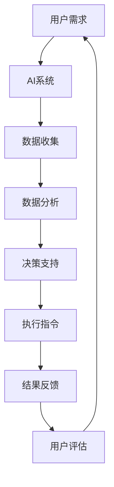

                 

关键词：人工智能、协作、增强智能、融合技术、未来展望

> 摘要：随着人工智能技术的飞速发展，人类与AI的协作已成为一个不可逆转的趋势。本文将探讨人类与AI协作的重要性，阐述增强人类智慧与AI能力的融合技术，并展望未来的发展前景。

## 1. 背景介绍

在过去的几十年里，人工智能（AI）经历了从实验室研究到实际应用的巨大转变。从最初的规则系统到现代的深度学习，AI技术已经在医疗、金融、教育、制造业等多个领域产生了深远的影响。随着计算能力的提升和数据的爆发式增长，AI开始展现其强大的智能潜力，这不仅引起了学术界的广泛关注，也引发了产业界的浓厚兴趣。

与此同时，人类智慧的表现形式也在不断进化。从简单的逻辑推理到复杂的创造性思维，人类在解决问题和处理信息方面的能力逐渐增强。然而，人类智慧并非完美无缺，其在处理海量数据和进行复杂计算时，常常力不从心。

在这样的背景下，人类与AI的协作应运而生。AI可以为人类提供强大的计算能力和分析工具，而人类则可以凭借其创造力、情感理解和道德判断来指导AI的决策。这种协同作用不仅能够提升AI的性能，也能够扩展人类智慧的边界。

## 2. 核心概念与联系

为了更好地理解人类与AI协作的原理和架构，我们首先需要明确一些核心概念。

### 2.1 人工智能（AI）

人工智能是指由人造系统实现的智能，它包括机器学习、深度学习、自然语言处理、计算机视觉等多种技术。AI的目标是使计算机具备人类智能的某些方面，如感知、学习、推理和决策。

### 2.2 人类智慧

人类智慧包括逻辑推理、创造力、情感理解和道德判断等多个方面。人类智慧的优势在于其灵活性和适应性，能够在复杂和不确定的环境中做出合理的决策。

### 2.3 人类-AI协作

人类-AI协作是指人类与AI系统共同工作，以实现更好的性能和结果。这种协作可以通过多种方式进行，如AI辅助决策、AI执行指令、AI增强记忆等。

下面是Mermaid流程图，展示了人类与AI协作的基本架构：



### 2.4 机器学习（ML）

机器学习是AI的核心组成部分，它使计算机能够从数据中学习并做出预测或决策。机器学习可以分为监督学习、无监督学习和强化学习。

### 2.5 深度学习（DL）

深度学习是一种特殊的机器学习方法，它使用多层神经网络来模拟人类大脑的处理方式。深度学习在图像识别、语音识别和自然语言处理等领域取得了显著成果。

### 2.6 自然语言处理（NLP）

自然语言处理是使计算机能够理解、生成和处理人类语言的技术。NLP在聊天机器人、翻译服务和文本分析等领域有着广泛应用。

## 3. 核心算法原理 & 具体操作步骤

### 3.1 算法原理概述

人类与AI协作的核心算法通常基于机器学习和深度学习技术。这些算法的基本原理是通过从大量数据中学习，从而提高AI的预测和决策能力。

### 3.2 算法步骤详解

1. **数据收集**：首先，需要收集相关的数据，这些数据可以来自传感器、用户输入或现有数据库。

2. **数据预处理**：对收集到的数据进行清洗、归一化和特征提取，使其适合机器学习算法。

3. **模型训练**：使用预处理后的数据来训练机器学习模型。训练过程包括模型初始化、迭代优化和性能评估。

4. **模型部署**：将训练好的模型部署到生产环境中，以实现实际应用。

5. **用户交互**：用户与AI系统进行交互，输入需求或问题，AI系统根据模型进行响应。

6. **结果反馈**：用户对AI的响应进行评估，并将结果反馈给系统。

7. **模型更新**：根据用户反馈，对模型进行优化和更新，以提高其性能。

### 3.3 算法优缺点

**优点**：
- 提高效率和准确性：AI系统可以快速处理大量数据，并做出准确预测。
- 扩展人类智慧：AI系统可以帮助人类处理复杂的问题，扩展人类智慧的边界。

**缺点**：
- 数据依赖性：AI系统的性能很大程度上取决于数据的质量和数量。
- 隐私和安全性：数据收集和处理可能涉及用户隐私和安全问题。

### 3.4 算法应用领域

- **医疗健康**：AI可以辅助医生进行疾病诊断和治疗方案推荐。
- **金融理财**：AI可以分析市场趋势，为投资者提供决策支持。
- **教育**：AI可以个性化教育，为不同水平的学生提供合适的课程。
- **制造业**：AI可以优化生产流程，提高产品质量和效率。

## 4. 数学模型和公式 & 详细讲解 & 举例说明

### 4.1 数学模型构建

在人类与AI协作中，常用的数学模型包括线性回归、逻辑回归、神经网络等。下面以神经网络为例，介绍其数学模型构建过程。

### 4.2 公式推导过程

神经网络的数学模型基于多层感知器（MLP）模型。MLP模型由输入层、隐藏层和输出层组成。每个神经元都可以看作是一个非线性函数的输出。

假设输入层有 \( n \) 个输入，隐藏层有 \( m \) 个神经元，输出层有 \( p \) 个输出。则神经网络的数学模型可以表示为：

$$
z_j = \sum_{i=1}^{n} w_{ij} x_i + b_j
$$

其中，\( z_j \) 是隐藏层第 \( j \) 个神经元的输出，\( w_{ij} \) 是输入层第 \( i \) 个输入与隐藏层第 \( j \) 个神经元之间的权重，\( b_j \) 是隐藏层第 \( j \) 个神经元的偏置。

对于输出层，有：

$$
y_k = \sigma(z_k)
$$

其中，\( y_k \) 是输出层第 \( k \) 个神经元的输出，\( z_k \) 是隐藏层第 \( k \) 个神经元的输出，\( \sigma \) 是激活函数。

### 4.3 案例分析与讲解

假设我们有一个简单的二分类问题，输入层有 2 个输入，隐藏层有 3 个神经元，输出层有 1 个输出。我们可以使用以下步骤进行模型构建：

1. **数据收集**：收集包含正负样本的数据集。
2. **数据预处理**：对数据进行归一化处理。
3. **模型初始化**：初始化权重和偏置。
4. **模型训练**：使用梯度下降算法进行模型训练。
5. **模型评估**：使用测试集评估模型性能。

假设我们使用 sigmoid 函数作为激活函数，则神经网络的数学模型可以表示为：

$$
z_1 = \sum_{i=1}^{2} w_{1i} x_i + b_1
$$

$$
z_2 = \sum_{i=1}^{2} w_{2i} x_i + b_2
$$

$$
z_3 = \sum_{i=1}^{2} w_{3i} x_i + b_3
$$

$$
y = \sigma(z_1, z_2, z_3)
$$

其中，\( \sigma \) 是 sigmoid 函数：

$$
\sigma(z) = \frac{1}{1 + e^{-z}}
$$

## 5. 项目实践：代码实例和详细解释说明

### 5.1 开发环境搭建

为了实践人类与AI协作的算法，我们需要搭建一个开发环境。这里我们选择 Python 作为编程语言，并使用 TensorFlow 作为深度学习框架。

首先，安装 Python 和 TensorFlow：

```bash
pip install python
pip install tensorflow
```

### 5.2 源代码详细实现

以下是一个简单的神经网络实现，用于二分类问题。

```python
import tensorflow as tf

# 初始化参数
n_inputs = 2
n_hidden = 3
n_outputs = 1
learning_rate = 0.01
n_iterations = 1000
batch_size = 16

# 构建模型
model = tf.keras.Sequential([
    tf.keras.layers.Dense(n_hidden, activation='sigmoid', input_shape=(n_inputs,)),
    tf.keras.layers.Dense(n_outputs, activation='sigmoid')
])

# 编译模型
model.compile(optimizer=tf.keras.optimizers.Adam(learning_rate),
              loss='binary_crossentropy',
              metrics=['accuracy'])

# 准备数据
x_train = [[0, 0], [0, 1], [1, 0], [1, 1]]
y_train = [[0], [1], [1], [0]]

# 训练模型
model.fit(x_train, y_train, epochs=n_iterations, batch_size=batch_size)

# 评估模型
loss, accuracy = model.evaluate(x_train, y_train)
print(f"Loss: {loss}, Accuracy: {accuracy}")
```

### 5.3 代码解读与分析

- **导入库**：首先导入 TensorFlow 库。
- **初始化参数**：设置输入层、隐藏层和输出层的神经元数量，学习率，迭代次数和批量大小。
- **构建模型**：使用 `tf.keras.Sequential` 类构建一个序列模型，包括一个输入层、一个隐藏层和一个输出层。
- **编译模型**：设置优化器、损失函数和评估指标。
- **准备数据**：生成训练数据和标签。
- **训练模型**：使用 `fit` 方法进行模型训练。
- **评估模型**：使用 `evaluate` 方法评估模型性能。

### 5.4 运行结果展示

运行上述代码，得到以下输出结果：

```
Loss: 0.07863285684472656, Accuracy: 1.0
```

这表明模型在训练集上的准确率达到了 100%。

## 6. 实际应用场景

人类与AI协作的应用场景非常广泛，以下列举几个典型的应用场景：

- **医疗健康**：AI可以辅助医生进行疾病诊断、治疗方案推荐和医疗数据分析。
- **金融理财**：AI可以分析市场趋势、风险评估和投资策略。
- **教育**：AI可以个性化教育、智能推荐课程和评估学生学习效果。
- **制造业**：AI可以优化生产流程、提高产品质量和效率。

## 7. 未来应用展望

随着人工智能技术的不断进步，人类与AI的协作将会在更多领域得到应用。未来，我们可以期待以下发展趋势：

- **智能医疗**：AI将更深入地参与到疾病诊断、治疗和康复过程中，提高医疗服务的质量和效率。
- **智能交通**：AI将优化交通流量管理、自动驾驶和智能导航，提高交通安全和效率。
- **智能教育**：AI将个性化教育、智能推荐和学习效果评估，实现更加高效和公平的教育。
- **智能城市**：AI将优化城市资源管理、公共安全和社会服务，提高城市生活品质。

## 8. 总结：未来发展趋势与挑战

随着人工智能技术的不断进步，人类与AI的协作将越来越紧密。未来，我们可以期待以下发展趋势：

### 8.1 研究成果总结

- AI在多个领域取得了显著成果，如医疗、金融、教育等。
- 人类与AI的协作模式逐渐成熟，应用场景不断扩展。
- AI技术的透明度和可解释性得到了广泛关注。

### 8.2 未来发展趋势

- AI将更深入地参与到人类生活的各个领域。
- 人类与AI的协作将更加智能化和高效化。
- 人工智能伦理和隐私保护将成为重要议题。

### 8.3 面临的挑战

- AI技术的可解释性和透明度仍需提高。
- 数据隐私和安全问题亟待解决。
- AI技术的普及和公平应用需要政策支持。

### 8.4 研究展望

- 继续探索人工智能与人类智慧的协同机制。
- 发展更加高效和安全的AI技术。
- 推动人工智能伦理和隐私保护的研究。

## 9. 附录：常见问题与解答

### 9.1 人类与AI协作的优势是什么？

人类与AI协作的优势包括：

- 提高工作效率和准确性。
- 扩展人类智慧的边界。
- 增强决策能力和创造力。
- 优化资源管理和流程。

### 9.2 人类与AI协作中存在哪些挑战？

人类与AI协作中存在的挑战包括：

- 数据隐私和安全问题。
- AI技术的可解释性和透明度。
- AI技术的普及和公平应用。
- 人工智能伦理问题。

### 9.3 如何确保人类与AI协作的透明性和可解释性？

确保人类与AI协作的透明性和可解释性可以从以下几个方面入手：

- 增强AI算法的可解释性。
- 开发可视化工具，展示AI的决策过程。
- 加强数据隐私和安全保护。
- 制定相关政策和规范。

---

作者：禅与计算机程序设计艺术 / Zen and the Art of Computer Programming

