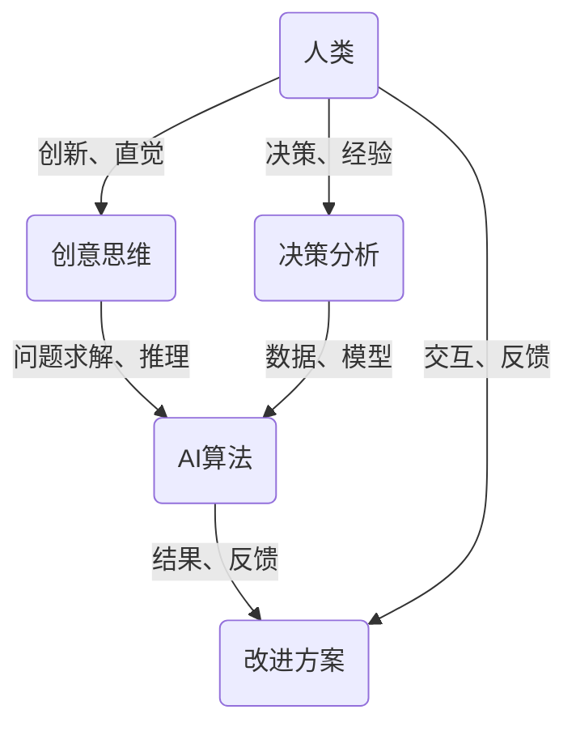

                 

关键词：人工智能，协作，增强现实，深度学习，人机交互，混合智能，智能增强，技术进步。

> 摘要：随着人工智能技术的快速发展，人类与AI的协作模式正逐渐形成，这为人类潜能的增强提供了前所未有的机会。本文将探讨人工智能如何与人类协同工作，推动人类在各个领域实现更高的效率、创新和创造力。

## 1. 背景介绍

人工智能（AI）的研究始于20世纪50年代，早期以逻辑推理和规则为基础的专家系统取得了初步成果。然而，随着计算能力的提升和大数据的普及，以深度学习和机器学习为代表的人工智能技术得到了空前的发展。如今，AI已经渗透到我们生活的方方面面，从智能手机的语音助手到自动驾驶汽车，从医疗诊断到金融分析，AI正在改变世界。

人类与AI的协作不仅仅是技术层面的结合，更是思维方式和认知模式的转变。人类在创新、决策和情感理解方面具有独特优势，而AI在数据处理、模式识别和计算能力方面具有显著优势。两者的结合有望创造出一种新型的混合智能系统，这种系统可以超越单一智能体的局限，实现更加高效、智能和创新的协作。

## 2. 核心概念与联系

为了更好地理解人类与AI协作的概念，我们可以通过一个简单的Mermaid流程图来描述核心概念和联系。



在这个流程图中，人类通过创意思维和决策分析为AI提供目标和指导，AI通过算法对大量数据进行处理和分析，生成结果和改进方案。然后，人类根据这些结果和反馈进行进一步的决策和优化。这一过程形成了一个闭环，使得人类与AI之间的协作不断迭代和优化。

## 3. 核心算法原理 & 具体操作步骤

### 3.1 算法原理概述

人类与AI协作的核心算法主要包括以下几个方面：

1. **深度学习**：通过多层神经网络模拟人类大脑的学习过程，对大量数据进行分析和识别。
2. **强化学习**：通过试错和反馈机制，让AI在特定环境中不断学习和优化策略。
3. **自然语言处理**：通过解析和理解自然语言，实现人类与AI之间的有效沟通。

### 3.2 算法步骤详解

1. **数据收集和预处理**：收集大量相关数据，并对数据清洗、格式化和标注。
2. **模型选择和训练**：根据任务需求选择合适的模型，并对模型进行训练和调优。
3. **交互和反馈**：人类与AI进行交互，AI根据反馈进行策略调整和优化。
4. **结果输出和评估**：输出最终结果，并对结果进行评估和优化。

### 3.3 算法优缺点

**优点**：
- **高效性**：AI能够快速处理大量数据，提高工作效率。
- **精确性**：AI在模式识别和计算方面具有很高的精确性。
- **可扩展性**：AI模型可以轻松地扩展到不同领域和任务。

**缺点**：
- **依赖数据**：AI的性能很大程度上依赖于数据质量和数量。
- **黑箱问题**：深度学习模型通常被视为“黑箱”，难以解释其决策过程。
- **隐私和伦理问题**：AI在处理人类数据时可能涉及隐私和伦理问题。

### 3.4 算法应用领域

- **医疗健康**：AI在医疗诊断、治疗方案推荐和药物研发等方面具有广泛应用。
- **金融科技**：AI在风险评估、投资策略和客户服务等方面发挥着重要作用。
- **智能制造**：AI在生产线优化、质量检测和设备维护等方面提高生产效率。

## 4. 数学模型和公式 & 详细讲解 & 举例说明

### 4.1 数学模型构建

人类与AI协作的数学模型可以基于以下三个核心组成部分：

1. **输入层**：包括人类提供的原始数据和AI模型需要的特征向量。
2. **隐藏层**：通过神经网络对输入特征进行变换和融合。
3. **输出层**：生成最终的决策结果或预测结果。

### 4.2 公式推导过程

假设我们使用一个简单的多层感知机（MLP）模型来描述人类与AI的协作，其公式如下：

$$
Y = \sigma(W_2 \cdot \sigma(W_1 \cdot X + b_1) + b_2)
$$

其中，\(X\) 表示输入特征向量，\(W_1\) 和 \(W_2\) 分别表示第一层和第二层的权重矩阵，\(b_1\) 和 \(b_2\) 分别为第一层和第二层的偏置项，\(\sigma\) 表示激活函数，如 sigmoid 函数或 ReLU 函数。

### 4.3 案例分析与讲解

假设我们要使用这个模型来预测股票价格，输入特征包括历史股价、成交量、宏观经济指标等。我们可以将输入特征向量表示为 \(X\)，输出结果为股票价格的预测值 \(Y\)。

1. **数据收集和预处理**：收集过去几年的股票数据，并对数据清洗、归一化处理。
2. **模型选择和训练**：选择一个合适的多层感知机模型，并使用收集到的数据对模型进行训练和调优。
3. **交互和反馈**：人类根据预测结果对模型进行调整和优化，以实现更好的预测效果。
4. **结果输出和评估**：将最终预测结果与实际股票价格进行比较，评估模型的预测准确性。

通过这个案例，我们可以看到数学模型在人类与AI协作中的重要作用。它不仅为人类提供了决策依据，还为AI提供了优化方向。

## 5. 项目实践：代码实例和详细解释说明

### 5.1 开发环境搭建

为了实现人类与AI的协作，我们需要搭建一个合适的开发环境。这里我们选择使用 Python 作为编程语言，并使用 TensorFlow 作为深度学习框架。

1. **安装 Python**：下载并安装 Python 3.8 或更高版本。
2. **安装 TensorFlow**：使用 pip 工具安装 TensorFlow：

```bash
pip install tensorflow
```

### 5.2 源代码详细实现

以下是一个简单的示例代码，实现了一个基于多层感知机的股票价格预测模型。

```python
import tensorflow as tf
import numpy as np

# 数据预处理
def preprocess_data(data):
    # 数据清洗、归一化处理等
    return data

# 模型定义
def create_model(input_shape):
    model = tf.keras.Sequential([
        tf.keras.layers.Dense(units=64, activation='relu', input_shape=input_shape),
        tf.keras.layers.Dense(units=32, activation='relu'),
        tf.keras.layers.Dense(units=1)
    ])
    return model

# 训练模型
def train_model(model, X, Y):
    model.compile(optimizer='adam', loss='mse')
    model.fit(X, Y, epochs=10, batch_size=32)
    return model

# 预测股票价格
def predict_stock_price(model, X):
    return model.predict(X)

# 主函数
def main():
    # 数据加载
    X, Y = load_stock_data()

    # 数据预处理
    X = preprocess_data(X)

    # 模型创建和训练
    model = create_model(X.shape[1:])
    model = train_model(model, X, Y)

    # 预测
    predicted_price = predict_stock_price(model, X)

    # 输出预测结果
    print("预测股票价格：", predicted_price)

if __name__ == "__main__":
    main()
```

### 5.3 代码解读与分析

1. **数据预处理**：数据预处理是深度学习项目的重要组成部分。在这个示例中，我们使用了 `preprocess_data` 函数对数据进行清洗和归一化处理。
2. **模型定义**：我们使用 `create_model` 函数创建了一个多层感知机模型。该模型由三层神经元组成，分别是输入层、隐藏层和输出层。
3. **训练模型**：我们使用 `train_model` 函数对模型进行训练。在这里，我们使用了 Adam 优化器和均方误差（MSE）损失函数。
4. **预测股票价格**：我们使用 `predict_stock_price` 函数进行股票价格预测。这个函数接收模型和输入特征，并返回预测结果。

### 5.4 运行结果展示

运行上述代码后，我们会在控制台输出预测的股票价格。这个结果可以作为人类决策的参考依据，从而实现人类与AI的协作。

## 6. 实际应用场景

人类与AI的协作在各个领域都有广泛的应用，以下是一些实际应用场景：

- **医疗健康**：AI可以帮助医生进行疾病诊断、治疗方案推荐和药物研发。例如，通过分析大量的医疗数据，AI可以预测患者的病情，为医生提供诊断依据。
- **金融科技**：AI在金融领域的应用包括风险评估、投资策略和客户服务。例如，通过分析市场数据和用户行为，AI可以预测股票价格走势，为投资者提供参考。
- **智能制造**：AI可以帮助企业优化生产线、提高生产效率和质量控制。例如，通过分析生产数据，AI可以预测设备故障，提前进行维护。
- **教育**：AI可以为学生提供个性化的学习建议和资源。例如，通过分析学生的学习行为，AI可以为学生推荐适合的学习路径。

## 7. 工具和资源推荐

为了更好地实现人类与AI的协作，以下是一些推荐的工具和资源：

- **学习资源**：[《深度学习》](https://www.deeplearningbook.org/)、[《Python深度学习》](https://www.pyimagesearch.com/)
- **开发工具**：[TensorFlow](https://www.tensorflow.org/)、[PyTorch](https://pytorch.org/)
- **开源项目**：[Keras](https://keras.io/)、[Scikit-Learn](https://scikit-learn.org/)

## 8. 总结：未来发展趋势与挑战

随着人工智能技术的不断进步，人类与AI的协作模式将越来越成熟。未来，我们有望看到以下发展趋势：

- **更加智能化的人机交互**：通过自然语言处理和情感计算，AI将能够更好地理解人类的需求和情感，提供更加智能化的服务。
- **跨领域的融合应用**：AI将在各个领域实现更深度的融合，推动各行业的创新发展。
- **隐私保护和伦理问题**：随着AI技术的广泛应用，隐私保护和伦理问题将变得越来越重要，需要制定相应的法律法规和伦理标准。

然而，人类与AI协作也面临着一些挑战：

- **数据隐私和安全**：AI在处理人类数据时可能涉及隐私和安全问题，需要采取有效的措施保护用户隐私。
- **算法透明性和解释性**：深度学习模型通常被视为“黑箱”，其决策过程难以解释，这可能导致信任问题。
- **就业和社会影响**：AI技术的发展可能会对就业和社会结构产生深远影响，需要制定相应的政策和措施。

总之，人类与AI的协作将为我们带来巨大的机遇和挑战。通过合理的规划和有效的协作，我们可以实现人类潜能的增强，创造一个更加美好的未来。

## 9. 附录：常见问题与解答

### 9.1 人类与AI协作的优势是什么？

**优势**：
- **提高效率**：AI可以处理大量数据，提高工作效率。
- **精确性**：AI在模式识别和计算方面具有高精确性。
- **创新能力**：AI可以提供新的解决方案，激发人类的创新思维。
- **减轻负担**：AI可以帮助人类减轻繁琐的工作负担。

### 9.2 人类与AI协作的挑战有哪些？

**挑战**：
- **数据隐私和安全**：AI在处理人类数据时可能涉及隐私和安全问题。
- **算法透明性和解释性**：深度学习模型的决策过程难以解释，可能导致信任问题。
- **就业和社会影响**：AI技术的发展可能会对就业和社会结构产生深远影响。
- **技术依赖性**：人类过度依赖AI可能导致技能退化。

### 9.3 如何确保AI在人类与AI协作中的公平性？

**措施**：
- **算法透明性**：确保AI算法的决策过程透明，便于人类理解和监督。
- **数据公平性**：确保训练数据的质量和代表性，避免偏见和歧视。
- **伦理审查**：对AI应用进行伦理审查，确保符合道德和法律标准。
- **用户参与**：鼓励用户参与AI系统的设计和评估，提高系统的公平性。

### 9.4 AI是否能够完全取代人类的工作？

**观点**：AI不能完全取代人类的工作。虽然AI在处理大量数据和执行重复性任务方面具有优势，但人类在创新、情感理解和复杂决策方面具有不可替代的优势。AI和人类应该相互补充，共同推动社会进步。

---

作者：禅与计算机程序设计艺术 / Zen and the Art of Computer Programming

